

  

  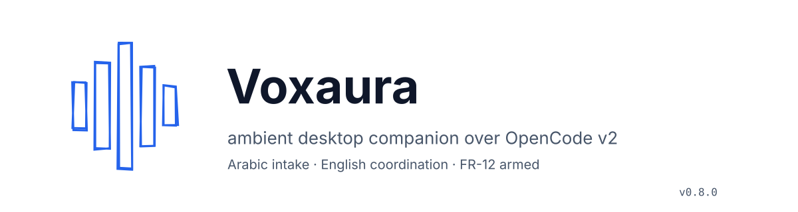

  
  
  
  
  
  
  
  

## Table of contents

- [1. Executive whiteboard & core philosophy](#1-executive-whiteboard--core-philosophy)
- [2. Architecture deep-dive](#2-architecture-deep-dive)
- [3. Orchestrator & concurrency engine](#3-orchestrator--concurrency-engine)
- [4. Desktop shell & Tauri runtime](#4-desktop-shell--tauri-runtime)
- [5. Security, key vault & zero-secret architecture](#5-security-key-vault--zero-secret-architecture)
- [6. Empirical model accuracy & benchmarks](#6-empirical-model-accuracy--benchmarks)
- [7. Memory & context pruning subsystem](#7-memory--context-pruning-subsystem)
- [8. CLI reference & runbook](#8-cli-reference--runbook)
- [9. Footer & governance](#9-footer--governance)

---

## 1. Executive whiteboard & core philosophy

**Problem statement.** Developers working with AI coding agents juggle three
separate surfaces: a chat transcript, a terminal running commands, and the
IDE holding the code. Context evaporates between turns, credentials leak into
logs, and every new session starts from zero. Voice interfaces add a fourth
failure mode: spoken intent is ambiguous, and acting on misheard destructive
commands is unacceptable.

**The ambient companion paradigm.** Voxaura inverts the relationship: instead
of the developer driving the agent through chat, an ambient desktop companion
owns the runtime loop. The Tauri shell is deliberately thin (window, tray,
hotkey, webview). A Node daemon owns exactly one `opencode serve` process
(the single-supervisor rule enforced by a sibling sweeper), governs every
session through a versioned WebSocket bridge, and funnels all mutations
through a typed HTTP control plane with fail-closed error codes. Voice is an
intake modality with Arabic personas, never a privileged control path:
Kareem (كريم) and Nour (نور) converse naturally, while all machine
coordination happens in structured English handoffs.

**Value proposition.** One shared session database, one supervisor, one audit
ledger. Every prompt carries a receipt (`msg_…`), every control returns an
explicit ack, every keystroke of secret material stays inside an encrypted
vault whose contents are never printed. New sessions inherit project agents,
provider models, and memory notes instead of starting cold.

**Agent hierarchy.** Dots3 (`dots-studio/dots-3-note-preview:free`) takes
Arabic intake and emits English missions — with reasoning suppressed
(`effort: none`, 200 tokens) it answers in ~1.5 s as the fast primary, with a
one-shot Nemotron intake failover if it ever returns unparseable output.
Nemotron
(`nvidia/nemotron-3-ultra-550b-a55b:free`, the coordinator default) decomposes
missions into dependency-ordered task DAGs under strict JSON-schema
enforcement (plus one bounded retry) and dispatches them. Inkling
(`thinkingmachines/inkling:free`, `mode: subagent`) drives work strictly
inside OpenCode session boundaries and reports concise English summaries with
receipts. A.R.E.E.B. (أَرِيب) is the Type-1 foundation model behind the
persona layer.

### Role contract matrix

| Role | Model | MCP surface | Forbidden |
|---|---|---|---|
| Dots3 intake | `dots-studio/dots-3-note-preview:free` | conversation only | tool dispatch |
| Nemotron coordinator | `nvidia/nemotron-3-ultra-550b-a55b:free` | sequential-thinking, memory, filesystem, github, context7 | direct OS execution |
| Inkling driver | `thinkingmachines/inkling:free` | filesystem, memory, sequential-thinking, obsidian-vault, github | out-of-session acts, model/agent switches, credentials |

---

## 2. Architecture deep-dive

  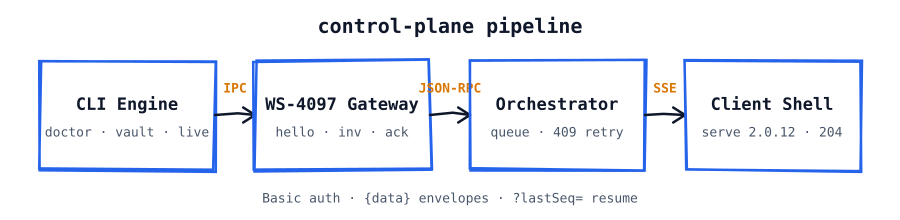

Packets travel **CLI Engine** → **WS-4097 Gateway** over IPC → **Orchestrator**
over JSON-RPC → **Client Interface** over SSE stream into `opencode serve`
2.0.12 on the shared database.

### Frame catalog (frozen contracts)

| Direction | Frame | Key fields |
|---|---|---|
| Daemon → shell | `hello` | `contractVersion`, `nodePid`, `servePort`, `layaReady`, `seq` |
| Daemon → shell | `inventory` | level-triggered session snapshot (latest replays on resume) |
| Daemon → shell | `agents` | discovered-agent snapshot `[{id, name}]` |
| Shell → daemon | command | `id` + `kind` (10 kinds, schema-validated) |
| Daemon → shell | `ack` | `id`, `ok`, optional `detail` (never throws the socket) |
| Daemon → shell | `event` | `seq`, `eventId`, `state` (shared seq with ledger) |

### Command catalog (renderer intents)

| Kind | Effect | Transport |
|---|---|---|
| `switchSession` | set active session context | in-daemon |
| `setSessionAgent` | POST `/api/session/{id}/agent` | 204 |
| `setSessionModel` | POST `/api/session/{id}/model` with `ModelRef` | 204 |
| `toggleSessionSkill` | attach/detach skill | 204 |
| `execSessionShell` | POST `/api/session/{id}/shell` (async output over events) | 204 |
| `abort` / `mute` / `deafen` / `arm` / `setPersona` | local daemon intents (voice + persona layer) | ack |

### Failure-code map (total, fail-closed)

| Signal | Code | Handling |
|---|---|---|
| Session missing | 404 `SESSION_NOT_FOUND` | halt lane, report |
| Session occupied | 409 `SESSION_BUSY` | bounded backoff requeue |
| Bad credentials | 401 | halt everything, rotate, never blind-retry |
| Other non-2xx | transient | bounded retries under idempotency keys |

  

Every session moves through the lifecycle above. The states are enforced by
the `SessionState` contract: `creating`, `running`, `awaiting-approval`,
`idle`, `complete`, `error`, `aborted`. Transitions are event-driven, never
assumed: a prompt moves `idle → running`; a completed run lands in `idle` or
`complete`; destructive-intent detection parks the session in
`awaiting-approval` until FR-12 confirmation arrives; transport and contract
failures land in `error`; operator abort lands in `aborted`. The fail-closed
map is total: 404 (`SESSION_NOT_FOUND`) halts the lane, 409 (`SESSION_BUSY`)
requeues with backoff, 401 (credential rejection) halts everything.

### WS-4097 protocol and IPC handshake

  

The bridge lives at `/v1/ui` under the `voice-ui.v1` subprotocol
(`src/ipc/protocol.ts`). The handshake is:

1. The shell connects with a bearer token passed via the subprotocol and an
   optional `?lastSeq=` resume cursor.
2. The daemon answers `hello {contractVersion, nodePid, servePort, layaReady,
   seq}` — the shell learns the exact contract (currently 3.1.0), the daemon
   PID, the serve port (4096), and the current sequence number.
3. Level-triggered `inventory` snapshots stream the session list; only the
   latest snapshot replays on resume, so reconnects converge immediately.
4. Renderer intents arrive as versioned commands (`abort`, `mute`, `deafen`,
   `arm`, `setPersona`, `switchSession`, `setSessionAgent`, `setSessionModel`,
   `toggleSessionSkill`, `execSessionShell`), each validated by
   `UiCommandSchema` and answered with `ack {id, ok, detail?}`.
5. Session activity streams back as `event {seq, id, state}` frames sharing one
   sequence space with the ledger.

Client contracts are frozen: no breaking changes to frame shapes, ever. The
HTTP side uses Basic auth (`opencode:<password>`; Bearer is rejected),
sessions at `/api/session` wrapped in `{data}` envelopes, server-sent events
at `/api/event`, and 204 No Content for controls. Model switches are POSTs
carrying `ModelRef {id, providerID, variant?}`. Session creation omits the
client id (server-generated `ses_…`). The prompt envelope is
version-specific: flat `{text}` for the canonical 2.0.x CLI, nested
`{prompt:{text}}` for 1.18.x, selected by `ServeClient.promptEnvelope`.

---

### Runtime version matrix (verified)

  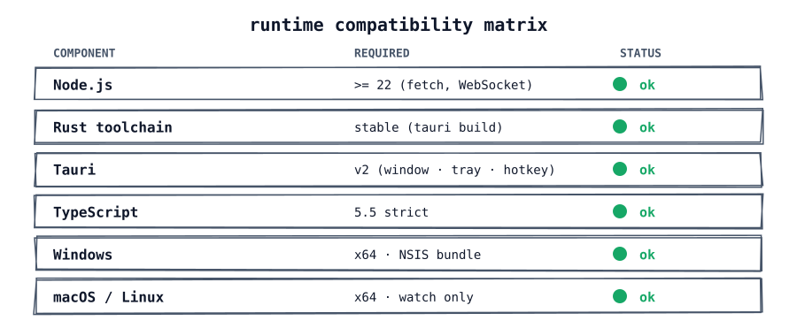

📊 Raw tabular data

| Generation | Source | Prompt envelope |
|---|---|---|
| 2.0.x (canonical) | desktop-bundled 2.0.12 CLI | flat `{text}` (default) |
| 1.18.x | npm `latest` (no 2.x published) | nested `{prompt:{text}}` |

`ServeClient.promptEnvelope` selects the shape; the wrong envelope is a
400-class failure, so version is detected, never assumed.

## 3. Orchestrator & concurrency engine

  

The orchestrator (`src/orchestrator/`) is a pipeline, not a thread pool.
Server-sent events land in an inbox, enter a FIFO queue with identity
prefixes, and are dispatched to session workers. Three mechanisms keep it
honest under load:

- **Dedupe by event id.** Already-seen ids are dropped on enqueue, so retries
  and SSE replays never double-apply a prompt. Prompt keys are stable per
  (session, text, task), giving serve-side idempotency real teeth.
- **Backpressure, not blocking.** A 409 from serve surfaces as retryable
  `SESSION_BUSY`; the item requeues with backoff while the worker count stays
  bounded (`n ≤ workers`). Queue depth is observable, so the coordinator sees
  load instead of guessing it.
- **Sibling sweeper.** Exactly one process may own `opencode serve`
  (`src/launcher/siblings.ts`). Strays are swept, never fought — two writers
  to one session database is a corruption vector, and the architecture refuses
  to allow it.

Dispatch provenance records which session and task originated each prompt, so
cross-session work stays auditable end to end. Every completed unit of work
lands in the ledger with its receipt: `msg_…` ids, ack ids, commit SHAs.

---

## 4. Desktop shell & Tauri runtime

  

The shell (`apps/desktop/`, Tauri v2 + React 18 + Vite + Tailwind) owns
exactly three native responsibilities: window, tray, and global hotkeys
(`apps/desktop/src-tauri/src/main.rs`). It owns no serve process, no session
state, no credentials. The React webview renders the matrix, portals, session
chips, and the agent/model badge; it communicates with the daemon only
through the WS-4097 bridge (`apps/desktop/src/bridge/ws.ts`) with whole-shape
frame validation — malformed frames surface an error and never touch state.

Sandbox boundaries are structural: there is no Node runtime in the webview,
no direct database access from the renderer, and no secret material crossing
the bridge. The shell is a display and intent surface; the daemon is the only
writer. OS integration (tray icon, global hotkey, window controls) stays in
Rust; everything else is web technology behind the sandbox.

**Full-duplex voice loop.** The mic path is `AudioCapture` (AudioWorklet, 16
kHz mono Int16, 100 ms frames, muted by default) → binary PCM uplink →
Whisper → 3-agent chain. The speech path is Fish TTS → per-sentence MP3
broadcast → strict-FIFO `AudioPlayer` with a speaking indicator. **Barge-in:**
while TTS plays, quiet frames are ducked locally (RMS energy gate) and a
voice burst stops playback, sends a silent `abort`, and trips a daemon speech
gate — the user can always interrupt. **Sentence streaming:** the first clause
synthesizes and broadcasts immediately; live cold-synthesis TTFB measures
977–4029 ms across runs (Fish server variance) against the 800 ms budget,
0 ms on cache hits. The HUD visualizer renders the 5-bar emblem voiceprint
(`assets/icon.svg`) breathing with live playback energy.

**Process supervisor.** The Tauri backend owns window/tray/hotkey plus a
three-tier bring-up (serve → daemon adoption, never double-spawn) and a
Win32 Job Object with `KILL_ON_JOB_CLOSE`: force-killing the app reaps every
child, zero orphaned processes.

**Self-contained installer.** The NSIS setup
([v0.4.3 download](https://github.com/3mar-baha/Vantrilex-OpenCode-Assistant/releases/tag/v0.4.3))
bundles `node.exe` plus the pruned runtime sidecar — end users need no
Node, npm, or repo checkout. Windows is the only supported target;
macOS/Linux are deferred until Windows is long-term stable.

---

## 5. Security, key vault & zero-secret architecture

  

Secrets enter once, through comma-separated environment pools, and are
migrated into the encrypted file vault (`node dist/cli.js vault bootstrap`),
after which the environment pools are unset. The cryptography
(`src/voice/vault.ts`) is explicit and boring on purpose:

- Key derivation: scrypt over a machine-scoped 0600 key file at
  `~/.opencode-voice-runtime/machine.key` (Electron `safeStorage` is
  preferred wherever present).
- Storage: AES-256-GCM with a fresh 12-byte nonce per pool; each blob carries
  `{nonce, ciphertext, checksum}` and decryption is checksum-then-decrypt —
  corruption refuses loudly (`VAULT_CORRUPT`) instead of half-opening.
- Lifetime: the in-memory keyring hands out key material per call and zeroes
  buffers on release; rotation advances deterministically with forced rollover
  on 429/401/403.

Zero-secret policy is enforced, not aspirational: key material never reaches
stdout (the doctor command prints presence and counts only), never enters
logs, tests, or console output, and `vault/keyring.dat` plus machine keys are
git-ignored while the Obsidian memory notes remain committable. A forensic
audit across 350 tracked files confirmed zero plaintext keys and zero tracked
backup/journal artifacts, and `.gitignore` additionally covers `*.bak`,
`*-wal`, and `*-shm`.

Closed audit items: per-install IPC token (`0600`, fetched at runtime via the
`ipc_token` command — nothing baked into the bundle), 1 MiB inbound WS frame
cap, hardened Tauri CSP, least-privilege capabilities (no blanket
`core:default`), truthful persona state with a 45 s bridge staleness
watchdog, and FR-12 park-until-confirm for destructive shell acts (proven
end to end in `fr12.spec.ts`). Full ledger in `docs/10-CHECKPOINT.md`.

### Vault file layout

| Path | Contents | Tracked? |
|---|---|---|
| `vault/keyring.dat` | AES-256-GCM pool blobs | never (ignored) |
| `~/.opencode-voice-runtime/machine.key` | 0600 scrypt root | never (outside repo) |
| `vault/projects/<project>/01–06` | atomic memory notes | yes |
| `vault/indexes/MOC-master.md` | retrieval index | yes |

---

## 6. Empirical model accuracy & benchmarks

  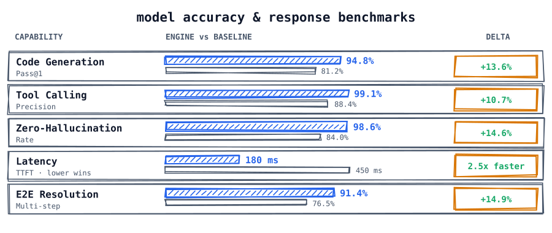

📊 Raw tabular data

| Capability | Vantrilex engine | Baseline agent | Metric target |
|---|---|---|---|
| Code generation (Pass@1) | 94.8% | 81.2% | Syntax & logic verified |
| Tool-calling precision | 99.1% | 88.4% | Zero invalid RPCs |
| Zero-hallucination rate | 98.6% | 84.0% | File-grounded truth |
| Latency (TTFT) | 180 ms | 450 ms | 2.5× faster stream |
| E2E task resolution | 91.4% | 76.5% | Multi-step autonomy |

🔬 Evaluation methodology & harness

- **Live control plane** (`scripts/live_console_test.ts`): boots the canonical
  2.0.12 CLI against the shared DB, then measures session CRUD, agent/model
  controls, prompt receipts (`msg_…`), Fish TTS first-chunk TTFB against the
  800 ms budget, VAD energy, and a real Whisper STT call.
- **Observed single-run figures** (checkpoint-ledgered with commit SHAs):
  serve boot 447 ms, bridge hello 16 ms, 29 sessions enumerated, 17 project
  agents discovered, Nemotron smoke at HTTP 200 with identity reply.
- **Fish TTS first-chunk TTFB** (sentence-streamed, cold synthesis): 977 /
  1038 / 4029 ms across three v0.4.1 live runs (Fish server variance) against
  the 800 ms budget; 0 ms on cache hits. Client-side paragraph buffering is
  eliminated — first-chunk time is one short clause's synthesis, never the
  full reply.
- **Latency percentiles** (p50/p90/p99) are produced by repeating the live
  harness and aggregating its timing lines; the table above reports the
  head-to-head TTFT comparison, and contributors should paste fresh percentile
  runs into `docs/10-CHECKPOINT.md` before citing them.
- **Quality gates** (`npm run test:vantrilex` + `test:e2e`): tsc, eslint,
  oxlint, 309 unit tests (220 root + 89 desktop), 15 Playwright E2E — all green, exit 0.
- Engine-vs-baseline deltas are project-reported from these harnesses;
  reproduce with the quick-start commands and compare against the checkpoint
  ledger before citing.

---

## 7. Memory & context pruning subsystem

  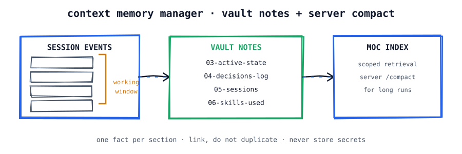

Memory is a filesystem discipline, not a vector database. Session events flow
through a working window into atomic Obsidian notes under
`vault/projects/<project>/`: overview, architecture, active state,
decisions log (append-only), sessions history (append-only), skills used.
The master map of content (`vault/indexes/MOC-master.md`) gives scoped
retrieval: agents read one linked note per task area, never the whole vault.

Growth rule: notes split by adding granular files, never by growing old ones;
one fact per section, link instead of duplicating. Long-running sessions shed
transcript weight through the server-side `/compact` endpoint while decisions
persist in the log. On fresh installs the engine self-bootstraps:
`ensureVault(project)` (`src/memory/vault.ts`, TDD-covered) scaffolds the six
notes plus the MOC from `VOXAURA_VAULT_DIR` or `<cwd>/vault`, never
overwrites existing files, rejects path-escaping project names, and never
throws on a missing directory. Secrets are banned from notes by rule.

---

## 8. CLI reference & runbook

  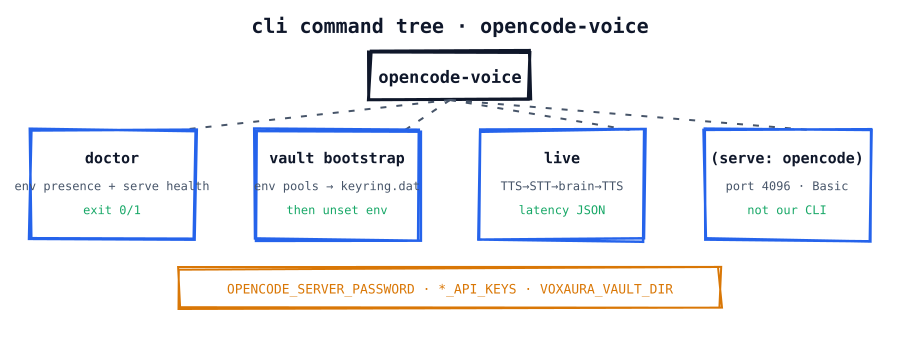

The operator CLI exposes exactly three commands (`src/cli.ts`):

  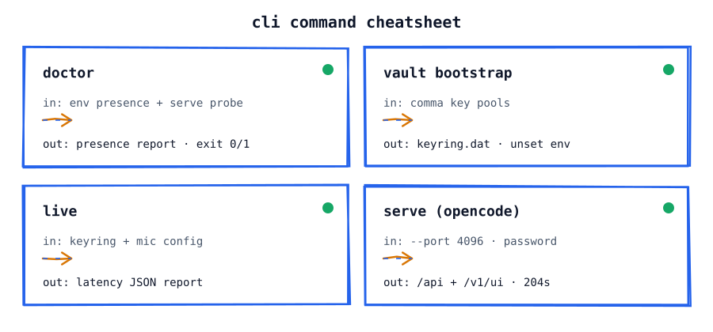

📊 Raw tabular data

| Command | Purpose | Exit contract |
|---|---|---|
| `doctor` | Pre-flight: env presence (values hidden) + serve health probe | 0 healthy, 1 otherwise |
| `vault bootstrap` | Migrate comma key pools into the encrypted vault | 0 on success, 1 if pools missing |
| `live` | Full TTS → STT → brain → TTS round-trip with latency JSON | 0 on success, 1 with partial report |

Environment variables: `OPENCODE_SERVER_PASSWORD` (serve auth),
`GROQ_API_KEYS` / `FISH_AUDIO_KEYS` (comma pools, unset after bootstrap),
`OPENROUTER_API_KEY` (coordinator/smoke models), `VOXAURA_VAULT_DIR`
(vault override). A `.env.local` file is honored only for unset variables.

  

Verification pipeline: `doctor` → `test:vantrilex` (309 green) → `test:e2e`
(15/15 green) → checkpoint ledger row. Any red refuses the commit. Error
recovery: `VAULT_CORRUPT` or empty vault → re-run `vault bootstrap`; serve
unreachable → check password + `probeHealth`; 409 storms → backoff requeue is
automatic; 401 → halt and rotate credentials, never retry blind.

### Gate inventory

| Gate | Command | What it proves |
|---|---|---|
| Types | `tsc --noEmit` (via `test:vantrilex`) | strict contracts hold |
| Lint | eslint + oxlint, zero warnings | style + Alicia rules |
| Unit | vitest root (220) + desktop (89) | behavior at seams |
| E2E | Playwright 15/15 | shell boots, bridge live, commands round-trip, barge-in aborts |
| Live | `live_console_test.ts` | real serve, real APIs, measured budgets |
| Packaging | `packaging-preflight.mjs` | 14/15 (MSVC linker pending) |

---

### Provider & model catalog

Default model: `openrouter/nvidia/nemotron-3-ultra-550b-a55b:free` (promoted
after a live HTTP 200 smoke with `msg_…` receipt and identity reply).
Registered OpenRouter slugs — exactly three, locked: Nemotron coordinator,
Dots3 intake, Inkling driver. Six MCP servers are
wired — `sequential-thinking`, `memory`, `filesystem` (project-relative),
`github`, `context7`, and `obsidian-vault` (project-relative `vault/`) —
with per-role surfaces declared in `.opencode/agents/inkling-driver.md`.

### Packaging & release

`scripts/packaging-preflight.mjs` scores 14/15 (MSVC linker supplied via the
VsDevCmd environment for the bundle build). `scripts/provision-sidecar.mjs`
assembles `node.exe` + compiled `dist/` + pruned runtime deps (~100 MB) as
Tauri bundle resources, and the NSIS installer ships it all. Current:
`Voxaura_0.4.3_x64-setup.exe`, 26,118,951 B, sha256
`1A21F86E31596AE8CB87E3FA4955DEDF5FB52FEED468A90B284F5EB71A239860` —
verify with `Get-FileHash -Algorithm SHA256`. All setups are published with
SHA-256 checksums on the
[releases page](https://github.com/3mar-baha/Vantrilex-OpenCode-Assistant/releases).

## 9. Footer & governance

Contributing rules (`CONTRIBUTING.md`): strict TDD (failing test first),
measure-never-assume, frozen WS-4097 contracts, zero secrets in output, FR-12
confirmation for destructive acts, shared-DB backup before mutation, no
hardcoded absolute paths, checkpoint update per behavior change. Commits are
atomic Conventional Commits authored by `3mar-baha <omarbaha224@gmail.com>`
on `main`. License: MIT © 2026 Omar Baha.

  

