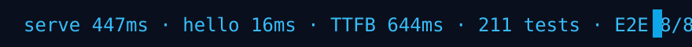
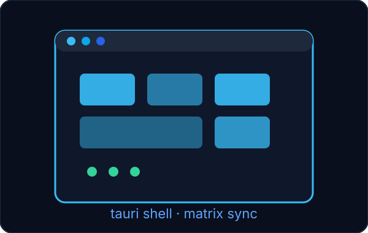
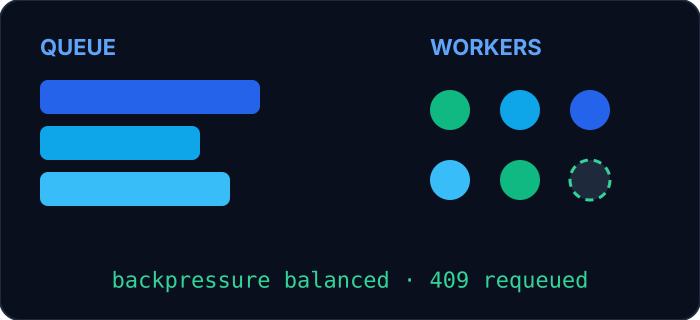
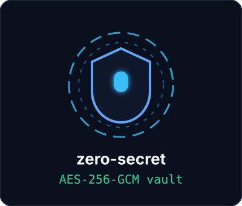
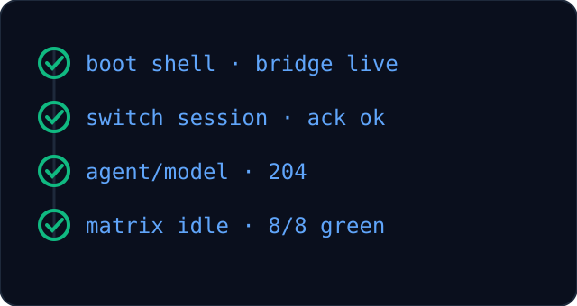

<p align="center">
  
</p>
<p align="center">
  
</p>

<p align="center">
  <a href="docs/10-CHECKPOINT.md"></a>
  <a href="apps/desktop/e2e"></a>
  <a href="LICENSE"></a>
  <a href="apps/desktop/src-tauri/Cargo.toml"></a>
  <a href="package.json"></a>
  <a href="docs/RAG-ORCHESTRATOR-INTEGRATION.md"></a>
  <a href="README.ar.md"></a>
</p>

Decoupled ambient voice + runtime orchestrator. The Tauri v2 shell talks to a
Node daemon, which governs OpenCode v2 sessions over a versioned WebSocket
bridge (WS-4097) and a typed HTTP control plane. Arabic voice intake, English
machine coordination, hierarchical agents: Dots3 → Nemotron → Inkling.

## Performance & observability

<table>
  <tr>
    <td align="center" width="50%">
      
    </td>
    <td align="center" width="50%">
      
    </td>
  </tr>
</table>
<p align="center">
  
</p>

Measured on the live control plane: serve boot 447 ms, bridge hello 16 ms,
Fish TTS first-chunk TTFB 644 ms against an 800 ms budget. Gates hold at
211 unit tests green plus 8/8 Playwright E2E.

## Architecture & data flow

<p align="center">
  
</p>

Packets travel CLI → WS-4097 bridge (hello / inventory / ack, `?lastSeq=`
resume) → Node orchestrator (queue, backpressure, sibling-serve protection) →
`opencode serve` 2.0.12 on the shared DB (Basic auth, `{data}` envelopes,
204 controls, flat `{text}` prompt envelope).

<details>
<summary>ASCII topology</summary>

```text
┌──────────────┐   WS-4097    ┌──────────────────┐   HTTP/Basic   ┌────────────────┐
│ Voxaura shell│◄────────────►│  Node daemon     │◄──────────────►│ opencode serve │
│ Tauri+React  │ hello/inv/ack│ orchestrator     │ /api/session   │ 2.0.12 CLI     │
└──────────────┘              │ queue/backpress. │                │ shared DB      │
                              └────────┬─────────┘                └────────────────┘
                                       │ skills / vault / RAG
                              ┌────────▼─────────┐
                              │ Dots3 → Nemotron │  Obsidian vault/
                              │     → Inkling    │  .opencode/agents/
                              └──────────────────┘  docs/RAG-*.md
```

</details>

## Platform capabilities & desktop shell

<p align="center">
  
</p>

<table>
  <tr>
    <td align="center" width="33%">
      
    </td>
    <td align="center" width="33%">
      
    </td>
    <td align="center" width="33%">
      
    </td>
  </tr>
</table>

## 60-second quick start

```bash
npm install
npm run build
node dist/cli.js doctor        # pre-flight: env, serve health (values hidden)
node dist/cli.js vault bootstrap  # migrate key pools into the encrypted vault
node dist/cli.js live          # full TTS → STT → brain → TTS round-trip
```

```bash
npm run test:vantrilex         # typecheck + lint + unit (root + desktop)
cd apps/desktop && npm run test:e2e   # Playwright shell suite
```

Live console against the real control plane:

```bash
node scripts/live_console_test.ts
```

First boot scaffolds the Obsidian memory vault automatically
(`vault/projects/voxaura/`); missing notes are templated, existing files are
never overwritten. Override location with `VOXAURA_VAULT_DIR`.

## Docs map

- `docs/10-CHECKPOINT.md` — gate ledger and live verification history.
- `docs/RAG-ORCHESTRATOR-NEMOTRON.md` — coordinator decomposition/governance.
- `docs/RAG-INKLING-OPENCODE-DRIVER.md` — in-session driver rules.
- `docs/RAG-ORCHESTRATOR-INTEGRATION.md` — bridge topology and lifecycle.
- `.opencode/agents/inkling-driver.md` — confined subagent definition.
- `README.ar.md` — النسخة العربية الكاملة.
- `CONTRIBUTING.md` — gates, TDD, FR-12, branch hygiene.

<p align="center">
  
</p>
