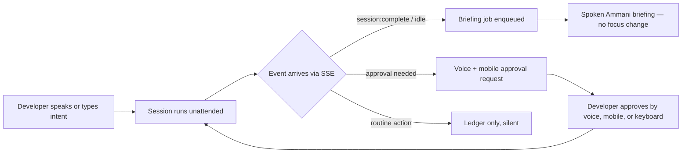

# 02 — Product Specification: Ambient Experience, Zero-Focus Interaction & Audio Briefings

> **Canonical status:** Foundation. UX truth. Implements FR-4, FR-9, FR-11, FR-12 (see `01`).
> Companion docs: `21-DESIGN-SYSTEM.md` (audio identity), `18-VOICE-PIPELINE.md` (pipeline).

## 2.1 — Ambient Interaction Model

The product is **ambient**: it acts peripherally, never modally. The developer's attention
is the scarcest resource; the orchestrator spends it only on meaning.

**Core loop:**

**Three attention tiers (normative):**

| Tier | Trigger events | Surface | May it interrupt speech? |
|------|---------------|---------|--------------------------|
| T0 silent | `agent:action` routine steps, intermediate retry attempts (chime only) | Ledger + CLI status line only | Never |
| T1 briefing | `session:complete`, `session:idle`, `subagent:complete` (summary), 5-min/3-fail heartbeats | Spoken briefing + log entry | Queues behind active speech |
| T2 approval | Explicit agent approval request, error requiring decision | Voice prompt + mobile push + CLI highlight | Preempts T1 with earcon + identity prefix |

**Loop cadence (normative):** no speech during intermediate iterative attempts — a subtle
chime only. A spoken progress heartbeat fires every 5 minutes or after 3 consecutive
failed cycles. A hard circuit breaker halts the loop after 5 consecutive failures and
requests human guidance; no silent sixth attempt.

## 2.2 — Zero-Focus-Stealing Contract

The orchestrator SHALL NOT, under any circumstance: move OS focus, raise or minimize
windows, seize the microphone while the user is in another call, or require modal
acknowledgment. Formal contract:

1. Audio output uses a background-capable playback path (no foreground window handle).
2. Briefing jobs never call window-focus APIs; the CLI status renderer writes to its
   own console buffer only.
3. Microphone capture is push-to-talk or wake-word gated — never open-mic continuous
   surveillance. Capture state is always visible (tray/CLI indicator).
4. Approval requests expire into safe defaults (pause session, ledger note) rather than
   blocking indefinitely. Pre-authorized classes (`AGENTS.md`): read-only and
   non-destructive tasks (tests, linting, build inspections) proceed; destructive tasks
   (migrations, pushes, deployments) hold indefinitely until explicitly approved.
5. Fullscreen/gaming: automatic audio-ducking (−40% background volume during speech)
   preceded by the attention earcon. Meeting/screen-share: active microphone use by
   communication tools (Zoom, Meet, Discord, Teams) or a global Do-Not-Disturb toggle
   mutes spoken audio completely, falling back to discreet desktop notifications.

**Verification:** focus-log harness (`11-TESTING.md`) asserts zero foreground
activations across 50 completion injections.

## 2.3 — Audio Briefing Ergonomics

### 2.3.1 BLUF structure (Bottom Line Up Front, shaped for ears)

Every T1 briefing follows this spoken order — outcome first, because listeners cannot
re-scan audio:

1. **Identity + outcome (≤ 15 words):** session identity plus outcome first. Single
   active project: the project name is omitted. Multiple concurrent projects: the
   project name is embedded naturally in the agent's own phrasing.
2. **What changed (1–3 clauses):** files touched, tests result, errors if any.
3. **Next action (one sentence):** what the agent will do next, or what it needs.
4. Total spoken length ≤ 45 seconds (failure briefings ≤ 15 seconds); longer detail
   stays in the log and is offered rather than recited.

**Failure briefing shape (normative, BLUF):** (1) core failure state, (2) affected
modules + failure count, (3) confirmation that detailed logs are saved, (4) proposed
immediate next step. Never read raw stack traces or line numbers over audio.

### 2.3.2 Concurrency: the speech queue (P2 requirement)

Concurrent completions serialize through a FIFO speech queue with identity prefixes.
Never overlap audio streams. Queue policy:

- T2 preempts T1 only at utterance boundaries, preceded by the attention earcon (`21`).
- Failures take precedence over successes (failure-first): a success briefing already
  playing is allowed to conclude briefly (< 5 s), then the failure briefing plays.
- A second T1 arriving mid-briefing waits; its identity is announced when it plays.
- Queue depth > 3 collapses older T1s into a digest ("two more sessions finished — all green").

### 2.3.3 Language boundary (normative)

- **Spoken track:** authentic Ammani Jordanian Arabic exclusively for all narrative,
  connective, and explanatory speech.
- **Preserved English:** code identifiers, file paths, terminal log excerpts, error
  codes, session names derived from repos, CLI commands. These are read in technical
  English pronunciation, never transliterated into Arabic script mid-audio.
- The brain prompt system (`18`) enforces this with a language-audit test: zero
  non-technical English words in narrative spans; zero Arabic inside code spans.

## 2.4 — Prompt Conversion UX (voice → session prompt)

When the developer speaks an intent, the pipeline converts it to a session prompt:

1. STT transcript (verbatim, bilingual preserved) → shown on CLI for 3 s (correction window).
2. Brain classifies: **new session** vs **follow-up prompt** vs **control command**
   (approve / cancel / repeat briefing / switch voice).
3. Control commands execute locally without touching `opencode serve`.
4. Session prompts are sent via `session.prompt` with the original transcript attached
   as provenance metadata in the ledger.

**Correction UX:** saying "no, I meant…" within the window replaces the pending prompt;
after dispatch, corrections become follow-up prompts (never silent edits — ledger shows both).

**High-stakes confirmation gate (normative, FR-12):** destructive verbs (`destroy`,
`delete`, `drop`, `force-push`, `deploy`, `rm -rf` and equivalents) always require an
explicit two-way voice/text confirmation before execution — no exceptions for correction
windows or autonomy level. Ambiguous destructive speech is never acted upon: the agent
asks, then waits.

**Barge-in (normative):** a hotkey trigger or verbal stop cuts spoken audio instantly
(< 50 ms, no fade-out tail). The active session immediately pauses to idle, awaiting the
user's redirect directive.

## 2.5 — CLI Status Typography (companion to `21`)

The CLI is the silent partner: one status line per session
(`● payments-refactor · running · 3m12s · last: tests green`), updated in place.
Full-screen redraws are forbidden during unattended runs. Color is semantic only
(green = complete, amber = approval-waiting, red = error) and never the sole carrier
of meaning (symbols + text accompany color).

## 2.6 — Failure UX

| Failure | User-facing behavior |
|---------|---------------------|
| STT failure | "Didn't catch that — say it again" (once), then text-prompt fallback |
| Brain timeout (> 5 s) | Concise fallback briefing + ledger flag (`18`) |
| TTS outage | Log-first briefing; cached phrases still play from LRU |
| Approval expiry | Session pauses; T1 briefing notes what is waiting and the safe default taken |
| Dual degradation (slow brain + slow TTS during T2) | Strict hierarchy: (1) CLI text immediately (< 200 ms), (2) stream audio as chunks arrive, (3) spoken holding pattern only if latency > 3.5 s while user is away |

## 2.7 — Microphone and Settings UI (FR-11, normative)

A status-bar microphone control matching OpenCode's native UI styling:

- **Left-click:** instant toggle Armed (active listening — the launch default) vs
  Disarmed (capture fully off).
- **Mute-listen toggle:** microphone input muted (no ambient room capture) while the
  agent continues delivering spoken briefings and alerts (Ambient Output Mode).
- **Right-click:** centered modal dialog in the dark surface aesthetic containing:
  1. Voice persona selector (male default / female toggle) applying globally;
  2. Test-speech trigger auditioning the chosen voice with an Ammani phrase;
  3. Credential pool management (Fish Audio + Groq key arrays, 10-request rotation
     display) writing exclusively through the vault path — the modal never holds
     plaintext.

---

*End of `02-PRODUCT-SPECIFICATION.md`. Next: `03-TECHNICAL-SPECIFICATION.md`.*
