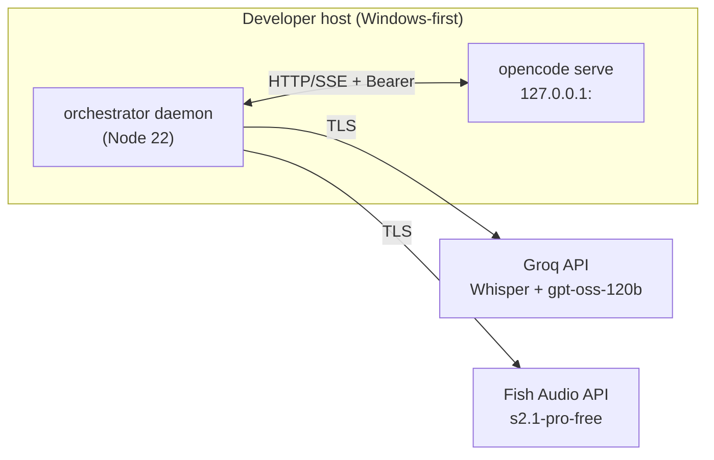

# 03 — Technical Specification: Runtime Engine, TypeScript Strictness, Dependencies & Network

> **Canonical status:** Foundation. Implements FR-1, FR-2 and NFR-5/NFR-8 (see `01`).
> Companion docs: `04-ARCHITECTURE.md`, `06-API-SPECIFICATION.md`, `26-AGENT-LAUNCHER.md`.

## 3.1 — Runtime Engine

| Decision | Value | Reason |
|----------|-------|--------|
| Primary runtime | Node.js 22 LTS (Active) | `opencode serve` child-process management, `safeStorage` DPAPI access, and `@opencode/client` compatibility are Node-first |
| Alternate runtime | Bun ≥ 1.1 (supported, not default) | Faster startup for CLI-only paths; excluded where Electron `safeStorage` DPAPI binding is required |
| Package manager | `pnpm` (default) / `npm` (fallback) | Deterministic lockfile; fallback keeps `13-DEPLOYMENT.md` portable |
| Language | TypeScript 5.x, `strict` family (see §3.2) | Entire `src/` is typed; no unchecked boundaries except API ingress points |
| IPC | stdio (supervised child) + localhost HTTP/SSE | Matches `opencode serve` contract; no custom sockets |

### 3.1.1 `tsconfig.json` (normative, project root)

```json
{
  "compilerOptions": {
    "target": "ES2023",
    "module": "NodeNext",
    "moduleResolution": "NodeNext",
    "strict": true,
    "noUncheckedIndexedAccess": true,
    "exactOptionalPropertyTypes": true,
    "noImplicitReturns": true,
    "noFallthroughCasesInSwitch": true,
    "forceConsistentCasingInFileNames": true,
    "skipLibCheck": true,
    "declaration": true,
    "sourceMap": true,
    "outDir": "dist",
    "rootDir": "src",
    "types": ["node"]
  },
  "include": ["src/**/*.ts"],
  "exclude": ["node_modules", "dist", "**/*.test.ts"]
}
```

### 3.1.2 Source layout (normative)

```
src/
  runtime/        # serve bootstrap, health probes, child supervision (FR-1)
  orchestrator/   # SSE subscription, briefing queue, session tracking (FR-3/FR-4)
  voice/          # stt.ts, brain.ts, tts.ts, cache.ts, keyring.ts (FR-5/6/7/8)
  guidance/       # AGENTS.md + skills injection, 3-Case classifier, BLUF formatter (FR-9)
  launcher/       # process supervisor, port policy, shutdown (FR-1, doc 26)
  mobile/         # relay client + approval queue (doc 19)
  common/         # typed errors, logger (secret-redacting), config schema
```

## 3.2 — TypeScript 5.x Strict Guidelines

1. `strict`, `noUncheckedIndexedAccess`, `exactOptionalPropertyTypes` are always on.
2. `any` is forbidden; ingress data (SSE payloads, API JSON) enters through `unknown`
   + `zod` (or equivalent) validators whose inferred types become the canonical models (`05`).
3. Every `catch` narrows via `instanceof` / type guards; rethrow as typed
   `OrchestratorError` with `code`, `retryable`, and `secretSafe` message fields.
4. No non-null assertions (`!`) in production paths — test fixtures only.
5. Public module surface is explicitly `export`ed; barrel files re-export types only
   (`export type { … }`) to preserve `isolatedModules` safety.

## 3.3 — Dependency Manifest

### 3.3.1 Production dependencies (`package.json` normative core)

```json
{
  "dependencies": {
    "@opencode/client": "^2.0.0",
    "eventsource": "^3.0.0",
    "groq-sdk": "^0.9.0",
    "lru-cache": "^11.0.0",
    "pino": "^9.0.0",
    "zod": "^3.23.0"
  },
  "devDependencies": {
    "typescript": "^5.5.0",
    "vitest": "^2.0.0",
    "eslint": "^9.0.0",
    "@types/node": "^22.0.0"
  },
  "engines": { "node": ">=22.0.0" }
}
```

**Dependency justifications:** `@opencode/client` — official typed surface for `serve`
(FR-2, ADR-001); `eventsource` — SSE with replay headers; `groq-sdk` — Whisper +
`gpt-oss-120b` on one LPU account/pool; `lru-cache` — bounded 50-clip TTS cache;
`pino` — structured secret-redacting logs; `zod` — ingress validation → canonical types.

Fish Audio is intentionally **not** an SDK dependency: the streaming TTS contract is
implemented as a small typed HTTP client (`src/voice/tts.ts`) pinned to the documented
wire format in `06-API-SPECIFICATION.md`, so upstream SDK drift cannot break synthesis.

### 3.3.2 Native / OS bindings

- Windows DPAPI via Electron `safeStorage` (or `node-data-protection` fallback where
  Electron is unavailable) — see `12-SECURITY.md`. No plaintext fallback, ever.
- Audio I/O via platform default device APIs abstracted behind `src/voice/audio.ts`
  (`AudioIn` / `AudioOut` interfaces) so device failure fallbacks (`14`) are testable.

## 3.4 — OpenCode OpenAPI 3.1 Endpoint Inventory (consumed surface)

Base: `http://127.0.0.1:<port>` · Auth: `Authorization: Bearer <OPENCODE_SERVER_PASSWORD>`
(where the server uses password auth) · Content: `application/json` unless noted.

| # | Method & path | Purpose | Used by |
|---|---------------|---------|---------|
| E-1 | `GET /health` (or doc `26` probe path) | Readiness probe for supervised boot | `runtime/` |
| E-2 | `POST /session` → `session.create` | Create session `{ directory?, model? }` → `{ sessionId }` | `orchestrator/` |
| E-3 | `POST /session/{id}/prompt` → `session.prompt` | Dispatch prompt `{ text, provenance }` → accept receipt | `orchestrator/` |
| E-4 | `GET /session/{id}` | Status query (state, last event cursor) | `orchestrator/` |
| E-5 | `GET /session` | List sessions (reconciliation after restart) | `orchestrator/` |
| E-6 | `GET /event` (SSE) | Typed lifecycle stream with `Last-Event-ID` replay | `orchestrator/` |
| E-7 | `POST /session/{id}/abort` (if exposed) | Cancel runaway session | `orchestrator/` |

> Contract-version probe: on boot, fetch the OpenAPI document and record
> `info.version`; if major differs from the pinned adapter version, log
> `CONTRACT_DRIFT` and continue read-only-safe (E-12, `04` §4.6). Full wire detail,
> error schemas, and SSE envelope in `06-API-SPECIFICATION.md` / `25-CLIENT-SERVER-RPC.md`.

## 3.5 — Network Topologies

### 3.5.1 Local (default, normative)



- `serve` binds `127.0.0.1` only — never `0.0.0.0` (NFR-6).
- Default port `4096`; collision policy in `26-AGENT-LAUNCHER.md` (adopt-if-healthy else escalate).
- Egress allowlist: Groq + Fish Audio endpoints only (plus package registries at install time).

### 3.5.2 Remote-pairing (mobile relay, doc `19`)

The relay is an outbound-only tunnel from daemon → relay service → mobile; no inbound
ports are opened on the developer host. Token handshake is cryptographic
(challenge-response, short-lived tokens); approval payloads are idempotent
(`approvalId` dedupe).

## 3.6 — Configuration Schema (env, normative)

```env
# Required
OPENCODE_SERVER_PASSWORD=<opaque, child-env only>
GROQ_API_KEYS=<comma-separated pool, vault-preferred>
FISH_AUDIO_KEYS=<comma-separated pool, vault-preferred>

# Optional with defaults
OPENCODE_PORT=4096
OPENCODE_HOSTNAME=127.0.0.1
VOICE_DEFAULT=male
BRAIN_GOLDEN_MS=2000
BRAIN_CEILING_MS=5000
TTS_CACHE_SIZE=50
LOG_LEVEL=info
```

Env sanitization rules (name allowlist, value redaction in logs, vault precedence over
env) are specified in `12-SECURITY.md`.

---

*End of `03-TECHNICAL-SPECIFICATION.md`. Next: `04-ARCHITECTURE.md`.*
