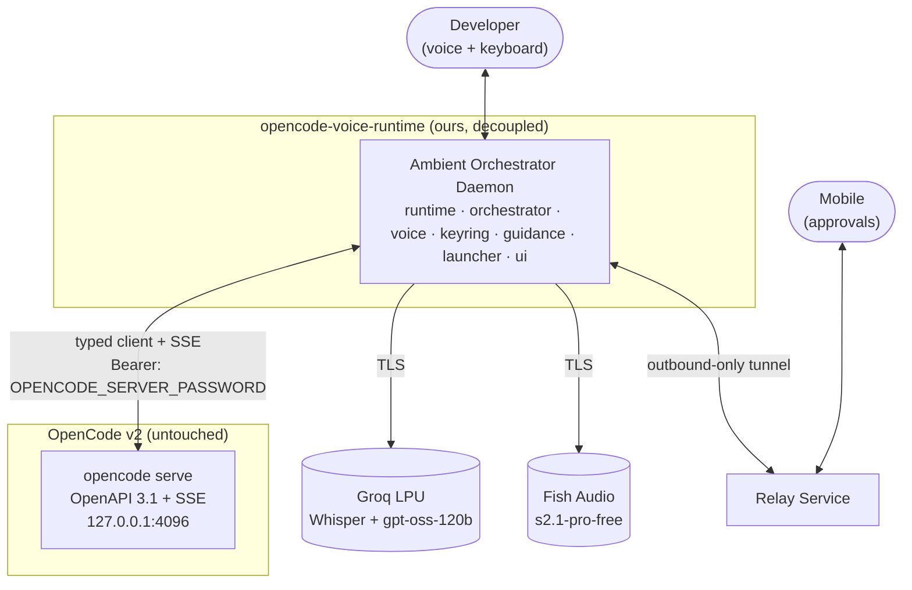
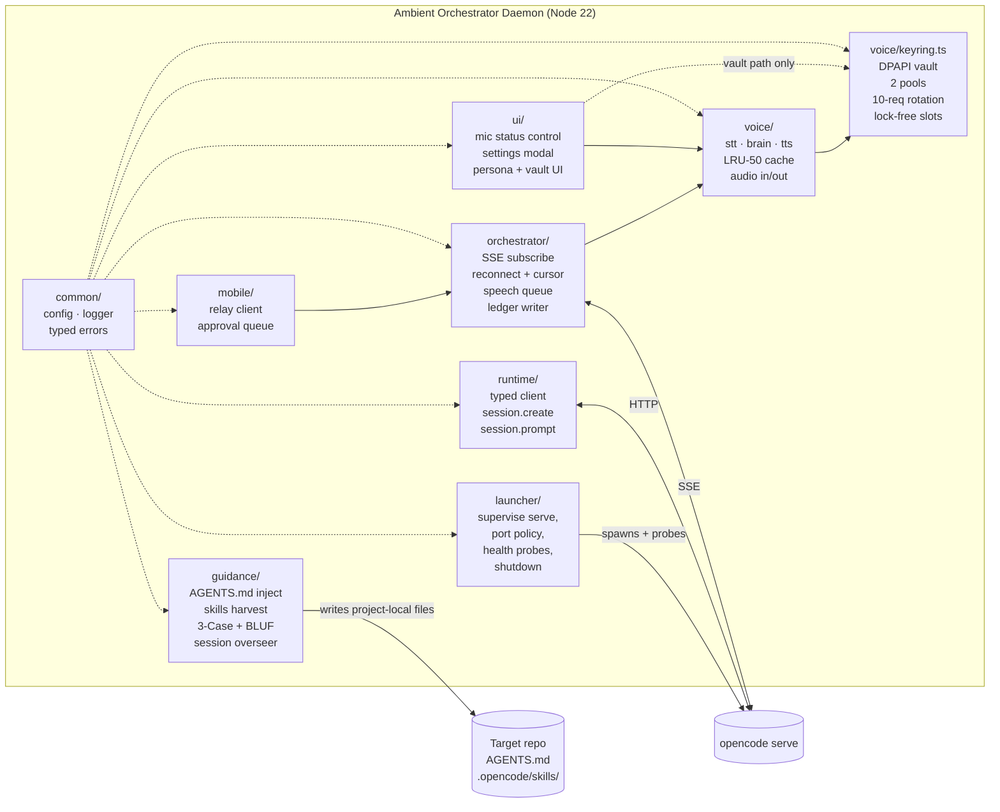
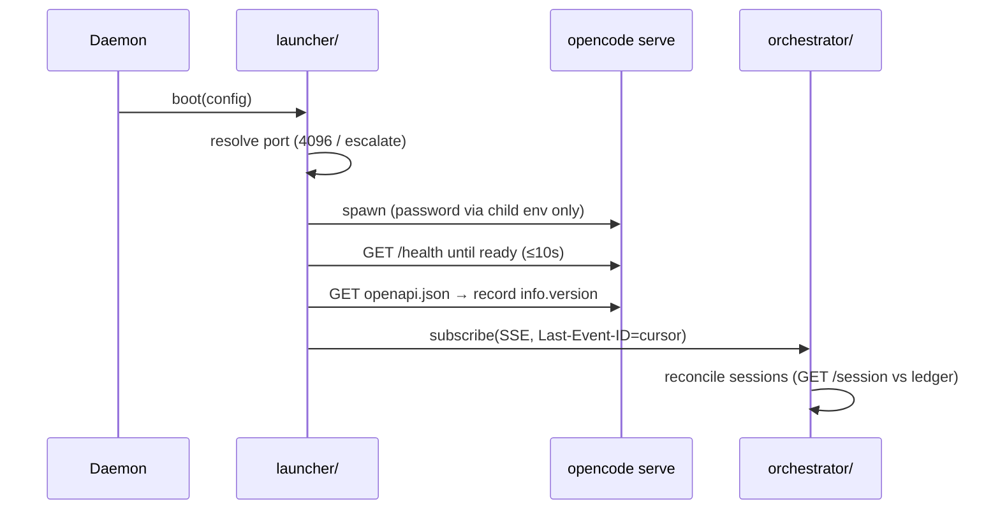
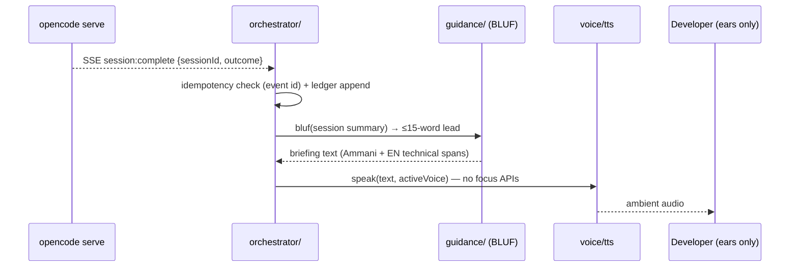
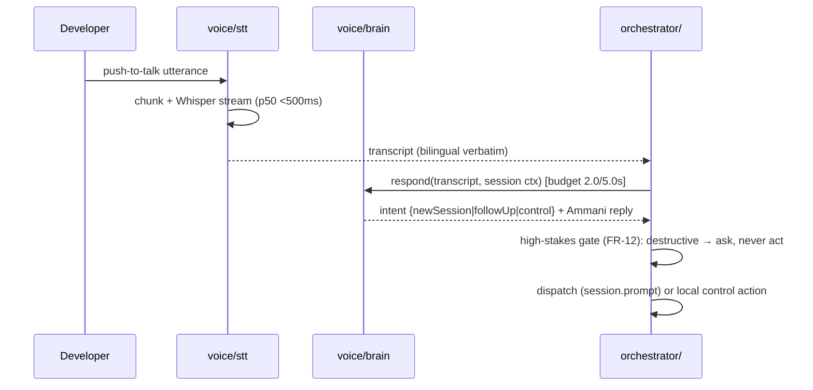
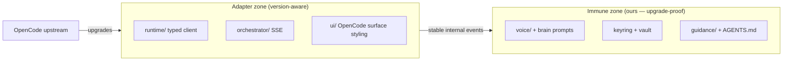

# 04 — Architecture: Decoupled Outer Host / Ambient Orchestrator over OpenCode v2

> **Canonical status:** Foundation. System architecture truth.
> Implements the update-immunity boundary; realizes FR-1–FR-4, FR-9, FR-11, FR-12 (see `01`).
>
> **Autonomy doctrine (normative):** components below are staffed by genuine developer-grade
> intelligence with pragmatic decision-making, not brittle deterministic scripts. Hard
> constraints apply exclusively at security boundaries (secret handling, destructive-action
> confirmation per FR-12, ledger durability). Elsewhere each component is expected to act as
> an experienced, proactive human peer. Trust-breakers are prohibited: hallucinated
> completion, cheerful tone on failure/data loss, destructive acts on ambiguous speech,
> redundant theoretical lectures during briefings.

## 4.1 — Architectural Principle (normative)

**OpenCode v2 is a programmable agent runtime, not a terminal tool.** It runs as a
headless background daemon (`opencode serve`) exposing an OpenAPI 3.1 HTTP contract plus
typed event streams (SSE/RPC). Our project is a **decoupled outer host / ambient
orchestrator layer**: an independent daemon that communicates with `opencode serve`
exclusively through official client surfaces (`@opencode/client` or typed HTTP/SSE) and
injects behavioral guidance exclusively through standard `AGENTS.md` and
`.opencode/skills/`.

**What this forbids:** forking OpenCode, patching its internals, scraping its PTY/ANSI
output, mutating global user configs, or depending on undocumented behavior. Violation
of this boundary is a release-blocking defect (ADR-001, `09`).

## 4.2 — System Context (C4 L1)



## 4.3 — Component Architecture (C4 L2)



### 4.3.1 Component responsibilities and interfaces

| Component | Owns | Exposes | Calls |
|-----------|------|---------|-------|
| `launcher/` | Child lifecycle, port policy, probes, zombie reaping, graceful shutdown | `boot()`, `shutdown()`, `health()` | OS process API only |
| `runtime/` | Typed client wrapper, session CRUD, contract-version probe | `createSession()`, `promptSession()`, `getSession()` | `serve` HTTP (E-2–E-5) |
| `orchestrator/` | SSE subscription, reconnect FSM, briefing queue, ledger writes | `subscribe()`, `enqueueBriefing()`, event handlers | `serve` SSE (E-6), `voice/`, ledger |
| `voice/stt.ts` | Mic chunking, Whisper streaming, bilingual transcripts | `transcribe(stream)` | Groq Whisper |
| `voice/brain.ts` | Ammani prompt system, 2.0 s/5.0 s budget enforcement | `respond(transcript, ctx)` | `gpt-oss-120b` via Groq |
| `voice/tts.ts` | Fish streaming synthesis, dual voice selector | `speak(text, voice)` | Fish Audio, `cache.ts` |
| `voice/cache.ts` | 50-clip LRU (`key = hash(normalized text + voiceId)`) | `get()`, `set()`, stats | Filesystem blob dir |
| `voice/keyring.ts` | DPAPI vault, 2 pools, lock-free slot counter, #11 rollover | `acquire(pool)`, `release(pool, ok)` | OS DPAPI, `common/logger` |
| `guidance/` | AGENTS.md authorship, skills harvesting, 3-Case classifier, BLUF formatter, session overseer (autonomous milestone advancement; halts + suggests `/prompt-master` when planless/done) | `inject(repo)`, `classify(repo)`, `bluf(summary)`, `oversee(session)` | Target repo files |
| `mobile/` | Relay tunnel, token handshake, approval queue | `requestApproval()`, `awaitDecision()` | Relay service |
| `ui/` | Status-bar mic control (Armed/Disarmed/mute-listen), settings modal (persona, test-speech, credential pools via vault path) | `micState()`, `openSettings()` | `voice/`, vault path only |
| `common/` | Config schema, secret-redacting logger, typed errors | `loadConfig()`, `log`, `OrchestratorError` | — |

## 4.4 — Runtime Interaction Flows

### 4.4.1 Boot sequence



### 4.4.2 Completion briefing flow



### 4.4.3 Voice command flow (STT → brain → action)



### 4.4.4 Barge-in cut path

```mermaid
sequenceDiagram
    participant D as Developer
    participant V as voice/tts
    participant O as orchestrator/
    V-->>D: briefing playing…
    D->>V: hotkey / verbal stop (<50ms cut, no fade)
    V->>O: playback aborted at word boundary mark
    O->>O: session → idle; await redirect directive
```

### 4.4.5 Password hot-restart (T6)

```mermaid
sequenceDiagram
    participant OP as Operator
    participant L as launcher/
    participant S1 as serve (old password)
    participant S2 as serve (new password)
    participant O as orchestrator/
    OP->>L: password rotated
    L->>O: checkpoint all sessions (ledger snapshot)
    L->>S1: graceful shutdown
    L->>S2: spawn (new password via child env)
    L->>S2: readiness + contract probe
    O->>S2: re-attach by existing session IDs; resume cursors
```

### 4.4.6 Retry-loop heartbeat and breaker (C6)

Intermediate attempts emit chime-only T0 events; every 5 minutes or 3 consecutive
failures a spoken heartbeat fires; the 5th consecutive failure halts the loop and
requests human guidance (ledger `circuit-open`, session → idle).

## 4.5 — Update-Immunity Boundary (normative)



Rules:

1. Only `runtime/` and `orchestrator/` may import `@opencode/client` or touch the wire.
   Voice, brain, keyring, and guidance layers communicate inward via stable internal
   TypeScript interfaces (`05-DATA-MODEL.md`) — never HTTP.
2. On upstream upgrade: run the contract-version probe (`03` §3.4); if the adapter
   compiles and SSE envelopes validate, the immune zone is untouched by definition.
3. If the upstream schema breaks the adapter, the fix is confined to `runtime/` +
   `orchestrator/` plus a `CONTRACT_DRIFT` ledger entry (E-12). Voice/brain/keyring
   commits in the same release are forbidden — they would void the immunity evidence.

## 4.6 — Design Rationale (summary; full ADRs in `09`)

- OpenAPI + SSE over PTY scraping (ADR-001): typed contracts survive renderer churn.
- Groq LPU for brain (ADR-002): only path meeting the 2.0 s golden budget.
- DPAPI vault + 10-request rotation (ADR-003): quota survival without plaintext.
- Fish Audio dual voice (ADR-004): authentic Arabic voice quality + user choice.
- Lock-free keyring slots (ADR-005): sub-microsecond acquisition, deterministic #11 rollover.
- Autonomy over rigid rules (ADR-006): peer-grade judgment; hard gates only at security boundaries.
- Ring-buffer elimination (ADR-007): structured SSE events + file log-tailing with 40-word spoken cap.

---

*End of `04-ARCHITECTURE.md`. Next: `05-DATA-MODEL.md`.*
