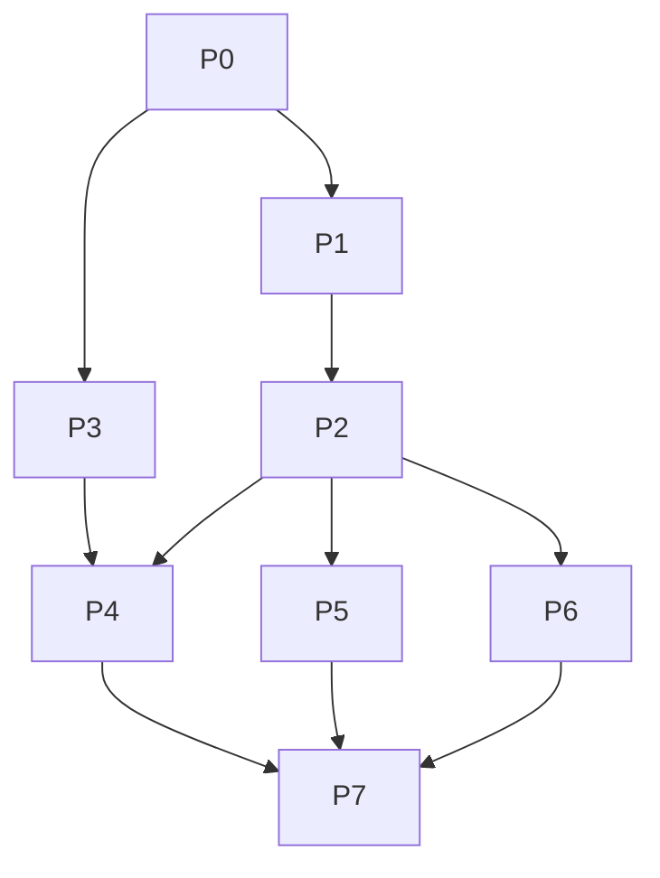

# 07 — Implementation Plan: Phases, Dependency Graph, Risks & Verification

> **Canonical status:** Foundation. Execution truth for all downstream work.
> Governed by `16-WORKFLOWS.md`; milestones sequenced in `08-ROADMAP.md`.

## 7.1 — Phase Plan (v1.0.0 MVP)

| Phase | Scope | Gate-5 commits | Entry → Exit |
|-------|-------|----------------|--------------|
| P0 scaffold | `package.json`, `tsconfig` (`03` §3.1.1), `src/` layout, `common/` (config, logger, errors) | `chore(scaffold)`, `feat(common)` | Plan approved → `tsc --noEmit` clean on skeleton |
| P1 runtime+launcher | `launcher/` boot/supervision + `runtime/` typed client (FR-1/FR-2) | `feat(launcher)`, `feat(runtime)` | P0 green → 100 create→prompt→complete cycles, boot ≤ 10 s |
| P2 orchestrator | SSE subscribe, reconnect FSM, speech queue, ledger (`10`), idempotency (FR-3/FR-4) | `feat(orchestrator)` ×2 (subscribe, queue+ledger) | P1 green → kill-restart loses zero terminal events |
| P3 keyring | DPAPI vault + rotation engine + mutex (`20`, FR-8) | `security(keyring)` | P0 green (parallel with P1/P2) → 25-request rollover exact on #11/#21 |
| P4 voice | STT → brain → TTS → LRU cache (FR-5/6/7) | `feat(voice)` ×3 (stt+brain, tts+cache, audio-io) | P2+P3 green → latency budgets (NFR-1/2/3) met on harness |
| P5 guidance | AGENTS.md injection, skills harvest, 3-Case + BLUF (FR-9) | `feat(guidance)` ×2 | P2 green → all 3 cases classify correctly on fixtures |
| P6 mobile | Relay client + approval queue (`19`) | `feat(mobile)` | P2 green → approval round-trip < 10 s on relay stub |
| P7 hardening | Stress (`23`), immunology hooks (`24`), runbook recipes (`14`), showcase (`22`) | `test(...)`, `docs(...)` | P4–P6 green → 100% Gate-4 table green |

Parallelism: P3 ∥ (P1 → P2); P5, P6 ∥ after P2; P4 after P2+P3; P7 last.

## 7.2 — Dependency Graph

External dependencies and their blast radius:

| External | Pinned by | Breaks | Contained in |
|----------|-----------|--------|--------------|
| `@opencode/client` / serve schema | contract probe (`03` §3.4) | P1, P2 | adapter zone (`04` §4.5) |
| Groq Whisper + `gpt-oss-120b` | model strings in config (`05` §5.7) | P4 | `voice/` only |
| Fish Audio `s2.1-pro-free` + voice IDs | `VOICE_IDS` (`05` §5.1) | P4 | `voice/tts.ts` only |
| Electron `safeStorage` / DPAPI | `12-SECURITY.md` fallback chain | P3 | `keyring.ts` only |

## 7.3 — Risk Matrix

| # | Risk | Prob. | Impact | Mitigation | Owner doc |
|---|------|-------|--------|------------|-----------|
| R-1 | Upstream serve schema drift breaks adapter | Med | High | Contract probe + adapter confinement; immune zone untouched | `04`, `25` |
| R-2 | Groq 429 under load | High | Med | 10-request rotation + forced rollover + jittered retry; LRU shields TTS | `20`, `14` |
| R-3 | Brain p99 exceeds 5 s ceiling | Med | Med | Client-side timeout + fallback briefing; temperature/latency tuning log | `18` |
| R-4 | SSE gap drops `session:complete` | Low | High | Replay cursor + reconciliation + idempotency keys; chaos-tested | `10`, `25` |
| R-5 | DPAPI unavailable (non-Windows CI) | Med | Med | Documented fallback chain; CI uses encrypted fixture vault, never plaintext | `12` |
| R-6 | Audio device churn (BT disconnects) | Med | Low | `AudioOut` abstraction + re-queue + visual fallback | `14` |
| R-7 | Scope creep (fleets in MVP) | Med | High | Hard non-goal NG2; v2.0.0 gate in roadmap | `08` |
| R-8 | Secret leak into logs/repo | Low | Critical | Redacting logger + pre-commit grep + `0600` vault; incident recipe | `12`, `14` |

## 7.4 — Completion Verification Checklists

### 7.4.1 Per-phase Definition of Done (all required)

- [ ] Code complete, zero placeholders (Grep Gate, `16` §16.6.2).
- [ ] `tsc --noEmit`, `eslint --max-warnings 0`, `vitest run` green (evidence pasted).
- [ ] Latency/security budgets for the phase verified or N/A-with-reason.
- [ ] Atomic commits only (`git log --stat` review); tree clean.
- [ ] Checkpoint ledger (`10`) updated with hashes and inventory.

### 7.4.2 MVP release gate (v1.0.0 — all required)

- [ ] FR-1–FR-10 acceptance criteria (`01` §1.4) each evidenced by test run.
- [ ] NFR-1–NFR-10 (`01` §1.5) measured on reference hardware, recorded in `11`.
- [ ] Edge matrix E-1–E-12 (`01` §1.6) each exercised at least once (chaos log in `23`).
- [ ] Update-immunity evidence: adapter-only diff under simulated upstream minor bump.
- [ ] Owner guide (`28`) performs a clean install → first voice briefing on a fresh machine.
- [ ] All 28 canonical docs current; cross-references resolve; tree clean and pushed.

## 7.5 — Estimates and Staffing

Single-operator build (Omar + agent fleet): P0–P3 ≈ Milestone 1, P4–P6 ≈ Milestone 2,
P7 + release ≈ Milestone 3 (`08-ROADMAP.md`). Estimates are recorded per milestone in
hours of supervised agent time, not wall-clock — the 5-gate lifecycle (§16) makes each
phase's cost auditable via commit timestamps.

---

*End of `07-IMPLEMENTATION-PLAN.md`. Batch 1 (files 01–07) complete. Next batch: `08–14`.*
