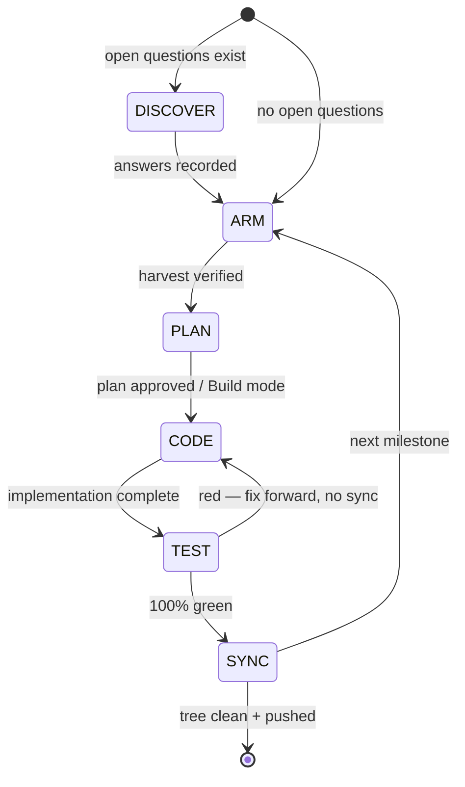

# 16 — Workflows: Universal 5-Gate Engineering Lifecycle & Catalog Harvesting

> **Canonical status:** Governance. This document is the mandatory operating protocol for
> every engineering milestone in `opencode-voice-runtime`, including the present 28-file
> documentation suite. No gate may be skipped. No monolithic commits. No placeholders.

## 16.1 — Purpose and Scope

This project is a **decoupled outer host / ambient orchestrator** around OpenCode v2, which
is treated strictly as a programmable agent runtime (`opencode serve` on an OpenAPI 3.1
HTTP contract + SSE event streams). Because our layer never patches OpenCode internals,
our own engineering discipline is the only thing standing between us and drift. This
document defines the **Universal 5-Gate Engineering Lifecycle**:

```
/arm → /plan → /code → /test → /sync
```

Each gate has explicit entry criteria, execution steps, exit criteria (verification
commands with expected outputs), and a named owner state. A milestone advances only when
the current gate's exit criteria are evidenced on disk or in terminal output.

Related canonical docs: `08-ROADMAP.md` (milestone sequencing), `10-CHECKPOINT.md`
(ledger persistence), `11-TESTING.md` (Gate 4 harness detail), `24-IMMUNOLOGY.md`
(auto-remediation hooks).

## 16.2 — Gate Overview and State Machine



| Gate | Name (AR/EN) | Mode | Exit artifact |
|------|--------------|------|---------------|
| 0 | `/discover` — Discovery & Interrogation (الاستكشاف) | Discuss | Answered questions recorded; revision scope set (§16.2A) |
| 1 | `/arm` — Self-Arming & Catalog Harvesting (تسليح الوكيل) | Read/provision | Harvest table verified on disk (§16.3) |
| 2 | `/plan` — Architectural Planning (وضع الخطة) | Plan | Milestone plan with acceptance criteria (§16.4) |
| 3 | `/code` — Execution & Implementation (وضع البناء) | Build | Complete code/docs, zero placeholders (§16.5) |
| 4 | `/test` — Quality & Benchmark Verification (وضع الاختبار) | Build/test | Green typecheck, lint, tests, latency (§16.6) |
| 5 | `/sync` — Atomic Commits & Living Docs (التوثيق والـ Git) | Build/sync | Pushed atomic commits, clean tree (§16.7) |

**Global invariants (all gates):**

1. **Autonomy with judgment (Reasons-Not-Rules, upgraded):** the agent acts as an
   experienced, proactive human peer with genuine situational awareness — never as a
   brittle script executing micromanaged steps. Strict hard constraints apply
   exclusively at non-negotiable security boundaries: secret handling (I-1–I-5),
   destructive-action confirmation (FR-12), and ledger durability. Every other
   decision is entrusted to peer-grade judgment, with its reason recorded in the
   artifact (commit body, rationale section, or `ARCHITECTURE.md` link).
2. **Non-destructive modification:** never rewrite history (`git push --force` is
   forbidden); never mutate OpenCode internals; never touch global user configs —
   project-local `.opencode/` only.
3. **Zero placeholders:** `TODO`, `FIXME`, `...rest of code...`, `[insert ...]`, and
   empty-section stubs fail every gate.
4. **Evidence before synthesis:** claims about the repo, the catalog, or upstream APIs
   must cite a file path with line number or a verified command output.

## 16.2A — GATE 0: /discover — Discovery & Interrogation (normative)

Mandatory before `/arm` for any milestone with open UX, behavioral, or architectural
questions. The agent stress-tests requirements, user mental models, and edge cases
through sharp conceptual and technical interrogation (minimum bar: 10 conceptual +
5 technical questions, as exercised pre-M2). Code generation stays halted until
answers are recorded and the revision scope is set. Exit criteria:

- [ ] All questions answered in the operator's own words; illustrative examples marked
  as anchors, never templates.
- [ ] Affected canonical files enumerated with per-file revision directives.
- [ ] Milestone roadmap recalibrated to the answers before Gate 1 opens.

## 16.3 — GATE 1: /arm — Self-Arming & Catalog Harvesting

### 16.3.1 Entry criteria

- A milestone is opened (roadmap item, user directive, or amendment).
- The master catalog path is known:
  `O:\Claude Code\vantrilex\vantrilex-registry\VANTRILEX_CATALOG.md`
  with adjacent directories `agents/`, `hooks/`, `mcp/`, `plugins/`, `skills/`.

### 16.3.2 Execution steps

1. **Inspect the catalog.** Read `VANTRILEX_CATALOG.md` (currently 1,485 skills plus
   agents/hooks/MCP/plugins indices) and list each adjacent directory's top-level
   entries. Do not assume contents from memory — list from disk.
2. **Select milestone-specific components.** Score candidates against the milestone's
   needs (this documentation milestone: backend architecture, API contracts, TypeScript
   strictness, docs authoring, audio/voice domain, testing, commit discipline).
   Record the reason for each selection (§16.3.3 harvest log pattern).
3. **Physically install into the project runtime.** Copy the selected pointer files
   into project-local directories only:
   - skills → `.opencode/skills/`
   - agents → `.opencode/agents/`
   - hooks → `.opencode/hooks/`
   - plugins → `.opencode/plugins/`
   - MCP servers → `.mcp.json` (`mcpServers` stanza; secrets via env, never inline)
4. **Verification pass.** Confirm every installed component exists on disk with valid
   syntax and non-zero byte size. On Windows PowerShell:

   ```powershell
   Get-ChildItem .opencode/skills, .opencode/agents, .opencode/hooks, .opencode/plugins |
     Select-Object FullName, Length |
     ForEach-Object { if ($_.Length -eq 0) { throw "ZERO-BYTE: $($_.FullName)" } }
   ```

   Expected output: no exceptions; every row shows `Length > 0`.

### 16.3.3 Harvest log — documentation-suite milestone (executed 2026-09-22)

| Kind | Component | Reason selected |
|------|-----------|-----------------|
| skill | `api-skill` | API design/mocking/documenting/securing for `06-API-SPECIFICATION.md` |
| skill | `archify` | Validated architecture diagrams for `04-ARCHITECTURE.md` |
| skill | `backend-patterns` (registry pointer) | Node/Express/Next route patterns for `03-TECHNICAL-SPECIFICATION.md` |
| skill | `coding-standards` (registry pointer) | TS/JS conventions for `03` + `16.5` strictness rules |
| skill | `doc-coauthoring` | Structured co-authoring workflow for the 28-file suite |
| skill | `docs-guard` | Pre-ship review contract for READMEs/API references |
| skill | `docs` | NeMo-RL documentation conventions baseline |
| skill | `writing-plans` | Strategic documentation planning for `07-IMPLEMENTATION-PLAN.md` |
| skill | `writing-for-agents` | Instruction-file authoring for `AGENTS.md` guidance layer |
| skill | `writing-skills` | Skill-file authoring for `17-CATALOG-INGESTION.md` |
| skill | `test-driven-development` | TDD workflow backing `11-TESTING.md` |
| skill | `vitest-skill` | Vitest generation for Gate 4 suites |
| skill | `testing` | General testing strategy reference |
| skill | `venice-audio-speech` | TTS models/voices/streaming domain reference for `18-VOICE-PIPELINE.md` |
| skill | `venice-audio-transcription` | STT domain reference for `18-VOICE-PIPELINE.md` |
| skill | `nemotron-voice-agent-deploy` | Voice-agent deployment reference for `13-DEPLOYMENT.md` / `18` |
| agent | `Backend Architect` | Runtime + keyring + launcher design review |
| agent | `Software Architect` | System architecture review (`04`) |
| agent | `API Platform Engineer` | REST/SSE contract review (`06`, `25`) |
| agent | `Technical Writer` | Owner guide + runbook clarity (`14`, `28`) |
| agent | `Document Generator` | Showcase generation spec (`22`) |
| agent | `Application Security Engineer` | Vault/keyring review (`12`, `20`, `27`) |
| agent | `architect` | Master-plan architecture pass |
| hook | `session-start` | Load previous context on new session |
| hook | `persist-session-state-on-end` | Session persistence backing `10-CHECKPOINT.md` |
| hook | `typescript-check-after-editing-ts-tsx-files` | Gate 4 typecheck automation |
| hook | `block-creation-of-random-md-files-keeps-docs-consolidated` | Docs-consolidation guard — the 28 canonical files are the allowlist; random new `.md` files are blocked |
| plugin | `feature-dev` | Feature-development lifecycle |
| plugin | `commit-commands` | Atomic Conventional Commits assistance (Gate 5) |
| plugin | `security-guidance` | Security review backing `12-SECURITY.md` |
| plugin | `typescript-lsp` | TS language-server checks |
| plugin | `context7` | Up-to-date docs lookup (mirrored in `.mcp.json`) |
| mcp | `context7` (`@upstash/context7-mcp` via `.mcp.json`) | Live API reference for `@opencode/client`, Groq, Fish Audio |
| catalog | GuildSkills open catalog (`guildskills.json`) | Dynamic skill ingestion for tools + cognitive skills (`17`) |
| corpora | JODA (59k Ammani sentences), UD South Levantine MADAR, `camel_tools` | Dialect calibration for brain prompts (`18`) |
| corpora | Prompt-Engineering-Guide, xl-sum | Planning methodology + BLUF summarization grounding (`18`) |
| skill | `session-overseer` (harvested) | Autonomous milestone advancement; halt + suggest `/prompt-master` (`17`) |

> **Note on skill availability:** the runtime skill IDs `backend-patterns` and
> `coding-standards` are superseded in the live assistant environment; the registry
> pointer files of the same names remain valid project-local references and are used
> as such. No live-skill invocation of those two IDs is performed.

### 16.3.4 Exit criteria

- [ ] ≥1 component per relevant kind installed under project-local paths (table above).
- [ ] Zero-byte verification pass executed with no failures.
- [ ] Harvest log recorded (this section) with a reason per component.
- [ ] Gate 1 committed atomically: `chore(arm): …` (see §16.7.2).

## 16.4 — GATE 2: /plan — Architectural Planning

### 16.4.1 Execution steps

1. Formulate a milestone plan broken into granular, verifiable steps (file-by-file for
   documentation milestones; service-by-service for implementation milestones).
2. For each step state: exact acceptance criteria, type contracts (TS interfaces or
   JSON schemas), latency/security budgets where applicable, and risk boundaries.
3. Declare the batch/sequence order and the commit partition plan (which steps share
   an atomic commit — default: one commit per file/subsystem).
4. **Pause for review** on state transitions (Plan → Build mode switch) or explicit
   user approval before Gate 3 begins.

### 16.4.2 Exit criteria

- [ ] Plan lists every deliverable with acceptance criteria (this suite: 28 files in
  4 batches, §16.4.3).
- [ ] No step contains placeholders or deferred decisions without a named owner.
- [ ] User has approved the plan or the Build-mode transition is explicitly directed.

### 16.4.3 Standing plan — 28-file canonical suite

- **Batch 1 (foundation):** `01`–`07` — product, spec, architecture, data, API, plan.
- **Batch 2 (governance):** `08`–`14` — roadmap, ADRs, checkpoint, testing, security, deployment, runbook.
- **Batch 3 (voice/distribution):** `15`–`20` — distribution, workflows (this file),
  catalog ingestion, voice pipeline, mobile pairing, keyring.
- **Batch 4 (design/immunity/owner):** `21`–`28` — design system, showcase, stress,
  immunology, RPC, launcher, credentials, owner guide.

## 16.5 — GATE 3: /code — Execution & Implementation

### 16.5.1 Execution rules

1. Execute the plan **phase by phase in Build mode**, in declared batch order.
2. **TypeScript strictness:** `strict: true`, `noUncheckedIndexedAccess: true`,
   `exactOptionalPropertyTypes: true`; no `any` without a documented reason; every
   public interface exported from its owning module.
3. **Zero placeholders** (§16.2 invariant 3) — enforced by pre-commit grep (§16.6.2).
4. **Reasons-Not-Rules + non-destructive** (§16.2 invariants 1–2).
5. Codify governance first: for this suite, `16-WORKFLOWS.md` (this file) is written
   before Batch 1 files so the protocol it defines governs the very work it describes.

### 16.5.2 Exit criteria

- [ ] Every planned file exists at its canonical path with complete content.
- [ ] Placeholder grep returns zero matches.
- [ ] Cross-references resolve (every `NN-NAME.md` link target exists or is declared
  as a forward reference to a scheduled batch with its number).

## 16.6 — GATE 4: /test — Quality & Benchmark Verification

### 16.6.1 Documentation-milestone verification (this suite)

Full `tsc`/`vitest` harnesses arrive with implementation; for documentation gates the
applicable checks are:

```powershell
# 1. File existence — expect 8 after Batch 1 (01-07 + 16), 15 after Batch 2, 21 after Batch 3, 29 after Batch 4 incl. this file
Get-ChildItem docs/*.md | Measure-Object | Select-Object -ExpandProperty Count

# 2. Zero placeholders
Select-String -Path docs/*.md -Pattern 'TODO|FIXME|\.\.\.rest of code\.\.\.|Insert details here|\[insert' -CaseSensitive:$false

# 3. Cross-reference integrity — every docs/NN-*.md link target must exist
Select-String -Path docs/*.md -Pattern 'docs/\d{2}-[A-Z-]+\.md' -AllMatches |
  ForEach-Object { $_.Matches.Value } | Sort-Object -Unique

# 4. Mermaid fence sanity — every mermaid block opened must be closed
```

Expected: (1) exact count per batch; (2) zero matches; (3) all targets exist or are
forward-declared in §16.4.3; (4) balanced fences.

### 16.6.2 Implementation-milestone verification (normative for future code gates)

| Check | Command | Green criterion |
|-------|---------|-----------------|
| Typecheck | `npx tsc --noEmit` | Zero errors |
| Lint | `npx eslint . --max-warnings 0` | Zero errors, zero warnings |
| Unit/integration | `npx vitest run` | 100% pass, coverage ≥ 80% |
| Placeholder grep | `grep -rnE 'TODO\|FIXME' src/` | Zero matches |
| STT latency | latency harness (§11) | p50 round-trip < 500 ms |
| Cognitive latency | latency harness (§11) | p50 < 2.0 s golden, p99 < 5.0 s ceiling |
| TTS streaming | first-chunk harness (§11) | First audio chunk < 800 ms after text ready |

**100% green pass is required before Gate 5. Red returns to Gate 3 — fix forward,
never sync broken work.**

### 16.6.3 Exit criteria

- [ ] All applicable checks green with pasted evidence (command + output digest).
- [ ] Latency invariants verified (implementation milestones) or declared N/A with
  reason (documentation milestones).

## 16.7 — GATE 5: /sync — Atomic Git Commits & Living Documentation

### 16.7.1 The atomic-commit law

Single monolithic bulk commits are **strictly forbidden**. Partition changes into the
**largest logical number of atomic, focused commits**: one commit per file for
documentation work; one commit per subsystem/concern for code work.

### 16.7.2 Conventional Commit format (normative)

```
<type>(<scope>): <imperative subject ≤ 72 chars>

<body: reason — why this change exists (Reasons-Not-Rules)>
<evidence: verification performed, e.g. gate-4 check + result>
```

- Types: `feat`, `fix`, `test`, `docs`, `refactor`, `chore`, `perf`, `security`.
- Scopes for this repo: `arm`, `plan`, `runtime`, `orchestrator`, `voice`, `keyring`,
  `guidance`, `launcher`, `mobile`, `docs`, `checkpoint`, `workflow`.
- Example subjects used in this suite:
  - `chore(arm): harvest vantrilex catalog into project runtime (gate 1)`
  - `docs(workflow): codify 5-gate lifecycle in 16-WORKFLOWS.md (gate 5)`
  - `docs(prd): author 01-PRODUCT-REQUIREMENTS.md (batch 1)`
  - `docs(keyring): author 20-KEYRING.md with rollover mechanics (batch 3)`

### 16.7.3 Documentation re-sync

After committing a milestone, update `docs/10-CHECKPOINT.md` (once Batch 2 lands; for
Batch 1 record the ledger inline in the sync commit message) with: exact execution
log, commit hashes (`git log --oneline` range), file inventory with byte sizes, and
updated progress state (`Batch N of 4 complete`).

### 16.7.4 Remote sync

Push commits to the GitHub remote tracking branch. If no remote is configured (as in
the initial local-only repository), record `git status` showing a clean tree and the
pending-push state explicitly instead of fabricating a push. Leaving the tree dirty
fails the gate.

### 16.7.5 Exit criteria

- [ ] `git log` shows the partitioned atomic commits with conforming messages.
- [ ] `git status` is clean (nothing to commit, working tree clean).
- [ ] Checkpoint ledger updated; remote pushed or pending-push recorded.

## 16.8 — Applying the Lifecycle to Future Milestones (worked example)

For milestone `v1.0.0 MVP — voice loop` (`08-ROADMAP.md`):

1. `/arm`: harvest `vitest-skill`, `venice-audio-*`, `nemotron-voice-agent-deploy`,
   `typescript-lsp`, plus Groq/Fish MCP notes; verification pass; `chore(arm)` commit.
2. `/plan`: per-service steps (runtime boot → SSE subscribe → STT → brain → TTS →
   briefing), acceptance = Gate 4 table thresholds; user review; mode switch.
3. `/code`: implement `src/runtime/`, `src/orchestrator/`, `src/voice/`,
   `src/voice/keyring.ts` phase by phase; placeholder grep clean.
4. `/test`: `tsc --noEmit`, `eslint --max-warnings 0`, `vitest run`, latency harness
   (STT p50 < 500 ms, brain p50 < 2.0 s, TTS first-chunk < 800 ms).
5. `/sync`: atomic commits per subsystem (`feat(runtime)`, `feat(orchestrator)`,
   `feat(voice)`, `security(keyring)` …), checkpoint update, push, clean tree.

## 16.8A — Standardized Phase Execution Matrix (normative — all milestones)

> **Canonical status:** Workflow standard. Extends the 5-gate lifecycle (§16.2) with a
> per-phase binding contract. Every milestone SHALL instantiate this matrix. It binds a
> phase to the agent that owns it, the skills it must load, the tools it may use
> (MCP + LSP), the artifacts it needs to start, and the evidence that lets it exit.
> Tooling is provisioned by `build(toolchain)` commits: agents/skills under `.opencode/`,
> MCP + LSP under `opencode.json`.

### 16.8A.1 Binding schema

| Column | Allowed values | Rule |
|--------|----------------|------|
| **Assigned Agent** | `architect`, `laya-ml-engineer`, `ts-reviewer` (or `primary`) | Exactly one owner per phase. Review phases are read-only. |
| **Active Skills** | `laya-ml-gates`, `vitest-live-gating`, `typescript-esm-strict` | Mandatory when the phase touches the skill's domain; `—` only when none applies. |
| **MCP Tools & LSPs** | `context7` (library/API docs), `pyright` (`.py`), `typescript-language-server` (`.ts/.tsx/.js`), `native` (read/glob/grep/shell/webfetch) | `context7` for any library/API/syntax question; the matching LSP must report clean before the phase exits. |
| **Input Artifacts** | Committed files/commands that must exist before the phase starts | Entry gate; a missing artifact blocks the phase. |
| **Exit Quality Gates** | Measurable pass/fail checks + the artifact that proves them | Exit gate; a failed gate blocks progress. Never restate the target as the result. |

### 16.8A.2 Standard phase matrix

| Phase class | Assigned agent | Active skills | MCP tools & LSPs | Input artifacts | Exit quality gates |
|-------------|----------------|---------------|------------------|-----------------|--------------------|
| **SPEC** — design, ADR, contract | `architect` | `—` | `context7`, `native` | prior ADRs (`09`), requirement (`01`/`02`) | ≥ 2 real options with trade-offs; compliance test named; ADR written |
| **DATA** — generation, labelling, splits | `laya-ml-engineer` | `laya-ml-gates` | `pyright`, `native` | data scripts + prior `synth_meta.json` | balance ≥ 20% minority per head; marker-hygiene assertion green; split-integrity report |
| **IMPLEMENT** — code / training / export | `laya-ml-engineer` (ml) or `primary` (src) | `laya-ml-gates` (ml) · `typescript-esm-strict` (src) | `context7`, matching LSP | frozen data/spec from prior phase | domain gates pass (acc/latency/parity); LSP diagnostics clean |
| **ADVERSARIAL** — red-team the result | `laya-ml-engineer` + `architect` review | `laya-ml-gates` | `context7`, `native` | phase artifact + gold suite | suite pass rate ≥ target; every failure classified; review signed |
| **VERIFY** — hermetic + live tests | `ts-reviewer` (review) + `primary` | `vitest-live-gating`, `typescript-esm-strict` | `typescript-language-server`, `pyright` | built artifacts + model files | `tsc` 0; `eslint` 0; hermetic + `LAYA_LIVE=1` suites green; reviewer verdict |
| **GOVERNANCE** — docs + ledger | `architect` | `—` | `native` | all prior exit artifacts | every scoped item has status + evidence pointer; ledger current; tree clean |

### 16.8A.3 Phase discipline

1. **No phase is skipped.** A phase with no work is marked `N/A` with a one-line reason.
2. **Evidence over assertion.** Every exit gate cites a committed artifact or a pasted
   command result. A number without a reproducing script + artifact is not evidence.
3. **Gate failure blocks.** On failure, fix or escalate; never relabel the target as met.
4. **One owner per phase.** The Assigned Agent owns that phase's write actions; reviewers
   stay read-only (`ts-reviewer` must not edit).
5. **LSPs are part of the gate.** `pyright` must report clean on touched `ml/*.py` and
   `typescript-language-server` on touched `src/**/*.ts` before VERIFY exits.
6. **`context7` first for API questions.** Library/framework/CLI behaviour is looked up,
   not recalled from training data.
7. **Governance is last and mandatory.** `09` (ADR) and `10` (ledger) are updated before
   a milestone is called done.

## 16.8B — Mission workflow: Laya P0 remediation (V1, V2, V4, V5, V6, V8)

> **Status (2026-09-23): VERIFIED AND COMPLETE.** All five phases exited through
> their gates: G1 10/10, G2 6/6, G3 all sub-gates, Gate-4 (tsc 0, lint 0,
> 54 hermetic + 3/3 live), G5 governance. Evidence in `ml/` reports + §10.7.
> Forensic audit 2026-09-24 (code-first, zero trust in docs): reconciled stale
> references across the suite (test counts, DPAPI overclaim, mutex history, showcase/
> earcon/relay/wake-word/barge-in future-vs-present framing, CLI surface) and
> published `dossier/PROJECT_MASTER_DOSSIER.md`.

Instantiation of §16.8A for the P0 fixes in `LAYA-EVALUATION-AND-ROADMAP.md` §2. Scope:
the model currently behaves as a **lexical marker detector** and its headline metrics are
inflated by a leaked split; negation is not understood and one marker is semantically wrong.

| Vuln | Failure mode | Owning phase |
|------|--------------|--------------|
| **V1** | Marker detector, not intent classifier | P1 (marker-free positives) + P2 (OOD cases) |
| **V2** | Train/test leakage via repeated fixed frames | P1 (group-aware template-hash split) |
| **V4** | `ديبلوي` (deploy) wrongly labelled destructive | P1 (marker-set repair) |
| **V5** | `stuck_in_loop` marker hygiene broken | P1 (marker hygiene) |
| **V6** | Negation ignored (negated commands fire) | P1 (negation labels) + P2 (negation cases) |
| **V8** | Imperative confusables (`اسمع`/`امسح`) | P2 (confusable set) |

*Carried from the prior brief:* **V3** (`should_speak` derivable from the other heads) is a
cheap P1 data-hygiene fix and is included as gate G1.5.

### 16.8B.1 Phase 1 — Dataset Generation & Negation Hardening

| Field | Binding |
|-------|---------|
| Agent | `laya-ml-engineer` |
| Skills | `laya-ml-gates` |
| MCP & LSP | `pyright`, `native` (and `context7` for any tokenizer/API question) |
| Input artifacts | `ml/data/generate_synth.py`, seed-8 `synth_meta.json`, `LAYA-EVALUATION-AND-ROADMAP.md` §2 |

Work: repair the marker sets (V4, V5); add negated-destructive hard negatives and
marker-free destructive positives (V1, V6); de-correlate the four heads (V3); replace the
random split with a group-aware template-hash split (V2).

| Gate | Pass condition |
|------|----------------|
| G1.1 marker hygiene | No benign verb in `DESTRUCTIVE_MARKERS`; every injected loop cue is a declared `LOOP_MARKER`; automated assertion: **0 markerless positives** per head |
| G1.2 negation coverage | ≥ 40 negated destructive utterances, all `is_destructive=false` |
| G1.3 marker-free positives | ≥ 60 destructive positives carrying no declared marker |
| G1.4 split integrity | **0** template families shared across train/val/test, reported in `synth_meta.json` |
| G1.5 head independence | pairwise \|φ\| between head labels < 0.3; `should_speak` not a function of the other three |
| G1.6 balance | every head ≥ 20% minority |
| G1.7 LSP | `opencode debug lsp diagnostics ml/data/generate_synth.py` → no errors |

Artifact: regenerated `ml/data/splits/*` + `ml/data/synth_meta.json` with
`split_integrity`, `head_correlation`, `negation_coverage`, `marker_free_positives`.

### 16.8B.2 Phase 2 — Adversarial Gold Suite Construction

| Field | Binding |
|-------|---------|
| Agent | `laya-ml-engineer` (author) + `architect` (review) |
| Skills | `laya-ml-gates` |
| MCP & LSP | `native` |
| Input artifacts | Phase 1 exit artifacts (frozen; hash recorded) |

Work: author `ml/adversarial_suite.json` — 50–100 hand-curated cases spanning negations,
confusables (`اسمع`/`امسح`, `وقف`/`وقّف`, `احذف`/`احتفظ`), out-of-distribution phrasing
(e.g. `امسح الداتابيز كلها`), marker-free destructive intent, hard negatives that merely
contain a marker substring, and Arabic↔English code-switching. `architect` reviews for
ambiguity and label correctness.

| Gate | Pass condition |
|------|----------------|
| G2.1 composition | 50 ≤ cases ≤ 100; ≥ 10 negations, ≥ 8 confusable pairs, ≥ 10 OOD, ≥ 10 hard negatives |
| G2.2 schema | every entry has `text`, 4 boolean `labels`, `category`, `rationale` |
| G2.3 review | `architect` sign-off recorded; every disputed label resolved |

Artifact: `ml/adversarial_suite.json` + review note.

### 16.8B.3 Phase 3 — Retraining & ONNX Quantization

| Field | Binding |
|-------|---------|
| Agent | `laya-ml-engineer` |
| Skills | `laya-ml-gates` |
| MCP & LSP | `context7` (ONNX/transformers API), `pyright` |
| Input artifacts | Phase 1 data + Phase 2 suite, both frozen (hashes recorded) |

Work: train the CPU heads on the group-aware split (`load_backbone` hard-abort), export
FP32 + dynamic-INT8 ONNX (dynamic batch+seq), run the parity check, benchmark latency at
the 32-token operating length, and evaluate the adversarial suite.

| Gate | Pass condition |
|------|----------------|
| G3.1 train | on the **group-aware** split: primary acc ≥ 0.90, secondary ≥ 0.85 |
| G3.2 adversarial | negation false-positive rate ≤ 0.10; confusable error rate ≤ 0.15; overall suite pass ≥ 0.80 |
| G3.3 parity | max logit diff < 1e-4 vs torch |
| G3.4 latency | INT8 p50 < 40 ms @ 32 tokens |
| G3.5 quantization | INT8 clears all four head gates; delta vs FP32 reported |
| G3.6 LSP | `pyright` clean on touched `ml/*.py` |

Artifacts: `ml/eval_report.md`, `ml/l2_report.json`, `ml/quant_report.json`,
`ml/adversarial_report.json`.

### 16.8B.4 Phase 4 — Runtime Integration & Vitest Verification

| Field | Binding |
|-------|---------|
| Agent | `ts-reviewer` (review) + `primary` (edits) |
| Skills | `vitest-live-gating`, `typescript-esm-strict` |
| MCP & LSP | `typescript-language-server`, `context7` |
| Input artifacts | Phase 3 artifacts; INT8 model at `models/laya-m7-int8.onnx` |

Work: propagate any label/tokenizer/operating-length change into `src/runtime/laya/`;
extend the live integration test to assert negation handling; run the full gate.

| Gate | Pass condition |
|------|----------------|
| G4.1 static | `npx tsc --noEmit` = 0; `npx eslint . --max-warnings 0` = 0 |
| G4.2 hermetic | `npx vitest run` green (default suite) |
| G4.3 live | `LAYA_LIVE=1 npx vitest run src/runtime/laya/laya.integration.test.ts` green — tokenizer golden parity, p50 < 40 ms, class separation, negation |
| G4.4 review | `ts-reviewer` verdict `APPROVE` or `APPROVE WITH NITS` |
| G4.5 LSP | `typescript-language-server` diagnostics clean on changed `src/**/*.ts` |

Artifacts: command output + review verdict.

### 16.8B.5 Phase 5 — Governance & Ledger Update

| Field | Binding |
|-------|---------|
| Agent | `architect` |
| Skills | `—` |
| MCP & LSP | `native` |
| Input artifacts | Phase 4 exit artifacts |

Work: update `09` ADR-008 (measured evidence, negation + quantization findings),
`10` §10.7 ledger (commit range, findings fixed), and mark each scoped vulnerability in
`LAYA-EVALUATION-AND-ROADMAP.md` with status + evidence pointer.

| Gate | Pass condition |
|------|----------------|
| G5.1 vuln status | V1, V2, V4, V5, V6, V8 each marked fixed/mitigated with an evidence pointer |
| G5.2 ledger | `10` §10.7 updated with the commit range and Gate-4 evidence |
| G5.3 hygiene | cross-refs resolve; `git status` clean |

## 16.8C — Execution checklist: Laya P0 remediation

Derived from §16.8B. Each item is a pass/fail gate; a failing gate blocks the next phase.

**Phase 1 — Dataset Generation & Negation Hardening** (`laya-ml-engineer` + `laya-ml-gates` + `pyright`)

- [ ] P1.1 Remove `ديبلوي` from `DESTRUCTIVE_MARKERS` (or reclassify deploy as a benign control intent) — V4
- [ ] P1.2 Fix `stuck_in_loop` hygiene so every injected loop cue is a declared `LOOP_MARKER` — V5
- [ ] P1.3 Add ≥ 40 negated-destructive negatives (`لا/ما/مش/مو` + marker) labelled `is_destructive=false` — V6
- [ ] P1.4 Add ≥ 60 marker-free destructive positives (semantic paraphrase, no marker) — V1
- [ ] P1.5 De-correlate heads: independent label sampling; `should_speak` not derived from the others — V3
- [ ] P1.6 Group-aware split by template hash; assert 0 template families cross splits — V2
- [ ] P1.7 Write `split_integrity`, `head_correlation`, `negation_coverage`, `marker_free_positives` into `synth_meta.json`
- [ ] **Gate G1** — marker hygiene assertion green (0 markerless) · all heads ≥ 20% minority · 0 cross-split families · `pyright` clean on `generate_synth.py`

**Phase 2 — Adversarial Gold Suite** (`laya-ml-engineer` + `architect` review)

- [ ] P2.1 Author `ml/adversarial_suite.json` (50–100 cases: negations, confusables, OOD, hard negatives, code-switching)
- [ ] P2.2 Validate schema (text, 4 boolean labels, category, rationale)
- [ ] P2.3 `architect` review sign-off; disputes resolved
- [ ] **Gate G2** — ≥ 10 negations · ≥ 8 confusable pairs · ≥ 10 OOD · ≥ 10 hard negatives · schema valid · review signed

**Phase 3 — Retraining & ONNX Quantization** (`laya-ml-engineer` + `laya-ml-gates`)

- [ ] P3.1 Train CPU heads on the group-aware split (`load_backbone` hard-abort; CPU-only assert)
- [ ] P3.2 Export FP32 + INT8 ONNX (dynamic batch+seq)
- [ ] P3.3 Parity check < 1e-4
- [ ] P3.4 Latency probe @ 32 tokens (INT8 p50 < 40 ms)
- [ ] P3.5 Adversarial-suite evaluation → `ml/adversarial_report.json`
- [ ] P3.6 Quantization accuracy delta measured (all four gates still clear)
- [ ] **Gate G3** — train gates pass on the **group-aware** split · negation FP rate ≤ 0.10 · confusable error ≤ 0.15 · suite pass ≥ 0.80 · parity < 1e-4 · p50 < 40 ms · `pyright` clean

**Phase 4 — Runtime Integration & Vitest Verification** (`ts-reviewer` + `vitest-live-gating` + `typescript-esm-strict`)

- [ ] P4.1 Propagate label/tokenizer/operating-length changes into `src/runtime/laya/`
- [ ] P4.2 Extend the live integration test to assert negation handling
- [ ] P4.3 `npx tsc --noEmit` = 0 and `npx eslint . --max-warnings 0` = 0
- [ ] P4.4 `npx vitest run` green (hermetic)
- [ ] P4.5 `LAYA_LIVE=1 npx vitest run src/runtime/laya/laya.integration.test.ts` green
- [ ] P4.6 `ts-reviewer` verdict recorded
- [ ] **Gate G4** — tsc 0 · lint 0 · hermetic green · live green · LSP clean on changed files · reviewer `APPROVE`/`APPROVE WITH NITS`

**Phase 5 — Governance & Ledger** (`architect`)

- [ ] P5.1 Update `09` ADR-008 with measured evidence + negation/quantization findings
- [ ] P5.2 Update `10` §10.7 ledger (commit range + Gate-4 evidence)
- [ ] P5.3 Mark V1, V2, V4, V5, V6, V8 with status + evidence pointer in `LAYA-EVALUATION-AND-ROADMAP.md`
- [ ] **Gate G5** — every scoped vuln has status + pointer · ledger current · cross-refs resolve · tree clean

## 16.9 — Non-Compliance and Recovery

| Violation | Detection | Recovery |
|-----------|-----------|----------|
| Skipped gate | Missing exit artifact | Halt; complete the skipped gate retroactively before advancing |
| Monolithic commit | `git show --stat` spans concerns | `git reset --soft HEAD~1`, re-partition, re-commit |
| Placeholder merged | Gate 4 grep hit | Return to Gate 3; complete the section; re-run Gate 4 |
| Dirty tree at sync | `git status` non-clean | Commit or stash intentionally; never leave ambiguous state |
| Secret committed | `.env`/vault blob in `git show` | `git rm --cached`, rotate the secret, record incident in `14-RUNBOOK.md` pattern |

## 16.10 — `/arm` Ingested Toolchain (GATE 1)

GATE 1 armed the desktop-companion roadmap by harvesting real components from the
Vantrilex catalog registry (`vantrilex-registry/`, 421 KB manifest). Harvested
descriptors were resolved to their `Raw URL` sources and materialized into the
runtime. Every file below exists on disk with non-zero size (verified
2026-09-24).

### Skills (`.opencode/skills/<id>/SKILL.md`)

| Skill | Source | Governs |
|---|---|---|
| `clean-code-guard` | `amElnagdy/guard-skills` | Step 1–6 code changes (SOLID/DRY/KISS/LLM failure modes) |
| `test-guard` | `amElnagdy/guard-skills` | Test quality gate for every step's vitest additions |
| `docs-guard` | `amElnagdy/guard-skills` | Docs-vs-code drift in Steps 3 and GOV rows |
| `tdd` | `mattpocock/skills` | Steps 1–2 test-first implementation |
| `frontend-design` | `anthropics/skills` | Step 6 UI/matrix aesthetics |
| `design-taste-frontend` | `leonxlnx/taste-skill` | Step 6 anti-templated visual direction |
| `canvas-design` | `anthropics/skills` | Step 6 48×48 matrix art direction |
| `frontend-patterns` | `worldflowai/everything-claude-code` | Step 6 React/Tauri renderer patterns |
| `security-review` | `worldflowai/everything-claude-code` | Steps 4–5 WS auth, telemetry redaction, vault |

### Agents (`.opencode/agents/<name>.md`)

| Agent | Source | Role in roadmap |
|---|---|---|
| `desktop-app-engineer` | `msitarzewski/agency-agents` | Tauri v2 shell, IPC isolation, signing (Steps 1, 4) |
| `voice-ai-integration-engineer` | `msitarzewski/agency-agents` | AudioIn/RNNoise/STT pipeline (Step 2) |
| `rust-refactoring-specialist` | `msitarzewski/agency-agents` | Rust shell hardening (Steps 1, 6) |
| `frontend-developer` | `msitarzewski/agency-agents` | React/Vite/Tailwind renderer (Step 6) |
| `ui-designer` | `msitarzewski/agency-agents` | Glassmorphic surfaces, icons, micro-interactions |
| `test-automation-engineer` | `msitarzewski/agency-agents` | E2E harness for the six steps |
| `code-reviewer` | `worldflowai/everything-claude-code` | Post-change review gate on every step |

> Repo-native `architect`, `laya-ml-engineer`, and `ts-reviewer` agents are retained
> unchanged; the registry's generic `architect` was **not** copied to avoid
> clobbering the repo-tailored one.

### Hooks (`.opencode/hooks/`) — reference, not auto-loaded

`claude-code-hooks.json`, `session-start.sh`, and `pre-compact.sh` were imported
from `worldflowai/everything-claude-code`. **OpenCode v2 has no `.opencode/hooks/`
loader**; these use the Claude Code hook schema and are retained as the porting
specification. See `.opencode/hooks/README.md` for the porting map (tool
transforms for post-edit typecheck/format/console-log scans; `session.hook` for
compaction and context). No enforcement claim is made until a plugin is written
and tested against `@opencode-ai/plugin@1.18.31`.

### MCP servers (`opencode.json` → `mcp.servers`)

| Server | Package | Purpose |
|---|---|---|
| `context7` | `@upstash/context7-mcp` | Live library docs (pre-existing) |
| `github` | `@modelcontextprotocol/server-github` | Repo/PR/issue automation (pre-existing, preserved) |
| `filesystem` | `@modelcontextprotocol/server-filesystem` (scoped to project root) | Scoped file read/write |
| `memory` | `@modelcontextprotocol/server-memory` | Persistent knowledge-graph memory |
| `sequential-thinking` | `@modelcontextprotocol/server-sequential-thinking` | Structured multi-step reasoning |

### Plugins

The registry's plugin descriptors resolve to `anthropics/claude-plugins-official`
(Claude Code plugins) and are **not** OpenCode v2-compatible. No plugin was
fabricated. OpenCode v2 lifecycle extension is deferred to a tested
`@opencode-ai/plugin` implementation.

---

*End of `16-WORKFLOWS.md`. Next canonical file: `17-CATALOG-INGESTION.md` (Batch 3).*
