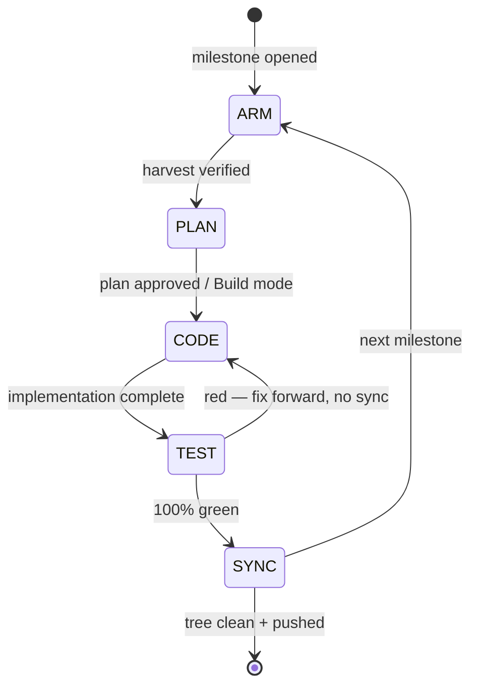

# 16 — Workflows: Universal 5-Gate Engineering Lifecycle & Catalog Harvesting

> **Canonical status:** Governance. This document is the mandatory operating protocol for
> every engineering milestone in `opencode-voice-runtime`, including the present 28-file
> documentation suite. No gate may be skipped. No monolithic commits. No placeholders.

## 16.1 — Purpose and Scope

This project is a **decoupled outer host / ambient orchestrator** around OpenCode v2, which
is treated strictly as a programmable agent runtime (`opencode serve` on an OpenAPI 3.1
HTTP contract + SSE event streams). Because our layer never patches OpenCode internals,
our own engineering discipline is the only thing standing between us and drift. This
document defines the **Universal 5-Gate Engineering Lifecycle**:

```
/arm → /plan → /code → /test → /sync
```

Each gate has explicit entry criteria, execution steps, exit criteria (verification
commands with expected outputs), and a named owner state. A milestone advances only when
the current gate's exit criteria are evidenced on disk or in terminal output.

Related canonical docs: `08-ROADMAP.md` (milestone sequencing), `10-CHECKPOINT.md`
(ledger persistence), `11-TESTING.md` (Gate 4 harness detail), `24-IMMUNOLOGY.md`
(auto-remediation hooks).

## 16.2 — Gate Overview and State Machine



| Gate | Name (AR/EN) | Mode | Exit artifact |
|------|--------------|------|---------------|
| 1 | `/arm` — Self-Arming & Catalog Harvesting (تسليح الوكيل) | Read/provision | Harvest table verified on disk (§16.3) |
| 2 | `/plan` — Architectural Planning (وضع الخطة) | Plan | Milestone plan with acceptance criteria (§16.4) |
| 3 | `/code` — Execution & Implementation (وضع البناء) | Build | Complete code/docs, zero placeholders (§16.5) |
| 4 | `/test` — Quality & Benchmark Verification (وضع الاختبار) | Build/test | Green typecheck, lint, tests, latency (§16.6) |
| 5 | `/sync` — Atomic Commits & Living Docs (التوثيق والـ Git) | Build/sync | Pushed atomic commits, clean tree (§16.7) |

**Global invariants (all gates):**

1. **Reasons-Not-Rules:** every structural choice carries its reason in the artifact
   (commit message body, doc rationale section, or code-adjacent `ARCHITECTURE.md` link).
2. **Non-destructive modification:** never rewrite history (`git push --force` is
   forbidden); never mutate OpenCode internals; never touch global user configs —
   project-local `.opencode/` only.
3. **Zero placeholders:** `TODO`, `FIXME`, `...rest of code...`, `[insert ...]`, and
   empty-section stubs fail every gate.
4. **Evidence before synthesis:** claims about the repo, the catalog, or upstream APIs
   must cite a file path with line number or a verified command output.

## 16.3 — GATE 1: /arm — Self-Arming & Catalog Harvesting

### 16.3.1 Entry criteria

- A milestone is opened (roadmap item, user directive, or amendment).
- The master catalog path is known:
  `O:\Claude Code\vantrilex\vantrilex-registry\VANTRILEX_CATALOG.md`
  with adjacent directories `agents/`, `hooks/`, `mcp/`, `plugins/`, `skills/`.

### 16.3.2 Execution steps

1. **Inspect the catalog.** Read `VANTRILEX_CATALOG.md` (currently 1,485 skills plus
   agents/hooks/MCP/plugins indices) and list each adjacent directory's top-level
   entries. Do not assume contents from memory — list from disk.
2. **Select milestone-specific components.** Score candidates against the milestone's
   needs (this documentation milestone: backend architecture, API contracts, TypeScript
   strictness, docs authoring, audio/voice domain, testing, commit discipline).
   Record the reason for each selection (§16.3.3 harvest log pattern).
3. **Physically install into the project runtime.** Copy the selected pointer files
   into project-local directories only:
   - skills → `.opencode/skills/`
   - agents → `.opencode/agents/`
   - hooks → `.opencode/hooks/`
   - plugins → `.opencode/plugins/`
   - MCP servers → `.mcp.json` (`mcpServers` stanza; secrets via env, never inline)
4. **Verification pass.** Confirm every installed component exists on disk with valid
   syntax and non-zero byte size. On Windows PowerShell:

   ```powershell
   Get-ChildItem .opencode/skills, .opencode/agents, .opencode/hooks, .opencode/plugins |
     Select-Object FullName, Length |
     ForEach-Object { if ($_.Length -eq 0) { throw "ZERO-BYTE: $($_.FullName)" } }
   ```

   Expected output: no exceptions; every row shows `Length > 0`.

### 16.3.3 Harvest log — documentation-suite milestone (executed 2026-09-22)

| Kind | Component | Reason selected |
|------|-----------|-----------------|
| skill | `api-skill` | API design/mocking/documenting/securing for `06-API-SPECIFICATION.md` |
| skill | `archify` | Validated architecture diagrams for `04-ARCHITECTURE.md` |
| skill | `backend-patterns` (registry pointer) | Node/Express/Next route patterns for `03-TECHNICAL-SPECIFICATION.md` |
| skill | `coding-standards` (registry pointer) | TS/JS conventions for `03` + `16.5` strictness rules |
| skill | `doc-coauthoring` | Structured co-authoring workflow for the 28-file suite |
| skill | `docs-guard` | Pre-ship review contract for READMEs/API references |
| skill | `docs` | NeMo-RL documentation conventions baseline |
| skill | `writing-plans` | Strategic documentation planning for `07-IMPLEMENTATION-PLAN.md` |
| skill | `writing-for-agents` | Instruction-file authoring for `AGENTS.md` guidance layer |
| skill | `writing-skills` | Skill-file authoring for `17-CATALOG-INGESTION.md` |
| skill | `test-driven-development` | TDD workflow backing `11-TESTING.md` |
| skill | `vitest-skill` | Vitest generation for Gate 4 suites |
| skill | `testing` | General testing strategy reference |
| skill | `venice-audio-speech` | TTS models/voices/streaming domain reference for `18-VOICE-PIPELINE.md` |
| skill | `venice-audio-transcription` | STT domain reference for `18-VOICE-PIPELINE.md` |
| skill | `nemotron-voice-agent-deploy` | Voice-agent deployment reference for `13-DEPLOYMENT.md` / `18` |
| agent | `Backend Architect` | Runtime + keyring + launcher design review |
| agent | `Software Architect` | System architecture review (`04`) |
| agent | `API Platform Engineer` | REST/SSE contract review (`06`, `25`) |
| agent | `Technical Writer` | Owner guide + runbook clarity (`14`, `28`) |
| agent | `Document Generator` | Showcase generation spec (`22`) |
| agent | `Application Security Engineer` | Vault/keyring review (`12`, `20`, `27`) |
| agent | `architect` | Master-plan architecture pass |
| hook | `session-start` | Load previous context on new session |
| hook | `persist-session-state-on-end` | Session persistence backing `10-CHECKPOINT.md` |
| hook | `typescript-check-after-editing-ts-tsx-files` | Gate 4 typecheck automation |
| hook | `block-creation-of-random-md-files-keeps-docs-consolidated` | Docs-consolidation guard — the 28 canonical files are the allowlist; random new `.md` files are blocked |
| plugin | `feature-dev` | Feature-development lifecycle |
| plugin | `commit-commands` | Atomic Conventional Commits assistance (Gate 5) |
| plugin | `security-guidance` | Security review backing `12-SECURITY.md` |
| plugin | `typescript-lsp` | TS language-server checks |
| plugin | `context7` | Up-to-date docs lookup (mirrored in `.mcp.json`) |
| mcp | `context7` (`@upstash/context7-mcp` via `.mcp.json`) | Live API reference for `@opencode/client`, Groq, Fish Audio |

> **Note on skill availability:** the runtime skill IDs `backend-patterns` and
> `coding-standards` are superseded in the live assistant environment; the registry
> pointer files of the same names remain valid project-local references and are used
> as such. No live-skill invocation of those two IDs is performed.

### 16.3.4 Exit criteria

- [ ] ≥1 component per relevant kind installed under project-local paths (table above).
- [ ] Zero-byte verification pass executed with no failures.
- [ ] Harvest log recorded (this section) with a reason per component.
- [ ] Gate 1 committed atomically: `chore(arm): …` (see §16.7.2).

## 16.4 — GATE 2: /plan — Architectural Planning

### 16.4.1 Execution steps

1. Formulate a milestone plan broken into granular, verifiable steps (file-by-file for
   documentation milestones; service-by-service for implementation milestones).
2. For each step state: exact acceptance criteria, type contracts (TS interfaces or
   JSON schemas), latency/security budgets where applicable, and risk boundaries.
3. Declare the batch/sequence order and the commit partition plan (which steps share
   an atomic commit — default: one commit per file/subsystem).
4. **Pause for review** on state transitions (Plan → Build mode switch) or explicit
   user approval before Gate 3 begins.

### 16.4.2 Exit criteria

- [ ] Plan lists every deliverable with acceptance criteria (this suite: 28 files in
  4 batches, §16.4.3).
- [ ] No step contains placeholders or deferred decisions without a named owner.
- [ ] User has approved the plan or the Build-mode transition is explicitly directed.

### 16.4.3 Standing plan — 28-file canonical suite

- **Batch 1 (foundation):** `01`–`07` — product, spec, architecture, data, API, plan.
- **Batch 2 (governance):** `08`–`14` — roadmap, ADRs, checkpoint, testing, security, deployment, runbook.
- **Batch 3 (voice/distribution):** `15`–`20` — distribution, workflows (this file),
  catalog ingestion, voice pipeline, mobile pairing, keyring.
- **Batch 4 (design/immunity/owner):** `21`–`28` — design system, showcase, stress,
  immunology, RPC, launcher, credentials, owner guide.

## 16.5 — GATE 3: /code — Execution & Implementation

### 16.5.1 Execution rules

1. Execute the plan **phase by phase in Build mode**, in declared batch order.
2. **TypeScript strictness:** `strict: true`, `noUncheckedIndexedAccess: true`,
   `exactOptionalPropertyTypes: true`; no `any` without a documented reason; every
   public interface exported from its owning module.
3. **Zero placeholders** (§16.2 invariant 3) — enforced by pre-commit grep (§16.6.2).
4. **Reasons-Not-Rules + non-destructive** (§16.2 invariants 1–2).
5. Codify governance first: for this suite, `16-WORKFLOWS.md` (this file) is written
   before Batch 1 files so the protocol it defines governs the very work it describes.

### 16.5.2 Exit criteria

- [ ] Every planned file exists at its canonical path with complete content.
- [ ] Placeholder grep returns zero matches.
- [ ] Cross-references resolve (every `NN-NAME.md` link target exists or is declared
  as a forward reference to a scheduled batch with its number).

## 16.6 — GATE 4: /test — Quality & Benchmark Verification

### 16.6.1 Documentation-milestone verification (this suite)

Full `tsc`/`vitest` harnesses arrive with implementation; for documentation gates the
applicable checks are:

```powershell
# 1. File existence — expect 8 after Batch 1 (01-07 + 16), 15 after Batch 2, 21 after Batch 3, 29 after Batch 4 incl. this file
Get-ChildItem docs/*.md | Measure-Object | Select-Object -ExpandProperty Count

# 2. Zero placeholders
Select-String -Path docs/*.md -Pattern 'TODO|FIXME|\.\.\.rest of code\.\.\.|Insert details here|\[insert' -CaseSensitive:$false

# 3. Cross-reference integrity — every docs/NN-*.md link target must exist
Select-String -Path docs/*.md -Pattern 'docs/\d{2}-[A-Z-]+\.md' -AllMatches |
  ForEach-Object { $_.Matches.Value } | Sort-Object -Unique

# 4. Mermaid fence sanity — every mermaid block opened must be closed
```

Expected: (1) exact count per batch; (2) zero matches; (3) all targets exist or are
forward-declared in §16.4.3; (4) balanced fences.

### 16.6.2 Implementation-milestone verification (normative for future code gates)

| Check | Command | Green criterion |
|-------|---------|-----------------|
| Typecheck | `npx tsc --noEmit` | Zero errors |
| Lint | `npx eslint . --max-warnings 0` | Zero errors, zero warnings |
| Unit/integration | `npx vitest run` | 100% pass, coverage ≥ 80% |
| Placeholder grep | `grep -rnE 'TODO\|FIXME' src/` | Zero matches |
| STT latency | latency harness (§11) | p50 round-trip < 500 ms |
| Cognitive latency | latency harness (§11) | p50 < 2.0 s golden, p99 < 5.0 s ceiling |
| TTS streaming | first-chunk harness (§11) | First audio chunk < 800 ms after text ready |

**100% green pass is required before Gate 5. Red returns to Gate 3 — fix forward,
never sync broken work.**

### 16.6.3 Exit criteria

- [ ] All applicable checks green with pasted evidence (command + output digest).
- [ ] Latency invariants verified (implementation milestones) or declared N/A with
  reason (documentation milestones).

## 16.7 — GATE 5: /sync — Atomic Git Commits & Living Documentation

### 16.7.1 The atomic-commit law

Single monolithic bulk commits are **strictly forbidden**. Partition changes into the
**largest logical number of atomic, focused commits**: one commit per file for
documentation work; one commit per subsystem/concern for code work.

### 16.7.2 Conventional Commit format (normative)

```
<type>(<scope>): <imperative subject ≤ 72 chars>

<body: reason — why this change exists (Reasons-Not-Rules)>
<evidence: verification performed, e.g. gate-4 check + result>
```

- Types: `feat`, `fix`, `test`, `docs`, `refactor`, `chore`, `perf`, `security`.
- Scopes for this repo: `arm`, `plan`, `runtime`, `orchestrator`, `voice`, `keyring`,
  `guidance`, `launcher`, `mobile`, `docs`, `checkpoint`, `workflow`.
- Example subjects used in this suite:
  - `chore(arm): harvest vantrilex catalog into project runtime (gate 1)`
  - `docs(workflow): codify 5-gate lifecycle in 16-WORKFLOWS.md (gate 5)`
  - `docs(prd): author 01-PRODUCT-REQUIREMENTS.md (batch 1)`
  - `docs(keyring): author 20-KEYRING.md with rollover mechanics (batch 3)`

### 16.7.3 Documentation re-sync

After committing a milestone, update `docs/10-CHECKPOINT.md` (once Batch 2 lands; for
Batch 1 record the ledger inline in the sync commit message) with: exact execution
log, commit hashes (`git log --oneline` range), file inventory with byte sizes, and
updated progress state (`Batch N of 4 complete`).

### 16.7.4 Remote sync

Push commits to the GitHub remote tracking branch. If no remote is configured (as in
the initial local-only repository), record `git status` showing a clean tree and the
pending-push state explicitly instead of fabricating a push. Leaving the tree dirty
fails the gate.

### 16.7.5 Exit criteria

- [ ] `git log` shows the partitioned atomic commits with conforming messages.
- [ ] `git status` is clean (nothing to commit, working tree clean).
- [ ] Checkpoint ledger updated; remote pushed or pending-push recorded.

## 16.8 — Applying the Lifecycle to Future Milestones (worked example)

For milestone `v1.0.0 MVP — voice loop` (`08-ROADMAP.md`):

1. `/arm`: harvest `vitest-skill`, `venice-audio-*`, `nemotron-voice-agent-deploy`,
   `typescript-lsp`, plus Groq/Fish MCP notes; verification pass; `chore(arm)` commit.
2. `/plan`: per-service steps (runtime boot → SSE subscribe → STT → brain → TTS →
   briefing), acceptance = Gate 4 table thresholds; user review; mode switch.
3. `/code`: implement `src/runtime/`, `src/orchestrator/`, `src/voice/`,
   `src/voice/keyring.ts` phase by phase; placeholder grep clean.
4. `/test`: `tsc --noEmit`, `eslint --max-warnings 0`, `vitest run`, latency harness
   (STT p50 < 500 ms, brain p50 < 2.0 s, TTS first-chunk < 800 ms).
5. `/sync`: atomic commits per subsystem (`feat(runtime)`, `feat(orchestrator)`,
   `feat(voice)`, `security(keyring)` …), checkpoint update, push, clean tree.

## 16.9 — Non-Compliance and Recovery

| Violation | Detection | Recovery |
|-----------|-----------|----------|
| Skipped gate | Missing exit artifact | Halt; complete the skipped gate retroactively before advancing |
| Monolithic commit | `git show --stat` spans concerns | `git reset --soft HEAD~1`, re-partition, re-commit |
| Placeholder merged | Gate 4 grep hit | Return to Gate 3; complete the section; re-run Gate 4 |
| Dirty tree at sync | `git status` non-clean | Commit or stash intentionally; never leave ambiguous state |
| Secret committed | `.env`/vault blob in `git show` | `git rm --cached`, rotate the secret, record incident in `14-RUNBOOK.md` pattern |

---

*End of `16-WORKFLOWS.md`. Next canonical file: `17-CATALOG-INGESTION.md` (Batch 3).*
