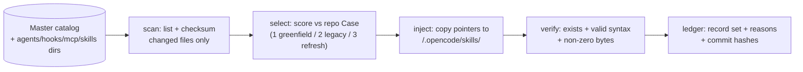

# 17 — Catalog Ingestion: Automated Skill Harvesting & Dynamic Injection

> **Canonical status:** Voice/distribution batch. Implements FR-9 ingestion half (see `01`).
> Runtime harvest precedent: Gate-1 log in `16` §16.3.3 · Guidance UX: `02` §2.4.

## 17.1 — Purpose and Boundary (normative)

`guidance/` keeps each target repo's `.opencode/skills/` stocked with exactly the
skills its 3-Case classification calls for — reading from two sources: (a) the master
catalog (`O:\Claude Code\vantrilex\vantrilex-registry\VANTRILEX_CATALOG.md`) and
(b) the GuildSkills open catalog (`https://guildskills.com/data/guildskills.json`),
and writing to **project-local paths only**. Global user configs (`~/.opencode/`,
`~/.config/`) are never read for mutation and never written. Violating this boundary
fails the release gate.

## 17.2 — Ingestion Pipeline



### 17.2.1 Scan

List all five registry dirs; checksum pointer files; diff against the last ingested
manifest (stored per-repo at `<repo>/.opencode/.harvest-manifest.json`). Unchanged
files are skipped — ingestion is incremental, not bulk re-copy.

### 17.2.2 Select (scoring, normative)

| Signal | Weight | Example |
|--------|--------|---------|
| Repo Case match | 3 | legacy repo (Case 2) scores `archify`, `backend-patterns`-class skills |
| Milestone need | 2 | voice milestone scores `venice-audio-*`, `nemotron-voice-agent-deploy` |
| Autonomy relevance | 2 | planning/translation/governance/overseer skills for away-mode operation |
| Default-selected (✅ in catalog) | 1 | auto-included unless explicitly denied |
| Operator deny-list | −∞ | `<repo>/.opencode/.harvest-deny` vetoes by name |

Minimum score to inject: 2. Every injection records its reasons (Reasons-Not-Rules).

### 17.2.3 Inject

Copy pointer files into `<repo>/.opencode/skills/` (agents/hooks/plugins to their
sibling dirs; MCP stanzas merged into the repo-local `.mcp.json`, secrets via env).
Injection never edits file contents — pointers stay byte-identical to the catalog so
drift is detectable by checksum.

### 17.2.4 Verify

Same zero-byte + syntax pass as Gate 1 (`16` §16.3.2 step 4), scoped to the injected
set. Failure rolls back the injection (delete copied files) and records a ledger error.

## 17.3 — Refresh Cadence and Triggers

- **On session start:** quick manifest diff (cheap — checksums only); inject deltas.
- **On milestone open:** full re-score (Case may have changed, e.g. legacy → refresh).
- **On operator command:** `opencode-voice skills sync --repo <path>` forces full pass.
- **Never:** background silent mutation mid-session — injection only at session
  boundaries, announced in the CLI status line.

## 17.4 — 3-Case Classification Input (normative)

```ts
// src/guidance/case.ts
export type RepoCase =
  | 'greenfield'  // Case 1: new repo, scaffold guidance + starter skills
  | 'legacy'      // Case 2: undocumented, archify-class + doc-generation skills
  | 'refresh';    // Case 3: stale docs, docs-guard-class + update workflow skills

export interface CaseEvidence {
  readonly repoCase: RepoCase;
  readonly signals: readonly string[];  // e.g. 'no README', 'docs/ older than 180d'
  readonly confidence: number;          // 0..1 — below 0.6 asks the operator
}
```

Classification evidence is ledger-recorded; low-confidence classifications pause for
operator confirmation rather than injecting the wrong skill set.

## 17.5 — GuildSkills Integration (normative)

GuildSkills entries are fetched from `guildskills.json`, scored by the same §17.2.2
weights, and injected as pointer files. Every ingested tool is accompanied by a
dedicated `tool--SKILL.md` detailing its invocation contract, best practices, and
edge cases — a tool without its contract file fails verification (§17.2.4).

## 17.6 — Cognitive and Overseer Skills (normative)

Standalone cognitive skills ship with every injection set: autonomous planning,
user-command prompt translation, and session governance. The **session-overseer**
skill governs away-mode: the agent advances the active plan milestone by milestone
using peer-grade judgment; with no plan, or at plan completion, it halts cleanly and
suggests invoking `/prompt-master` to craft the next phase. The overseer stops only
at safety-critical boundaries (FR-12 confirmations, secret handling, ledger writes).

---

*End of `17-CATALOG-INGESTION.md`. Next: `18-VOICE-PIPELINE.md`.*
