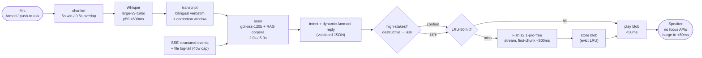

# 18 — Voice Pipeline: STT Chunking, Ammani Brain, Fish TTS Streaming & LRU Cache

> **Canonical status:** Voice/distribution batch. Pipeline truth for FR-5/FR-6/FR-7.
> Wire formats: `06` §6.4–§6.6 · Types: `05` §5.1/§5.4 · Budgets: `01` NFR-1/2/3.

## 18.1 — Pipeline Overview



Stage budgets are end-to-end additive worst case, but STT streams while the user still
speaks and TTS streams while the brain text is final — perceived latency is dominated
by the brain's 2.0 s golden path. **There is no raw terminal audio ring buffer in this
architecture** (ADR-007): the brain consumes structured JSON lifecycle events from the
SSE stream; raw stdout/stderr reaches speech only via file-based log tailing, capped at
40 spoken words per excerpt (§18.6).

## 18.2 — STT: Groq Whisper Audio Chunking (normative)

1. **Capture:** push-to-talk (default) or wake-word gate; 16 kHz mono PCM; capture
   indicator always visible (`02` §2.2).
2. **Chunking:** 5.0 s windows, 0.5 s overlap, `≤ 25 MB` per multipart part.
   Overlap regions dedupe by `verbose_json` word timestamps — words fully inside the
   overlap's second half win; boundary words merge on timestamp equality (±40 ms).
3. **Request:** multipart per `06` §6.4, `language: ar` hint. Code-switching is
   expected: Arabic narrative in dialect, code/log tokens verbatim English.
4. **Stitch + correct:** concatenated transcript shown on CLI for a 3 s correction
   window (`02` §2.4); "no, I meant…" replaces pre-dispatch, else follow-up prompts.
5. **Failure:** per-chunk retry ×2, then `STT_FAILED` → "didn't catch that" (once) →
   text fallback (`02` §2.6). Latency proof: 200-utterance harness, p50 < 500 ms (`11` §11.3).

```ts
// src/voice/stt.ts — chunk descriptor
export interface AudioChunk {
  readonly index: number;
  readonly startsAtMs: number;
  readonly endsAtMs: number;
  readonly bytes: Uint8Array;          // 16kHz mono PCM slice
  readonly overlapMs: 500;
}
export interface Transcript {
  readonly text: string;               // stitched, bilingual verbatim
  readonly language: string;           // provider-detected, informational
  readonly chunkCount: number;
  readonly roundTripMs: number;        // capture-end → transcript-ready
}
```

## 18.3 — Brain: Ammani Arabic Prompt System for `gpt-oss-120b` (normative)

### 18.3.1 System prompt (canonical shape — full text lives in `src/voice/prompts/ammani.system.md`)

```
You are the voice of the developer's ambient coding orchestrator — a peer, not a script.
SYNTHESIZE every reply dynamically in your own authentic voice. Illustrative anchors below
define register and flavor ONLY; NEVER repeat them verbatim. Adapt phrasing, tone, and
pacing to live context, outcome severity, and session specifics.
Spoken output: everyday Ammani Jordanian Arabic software-engineering parlance —
natural particles, fluid English technical terms ("تيستات", "بيلد", "سكيما").
NEVER MSA newsreader prose, exaggerated Beiruti slang, or foreign regional dialects.
Technical spans (code identifiers, file paths, log excerpts, error codes, session
names, CLI commands) stay in technical English, read with English pronunciation.
Never transliterate code into Arabic script. Never translate error codes.
Briefings: BLUF first — outcome + session identity in ≤ 15 spoken words, then at
most 3 change-clauses, then one next-action sentence. Total ≤ 45 spoken seconds;
failure briefings ≤ 15 seconds: state → modules + count → logs saved → next step.
Destructive verbs (destroy/delete/drop/force-push/deploy/rm-rf): ALWAYS ask for
explicit two-way confirmation first. Ambiguous destructive speech: ask, never act.
Retry loops: stay silent on intermediate attempts; heartbeat every 5 min or 3 fails;
halt at 5 consecutive failures and ask for guidance.
Classify every input into exactly one intent: newSession | followUp | control.
Reply ONLY with the JSON shape below. No prose outside JSON.
```

**RAG grounding (normative):** phrasing calibration draws on Gheith-Abandah/JODA
(59k sentences), UniversalDependencies UD South Levantine Arabic-MADAR, and
CAMeL-Lab `camel_tools`; planning methodology on dair-ai Prompt-Engineering-Guide;
BLUF summarization on csebuetnlp xl-sum. Corpora are ingested at prompt-build time;
the corpora manifest (versions + digests) is ledger-recorded per release.

### 18.3.2 Model call

`openai/gpt-oss-120b` on Groq, `temperature 0.4`, `max_tokens 300`, `stream: false`
(wire shape in `06` §6.5). Client-side timer: soft flag at 2.0 s (ledger mark only),
hard abort at 5.0 s → `BRAIN_TIMEOUT` → fallback briefing. Key via keyring `groq`
pool (`acquire`/`release`, `20`).

### 18.3.3 Output schema (validated before any speech — invalid output = fallback, never raw speech)

```ts
export const BrainOutputSchema = z.object({
  intent: z.enum(['newSession', 'followUp', 'control']),
  control: z.enum(['approve', 'cancel', 'repeat', 'switchVoice', 'none']).default('none'),
  reply: z.string().min(1).max(1200),       // Ammani narrative + EN technical spans
  sessionDirective: z.string().optional(),  // prompt text when intent ≠ control
});
export type BrainOutput = z.infer<typeof BrainOutputSchema>;
```

### 18.3.4 Language audit

Every release runs the 100-briefing audit (`11` §11.5): zero non-technical English in
narrative spans; zero Arabic script inside code spans; zero MSA broadcast phrasing;
zero foreign-dialect particles; plus a trust-breaker scan (no hallucinated completion
claims, tone matched to severity — never cheerful on failure, no lectures).
Regressions block the gate.

## 18.6 — Event Feed and Log Tailing (normative, ADR-007)

The brain's world-model input is **structured JSON lifecycle events** consumed straight
from the SSE stream (`session:start`, `agent:action`, `subagent:complete`,
`session:complete`, `session:idle`, `step:complete`) — typed, validated, idempotent.
Raw terminal bytes never enter the audio path and never enter a ring buffer (the
ring-buffer concept is deprecated and SHALL NOT be implemented).

Raw stdout/stderr is observable via **file-based log tailing**: the launcher captures
child output to redacted log files; the brain may quote excerpts on demand subject to
a hard cap of **40 spoken words** per excerpt (longer diagnostics stay in the log with
an offer to continue). The 40-word cap is enforced in `bluf()` post-processing, not
left to model goodwill.

## 18.4 — TTS: Fish Audio Streaming Integration (normative)

1. **Cache first:** key `sha256(normalize(text) + '|' + fishVoiceId)`; hit → play blob
   (< 50 ms), no provider call, no keyring acquisition.
2. **Synthesize:** `POST` streaming per `06` §6.6, model `s2.1-pro-free`, voice from
   `VOICE_IDS` (`05` §5.1). Active voice = operator persona preference
   (`male-default` default) applied universally; in advanced multi-agent runs the
   secondary voice may represent the auditor/reviewer agent. Toggle applies at the
   next utterance boundary, never mid-word.
3. **Playback:** start on first chunk (p50 < 800 ms after text ready); stream to the
   background audio path — no window handles, no focus calls (`02` §2.2).
4. **Persist:** completed blobs within size cap enter the LRU (`set()` evicts
   synchronously, §18.5). Oversize single clips play but are never cached.
5. **Failure:** `TTS_FAILED` / 429 → forced keyring rollover + one retry → still red:
   log-first briefing + cached-phrase playback; operator notified once (E-7).

## 18.5 — 50-Item LRU Cache Implementation (normative)

```ts
// src/voice/cache.ts — backed by `lru-cache`, filesystem blob store
import { LRUCache } from 'lru-cache';

export class AudioCache {
  private readonly lru: LRUCache<string, AudioCacheEntry>;
  constructor(private readonly cfg: AudioCacheConfig) {
    this.lru = new LRUCache<string, AudioCacheEntry>({
      max: 50,                                   // entry bound (hard)
      maxSize: cfg.maxBytes,                     // byte bound (hard)
      sizeCalculation: (e) => e.bytes,
      dispose: (e) => void unlinkBlob(e.blobPath), // eviction deletes bytes
      updateAgeOnGet: true,                      // lastHitAt = recency
    });
  }
  async get(text: string, voice: VoiceId): Promise<Uint8Array | null> {
    const key = cacheKey(text, voice);           // sha256(normalized + voiceId)
    const hit = this.lru.get(key);
    if (!hit) { stats.misses++; return null; }
    hit.hits++; hit.lastHitAt = nowIso(); stats.hits++;
    return readBlob(hit.blobPath);
  }
  async set(text: string, voice: VoiceId, audio: Uint8Array): Promise<void> {
    if (audio.byteLength > this.cfg.maxEntryBytes) return; // play-only, never cache
    const entry: AudioCacheEntry = { … };
    this.lru.set(entry.key, entry);              // eviction runs synchronously here
    await writeBlob(entry.blobPath, audio);
  }
}
```

Normalization before hashing: trim, collapse whitespace, unify Arabic presentation
forms + field stops — so "done." and "done" hit separately (punctuation is prosody),
but invisible Unicode differences never cause misses. Stats (`05` §5.4
`AudioCacheStats`) are exposed to the showcase dashboard (`22`).

---

*End of `18-VOICE-PIPELINE.md`. Next: `19-MOBILE-PAIRING.md`.*
