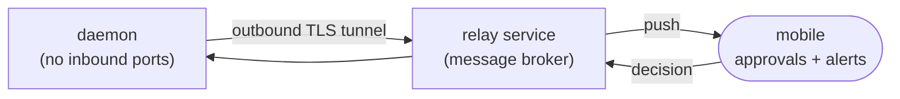

# 19 — Mobile Pairing: Relay Architecture, Token Handshake, Push Alerts & Approval Queue

> **Canonical status:** Voice/distribution batch. Remote truth for persona P2 (`01` §1.2).
> **Implementation status (audit 2026-09-24): no relay, tunnel, push, or approval-queue
> code exists in `src/`** (no mobile directory, no outbound tunnel) — §§19.1–19.4 below
> are the frozen M4 design target, not running behavior.
> Network posture: outbound-only (`03` §3.5.2, `12` §12.5) · Errors: `05` §5.7.

## 19.1 — Remote Relay Architecture (normative)



1. The daemon opens a single outbound TLS connection to the relay; the mobile pairs
   by scanning a one-time code shown by `opencode-voice pair` (the code binds a
   short-lived pairing token, §19.2 — never the server password, never a provider key).
2. No inbound ports on the developer host, ever. NAT/firewall traversal is a
   non-problem by construction.
3. The relay is a dumb broker: it routes opaque envelopes, stores nothing beyond a
   24-hour dead-letter window, and cannot decrypt approval payloads end-to-end
   (payload key derived during pairing handshake, held by daemon + mobile only).

## 19.2 — Cryptographic Token Handshake (normative)

1. `opencode-voice pair` generates a 128-bit pairing secret, displays it as QR +
   numeric code, valid for 120 s, single use.
2. Mobile proves possession via challenge-response (HMAC-SHA256 over server nonce);
   on success both sides derive a session key (X25519 ECDH) and the pairing secret
   is wiped from the daemon.
3. Long-lived mobile auth uses 15-minute access tokens + 7-day refresh tokens,
   both revocable (`opencode-voice pair revoke`). Token theft blast radius is capped
   by short expiry + scope (`approvals:read/write` only — no config, no keys).

## 19.3 — Push Alerts (normative)

T2 approval requests and T1 completion digests (`02` §2.1) publish to the relay;
mobile receives push with session identity + BLUF lead + two actions (Approve /
Details). Alerts expire consistently with the approval TTL (§19.4) — stale pushes
open into a read-only "expired, safe default applied" view, never a live button.

## 19.4 — Mobile Step-Approval Queue (normative)

```ts
// src/mobile/approvals.ts
export interface ApprovalRequest {
  readonly approvalId: ApprovalId;
  readonly sessionId: SessionId;
  readonly action: string;                // secretSafe description of proposed step
  readonly requestedAt: ISODateString;
  readonly expiresAt: ISODateString;      // TTL 10 min default, configurable
  status: 'pending' | 'approved' | 'denied' | 'expired';
}
export interface ApprovalDecision {
  readonly approvalId: ApprovalId;
  readonly verdict: 'approved' | 'denied';
  readonly decidedAt: ISODateString;
  readonly idempotency: string;           // dedupe key — retries never double-apply
}
```

Rules: exactly-once application via `idempotency` key; expiry applies the safe
default (pause session, ledger note — `02` §2.2 rule 4); voice and CLI can resolve
the same queue (first verdict wins, losers notified); full decision history lands in
the ledger (`10`).

---

*End of `19-MOBILE-PAIRING.md`. Next: `20-KEYRING.md`.*
