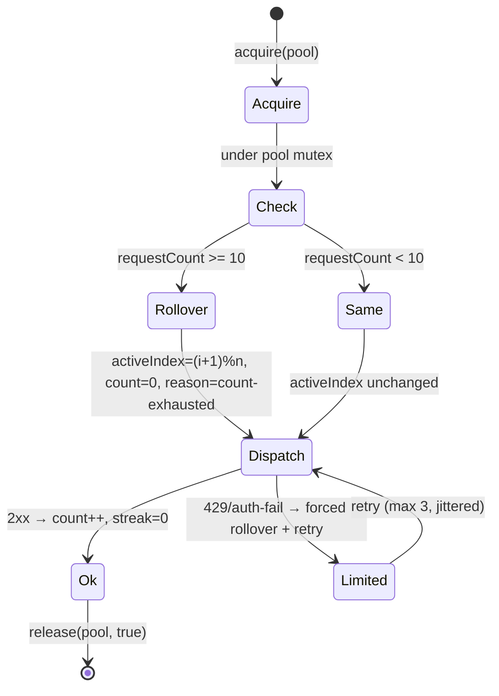

# 20 — Keyring: Rotation Mechanics, Atomic Counters, #11 Rollover, Mutex & Persistence

> **Canonical status:** Voice/distribution batch. Engine truth for FR-8 (see `01`).
> Decision: ADR-003 (`09`) · Types: `05` §5.5–§5.6 · Vault security: `12` §12.2.

## 20.1 — Engine Overview (normative)

`src/voice/keyring.ts` owns all provider key material. Two independent pools
(`groq`, `fish`); each pool: ordered key list, `activeIndex`, `requestCount`
(completed requests on the active key), failure streak, and an async mutex.
The strict invariant: **after exactly 10 completed requests on the active key,
the 11th acquisition rolls over to the next key** (`ROTATION_LIMIT = 10`, `05` §5.6).



## 20.2 — Acquire / Release Contract (normative)

```ts
// src/voice/keyring.ts
export interface AcquiredKey {
  readonly pool: KeyPool;
  readonly keyId: string;        // NON-SECRET fingerprint (e.g. 'K2', last-4 hash)
  readonly material: Buffer;     // secret bytes — zeroed on release
}
export interface Keyring {
  acquire(pool: KeyPool): Promise<AcquiredKey>;
  release(pool: KeyPool, ok: boolean, status?: number): Promise<void>;
}
```

1. `acquire` runs under the pool mutex: evaluate `nextRotation` (`05` §5.6),
   decrypt-on-first-use per boot (then cache in zeroed buffer), return a copy.
2. The caller performs exactly one provider request with the material, then calls
   `release` exactly once. `ok=true` → `requestCount++`, streak reset. `ok=false`
   with 429/401/403 → forced rollover (`lastRolloverReason` set), jittered retry
   budget of 3, then `RATE_LIMITED`/`POOL_EXHAUSTED` (`06` §6.7).
3. `release` zeroes the caller-visible copy; the pool's cached buffer is zeroed only
   on rollover or shutdown (avoids decrypt-per-request cost while bounding exposure).
4. Every request — including cache-hit bypasses (which skip acquisition entirely) —
   is counted correctly: **cache hits never touch the keyring**, so they neither
   consume quota slots nor disturb the count. TTS cache-first ordering (`18` §18.4)
   is what makes the 10-request invariant meaningful under repeat traffic.

## 20.3 — Atomic Counter Increments & Mutex (normative)

The pool mutex serializes the full `acquire → dispatch → release` critical section
per pool (not just the counter read). This makes the increment atomic by construction:
no two concurrent requests can read the same `requestCount`, dispatch on the same
slot, and both increment — the exactness test (`11` §11.4) runs 8-way concurrency
precisely to prove it. Cross-pool operations never share a mutex (Groq pressure must
not serialize Fish synthesis).

Mutex implementation: a promise-chain queue per pool with FIFO fairness and a 30 s
acquisition timeout (timeout → `POOL_EXHAUSTED`-adjacent typed error, ledger flag,
never silent skip).

## 20.4 — Rollover on Request #11 (worked proof)

Pool `[K1, K2, K3]`, all counters zero:

| Requests | Active | Counter after | Note |
|----------|--------|---------------|------|
| 1–10 | K1 | 1→10 | steady |
| 11 | K2 | 0→1 | `rollover: true`, reason `count-exhausted` |
| 12–20 | K2 | 2→10 | steady |
| 21 | K3 | 0→1 | rollover again |
| 22–25 | K3 | 2→5 | quarter pool |

Single-key pools: rollover wraps to the same key with counter reset and a ledger
warning (`pool-size-1` — operator urged to add keys). Empty pool: `acquire` throws
`POOL_EXHAUSTED` before any network call.

## 20.5 — DPAPI Persistence (normative)

Pool secrets persist as `VaultBlob` (`05` §5.5): `nonce` + `ciphertext` (DPAPI
`safeStorage.encrypt`) + `checksum`, file `0600`/ACL'd. Persisted on: every rollover,
every `vault set`, graceful shutdown. Loaded on boot with checksum-then-decrypt;
corrupt → `VAULT_CORRUPT`, pool refused (E-11), other pool unaffected. Persisted state
carries counters + `activeIndex` so restart resumes mid-cycle instead of resetting
quotas (which would double-spend the fresh window).

---

*End of `20-KEYRING.md`. Batch 3 (files 15, 17, 18, 19, 20 + 16 early) complete. Next batch: `21–28`.*
