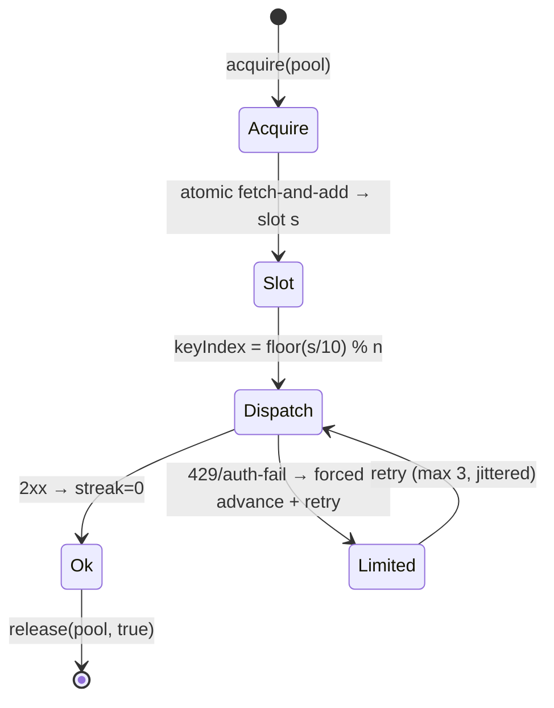

# 20 — Keyring: Rotation Mechanics, Lock-Free Slots, #11 Rollover & Persistence

> **Canonical status:** Voice/distribution batch. Engine truth for FR-8 (see `01`).
> Decisions: ADR-003 + ADR-005 (lock-free) (`09`) · Types: `05` §5.5–§5.6 · Vault: `12` §12.2.

## 20.1 — Engine Overview (normative)

`src/voice/keyring.ts` owns all provider key material. Two independent pools
(`groq`, `fish`); each pool: ordered key list plus a **lock-free atomic sequence
counter**. Slot assignment is arithmetic — no mutex on the acquisition path:

```typescript
const slot = atomicIncrement(counter);          // sub-microsecond, wait-free
const keyIndex = Math.floor(slot / 10) % keyPool.length;
```

The strict invariant is preserved: **slots 0–9 → K1, slots 10–19 → K2, …, so the
11th request deterministically rolls over** (`ROTATION_LIMIT = 10`, `05` §5.6).
Cross-pool operations are independent by construction (Groq pressure never serializes
Fish synthesis).



## 20.2 — Acquire / Release Contract (normative)

```ts
// src/voice/keyring.ts
export interface AcquiredKey {
  readonly pool: KeyPool;
  readonly keyId: string;        // NON-SECRET fingerprint (e.g. 'K2', last-4 hash)
  readonly material: Buffer;     // secret bytes — zeroed on release
}
export interface Keyring {
  acquire(pool: KeyPool): Promise<AcquiredKey>;
  release(pool: KeyPool, ok: boolean, status?: number): Promise<void>;
}
```

1. `acquire` performs a single atomic fetch-and-add on the pool counter, derives
   `keyIndex` arithmetically, decrypt-on-first-use per boot (then cache in zeroed
   buffer), and returns a copy. No lock is held; acquisition is wait-free.
2. The caller performs exactly one provider request with the material, then calls
   `release` exactly once. `ok=true` → streak reset. `ok=false`
   with 429/401/403 → forced counter advance past the current key's remaining slots
   (`lastRolloverReason` set), jittered retry budget of 3, then
   `RATE_LIMITED`/`POOL_EXHAUSTED` (`06` §6.7).
3. `release` zeroes the caller-visible copy; the pool's cached buffer is zeroed only
   on rollover or shutdown (avoids decrypt-per-request cost while bounding exposure).
4. Every request — including cache-hit bypasses (which skip acquisition entirely) —
   is counted correctly: **cache hits never touch the keyring**, so they neither
   consume quota slots nor disturb the count. TTS cache-first ordering (`18` §18.4)
   is what makes the 10-request invariant meaningful under repeat traffic.

## 20.3 — Lock-Free Slot Assignment (normative, ADR-005)

The atomic fetch-and-add hands out monotonically increasing slot numbers; key
selection is pure arithmetic (`floor(slot/10) % n`), so concurrent acquisitions can
never share or double-spend a slot — exactness holds structurally, not statistically.
The distribution proof (`11` §11.4) fires 25 concurrent acquisitions and asserts slots
0–9 resolve K1, 10–19 K2, 20–24 K3. Key material buffers remain zero-on-release and
zero-on-rollover per §20.2 rule 3; only the *counter* is lock-free, never the secret
handling (security boundary unchanged). Note: the `requestCount`/`activeIndex` shapes
in `05` §5.6 are superseded by the sequence-counter model; M2 implementation updates
`05` accordingly (mechanical type migration, no semantic change to the invariant).

## 20.4 — Rollover on Request #11 (worked proof)

Pool `[K1, K2, K3]`, counter starting at 0 (slots distributed arithmetically):

| Slots | Key | Note |
|-------|-----|------|
| 0–9 | K1 | steady; slot 10 rolls |
| 10–19 | K2 | rollover at request #11, reason `count-exhausted` |
| 20–24 | K3 | rollover again at request #21 |

Single-key pools: rollover wraps to the same key with counter reset and a ledger
warning (`pool-size-1` — operator urged to add keys). Empty pool: `acquire` throws
`POOL_EXHAUSTED` before any network call.

## 20.5 — DPAPI Persistence (normative)

Pool secrets persist as `VaultBlob` (`05` §5.5): `nonce` + `ciphertext` (DPAPI
`safeStorage.encrypt`) + `checksum`, file `0600`/ACL'd. Persisted on: every rollover,
every `vault set`, graceful shutdown. Loaded on boot with checksum-then-decrypt;
corrupt → `VAULT_CORRUPT`, pool refused (E-11), other pool unaffected. Persisted state carries the sequence counter so restart resumes mid-cycle instead of
resetting quotas (which would double-spend the fresh window).

---

*End of `20-KEYRING.md`. Batch 3 (files 15, 17, 18, 19, 20 + 16 early) complete. Next batch: `21–28`.*
