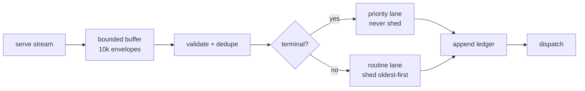
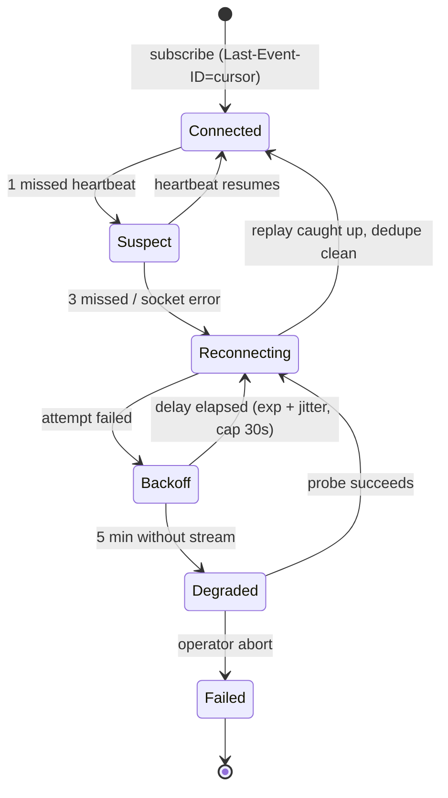

# 25 — Client-Server RPC: Wire Protocol, Backpressure & Reconnection State Machines

> **Canonical status:** Design/immunity/owner batch. Network truth for FR-2/FR-3.
> Endpoint inventory: `03` §3.4 · Wire examples: `06` §6.2–§6.3 · Types: `05` §5.3.

## 25.1 — Transport and Framing (normative)

- **Requests:** HTTP/1.1 JSON to `http://127.0.0.1:<port>`; `Authorization: Bearer`
  on every call; client timeout 10 s (reads) / 30 s (prompt dispatch); idempotency
  keys on `POST /session` and `POST /session/{id}/prompt` (client-generated UUIDv4,
  server echoes on 409 per F-09).
- **Events:** SSE `GET /event` with `Accept: text/event-stream`; per-dispatch framing
  `event:` (lifecycle type) + `id:` (envelope id) + `data:` (JSON envelope); comment
  heartbeats (`: ping`) every 15 s; 3 missed heartbeats = dead connection.
- **Cursors:** client sends `Last-Event-ID` on every (re)connect; server replays
  missed envelopes in order; client dedupes on `envelope.id` (never on cursor order —
  redelivery may interleave).

## 25.2 — RPC Method Table (normative)

| Method | HTTP mapping | Idempotent | Timeout | Retry |
|--------|-------------|------------|---------|-------|
| `health.check` | `GET /health` | yes | 2 s | poll loop (250 ms × 40) |
| `session.create` | `POST /session` | key-scoped | 10 s | retry same key only |
| `session.prompt` | `POST /session/{id}/prompt` | key-scoped | 30 s | retry same key only |
| `session.get` | `GET /session/{id}` | yes | 10 s | backoff ×3 |
| `session.list` | `GET /session` | yes | 10 s | backoff ×3 |
| `session.abort` | `POST /session/{id}/abort` | yes | 10 s | once, then operator |
| `event.subscribe` | `GET /event` (SSE) | n/a (stream) | heartbeat-driven | unbounded, backoff-capped |
| `contract.probe` | `GET /openapi.json` | yes | 10 s | once per boot, warn-only |

Retry uses a fresh idempotency key only when the first attempt provably never reached
the server (connection refused / DNS); otherwise the original key is reused so a
retried `create`/`prompt` can never double-apply.

## 25.3 — Event Backpressure (normative)

Buffer full policy: shed oldest *routine* envelopes first, increment `shedRoutine`
counter, ledger-mark the shed range; terminal envelopes (`session:complete`,
`session:idle`, approval requests) bypass the buffer via the priority lane and are
never shed. Shed marks are included in the stress proof (`23` §23.2).

## 25.4 — Reconnection State Machine (normative)

Transition actions: entering `Reconnecting` freezes the speech queue (no partial
briefings mid-gap); entering `Connected` replays (`seq` > cursor), flags gap rows,
reconciles `session.list` vs ledger, then unfreezes; entering `Degraded` sends one
T1 notice ("connection unstable, tracking locally") and polls `session.get` per
session at 30 s intervals until the stream returns.

---

*End of `25-CLIENT-SERVER-RPC.md`. Next: `26-AGENT-LAUNCHER.md`.*
