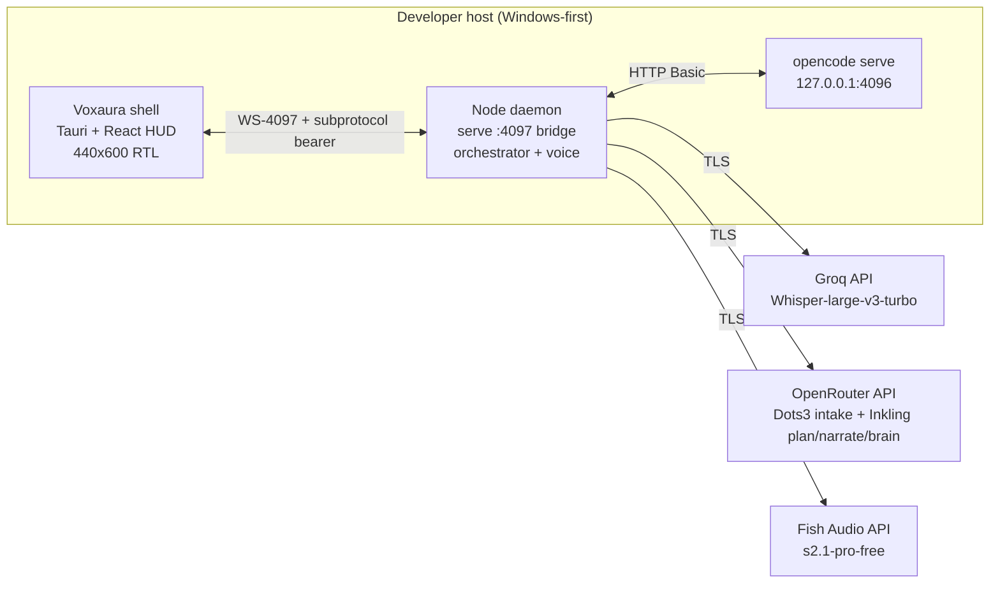

# 03 — Technical Specification: Runtime Engine, TypeScript Strictness, Dependencies & Network

> **Canonical status:** Foundation. Implements FR-1, FR-2 and NFR-5/NFR-8 (see `01`).
> Companion docs: `04-ARCHITECTURE.md`, `06-API-SPECIFICATION.md`, `26-AGENT-LAUNCHER.md`.

## 3.1 — Runtime Engine

| Decision | Value | Reason |
|----------|-------|--------|
| Primary runtime | Node.js 22 LTS (Active) | Daemon (`src/`) is ESM `NodeNext`, compiles to `dist/`; sidecar bundles `node.exe` + pruned deps via `scripts/provision-sidecar.mjs` |
| Desktop shell | Tauri v2 + React 18 + Vite + Tailwind (`apps/desktop/src`, HUD `App.tsx` 716 lines, Arabic RTL) | Native window + Rust supervisor in one installer |
| Supervisor | Rust (`apps/desktop/src-tauri/src/main.rs`, single src file, `windows-sys 0.61`) — process owner, Job Object, secrets, ports, C2 identity | Node cannot apply owner-only DACLs or own the Job Object |
| Package manager | `npm` (real) | `pnpm-lock.yaml` is vestigial; root + desktop both use npm |
| Language | TypeScript 5.x, `strict` family (see §3.2) | Entire `src/` is typed; `*.test.ts` excluded from root build but typechecked separately since v0.7.2 |
| IPC | WS-4097 (`ws://127.0.0.1:4097/v1/ui`, subprotocol `voice-ui.v1`) + Tauri invoke (4 commands) + loopback HTTP to serve | Matches the shipped supervisor/daemon/shell topology; no custom sockets beyond WS-4097 |
| AI runtime | OpenCode v2 `serve` (external binary, untouched upstream) on `127.0.0.1:4096` | Daemon talks to it via typed HTTP client only; never forked/patched |

> **Version:** v0.7.2 everywhere (`package.json`, `apps/desktop/package.json`,
> both lockfiles, `tauri.conf.json`, `Cargo.toml`, `provision-sidecar.mjs`).
> Do not bump versions in this doc.

### 3.1.1 `tsconfig.json` (normative, project root)

```json
{
  "compilerOptions": {
    "target": "ES2023",
    "module": "NodeNext",
    "moduleResolution": "NodeNext",
    "strict": true,
    "noUncheckedIndexedAccess": true,
    "exactOptionalPropertyTypes": true,
    "noImplicitReturns": true,
    "noFallthroughCasesInSwitch": true,
    "forceConsistentCasingInFileNames": true,
    "skipLibCheck": true,
    "declaration": true,
    "sourceMap": true,
    "outDir": "dist",
    "rootDir": "src",
    "types": ["node"]
  },
  "include": ["src/**/*.ts"],
  "exclude": ["node_modules", "dist", "**/*.test.ts"]
}
```

Test files are typechecked separately by `tsconfig.tests.json`
(`npm run typecheck:tests`, in the gate since v0.7.2 after 62 latent errors
across 9 files were found hiding under `exclude` + Vitest transpile-only).
`exactOptionalPropertyTypes: true` in **both** tsconfigs — `{x?: T}` cannot be
assigned `undefined`; build the object conditionally.
`noUncheckedIndexedAccess: true` — `arr[i]` is `T | undefined`. ESM/NodeNext:
relative imports in `src/` **must** use the `.js` extension even though you
edit `.ts`. Desktop has `noEmit`.

### 3.1.2 Source layout (normative, re-derived at `6be0363`)

```
src/
  cli.ts, daemon.ts        # entry (`serve`/`live`/`doctor`/`vault bootstrap`/`knowledge`); composition root `startDaemon()` (`daemon.ts:190`)
  common/                  # brands, config, errors, logger (redacting), index barrel (`cli.ts:7` only)
  ipc/                     # index, protocol (frozen WS-4097 schemas + caps), audio (`[0x01|seq|mp3]`, 32 KiB), ui-server (sink)
  orchestrator/            # audio-pipeline, command-router (FR-12), coordinator (Dots3 intake + Inkling plan), inventory,
                           # mentions, narrator (Inkling, persona-prepended), prompt-optimizer, slash
  voice/                   # brain (Inkling via OpenRouter), stt (Groq Whisper `ar`), tts (Fish only), tts-credit,
                           # ingest (5 s windows), cache, keyring, key-store, vault, win-acl
  runtime/                 # client (Basic auth serve client), opencode-bridge, vad (dynamic seam), fuzzy-match, index
    laya/                  # 7 modules DEAD by decision (294 MB model never bundled; `layaReady:false` honest)
  knowledge/               # index, types, build (43 shared + 16 stylistic), retriever (BM25 K1=1.2 B=0.75),
                           # guard, normalize (digit-preserving), personas (registry); shared/* + styles/*
  policy/                  # claim-matcher (test-only scaffolding) + sidecar/telemetry guards
  telemetry/               # writer (redacting) + index → `voice-runtime.jsonl`
  memory/vault.ts          # Obsidian self-bootstrap logic
  launcher/                # launcher + index (barrel via `cli.ts:8`, `daemon.ts:28`)
apps/desktop/src/          # App.tsx HUD (440x600 RTL), audio/{vad,playback,capture}, bridge/ws.ts, sessions/store,
                           # matrix/, settings/*, window/*, components/* (incl. Crest.tsx — 0 importers, inert)
apps/desktop/src-tauri/    # main.rs (supervisor) + build.rs + tauri.conf.json + Cargo.toml (v0.7.2)
apps/desktop/e2e/          # stub-daemon.mjs (fake control plane :4197) + 14 specs (18 tests)
scripts/                   # 11 mjs: docs-verify, docs-verify-self-test, test-blindspots, provision-sidecar,
                           # packaging-preflight, release-verify, lint-baseline, key-report, generate-whiteboard-assets + live_console_test.ts
```

Reachability (resolved from `daemon.ts` + `cli.ts`, static AND dynamic):
LIVE **53** · DEAD **7** (`src/runtime/laya/*`) · TEST-ONLY **1**
(`claim-matcher.ts`) · live source lines **9122** per `docs:verify` derivation. The dynamic seam is
load-bearing: `daemon.ts:523` loads `./runtime/vad.js` via `import()` because
it pulls `onnxruntime-node`; a static import would make a missing native
package fatal in the sidecar (pinned by `sidecar-safety.test.ts`). Barrel
bypass: `daemon.ts:22` imports `PERSONA_DIRECTIVES` deep so the daemon never
drags BM25 + corpus; `cli.ts:17` is the single barrel importer.

## 3.2 — TypeScript 5.x Strict Guidelines

1. `strict`, `noUncheckedIndexedAccess`, `exactOptionalPropertyTypes` are always on.
2. `any` is forbidden; ingress data (SSE payloads, API JSON) enters through `unknown`
   + `zod` (or equivalent) validators whose inferred types become the canonical models (`05`).
3. Every `catch` narrows via `instanceof` / type guards; rethrow as typed
   `OrchestratorError` with `code`, `retryable`, and `secretSafe` message fields.
4. No non-null assertions (`!`) in production paths — test fixtures only.
5. Public module surface is explicitly `export`ed; barrel files re-export types only
   (`export type { … }`) to preserve `isolatedModules` safety.

## 3.3 — Dependency Manifest (re-derived at `6be0363`; prose below wins over the frozen table that used to live here)

The old table named `@opencode/client`, `eventsource`, `groq-sdk`, `lru-cache`,
`pino`, `zod` as the normative core with `pnpm` default. That is stale on every
row: `@opencode/client` appears only in two prose comments
(`src/runtime/client.ts:7,10`) describing the shipped client as its "documented
equivalent" — the serve client is a small typed HTTP client sending HTTP
**Basic** (`basicAuth()`, `client.ts:14`; Bearer is rejected). `eventsource`
appeared only in a manifest and at `scripts/provision-sidecar.mjs:51`.
`groq-sdk` is not how Whisper is reached in the shipped path under audit
(STT contract: `GroqWhisperClient.transcribe`, `stt.ts:93`,
`whisper-large-v3-turbo`, `language:'ar'`, `verbose_json`, `:98-100`,
`STT_TIMEOUT_MS=15000` at `:135`). `pino` is imported by
`src/common/logger.ts:1` (`createLogger`, re-exported, **never called**) — a
dead module owned by another lane. **And `provision-sidecar.mjs` writes its OWN
manifest and runs its own `npm install`, so removing a root dep changes the
shipped payload by nothing** — `eventsource`/`pino` kept shipping after root
removal until the sidecar manifest line goes too. Change both places, then
verify eradication (`node -e` over the lock, `npm ls` for extraneous).

What the tree actually shows: `zod` for ingress validation (frozen WS-4097
schemas `protocol.ts`, `UiCommandSchema.strict()` `:425-467`, additive frames
`hello/event/inventory/agents/notice/voice/context/ack/error`); zero-dep
RFC 6455 server (`src/ipc/`); hand-rolled zero-dep BM25 (`retriever.ts:30-31`);
Fish TTS as a small typed HTTP client (`src/voice/tts.ts`, `TTS_MODEL
s2.1-pro-free` at `:31`, `latency:'balanced'` measured 426-556 ms vs
`normal` 1405-1432 ms, `chunk_length:300`, `FISH_TIMEOUT_MS=20000` at `:441`,
credit interceptor `FishCreditError` 402/429 at `:326`); no ONNX ships at all
(`models/*.onnx` gitignored, `tauri.conf.json` bundles only `sidecar/**/*`;
installed builds use the RMS fallback `daemon.ts:532` / `ingest.ts:40`).

### 3.3.1 Production shape (descriptive, not a manifest copy)

- Serve client: typed HTTP, Basic `opencode:<password>`, controls answer
  `204 No Content`; `promptEnvelope` version-aware (flat 2.0.x default, nested
  1.18.x); `listAgents(directory)` per the 2.0.x `?directory=` contract.
- STT: Groq Whisper `whisper-large-v3-turbo`, `language:'ar'`
  (English-in → Arabic-gibberish by design), `STT_TIMEOUT_MS` 15 s, pipeline
  drops the window and continues (`stt-timeout` notice, `daemon.ts:781`).
- Brain/intake/plan/narration: OpenRouter free-tier only —
  `dots-studio/dots-3-note-preview:free` intake (`coordinator.ts:22`),
  `thinkingmachines/inkling:free` coordinator (`:23`), narrator
  (`narrator.ts:52`), brain (`brain.ts:177`). Mandatory
  `User-Agent: opencode/1.0 (Voxaura)` (`brain.ts:23`; Inkling 403s without an
  agentic UA), `reasoning:{effort:'none'}` for Inkling (else `finish=length`,
  `content:null`), strict `json_schema` (else raw tool-call syntax).
- TTS: Fish Audio only (`edge-tts` 0 hits in `src/`, banned by policy);
  `stripSpeechText` (`tts.ts:64`), `splitSentences` (`:157`),
  `SpeechGate.capture/isCurrent` (`:189-203`, barge-in abort),
  `synthesizeStream` (`:239`), raced timeout (`:501`).
- Keys: `Keyring.release(key,ok,status)` (`keyring.ts:89`) advances only on
  429/401/403; `ROTATION_LIMIT` 10 reqs/key (`:9`); `httpStatusOf`
  (`errors.ts:51`) maps BRAIN_AUTH→401, RATE_LIMITED→429.

### 3.3.2 Native / OS bindings

- Secrets: Rust supervisor owns `machine.key` + DACLs (`6be0363`); Node
  `vault.ts` consumes. No DPAPI/`safeStorage` import ships; no
  `node-data-protection` dependency. See `12` §§12.2–12.3 + `win-acl.ts`
  (measured `icacls` failure, `ownerOnlyAclAvailable()` reporting).
- Audio I/O: renderer `AudioCapture` (AudioWorklet + ScriptProcessor(4096)
  fallback, 16 kHz mono Int16, 100 ms / 3200 B frames, `capture.ts:7-8,37-42`,
  80 ms energy throttle); renderer VAD RMS-only (`audio/vad.ts:7-27`,
  `isSpeechFrame(th=-30 dB)`; zero `onnx|silero` hits in renderer); daemon
  ingest exact 5 s windows (`WINDOW_BYTES=160_000`, `ingest.ts:6`, cap 6,
  shed-oldest); VAD gate Silero-dynamic-import with RMS fallback
  (`daemon.ts:523,532`, serial `await isSpeech`, 512 samples → 156
  frames/window). No ONNX ships, including VAD.

## 3.4 — Serve + Bridge Contract Inventory (consumed surface, re-derived at `6be0363`)

Base serve: `http://127.0.0.1:4096` · Auth: HTTP **Basic**
`opencode:<OPENCODE_SERVER_PASSWORD>` (Bearer is rejected — the old table's
`Authorization: Bearer` row was fixed after the live harness proved
`WWW-Authenticate: Basic realm="Secure Area"`, Basic→200, Bearer→401).
Bridge: `ws://127.0.0.1:4097/v1/ui`, subprotocol `voice-ui.v1`
(`protocol.ts:8`), bearer as extra subprotocol token
(`[voice-ui.v1, <token>]`, `bridge/ws.ts:283`), `contractVersion '3.1.0'`
(`App.tsx:113`), resume `?lastSeq=max(0,lastSeq)` on every connect
(`ws.ts:281`; `-1` sentinel kept locally; without the floor the server's
`lastSeqOf` returns NaN and skips replay — measured 25 s hello-only cold
launch). Reconnect backoff 50 ms doubling + 30 jitter, cap 2500
(`ws.ts:175-184`); ack ledger 5 s timeout (`:311-316`); downlink binary
`[0x01|u16be seq|MP3]` (`ws.ts:374-379`), strict FIFO player, corrupt chunk
skipped, `PLAYBACK_QUEUE_CAP=32` drop-oldest, `PLAYBACK_GAIN=0.9`
(`playback.ts:28,83-89,130-136,171`).

| # | Surface | Purpose | Used by |
|---|---------|---------|---------|
| S-1 | `GET /api/session` (+ `probeHealth` authenticated) | List/reconcile sessions (serve 2.0.12 shape `{data:[...]}`) | `runtime/client.ts`, inventory |
| S-2 | `POST /api/session` (create), `promptSession` → `msg_…` receipt | Create + dispatch prompts | orchestrator `think()` |
| S-3 | `GET /api/session/{id}` + `/context` (StepFinishPart token sums; `contextUsage()`; window vs lifetime-spend distinguished, `percent:null` when unknown) | Status + context gauge | bridge + HUD |
| S-4 | Controls (`setSessionAgent`/`setSessionModel` 204, `compactSession`/`interruptSession`/`revertSession`) | 360° session control | command router |
| S-5 | `/api/skill`, `/api/model` (`ModelV2Info.limit:{context,output}`), `/api/provider`, `/api/health` | Real skills catalog + model windows (not invented) | `getEnvironmentStatus()` |
| W-1 | `hello` (`protocol.ts:386`) + version handshake (`refused` on mismatch) | Shell↔daemon identity + resume cursor | `ui-server.ts:414`, `bridge/ws.ts` |
| W-2 | `event` / `inventory` / `agents` / `context` (`:403,485,506,547`) | Session/agent/context fan-out | daemon publish, shell render |
| W-3 | `voice` (`:535`) + `notice` (`:520`, sink-redacted) | Speaking state + transcript; Arabic banners incl. `voice-disabled-no-keys`, `stt-timeout`, `brain-failed`, `tts-failed`, credit codes | HUD pill + banner pipe |
| W-4 | `ack` (`:470`, inline `:505-511`) + `error` (inline `:471,485,490`) | Command receipts; oversize-binary rejection (socket kept) | router + shell |
| W-5 | `UiCommandSchema.strict()` (`:425-467`, bounded `ses_` regex) + `CommandKind` 14-member union (`bridge/ws.ts:73-87`) | Validated inbound commands; `mute` renderer-local, `createSession/toggleSessionSkill/execSessionShell` type+stub only | router dispatch |

> Contract-version probe: on boot, fetch the OpenAPI document and record
> `info.version`; if major differs from the pinned adapter version, log
> `CONTRACT_DRIFT` and continue read-only-safe (E-12, `04` §4.6). Full wire detail,
> error schemas, and SSE envelope in `06-API-SPECIFICATION.md` / `25-CLIENT-SERVER-RPC.md`.
> Where those frozen specs say Bearer, DPAPI, or relay — this section and the
> code win (see `00` §12).

## 3.5 — Network Topologies (re-derived at `6be0363`)

### 3.5.1 Local (default, normative)



- `serve` binds `127.0.0.1` only — never `0.0.0.0` (NFR-6; zero `0.0.0.0`
  matches in `main.rs`). Supervisor spawns serve
  (`--port 4096 --hostname 127.0.0.1`, `main.rs:1434`) then the sidecar
  (`sidecar/dist/cli.js serve`); both adopted into a `KILL_ON_JOB_CLOSE` Job
  Object; child logs append-only (`daemon.log`/`daemon-stdout.log`,
  `opencode.log`/`opencode-stdout.log` — a restart never truncates).
- Fixed ports: 4096 serve · 4097 daemon WS · 4197 E2E stub control (fake HTTP,
  `stub-daemon.mjs:57,169`) · 1420 Vite dev (`strictPort`). Needs all free —
  stop installed `voxaura.exe` / `Voxaura\sidecar\node.exe` or the stub fails
  `EADDRINUSE`.
- Egress allowlist: Groq + Fish Audio + OpenRouter endpoints only (plus package
  registries at install time).

### 3.5.2 Remote-pairing (mobile relay, doc `19` — UNSHIPPED, bannered)

The relay is an outbound-only tunnel from daemon → relay service → mobile; no
inbound ports are opened on the developer host. **Status: no relay/QR/approval
code ships** — the only trace is a `'mobile'` union member in
`runtime/client.ts`. `docs/19-MOBILE-PAIRING.md` carries a supersession banner.
Do not plan against it until a relay exists.

## 3.6 — Configuration Schema (env, normative, re-derived at `6be0363`)

```env
# Required (presence only — doctor reports names/counts, never values)
OPENCODE_SERVER_PASSWORD=<opaque, child-env only, per-install serve.pass>
GROQ_API_KEYS=<comma-separated pool, vault-preferred>
FISH_AUDIO_KEYS=<comma-separated pool, vault-preferred>
OPENROUTER_API_KEY=<pool, vault-preferred; Dots3 + Inkling>

# Optional with defaults
OPENCODE_PORT=4096
OPENCODE_HOSTNAME=127.0.0.1
VOICE_DEFAULT=male
BRAIN_GOLDEN_MS=2000
BRAIN_CEILING_MS=5000
TTS_CACHE_SIZE=50
LOG_LEVEL=info
CAPTURE_MODE=push-to-talk
BRIEFINGS=bluf
QUIET_HOURS=22:00-07:00
MUTE_ON_CALL=on
MIC_DEFAULT=armed
VOXAURA_VAULT_DIR=<optional vault location override>
VOICE_RUNTIME_DIR=<optional runtime-dir override (main.rs:514-528)>
VOICE_RUNTIME_IPC_TOKEN=<supervisor→sidecar handoff, never baked into bundle>
VOXAURA_OWNER_KEY=<supervisor→sidecar handoff>
VOXAURA_MACHINE_KEY=<hex supervisor→sidecar handoff (main.rs:868,886)>
```

Env sanitization rules (name allowlist, value redaction in logs, vault
precedence over env) are specified in `12-SECURITY.md` §§12.4–12.6.
Keyless daemon: control plane up, audio dropped,
`voice-disabled-no-keys` until keys are saved (live pipeline rebuild).
Present-but-invalid key ≡ healthy until first utterance (401/403 advances
silently — check validity first on sudden STT/TTS/brain failure).

## 3.7 — CLI dispatch + gate map (added at `6be0363` review)

| argv | Function | Notes |
|---|---|---|
| `doctor` | `doctor()` (`cli.ts:21`) | env presence (never values) + vault counts + `probeHealth(serve)` |
| `vault bootstrap` | `vaultBootstrap()` (`:60`) | env pools → encrypted `vault/keyring.dat` |
| `live` | `liveLoop()` (`:76`) | REAL provider round-trip (burns quota; never in gate) |
| `serve` | `serveDaemon()` (`:143-176`) | dynamic `import('./daemon.js')`, fail-closed on empty password, SIGINT/SIGTERM → `stop()`; only production importer of `startDaemon` |
| `knowledge ["<q>"]` | `knowledgeReport()` (`:205`) | `assertParity/buildIndex/verifyKnowledge` + optional search |
| else | usage, exit 2 | — |

`test:vantrilex` = 7 stages (`package.json:28`): typecheck prod → typecheck
tests → eslint (`--max-warnings 0`) → oxlint baseline (pins **8**) → root
vitest (**705 / 60 files**) → desktop vitest (**142 / 24 files**) → e2e
Playwright (**18 / 14 specs**, rebuilds root `dist/` first). `cargo test`
**52** (MSVC env). `docs:verify` re-derives every number here and exits 1 on
mismatch; `test:blindspots` measures 58/61 modules reached (informational).
Coverage thresholds deliberately unset (`vitest.config.ts` never enabled
coverage; the old `lines: 80` never evaluated).

---

*End of `03-TECHNICAL-SPECIFICATION.md`. Next: `04-ARCHITECTURE.md`.*
