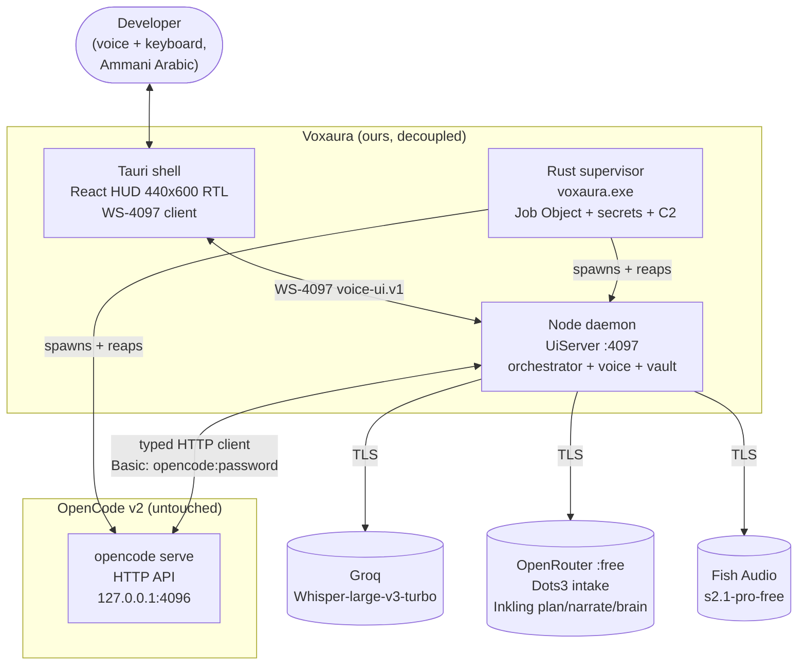
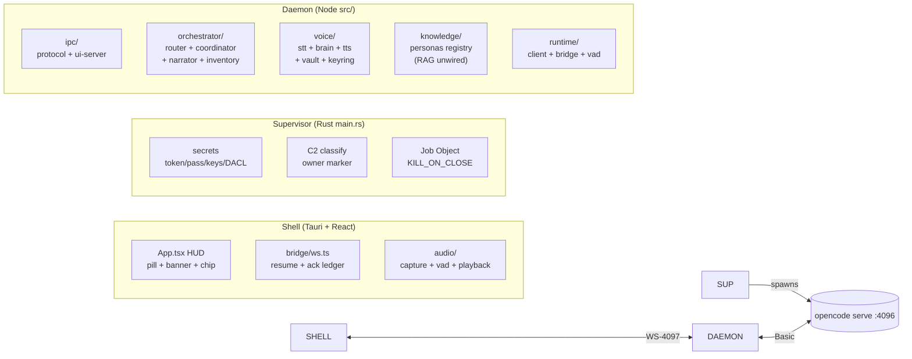
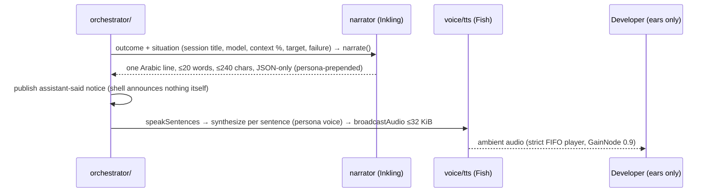
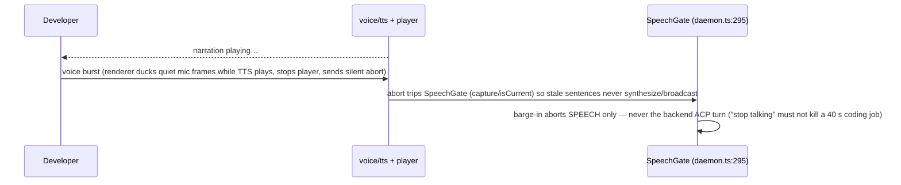
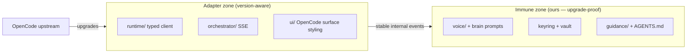

# 04 — Architecture: Decoupled Outer Host / Ambient Orchestrator over OpenCode v2

> **Canonical status:** Foundation. System architecture truth.
> Implements the update-immunity boundary; realizes FR-1–FR-4, FR-9, FR-11, FR-12 (see `01`).
>
> **Autonomy doctrine (normative):** components below are staffed by genuine developer-grade
> intelligence with pragmatic decision-making, not brittle deterministic scripts. Hard
> constraints apply exclusively at security boundaries (secret handling, destructive-action
> confirmation per FR-12, ledger durability). Elsewhere each component is expected to act as
> an experienced, proactive human peer. Trust-breakers are prohibited: hallucinated
> completion, cheerful tone on failure/data loss, destructive acts on ambiguous speech,
> redundant theoretical lectures during briefings.

## 4.1 — Architectural Principle (normative)

**OpenCode v2 is a programmable agent runtime, not a terminal tool.** It runs as a
headless background daemon (`opencode serve`) exposing an OpenAPI 3.1 HTTP contract plus
typed event streams (SSE/RPC). Our project is a **decoupled outer host / ambient
orchestrator layer**: an independent daemon that communicates with `opencode serve`
exclusively through official client surfaces (`@opencode/client` or typed HTTP/SSE) and
injects behavioral guidance exclusively through standard `AGENTS.md` and
`.opencode/skills/`.

**What this forbids:** forking OpenCode, patching its internals, scraping its PTY/ANSI
output, mutating global user configs, or depending on undocumented behavior. Violation
of this boundary is a release-blocking defect (ADR-001, `09`).

## 4.2 — System Context (C4 L1, re-derived at `6be0363`)



> The old diagram's Groq `gpt-oss-120b` brain row, Bearer auth, and relay
> service are retired: brain/intake/plan/narration are OpenRouter free-tier
> (Dots3 + Inkling), auth is Basic, and no relay ships (`19` bannered).
> `opencode.json` is this repo's own dev-session config, not product config.

## 4.3 — Component Architecture (C4 L2, re-derived at `6be0363`)



### 4.3.1 Component responsibilities and interfaces (re-derived at `6be0363`)

| Component | Owns | Exposes | Calls |
|-----------|------|---------|-------|
| `main.rs` supervisor | Token/pass/key creation + owner-only DACLs, C2 identity (`daemon.owner`), Job Object, spawn serve + sidecar, append-only child logs | `ipc_token`, `ensure_all_services`, `shutdown_all_services` (0 callers), `restrict_vault_file` (0 callers) | OS process/security APIs only |
| `src/ipc/` | Frozen WS-4097 schemas + caps (1 MiB msg cumulative pre-store, 64 KiB audio, 8 conns, 256 resume), `[0x01\|seq\|mp3]` audio, redaction sink | `UiServer`, `FrameReassembler`, `splitAudio`/`broadcastAudio` | — |
| `src/orchestrator/` | FR-12 command router (park → `confirmation-required` → `confirm`), Dots3 intake + Inkling plan (`coordinator.ts:22-23`), Inkling narration (persona-prepended), inventory, slash, mentions, prompt-optimizer | `dispatch`, `Coordinator.run`, `narrate`, `parseSlashCommand`, mention resolver | serve via `runtime/client` |
| `src/voice/` | Groq Whisper STT (`ar`, 15 s timeout, drop-and-continue), OpenRouter brain (Inkling, UA-mandatory, `effort:none`, strict schema), Fish TTS only + credit interceptor (402/429 typed, 7-day escalation), ingest windows, keyring/vault cipher, `win-acl` reporter | `transcribe`, `openRouterChat`, `FishTransport`, `TtsCreditMonitor`, `machineKey` | providers via key pools |
| `src/knowledge/` | 43-chunk Tier-1 + 16 stylistic, BM25, digit-preserving normalizer, persona registry (the ONLY daemon import) | `PERSONA_DIRECTIVES`, `knowledgeReport()` (CLI) | — (RAG not on narration path) |
| `src/runtime/` | Typed Basic serve client, OpenCode bridge, VAD dynamic seam, fuzzy-match | `promptSession`, `getSessionDetails`, `contextUsage`, `getEnvironmentStatus` | serve HTTP |
| `apps/desktop/src` | HUD, WS bridge (resume floor, backoff, ack ledger), capture/VAD/playback, session store, settings/keys views | `send()`, `resolveIpcTokenWithRetry`, `AudioCapture`, `AudioPlayer` | daemon WS + `ipc_token` command |
| `apps/desktop/e2e/` | Stub daemon (real `UiServer` + router, fake `:4197` control, no providers/vault) + 14 specs / 18 tests | `/fire /commands /shells /audio /notice /voice /inventory /agents /kill /revive` | stub WS :4097 |
| `src/common/` | Brands (`PersonaId`, `PERSONA_VOICE`), config, redacting logger, typed errors | `log`, `OrchestratorError`, `redactString` | — |

> The old table's `launcher/` (supervised boot), `guidance/` (AGENTS.md
> inject, BLUF, overseer), `mobile/` (relay), `ui/` (mic control), DPAPI
> vault, 2-pool 10-req rotation, and lock-free slots rows describe a design
> that does not match the tree: supervision lives in Rust, `guidance/` and
> `mobile/` do not exist as shipped modules, and the vault is
> supervisor-created AES-256-GCM (see `12`). Carried here as a correction, not
> a deletion — the frozen spec stays frozen, this section states what ships.

## 4.4 — Runtime Interaction Flows

### 4.4.1 Boot sequence (supervisor-driven)

```mermaid
sequenceDiagram
    participant S as voxaura.exe (Rust)
    participant V as opencode serve :4096
    participant D as node sidecar :4097
    participant H as shell HUD
    S->>S: setup(): ensure_ipc_token() SYNC (webview reads it immediately)
    S->>S: thread ensure_all_services(): token → ensure_opencode() → ensure_daemon()
    S->>V: spawn serve --port 4096 --hostname 127.0.0.1 (adopt-if-answering, never double-spawn)
    S->>D: C2 classify :4097 (Cold→spawn, Ours→adopt, Foreign→refuse) → spawn sidecar/dist/cli.js serve
    S->>H: build webview (token already on disk; shell reads via ipc_token command)
    H->>D: WS hello + ?lastSeq=max(0,lastSeq) + contractVersion 3.1.0
```

`\\?\`-prefix stripping: `plain_path()` (`main.rs:1296-1305`) strips
`\\?\` / `\\?\UNC\` because Node's resolver rejects extended-length paths.
Child logs append-only; `KILL_ON_JOB_CLOSE` reaps orphans; teardown is
process-exit-driven (the dead `shutdown_all_services` command was removed
rather than wired).

### 4.4.2 Completion briefing flow (model-written narration, zero canned)



No fallback sentence: if the brain is unavailable the narration is skipped
(`null`) — a visible silence beats a robotic line. Nine canned literals were
deleted; `send()` takes only command + failure string.

### 4.4.3 Voice command flow (STT → think → action)

```mermaid
sequenceDiagram
    participant D as Developer
    participant STT as voice/stt (Whisper ar)
    participant T as think() (daemon.ts:616-768)
    participant O as orchestrator/
    D->>STT: utterance (100 ms / 3200 B frames, ingest 5 s windows, vadGate)
    STT-->>T: transcript (no_speech>0.6 drop, repeat dedupe; timeout drops window, loop continues)
    T->>T: slash gate → mentions → optimizer (isActionableInstruction) → coordinator.run()
    T->>O: Dots3 intake (effort:none, 200 tok, temp 0.2, 10 s) → fast speak fire-and-forget → Inkling plan (strict json_schema, 25 s)
    O->>O: FR-12 flagged → needsConfirmation (parks; ConfirmPortal; confirm{confirmId}) → dispatch → client.promptSession → onUtterance → stripSpeechText → splitSentences → Fish per sentence → broadcastAudio
```

### 4.4.4 Barge-in cut path (speech-only cancel)



### 4.4.5 Password hot-restart (T6)

```mermaid
sequenceDiagram
    participant OP as Operator
    participant L as launcher/
    participant S1 as serve (old password)
    participant S2 as serve (new password)
    participant O as orchestrator/
    OP->>L: password rotated
    L->>O: checkpoint all sessions (ledger snapshot)
    L->>S1: graceful shutdown
    L->>S2: spawn (new password via child env)
    L->>S2: readiness + contract probe
    O->>S2: re-attach by existing session IDs; resume cursors
```

### 4.4.6 Retry-loop heartbeat and breaker (C6)

Intermediate attempts emit chime-only T0 events; every 5 minutes or 3 consecutive
failures a spoken heartbeat fires; the 5th consecutive failure halts the loop and
requests human guidance (ledger `circuit-open`, session → idle).

## 4.5 — Update-Immunity Boundary (normative)



Rules:

1. Only `runtime/` and `orchestrator/` touch the serve wire (typed HTTP
   client; the old rule named `@opencode/client`, which survives only as two
   prose comments at `client.ts:7,10` — the shipped client IS the documented
   equivalent). Voice, brain, keyring, and knowledge layers communicate inward
   via stable internal TypeScript interfaces (`05-DATA-MODEL.md`) — never HTTP.
2. On upstream upgrade: run the contract-version probe (`03` §3.4); if the adapter
   compiles and session/context/control envelopes validate, the immune zone is untouched by definition.
3. If the upstream schema breaks the adapter, the fix is confined to `runtime/` +
   `orchestrator/` plus a `CONTRACT_DRIFT` ledger entry (E-12). Voice/brain/keyring
   commits in the same release are forbidden — they would void the immunity evidence.

## 4.6 — Design Rationale (summary; full ADRs in `09`, corrected at `6be0363`)

- Typed HTTP + WS-4097 over PTY scraping (ADR-001): typed contracts survive renderer churn.
- OpenRouter free-tier for brain/intake/plan/narration (ADR-002, evolved): the
  old "Groq LPU only path to 2.0 s golden" row predates the Dots3→Inkling
  chain; current budgets: `BRAIN_GOLDEN_MS=2000` / `BRAIN_CEILING_MS=5000`
  (`brain.ts:8-9`), intake 10 s / plan 25 s / narration 12 s, all measured
  free-tier p50s in-session (intake ~0.9 s, plan ~1.95 s, narration ~2.6–5 s).
- Supervisor-created vault + pool rotation (ADR-003, evolved): was "DPAPI
  vault + 10-request rotation"; now Rust `write_protected_secret` /
  `restrict_to_owner` + AES-256-GCM keyring, `ROTATION_LIMIT` 10 reqs/key,
  fail-closed deletes. No plaintext fallback, ever.
- Fish Audio dual voice, Fish-only (ADR-004): authentic Arabic voice quality +
  user choice; `edge-tts` 0 hits, banned by policy; credit banner triggers on
  *observed* 402/429, never an invented countdown (Fish publishes no renewal date).
- Autonomy over rigid rules (ADR-006): peer-grade judgment; hard gates only at security boundaries.
- Ring-buffer elimination (ADR-007): structured session events + file log-tailing with 20-word spoken cap (was 40).

## 4.7 — Port map + IPC planes (added at `6be0363` review; see `03` §§3.4–3.5, `12` §12.7)

| Port | Holder | Constant | Bind proof |
|---|---|---|---|
| 4096 | `opencode serve` | `OPENCODE_PORT: u16 = 4096` (`main.rs:44`) | spawn `--hostname 127.0.0.1` (`:1434`); probe `Ipv4Addr::LOCALHOST` (`:1199`) |
| 4097 | Node daemon WS-4097 UI bridge | `DAEMON_PORT: u16 = 4096+1` (`main.rs:45`) | `UiServer.listen(port,'127.0.0.1')` (`ui-server.ts:151`) |
| 4197 | E2E stub control plane (fake HTTP) | `CONTROL_PORT = 4197` (`stub-daemon.mjs:57`) | `control.listen(4197,'127.0.0.1')` (`:169`) |
| 1420 | Vite dev server | dev config | `devUrl :1420`, `strictPort` (`vite.config.ts:11-14`) |

Two planes, do not confuse: **Plane A** Tauri invoke (shell→supervisor, 4
commands — `ipc_token` `:1185`, `ensure_all_services` `:1595`,
`restrict_vault_file` `:907` (invoked after every `saveApiKeys` since A.2); **Plane B** WS-4097 (shell↔daemon, subprotocol bearer,
`contractVersion 3.1.0`, additive frames, `?lastSeq=` floor, 5 s ack ledger,
≤32 KiB downlink chunks, 32-deep FIFO player). Data flow per utterance:
capture 100 ms/3200 B → ingest 5 s windows → vadGate (Silero dynamic |
RMS fallback) → Whisper `ar` → dedupe → think (slash→mentions→optimizer→
coordinator) → Inkling plan → ACP promptSession → stripSpeechText →
splitSentences → Fish per sentence (persona voice) → broadcastAudio → FIFO
player. Confirmations only: narrator (persona-prepended, 20 words) →
assistant-said.

---

*End of `04-ARCHITECTURE.md`. Next: `05-DATA-MODEL.md`.*
