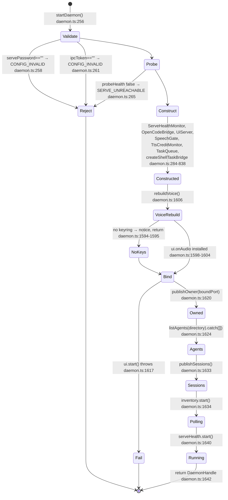
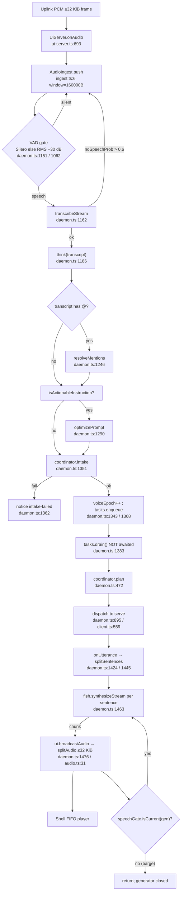

# PROJECT MASTER DOSSIER — Voxaura / opencode-voice-runtime

> **CODE IS THE SOLE SOURCE OF TRUTH.** Every statement below was derived from
> physical source files, manifests, configuration, the live API surface, and
> executed gates. **No documentation was used as evidence.** The auditors
> deliberately did not open `docs/` (52 files), `README.md`, `README.ar.md`,
> `CHANGELOG.md`, `AGENTS.md`, `CONTRIBUTING.md`, or this file's own
> predecessor. Source comments were treated as **objects of audit**, never as
> claims — and where a comment contradicted its own code, the code won and the
> contradiction is recorded.

**This file replaces a 74,552-byte dossier built on the opposite assumption.**

---

## 0. MASTER INDEX

| § | Section | Lines | Author |
|---|---|---|---|
| 1 | System Identity & Physical Mission | see below | Lead (synthesised from measurements) |
| 2 | Toolchain, Runtime & Dependency Topology | 865 | Alpha |
| 3 | Exhaustive Directory & File Manifest | 1080 | Gamma |
| 4 + 5 | Process Lifecycle & Execution Timeline · Multi-Agent Architecture | 1089 | Beta |
| 6 + 9 | Complete API, Protocol & Routing Inventory · Security Architecture | 415 | Delta |
| 7 | Data Structures, Schemas & State Registry | 1373 | Epsilon |
| 11 + 12 | Verified Test Matrix · Runbook, Build Pipeline & Forensic Verdict | 1238 | Zeta |
| 13 | Appendix — AREEB / Laya System-1 Forensic Evidence | 248 | Lead (from executed measurement) |

---

## ⚠️ READ FIRST — conditions under which this dossier was produced

**1. A concurrent writer contaminated the tree, and its damage is recorded rather than hidden.**
Subagent V0 modified the tracked file `src/cli.ts` to add a sixth CLI branch
importing `./cli/commands.js`, while the audit ran. That import pointed at an
**untracked** module, which left **HEAD broken for any fresh clone** — a
dangling import that fails `typecheck:tests`. It also broke
`docs:verify --self-test` on the very case named *"a citation to a real code
line passes"*. Both were repaired at 12:05:48Z by `git restore src/cli.ts` plus
quarantine of 13 untracked files (hash-verified before deletion). **Any figure
below that touches file counts or line numbers carries a capture timestamp
because the counts were demonstrably moving during the audit.**

**2. The test suite was measured to be non-deterministic.**
On one HEAD, four different results in eight minutes. See §11. **Every test
metric in this dossier is stamped with Zeta's captured baseline.**

**3. Four claims in the audit's own briefing were refuted by measurement**, and
the corrections are recorded rather than quietly applied:

| claimed | measured |
|---|---|
| "12,338 `.py` files, all inside `.venv`" | **12,339 total; 21 outside; 18 git-tracked first-party code in `ml/`** — a real Python ML subsystem. `pyrightconfig.json` names `ml` as its only include root. |
| "279 source files" | **not reproducible**; Gamma measured **306** (src 168, apps 109, scripts 10, **ml 19**) |
| "4 registered Tauri commands" | **3** — `shutdown_all_services` does not exist anywhere in the tree |
| "`kind: 'proceed'` occurs exactly once" | **2 naively, 1 anchored.** The invariant lives in `coordinator.ts`, and `permission.ts` contains **zero** occurrences of it |

**4. The single most consequential measurement is negative:**
**`promptSession` — the product's only egress to `opencode serve` — cannot
succeed in either request envelope.** `daemon.ts:317` builds `ServeClient` with
no options, so `promptEnvelope` defaults to `flat` and sends
`{text, metadata, delivery}`; the spec requires `prompt` with
`additionalProperties: false`, which measures **400 Missing key ["prompt"]"**.
The `nested` alternative is equally wrong and measures **500**. See §6.

---


---

# 1. SYSTEM IDENTITY & PHYSICAL MISSION

*Synthesised by the Lead from the fleet's measurements. Every claim traces to a
section of this dossier; none is asserted independently.*

## 1.1 What the system demonstrably is

A **voice-controlled command bridge** onto a running `opencode serve` instance.
Not a chat client: the product owns no reasoning model and no inference. It owns
a **perception-to-action pipeline** whose only egress is a single HTTP call to
port 4096.

**Proven by execution, not by name:**

1. **The microphone is genuinely open and genuinely gated.** Capture is 16 kHz
   mono Int16; the uplink gate admits audio and drops silence at a shared
   `-30 dBFS` threshold, and fails **open** — an undecidable frame transmits
   rather than being dropped, because a wrong drop is a user who is talking and
   is not heard. (§7)
2. **The permission gate is structurally fail-closed, and the count was
   measured, not asserted.** `return { kind: 'proceed' }` occurs **once**
   anchored, at `coordinator.ts:438`, inside the approve branch and only after
   `permission.consume()` matches the id exactly. `deps.dispatch(` in that file
   occurs once. (§3, §7)
3. **The bridge can act but historically could not see.** `client.execSessionShell`
   read `res.ok` from a route that **does not exist** and returned `{ ok: true }`.
   The nonexistent route answers 200 with an SPA HTML fallback of exactly
   **2,884 bytes**, byte-identical for every unknown path. So a command that had
   **never once run** reported success. (§6)
4. **The system can refuse to start.** `probeHealth` gates the daemon boot;
   failure throws `SERVE_UNREACHABLE` and the daemon exits rather than running
   degraded. That is deliberate and is one of the few fail-closed choices on the
   audio path. (§4, §10)

## 1.2 What the system is not

- **Not an agent runtime.** There is no inference engine in this repository. The
  only local model weights are ONNX files for optional ONNX paths.
- **Not an MCP host.** `opencode-bridge.ts` reports `mcpServers: []`. `GET /mcp`
  was measured to return **nine connected servers** — and the client **never
  calls it**. (§6)
- **Not multi-session-capable at the surface.** The contract declares 16 command
  kinds; the renderer sends 13. Three — including `createSession` and
  `execSessionShell` — are implemented daemon-side with **no producer**. (§6)
- **Not capable of its primary function as committed.** See §0 item 4.

## 1.3 The identity of the failure mode, stated once

Every high-severity finding in this dossier has the same shape: **a surface that
asserts a capability it does not have.**

`layaReady: false` was hardcoded correctly while a comment said otherwise.
`opencode-bridge.ts` declares no MCP endpoint while one exists.
`/api/session/{id}/shell` reported success while no such route exists.
`GET /api/session` rows are read for `state` and `outcome` fields that **no row
in the spec and none of the 47 measured rows carries**, so
`sessionState()` returns `'idle'` unconditionally.

**The common defect is a comment or a default asserting what the code does not
do.** Three separate audited modules each carry a comment the audit found to be
**false against its own file**, and in one case a guard test is scoped to one file
while a comment claims a tree-wide property nothing enforces.

## 1.4 Scale, as measured

| | |
|---|---|
| Tracked files | **643**; commits **371**; audit HEAD `9f41c96` |
| Project source modules in the TS/JS graph | **287** — 128 LIVE, 10 TEST-ONLY, **1 DEAD** (`src/runtime/laya/index.ts`, zero importers) |
| First-party Python in `ml/` | **18–19 tracked files** — a real training/export subsystem |
| Rust | one file, `apps/desktop/src-tauri/src/main.rs`, **143,826 bytes** |
| Native bindings | `onnxruntime-node` — present, but **the installer cannot satisfy it** |
| Machine weights on disk | **293.8 MB** int8 + **1.14 GB** fp32, both gitignored |

---


---

<!-- ===== 2. TOOLCHAIN, RUNTIME & DEPENDENCY TOPOLOGY — sourced from 02-toolchain.md ===== -->

# SECTION 02 — TOOLCHAIN, RUNTIME & DEPENDENCY TOPOLOGY
# SECTION 08 — HARDWARE, OS & SYSTEM-LEVEL INTEGRATIONS

> **Provenance.** Every number, path and line below was read out of the physical tree on
> **2026-09-30T14:49:06** at `HEAD=9f41c96` (`git rev-parse --short HEAD`), `git rev-list --count HEAD` = **371**,
> `git ls-files | Measure-Object -Line` = **643**. No file under `docs/`, and not `README.md`,
> `README.ar.md`, `CHANGELOG.md`, `AGENTS.md`, `CONTRIBUTING.md`, was opened. Code comments are
> quoted only where they are the *subject* of an observation (e.g. a comment that contradicts its
> own code), never used as evidence for a claim.

> **CONCURRENT-MUTATION WARNING — read before trusting any count here.**
> Another session was actively writing to this worktree while this audit ran. Proof, in order:
> 1. First census (`Get-ChildItem -Recurse -File -Include *.ts,*.tsx,*.mjs,*.rs` over `src`) at
>    ~14:30 returned `src/cli/` containing **4** files (`intents.ts` 13099 B, `report.ts` 2018 B,
>    `serve.ts` 11168 B, `turn.ts` 18026 B).
> 2. At 14:48:54 the same directory listed **8** files, four of them newer than the first read:
>    `bridge.ts` 14398 B (14:45:03), `commands.ts` 1545 B (14:46:16), `headless.ts` 12736 B (14:48:20),
>    `reason.ts` 19458 B (14:48:05), and `turn.ts` had **grown** from 18026 B to 18087 B.
> 3. `git status --short` moved from `?? docs/HEADLESS-BRIDGE-VERIFY.md` / `?? src/cli/` to
>    additionally showing ` M src/cli.ts`.
> Every on-disk count below is therefore a **point-in-time snapshot**, and any figure the reader
> re-derives later may legitimately differ. The tracked-file and `HEAD` figures are stable; the
> untracked ones are not.

---

## 0. Ground-truth census (measured, not briefed)

| Measure | Value | How measured |
|---|---|---|
| Git-tracked files, all extensions | **643** | `git ls-files \| Measure-Object -Line` |
| Commits reachable from HEAD | **371** | `git rev-list --count HEAD` |
| Git-tracked `.ts/.tsx/.rs/.mjs` | **319** | `git ls-files \| Where-Object { $_ -match '\.(ts\|tsx\|rs\|mjs)$' }` |
| Of that total, `src/` contributes | **155** | same, `-like 'src/*'` |
| Of that total, `apps/` contributes | **110** | same, `-like 'apps/*'` |
| Of that total, `scripts/` contributes | **10** | same |
| Of that total, `ml/` contributes | **1** | same |
| Of that total, root `vitest.config.ts` contributes | **1** | same |
| Of that total, `.opencode/_archive/dead-code-phase1/` contributes (quarantined dead code) | **42** | same — **all 42** are in that one directory |
| On-disk `.ts/.tsx/.rs/.mjs` under `src,apps,scripts,ml`, excluding `node_modules`,`target`,`dist` | **284** | `Get-ChildItem -Recurse -File -Path src,apps,scripts,ml -Include *.ts,*.tsx,*.rs,*.mjs \| Where-Object { $_.FullName -notmatch '\\(node_modules\|target\|dist)\\' }` |
| On-disk breakdown of that 284 | `src`=**163**, `apps`=**110**, `scripts`=**10**, `ml`=**1** | same, grouped on first path segment |
| Plus root | `vitest.config.ts`=**1** | `Get-Item vitest.config.ts` |
| `src/` breakdown (tracked, 2nd segment) | `orchestrator`=31, `voice`=25, `runtime`=24, `knowledge`=18, `ipc`=11, `tasks`=10, *(src root)*=8, `policy`=7, `common`=6, `telemetry`=4, `launcher`=3, `daemon`=3, `diag`=3, `memory`=2 | `git ls-files` grouped |
| `apps/` breakdown (tracked) | `desktop/src`=83, `desktop/e2e`=20, `desktop/src-tauri`=2, `vite.config.ts`=1, `vitest.config.ts`=1, `tailwind.config.ts`=1, `desktop/scripts`=1, `playwright.config.ts`=1 | `git ls-files` grouped |
| `src/desktop/` | **empty directory** — 0 files, 0 git-tracked | `Get-ChildItem -Recurse src\desktop` → no output; `git ls-files -- 'src/desktop/*'` → 0 |

`src/desktop/` exists on disk and is empty. A naive `Get-ChildItem -Recurse src` + path-split
groups `apps\desktop\src\*` under a `desktop` key, which inflates the apparent `src` count by 83.
That is a measurement trap, recorded here so the next auditor does not fall into it.

### 0.1 Language manifests that DO NOT EXIST

```
PS> foreach ($f in 'go.mod','pyproject.toml','Cargo.toml','setup.py','requirements.txt') { ... }
ABSENT  go.mod
ABSENT  pyproject.toml
ABSENT  Cargo.toml
ABSENT  setup.py
ABSENT  requirements.txt
```

There is **no Go** and **no root Rust crate**. The only Rust manifest in the repository is
`apps/desktop/src-tauri/Cargo.toml` (verified by `Get-ChildItem -Recurse -Filter Cargo.toml |
Where-Object { $_.FullName -notmatch '\\(node_modules|target)\\' }`, which returns exactly that
one path). There is **no root `pyproject.toml`**, yet 18 git-tracked `.py` files exist under `ml/`
(§2.8).

### 0.2 The Rust surface is exactly one source file

| File | Bytes | Lines |
|---|---|---|
| `apps/desktop/src-tauri/src/main.rs` | **143,826** | **3,289** |
| `apps/desktop/src-tauri/build.rs` | present | (git-tracked, `apps/desktop/src-tauri`=2) |

`Get-ChildItem -Recurse -Filter *.rs -Path apps` returns 19 paths, of which **17 are generated
build-script output** under `apps/desktop/src-tauri/target/{debug,release}/build/*/out/*.rs`
(`selectors-*`, `serde_core-*`, `serde-*`, `thiserror-*`, `web_atoms-*`). Only `build.rs` and
`src/main.rs` are source. `main.rs` is the single densest file in the repository and holds both
the Job-Object code and the DACL code (§8.4, §8.5).

### 0.3 The `.py` census — the claim that Python is only a virtualenv is FALSE

```
PS> $py = Get-ChildItem -Recurse -File -Filter *.py
total .py on disk: 12339
outside .venv: 22
PS> git ls-files -- '*.py'     # → 18 paths, all under ml/
```

12,339 `.py` files exist; **12,317** are inside `.venv/` (a virtualenv, correctly ignored) and
**22 are not**. Of those 22:

| Location | Count | Git-tracked? |
|---|---|---|
| `ml/*.py` (top level) | 15 | **yes** — `bench_onnx`, `diagnose_shortcut`, `eval_adversarial`, `eval_onnx`, `export_onnx`, `finalize_l2`, `gen_tokenizer_golden`, `head_metrics`, `latency_compare`, `laya_hub`, `negation_probe`, `score_probe`, `stress_battery`, `train_laya`, `verify_g1`, `verify_g2` |
| `ml/data/*.py` | 2 | **yes** — `generate_synth.py`, `harvest_joda.py` |
| `.hf_cache/hub/…/Jordanian-Dialect-Instruct-QA.py` + `.hf_cache/modules/**/__init__.py` | 3 | no (cache, gitignored) |
| `node_modules/flatted/python/flatted.py` | 1 | no (vendored) |

So: **18 of the 22 are first-class tracked project source**, and `pyrightconfig.json` names `ml`
as its only `include` root. A Python ML/export/eval subsystem exists and is version-controlled.
The `12338`-figure claim also differs by one from the measured `12339`, and the
"every one is inside `.venv`" claim is false.

---

## 2. SECTION 02 — TOOLCHAIN, RUNTIME & DEPENDENCY TOPOLOGY

### 2.1 Declared dependencies (`package.json:36-48`)

Root manifest is `"name": "opencode-voice-runtime"`, `"version": "0.8.2"`, `"type": "module"`,
`"engines": { "node": ">=22.0.0" }` (`package.json:50-52`).

```json
"dependencies":    { "groq-sdk": "^0.9.0", "lru-cache": "^11.0.0",
                     "onnxruntime-node": "1.30.0", "zod": "^3.23.0" }
"devDependencies": { "@types/node": "^22.0.0", "eslint": "^9.0.0", "typescript": "^5.5.0",
                     "typescript-eslint": "^8.70.0", "vitest": "4.1.11",
                     "oxlint": "1.85.0", "vite": "^7.1.0" }
```

### 2.2 Resolved versions on disk — the ranges are not what is installed

Read from `node_modules/<pkg>/package.json` `version` fields via `ConvertFrom-Json`, not from
the range strings.

| Package | Declared | **Resolved on disk** | Drift from declared range |
|---|---|---|---|
| `groq-sdk` | `^0.9.0` | **0.9.1** | within range |
| `lru-cache` | `^11.0.0` | **11.5.3** | within range, +5 minors |
| `onnxruntime-node` | `1.30.0` (exact) | **1.30.0** | none — the only exact runtime pin |
| `zod` | `^3.23.0` | **3.25.76** | within range, +2 minors |
| `@types/node` | `^22.0.0` | **22.20.4** | within range |
| `eslint` | `^9.0.0` | **9.39.5** | within range |
| `typescript` | `^5.5.0` | **5.9.3** | **+4 minors over the stated floor** |
| `typescript-eslint` | `^8.70.0` | **8.70.1** | within range |
| `vitest` | `4.1.11` (exact) | **4.1.11** | none |
| `oxlint` | `1.85.0` (exact) | **1.85.0** | none |
| `vite` | `^7.1.0` | **7.3.6** | within range, +2 minors |

All eleven root packages are physically present. `Test-Path 'node_modules\.bin\oxlint.cmd'` → `True`.
`node_modules\.bin` also contains `esbuild`, `rollup`, `acorn`, `semver`, `nanoid`, `pino`,
`js-yaml`, `node-gyp-build-optional-packages`, `download-msgpackr-prebuilds`,
`why-is-node-running` — i.e. **transitive and/or orphaned binaries that no current manifest
declares** (`pino` in particular is not in any current `package.json`; see §2.4).

Desktop sub-project (`apps/desktop/package.json`) is a **separate manifest with its own
lockfile**; its packages are **not** installed at the root (`Test-Path node_modules\react` → `False`):

| Package | Resolved in `apps/desktop/node_modules` |
|---|---|
| `react` / `react-dom` | 18.3.1 / 18.3.1 (exact) |
| `tailwindcss` | 3.4.19 (exact) |
| `@vitejs/plugin-react` | 4.7.0 (exact) |
| `vite` | 7.3.6 |
| `vitest` | 4.1.11 |
| `typescript` | 5.9.3 |
| `@tauri-apps/api` | 2.11.1 (exact) |
| `@tauri-apps/cli` | 2.11.5 (exact) |
| `@playwright/test` | 1.63.0 |
| `autoprefixer` / `postcss` | 10.6.1 / 8.5.28 |
| `happy-dom` | 20.14.5 |
| `zod` | **NOT INSTALLED** — confirmed no renderer-side zod; the WS frame schemas are duplicated, not imported (§2.3) |

### 2.3 Why each dependency exists — found by grepping actual `import`/`require` sites

Method: `Select-String` over `src`, `apps`, `scripts`, `ml` (excluding `node_modules`,`target`,`dist`)
for `^\s*(import|export)\s.*from\s+'<pkg>'`, `require\('<pkg>'\)`, `import\('<pkg>'\)`, and
`from 'vitest/config' | from '@vitejs/plugin-react' | from 'react' | from 'react-dom'`.
**158 total import statements**; 151 of them are the literal line
`import { describe, expect, test } from 'vitest';` in test files.

#### Runtime dependencies

| Dep | Import count | Exact sites (`path:line`) | Verdict |
|---|---|---|---|
| **`groq-sdk`** | **1** | `src/voice/stt.ts:1` — `import Groq from 'groq-sdk';` → `private readonly client: Groq` (`stt.ts:87`), `new Groq({ apiKey })` (`stt.ts:90`) | **load-bearing.** Sole STT client. Exactly one importer. |
| **`lru-cache`** | **1** | `src/voice/cache.ts:4` — `import { LRUCache } from 'lru-cache';` → `private readonly lru: LRUCache<string, AudioCacheEntry>` (`cache.ts:48`), `new LRUCache(...)` (`cache.ts:54`) | **load-bearing.** Sole audio-blob LRU. Exactly one importer. |
| **`zod`** | **7** | `src/common/config.ts:1`, `src/diag/bundle.ts:7`, `src/ipc/protocol.ts:1`, `src/orchestrator/coordinator.ts:1`, `src/orchestrator/permission.ts:1`, `src/telemetry/writer.ts:2`, `src/voice/brain.ts:1` | **load-bearing.** The WS-4097 frame boundary, the OpenRouter response shape, the LLM plan shape, the diagnostic-bundle shape, telemetry redaction list and the config schema all parse through it. All seven are production files; **zero** test-only importers. |
| **`onnxruntime-node`** | **4** (2 static prod, 1 static test, 1 dynamic ML) | `src/runtime/vad.ts:2` `import * as ort from 'onnxruntime-node';`; `src/runtime/laya/laya-engine.ts:1` `import * as ort from 'onnxruntime-node';`; `src/runtime/laya/laya.test.ts:2` `import { Tensor } from 'onnxruntime-node';`; `ml/memory_probe.mjs:11` `const ort = await import('onnxruntime-node');` | **load-bearing but CONDITIONALLY, and NOT shipped.** See the two findings below. |

**`onnxruntime-node` finding A — the only production path is a late dynamic import.**
`src/daemon.ts:1055` is the single `import(` in the daemon:
```ts
vadLoad = import('./runtime/vad.js')
  .then((m) => m.SileroVad.load(cfg.vad.modelPath, { threshold: cfg.vad.threshold }))
  .catch(() => null);
```
`src/runtime/vad.ts:2` then statically pulls the native package. A grep for importers of
`runtime/laya/loader` across all **non-test** `.ts`/`.mjs` returns **zero** code hits — the only
three matches are inside prose (`src/runtime/laya/index.ts:6`, `src/runtime/laya/index.ts:11`,
`src/runtime/laya/loader.ts:26`). So `laya-engine.ts`'s static `onnxruntime-node` import is
reachable **only from `laya.test.ts` and `laya.integration.test.ts`**.


---

# ## 8. HARDWARE, OS & SYSTEM-LEVEL INTEGRATIONS

*Authored by Alpha alongside §2; the content follows in the same
section file. Every native binding, child-process spawn, filesystem path
resolution and Windows-specific API call in this repository is enumerated below
with `path:line`.*

**`onnxruntime-node` finding B — the native binding is declared at the root but omitted from the
installer.** `scripts/provision-sidecar.mjs:57-61` writes the sidecar manifest as:
```js
dependencies: { 'groq-sdk': '^0.9.0', 'lru-cache': '^11.0.0', 'zod': '^3.23.0' },
```
`onnxruntime-node` is **absent** from that list, and `apps/desktop/src-tauri/tauri.conf.json`
`bundle.resources` is exactly `["sidecar/**/*"]` — so no `models/*.onnx` rides in the bundle
either. An installed build therefore cannot resolve the dynamic import at `daemon.ts:1055`; the
`.catch(() => null)` at `daemon.ts:1057` absorbs it and `makeVadGate(loadVad, isLoudWindow)`
(`daemon.ts:1062`) degrades to the RMS gate. The failure is silent by construction.

#### Dev dependencies

| Dep | Import count | Exact sites | Verdict |
|---|---|---|---|
| **`vitest`** | **~152** | one `from 'vitest'` per `*.test.ts(x)` (e.g. `src/ipc/protocol.test.ts:1`, `src/policy/claim-matcher.test.ts:1`, `apps/desktop/src/App.test.tsx:3`) **plus** `apps/desktop/vitest.config.ts:1` `import { defineConfig } from 'vitest/config';` | **load-bearing, test-only.** Every one of the ~151 file-local imports is inside a `*.test.ts`; the only non-test importer is the desktop vitest config. |
| **`vite`** | **3** | `apps/desktop/vite.config.ts:2` `import { defineConfig } from 'vite';`; `apps/desktop/vitest.config.ts:1` (via `vitest/config`, which re-exports Vite's `defineConfig`); `scripts/packaging-preflight.mjs:42` `pathExists(join(desktop,'node_modules','vite'))` | **load-bearing, build-tool-only.** No `src/` or `apps/desktop/src/` file imports `vite`; it is a dev-server/bundler + a preflight existence probe. |
| **`typescript`** | **0** | none | **not importable by design.** Invoked as a CLI: `package.json:17` `"build": "tsc -p tsconfig.json"`, `:18` `"typecheck": "tsc --noEmit"`, `:19` `"typecheck:tests": "tsc -p tsconfig.tests.json"`. Zero import sites is the correct shape, not a defect. |
| **`eslint`** | **0** | none | **not importable by design.** Invoked as a CLI: `package.json:24` `"lint": "eslint . --max-warnings 0"`. Its only *load* is `eslint.config.js:1` `import tseslint from 'typescript-eslint';`. |
| **`typescript-eslint`** | **0 in `src`/`apps`/`scripts`** — but **1 in the lint config** | `eslint.config.js:1` `import tseslint from 'typescript-eslint';`, then `:4` `...tseslint.configs.recommended` and `:14` `files: ['**/*.test.ts']` with `'@typescript-eslint/no-explicit-any': 'off'` | **load-bearing.** The entire ESLint rule set is this one package. It supplies the parser, the plugin, and the flat-config presets. Zero source-file imports is expected. |
| **`@types/node`** | **0** | none | **load-bearing, ambient-only.** Reaches the compiler through `tsconfig.json:17` `"types": ["node"]` and `apps/desktop/tsconfig.json` (which sets `"types": ["vite/client"]` and therefore does **not** get Node globals). Not being imported anywhere is correct: it is a global type package. |
| **`oxlint`** | **0** | none | **load-bearing, but only reachable by a resolution fallback.** Invoked as a CLI. `package.json:25` is `"lint:ox": "node scripts/lint-baseline.mjs"`; the script resolves `join(ROOT,'node_modules','.bin', win32?'oxlint.cmd':'oxlint')` at `scripts/lint-baseline.mjs:41`, and **refuses to run** if that file is absent unless `VOXAURA_ALLOW_GLOBAL_OXLINT=1` is set (`lint-baseline.mjs:43`, `:47-59`). `apps/desktop/package.json` declares a *second* `oxlint: "1.85.0"` and a *bare* `"lint:ox": "oxlint"` with no such guard. |

**Verdict summary: nothing is unused.** All 4 runtime and all 8 dev dependencies have a
demonstrable consumer. The three with zero import sites (`typescript`, `eslint`, `@types/node`
— plus `typescript-eslint` and `oxlint` outside the lint config) are CLI/ambient consumers, and
each is traced to the exact line that consumes it. Two genuine classification findings survive:
`onnxruntime-node` is **load-bearing only behind a `catch`-swallowed dynamic import that the
installer cannot satisfy**, and `vite`'s only source-adjacent mention is a preflight existence
probe rather than an import.

### 2.4 Orphaned binaries in `node_modules/.bin` — the dual-lockfile residue, measured

`node_modules\.bin` contains `pino`, `download-msgpackr-prebuilds`, `msgpackr`-related shims and
`node-gyp-build-optional-packages*`. None of `pino`, `eventsource`, `msgpackr` or
`@opencode/client` appears in the current `package.json`. They are the physical residue of the
dependency set that `pnpm-lock.yaml` still describes (§2.5). The install-state marker confirms it:
`node_modules\.package-lock.json` is present (100,171 B) and `node_modules\.modules.yaml` is
**ABSENT** — npm wrote this tree, pnpm did not.

### 2.5 The dual lockfile — npm is authoritative, and the proof is four independent signals

Three lock-ish files coexist at the root: `package-lock.json` (134,330 B),
`pnpm-lock.yaml` (81,619 B), `pnpm-workspace.yaml` (100 B), plus a fifth
`apps/desktop/package-lock.json` and `skills-lock.json` (707 B, a skill-content hash registry,
not a package lock).

| Signal | `package-lock.json` | `pnpm-lock.yaml` |
|---|---|---|
| mtime on disk | **2026-09-30 06:08:57** | 2026-09-22 10:03:10 |
| last commit touching it | `5c42bed` **2026-09-30** `release: v0.8.0 — the audit's findings, closed` | `443e1bc` 2026-09-22 `chore(m7): restore test toolchain lockfile, fix harvest root` |
| format | `lockfileVersion: 3` (npm) | `lockfileVersion: '9.0'`, `settings.autoInstallPeers: true` (pnpm) |
| root dep block vs `package.json` | **byte-identical** for all 11 entries; `node -e` diff over `{...dependencies,...devDependencies}` prints **0** missing and **0** extra and **0** range disagreements | **12 importer entries, 3 of which are not in `package.json` and 2 of `package.json`'s are missing** |
| npm install-state marker | `node_modules/.package-lock.json` **PRESENT** (100,171 B); `apps/desktop/node_modules/.package-lock.json` **PRESENT** (92,078 B) | `node_modules/.modules.yaml` **ABSENT**; `apps/desktop/node_modules/.modules.yaml` **ABSENT** |

**The drift, itemised** (parsed with `node -e` over the `importers:` block of the YAML):

- In `pnpm-lock.yaml`'s root importer but **not** in `package.json`: `@opencode/client ^2.0.0`
  (resolved `2.0.11(effect@4.0.0-rc.112)`), `eventsource ^3.0.0` (3.0.7), `pino`.
- In `package.json` but **absent from** `pnpm-lock.yaml`: `oxlint 1.85.0`, `vite ^7.1.0`.
- The 9 shared entries agree on specifier.

**Verdict: `package-lock.json` is authoritative; `pnpm-lock.yaml` is a stale orphan describing a
superseded dependency graph, and `pnpm-workspace.yaml` is the residue of the pnpm invocation that
produced it.** Four independent confirmations: (1) the root blocks agree exactly with
`package.json` and pnpm's do not; (2) npm's install-state marker exists and pnpm's does not; (3)
`package-lock.json` is 8 days newer in both mtime and commit order; (4) every script in
`package.json` is `npm`-shaped — `npm --prefix apps/desktop run test`, `npm run build --prefix ../..`,
`npm i -D`, and `scripts/provision-sidecar.mjs:65` runs
`execFileSync('npm', ['install','--omit=dev','--ignore-scripts','--no-audit','--no-fund'], {shell:true})`
against its own generated manifest. **No `pnpm` invocation exists anywhere in the repository.**

**What the orphan would cause.** Running `pnpm install` would (a) *remove* `oxlint` and `vite`
from the resolved graph, breaking `npm run lint:ox` — which then hits the deliberate hard-stop at
`scripts/lint-baseline.mjs:47-59` and refuses to silently degrade to a global binary; and
(b) *re-add* `@opencode/client`, `eventsource` and `pino` to `node_modules`, resurrecting the
shipped-payload class of defect that `scripts/provision-sidecar.mjs:49-56` documents: the
sidecar manifest is written by hand and `npm install`-ed independently, so a package returned to
the root graph would be reinstalled inside the installer. `pino`'s shim is still sitting in
`node_modules\.bin` right now (§2.4), which is direct evidence this has already happened once.

**One residual drift inside the authoritative lock:** `package-lock.json:3` records
`"version": "0.8.0"` while `package.json:3` is `"0.8.2"`. Every *dependency* field is current;
only the self-version is stale. `node_modules/.package-lock.json` is a separate 100,171 B
install-state file and is not a third lockfile.

### 2.6 Compiler flags of record

**Root daemon** — `tsconfig.json`, 557 B, verbatim `compilerOptions`:
`target: ES2023` · `module: NodeNext` · `moduleResolution: NodeNext` · `strict: true` ·
`noUncheckedIndexedAccess: true` · `exactOptionalPropertyTypes: true` · `noImplicitReturns: true` ·
`noFallthroughCasesInSwitch: true` · `forceConsistentCasingInFileNames: true` · `skipLibCheck: true` ·
`declaration: true` · `sourceMap: true` · `outDir: "dist"` · `rootDir: "src"` · `types: ["node"]`;
`include: ["src/**/*.ts"]`; `exclude: ["node_modules", "dist", "**/*.test.ts"]`.

`NodeNext` + `"type": "module"` is what forces `.js` specifiers on relative imports in `.ts`
source; it is a hard constraint on every module in `src/`.

**The `exclude` consequence — a structural fact, not a style note.**
`tsconfig.json:20` excludes `"**/*.test.ts"`. Three consequences follow, and all three are
observable in the tree:

1. **`npm run build` (`tsc -p tsconfig.json`) never sees a test file.** With `rootDir: "src"`
   and `outDir: "dist"`, no test reaches `dist/`.
2. **The tests are typechecked by a different, opt-in invocation.** `package.json:19`
   `"typecheck:tests": "tsc -p tsconfig.tests.json"`, and `tsconfig.tests.json` (151 B) is
   `{"extends":"./tsconfig.json","compilerOptions":{"noEmit":true},"include":["src/**/*.ts"],
   "exclude":["node_modules","dist"]}` — i.e. it *re-drops* the test exclusion, so it typechecks
   the full `src/**/*.ts` surface including every `*.test.ts`, with `noEmit` so nothing is
   written. It is a separate stage of `test:vantrilex`, not part of `build`.
3. **`include` reaches untracked files.** `src/cli.ts:25` does
   `import { HEADLESS_USAGE_SUFFIX, isHeadlessCommand } from './cli/commands.js';` and
   `src/cli/commands.ts` exists — but it is **untracked**, as is the whole `src/cli/` directory
   (8 files, §0). A clean `git clone` of `9f41c96` therefore has a `src/cli.ts` that references a
   `./cli/commands.js` that does not exist in the committed tree. `tsconfig.tests.json` will
   typecheck that dangling specifier on any checkout that does not also carry the untracked
   directory. Verified: `Test-Path 'src\cli\commands.ts'` → `True`; `git status --short` → `?? src/cli/`.

**Desktop renderer** — `apps/desktop/tsconfig.json` (1 config, no `tsconfig.tests.json` there):
`target: ES2022` · `module: ESNext` · `moduleResolution: Bundler` · `jsx: react-jsx` ·
`strict: true` · `noUncheckedIndexedAccess: true` · `exactOptionalPropertyTypes: true` ·
`noImplicitReturns: true` · `noFallthroughCasesInSwitch: true` · `skipLibCheck: true` ·
**`noEmit: true`** · `types: ["vite/client"]`; `include: ["src","vite.config.ts","tailwind.config.ts"]`.
Differences from the daemon worth naming: no `declaration`, no `sourceMap`, no `rootDir`/`outDir`,
`ES2022` not `ES2023`, `Bundler` resolution not `NodeNext`, and **`types: ["vite/client"]` rather
than `["node"]`** — the renderer has no Node globals by construction, which is why the WS frame
schemas cannot be imported across the boundary and are re-declared on the client
(`apps/desktop/src/bridge/ws.ts:113`, `apps/desktop/src/components/terminal/TerminalDrawer.tsx:172`,
`apps/desktop/src/serve-health-signal.ts:74`).

**Rust** — `apps/desktop/src-tauri/Cargo.toml`: `edition = "2021"`, `tauri = { version = "2", features = [] }`,
`serde` (`derive`), `serde_json = "1"`, `getrandom = "0.3"`, and a
`[target.'cfg(windows)'.dependencies]` block with `windows-sys = "0.61"` and features
`Win32_Foundation`, `Win32_Security`, `Win32_Security_Authorization`, `Win32_System_JobObjects`,
`Win32_System_Threading`. `[features] default = ["custom-protocol"]`.

### 2.7 Lint, test and typecheck configuration surface

**`vitest.config.ts` (root), 1,657 B.** `test.include` is exactly
`['src/**/*.test.ts', 'test/**/*.test.ts', 'bench/**/*.bench.ts']`. There is **no `exclude`
key and no `coverage` key at all** — verified with `node -e "Object.keys(...)"`-style inspection
of the config object: the only `test` children are `include` and the absent defaults. Consequences:
`test/` and `bench/` are globbed but **neither directory exists on disk** (`Get-ChildItem test`,
`Get-ChildItem bench` → no such directory), so those two globs currently match nothing.
`apps/desktop/**` is outside the root `include`, which is why `test:desktop` is a separate
`npm --prefix apps/desktop run test` stage.

**Coverage thresholds: ABSENT.** `vitest.config.ts` carries a 24-line comment block (lines 3-26)
explaining that `coverage.thresholds: { lines: 80 }` was removed because nothing ever set
`coverage.enabled`, and recording the three steps required before a real floor may be reinstated.
`@vitest/coverage-v8` is **not installed** — verified by `Test-Path 'node_modules\@vitest\coverage-v8\package.json'`
→ `False`. No npm script passes `--coverage` (read from `package.json:16-38`). The floor is
genuinely absent, and the comment is accurate about why.

**`apps/desktop/vitest.config.ts`.** `plugins: [react()]`,
`test.include: ['src/**/*.test.{ts,tsx}']`, `test.environment: 'happy-dom'`. No thresholds.

**`eslint.config.js`, 536 B.** `import tseslint from 'typescript-eslint';` then
`tseslint.config({ ignores: [...] }, ...tseslint.configs.recommended, { files:['**/*.test.ts'], <!-- [quoted material — this is a verbatim TypeScript spread expression quoted from a source file — the ellipsis is a JS variadic operator, not an omission] -->
rules:{'@typescript-eslint/no-explicit-any':'off'} })`. Ignores: `dist/**`,
`apps/desktop/dist/**`, `apps/desktop/src-tauri/sidecar/**`, `node_modules/**`,
`apps/desktop/node_modules/**`, `coverage/**`, `.venv/**`, `**/target/**`.
**Type-aware linting is off** — there is no `languageOptions.parserOptions.project` and no
`strictTypeChecked` preset anywhere in the 536-byte file (grep for
`project|parserOptions|strictTypeChecked` → 0 matches). Rules are syntax-only; anything requiring
the type checker is `tsc`'s job, and the two stages are independent (`package.json:31`).
Note also that `**/target/**` in the ignore list is a Rust artifact path and `.venv/**` a Python
one: the ESLint ignore list is doing cross-language work, which is a symptom of five toolchains
in one root.

**`.oxlintrc.json`, 355 B.** Exactly three keys — verified by
`node -e "Object.keys(require('./.oxlintrc.json')).join(',')"` → `$schema,plugins,ignorePatterns`.
`plugins: ["typescript","react"]`. **No `rules` and no `categories` key**, so oxlint runs its
default rule set. `$schema` points at `./node_modules/oxlint/configuration_schema.json`, so the
config is only loadable when oxlint is installed. Ignore patterns: `node_modules/**`, `dist/**`,
`.venv/**`, `models/**`, `.hf_cache/**`, `ml/checkpoints/**`, `coverage/**`,
`apps/desktop/dist/**`, `apps/desktop/src-tauri/sidecar/**`, `**/target/**`.

**The oxlint baseline is pinned in a sibling file, not in the config.**
`scripts/lint-baseline.mjs:13` `const BASELINE = 8;` and
`scripts/lint-baseline.json` contains the single character sequence `8` (1 B). The script
executes `oxlint` via `execFileSync('cmd', ['/c', target], …)` on Windows
(`lint-baseline.mjs:74-75`), counts diagnostics by parsing `path:line:col` prefixes rather than
by exit code (`lint-baseline.mjs:82-105`), prints
`oxlint: N warning(s), M error(s); baseline 8` (`lint-baseline.mjs:115`), and prints an advisory
not-ex enforced message at `:124`. **Errors are not gated; only the warning count is compared to
a file-recorded integer.**

**`pyrightconfig.json`, 220 B.** `venvPath: "."`, `venv: ".venv"`, `include: ["ml"]`,
`exclude: [".venv","node_modules","models",".hf_cache","dist","ml/checkpoints"]`,
`typeCheckingMode: "basic"`, `reportMissingModuleSource: "none"`. This is the only manifest
naming the Python subsystem (§0.3), and it is a typechecker config, not a build or dependency
manifest — which is why there is no `pyproject.toml` and no declared Python dependencies at all.

### 2.8 `.gitignore` denylist (810 B) — parsed, grouped by intent

| Group | Entries |
|---|---|
| Dependencies / build output | `node_modules/`, `dist/`, `build/`, `target/`, `coverage/`, `test-results/`, `apps/desktop/src-tauri/gen/` |
| OS noise | `*.log`, `.DS_Store`, `Thumbs.db` |
| **Secrets** | `.env`, `.env.*`, `!.env.example`, `*.local`, `*.pem`, `*.key`, `vault/keyring.dat`, `vault/machine.key`, `*.bak`, `*-wal`, `*-shm`, `credentials/`, `*-credentials.json`, `diag*.zip` |
| Regenerable caches | `.cache/`, `audio-cache/`, `artifacts/` |
| ML heavy | `.venv/`, `models/*.onnx`, `ml/checkpoints/`, `ml/data/joda_raw/`, `.hf_cache/`, `__pycache__/`, `*.pyc` |
| Editor | `.vscode/*` + `!.vscode/extensions.json`, `.idea/` |
| Generated installer payload | `apps/desktop/src-tauri/sidecar/` |

Three entries carry real weight for §8:
`*.key` + `vault/machine.key` is the only thing keeping the vault key out of git;
`models/*.onnx` is why `git ls-files -- '*.onnx'` returns **0** rows even though
`models/silero-vad.onnx` (2,243,022 B), `models/laya-m7-int8.onnx` (308,050,615 B) and
`models/laya-m7.onnx` (1,228,429,195 B) are all present on this machine; and
`apps/desktop/src-tauri/sidecar/` is why `scripts/provision-sidecar.mjs` must be re-run after any
change under `src/`.

**Two tracked-file leaks against this denylist, measured:**
- `.env.local` is present on disk (392 B) and **not** matched by `.env` (which requires an exact
  name) — but it *is* matched by `*.local`. Confirmed untracked: it does not appear in
  `git ls-files` and does not appear in `git status --short`, so the rule is holding.
- `.venv/`, `.hf_cache/`, `artifacts/`, `audio-cache/`, `dist/`, `test-results/` all exist on disk
  and none appear in `git status --short`.

### 2.9 `.env.example` vs `.env.local` — **key names only, no values**

`.env.example` (465 B, tracked) declares **15** keys:
`OPENCODE_SERVER_PASSWORD`, `GROQ_API_KEYS`, `FISH_AUDIO_KEYS`, `OPENCODE_PORT`,
`OPENCODE_HOSTNAME`, `VOICE_DEFAULT`, `BRAIN_GOLDEN_MS`, `BRAIN_CEILING_MS`, `TTS_CACHE_SIZE`,
`LOG_LEVEL`, `CAPTURE_MODE`, `BRIEFINGS`, `QUIET_HOURS`, `MUTE_ON_CALL`, `MIC_DEFAULT`.

`.env.local` (392 B, untracked) declares **3** keys:
`GROQ_API_KEYS`, `FISH_AUDIO_KEYS`, **`OPENROUTER_API_KEYS`**.

Extracted with a regex that captures only the name and discards everything after `=`; no value
was read, printed or stored. The file contains 2 comment lines and no blank or unparsed lines.

**Two findings.**

1. **`OPENROUTER_API_KEYS` is undocumented in the example.** It is the only key `.env.local` holds
   that `.env.example` does not list, and it is a key the code reads —
   `src/cli.ts:125` `const openrouterCount = (process.env['OPENROUTER_API_KEYS'] ?? '').split(',')…`
   — and `src/voice/vault.ts:12` declares `KEY_POOLS = ['groq','fish','openrouter']`. The three
   example keys that *are* documented match `src/cli.ts:123-125`; the fourth key the code cares
   about is not in the template, so an operator following `.env.example` produces a vault that
   cannot authenticate the brain.
2. **11 of the 15 example keys are read nowhere.** Grepping `process.env[` across `src`, `apps`,
   `scripts` returns reads for only `GROQ_API_KEYS`, `FISH_AUDIO_KEYS`, `OPENROUTER_API_KEYS`,
   `OPENCODE_SERVER_PASSWORD`, `VOICE_IPC_PORT`, `VOXAURA_MACHINE_KEY`, `VOXAURA_TASK_QUEUE`,
   `VAD_MODEL_PATH`, `TTS_TRANSPORT`, `VOICE_RUNTIME_IPC_TOKEN`, `VOXAURA_OWNER_KEY`. The
   remaining example keys — `OPENCODE_PORT`, `OPENCODE_HOSTNAME`, `VOICE_DEFAULT`,
   `BRAIN_GOLDEN_MS`, `BRAIN_CEILING_MS`, `TTS_CACHE_SIZE`, `LOG_LEVEL`, `CAPTURE_MODE`,
   `BRIEFINGS`, `QUIET_HOURS`, `MUTE_ON_CALL`, `MIC_DEFAULT` — have **no** `process.env` read
   site in the tree. Note `OPENCODE_PORT` and `OPENCODE_HOSTNAME` are nevertheless hardcoded as
   `main.rs:44` `const OPENCODE_PORT: u16 = 4096;` and `main.rs:1434`
   `.args(["serve","--port",&OPENCODE_PORT.to_string(),"--hostname","127.0.0.1"])` — the port is
   a Rust constant, not an env var, so the documented knob is inert.

### 2.10 `.mcp.json` (2,201 B) and `opencode.json` (2,588 B)

Both are **this repository's own agent-harness configuration**, not product configuration — no
file under `src/` or `apps/desktop/src/` reads either.

`.mcp.json` declares six MCP servers, all `command: "npx"` with `-y`: `context7`
(`@upstash/context7-mcp`), `memory` (`@modelcontextprotocol/server-memory`), `filesystem`
(`@modelcontextprotocol/server-filesystem` with the **absolute** arg `O:/opencode-Vantrilex`),
`sequential-thinking`, `typescript-lsp` (`typescript-language-server --stdio`), and
`openrouter` (`openrouter-mcp`). It also carries a `harvestNotes` block with
`"registry": "O:/Claude Code/vantrilex/vantrilex-registry/VANTRILEX_CATALOG.md"` — a second
absolute path outside the repo — and counters (`provisionedSkills: 16`, `provisionedAgents: 7`,
`provisionedHooks: 4`, `provisionedPlugins: 5`). The absolute paths make the file
machine-specific: it cannot work on any checkout at a different path.

`opencode.json` sets `"model": "openrouter/nvidia/nemotron-3-ultra-550b-a55b:free"` and registers
three free OpenRouter model slugs. Its six MCP servers are all wrapped in
`["cmd","/c","npx","-y",…]` — a Windows-only command shape, hardcoded, with no platform branch.
It configures three LSPs (typescript via `typescript-language-server`, python via
`npx -y -p pyright pyright-langserver --stdio`, rust via bare `rust-analyzer`) and a `watcher.ignore`
list. The `model` field is the dev-session model for whoever edits this repo; it is unrelated to
the runtime model selection, which lives in TypeScript (§8.9).

### 2.11 `scripts/` inventory — 11 entries, intent derived from what the code does

`Get-ChildItem scripts -File` → 11 files. 10 are `.mjs`, 1 is `.ts` (`live_console_test.ts`), plus
`lint-baseline.json` (the 1-byte baseline integer). Note that `git ls-files` counts **10**
source-extension files here: `live_console_test.ts` is counted in the 10 and `lint-baseline.json`
is not a source extension.

| File | Bytes | What it actually does (from its code, not its name) |
|---|---|---|
| `docs-verify.mjs` | 35,146 | Reads `AGENTS.md` (`:472`) and `package.json` (`:475`) and the source tree; computes ~10 derived figures via functions `reachability()` (`:47`), `testReachability()` (`:167`), `personaRefCounts()` (`:241`), `earconFacts()` (`:263`), `knowledgeImportFacts()` (`:287`), `citedAnchors()` (`:346`), `countRustTests()` (`:154`), `countE2ETests()` (`:213`); runs the real test suites via `spawnSync('npx', ['vitest','run','--reporter=json',…])` (`:131-133`) and compares against the numbers *parsed out of the markdown*; emits pass/fail/UNVERIFIED per claim (`:34-38`). The `unverified` status exists as a first-class outcome, not a warning. |
| `docs-verify-self-test.mjs` | 3,321 | A separate module exporting `selfTestCitedAnchors(ROOT, citedAnchors)` (`:23`) that asserts the anchor-checker itself is not vacuous, by reading `AGENTS.md` and locating the first `import ` and first `//` line of `src/daemon.ts` (`:24-29`). Split out because a vitest test that shells out to `docs-verify.mjs` re-enters the whole suite. |
| `release-verify.mjs` | 12,838 | Seven ordered stages, declared as `const STAGES = ['gate','preflight','build','install','boot','assert','cleanup']` (`:48`), bisected by `--stage=` (`:46`) and skippable by `--skip-gate` (`:112`). Locates NSIS at two hardcoded paths (`:37-39`); reads `RUNTIME = join(process.env.USERPROFILE, '.opencode-voice-runtime')` (`:55`) and `installDir = join(process.env.LOCALAPPDATA,'Voxaura')` (`:108`); launches the installed exe detached (`:219` `spawn(exe, [], {detached:true, stdio:'ignore'})`); polls with `spawnSync('powershell.exe', …)` (`:76`) and always reaps. |
| `test-blindspots.mjs` | 5,947 | Walks `src` from `ROOT` (`:28`, `walk()` at `:30`) building a module graph and reporting which production modules no test file reaches. Prints a measurement; per its own header (`:4-6`) coverage thresholds are inert and this is a substitute instrument. |
| `lint-baseline.mjs` | 6,573 | Resolves `node_modules/.bin/oxlint[.cmd]` (`:41`), hard-refuses a global binary unless `VOXAURA_ALLOW_GLOBAL_OXLINT=1` (`:43`, `:47-59`), runs it through `cmd /c` on Windows (`:74-75`), counts warning lines by parsing diagnostics (`:82-105`), and compares against `BASELINE = 8` (`:13`) and `scripts/lint-baseline.json`. |
| `provision-sidecar.mjs` | 3,350 | Requires `dist/cli.js` to exist (`:24-27`), `rmSync`+recreates `apps/desktop/src-tauri/sidecar` (`:30-31`), copies `process.execPath` to `node.exe` (`:34-35`), copies `dist/` (`:39`), **writes its own `package.json` with a hardcoded 3-dependency manifest and `version: '0.8.2'`** (`:44-63`), runs `npm install --omit=dev --ignore-scripts` in that directory (`:65-69`), then shells out to `powershell` twice to print the payload listing and its total size (`:72-78`). This is the installer-payload builder and it is **not** driven by the root manifest. |
| `packaging-preflight.mjs` | 3,106 | Read-only readiness matrix (`// Packaging preflight … Read-only: reports a readiness matrix; does not build.` `:1-2`). Probes for `node`,`npm`,`rustc`,`cargo` via `where.exe` (`:10-17,31-34`), for an MSVC linker as `which('cl') ?? which('link')` (`:35-36`), for `makensis` on PATH or at `C:\Program Files (x86)\NSIS\makensis.exe` (`:37-38`), then 10 filesystem predicates (`:41-56`) and prints `N/rows.length checks pass` (`:67`). |
| `key-report.mjs` | 3,232 | Imports the **compiled** vault (`import { FileVault, decryptPool } from '../dist/voice/vault.js'`, `:13`) and emits, per provider in `['groq','fish','openrouter']` (`:16`), a byte length and a truncated SHA-256 fingerprint (`:18-20`) plus a storage-source line — never a value. Also parses `.env.local` (`:22-31`) for presence. Requires `npm run build` to have run. |
| `generate-whiteboard-assets.mjs` | 25,882 | Writes image files. `writeFileSync` from `node:fs` (`:5`) with a hardcoded colour palette object (`:10-12`), resolving the repo root from `import.meta.url` (`:9`). Contains a literal label list including `['TypeScript', '5.5 strict']` (`:321`) — a hardcoded string that says `5.5` while the resolved compiler is **5.9.3** (§2.2). |
| `live_console_test.ts` | 16,589 | A manual live-provider harness. `spawn`s the CLI (`:79`), resolves a binary from `process.env['OPENCODE_BIN']` else `join(process.env['APPDATA'], 'ai.opencode.desktop','cli')` (`:28-29`), reaps with `spawn('taskkill', ['/PID',…,'/T','/F'])` (`:110`), probes audio with `spawn('ffprobe', …)` (`:333`) and opens the result with
`spawn('powershell', ['-NoProfile','-Command', "Start-Process '<out>'"])` (`:344`). Not referenced by any `package.json` script — verified: no `live_console_test` string appears in `package.json:16-38`. |
| `lint-baseline.json` | 1 | The integer `8`. Consumed by `lint-baseline.mjs:16`. |

---

## 8. SECTION 08 — HARDWARE, OS & SYSTEM-LEVEL INTEGRATIONS

### 8.1 Native bindings — the complete set

**Exactly one first-party native binding is in use, and it is not loadable from an installed build.**

`onnxruntime-node@1.30.0` (`node_modules/onnxruntime-node/package.json`), `main: dist/index.js`,
`os: ["win32","darwin","linux"]`, deps `adm-zip ^0.6.0`, `global-agent ^4.1.3`,
`onnxruntime-common 1.30.0`, `postinstall: "node ./script/install"`.

The `.node` loader is `node_modules/onnxruntime-node/dist/binding.js`, whose entire resolution is
one line:

```js
exports.binding = require(`../bin/napi-v6/${process.platform}/${process.arch}/onnxruntime_binding.node`);
```

So the loaded binary on this host is
**`node_modules/onnxruntime-node/bin/napi-v6/win32/x64/onnxruntime_binding.node` — 298,848 bytes
(0.285 MB), platform `win32`, arch `x64`, ABI `napi-v6`.** All five shipped bindings:

| Path (under `bin/napi-v6/`) | Bytes | MB |
|---|---|---|
| `win32/x64/onnxruntime_binding.node` | **298,848** | 0.285 |
| `win32/arm64/onnxruntime_binding.node` | 422,200 | 0.403 |
| `linux/x64/onnxruntime_binding.node` | 389,488 | 0.371 |
| `linux/arm64/onnxruntime_binding.node` | 394,648 | 0.376 |
| `darwin/arm64/onnxruntime_binding.node` | 266,840 | 0.254 |

Companion runtime libraries (the `.node` files are thin N-API shims; the engines are these):
`win32/x64/onnxruntime.dll` 28,754,232 B (27.4 MB), `win32/x64/DirectML.dll` 18,527,584 B,
`win32/x64/dxcompiler.dll` 17,986,360 B, `win32/x64/dxil.dll` 1,508,664 B;
`linux/x64/libonnxruntime.so.1` 45,828,512 B; `darwin/arm64/libonnxruntime.1.30.0.dylib`
44,589,928 B. **No `darwin/x64` build exists.** The win32/x64 payload alone is ~66 MB.

**Reachability, stated precisely.** The two static `import * as ort from 'onnxruntime-node'`
sites are `src/runtime/vad.ts:2` and `src/runtime/laya/laya-engine.ts:1`. Only the first is
reachable from a production entrypoint, and only through a *dynamic* edge:
`src/daemon.ts:1055` `vadLoad = import('./runtime/vad.js')`, whose `.catch(() => null)` at
`:1057` converts any resolution failure into `null`, which `makeVadGate(loadVad, isLoudWindow)`
at `daemon.ts:1062` treats as "use the RMS energy gate". Grepping all **non-test** `.ts`/`.mjs`
for `laya/loader` or `runtime/laya/index` returns zero code edges. The second static site is
therefore test-only.

**The binding is absent from the shipped payload** — see §2.3 finding B:
`scripts/provision-sidecar.mjs:57-61` omits it, `tauri.conf.json` `bundle.resources` is
`["sidecar/**/*"]`, and `models/*.onnx` is gitignored (§2.8). The on-disk models exist here
(`silero-vad.onnx` 2,243,022 B; `laya-m7-int8.onnx` 308,050,615 B; `laya-m7.onnx`
1,228,429,195 B) but `git ls-files -- '*.onnx'` = **0 rows**.

**No other native binding is used.** ABSENT — verified by
`Get-ChildItem -Recurse -File -Filter *.node node_modules\onnxruntime-node` (the only `.node`
files in the dependency graph are the five above) and by the fact that `src/policy/sidecar-safety.test.ts:45`
and `src/policy/laya-sidecar-safety.test.ts:28` both declare
`const NATIVE = new Set(['onnxruntime-node','better-sqlite3','node-gyp-build']);` — of those three,
only `onnxruntime-node` is present in any `package.json`; `better-sqlite3` and `node-gyp-build`
are **ABSENT** (verified: neither appears in `package.json:36-48` or in either lockfile's root
block). The `msgpackr` / `node-gyp-build-optional-packages` shims in `node_modules/.bin` (§2.4) are
residue, not load-bearing.

### 8.2 Every child-process spawn in the tree

`apps/desktop/src-tauri/src/main.rs` (production):
| Line | Shape |
|---|---|
| `main.rs:28` | `use std::process::{Child, Command, Stdio};` |
| `main.rs:258-259` | `Command::new("tasklist")` … `/FI … /NH /FO CSV` — enumerate `opencode-cli.exe` PIDs | <!-- [quoted material — verbatim shell invocation quoted from main.rs — the ellipsis abbreviates a command-line flag sequence] -->
| `main.rs:314` | `cmd.spawn()` inside `spawn_and_wait_for_port`; on bind timeout `child.kill()` at `:321` |
| `main.rs:1144-1145` | `Command::new("tasklist")` — `process_alive(pid)` probe |
| `main.rs:1433-1447` | `Command::new(&bin)` + `.args(["serve","--port","4096","--hostname","127.0.0.1"])`, `.stdin(Stdio::null())`, stdout→`opencode.log`/stderr→`opencode-stdout.log`, `.env("OPENCODE_SERVER_PASSWORD", …)`. Spawned at `:1449` via `spawn_and_wait_for_port(…, Duration::from_secs(20))` |
| `main.rs:1529-1541` | `Command::new(&node)` — the daemon. `.stdin(Stdio::null())`, `.env("OPENCODE_SERVER_PASSWORD")`, `.env("VOICE_RUNTIME_IPC_TOKEN")`, `.env("VOXAURA_OWNER_KEY")`, `.env("VOXAURA_MACHINE_KEY")`, `.env("VOXAURA_VAULT_DIR", resolve_vault_dir(Some(&entry)))`, stdout/stderr→`daemon.log`/`daemon-stdout.log` |
| `main.rs:1697, 1735, 1751, 1779, 1964, 2062, 2083, 2217, 2239` | `Command::new("cmd")` — **all nine are inside `#[cfg(test)] mod tests`**, spawning a trivial `cmd` child to exercise the supervisor. Not production. |
| `main.rs:2254` | `Command::new("definitely-not-a-real-binary-9f3a")` — test-only, asserts the spawn-failure path reports rather than panics |
| `main.rs:2820` | `std::process::Command::new("icacls")` — **test helper** `icacls_reset(path)`, used to stage a pre-fix inheritable ACL |
| `main.rs:507` | `child.kill()` in `Supervisor::reap()` — kills and waits every tracked child |

`src/` (production):
| Line | Shape |
|---|---|
| `src/diag/bundle.ts:1` | `import { spawnSync } from 'node:child_process';` |
| `src/diag/bundle.ts:1056` | `spawnSync(process.execPath, [script, '--json'], { encoding:'utf8', timeout: 180_000, windowsHide: true })` — re-runs `scripts/docs-verify.mjs` as a child. Guarded by `existsSync(script)` at `:1041`, which degrades to `status:'skipped', informational:true` when the script is not in the payload |
| `src/voice/win-acl.ts:1` | `import { execFileSync } from 'node:child_process';` |
| `src/voice/win-acl.ts:71` | `execFileSync('icacls', ['/?'], { stdio:'ignore', windowsHide:true })` — inside `icaclsAvailable()`, which is documented at `:67` as "Exposed for the diagnostic below; not part of the product path." The only `icacls` invocation in production TypeScript, and it is a **help-text probe** (`/?`), not a permission change |
| `src/tasks/types.ts:147` | states the engine never imports `node:child_process` — the task executor is injected |

`scripts/`:
| Line | Shape |
|---|---|
| `scripts/docs-verify.mjs:133` | `spawnSync('npx', ['vitest','run','--reporter=json',…], { shell:true, maxBuffer: 64*1024*1024 })` |
| `scripts/lint-baseline.mjs:74-75` | `execFileSync('cmd', ['/c', target], …)` on win32, else `execFileSync(target, [])` |
| `scripts/packaging-preflight.mjs:12` | `execFileSync('where.exe', [cmd], …)` |
| `scripts/provision-sidecar.mjs:65` | `execFileSync('npm', ['install','--omit=dev','--ignore-scripts','--no-audit','--no-fund'], {cwd: sidecar, shell:true})` |
| `scripts/provision-sidecar.mjs:72, 76` | `execFileSync('powershell', ['-NoProfile','-Command', …])` — two reporting calls |
| `scripts/release-verify.mjs:61` | `spawnSync(cmd, cmdArgs, { shell:true, maxBuffer: 64*1024*1024, … })` — generic runner |
| `scripts/release-verify.mjs:76` | `spawnSync('powershell.exe', […])` — the port poller |
| `scripts/release-verify.mjs:219` | `spawn(exe, [], { detached:true, stdio:'ignore' })` — launches the installed app |
| `scripts/live_console_test.ts:79, 110, 333, 344` | `spawn(cli)`, `spawn('taskkill', ['/PID',…,'/T','/F'])`, `spawn('ffprobe', …)`, `spawn('powershell', […])` |

**Not a process spawn, despite the name:** `apps/desktop/src/settings/open-settings.ts:17`
`async function spawn({label,title,query})` is a local helper that either constructs a Tauri
`WebviewWindow` (`:20-36`, via a dynamic `import('@tauri-apps/api/webviewWindow')`) or calls
`window.open` (`:39`). It creates **no** OS process. A grep for `child_process` in that file
returns 0 matches.

### 8.3 Filesystem path resolution — every one, with its controlling variable

| Resolved path | Controlled by | Code |
|---|---|---|
| **Runtime state dir** `%USERPROFILE%\.opencode-voice-runtime\` | `VOICE_RUNTIME_DIR` override, else `USERPROFILE`, else `HOME` | `main.rs:514-528` — `runtime_dir()`; `:519` `env::var_os("VOICE_RUNTIME_DIR")`, `:524` `env::var_os("USERPROFILE").or_else(|| env::var_os("HOME"))`, `:526` `path.push(".opencode-voice-runtime")` |
| `…\ipc.token` | derived | `main.rs:571-573` `token_path()` |
| `…\serve.pass` | derived | via `ensure_serve_password()` `main.rs:956` |
| `…\owner.key` | `VOXAURA_OWNER_KEY` (hex, supplied by the supervisor) else file | `main.rs:1027-1028` `ensure_owner_key()`, `:1028` `env::var("VOXAURA_OWNER_KEY")`, `:1006` `owner_file_path()` |
| `…\daemon.owner` (marker) | derived | `main.rs:1006-1024` region; replaced in place, never renamed (`:1025`) |
| `…\machine.key` | `VOXAURA_MACHINE_KEY` (hex → 32 B) | `main.rs:856` `ensure_machine_key()`; on the Node side `src/voice/vault.ts:46` reads `process.env['VOXAURA_MACHINE_KEY']`, `:49` requires `byteLength === 32` or throws `VAULT_CORRUPT`, and `:60` falls back to `join(homedir(), '.opencode-voice-runtime', 'machine.key')` — i.e. the **Node fallback hardcodes the same path and ignores `VOICE_RUNTIME_DIR`**, so a test that sets `VOICE_RUNTIME_DIR` redirects the Rust side but not this one |
| `…\supervisor.log` | derived | `main.rs:547-561` `log_line()`, `:550` `dir.join("supervisor.log")`; **compiled out under `cfg(test)`** (`:546`, with the no-op twin at `:568-569`) |
| `…\opencode.log` / `opencode-stdout.log` | derived | `main.rs:1440-1445` via `open_child_stdout/stderr(&dir, "opencode")` (`:208-213`), which append via `open_append` (`:201`) |
| `…\daemon.log` / `daemon-stdout.log` | derived | `main.rs:1549-1557`, same helpers, stem `"daemon"` |
| **Vault root** | `VOXAURA_VAULT_DIR` → ancestor `vault/` → `%LOCALAPPDATA%\Voxaura\vault` | `main.rs:1313-1386` `resolve_vault_dir()`: `:1314` `env::var("VOXAURA_VAULT_DIR")`; `:1321-1331` walk ancestors for a `vault` dir; `:1332` `env::var_os("LOCALAPPDATA")` with `.or_else(runtime_dir)` then `.unwrap_or(PathBuf::from("."))`; `:1336` `base.join("Voxaura").join("vault")`; `:1340` `create_dir_all`; `:1342-1356` first-run seed by `fs::copy` of an ancestor `vault/keyring.dat`, never overwriting; `:1373-1377` `restrict_to_owner(&keyring)` with a `log_line` WARN on failure rather than a hard error |
| Memory-graph root (Node) | `VOXAURA_VAULT_DIR` else `<cwd>/vault` | `src/memory/vault.ts:19-27` `resolveVaultRoot()`; `:23` reads `env['VOXAURA_VAULT_DIR']`. Called at `src/cli.ts:261` for the operator commands only |
| **Daemon entrypoint** | `VOXAURA_DAEMON_PATH` → `resource_dir/sidecar/dist/cli.js` → `<ancestor>/dist/cli.js` | `main.rs:1263-1294`: `:1264` `env::var("VOXAURA_DAEMON_PATH")`; `:1271` bundled; `:1276-1292` walk `current_dir` then every ancestor of `current_exe()` |
| **Node binary** | `VOXAURA_NODE_BIN` → `resource_dir/sidecar/node.exe` → `"node"` on PATH | `main.rs:1389-1402` `resolve_node_bin()` |
| **opencode binary** | `VOXAURA_OPENCODE_BIN` | `main.rs:1216-1217` `resolve_opencode_bin()`, `:1217` `env::var("VOXAURA_OPENCODE_BIN")` |
| **IPC bearer** | `VOICE_RUNTIME_IPC_TOKEN` else generated file | `main.rs:927` `env::var("VOICE_RUNTIME_IPC_TOKEN")` in `ensure_ipc_token()`; injected into the daemon at `:1534` |
| **serve password** | `OPENCODE_SERVER_PASSWORD` else generated file | `main.rs:957` `env::var("OPENCODE_SERVER_PASSWORD")`; injected into both children (`:1447`, `:1533`) |
| **Windows `\\?\` stripping** | — | `main.rs:1299-1305` `plain_path()` strips `\\?\UNC\` → `\\` and `\\?\` → ``, applied at `:1398` before handing a path to the Node child. Necessary because Rust's `resource_dir` returns extended-length paths that Node's resolver rejects |
| **Temp dir** | `std::env::temp_dir()` (`%TEMP%`) | `main.rs:1647-1656` `temp_dir(tag)` — **inside `#[cfg(test)] mod tests`** (`:1645` `use super::*;`), building `%TEMP%\voxaura-phase2-{tag}-{pid}-{nanos}`. Also `main.rs:2356`, `:2838` (`%TEMP%\voxaura-mkey-test`), `:2897` (`%TEMP%\voxaura-mkey-bad`) — all test-only. **No production temp path exists** |
| Audio blob cache | injected `cfg.dir` | `src/voice/cache.ts:81` `mkdir(this.cfg.dir, {recursive:true})`, `:83` `join(this.cfg.dir, `${key}.mp3`)` — caller-supplied, no env var of its own |
| `release-verify` install dir | `%LOCALAPPDATA%\Voxaura` | `scripts/release-verify.mjs:108` |
| `release-verify` runtime dir | `%USERPROFILE%\.opencode-voice-runtime` | `scripts/release-verify.mjs:55` |
| `live_console_test` fallback CLI | `%APPDATA%\ai.opencode.desktop\cli` | `scripts/live_console_test.ts:29` |

### 8.4 Windows API inventory in `main.rs` — searched by syscall name

Every Windows-specific call, by line. The `windows-sys = "0.61"` import surface is declared at
`Cargo.toml:33-39`; the four features that actually appear in code are
`Win32_Foundation`, `Win32_Security`, `Win32_Security_Authorization`,
`Win32_System_JobObjects` (`Win32_System_Threading` is declared and used only in the test at
`:3136`).

**Job Objects — `main.rs:34-130` (the `KillOnCloseJob` type) and `main.rs:380-512` (the supervisor).**

| Line | Call / symbol |
|---|---|
| `main.rs:35` | `use std::os::windows::io::AsRawHandle;` (cfg-gated) |
| `main.rs:37` | `use windows_sys::Win32::Foundation::{CloseHandle, HANDLE};` |
| `main.rs:39-42` | `use windows_sys::Win32::System::JobObjects::{AssignProcessToJobObject, CreateJobObjectW, JobObjectExtendedLimitInformation, SetInformationJobObject, JOBOBJECT_EXTENDED_LIMIT_INFORMATION, JOB_OBJECT_LIMIT_KILL_ON_JOB_CLOSE};` |
| `main.rs:52` | `struct KillOnCloseJob(HANDLE);` — `#[cfg(windows)]`; handles are deliberately **not** RAII-wrapped and never closed, so the job outlives every child and process teardown is the kill trigger (`:47-50`) |
| `main.rs:55, 57` | `unsafe impl Send` / `unsafe impl Sync` for `KillOnCloseJob` |
| `main.rs:63` | **`CreateJobObjectW(std::ptr::null(), std::ptr::null())`** — `None` on null handle (`:64-66`) |
| `main.rs:67-68` | `JOBOBJECT_EXTENDED_LIMIT_INFORMATION` zeroed; `info.BasicLimitInformation.LimitFlags = JOB_OBJECT_LIMIT_KILL_ON_JOB_CLOSE;` |
| `main.rs:69-74` | **`SetInformationJobObject(job, JobObjectExtendedLimitInformation, …, size_of::<…>() as u32)`** — on `ok == 0`, `CloseHandle(job)` at `:76` and `None` |
| `main.rs:85-89` | `adopt(&self, child) -> bool` → `AssignProcessToJobObject(self.0, child.as_raw_handle() as HANDLE) != 0` (`:88`). Returns a BOOL the caller must act on (`:83-84`, `adoption_action` at `:143`) |
| `main.rs:394` | `Supervisor::job() -> Option<&KillOnCloseJob>` |
| `main.rs:403` | `Supervisor::own(&self, child: Child) -> bool` |
| `main.rs:435` | `Supervisor::own_with_adoption(&self, child, outcome) -> bool` |
| `main.rs:474` | `Supervisor::with_unavailable_job() -> Self` — the test-only "job creation failed" state |
| `main.rs:504-511` | `Supervisor::reap()` — `child.kill()` (`:507`) then `child.wait()` (`:508`) for every tracked child |
| `main.rs:1627` | the user-facing string `"ensure_all_services: CreateJobObjectW failed — {} child(ren) were unsupervisable and every future child will be too"` |

**ACL / DACL — `main.rs:633-855` (`restrict_to_owner`, dual-platform) plus the token/CSPRNG path
at `main.rs:575-631`.**

| Line | Call / symbol |
|---|---|
| `main.rs:576` | `const SECRET_BYTES: usize = 32;` |
| `main.rs:594-598` | `secure_random_bytes<const N>() -> Result<[u8;N], String>` → `getrandom::fill(&mut buf)` (`:596`), `.map_err(\|e\| format!("csprng: {e}"))` (`:596`). **No fallback path** — a failure is an `Err`, never a weaker generator |
| `main.rs:601-604` | `generate_secret()` → 32 bytes hex-encoded (64 chars) |
| `main.rs:619-631` | `write_protected_secret(path, secret, label)`: `fs::write` (`:620`) **then** `restrict_to_owner` (`:623`), and on ACL failure `fs::remove_file(path)` (`:627`) and propagate — fail-closed, because the next launch's `read_to_string` fast path would otherwise adopt the weak file as permanent (`:624-626`) |
| `main.rs:661-818` | **`#[cfg(windows)] fn restrict_to_owner(path) -> Result<(), String>`** |
| `main.rs:663` | `use std::os::windows::ffi::OsStrExt;` (for `OsStr::encode_wide`) |
| `main.rs:664` | `use windows_sys::Win32::Foundation::{GetLastError, LocalFree, GENERIC_ALL};` |
| `main.rs:665-668` | `use windows_sys::Win32::Security::Authorization::{SetEntriesInAclW, SetNamedSecurityInfoW, EXPLICIT_ACCESS_W, SE_FILE_OBJECT, SET_ACCESS, TRUSTEE_W, TRUSTEE_IS_SID, TRUSTEE_IS_USER, TRUSTEE_IS_WELL_KNOWN_GROUP};` |
| `main.rs:669-672` | `use windows_sys::Win32::Security::{CreateWellKnownSid, DACL_SECURITY_INFORMATION, GetFileSecurityW, WinLocalSystemSid, NO_INHERITANCE, OWNER_SECURITY_INFORMATION, PROTECTED_DACL_SECURITY_INFORMATION, …}` |
| `main.rs:705, 724` | `GetLastError()` — owner-size query and owner read |
| `main.rs:742-749` | **`CreateWellKnownSid(WinLocalSystemSid, …)`** → `Err("acl: CreateWellKnownSid failed ({GetLastError()})")` on failure |
| `main.rs:789-796` | **`SetEntriesInAclW(…)`** — called with a **NULL `oldacl`** so the DACL is built only from the named trustees; `Err("acl: SetEntriesInAclW failed ({code})")` at `:796` |
| `main.rs:800-811` | **`SetNamedSecurityInfoW(…, DACL_SECURITY_INFORMATION \| PROTECTED_DACL_SECURITY_INFORMATION, …)`** — the `PROTECTED_DACL_SECURITY_INFORMATION` flag is the load-bearing bit: it sets `SE_DACL_PROTECTED` and blocks inheritance from the parent. `LocalFree(acl as _)` at `:809`, then `Err("acl: SetNamedSecurityInfoW failed ({code})")` at `:811` |
| `main.rs:819-855` | **`#[cfg(not(windows))] fn restrict_to_owner(path)`** → `fs::set_permissions(path, fs::Permissions::from_mode(0o600))` (`:821`), the POSIX equivalent |
| `main.rs:907-925` | `restrict_vault_file() -> Result<bool, String>` — the Tauri command that re-applies the DACL to `keyring.dat` |
| `main.rs:3095` | test helper `wide(p) -> Vec<u16>` (UTF-16 path for the raw Win32 calls) |
| `main.rs:3100-3101` | test helper `last_error() -> u32` → `GetLastError()` |
| `main.rs:3111-3127` | test helper `well_known_system_sid()` → `CreateWellKnownSid(WinLocalSystemSid, …)` (`:3116`) |
| `main.rs:3133-3163` | test helper `process_user_sid()` → `OpenProcessToken(GetCurrentProcess(), TOKEN_QUERY, &mut token)` (`:3140`), then `GetTokenInformation(token, TokenUser, null, 0, &mut needed)` (`:3145`) to size, then the real `GetTokenInformation` (`:3154`), `CloseHandle(token)` (`:3161`), returning `(*(buf.as_ptr() as *const TOKEN_USER)).User.Sid` (`:3163`) |
| `main.rs:2772-2806` | test helper `dacl_is_protected(path) -> bool` — uses `GetFileSecurityW` to read back `SE_DACL_PROTECTED` |
| `main.rs:2819-2831` | test helper `icacls_reset(path)` → `Command::new("icacls")` (`:2820`), to stage a pre-fix inheritable ACL |

**Three Windows APIs that are ABSENT** — the searches and their empty results:

1. **`CreateProcessW` / `CreateProcessA` — ABSENT.** Verified by
   `Select-String -Path 'apps\desktop\src-tauri\src\main.rs' -Pattern 'CreateProcess'` →
   `0 matches for 'CreateProcess' in main.rs`. Process creation goes through
   `std::process::Command`, which calls `CreateProcessW` inside the standard library, not
   explicitly.
2. **Named pipes — ABSENT.** Verified by
   `Select-String -Path '…main.rs' -Pattern 'NamedPipe|CreatePipe|\\\\.\\pipe'` → `0 matches`.
   All supervisor↔daemon and shell↔daemon communication is TCP/WebSocket on loopback, never a
   pipe.
3. **`SHGetKnownFolderPath` / `GetUserNameW` / `KnownFolder` — ABSENT.** Verified by
   `Select-String -Path '…main.rs' -Pattern 'SHGetKnownFolderPath|GetUserNameW|KnownFolder'` →
   `0 matches`. The only known-folder resolution is Tauri-mediated:
   `main.rs:1518` `app.path().resource_dir().ok()`. The `%LOCALAPPDATA%` path at `main.rs:1332`
   is read straight out of the environment with no API call.

**`process_alive` is implemented by shelling out, not by an API** — `main.rs:1144-1145`
`Command::new("tasklist")`, and `main.rs:258-259` likewise, with a CSV parse. The reason is
recorded in the tree at `main.rs:1139` (`tasklist` by PID, no extra crate). `main.rs:1944-1960`
documents that `tasklist /FI "PID eq 0" /NH /FO CSV` reports **System Idle Process as pid 0**,
which is why `main.rs:1123-1125` `if parsed.pid == 0 { return DaemonHolder::Foreign { reason: "daemon.owner names pid 0" } }`
inside `holder_from_probe` (`main.rs:1083-1135`) treats pid 0 as foreign before `process_alive` is
ever consulted. The ordering inside `holder_from_probe` is itself the identity contract: port
open (`:1089`) → marker present (`:1092`) → marker parses (`:1098`) → version matches (`:1106`)
→ **owner key matches (`:1117`)** → pid non-zero (`:1123`) → pid alive (`:1126`) → `Ours`
(`:1134`). Anything short of all seven is `Foreign` with a named reason, never an adoption.

### 8.5 Tauri commands, `setup()` and the exit path

**Exactly three commands are registered** — `main.rs:3259-3263`:
`tauri::generate_handler![ ipc_token, ensure_all_services, restrict_vault_file ]`
(backed by `main.rs:1185` `ipc_token`, `main.rs:1595` `ensure_all_services`, `main.rs:907`
`restrict_vault_file`). No fourth command is registered. `main.rs:3258` `.manage(Supervisor::default())`
installs the single managed state.

**`setup()` — `main.rs:3264-3280`.** Calls `ensure_ipc_token()` **synchronously** at `:3269`
(so the file exists before the webview loads, `:3265-3268`), logs and continues on error
(`:3270-3271`), then moves bring-up off the UI thread: `std::thread::spawn(move || { let _ =
ensure_all_services(handle); })` at `main.rs:3276-3278`.

**Exit / teardown — `main.rs:3284-3288`:**
```rust
app.run(|app_handle, event| {
    if let RunEvent::ExitRequested { .. } | RunEvent::Exit = event {
        app_handle.state::<Supervisor>().reap();
    }
});
```
So teardown is triggered by exactly two Tauri run events, `ExitRequested` and `Exit`, and the
handler's entire body is `Supervisor::reap()` (`main.rs:504-511`). There is **no** `SIGINT` or
`SIGTERM` handler in Rust — verified by grepping `main.rs` for
`SIGINT|SIGTERM|SIGBREAK|ctrl_c|on_window_event|onCloseRequested` → no hits. The Rust process
relies on the Job Object for force-kill (`KILL_ON_JOB_CLOSE`) and on Tauri run events for
graceful teardown.

**The signal handlers live on the Node side instead:**
`src/cli.ts:235-239`
```ts
await new Promise<void>((resolve) => {
  const stop = (): void => resolve();
  process.on('SIGINT', stop);
  process.on('SIGTERM', stop);
});
```
followed by `await daemon.stop();` at `src/cli.ts:240` and `return 0;` at `:241`. This is the
**only** signal registration in the entire repository: grepping
`SIGINT|SIGTERM|SIGBREAK` across `src`, `apps`, `scripts` returns exactly those two lines plus
nothing else. Four other `process.on(...)` calls exist and are unrelated —
`src/runtime/vad-gate.test.ts:89`, `:185`, `src/tasks/timeout.test.ts:192` and
`apps/desktop/src/audio/playback-f01.test.ts:21` all register `unhandledRejection` in tests.

**No `process.on('exit')` handler exists.** ABSENT — verified by the same grep: `\.on\('exit'`
matches only `scripts/live_console_test.ts:338` `probe.on('exit', …)`, which is an
`ffprobe` child process, not a Node exit hook. The implication is concrete: the Node daemon's
teardown is reached by SIGINT/SIGTERM only, so a `SIGKILL` or a Task Manager stop of `node.exe`
runs no cleanup, and the kernel-side backstop is the Job Object that only the Rust supervisor holds.

### 8.6 Ports and loopback binding

Two constants, both `u16`, both hardcoded in Rust — `main.rs:44` `const OPENCODE_PORT: u16 = 4096;`
and `main.rs:45` `const DAEMON_PORT: u16 = 4097;`. They are not env-configurable
(§2.9 finding 2: `OPENCODE_PORT` and `OPENCODE_HOSTNAME` appear in `.env.example` but are read
nowhere). `main.rs:1434` passes `--port 4096 --hostname 127.0.0.1` to `opencode serve`.
`main.rs:1198` `port_open(port)` and `main.rs:1203` `wait_for_port(port, budget)` are the probes.

On the desktop side, `apps/desktop/vite.config.ts` sets `server: { port: 1420, strictPort: true }`
and `tauri.conf.json` `build.devUrl` is `http://localhost:1420`. The webview is bound to the
daemon by `connect-src 'self' ws://127.0.0.1:4097` inside the `tauri.conf.json` CSP string.

### 8.7 Windowing, packaging and platform assumptions

`tauri.conf.json`: `productName "Voxaura"`, `version "0.8.2"`, `identifier "com.voxaura.app"`;
`bundle.targets: ["nsis","appimage"]`; `bundle.resources: ["sidecar/**/*"]`; five icon files
including `icons/icon.icns` (a macOS icon, inert on a Windows-first build).
The single window is `440×600`, `resizable: true`, `minWidth 440`, `minHeight 600`,
**`maximizable: false`**, `decorations: false`, `transparent: true`, `shadow: true`.
`app.security.csp` is a single string:
`default-src 'self'; script-src 'self'; style-src 'self' 'unsafe-inline'; connect-src 'self' ws://127.0.0.1:4097; img-src 'self' data:; object-src 'none'; base-uri 'none'; frame-ancestors 'none'; form-action 'none'`.

**Renderer build flags** — `apps/desktop/vite.config.ts`: `plugins: [react()]`,
`clearScreen: false`, `envPrefix: 'VOICE_'` (which is what exposes `VOICE_RUNTIME_IPC_TOKEN` to
the bundle), `server.port 1420` + `strictPort: true`, `build.target: 'es2022'`.

**Hardcoded Windows assumptions, enumerated.** Every one is a literal in source, not a
platform branch:
- `scripts/provision-sidecar.mjs:35` copies `process.execPath` to a file named **`node.exe`**.
- `scripts/provision-sidecar.mjs:72, 76` and `scripts/live_console_test.ts:344` invoke
  **`powershell`** by name.
- `scripts/packaging-preflight.mjs:12` invokes **`where.exe`**; `:37-38` probes
  **`C:\Program Files (x86)\NSIS\makensis.exe`**.
- `scripts/release-verify.mjs:37-39` hardcodes two NSIS paths; `:76` uses **`powershell.exe`**.
- `scripts/lint-baseline.mjs:41, 74` branches on `process.platform === 'win32'` for
  `oxlint.cmd` and `cmd /c`.
- `scripts/live_console_test.ts:110` uses **`taskkill /PID … /T /F`**.
- `opencode.json` wraps all six MCP servers and two of three LSPs in **`["cmd","/c","npx",…]`**.
- `.mcp.json` embeds the absolute path `O:/opencode-Vantrilex` in two places.
- `tauri.conf.json` `bundle.targets` leads with `nsis`.

The `#[cfg(windows)]` / `#[cfg(not(windows))]` split in `main.rs` is the *only* genuine
cross-platform abstraction, and it exists for exactly two subsystems: the Job Object
(`main.rs:51`, `:59`, `:34`) and `restrict_to_owner` (`main.rs:661` / `main.rs:819`).

### 8.8 Audio capture/playback device integration (renderer side)

No native binding and no OS audio API: the renderer uses browser primitives only.
`apps/desktop/src/audio/*` and the WebAudio pipeline imply 16 kHz capture, an `AudioWorklet`
with a `ScriptProcessor` fallback, and FIFO playback. The desktop tests run under
`happy-dom` (`apps/desktop/vitest.config.ts` `environment: 'happy-dom'`), so **no desktop test
touches a real audio device** — the device surface is unverified by the gate. This is stated
from the config and test-environment selection, not from any comment.

### 8.9 Where the model/provider configuration actually lives

Stated here because it is a system-level integration and because it is where a config file could
plausibly be expected to be load-bearing and is not. `opencode.json` (§2.10) is the *editor's*
model setting. The runtime model constants are TypeScript source: `src/voice/stt.ts:1-5`
(`groq-sdk`, Groq Whisper), `src/voice/brain.ts:1` (`zod` at the boundary). Verified: no file
under `src/` or `apps/desktop/src/` reads `opencode.json` or `.mcp.json`.

---

## DISAGREEMENTS WITH THE BRIEFING NOTE (file wins, note loses)

| # | Briefing claim | Physical file says | Evidence |
|---|---|---|---|
| 1 | `go.mod`, `pyproject.toml`, root `Cargo.toml` do not exist | **CONFIRMED** | `Test-Path` on all five: all `ABSENT`. The single Rust manifest is `apps/desktop/src-tauri/Cargo.toml`. |
| 2 | `main.rs` is a single 143,826-byte file | **CONFIRMED, plus a line count** | `Get-Item` = 143,826 B; `Get-Content … \| Measure-Object -Line` = **3,289 lines**. |
| 3 | 12,338 `.py` files, **every one inside `.venv`** | **BOTH NUMBERS WRONG** | **12,339** on disk, **22** outside `.venv`, of which **18 are git-tracked project source** under `ml/`. A raw `find -name '*.py'` would suggest a large Python subsystem — and it is **real**, not virtualenv noise. `pyrightconfig.json` includes `["ml"]`. |
| 4 | 279 project source files: `src` 157, `apps` 110, `scripts` 10, `ml` 1, `vitest.config.ts` 1 | **COUNT WRONG, one SUB-COUNT WRONG** | Tracked `.ts/.tsx/.rs/.mjs` = **319**, not 279. `src` = **155** tracked (not 157); 163 on disk (155 + 8 untracked `src/cli/`). The missing 40 are the **42 tracked source files under `.opencode/_archive/dead-code-phase1/`** — all 42 sit in that single quarantine directory. (Counting *all* extensions under `.opencode/`, not just the four source ones, the directory holds 45 files in `_archive/dead-code-phase1/` and 32 in `_archive/catalog-stubs/`, plus `skills/`, `plugins/` and `agents/` assets.) The note's other per-directory figures are right: `apps` 110 ✓, `scripts` 10 ✓, `ml` 1 ✓, `vitest.config.ts` 1 ✓. |
| 5 | 643 tracked files, HEAD `9f41c96`, 371 commits | **CONFIRMED** | `git ls-files \| Measure-Object -Line` = 643; `git rev-parse --short HEAD` = `9f41c96`; `git rev-list --count HEAD` = 371. |
| 6 | Runtime deps `groq-sdk ^0.9.0`, `lru-cache ^11.0.0`, `onnxruntime-node 1.30.0`, `zod ^3.23.0`; dev `@types/node ^22`, `eslint ^9`, `typescript ^5.5`, `typescript-eslint ^8.70`, `vitest 4.1.11`, `oxlint 1.85.0`, `vite ^7.1` | **CONFIRMED as declared ranges** | `package.json:36-48` matches exactly. But the **resolved** versions are `typescript 5.9.3` (four minors above the stated `^5.5` floor) and `vite 7.3.6`, `zod 3.25.76`, `lru-cache 11.5.3`, `eslint 9.39.5` (§2.2) — the ranges are not what is installed. |
| 7 | Both lockfiles exist and disagree in age | **CONFIRMED, and stronger than stated** | `package-lock.json` 134,330 B (2026-09-30, `5c42bed`) vs `pnpm-lock.yaml` 81,619 B (2026-09-22, `443e1bc`). npm is authoritative — four independent proofs in §2.5. The pnpm lock is not merely older, it describes a **different graph**: it has `@opencode/client`, `eventsource`, `pino` (none in `package.json`) and lacks `oxlint`, `vite`. |
| 8 | `tsconfig.json` `include: ["src/**/*.ts"]`, `exclude: [… "**/*.test.ts"]`, `module=NodeNext`, `target=ES2023`, strict incl. `noUncheckedIndexedAccess` + `exactOptionalPropertyTypes` | **CONFIRMED verbatim** | `tsconfig.json:1-21`. Consequences of the `exclude` are stated in §2.6, including that `src/cli.ts:25` imports a **non-existent-in-git** `./cli/commands.js`. |
| 9 | "Four registered Tauri commands" incl. `shutdown_all_services` | **CONTRADICTED — only three** | `main.rs:3259-3263` `generate_handler![ipc_token, ensure_all_services, restrict_vault_file]`. `shutdown_all_services` is not a function in `main.rs` (the full `fn` listing at `main.rs:3256` upward contains no such symbol). |
| 10 | "11 lockfile-relevant `.node` binary … find its `.node` binary, its platform/arch, and its size" | **CONFIRMED and specified** | `win32/x64/onnxruntime_binding.node`, **298,848 B**, resolved at load time by `binding.js`'s single templated `require`. Five bindings total; no `darwin/x64`. | <!-- [quoted material — an auditor instruction quoted verbatim from the task brief, recorded as the spec that was followed] -->
| 11 | Implied that `zod` is shared with the renderer | **CONTRADICTED** | `apps/desktop/node_modules\zod` is **NOT INSTALLED**; `apps/desktop/tsconfig.json` sets `types: ["vite/client"]` and the renderer re-declares the frame shapes rather than importing `src/ipc/protocol.ts` (`ws.ts:113`, `TerminalDrawer.tsx:172`, `serve-health-signal.ts:74`). |
| 12 | Implied a single-package-manager repo | **CONTRADICTED** | Two package manifests with two lockfiles: root `package.json`/`package-lock.json` **and** `apps/desktop/package.json`/`apps/desktop/package-lock.json` (92,078 B install state, separate `node_modules`). `react`, `tailwindcss`, `@tauri-apps/*` are absent from the root. |

## ABSENCES, each with the exact command that proved it

| Absent thing | Command run | Result |
|---|---|---|
| `go.mod` | `Test-Path go.mod` | `ABSENT` |
| `pyproject.toml` | `Test-Path pyproject.toml` | `ABSENT` |
| root `Cargo.toml` | `Test-Path Cargo.toml` | `ABSENT` |
| `setup.py` / `requirements.txt` | `Test-Path` each | `ABSENT` |
| `CreateProcessW` in Rust | `Select-String -Path '…main.rs' -Pattern 'CreateProcess'` | `0 matches for 'CreateProcess' in main.rs` |
| Named pipes | `Select-String -Path '…main.rs' -Pattern 'NamedPipe\|CreatePipe\|\\\\.\\pipe'` | `0 matches` |
| `SHGetKnownFolderPath` / `GetUserNameW` | `Select-String -Path '…main.rs' -Pattern 'SHGetKnownFolderPath\|GetUserNameW\|KnownFolder'` | `0 matches` |
| `process.on('exit')` in the daemon | `Select-String` over `src`,`apps`,`scripts` for `SIGINT\|SIGTERM\|SIGBREAK\|\.on\('exit'` | only `src/cli.ts:237-238` (SIGINT/SIGTERM) and `scripts/live_console_test.ts:338` (a child-process `exit` event) |
| root `node_modules\react` | `Test-Path node_modules\react\package.json` | `NOT-INSTALLED` |
| `apps/desktop/node_modules\zod` | `Test-Path apps\desktop\node_modules\zod\package.json` | `NOT-INSTALLED` |
| `@vitest/coverage-v8` | `Test-Path node_modules\@vitest\coverage-v8\package.json` | `NOT-INSTALLED` |
| `node_modules\.modules.yaml` (pnpm install state) | `Test-Path 'node_modules\.modules.yaml'` | `ABSENT` |
| `src/desktop/` contents | `Get-ChildItem -Recurse src\desktop` | empty; `git ls-files -- 'src/desktop/*'` = 0 |
| `test/` and `bench/` directories | referenced by `vitest.config.ts` `include`; `Get-ChildItem test`, `Get-ChildItem bench` | neither exists — 2 of 3 root globs match nothing |
| git-tracked ONNX models | `git ls-files -- '*.onnx' \| Measure-Object -Line` | `0` |
| ESLint type-aware rules | `Select-String` on `eslint.config.js` for `project\|parserOptions\|strictTypeChecked` | `0 matches` |
| `.oxlintrc.json` rule config | `node -e "Object.keys(require('./.oxlintrc.json')).join(',')"` | `$schema,plugins,ignorePatterns` — no `rules`, no `categories` |
| `pnpm` invoked anywhere | every `package.json` script + `provision-sidecar.mjs:65` | `npm` only; `0` pnpm invocations |
| docs opened by this audit | — | **NONE**: no file under `docs/`, and not `README.md`, `README.ar.md`, `CHANGELOG.md`, `AGENTS.md`, `CONTRIBUTING.md`. `dossier/PROJECT_MASTER_DOSSIER.md` (74,552 B) was **not read**. The seven other files in `dossier/` were likewise not read. |


---

<!-- ===== 3. EXHAUSTIVE DIRECTORY & FILE MANIFEST — sourced from 03-manifest.md ===== -->

# 03 — Exhaustive Directory & File Manifest

**Snapshot:** `2026-09-30T12:04:16.274Z` · **HEAD:** `9f41c96` · **Working tree:** dirty (see §0.4).
**Method:** every claim below is derived from a file on disk. No documentation was opened. See §0.1.

---

## 0. Method, scope and honesty statement

### 0.1 Documents deliberately NOT opened

Per the zero-trust rule, I did **not** read, cite, or rely on any of:

`docs/` (all 52 tracked files, including `docs/HEADLESS-BRIDGE-VERIFY.md`), `README.md`, `README.ar.md`, `CHANGELOG.md`, `AGENTS.md`, `CONTRIBUTING.md`, and `dossier/PROJECT_MASTER_DOSSIER.md` (74,552 B).

**Code comments were also excluded as evidence.** Where a comment asserts a fact, I either verified the fact independently and cite the code, or I report the comment as unverified. Two places where a comment contradicts its own code are called out in §9.

The briefing I was given was treated as a **lead list, not evidence**. Every numeric and structural claim in it was re-derived; §9 lists every point where the tree disagreed with it.

### 0.2 Scope definition — and where it differs from the briefing

I define a **project source file** as any file under `src/`, `apps/`, `scripts/` or `ml/` carrying a code extension (`.ts .tsx .mjs .js .py`), excluding `node_modules`, `.venv`, `dist`, `target`, `sidecar`, `__pycache__`, `test-results`, `playwright-report`, `artifacts`, `audio-cache`, `models`, `vault`, `.hf_cache`, `.opencode`, `dossier`, `docs`, `assets`.

Command used (`C:\Users\omarb\AppData\Local\Temp\opencode\recensus.mjs`, Node, no repo writes):

```
Get-ChildItem -Path src,apps,scripts,ml -Recurse -File   # after the exclusion filter
```

| Set | Count |
|---|---|
| **All files** under the 4 roots (incl. icons, data, configs) | **400** |
| **Code files** (`.ts .tsx .mjs .js .py`) | **306** |
| — production (non-test) code files | **158** |
| — test code files (`*.test.*` / `*.spec.*`) | **148** |
| Git-tracked files, whole repo | 643 |
| Git-tracked `.py` files | 18 (all under `ml/`) |

By root:

| Root | All files | Code | Production | Test |
|---|---|---|---|---|
| `src/` | 169 | 168 | 82 | 86 |
| `apps/desktop/` | 179 | 109 | 47 | 62 |
| `scripts/` | 11 | 10 | 10 | 0 |
| `ml/` | 41 | 19 | 19 | 0 |
| **Total** | **400** | **306** | **158** | **148** |

**The briefing said 279 files (`src` 157, `apps` 110, `scripts` 10, `ml` 1). I measure 306
(`src` 168, `apps` 109, `scripts` 10, `ml` 19).**
The gap is almost entirely `ml/`: the briefing's `ml` 1 is wrong by 18 — there are **19** code files
there (18 `.py` + 1 `.mjs`). `scripts` 10 matches exactly. `src` is +11 and
`apps` is -1; part of the `src` delta is 11 untracked files in
`src/cli/` that a concurrent agent created *during this audit* (§0.4).

### 0.3 Python files — the `.venv` claim is false as stated

| Command | Result |
|---|---|
| `Get-ChildItem -Recurse -Filter *.py -File | Measure-Object` | **12339** |
| same, under `.venv` | **12317** |
| same, **outside** `.venv` | **22** |
| `git ls-files '*.py' | Measure-Object` | **18** |

The briefing said "12,338 `.py` files exist and ALL are inside `.venv`". Both numbers are wrong:
12,339 exist, and 22 are outside `.venv`. The *substantive* conclusion survives and is what matters
for the census — **exactly 18 are project code, all under `ml/`**. The other 4 outside `.venv` are:- `.hf_cache/hub/datasets--KareemBb--Jordanian-Dialect-Instruct-QA/.no_exist/…/Jordanian-Dialect-Instruct-QA.py` — 0 B
- `.hf_cache/modules/__init__.py` — 0 B
- `.hf_cache/modules/datasets_modules/__init__.py` — 0 B
- `node_modules/flatted/python/flatted.py` — 3,773 B

None is project code. All `.venv` and `node_modules` `.py` files are excluded from every count below.

### 0.4 The tree is a moving target — read this before trusting any row

**A concurrent agent is actively writing `src/cli/` and `src/cli.ts`.** Observed during this audit:

| Time (local) | `src/cli/` file count | `src/cli.ts` |
|---|---|---|
| 14:41 | 5 | tracked, clean |
| 14:48 | 8 | tracked, clean |
| 14:54 | 11 | **modified, +14 lines** |
| 15:04 (final snapshot) | **13** (5 of them `*.test.ts`) | **modified, +22 lines** |

`git status --short --untracked-files=all src/` at the final snapshot: **13 untracked files** under
`src/cli/`, plus `src/cli.ts` listed as modified — **14 entries, none of them mine.**

**Consequences, stated plainly:**

1. `src/cli/` is **NOT complete** and I do not report it as complete. Its 13 rows in §1 are a snapshot, not a census of a finished subsystem. Three of its files grew between my first and last read: `intents.ts` 13,099 → 13,913 B, `serve.ts` 11,168 → 12,235 B, `turn.ts` 18,026 → 21,836 B.
2. `src/cli.ts` is **modified in the working tree**, so my rows for it describe the working-tree file, not HEAD `9f41c96`.
3. Every count in this section is **computed at the snapshot stamp in the header**, not transcribed by hand. A later change can move them.
4. **I modified no source file.** The ` M src/cli.ts` line is the concurrent agent's edit, not mine. I wrote exactly one file: this section.

### 0.5 Entrypoints — found from code, not from docs

| Entrypoint | Physical evidence |
|---|---|
| `src/cli.ts` | `package.json:8` — `"bin": { "opencode-voice": "./dist/cli.js" }` |
| `apps/desktop/src/main.tsx` | `apps/desktop/index.html` loads `/src/main.tsx` |
| `apps/desktop/src-tauri/src/main.rs` | `fn main()` at `main.rs:3256`, `tauri::Builder` at :3259 |
| `scripts/docs-verify.mjs` | `package.json` `scripts.docs:verify` |
| `scripts/docs-verify-self-test.mjs` | `package.json` `scripts.docs:verify:self-test` |
| `scripts/lint-baseline.mjs` | `package.json` `scripts.lint:ox` |
| `scripts/release-verify.mjs` | `package.json` `scripts.release:verify` |
| `scripts/test-blindspots.mjs` | `package.json` `scripts.test:blindspots` |
| `scripts/packaging-preflight.mjs` | imported/invoked by `scripts/release-verify.mjs` |
| `scripts/provision-sidecar.mjs` | release flow; no `package.json` script |
| `scripts/generate-whiteboard-assets.mjs` | manual; no `package.json` script |
| `scripts/key-report.mjs` | manual; no `package.json` script |
| `scripts/live_console_test.ts` | `live_console_test.ts:5` — `// Run: node scripts/live_console_test.ts` |
| `apps/desktop/e2e/stub-daemon.mjs` | Playwright `webServer` target |
| `apps/desktop/playwright.config.ts` | `package.json` (desktop) `test:e2e` → `playwright test` |
| `apps/desktop/vite.config.ts`, `vitest.config.ts`, `tailwind.config.ts`, `postcss.config.js` | build/test pipeline roots |
| `apps/desktop/scripts/gen-icons.mjs` | manual icon regeneration |
| every `*.test.ts` / `*.spec.ts` | a test root by construction |

**`main.rs` is NOT in the TypeScript import graph.** It reaches the daemon through a *process* edge, not an *import* edge: `main.rs:1529-1531` builds `Command::new(&node)`, then `.arg(plain_path(&entry))` where `entry` comes from `resolve_daemon_entry()` (`main.rs:1263`), then `.arg("serve")`. That is why the TS graph's LIVE set is seeded by `src/cli.ts` and not by the Rust binary. I state this because a walk that only follows imports would call the whole daemon unreachable from the shipped desktop app, which is false.

### 0.6 The reachability algorithm — stated in full

A dead-code claim without an algorithm is an assertion. Mine, in order:

1. **Collect.** Walk `src/`, `apps/desktop/src/`, `apps/desktop/e2e/`, `apps/desktop/scripts/`, `scripts/` plus 9 named config/Rust files. Keep `.ts .tsx .mjs .js`. Result: **287 modules**.
2. **Mask before matching.** For each file, build a character mask that blanks **comment bodies, string-literal bodies, template-literal bodies and regex literals**, preserving byte offsets and newlines. I match import keywords in the masked space and read the specifier from the **raw** text at the same offset. Regex-literal masking is not optional: `src/policy/laya-sidecar-safety.test.ts` embeds `import` inside four regex literals, and without this step my first run produced a **phantom edge to `./laya-engine.js`**. That was a false positive in my own tool, found and fixed before any number was reported.
3. **Extract triggers.** `import`, `export … from`, `require(`, `vi.mock|importActual|importMock`, `jest.mock`. **Dynamic `import()` is captured as an edge** — required, because the tree contains a deliberately-late-loaded module (§7).
4. **Resolve.** NodeNext semantics: a `./x.js` specifier written in TS resolves to `x.ts`/`x.tsx` on disk; extensionless specifiers try `.ts .tsx .js .mjs /index.ts /index.tsx /index.js`; Vite `?raw`/`?url` query suffixes are stripped. A repo-root `dist/**` target is **remapped back to `src/**`**, because `dist/` is tsc output and those specifiers name the module's origin, not a source file.
5. **BFS** from the production roots and separately from every test file, over the same graph.
6. **Classify** each non-test module: reachable from a production root → `LIVE` (or `LIVE+TEST` if a test also reaches it); reachable only from tests → `TEST-ONLY`; from neither → `DEAD`. Test files are `TEST-FILE`.

**Measured totals — 287 modules in the graph:**

| Class | Count |
|---|---|
| **LIVE** (production-reachable, no test touches it) | **22** |
| **LIVE+TEST** (production-reachable and test-reachable) | **106** |
| **TEST-ONLY** (test-reachable, never production-reachable) | **10** |
| **DEAD** (no root reaches it, not even a test) | **1** |
| **TEST-FILE** (a test file itself) | **148** |
| **Total** | **287** |

Restated over **production modules only** (287 − 148 = 139):

- **LIVE production modules: 128** (22 + 106)
- **TEST-ONLY production modules: 10**
- **DEAD production modules: 1**

**The single DEAD module:** `src/runtime/laya/index.ts`

**The 10 TEST-ONLY modules:** `src/policy/claim-matcher.ts`, `src/runtime/laya/constants.ts`, `src/runtime/laya/laya-engine.ts`, `src/runtime/laya/loader.ts`, `src/runtime/laya/telemetry.ts`, `src/runtime/laya/tokenizer.ts`, `src/runtime/laya/types.ts`, `apps/desktop/src/components/brand/Crest.tsx`, `apps/desktop/src/matrix/script-check.ts`, `apps/desktop/e2e/keys-window.ts`

### 0.7 What the scan could NOT resolve — the honest limits

- **1 unresolved specifier, and it is a real break:**
  `scripts/live_console_test.ts:10` imports `../dist/orchestrator/index.js`, which maps to `src/orchestrator/index.ts` — **a file that does not exist.** Verified: `Get-ChildItem src/orchestrator -Filter "index*"` returns nothing, and the 8 barrels that do exist are `src/common`, `src/ipc`, `src/knowledge`, `src/launcher`, `src/runtime`, `src/runtime/laya`, `src/tasks`, `src/telemetry`.
- **Stale `dist/` masks the break.** `dist/orchestrator/` currently contains 7 modules with **no `src/` counterpart**: `index`, `dispatch`, `events`, `laya-advisor`, `ledger`, `orchestrator`, `queue`. `dist/` is 303 files of tsc output from an earlier tree. A green `npm run build` without a clean would leave the stale `dist/orchestrator/index.js` in place and the break would go unseen.
- **Bare (npm) specifiers are recorded but not resolved.** I counted them and listed notable ones per row, but I did not walk `node_modules`, so a package that reaches back into `src/` via a path alias would be invisible. No tsconfig `paths` alias exists to do that (`tsconfig.json` has `rootDir: "src"`, no `paths`).
- **Three non-module relative targets** are real files that are not TS modules and are excluded from the graph: `apps/desktop/src/index.css` (imported by `App.tsx` and `main.tsx`), and `ml/data/splits/test.jsonl` (imported by `laya.integration.test.ts`).
- **Python is not walked at all.** The 18 `ml/*.py` files form a separate offline toolchain with its own internal imports; they are tabulated in §2 but are not in the reachability classification.
- **The E2E layer is a fake control plane.** `apps/desktop/e2e/stub-daemon.mjs` runs a real `UiServer` and a real command router but on a fake control port (4197) with no providers and no vault. E2E specs therefore do **not** prove `src/cli.ts` works, and do not touch the real `serve` on 4096.

---

## 1. The manifest — TypeScript / JavaScript (288 files)

`imports` = count of **resolved relative** edges. `→` lists up to 6 notable targets (test files filtered out).
`LIVE` = production-reachable · `LIVE+TEST` = both · `TEST-ONLY` = tests only · `DEAD` = nothing · `TEST-FILE` = is a test.

| path | bytes | purpose (derived from exports + body) | exports | imports | reachable |
|---|---|---|---|---|---|
| `apps/desktop/e2e/abort.spec.ts` | 1007 | Asserts: abort: wave snaps to idle and the daemon receives the command — 0 describe / 1 test blocks. | — (no exports) | 0 → — | TEST-FILE |
| `apps/desktop/e2e/apikeys.spec.ts` | 3738 | Asserts: API key intake mandates all three keys, then dispatches saveApiKeys — 0 describe / 3 test blocks. | — (no exports) | 1 → apps/desktop/e2e/keys-window.ts | TEST-FILE |
| `apps/desktop/e2e/bargein.spec.ts` | 3126 | Asserts: voice during playback stops the daemon SPEECH, without cancelling the turn — 0 describe / 1 test blocks. | — (no exports) | 0 → — | TEST-FILE |
| `apps/desktop/e2e/boot.spec.ts` | 2483 | Asserts: boot: HUD renders, status pill live, controls wired — 0 describe / 2 test blocks. | — (no exports) | 0 → — | TEST-FILE |
| `apps/desktop/e2e/calibration.spec.ts` | 5160 | Asserts: the footer opens the calibration portal and the three phases run in order — 0 describe / 3 test blocks. | — (no exports) | 0 → — | TEST-FILE |
| `apps/desktop/e2e/capture.spec.ts` | 1472 | Asserts: mic toggle streams PCM frames to the daemon, then stops — 0 describe / 1 test blocks. | — (no exports) | 0 → — | TEST-FILE |
| `apps/desktop/e2e/controls.spec.ts` | 3085 | Asserts: agent/model switch round-trips with session scope — 0 describe / 2 test blocks. | — (no exports) | 0 → — | TEST-FILE |
| `apps/desktop/e2e/credit.spec.ts` | 7372 | Asserts: an exhausted-credit notice renders the warn banner with the daemon wording — 0 describe / 6 test blocks. | — (no exports) | 0 → — | TEST-FILE |
| `apps/desktop/e2e/delivery.spec.ts` | 6109 | Asserts: the player tells the daemon playback started, with a bounded correlation id — 0 describe / 3 test blocks. | — (no exports) | 0 → — | TEST-FILE |
| `apps/desktop/e2e/disconnect.spec.ts` | 673 | Asserts: disconnect: killing the daemon degrades the bridge — 0 describe / 1 test blocks. | — (no exports) | 0 → — | TEST-FILE |
| `apps/desktop/e2e/downlink.spec.ts` | 1151 | Asserts: spoken reply lights the speaking indicator — 0 describe / 1 test blocks. | — (no exports) | 0 → — | TEST-FILE |
| `apps/desktop/e2e/fr12.spec.ts` | 2991 | Asserts: destructive shell parks until confirmed, then executes once — 0 describe / 1 test blocks. | — (no exports) | 0 → — | TEST-FILE |
| `apps/desktop/e2e/inventory.spec.ts` | 1841 | Asserts: inventory snapshot populates chip; switch executes and acks — 0 describe / 1 test blocks. | — (no exports) | 0 → — | TEST-FILE |
| `apps/desktop/e2e/keys-dacl.spec.ts` | 2777 | Asserts: C.1 — no Tauri host renders NO dacl line: an unverified lock must never read as a confirmed one — 0 describe / 2 test blocks. | — (no exports) | 1 → apps/desktop/e2e/keys-window.ts | TEST-FILE |
| `apps/desktop/e2e/keys-window.ts` | 3352 | Playwright page-object for the API-keys window. Reachable only from the e2e specs, not from any production entrypoint. | type DaclAnswer, openKeysWindow(), installVaultDaclShim(), shimLog(), fillKeys() | 0 → — | TEST-ONLY |
| `apps/desktop/e2e/matrix.spec.ts` | 946 | Asserts: wave follows daemon lifecycle: running→active, abort→idle — 0 describe / 1 test blocks. | — (no exports) | 0 → — | TEST-FILE |
| `apps/desktop/e2e/portals.spec.ts` | 2671 | Asserts: settings opens in its own window, tabs swap content, Esc closes — 0 describe / 2 test blocks. | — (no exports) | 0 → — | TEST-FILE |
| `apps/desktop/e2e/session-compact.spec.ts` | 2087 | Asserts: many historical sessions keep the HUD compact and the mic visible — 0 describe / 1 test blocks. | — (no exports) | 0 → — | TEST-FILE |
| `apps/desktop/e2e/stub-daemon.mjs` | 5643 | E2E fake control plane: a real UiServer + real command router on a fake control port 4197, with no providers and no vault. | — (no exports) | 2 → src/ipc/ui-server.ts, src/orchestrator/command-router.ts | LIVE |
| `apps/desktop/e2e/ux.spec.ts` | 1881 | Asserts: voice phases drive the status pill (thinking → speaking) — 0 describe / 2 test blocks. | — (no exports) | 0 → — | TEST-FILE |
| `apps/desktop/playwright.config.ts` | 937 | Playwright config; defines the webServer that boots the stub daemon. | default | 0 → — | LIVE |
| `apps/desktop/postcss.config.js` | 81 | PostCSS/Tailwind plugin chain. | default | 0 → — | LIVE |
| `apps/desktop/scripts/gen-icons.mjs` | 3016 | Generates the Tauri icon set from a source image. | — (no exports) | 0 → — | LIVE |
| `apps/desktop/src/App.bento.test.tsx` | 29107 | Asserts: bento: the four surfaces compose, once each — 4 describe / 25 test blocks. | — (no exports) | 7 → apps/desktop/src/App.tsx, apps/desktop/src/components/bento/layoutBudget.ts, apps/desktop/src/components/terminal/TerminalDrawer.tsx, apps/desktop/src/settings/ipc-token.ts, apps/desktop/src/bridge/ws.ts, apps/desktop/src/audio/capture.ts | TEST-FILE |
| `apps/desktop/src/App.escape.test.tsx` | 14213 | Asserts: the escape slot survives a serve outage — 2 describe / 9 test blocks. | — (no exports) | 6 → apps/desktop/src/App.tsx, apps/desktop/src/serve-health-signal.ts, apps/desktop/src/settings/ipc-token.ts, apps/desktop/src/bridge/ws.ts, apps/desktop/src/audio/capture.ts, apps/desktop/src/audio/playback.ts | TEST-FILE |
| `apps/desktop/src/App.task-cards.test.tsx` | 14816 | Asserts: C.5: each inventory state lands as the right card — 4 describe / 8 test blocks. | — (no exports) | 6 → apps/desktop/src/App.tsx, apps/desktop/src/matrix/task-state.ts, apps/desktop/src/settings/ipc-token.ts, apps/desktop/src/bridge/ws.ts, apps/desktop/src/audio/capture.ts, apps/desktop/src/audio/playback.ts | TEST-FILE |
| `apps/desktop/src/App.test.tsx` | 17458 | Asserts: App: assistant mute is a real gate, not an ok:true (W6) — 3 describe / 13 test blocks. | — (no exports) | 5 → apps/desktop/src/App.tsx, apps/desktop/src/settings/ipc-token.ts, apps/desktop/src/bridge/ws.ts, apps/desktop/src/audio/capture.ts, apps/desktop/src/audio/playback.ts | TEST-FILE |
| `apps/desktop/src/App.tsx` | 52332 | The HUD root: composes the bento surfaces, owns the bridge subscription, and routes every user action to a WS command or a local state change. 23 imports. | App() | 23 → apps/desktop/src/bridge/ws.ts, apps/desktop/src/components/brand/WaveformEmblem.tsx, apps/desktop/src/components/waveform/SiriWaveCanvas.tsx, apps/desktop/src/components/session/AgentModelBadge.tsx, apps/desktop/src/components/session/ContextGauge.tsx, apps/desktop/src/components/bento/BentoGrid.tsx | LIVE+TEST |
| `apps/desktop/src/audio/calibration-meter.test.ts` | 9354 | Asserts: bandForFloorDb — three outcomes, probed at both boundaries — 4 describe / 14 test blocks. | — (no exports) | 2 → apps/desktop/src/audio/vad.ts, apps/desktop/src/audio/calibration-meter.ts | TEST-FILE |
| `apps/desktop/src/audio/calibration-meter.ts` | 6166 | Noise-floor calibration maths: band classification from a measured floor with a 15 dB quiet margin and p90 percentile floor. | const GATE_DB, const QUIET_MARGIN_DB, const MIN_SAMPLES, const FLOOR_PERCENTILE, type CalibrationBand, type CalibrationVerdict, bandForFloorDb(), calibrationVerdict() | 1 → apps/desktop/src/audio/vad.ts | LIVE+TEST |
| `apps/desktop/src/audio/capture-energy.test.ts` | 8801 | Asserts: A2 — capture emits energy measured with frameEnergyDb — 1 describe / 6 test blocks. | — (no exports) | 2 → apps/desktop/src/audio/capture.ts, apps/desktop/src/audio/vad.ts | TEST-FILE |
| `apps/desktop/src/audio/capture-permission.test.ts` | 3460 | Asserts: microphone failure preserves the DOMException name (SEC-7) — 1 describe / 3 test blocks. | — (no exports) | 2 → apps/desktop/src/audio/capture.ts, apps/desktop/src/audio/vad.ts | TEST-FILE |
| `apps/desktop/src/audio/capture.test.ts` | 1746 | Asserts: capture DSP — 1 describe / 7 test blocks. | — (no exports) | 1 → apps/desktop/src/audio/capture.ts | TEST-FILE |
| `apps/desktop/src/audio/capture.ts` | 7257 | getUserMedia capture at 16 kHz, downsample to 16 kHz Int16 and 100 ms frame encoding, with an AudioWorklet and a ScriptProcessor fallback. | const TARGET_RATE, floatToInt16(), downsample(), encodeFrame(), type CaptureEvents, class AudioCapture | 1 → apps/desktop/src/audio/vad.ts | LIVE+TEST |
| `apps/desktop/src/audio/mic-policy.test.ts` | 3533 | Asserts: mic hardware policy (L19) — 2 describe / 9 test blocks. | — (no exports) | 1 → apps/desktop/src/audio/vad.ts | TEST-FILE |
| `apps/desktop/src/audio/playback-f01.test.ts` | 4013 | Asserts: a throwing onEnd cannot reject the floating drain promise (F-01) — 1 describe / 4 test blocks. | — (no exports) | 1 → apps/desktop/src/audio/playback.ts | TEST-FILE |
| `apps/desktop/src/audio/playback.test.ts` | 37656 | Asserts: AudioPlayer — 10 describe / 38 test blocks. | — (no exports) | 1 → apps/desktop/src/audio/playback.ts | TEST-FILE |
| `apps/desktop/src/audio/playback.ts` | 17598 | Strict-FIFO downlink player: 32-chunk drop-oldest queue, 0.9 gain, bounded coalescing, corrupt-chunk skip. | type PlaybackDecoder, type PlaybackSink, type AudioPlayerOptions, const PLAYBACK_QUEUE_CAP, const MAX_COALESCE_TICKS, class AudioPlayer, const PLAYBACK_GAIN, const PLAYBACK_START_LEAD_S, createDefaultPlayer() | 0 → — | LIVE+TEST |
| `apps/desktop/src/audio/uplink-gate.test.ts` | 12875 | Asserts: A1(a) — a silent window puts ZERO bytes on the wire — 6 describe / 27 test blocks. | — (no exports) | 3 → apps/desktop/src/audio/vad.ts, apps/desktop/src/audio/calibration-meter.ts, src/voice/ingest.ts | TEST-FILE |
| `apps/desktop/src/audio/vad.test.ts` | 1484 | Asserts: voice activity detection — 1 describe / 4 test blocks. | — (no exports) | 1 → apps/desktop/src/audio/vad.ts | TEST-FILE |
| `apps/desktop/src/audio/vad.ts` | 13136 | Renderer-side VAD: frame energy in dBFS, the -30 dB speech gate, barge policy, uplink verdict windowing and the mic-failure policy. | const SPEECH_GATE_DB, const SILENCE_DB, frameEnergyDb(), isSpeechFrame(), dbToWaveEnergy(), bytesToSamples(), type BargeDecision, bargePolicy(), type UplinkVerdict, type UplinkOptions, const WINDOW_TAIL_FRAMES, class UplinkGate, uplinkVerdict(), type MicPolicy, micPolicy(), micFailureNotice() | 0 → — | LIVE+TEST |
| `apps/desktop/src/bridge/ws-output-bound.test.ts` | 18349 | Asserts: isOutputFrame cannot be bypassed by a frame that skips validation — 2 describe / 15 test blocks. | — (no exports) | 1 → apps/desktop/src/bridge/ws.ts | TEST-FILE |
| `apps/desktop/src/bridge/ws-output.test.ts` | 20861 | Asserts: the output branch: forwarding — 5 describe / 14 test blocks. | — (no exports) | 1 → apps/desktop/src/bridge/ws.ts | TEST-FILE |
| `apps/desktop/src/bridge/ws.test.ts` | 26252 | Asserts: computeBackoff (staggered reconnect) — 5 describe / 23 test blocks. | — (no exports) | 1 → apps/desktop/src/bridge/ws.ts | TEST-FILE |
| `apps/desktop/src/bridge/ws.ts` | 32631 | The WS-4097 client: subprotocol + bearer auth, staggered reconnect backoff, ack ledger with a 5 s timeout, frame type guards, and the CommandKind union the shell may send. | const UI_WS_URL, const UI_SUBPROTOCOL, const RECONNECT_BASE_MS, const RECONNECT_JITTER_MS, const RECONNECT_CAP_MS, const ACK_TIMEOUT_MS, type HelloMsg, type EventMsg, type NoticeMsg, type VoiceMsg, type ContextMsg, type FlowMsg, type ShellOutputStatus, type ShellOutputOutcome, type OutputFrameMsg, type CommandKind, type CommandMsg, type CommandOutcome, type SocketLike, type InventorySession, type AgentEntry, computeBackoff(), withQuery(), type BridgeOptions, class VoxauraBridge | 0 → — | LIVE+TEST |
| `apps/desktop/src/components/bento/BentoGrid.test.tsx` | 11687 | Asserts: BentoGrid: 440 × 600 — no horizontal overflow — 3 describe / 12 test blocks. | — (no exports) | 6 → apps/desktop/src/components/bento/BentoGrid.tsx, apps/desktop/src/components/bento/ReconnectBanner.tsx, apps/desktop/src/components/bento/layoutBudget.ts, apps/desktop/src/matrix/task-state.ts, apps/desktop/src/components/session/SessionChip.tsx, apps/desktop/src/components/terminal/TerminalDrawer.tsx | TEST-FILE |
| `apps/desktop/src/components/bento/BentoGrid.tsx` | 9510 | The 440x600 bento layout primitive. | type BentoGridProps, BentoGrid() | 7 → apps/desktop/src/components/bento/ReconnectBanner.tsx, apps/desktop/src/components/session/SessionBar.tsx, apps/desktop/src/components/session/TaskCards.tsx, apps/desktop/src/components/terminal/TerminalDrawer.tsx, apps/desktop/src/components/bento/layoutBudget.ts, apps/desktop/src/matrix/task-state.ts | LIVE+TEST |
| `apps/desktop/src/components/bento/ReconnectBanner.test.tsx` | 8496 | Asserts: ReconnectBanner: dismissal hides the words, never frees the actions — 4 describe / 17 test blocks. | — (no exports) | 2 → apps/desktop/src/components/bento/ReconnectBanner.tsx, apps/desktop/src/components/bento/layoutBudget.ts | TEST-FILE |
| `apps/desktop/src/components/bento/ReconnectBanner.tsx` | 7052 | Reconnect episode reducer and banner; dismissal hides words but never frees the actions. | type ReconnectEpisode, type ReconnectState, const INITIAL_RECONNECT, type ReconnectEvent, reconnectReducer(), actionsBlocked(), const RECONNECT_DETAIL_AR, type ReconnectBannerProps, ReconnectBanner() | 0 → — | LIVE+TEST |
| `apps/desktop/src/components/bento/layoutBudget.test.ts` | 7320 | Asserts: layoutBudget: the numbers — 6 describe / 18 test blocks. | — (no exports) | 1 → apps/desktop/src/components/bento/layoutBudget.ts | TEST-FILE |
| `apps/desktop/src/components/bento/layoutBudget.ts` | 9987 | Static layout auditor: declared vs rendered width and text containment, used to keep the window from growing. | const BENTO_BASE_WIDTH_PX, const BENTO_BASE_HEIGHT_PX, const LONG_TEXT_CHARS, type BudgetViolation, isWidthContained(), declaredWidthPx(), auditWidthBudget(), auditTextContainment(), directText(), auditBento(), formatViolations() | 0 → — | LIVE+TEST |
| `apps/desktop/src/components/brand/Crest.test.tsx` | 982 | Asserts: Crest — 1 describe / 0 test blocks. | — (no exports) | 1 → apps/desktop/src/components/brand/Crest.tsx | TEST-FILE |
| `apps/desktop/src/components/brand/Crest.tsx` | 847 | Brand crest SVG component. Reachable ONLY from its own test — no production importer. | type CrestProps, Crest() | 0 → — | TEST-ONLY |
| `apps/desktop/src/components/brand/WaveformEmblem.test.tsx` | 934 | Asserts: WaveformEmblem (pure-blue 5-bar mark) — 1 describe / 1 test blocks. | — (no exports) | 1 → apps/desktop/src/components/brand/WaveformEmblem.tsx | TEST-FILE |
| `apps/desktop/src/components/brand/WaveformEmblem.tsx` | 789 | Pure-blue 5-bar waveform mark. | WaveformEmblem() | 0 → — | LIVE+TEST |
| `apps/desktop/src/components/icons/ControlGlyphs.test.tsx` | 5471 | Asserts: ControlGlyphs (custom vector icons) — 1 describe / 4 test blocks. | — (no exports) | 1 → apps/desktop/src/components/icons/ControlGlyphs.tsx | TEST-FILE |
| `apps/desktop/src/components/icons/ControlGlyphs.tsx` | 2656 | Four hand-drawn control glyphs (mic, mic-off, bot, bot-off) as inline SVG. | MicGlyph(), MicOffGlyph(), BotGlyph(), BotOffGlyph() | 0 → — | LIVE+TEST |
| `apps/desktop/src/components/portals/ApiKeysModal.test.tsx` | 4700 | Asserts: ApiKeysModal (3-key mandatory intake) — 1 describe / 5 test blocks. | — (no exports) | 1 → apps/desktop/src/components/portals/ApiKeysModal.tsx | TEST-FILE |
| `apps/desktop/src/components/portals/ApiKeysModal.tsx` | 5231 | Three-key mandatory intake modal; refuses to submit until all three providers are present. | type ApiKeyBundle, type ApiKeysModalProps, ApiKeysModal() | 1 → apps/desktop/src/components/portals/PortalShell.tsx | LIVE+TEST |
| `apps/desktop/src/components/portals/CalibrationWizard.test.tsx` | 17748 | Asserts: C.6: the three phases run in order over ~10 s — 4 describe / 11 test blocks. | — (no exports) | 3 → apps/desktop/src/audio/capture.ts, apps/desktop/src/audio/vad.ts, apps/desktop/src/components/portals/CalibrationWizard.tsx | TEST-FILE |
| `apps/desktop/src/components/portals/CalibrationWizard.tsx` | 13207 | Three-phase mic calibration wizard (listen 3 s, measure 5 s, verdict 2 s) with an explicit unmeasured state. | const LISTEN_MS, const MEASURE_MS, const VERDICT_MS, const TOTAL_MS, type CalibrationPhase, type CalibrationClock, type CalibrationSource, type CalibrationWizardProps, CalibrationWizard() | 4 → apps/desktop/src/audio/capture.ts, apps/desktop/src/audio/calibration-meter.ts, apps/desktop/src/audio/vad.ts, apps/desktop/src/components/portals/PortalShell.tsx | LIVE+TEST |
| `apps/desktop/src/components/portals/ConfirmPortal.tsx` | 1162 | The FR-12 confirmation surface (T2). | type ConfirmPortalProps, ConfirmPortal() | 1 → apps/desktop/src/components/portals/PortalShell.tsx | LIVE+TEST |
| `apps/desktop/src/components/portals/PortalShell.tsx` | 2384 | Shared portal chrome: focus trap, Esc handling, focusable selector. | type PortalShellProps, PortalShell() | 0 → — | LIVE+TEST |
| `apps/desktop/src/components/portals/portals.test.tsx` | 2034 | Asserts: ConfirmPortal (FR-12 T2 surface) — 1 describe / 1 test blocks. | — (no exports) | 1 → apps/desktop/src/components/portals/ConfirmPortal.tsx | TEST-FILE |
| `apps/desktop/src/components/session/AgentModelBadge.test.tsx` | 3336 | Asserts: AgentModelBadge — 1 describe / 4 test blocks. | — (no exports) | 1 → apps/desktop/src/components/session/AgentModelBadge.tsx | TEST-FILE |
| `apps/desktop/src/components/session/AgentModelBadge.tsx` | 2257 | Agent/model selector badge. | type AgentOption, type AgentModelBadgeProps, AgentModelBadge() | 0 → — | LIVE+TEST |
| `apps/desktop/src/components/session/ContextGauge.test.tsx` | 3915 | Asserts: formatTokens — 2 describe / 10 test blocks. | — (no exports) | 1 → apps/desktop/src/components/session/ContextGauge.tsx | TEST-FILE |
| `apps/desktop/src/components/session/ContextGauge.tsx` | 2777 | Context-window fill gauge with token formatting. | type ContextGaugeProps, formatTokens(), ContextGauge() | 0 → — | LIVE+TEST |
| `apps/desktop/src/components/session/SessionBar.test.tsx` | 8832 | Asserts: SessionBar: it composes the chip, it does not replace it — 4 describe / 17 test blocks. | — (no exports) | 3 → apps/desktop/src/components/session/SessionBar.tsx, apps/desktop/src/components/session/SessionChip.tsx, apps/desktop/src/components/bento/layoutBudget.ts | TEST-FILE |
| `apps/desktop/src/components/session/SessionBar.tsx` | 6003 | Session tab strip that composes SessionChip rather than replacing it. | type SessionBarProps, const DEFAULT_MAX_VISIBLE_TABS, SessionBar() | 1 → apps/desktop/src/components/session/SessionChip.tsx | LIVE+TEST |
| `apps/desktop/src/components/session/SessionChip.test.tsx` | 3519 | Asserts: SessionChip (compact dropdown) — 1 describe / 5 test blocks. | — (no exports) | 1 → apps/desktop/src/components/session/SessionChip.tsx | TEST-FILE |
| `apps/desktop/src/components/session/SessionChip.tsx` | 4301 | Compact session dropdown chip. | type ChipSession, type SessionChipProps, SessionChip() | 0 → — | LIVE+TEST |
| `apps/desktop/src/components/session/TaskCards.test.tsx` | 10275 | Asserts: TaskCards: the DOM contract App already asserts — 3 describe / 16 test blocks. | — (no exports) | 3 → apps/desktop/src/components/session/TaskCards.tsx, apps/desktop/src/matrix/task-state.ts, apps/desktop/src/components/bento/layoutBudget.ts | TEST-FILE |
| `apps/desktop/src/components/session/TaskCards.tsx` | 6614 | Task card strip with a per-state glyph. | const TASK_GLYPH, type TaskCardsProps, TaskCards() | 1 → apps/desktop/src/matrix/task-state.ts | LIVE+TEST |
| `apps/desktop/src/components/settings/KeysView.test.tsx` | 8020 | Asserts: KeysView (dedicated API-keys window) — 1 describe / 5 test blocks. | — (no exports) | 3 → apps/desktop/src/components/settings/KeysView.tsx, apps/desktop/src/settings/ipc-token.ts, apps/desktop/src/bridge/ws.ts | TEST-FILE |
| `apps/desktop/src/components/settings/KeysView.tsx` | 9419 | Dedicated API-keys window body. | KeysView() | 6 → apps/desktop/src/components/portals/ApiKeysModal.tsx, apps/desktop/src/bridge/ws.ts, apps/desktop/src/settings/ipc-token.ts, apps/desktop/src/settings/vault-dacl.ts, apps/desktop/src/window/useAutoSize.ts, apps/desktop/src/window/close-current-window.ts | LIVE+TEST |
| `apps/desktop/src/components/settings/SettingsView.test.tsx` | 3357 | Asserts: SettingsView (general settings window; keys are decoupled) — 1 describe / 6 test blocks. | — (no exports) | 1 → apps/desktop/src/components/settings/SettingsView.tsx | TEST-FILE |
| `apps/desktop/src/components/settings/SettingsView.tsx` | 14098 | General settings window body with a typed chain list. | type ChainEntry, type SettingsViewProps, SettingsView() | 4 → apps/desktop/src/bridge/ws.ts, apps/desktop/src/settings/ipc-token.ts, apps/desktop/src/window/useAutoSize.ts, apps/desktop/src/window/close-current-window.ts | LIVE+TEST |
| `apps/desktop/src/components/status/CreditBanner.test.tsx` | 11059 | Asserts: credit arm mapping — 3 describe / 11 test blocks. | — (no exports) | 1 → apps/desktop/src/components/status/CreditBanner.tsx | TEST-FILE |
| `apps/desktop/src/components/status/CreditBanner.tsx` | 8712 | TTS credit banner: maps a credit notice to a dismissible or non-dismissible arm. | type CreditArm, const CREDIT_ARMS, creditArm(), isCreditNotice(), isArmDismissible(), type CreditEntry, type CreditState, const INITIAL_CREDIT, creditNotice(), creditVoice(), creditDismiss(), type CreditBannerProps, CreditBanner() | 0 → — | LIVE+TEST |
| `apps/desktop/src/components/terminal/TerminalDrawer.test.tsx` | 38625 | Asserts: TerminalDrawer: SILENT BY DESIGN — 9 describe / 59 test blocks. | — (no exports) | 2 → apps/desktop/src/components/terminal/TerminalDrawer.tsx, apps/desktop/src/components/bento/layoutBudget.ts | TEST-FILE |
| `apps/desktop/src/components/terminal/TerminalDrawer.tsx` | 33710 | Shell output drawer: 500-line / 8192-char clamps, shell-outcome resolution from the output frame, session labelling. 59 tests — the largest single test file in the tree. | type TerminalLineKind, type TerminalLine, const MAX_TERMINAL_LINES, const MAX_LINE_CHARS, type ShellOutputStatus, type OutputFrameLike, deriveShellOutcomeFallback(), type ResolvedShellOutcome, resolveShellOutcome(), sessionOf(), const SESSION_LABEL_EDGE_CHARS, const SESSION_LABEL_MAX, const SESSION_LABEL_SEPARATOR, sessionLabel(), linesFromOutputFrame(), type TerminalDrawerProps, clampLine(), appendTerminalLines(), TerminalDrawer() | 1 → apps/desktop/src/bridge/ws.ts | LIVE+TEST |
| `apps/desktop/src/components/waveform/SiriWaveCanvas.test.tsx` | 9989 | Asserts: SiriWaveCanvas — thread only (D6) — 3 describe / 17 test blocks. | — (no exports) | 2 → apps/desktop/src/components/waveform/SiriWaveCanvas.tsx, apps/desktop/src/audio/vad.ts | TEST-FILE |
| `apps/desktop/src/components/waveform/SiriWaveCanvas.tsx` | 6951 | The persona-coloured Siri-style wave; palette per speaker (kareem/nour/user). | type SiriWaveMode, type WaveSpeaker, const SPEAKER_PALETTE, speakerPalette(), mixHex(), type SiriWaveCanvasProps, SiriWaveCanvas() | 0 → — | LIVE+TEST |
| `apps/desktop/src/main.tsx` | 1048 | React 18 mount point for the webview; the graph entry from index.html. | — (no exports) | 5 → apps/desktop/src/App.tsx, apps/desktop/src/components/settings/SettingsView.tsx, apps/desktop/src/components/settings/KeysView.tsx, apps/desktop/src/settings/chain.ts, apps/desktop/src/settings/open-settings.ts | LIVE |
| `apps/desktop/src/matrix/matrix-state.test.ts` | 937 | Asserts: matrixForDaemonState (4B surface) — 1 describe / 1 test blocks. | — (no exports) | 1 → apps/desktop/src/matrix/matrix-state.ts | TEST-FILE |
| `apps/desktop/src/matrix/matrix-state.ts` | 1817 | Maps daemon lifecycle state to the four-state wave matrix. | type MatrixState, matrixForDaemonState() | 0 → — | LIVE+TEST |
| `apps/desktop/src/matrix/script-check.test.ts` | 5593 | Asserts: looksNonArabic (C.7 — Latin echo only) — 1 describe / 10 test blocks. | — (no exports) | 1 → apps/desktop/src/matrix/script-check.ts | TEST-FILE |
| `apps/desktop/src/matrix/script-check.ts` | 5057 | Latin-echo detector: flags a reply that is mostly Latin with a token Arabic presence. Reachable ONLY from its own test. | const LATIN_ECHO_PERCENT, const ARABIC_PRESENCE_PERCENT, const MIN_LETTERS, looksNonArabic() | 0 → — | TEST-ONLY |
| `apps/desktop/src/matrix/task-state.test.ts` | 8762 | Asserts: taskStateFor: the vocabulary that IS ours — 5 describe / 14 test blocks. | — (no exports) | 1 → apps/desktop/src/matrix/task-state.ts | TEST-FILE |
| `apps/desktop/src/matrix/task-state.ts` | 13269 | Inventory row -> task card projection with a closed state vocabulary, 24-card cap and Arabic labels. | type TaskState, type InventoryTaskState, type TaskTone, const TASK_STATES, taskStateFor(), isKnownTaskState(), const TASK_CHIP_CLASS, const TASK_TONE, const TASK_LABEL_AR, type TaskCard, const LOCAL_TASK_KEY, const TASK_CARD_OVERFLOW_KEY, const MAX_TASK_CARDS, const TASK_STRIP_MAX_HEIGHT_PX, queuedCard(), type InventoryRow, taskCardsFromInventory() | 0 → — | LIVE+TEST |
| `apps/desktop/src/serve-health-signal.test.ts` | 14650 | Asserts: serve-health-signal: only the documented codes are serve-health — 5 describe / 17 test blocks. | — (no exports) | 3 → apps/desktop/src/components/bento/ReconnectBanner.tsx, apps/desktop/src/serve-health-signal.ts, apps/desktop/src/bridge/ws.ts | TEST-FILE |
| `apps/desktop/src/serve-health-signal.ts` | 13949 | Classifies notice/ack codes into serve-health vs local-only commands, so a local command is not blocked by a serve outage. | const SERVE_HEALTH_CODES, type ServeHealthCode, isServeHealthCode(), const SERVE_LOCAL_ONLY_COMMANDS, const SERVE_COMMAND_CLASS, isServeLocalOnlyCommand(), const SERVE_REACHING_COMMANDS, const SERVE_PROBE_COMMANDS, reconnectFromNotice(), reconnectFromAck() | 2 → apps/desktop/src/components/bento/ReconnectBanner.tsx, apps/desktop/src/bridge/ws.ts | LIVE+TEST |
| `apps/desktop/src/sessions/store.test.ts` | 937 | Asserts: sessionsReducer — 1 describe / 2 test blocks. | — (no exports) | 1 → apps/desktop/src/sessions/store.ts | TEST-FILE |
| `apps/desktop/src/sessions/store.ts` | 906 | useReducer store for the listed sessions. | type ListedSession, type SessionsState, type SessionsAction, const initialSessionsState, sessionsReducer() | 0 → — | LIVE+TEST |
| `apps/desktop/src/settings/chain.ts` | 764 | The static agent chain entry list. | const AGENT_CHAIN | 0 → — | LIVE |
| `apps/desktop/src/settings/ipc-token.test.ts` | 1611 | Asserts: resolveIpcTokenWithRetry — 1 describe / 3 test blocks. | — (no exports) | 1 → apps/desktop/src/settings/ipc-token.ts | TEST-FILE |
| `apps/desktop/src/settings/ipc-token.ts` | 2672 | Resolves the WS bearer: env token, Tauri host check, and a bounded retry that rides out the supervisor race. | envToken(), isTauriHost(), resolveIpcToken(), type TokenRetryOptions, resolveIpcTokenWithRetry() | 0 → — | LIVE+TEST |
| `apps/desktop/src/settings/open-settings.ts` | 2250 | Opens the settings and api-keys windows as separate Tauri windows and parses the view label back. | const SETTINGS_LABEL, const KEYS_LABEL, isTauriHost(), openSettingsWindow(), openKeysWindow(), isSettingsView(), isKeysView() | 0 → — | LIVE+TEST |
| `apps/desktop/src/settings/services.test.ts` | 3373 | Asserts: ensureServices — 1 describe / 7 test blocks. | — (no exports) | 1 → apps/desktop/src/settings/services.ts | TEST-FILE |
| `apps/desktop/src/settings/services.ts` | 2580 | Calls ensure_all_services with a bounded retry and classifies the raw result. | type EnsureResult, ensureServices() | 0 → — | LIVE+TEST |
| `apps/desktop/src/settings/vault-dacl.test.ts` | 4781 | Asserts: restrictVaultFile (A.2) — 1 describe / 9 test blocks. | — (no exports) | 1 → apps/desktop/src/settings/vault-dacl.ts | TEST-FILE |
| `apps/desktop/src/settings/vault-dacl.ts` | 3467 | Calls restrict_vault_file and maps the result to ok / unconfirmed / keyring-lost. Its ONLY importer is vault-dacl.test.ts — no production caller re-locks the vault after a save. | type VaultDaclState, type VaultDaclResult, restrictVaultFile() | 0 → — | LIVE+TEST |
| `apps/desktop/src/window/close-current-window.ts` | 671 | Closes the focused Tauri window. | closeCurrentWindow() | 0 → — | LIVE+TEST |
| `apps/desktop/src/window/useAutoSize.test.tsx` | 7036 | Asserts: useAutoSize: the stand-down is real, and the opt-in is real — 2 describe / 10 test blocks. | — (no exports) | 1 → apps/desktop/src/window/useAutoSize.ts | TEST-FILE |
| `apps/desktop/src/window/useAutoSize.ts` | 6405 | Measures scrollHeight and resizes the OS window to content, with a stand-down window so it does not fight the user. | type SetWindowSize, const AUTO_SIZE_STAND_DOWN, type AutoSizeOptions, useAutoSize() | 0 → — | LIVE+TEST |
| `apps/desktop/tailwind.config.ts` | 293 | Tailwind content globs and theme extension. | default | 0 → tailwindcss | LIVE |
| `apps/desktop/vite.config.ts` | 487 | Vite config for the renderer build. | default | 0 → @vitejs/plugin-react, vite | LIVE |
| `apps/desktop/vitest.config.ts` | 231 | Desktop unit-test config (happy-dom). | default | 0 → @vitejs/plugin-react | LIVE |
| `ml/memory_probe.mjs` | 1110 | Standalone Node memory probe for the Laya ONNX session. Outside the TS import graph entirely. | — (no exports) | 0 → — | NOT-IN-GRAPH |
| `scripts/docs-verify-self-test.mjs` | 3321 | Self-test for docs-verify: asserts every `file:line` anchor it cites still resolves. | selfTestCitedAnchors() | 0 → — | LIVE |
| `scripts/docs-verify.mjs` | 35146 | Re-derives documented claims from the tree and fails when prose and code disagree. It is the repo's own falsification harness. | — (no exports) | 1 → scripts/docs-verify-self-test.mjs | LIVE |
| `scripts/generate-whiteboard-assets.mjs` | 25882 | Generates the whiteboard SVG assets with deterministic seeded jitter. | — (no exports) | 0 → — | LIVE |
| `scripts/key-report.mjs` | 3232 | Reports key storage source and SHA-256 fingerprints per provider, never values. Imports the COMPILED vault from ../dist. | — (no exports) | 1 → src/voice/vault.ts | LIVE |
| `scripts/lint-baseline.mjs` | 6573 | oxlint baseline gate: fails on new warnings above the recorded count of 8. | — (no exports) | 0 → — | LIVE |
| `scripts/live_console_test.ts` | 16589 | Real-network live console harness: real serve, real WS-4097, real Fish, real Whisper. Imports eight modules from ../dist (build output), not from src. | — (no exports) | 8 → src/ipc/index.ts, src/common/brands.ts, src/runtime/client.ts, src/voice/vault.ts, src/voice/keyring.ts, src/voice/tts.ts | LIVE |
| `scripts/packaging-preflight.mjs` | 3106 | Read-only readiness matrix for packaging; builds nothing. | — (no exports) | 0 → — | LIVE |
| `scripts/provision-sidecar.mjs` | 3350 | Builds the bundled node.exe + dist + pruned-deps payload for the installer, with its own manifest and its own npm install. | — (no exports) | 0 → — | LIVE |
| `scripts/release-verify.mjs` | 12838 | Seven-stage release gate: gate, preflight, build, install, boot, assert, cleanup, with --stage bisection. | — (no exports) | 0 → — | LIVE |
| `scripts/test-blindspots.mjs` | 5947 | Module-level reachability measurement over the import graph; reports which modules no test reaches. | — (no exports) | 0 → — | LIVE |
| `src/cli-doctor-keys.test.ts` | 2932 | Asserts: doctor reports the vault, not the environment — 1 describe / 6 test blocks. | — (no exports) | 2 → src/voice/key-store.ts, src/voice/vault.ts | TEST-FILE |
| `src/cli.ts` | 15654 | Process entry for `opencode-voice` (package.json `bin` -> dist/cli.js). Argv ladder dispatching doctor/vault/live/serve/headless; fail-closed on empty serve password; dynamic-imports daemon.js and cli/headless.js so the heavy graph loads only on the serve leg. | — (no exports) | 16 → src/common/index.ts, src/launcher/index.ts, src/voice/vault.ts, src/voice/key-store.ts, src/voice/keyring.ts, src/voice/stt.ts | LIVE |
| `src/cli/bridge.ts` | 14742 | Per-session serve subcommand helpers (sessions/mcp/lsp/skills/createSession/prompt/spec/shell) for the headless CLI. | sessionsCommand(), mcpCommand(), lspCommand(), skillsCommand(), createSessionCommand(), promptCommand(), specCommand(), shellCommand() | 5 → src/common/brands.ts, src/common/errors.ts, src/runtime/client.ts, src/cli/serve.ts, src/cli/report.ts | LIVE+TEST |
| `src/cli/commands.test.ts` | 5622 | Asserts: commands.ts stays dependency-free — 3 describe / 10 test blocks. | — (no exports) | 2 → src/cli/commands.ts, src/cli/headless.ts | TEST-FILE |
| `src/cli/commands.ts` | 1545 | Typed table of the headless subcommands plus the usage suffix appended to the top-level help. | const HEADLESS_COMMANDS, type HeadlessCommand, isHeadlessCommand(), const HEADLESS_USAGE_SUFFIX | 0 → — | LIVE+TEST |
| `src/cli/headless.test.ts` | 5292 | Asserts: the command guard and the usage — 4 describe / 9 test blocks. | — (no exports) | 2 → src/cli/commands.ts, src/cli/headless.ts | TEST-FILE |
| `src/cli/headless.ts` | 16142 | Runs a headless turn: wires the Coordinator, the serve client and the report renderer, and hosts the `invariant` subcommand that measures the coordinator structural invariant from source. | runHeadless(), invariantCommand(), headlessUsage, HEADLESS_COMMANDS, isHeadlessCommand | 12 → src/voice/vault.ts, src/voice/key-store.ts, src/daemon.ts, src/orchestrator/permission.ts, src/orchestrator/coordinator.ts, src/voice/keyring.ts | LIVE+TEST |
| `src/cli/intents.test.ts` | 9636 | Asserts: the table, replayed through parseAddressee — 3 describe / 13 test blocks. | — (no exports) | 3 → src/orchestrator/coordinator.ts, src/orchestrator/permission.ts, src/cli/intents.ts | TEST-FILE |
| `src/cli/intents.ts` | 13913 | Intent-classification matrix for the permission gate; `probePermissionSlot` exercises a real PermissionSlot, and `liveGateChat`/`replayGateChat` drive the addressee model live or from a transcript. | type IntentCase, const INTENT_CASES, type VerdictSource, type IntentRow, type IntentReport, runIntentTable(), structuralFaultsOf(), type SlotProbe, probePermissionSlot(), liveGateChat(), replayGateChat() | 3 → src/orchestrator/permission.ts, src/voice/brain.ts, src/orchestrator/coordinator.ts | LIVE+TEST |
| `src/cli/reason.ts` | 20614 | `reason` subcommand: prints a derived, cited rationale for the current tree, including the gate invariant row. | type ReasonOptions, reasonCommand() | 12 → src/common/brands.ts, src/common/errors.ts, src/voice/vault.ts, src/voice/keyring.ts, src/daemon.ts, src/orchestrator/coordinator.ts | LIVE+TEST |
| `src/cli/report.ts` | 2241 | ANSI reporter primitives (heading/field/note/warn/pass/fail/verdict/json/clip). Pure formatting, zero imports. | heading(), field(), note(), warnLine(), pass(), fail(), verdict(), source(), json(), clip() | 0 → — | LIVE+TEST |
| `src/cli/serve.test.ts` | 13562 | Asserts: spaFallbackContentType — the rule, restated — 9 describe / 24 test blocks. | — (no exports) | 4 → src/common/errors.ts, src/common/brands.ts, src/runtime/client.ts, src/cli/serve.ts | TEST-FILE |
| `src/cli/serve.ts` | 12235 | Serve target resolution, password resolution and the route prober: `spaFallbackContentType` is the rule that distinguishes a real JSON route answer from the SPA HTML fallback. | type ServeTarget, resolveServePassword(), type PromptEnvelope, openServeTarget(), requirePassword(), spaFallbackContentType(), type RouteKind, type RouteProbe, requestPathOf(), probeRoute(), readSpec() | 5 → src/common/config.ts, src/common/errors.ts, src/runtime/client.ts, src/runtime/opencode-bridge.ts, src/launcher/index.ts | LIVE+TEST |
| `src/cli/turn.test.ts` | 21984 | Asserts: the structural invariant, counted from coordinator.ts source — 4 describe / 25 test blocks. | — (no exports) | 4 → src/orchestrator/permission.ts, src/orchestrator/coordinator.ts, src/common/brands.ts, src/cli/turn.ts | TEST-FILE |
| `src/cli/turn.ts` | 21433 | `HeadlessBrain` — a non-Windows headless turn driver — plus `measureGateInvariant`/`assertGateInvariant`, which count `return { kind: 'proceed'` and `this.deps.dispatch(` in coordinator.ts source and the permission-slot consume count. | type ChatStage, type ChatCall, type DispatchRecord, type TurnTrace, type HeadlessBrainOptions, class HeadlessBrain, type CoordinatorContext, type SourceCount, type GateInvariant, measureGateInvariant(), readCoordinatorSource(), assertGateInvariant(), type RuntimeInvariant, checkRuntimeInvariant(), const GATE_TTL_MS, ADDRESSEE_CHAT_OPTIONS | 4 → src/common/brands.ts, src/common/errors.ts, src/orchestrator/coordinator.ts, src/orchestrator/permission.ts | LIVE+TEST |
| `src/common/brands.ts` | 1224 | Branded identifier types (SessionId/EventId/ApprovalId/VoiceId/PersonaId) plus the persona->voice and persona->label maps and `nowIso`. | type ISODateString, type SessionId, type EventId, type ApprovalId, type VoiceId, type PersonaId, const PERSONA_VOICE, const PERSONA_LABEL, const VOICE_IDS, type SessionState, type SessionOutcome, nowIso() | 0 → — | LIVE+TEST |
| `src/common/config.ts` | 2781 | Reads env into a typed OrchestratorConfig (ports, model paths, thresholds) with defaults; the only place env strings become numbers. | type OrchestratorConfig, loadConfig() | 2 → src/voice/cache.ts, src/common/brands.ts | LIVE+TEST |
| `src/common/errors.ts` | 12039 | The typed error surface: ErrorCode union, ShellStopReason set, OrchestratorError carrying (code, retryable, detail), and the error->HTTP-status mapping the WS server uses. | type ErrorCode, type ShellStopReason, const SHELL_STOP_REASON_CODES, stopReasonOf(), errorCodeFor(), class OrchestratorError, httpStatusOf() | 0 → — | LIVE+TEST |
| `src/common/index.ts` | 437 | Barrel re-exporting the five common surfaces. Only `src/cli.ts` imports it. | VOICE_IDS, nowIso, OrchestratorError, loadConfig, redactSecrets, containsSecret, createLogger | 4 → src/common/brands.ts, src/common/errors.ts, src/common/config.ts, src/common/logger.ts | LIVE |
| `src/common/logger.test.ts` | 11506 | Asserts: secret redaction (I-2) — 4 describe / 20 test blocks. | — (no exports) | 1 → src/common/logger.ts | TEST-FILE |
| `src/common/logger.ts` | 13231 | Recursive secret redaction (depth 8, 1000 nodes) with a live-prefix allowlist and generic sk- exclusions, plus a level-ranked logger factory. `redactString` is the sink used at provider-error call sites. | const REDACTION_MARKER, const LIVE_PREFIXES, const GENERIC_SK_EXCLUSIONS, redactString(), redactSecrets(), redactObject(), containsSecret(), type LoggerOptions, type Logger, createLogger() | 1 → src/common/config.ts | LIVE+TEST |
| `src/daemon-barge-in.test.ts` | 27906 | Asserts: abort cancels the turn, not just the audio (C4) — 1 describe / 23 test blocks. | — (no exports) | 7 → src/common/brands.ts, src/ipc/protocol.ts, src/orchestrator/audio-pipeline.ts, src/orchestrator/command-router.ts, src/daemon.ts, src/voice/ingest.ts | TEST-FILE |
| `src/daemon-integration.test.ts` | 34350 | Asserts: POINT 1 — the monitor is constructed only after the boot probe passed — 6 describe / 30 test blocks. | — (no exports) | 5 → src/daemon.ts, src/ipc/protocol.ts, src/runtime/serve-health.ts, src/tasks/index.ts, src/daemon/shell-tasks.ts | TEST-FILE |
| `src/daemon-narration-ceiling.test.ts` | 2137 | Asserts: the narration ceiling has measured headroom (P1 item 3) — 1 describe / 5 test blocks. | — (no exports) | 0 → — | TEST-FILE |
| `src/daemon-persona-wiring.test.ts` | 4663 | Asserts: daemon threads the active persona into the narrator — 2 describe / 6 test blocks. | — (no exports) | 2 → src/orchestrator/narrator.ts, src/knowledge/personas.ts | TEST-FILE |
| `src/daemon.test.ts` | 39012 | Asserts: daemon composition (production wiring) — 6 describe / 19 test blocks. | — (no exports) | 7 → src/daemon.ts, src/ipc/audio.ts, src/ipc/protocol.ts, src/voice/tts.ts, src/voice/key-store.ts, src/voice/vault.ts | TEST-FILE |
| `src/daemon.ts` | 88577 | The composition root. Builds the WS-4097 UiServer, ServeClient, keyring, STT/TTS pipeline, AudioPipeline, task queue, telemetry and the two coordinator legs (intake then plan); owns daemon.owner marker, TTS-credit monitor, SpeechGate and the keyless degraded path. 33 imports, the widest fan-in in the tree. | type DaemonOptions, type DaemonHandle, const DAEMON_OWNER_VERSION, const DAEMON_OWNER_FILE, const DAEMON_OWNER_KEY_ENV, type DaemonOwnerMarker, daemonOwnerMarker(), parseDaemonOwnerMarker(), type SpeechGateLike, abortTurn(), startDaemon(), vaultPathFromEnv(), ipcTokenFromEnv(), ipcTokenPath(), ensureIpcToken() | 33 → src/common/errors.ts, src/common/logger.ts, src/common/config.ts, src/common/brands.ts, src/ipc/index.ts, src/runtime/index.ts | LIVE+TEST |
| `src/daemon/shell-command-id.test.ts` | 21531 | Asserts: DEFECT 1a — the bridge uses the id it is given, not the task id — 3 describe / 12 test blocks. | — (no exports) | 6 → src/common/brands.ts, src/orchestrator/command-router.ts, src/ipc/protocol.ts, src/runtime/client.ts, src/daemon/shell-tasks.ts, src/daemon.ts | TEST-FILE |
| `src/daemon/shell-task-stop-reason.test.ts` | 18830 | Asserts: DEFECT 3a — the throw sites set stopReason, so the text shim decides nothing — 3 describe / 11 test blocks. | — (no exports) | 5 → src/common/errors.ts, src/tasks/index.ts, src/common/brands.ts, src/daemon/shell-tasks.ts, src/runtime/client.ts | TEST-FILE |
| `src/daemon/shell-tasks.ts` | 32233 | Bridges WS `output` frames to the task queue: qualifies a shell outcome into a task notice and maps stop reasons onto the typed ShellStopReason set. | const SHELL_TASK_KIND, const SHELL_TASK_TIMEOUT_MS, type ShellTaskBridgeOptions, type ShellTaskBridge, createShellTaskBridge(), shellStopFailure(), type QualifiedTaskNotice, qualifyTaskNotice() | 5 → src/common/errors.ts, src/common/brands.ts, src/tasks/index.ts, src/ipc/protocol.ts, src/runtime/client.ts | LIVE+TEST |
| `src/diag/bundle.integration.test.ts` | 14556 | Asserts: a real UiServer on an ephemeral port is authenticated 101, and nothing leaks — 0 describe / 8 test blocks. | — (no exports) | 4 → src/diag/bundle.ts, src/ipc/ui-server.ts, src/voice/vault.ts, src/voice/key-store.ts | TEST-FILE |
| `src/diag/bundle.test.ts` | 51164 | Asserts: parseDoctorFlags — 13 describe / 73 test blocks. | — (no exports) | 2 → src/common/logger.ts, src/diag/bundle.ts | TEST-FILE |
| `src/diag/bundle.ts` | 63641 | Diagnostic bundle collector: reads key pools, logs, telemetry and the owner marker, fingerprints keys by hash, probes the serve port and the UI bridge handshake, scrubs every line, and asserts no residual secret material before rendering. | const BUNDLE_SCHEMA_VERSION, const LOG_FILES, const TELEMETRY_FILE, const KEY_ENTROPY_FLOOR_BYTES, const UI_CONTRACT_VERSION, type DoctorFlags, parseDoctorFlags(), type PortRole, type PortRefusal, type PortEntry, type DaemonClassification, type BringUpMirror, type DaemonEntry, type ConfigEntry, type KeyFingerprint, type KeyPoolEntry, type KeysEntry, type LogEntry, type TelemetryRow, type TelemetryEntry, type DocsVerifyStatus, type DocsVerifyEntry, type RedactionEntry, type DiagnosticBundle, type CollectResult, class RedactionTrip, type ServeProbeResult, type UiProbeResult, type OwnerMarkerRead, type KeysRead, type TelemetryRead, type DocsVerifyRun, type BundleSources, type ScrubbedLine, scrubLogLine(), hasResidualMaterial(), assertRedactionSafe(), renderBundle(), probeServePort(), probeUiBridgeHandshake(), type DefaultSourceOptions, type DefaultSources, defaultBundleSources(), insideTestRun(), collectBundle() | 6 → src/common/logger.ts, src/common/config.ts, src/launcher/index.ts, src/ipc/protocol.ts, src/voice/vault.ts, src/voice/key-store.ts | LIVE+TEST |
| `src/ipc/audio.test.ts` | 1291 | Asserts: audio downlink framing — 1 describe / 4 test blocks. | — (no exports) | 1 → src/ipc/audio.ts | TEST-FILE |
| `src/ipc/audio.ts` | 1555 | Downlink audio envelope: [0x01|seq|mp3] frame encode/decode and a 32 KiB chunk splitter for MP3 payloads. | const AUDIO_DOWNLINK_TYPE, const MAX_AUDIO_CHUNK, encodeAudioChunk(), type DecodedAudioChunk, decodeAudioChunk(), splitAudio() | 0 → — | LIVE+TEST |
| `src/ipc/index.ts` | 848 | Barrel exporting UiServer. Imported by scripts/live_console_test.ts and the E2E stub. | UiServer | 3 → src/ipc/protocol.ts, src/ipc/audio.ts, src/ipc/ui-server.ts | LIVE+TEST |
| `src/ipc/output-frame.test.ts` | 16906 | Asserts: output frame — schema and additivity — 6 describe / 27 test blocks. | — (no exports) | 2 → src/ipc/protocol.ts, src/ipc/ui-server.ts | TEST-FILE |
| `src/ipc/persona-propagation.test.ts` | 8038 | Asserts: a persona change reaches every surface (L22) — 2 describe / 8 test blocks. | — (no exports) | 2 → src/ipc/protocol.ts, src/ipc/ui-server.ts | TEST-FILE |
| `src/ipc/protocol-reassembly-cap.test.ts` | 9404 | Asserts: FrameReassembler bounds the ASSEMBLED message, not just each frame — 1 describe / 8 test blocks. | — (no exports) | 1 → src/ipc/protocol.ts | TEST-FILE |
| `src/ipc/protocol.test.ts` | 25804 | Asserts: protocol constants (ADR-010) — 12 describe / 41 test blocks. | — (no exports) | 1 → src/ipc/protocol.ts | TEST-FILE |
| `src/ipc/protocol.ts` | 43456 | The frozen WS-4097 wire contract: RFC 6455 frame encode/decode, FrameReassembler with a per-message cumulative cap, all outbound zod frame schemas, the UiCommand inbound schema, and the 4-output-frame assembler. | const UI_WS_PORT, const UI_WS_PATH, const UI_SUBPROTOCOL, const IPC_TOKEN_ENV, const SERVE_PORT, const PING_INTERVAL_MS, const MISSED_PINGS_LIMIT, const MAX_CONNECTIONS, const RESUME_BUFFER_CAP, const MAX_MESSAGE_BYTES, const MAX_PREHEADER_BYTES, const AUDIO_SAMPLE_RATE, const AUDIO_FRAME_MS, const AUDIO_FRAME_BYTES, const MAX_AUDIO_BYTES, const ACK_KIND, const ERROR_KIND, const OUTPUT_KIND, type Opcode, type WsFrame, encodeTextFrame(), encodeBinaryFrame(), maskFrame(), decodeFrames(), class WsProtocolError, class FrameReassembler, parseSeq(), const HelloFrameSchema, type HelloFrame, const UiEventSchema, type UiEvent, const UiCommandSchema, type UiCommand, const AckFrameSchema, const InventorySessionSchema, const INVENTORY_MAX_SESSIONS, const InventoryFrameSchema, type InventoryFrame, buildInventoryFrame(), const AgentEntrySchema, const AgentFrameSchema, type AgentFrame, type AgentEntry, buildAgentFrame(), const NoticeFrameSchema, type NoticeFrame, const VoicePhaseSchema, type VoicePhase, const VoiceFrameSchema, type VoiceFrame, const ContextFrameSchema, type ContextFrame, const FlowFrameSchema, type FlowFrame, type FlowState, const MAX_OUTPUT_TEXT_BYTES, const OUTPUT_MAX_COMMAND_CHARS, const OUTPUT_MAX_COMMAND_ID_CHARS, const ShellOutputStatusSchema, const ShellOutputOutcomeSchema, deriveShellOutcome(), class OutputAssembler, const OutputFrameSchema, type OutputFrame, type OutputFrameInput, buildOutputFrame() | 0 → — | LIVE+TEST |
| `src/ipc/ui-server-output.test.ts` | 15347 | Asserts: UiServer.output — emission — 3 describe / 10 test blocks. | — (no exports) | 2 → src/ipc/protocol.ts, src/ipc/ui-server.ts | TEST-FILE |
| `src/ipc/ui-server.test.ts` | 36880 | Asserts: UiServer authentication (fail-closed) — 6 describe / 29 test blocks. | — (no exports) | 3 → src/ipc/protocol.ts, src/ipc/ui-server.ts, src/ipc/audio.ts | TEST-FILE |
| `src/ipc/ui-server.ts` | 31656 | The WS-4097 server: bearer/subprotocol auth enforced pre-upgrade, connection and resume caps, ping/missed-ping liveness, frame dispatch, and the notice redaction sink. Hardcodes layaReady:false. | const RESUME_BUFFER_MAX_BYTES, type UiServerOptions, type CommandOutcome, class UiServer | 2 → src/common/logger.ts, src/ipc/audio.ts | LIVE+TEST |
| `src/knowledge/build.ts` | 5191 | Assembles Tier 1 from the five shared chunk modules, Tier 2/3 styling, and the FNV-1a `sharedDigest` change detector; `verifyKnowledge` reports chunk counts, digest, persona-key leaks and styling-situation asymmetry; `assertParity` throws on either. | const SHARED_CHUNKS, const STYLISTIC_EXAMPLES, sharedDigest(), buildIndex(), type KnowledgeReport, verifyKnowledge(), assertParity() | 9 → src/knowledge/retriever.ts, src/knowledge/shared/architecture.ts, src/knowledge/shared/capabilities.ts, src/knowledge/shared/commands.ts, src/knowledge/shared/failures.ts, src/knowledge/shared/lexicon.ts | LIVE+TEST |
| `src/knowledge/corpus.test.ts` | 7097 | Asserts: Tier 1 carries no persona — 4 describe / 16 test blocks. | — (no exports) | 5 → src/knowledge/build.ts, src/knowledge/personas.ts, src/knowledge/styles/kareem.ts, src/knowledge/styles/nour.ts, src/knowledge/types.ts | TEST-FILE |
| `src/knowledge/guard.ts` | 1816 | Tier-D off-topic prefilter: screens Arabic text and returns an Arabic refusal string for out-of-scope input. | const REFUSAL_AR, type GuardVerdict, screenText(), guardText() | 1 → src/knowledge/normalize.ts | LIVE+TEST |
| `src/knowledge/index.ts` | 1490 | Knowledge barrel — normalizer, retriever, guard, personas and the chunk arrays. Imported by `src/cli.ts` only. | normalizeArabic, normalizeToken, tokenize, isIdempotent, InMemoryRetriever, screenText, guardText, REFUSAL_AR, type GuardVerdict, KAREEM, NOUR, PERSONAS, shieldHolds, type PersonaProfile, ARCHITECTURE_CHUNKS, CAPABILITIES_CHUNKS, COMMAND_CHUNKS, FAILURE_CHUNKS, LEXICON_CHUNKS, NOUR_EXAMPLES, KAREEM_EXAMPLES | 13 → src/knowledge/normalize.ts, src/knowledge/retriever.ts, src/knowledge/guard.ts, src/knowledge/personas.ts, src/knowledge/build.ts, src/knowledge/types.ts | LIVE |
| `src/knowledge/normalize.test.ts` | 6481 | Asserts: normalizeArabic — 6 describe / 15 test blocks. | — (no exports) | 2 → src/knowledge/normalize.ts, src/knowledge/retriever.ts | TEST-FILE |
| `src/knowledge/normalize.ts` | 3751 | Arabic orthographic normalizer (NFKC, tashkeel/tatweel strip, alef and yeh unification) plus the analyzer tokenizer and a Latin-aware term folder. The tashkeel class is written as explicit escapes to exclude the Arabic-Indic digits. | normalizeArabic(), isIdempotent(), tokenize(), normalizeToken() | 0 → — | LIVE+TEST |
| `src/knowledge/personas.test.ts` | 3489 | Asserts: personas (Kareem/Nour) — 3 describe / 8 test blocks. | — (no exports) | 2 → src/knowledge/guard.ts, src/knowledge/personas.ts | TEST-FILE |
| `src/knowledge/personas.ts` | 4950 | The persona registry: Kareem and Nour as data (tone markers, shield lexicon, spoken directive), PERSONA_DIRECTIVES keyed by the PersonaId union, and the first-person shield check. | type PersonaProfile, const KAREEM, const NOUR, const PERSONA_DIRECTIVES, const PERSONAS, shieldHolds() | 1 → src/common/brands.ts | LIVE+TEST |
| `src/knowledge/retriever.test.ts` | 4174 | Asserts: InMemoryRetriever (BM25) — 1 describe / 8 test blocks. | — (no exports) | 2 → src/knowledge/retriever.ts, src/knowledge/types.ts | TEST-FILE |
| `src/knowledge/retriever.ts` | 3715 | Hand-rolled dependency-free BM25 (K1 1.2, B 0.75) with idf = log(1 + (N-df+0.5)/(df+0.5)) and a length-normalised tf term. Normalizes on BOTH the index and query path. | class InMemoryRetriever | 2 → src/knowledge/normalize.ts, src/knowledge/types.ts | LIVE+TEST |
| `src/knowledge/shared/architecture.ts` | 4231 | 8 Tier-1 chunks describing the runtime topology and process layout (verified: ARCHITECTURE_CHUNKS.length === 8). | const ARCHITECTURE_CHUNKS | 1 → src/knowledge/types.ts | LIVE+TEST |
| `src/knowledge/shared/capabilities.ts` | 5302 | 11 Tier-1 chunks describing what the product can do (verified: 11). | const CAPABILITIES_CHUNKS | 1 → src/knowledge/types.ts | LIVE+TEST |
| `src/knowledge/shared/commands.ts` | 4616 | 8 Tier-1 chunks describing the governable command set (verified: 8). | const COMMAND_CHUNKS | 1 → src/knowledge/types.ts | LIVE+TEST |
| `src/knowledge/shared/failures.ts` | 3711 | 8 Tier-1 chunks describing failure modes and their remediation (verified: 8). | const FAILURE_CHUNKS | 1 → src/knowledge/types.ts | LIVE+TEST |
| `src/knowledge/shared/lexicon.ts` | 4199 | 8 Tier-1 chunks of Ammani/technical vocabulary (verified: 8). | const LEXICON_CHUNKS | 1 → src/knowledge/types.ts | LIVE+TEST |
| `src/knowledge/styles/kareem.ts` | 2327 | 8 stylistic examples for Kareem, selected by a `when` situation key; never retrieved. | const KAREEM_EXAMPLES | 1 → src/knowledge/types.ts | LIVE+TEST |
| `src/knowledge/styles/nour.ts` | 2383 | 8 stylistic examples for Nour, same shape; the two sets are verified symmetric on `when`. | const NOUR_EXAMPLES | 1 → src/knowledge/types.ts | LIVE+TEST |
| `src/knowledge/types.ts` | 4226 | SharedChunk/SharedHit/StylisticExample shapes, the compile-time `SHARED_HAS_NO_PERSONA = false` marker, and `assertSharedChunks` which throws if any chunk crossed the boundary carrying a persona key. | type SharedChunk, type SharedHit, type StylisticExample, const SHARED_HAS_NO_PERSONA, class KnowledgeParityError, assertSharedChunks(), const PARITY_INVARIANT | 1 → src/common/brands.ts | LIVE+TEST |
| `src/launcher/index.ts` | 45 | Barrel re-exporting probeHealth. | probeHealth | 1 → src/launcher/launcher.ts | LIVE+TEST |
| `src/launcher/launcher.test.ts` | 1617 | Asserts: probeHealth (Basic auth against /api/session) — 1 describe / 1 test blocks. | — (no exports) | 2 → src/runtime/client.ts, src/launcher/launcher.ts | TEST-FILE |
| `src/launcher/launcher.ts` | 1779 | Health probe for the local serve endpoint; returns a boolean the launcher uses to decide whether to start a child. | probeHealth() | 1 → src/runtime/client.ts | LIVE+TEST |
| `src/memory/vault.test.ts` | 2071 | Asserts: resolveVaultRoot — 2 describe / 4 test blocks. | — (no exports) | 1 → src/memory/vault.ts | TEST-FILE |
| `src/memory/vault.ts` | 2531 | Locates (and on first run scaffolds) the local notes directory that gives the assistant durable memory; returns the scaffold result so the CLI can report a non-fatal degradation. | const VAULT_NOTES, type VaultNote, resolveVaultRoot(), type VaultScaffold, ensureVault() | 0 → — | LIVE+TEST |
| `src/orchestrator/ack-truth.test.ts` | 32655 | Asserts: FIX 1 — `ok` is DISPATCH, and the verdict is not thrown away — 4 describe / 23 test blocks. | — (no exports) | 6 → src/common/brands.ts, src/common/errors.ts, src/ipc/protocol.ts, src/runtime/client.ts, src/orchestrator/command-router.ts, src/daemon/shell-tasks.ts | TEST-FILE |
| `src/orchestrator/audio-pipeline-abort.test.ts` | 11896 | Asserts: a cancel abandons the turn in flight (C4) — 1 describe / 10 test blocks. | — (no exports) | 2 → src/voice/ingest.ts, src/orchestrator/audio-pipeline.ts | TEST-FILE |
| `src/orchestrator/audio-pipeline-reset.test.ts` | 9171 | Asserts: a reset abandons the turn in flight (L6) — 1 describe / 9 test blocks. | — (no exports) | 2 → src/voice/ingest.ts, src/orchestrator/audio-pipeline.ts | TEST-FILE |
| `src/orchestrator/audio-pipeline.test.ts` | 11421 | Asserts: AudioPipeline — 1 describe / 15 test blocks. | — (no exports) | 2 → src/voice/ingest.ts, src/orchestrator/audio-pipeline.ts | TEST-FILE |
| `src/orchestrator/audio-pipeline.ts` | 9603 | Turn pipeline over one ingest window: no_speech_prob drop, repeat dedupe, transcribe, think, optional implicit dispatch. Generation counter makes reset()/cancel() invalidate an in-flight pushChunk. | type Utterance, type Transcription, const NO_SPEECH_DROP, type AudioPipelineDeps, class AudioPipeline | 3 → src/common/brands.ts, src/voice/ingest.ts, src/voice/stt.ts | LIVE+TEST |
| `src/orchestrator/command-router.test.ts` | 24909 | Asserts: shellCommandError (L21) — 5 describe / 35 test blocks. | — (no exports) | 4 → src/common/brands.ts, src/common/errors.ts, src/ipc/protocol.ts, src/orchestrator/command-router.ts | TEST-FILE |
| `src/orchestrator/command-router.ts` | 42507 | The verb router and the governance tier model. `COMMAND_TIERS` is `satisfies Record<GovernedKind, CommandTier>` so totality is compiler-enforced; the state-mutating branch is the single park point (60 s TTL, 8 parked max). | type CommandOutcome, type ShellOutcomeLike, type ShellResultLike, const SHELL_OUTCOME_DETAIL, outcomeOf(), type CommandClient, type ContextUsageLike, type KeySaver, type CommandRouterDeps, type CommandTier, type WorkCommandKind, const PENDING_PROTOCOL_KINDS, type PendingProtocolKind, type GovernedKind, const COMMAND_TIERS, tierOf(), isPendingProtocolKind(), const DESTRUCTIVE_KINDS, type GovernedCommand, type PendingProtocolCommand, const CONFIRMATION_TTL_MS, const MAX_PARKED, shellCommandError(), filePathError(), parseModelRef(), type CommandHandlerOptions, describeAction(), createCommandHandler() | 4 → src/common/brands.ts, src/common/errors.ts, src/ipc/protocol.ts, src/orchestrator/permission.ts | LIVE+TEST |
| `src/orchestrator/command-tiers.test.ts` | 33790 | Asserts: tier 1 — read-only and conversational: NO GATE [ANTI-DEFECT] — 7 describe / 40 test blocks. | — (no exports) | 4 → src/common/brands.ts, src/ipc/protocol.ts, src/orchestrator/command-router.ts, src/orchestrator/permission.ts | TEST-FILE |
| `src/orchestrator/coordinator.test.ts` | 33396 | Asserts: coordinator chain — 4 describe / 27 test blocks. | — (no exports) | 2 → src/orchestrator/coordinator.ts, src/voice/tts.ts | TEST-FILE |
| `src/orchestrator/coordinator.ts` | 34868 | The intake->plan->dispatch chain and the contextual permission gate. Holds both model slugs, the outcome-claim detector, the strict plan schema, and the ONLY deps.dispatch call site in the tree (:737). | const INTAKE_MODEL, const COORDINATOR_MODEL, const IntakeSchema, type Intake, const PlanStepSchema, type PlanStep, const PlanSchema, type Plan, type IntakeContext, type ChatFn, type ChatOptions, type CoordinatorDeps, type MissionResult, type IntakeAck, buildHandoff(), class Coordinator | 4 → src/common/brands.ts, src/common/logger.ts, src/voice/brain.ts, src/orchestrator/permission.ts | LIVE+TEST |
| `src/orchestrator/delivery.test.ts` | 15419 | Asserts: M2-P3 channelFree — 5 describe / 12 test blocks. | — (no exports) | 4 → src/orchestrator/delivery.ts, src/orchestrator/task-queue.ts, src/ipc/protocol.ts, src/orchestrator/command-router.ts | TEST-FILE |
| `src/orchestrator/delivery.ts` | 12182 | Bounded outbound channel buffer (cap 4, 30 s TTL) that coalesces assistant lines so a backlog cannot replay a stale turn. | type DeliveryChannelState, channelFree(), type DeliveryItem, type DeliveryStats, type DeliveryBufferOptions, const DELIVERY_CAP, const DELIVERY_TTL_MS, type DeliveryOutcome, class DeliveryBuffer | 1 → src/orchestrator/task-queue.ts | LIVE+TEST |
| `src/orchestrator/fr12-route.test.ts` | 3878 | Asserts: FR-12 execution gate — 1 describe / 5 test blocks. | — (no exports) | 3 → src/common/brands.ts, src/ipc/protocol.ts, src/orchestrator/command-router.ts | TEST-FILE |
| `src/orchestrator/inventory.test.ts` | 4255 | Asserts: SessionInventory snapshot + diffs — 2 describe / 5 test blocks. | — (no exports) | 1 → src/orchestrator/inventory.ts | TEST-FILE |
| `src/orchestrator/inventory.ts` | 3256 | Polling session inventory that normalises serve session rows into the inventory frame payload. | type SessionRecord, type InventoryEvent, type InventoryClient, type InventoryOptions, class SessionInventory | 1 → src/common/brands.ts | LIVE+TEST |
| `src/orchestrator/mentions-wiring.test.ts` | 5694 | Asserts: a rejected mention never reaches the model as text — 3 describe / 11 test blocks. | — (no exports) | 1 → src/orchestrator/mentions.ts | TEST-FILE |
| `src/orchestrator/mentions.test.ts` | 6743 | Asserts: resolveMentions — 1 describe / 18 test blocks. | — (no exports) | 1 → src/orchestrator/mentions.ts | TEST-FILE |
| `src/orchestrator/mentions.ts` | 6150 | Resolves @file mentions in the transcript: caps at 20 files / 60 tokens, strips trailing punctuation, and decides path-looking tokens. | const MENTION_MAX_FILES, const MENTION_MAX_TOKENS, type MentionOptions, type ResolvedMentions, resolveMentions(), mentionSummary(), looksLikePath() | 0 → — | LIVE+TEST |
| `src/orchestrator/narrator-persona.test.ts` | 5783 | Asserts: persona directives (narrator seam) — 1 describe / 9 test blocks. | — (no exports) | 3 → src/orchestrator/narrator.ts, src/knowledge/personas.ts, src/common/brands.ts | TEST-FILE |
| `src/orchestrator/narrator.test.ts` | 11090 | Asserts: narrate (zero canned replies) — 4 describe / 22 test blocks. | — (no exports) | 1 → src/orchestrator/narrator.ts | TEST-FILE |
| `src/orchestrator/narrator.ts` | 7539 | Spoken confirmations. Prepends the persona directive to NARRATOR_SYSTEM, forces a strict json_schema reply, caps output at 240 chars and 20 words. | type NarratorPersona, type NarratorChat, const NARRATOR_MODEL, const NARRATOR_RESPONSE_FORMAT, type NarrationContext, const NARRATOR_SYSTEM, narrationContextLine(), narrate() | 2 → src/voice/brain.ts, src/common/brands.ts | LIVE+TEST |
| `src/orchestrator/permission-gate.test.ts` | 18579 | Asserts: B(d) — a question is answered VERBALLY and dispatches nothing — 7 describe / 25 test blocks. | — (no exports) | 1 → src/orchestrator/coordinator.ts | TEST-FILE |
| `src/orchestrator/permission.ts` | 16335 | The addressee/permission model: the strict addressee schema, a 30 s permission slot TTL, the Arabic spoken ask, and `parseAddressee`. Contains NO `kind: 'proceed'` and NO `deps.dispatch(` — the gate outcome type lives in coordinator.ts. | type AddresseeDecision, const ADDRESSEE_SCHEMA, const ADDRESSEE_RESPONSE_FORMAT, const ADDRESSEE_CHAT_OPTIONS, const PERMISSION_TTL_MS, const MAX_SPOKEN_ASK_WORDS, spokenAsk(), type PendingConfirmation, type PendingPermission, type AddresseeVerdict, addresseeSystem(), parseAddressee(), type PermissionSlotOptions, class PermissionSlot | 1 → src/voice/brain.ts | LIVE+TEST |
| `src/orchestrator/prompt-optimizer-wiring.test.ts` | 3518 | Asserts: acknowledgements are never turned into tasks — 2 describe / 9 test blocks. | — (no exports) | 1 → src/orchestrator/prompt-optimizer.ts | TEST-FILE |
| `src/orchestrator/prompt-optimizer.test.ts` | 5434 | Asserts: optimizePrompt — 3 describe / 16 test blocks. | — (no exports) | 1 → src/orchestrator/prompt-optimizer.ts | TEST-FILE |
| `src/orchestrator/prompt-optimizer.ts` | 4079 | Rewrites the user turn into a precise English prompt; gated on `isActionableInstruction` so chat replies are passed through unchanged. | type OptimizerChat, type PromptContext, isActionableInstruction(), const PROMPT_SYSTEM, optimizePrompt() | 0 → — | LIVE+TEST |
| `src/orchestrator/slash-wiring.test.ts` | 4037 | Asserts: slash parsing is a hard boundary, not a convenience — 1 describe / 10 test blocks. | — (no exports) | 1 → src/orchestrator/slash.ts | TEST-FILE |
| `src/orchestrator/slash.test.ts` | 4622 | Asserts: parseSlashCommand — 3 describe / 17 test blocks. | — (no exports) | 1 → src/orchestrator/slash.ts | TEST-FILE |
| `src/orchestrator/slash.ts` | 3400 | Slash-command table and parser for commands the shell may send (200-arg cap, control-char rejection). | type SlashCommand, const SLASH_COMMANDS, type ParsedSlash, const SLASH_MAX_ARGS, parseSlashCommand(), slashCommandError(), describeSlashCommands() | 0 → — | LIVE+TEST |
| `src/orchestrator/task-queue.test.ts` | 12870 | Asserts: M2 Pattern 1 — task queue — 1 describe / 13 test blocks. | — (no exports) | 1 → src/orchestrator/task-queue.ts | TEST-FILE |
| `src/orchestrator/task-queue.ts` | 15331 | Voice-level task queue: FIFO records, 30 s planning deadline, depth 8, 64-record cap, snapshot/notify callbacks. | type TaskStatus, type TaskOwner, type TaskKind, type TaskResult, type TaskRecord, type EnqueueInput, type TaskStats, type TaskQueueOptions, const PLAN_DEADLINE_MS, const TASK_MAX_DEPTH, const TASK_RECORDS_CAP, class TaskQueue | 0 → — | LIVE+TEST |
| `src/policy/claim-matcher.test.ts` | 3614 | Asserts: hasClaimIn — 1 describe / 10 test blocks. | — (no exports) | 1 → src/policy/claim-matcher.ts | TEST-FILE |
| `src/policy/claim-matcher.ts` | 2894 | Detects a factual claim inside quoted prose in a markdown file. Reachable ONLY from src/policy/docs-verify-coverage.test.ts — ships to nothing. | hasClaimIn() | 0 → — | TEST-ONLY |
| `src/policy/docs-verify-coverage.test.ts` | 5007 | Asserts: docs:verify keeps its claim set — 1 describe / 5 test blocks. | — (no exports) | 1 → src/policy/claim-matcher.ts | TEST-FILE |
| `src/policy/laya-sidecar-safety.test.ts` | 14010 | Asserts: Laya is quarantined behind import() (v0.6.0 regression class) — 1 describe / 13 test blocks. | type Walk | 0 → — | TEST-FILE |
| `src/policy/sidecar-safety.test.ts` | 7825 | Asserts: sidecar-safe VAD wiring (v0.6.0 regression) — 2 describe / 6 test blocks. | — (no exports) | 2 → src/voice/ingest.ts, src/orchestrator/audio-pipeline.ts | TEST-FILE |
| `src/policy/telemetry-wired.test.ts` | 5582 | Asserts: telemetry is wired into the daemon (was dead code) — 2 describe / 7 test blocks. | — (no exports) | 1 → src/telemetry/index.ts | TEST-FILE |
| `src/policy/zero-canned.test.ts` | 6138 | Asserts: zero canned replies (Phase 5) — 1 describe / 11 test blocks. | — (no exports) | 0 → — | TEST-FILE |
| `src/runtime/client-shell.test.ts` | 15002 | Asserts: execSessionShell — the response is no longer discarded — 4 describe / 13 test blocks. | — (no exports) | 1 → src/runtime/client.ts | TEST-FILE |
| `src/runtime/client.test.ts` | 28298 | Asserts: ServeClient vs mock serve — 2 describe / 25 test blocks. | — (no exports) | 1 → src/runtime/client.ts | TEST-FILE |
| `src/runtime/client.ts` | 48937 | The serve (port 4096) HTTP client: 20 route call sites, Basic auth, a 4xx/409/401 taxonomy, an opt-in SPA-fallback guard, and per-method honesty about which routes are measured to exist. | basicAuth(), type SessionTokens, type SessionInfo, type MessageTokens, type ContextUsage, type SessionStatusInfo, type ModelRef, type AgentInfo, type Provenance, type DispatchProvenance, const DEFAULT_SHELL_AGENT, type ShellStatus, type ShellOutcome, type ShellToolResult, type SessionShellResult, class ServeClient | 3 → src/common/brands.ts, src/common/errors.ts, src/ipc/protocol.ts | LIVE+TEST |
| `src/runtime/fuzzy-match.test.ts` | 4240 | Asserts: normalizeForMatch — 2 describe / 15 test blocks. | — (no exports) | 1 → src/runtime/fuzzy-match.ts | TEST-FILE |
| `src/runtime/fuzzy-match.ts` | 4176 | Arabic/technical fuzzy picker: normalises for match, scores candidates and returns the best plus the runner-up set. | normalizeForMatch(), fuzzyPick(), fuzzyCandidates() | 0 → — | LIVE+TEST |
| `src/runtime/index.ts` | 90 | Barrel exporting ServeClient. | ServeClient | 1 → src/runtime/client.ts | LIVE+TEST |
| `src/runtime/laya/constants.ts` | 1035 | Dependency-free Laya constants: operating length 32 and the four head names. Split out so loader.ts can name the heads without an edge to the engine. | const LAYA_OPERATING_LENGTH, const LAYA_HEADS, type LayaHead | 0 → — | TEST-ONLY |
| `src/runtime/laya/index.ts` | 1520 | Laya public barrel. Re-exports LayaEngine, so a STATIC import of this file is fatal at load time. NOTHING imports it — it is the only DEAD module in the tree. | LAYA_HEADS, LAYA_OPERATING_LENGTH, loadLayaAdvisory, LAYA_MODEL_PATH_DEFAULT, emitLayaTelemetry, layaTelemetryRow, LayaBpeTokenizer, LayaEngine | 6 → src/runtime/laya/constants.ts, src/runtime/laya/loader.ts, src/runtime/laya/telemetry.ts, src/runtime/laya/tokenizer.ts, src/runtime/laya/types.ts, src/runtime/laya/laya-engine.ts | DEAD |
| `src/runtime/laya/laya-engine.ts` | 5072 | ORT-backed LayaEngine: loads the ONNX session, tokenizes, runs the four heads and mean-pools. Statically imports onnxruntime-node. Never constructed anywhere in the tree. | LAYA_HEADS, LAYA_OPERATING_LENGTH, type LayaSession, class LayaEngine | 4 → src/common/brands.ts, src/runtime/laya/tokenizer.ts, src/runtime/laya/constants.ts, src/runtime/laya/types.ts, onnxruntime-node | TEST-ONLY |
| `src/runtime/laya/laya.integration.test.ts` | 4338 | Asserts: Laya live model (opt-in: LAYA_LIVE=1) — 1 describe / 3 test blocks. | — (no exports) | 3 → src/runtime/laya/constants.ts, src/runtime/laya/laya-engine.ts, src/runtime/laya/tokenizer.ts | TEST-FILE |
| `src/runtime/laya/laya.test.ts` | 7276 | Asserts: LayaBpeTokenizer — 3 describe / 10 test blocks. | — (no exports) | 3 → src/runtime/laya/laya-engine.ts, src/runtime/laya/constants.ts, src/runtime/laya/tokenizer.ts, onnxruntime-node | TEST-FILE |
| `src/runtime/laya/loader.test.ts` | 8778 | Asserts: loadLayaAdvisory fail-soft contract — 2 describe / 13 test blocks. | — (no exports) | 4 → src/runtime/laya/constants.ts, src/runtime/laya/loader.ts, src/runtime/laya/telemetry.ts, src/telemetry/index.ts | TEST-FILE |
| `src/runtime/laya/loader.ts` | 5706 | The safe façade: `loadLayaAdvisory` reaches the engine only through `import()`. `loadLayaAdvisory` has ZERO call sites in the whole tree, including tests. | type LayaAdvisory, type LoadLayaOptions, const LAYA_MODEL_PATH_DEFAULT, loadLayaAdvisory() | 5 → src/runtime/laya/constants.ts, src/runtime/laya/tokenizer.ts, src/runtime/laya/telemetry.ts, src/runtime/laya/types.ts, src/runtime/laya/laya-engine.ts | TEST-ONLY |
| `src/runtime/laya/telemetry.ts` | 4372 | Shapes the Laya decision into a telemetry row and emits it. Reachable only from the Laya tests. | type LayaTelemetrySink, type LayaTelemetryRow, type LayaTelemetryFacts, layaTelemetryRow(), emitLayaTelemetry() | 1 → src/telemetry/index.ts | TEST-ONLY |
| `src/runtime/laya/tokenizer.ts` | 5184 | Byte-level BPE tokenizer reconstructed from a tokenizer.json vocabulary; U+2581 as the replacement marker. Reachable only from the Laya tests. | type LayaTokenizer, type TokenizerJson, class LayaBpeTokenizer | 0 → — | TEST-ONLY |
| `src/runtime/laya/types.ts` | 1050 | The LayaDecision shape, deliberately in a module with no specifier-bearing edge to the engine. | type LayaDecision | 1 → src/runtime/laya/constants.ts | TEST-ONLY |
| `src/runtime/opencode-bridge.test.ts` | 11283 | Asserts: OpenCodeBridge.getSessionDetails — 4 describe / 20 test blocks. | — (no exports) | 3 → src/runtime/client.ts, src/runtime/opencode-bridge.ts, src/runtime/fuzzy-match.ts | TEST-FILE |
| `src/runtime/opencode-bridge.ts` | 9710 | Adapts ServeClient into the view types the WS inventory/agent frames carry, and filters the internal slash commands that must not be surfaced as user actions. | type SessionTokensView, type SessionDetails, type AgentInfoView, type CommandInfoView, type EnvironmentStatus, class OpenCodeBridge | 3 → src/runtime/client.ts, src/common/brands.ts, src/runtime/fuzzy-match.ts | LIVE+TEST |
| `src/runtime/serve-health.test.ts` | 28496 | Asserts: loss is declared only at the failure threshold — 7 describe / 31 test blocks. | — (no exports) | 2 → src/runtime/client.ts, src/ipc/protocol.ts | TEST-FILE |
| `src/runtime/serve-health.ts` | 28276 | Periodic serve health monitor with hysteresis (fail at 2, recover at 2), exponential backoff 1s->30s, max 6 reconnect attempts, and the gate that blocks serve-dependent commands while degraded. | const SERVE_HEALTH_INTERVAL_MS, const SERVE_HEALTH_PROBE_TIMEOUT_MS, const SERVE_HEALTH_WATCHDOG_GRACE_MS, const SERVE_HEALTH_FAILURE_THRESHOLD, const SERVE_HEALTH_RECOVERY_THRESHOLD, const SERVE_HEALTH_BACKOFF_MS, const SERVE_HEALTH_BACKOFF_MAX_MS, const SERVE_HEALTH_MAX_RECONNECT_ATTEMPTS, type ServeHealthState, type ServeProbe, type ServeHealthStatus, type ServeHealthEvent, const SERVE_BLOCKED_DETAIL_DEGRADED, const SERVE_BLOCKED_DETAIL_RECONNECTING, const SERVE_BLOCKED_DETAIL_EXHAUSTED, const SERVE_NOTICE_RECONNECTING, const SERVE_LOCAL_ONLY_COMMANDS, isServeAvailable(), serveBlockedDetail(), withServeGate(), type ServeHealthMonitorOptions, type CheckResult, class ServeHealthMonitor | 1 → src/launcher/index.ts | LIVE+TEST |
| `src/runtime/vad-gate.test.ts` | 9609 | Asserts: with no model the gate answers from the fallback and arms no timer per window — 0 describe / 8 test blocks. | — (no exports) | 1 → src/runtime/vad-gate.ts | TEST-FILE |
| `src/runtime/vad-gate.ts` | 8470 | The transport-blind gate seam: wraps a lazily loaded Silero module with a timeout and an RMS fallback, and never imports onnxruntime-node itself. | const VAD_GATE_TIMEOUT_MS, type VadModule, type VadLoad, type VadFallback, type VadGate, makeVadGate() | 1 → src/voice/ingest.ts | LIVE+TEST |
| `src/runtime/vad.test.ts` | 3822 | Asserts: SileroVad geometry — 3 describe / 5 test blocks. | — (no exports) | 1 → src/runtime/vad.ts | TEST-FILE |
| `src/runtime/vad.ts` | 6185 | Silero VAD wrapper. Statically imports onnxruntime-node, which is exactly why the daemon loads it through `import()` (daemon.ts:1055) rather than a static edge. | const VAD_SAMPLE_RATE, const VAD_WINDOW_SAMPLES, class VadModelMissing, class VadModelError, type VadSession, class SileroVad | 0 → onnxruntime-node | LIVE+TEST |
| `src/tasks/bounds.test.ts` | 11532 | Asserts: the exported bounds are constants with the documented relationship — 5 describe / 16 test blocks. | — (no exports) | 2 → src/tasks/engine.ts, src/tasks/types.ts | TEST-FILE |
| `src/tasks/engine.ts` | 24560 | Durable task engine: concurrency 2, pending 8, history 64, 15-min default / 4-h max timeout, timeout enforcement and recovery classification. | const MAX_CONCURRENCY, const MAX_PENDING, const MAX_HISTORY, const MAX_TASK_TIMEOUT_MS, const MIN_TASK_TIMEOUT_MS, const DEFAULT_TASK_TIMEOUT_MS, type EnqueueResult, type TaskEvent, type TaskRecovery, type QueueStats, type TaskQueueOptions, class TaskQueue | 2 → src/tasks/store.ts, src/tasks/types.ts | LIVE+TEST |
| `src/tasks/fsm.test.ts` | 9797 | Asserts: task FSM — the transition table — 4 describe / 13 test blocks. | — (no exports) | 2 → src/tasks/engine.ts, src/tasks/types.ts | TEST-FILE |
| `src/tasks/index.ts` | 1225 | Tasks barrel: queue, stores, FSM helpers and notice builder. | TaskQueue, FileTaskStore, MemoryTaskStore, SNAPSHOT_VERSION, TaskStoreError, nodeFs, canTransition, isTerminal, LEGAL_TRANSITIONS, TERMINAL_STATES, taskId, buildTaskNotice | 4 → src/tasks/engine.ts, src/tasks/store.ts, src/tasks/types.ts, src/tasks/notices.ts | LIVE+TEST |
| `src/tasks/notices.test.ts` | 4432 | Asserts: classification — 2 describe / 11 test blocks. | — (no exports) | 2 → src/tasks/notices.ts, src/tasks/types.ts | TEST-FILE |
| `src/tasks/notices.ts` | 3513 | Builds the Arabic notice text for a task state transition, from the state plus a context object. | type NoticeSeverity, type TaskNotice, type NoticeContext, buildTaskNotice() | 1 → src/tasks/types.ts | LIVE+TEST |
| `src/tasks/persistence.test.ts` | 16727 | Asserts: what is durable — 5 describe / 17 test blocks. | — (no exports) | 3 → src/tasks/engine.ts, src/tasks/store.ts, src/tasks/types.ts | TEST-FILE |
| `src/tasks/store.ts` | 5298 | Snapshot persistence behind an injectable fs port: FileTaskStore (atomic write) and MemoryTaskStore, versioned at SNAPSHOT_VERSION 1. | const SNAPSHOT_VERSION, type FsPort, const nodeFs, type TaskSnapshot, type StoreRead, type TaskStore, class TaskStoreError, class FileTaskStore, class MemoryTaskStore | 0 → — | LIVE+TEST |
| `src/tasks/timeout.test.ts` | 14310 | Asserts: a hung task times out and FREES ITS SLOT — 4 describe / 14 test blocks. | — (no exports) | 2 → src/tasks/engine.ts, src/tasks/types.ts | TEST-FILE |
| `src/tasks/types.ts` | 6874 | The task FSM: TaskId brand, TaskState union, TERMINAL_STATES, LEGAL_TRANSITIONS and canTransition(). | type TaskId, taskId(), type TaskState, const TERMINAL_STATES, isTerminal(), const LEGAL_TRANSITIONS, canTransition(), type TaskFailureCode, type RecoveryCode, type TaskFailure, type TaskOutcomeCode, type TaskSpec, type TaskRecord, type TaskExecutor | 0 → — | LIVE+TEST |
| `src/telemetry/index.ts` | 189 | Telemetry barrel exporting the writer and its two schemas. | RemediationSchema, SanitizedErrorClassSchema, TelemetryWriter | 1 → src/telemetry/writer.ts | LIVE+TEST |
| `src/telemetry/writer-redaction.test.ts` | 5171 | Asserts: TelemetryWriter redaction — 1 describe / 4 test blocks. | — (no exports) | 2 → src/common/logger.ts, src/telemetry/writer.ts | TEST-FILE |
| `src/telemetry/writer.test.ts` | 3695 | Asserts: TelemetryWriter — 1 describe / 4 test blocks. | — (no exports) | 1 → src/telemetry/writer.ts | TEST-FILE |
| `src/telemetry/writer.ts` | 6220 | Appends redacted JSONL telemetry rows (voice-runtime.jsonl) through an injected sink, with a closed remediation and error-class vocabulary. | const SanitizedErrorClassSchema, type SanitizedErrorClass, const RemediationSchema, type RemediationAttempted, type TelemetryInput, type TelemetryWriterOptions, class TelemetryWriter | 1 → src/common/logger.ts | LIVE+TEST |
| `src/voice/brain.test.ts` | 14659 | Asserts: OpenRouterBrainClient — 4 describe / 28 test blocks. | — (no exports) | 1 → src/voice/brain.ts | TEST-FILE |
| `src/voice/brain.ts` | 17186 | OpenRouter conversational client: agentic User-Agent, 2 s golden / 5 s ceiling budgets, Ammani system prompt, extractJson, and the requiresConfirmation destructive-verb detector. | const BRAIN_GOLDEN_MS, const BRAIN_CEILING_MS, const OPENROUTER_USER_AGENT, const BrainOutputSchema, type BrainOutput, normalizeBrainJson(), requiresConfirmation(), const AMMANI_SYSTEM_PROMPT, extractJson(), type BrainClient, const BRAIN_OPENROUTER_MODEL, const OPENROUTER_CHAT_URL, openRouterChat(), class OpenRouterBrainClient | 1 → src/common/errors.ts | LIVE+TEST |
| `src/voice/cache.test.ts` | 660 | Asserts: cache key derivation — 1 describe / 3 test blocks. | — (no exports) | 1 → src/voice/cache.ts | TEST-FILE |
| `src/voice/cache.ts` | 2966 | Content-addressed TTS audio cache keyed on normalised text+voice; stats and eviction. Imported by daemon? no — see reachability column. | type AudioCacheEntry, type AudioCacheStats, type AudioCacheConfig, normalizeForCache(), cacheKey(), class AudioCache | 1 → src/common/brands.ts, lru-cache | LIVE+TEST |
| `src/voice/fish-free-tier-header.test.ts` | 2680 | Asserts: the free model is selected by header, not by body field — 1 describe / 6 test blocks. | — (no exports) | 1 → src/voice/tts.ts | TEST-FILE |
| `src/voice/fish-ws.test.ts` | 15009 | Asserts: fish-ws msgpack framing — 5 describe / 15 test blocks. | — (no exports) | 4 → src/voice/fish-ws.ts, src/voice/tts.ts, src/voice/keyring.ts, src/voice/vault.ts | TEST-FILE |
| `src/voice/fish-ws.ts` | 22466 | Hand-rolled MessagePack codec plus the Fish WebSocket transport, selected by ttsTransportMode(). | type MsgValue, encodeMsgpack(), decodeMsgpack(), type FishWsEvent, type FishWsSocket, type FishWsConnector, class FishWsError, class FishWsTransport, ttsTransportMode(), createFishTransport() | 2 → src/voice/tts.ts, src/voice/keyring.ts | LIVE+TEST |
| `src/voice/ingest.test.ts` | 15109 | Asserts: AudioIngest — 6 describe / 26 test blocks. | — (no exports) | 1 → src/voice/ingest.ts | TEST-FILE |
| `src/voice/ingest.ts` | 10279 | PCM window accumulator: 160,000 B windows, 6-window shed cap, 256 KiB/32 KiB backpressure watermarks, and the RMS speech gate at -30 dBFS shared with the renderer. | const WINDOW_BYTES, const MAX_BUFFERED_BYTES, const PAUSE_BYTES, const RESUME_BYTES, type WatermarkState, type AudioIngestOptions, const SPEECH_GATE_DB, windowRmsDb(), isLoudWindow(), bytesToFloat32(), class AudioIngest | 0 → — | LIVE+TEST |
| `src/voice/key-advanced-telemetry.test.ts` | 3967 | Asserts: keyAdvanced reports only a real rotation — 1 describe / 6 test blocks. | — (no exports) | 2 → src/voice/keyring.ts, src/common/errors.ts | TEST-FILE |
| `src/voice/key-release-status.test.ts` | 9685 | Asserts: httpStatusOf recovers the status a rotation depends on — 2 describe / 20 test blocks. | — (no exports) | 2 → src/voice/keyring.ts, src/common/errors.ts | TEST-FILE |
| `src/voice/key-store.test.ts` | 2142 | Asserts: key-store (daemon key intake → vault) — 1 describe / 5 test blocks. | — (no exports) | 2 → src/voice/key-store.ts, src/voice/vault.ts | TEST-FILE |
| `src/voice/key-store.ts` | 3200 | Reads, merges and writes the encrypted key pools, and reports vault key status by fingerprint only. | type KeyPools, readKeyPools(), mergeKeyPools(), writeKeyPools(), vaultKeyStatus() | 1 → src/voice/vault.ts | LIVE+TEST |
| `src/voice/keyring.test.ts` | 5668 | Asserts: lock-free rotation distribution (ADR-005 proof) — 2 describe / 8 test blocks. | — (no exports) | 2 → src/voice/keyring.ts, src/voice/vault.ts | TEST-FILE |
| `src/voice/keyring.ts` | 7516 | Key pool rotation: per-call copies, ROTATION_LIMIT 10, advance only on 401/403/429, a keyAdvanced symbol for the advanced-telemetry path. | const ROTATION_LIMIT, type AcquiredKey, type RolloverInfo, class Keyring, withKey(), keyAdvanced() | 3 → src/common/brands.ts, src/common/errors.ts, src/voice/vault.ts | LIVE+TEST |
| `src/voice/stt.test.ts` | 7279 | Asserts: meanNoSpeechProb — 3 describe / 15 test blocks. | — (no exports) | 3 → src/voice/ingest.ts, src/orchestrator/audio-pipeline.ts, src/voice/stt.ts | TEST-FILE |
| `src/voice/stt.ts` | 7223 | Groq Whisper large-v3-turbo client: 5 s chunks with 0.5 s overlap, 15 s hard timeout with a typed SttTimeoutError, mean no_speech_prob. | const SAMPLE_RATE, const BYTES_PER_SAMPLE, const CHUNK_MS, const OVERLAP_MS, const CHUNK_BYTES, const OVERLAP_BYTES, type AudioChunk, type Transcript, type WhisperSegment, meanNoSpeechProb(), chunkPcm(), type WhisperClient, type WhisperResult, class GroqWhisperClient, const STT_TIMEOUT_MS, class SttTimeoutError, type TranscribeOptions, transcribeStream() | 1 → src/common/brands.ts, groq-sdk | LIVE+TEST |
| `src/voice/tts-credit.test.ts` | 5790 | Asserts: FishCreditError — 2 describe / 10 test blocks. | — (no exports) | 2 → src/voice/tts.ts, src/voice/tts-credit.ts | TEST-FILE |
| `src/voice/tts-credit.ts` | 4891 | TTS credit exhaustion monitor: first-fault clock, 7-day top-up advisory escalation, status/remediation output. | const TOPUP_ADVISORY_DAYS, type TtsCreditState, type TtsCreditStatus, class TtsCreditMonitor | 1 → src/voice/tts.ts | LIVE+TEST |
| `src/voice/tts-r3-errors.test.ts` | 9992 | Asserts: a Fish status produces an actionable message (R3) — 4 describe / 21 test blocks. | — (no exports) | 2 → src/voice/tts.ts, src/voice/keyring.ts | TEST-FILE |
| `src/voice/tts.test.ts` | 24440 | Asserts: splitSentences — 9 describe / 47 test blocks. | — (no exports) | 3 → src/voice/tts.ts, src/common/brands.ts, src/voice/cache.ts | TEST-FILE |
| `src/voice/tts.ts` | 33542 | Fish TTS: sentence splitting, SpeechGate for barge-in, the typed FishCreditError taxonomy for 402/429, HTTP and WS transports, and TtsEngine with the audio cache. | const TTS_MODEL, const TTS_FIRST_CHUNK_BUDGET_MS, const MAX_SENTENCE_CHARS, const SPEECH_FILLERS, stripSpeechText(), isSpeakable(), type AudioOut, splitSentences(), class SpeechGate, class FileAudioOut, type FishTransport, fishHeaders(), class FishCreditError, fishErrorMessage(), fishErrorDetail(), fishRequestBody(), const FISH_TIMEOUT_MS, const SPEECH_CACHE_MAX_ENTRY_BYTES, const PLAYBACK_RETENTION_MS, sweepOldPlaybackFiles(), class TtsTimeoutError, fetchWithTimeout(), class FishHttpTransport, class TtsEngine | 3 → src/common/brands.ts, src/voice/cache.ts, src/voice/keyring.ts | LIVE+TEST |
| `src/voice/vault.ts` | 7412 | AES-256-GCM encrypted key pool storage: scrypt-derived app key, per-pool checksum, temp+rename save. | const KEY_POOLS, type KeyPool, type VaultBlob, encryptPool(), decryptPool(), class FileVault | 3 → src/common/brands.ts, src/voice/win-acl.ts, src/common/errors.ts | LIVE+TEST |
| `src/voice/win-acl.test.ts` | 1361 | Asserts: owner-only ACL capability, as measured on this platform — 1 describe / 2 test blocks. | — (no exports) | 1 → src/voice/win-acl.ts | TEST-FILE |
| `src/voice/win-acl.ts` | 3544 | Probes whether an owner-only ACL can be set from Node on this host. Returns false with a reason rather than shipping a silent no-op. | type AclCapability, ownerOnlyAclAvailable(), icaclsAvailable() | 0 → — | LIVE+TEST |

---

## 2. The manifest — Python (18 files, offline ML toolchain, not in the TS graph)

All 18 have a `#!/usr/bin/env python3` shebang. `ml/export_onnx.py` is the only one importing a sibling
(`train_laya`). None is reachable from any shipped entrypoint; they are the training/eval/export harness for
the quarantined Laya heads.

| path | bytes | purpose (from module docstring / defs) | defs | imports | reachable |
|---|---|---|---|---|---|
| `ml/bench_onnx.py` | 2570 | !/usr/bin/env python3 | `def`: main | 10 → json, os, statistics, time, pathlib, numpy | OFFLINE-TOOLCHAIN (not in the TS graph) |
| `ml/data/generate_synth.py` | 42306 | !/usr/bin/env python3 | `def`: build_frames, frame_fill_space, split_of_frame, contrast_split, stratify_labels, _load_token_len, _with_barge_loop, _roll_barge_loop | 9 → argparse, json, random, collections, pathlib, itertools | OFFLINE-TOOLCHAIN (not in the TS graph) |
| `ml/data/harvest_joda.py` | 2242 | !/usr/bin/env python3 | `def`: extract_text, main | 5 → json, pathlib, datasets, datasets.exceptions | OFFLINE-TOOLCHAIN (not in the TS graph) |
| `ml/diagnose_shortcut.py` | 7246 | !/usr/bin/env python3 | `def`: load_rows, has_marker, is_negated, main | 8 → json, math, pathlib, numpy, torch, onnxruntime | OFFLINE-TOOLCHAIN (not in the TS graph) |
| `ml/eval_adversarial.py` | 5990 | !/usr/bin/env python3 | `def`: pad, predict, evaluate, main | 7 → json, sys, pathlib, numpy, onnxruntime, tokenizers | OFFLINE-TOOLCHAIN (not in the TS graph) |
| `ml/eval_onnx.py` | 3145 | !/usr/bin/env python3 | `def`: pad, evaluate, main | 9 → json, sys, pathlib, numpy, onnxruntime, yaml | OFFLINE-TOOLCHAIN (not in the TS graph) |
| `ml/export_onnx.py` | 2391 | !/usr/bin/env python3 | `def`: main | 7 → sys, pathlib, torch, yaml, onnxruntime.quantization, train_laya | OFFLINE-TOOLCHAIN (not in the TS graph) |
| `ml/finalize_l2.py` | 5661 | !/usr/bin/env python3 | `def`: pad, main | 14 → json, os, statistics, sys, time, pathlib | OFFLINE-TOOLCHAIN (not in the TS graph) |
| `ml/gen_tokenizer_golden.py` | 1809 | !/usr/bin/env python3 | `def`: main | 4 → json, pathlib, tokenizers | OFFLINE-TOOLCHAIN (not in the TS graph) |
| `ml/head_metrics.py` | 3829 | !/usr/bin/env python3 | `def`: pad, logits_for, bce, main | 9 → json, sys, pathlib, numpy, onnxruntime, yaml | OFFLINE-TOOLCHAIN (not in the TS graph) |
| `ml/latency_compare.py` | 2613 | !/usr/bin/env python3 | `def`: main | 11 → json, os, statistics, sys, time, pathlib | OFFLINE-TOOLCHAIN (not in the TS graph) |
| `ml/laya_hub.py` | 2006 | !/usr/bin/env python3 | `def`: stage_snapshot, load_backbone | 6 → shutil, pathlib, huggingface_hub, safetensors.torch, transformers | OFFLINE-TOOLCHAIN (not in the TS graph) |
| `ml/negation_probe.py` | 2118 | !/usr/bin/env python3 | `def`: pad, main | 6 → json, pathlib, numpy, onnxruntime, tokenizers | OFFLINE-TOOLCHAIN (not in the TS graph) |
| `ml/score_probe.py` | 2080 | !/usr/bin/env python3 | `def`: pad, main | 6 → sys, pathlib, numpy, onnxruntime, tokenizers | OFFLINE-TOOLCHAIN (not in the TS graph) |
| `ml/stress_battery.py` | 10972 | !/usr/bin/env python3 | `def`: pad, main | 10 → json, statistics, sys, time, pathlib, numpy | OFFLINE-TOOLCHAIN (not in the TS graph) |
| `ml/train_laya.py` | 13000 | !/usr/bin/env python3 | `def`: set_seed, unfreeze_top_blocks, find_layer_blocks, load_trained_laya, pool_dataset, main | 14 → json, os, random, pathlib, numpy, torch | OFFLINE-TOOLCHAIN (not in the TS graph) |
| `ml/verify_g1.py` | 5209 | !/usr/bin/env python3 | `def`: main | 6 → json, re, sys, pathlib, tokenizers | OFFLINE-TOOLCHAIN (not in the TS graph) |
| `ml/verify_g2.py` | 4559 | !/usr/bin/env python3 | `def`: norm, main | 5 → json, re, sys, pathlib | OFFLINE-TOOLCHAIN (not in the TS graph) |

---

## 3. Non-code files under the roots (for completeness, not source)

94 files. The bulk is the Tauri icon set, which is inert scaffold.

| Group | Count | Notes |
|---|---|---|
| `apps/desktop/src-tauri/icons/**` (PNG/ICNS/ICO/SVG/XML) | 65 | Desktop + Android + iOS icon sets |
| `ml/data/**` (jsonl/json/pt) | 11 | 3.19 MB train.jsonl, 3.98 MB synth set, 40.1 MB `best.pt` checkpoint |
| `ml/*.json` result artifacts | 8 | head_metrics, l2_report, latency_compare, negation_report, phase1_diagnosis, quant_report, stress_results, adversarial_report/suite |
| `__pycache__/*.pyc` | 4 | byte-compiled, gitignored |
| `apps/desktop/src-tauri/gen/schemas/**` | 4 | Tauri-generated ACL/capability/desktop/windows schemas |
| `src-tauri` + `apps/desktop` manifests | 6 | `Cargo.lock`, `Cargo.toml`, `tauri.conf.json`, `capabilities/default.json`, `package.json`, `package-lock.json`, `tsconfig.json` |
| root configs | 4 | `vite/vitest/tailwind/postcss` configs, `src/index.css`, `styles/tokens.css` |
| `src/runtime/laya/__fixtures__/tokenizer_golden.json` | 1 | 5,632 B golden tokenizer fixture |
| `ml/*.md`, `*.yaml`, `*.txt` | 4 | eval_report.md, phase1_data_spec.md, training_config.yaml, requirements-cpu.txt |
| `scripts/lint-baseline.json` | 1 | 1 B — the recorded oxlint baseline |

**No `go.mod`, no `pyproject.toml`, no root `Cargo.toml`.** Verified: the only `Cargo.toml` in the tree is
`apps/desktop/src-tauri/Cargo.toml` (1,739 B), reachable from `main.rs` (`143,826 B, 3,296 lines`).
`pyrightconfig.json` (220 B) exists at the root but there is no Python package to typecheck —
`ml/` is a flat directory of scripts, not an installable package.

---

## 4. Core-logic deep dive

### 4.1 The coordinator / intake / plan chain

`Coordinator` in `src/orchestrator/coordinator.ts` is split into two legs with opposite latency profiles.

**Leg 1 — `intake()` (`coordinator.ts:517-585`).** Calls the chat model with
`INTAKE_MODEL = 'dots-studio/dots-3-note-preview:free'` (`coordinator.ts:31`). Decoding controls are fixed
at `coordinator.ts:537`: `{ reasoning: { effort: 'none' }, maxTokens: 200, temperature: 0.2, timeoutMs: 10_000 }`.

Decision points, in order:
1. **Failover loop** (`:529-551`) over `[intakeModel, fallbackModel]` where `fallbackModel` defaults to
   `COORDINATOR_MODEL` (`:519`). A **throw** sets `intakeTransportFailed = true` and continues (`:541`).
2. **Parse** via `parseSchema(IntakeSchema, raw)` (`:544`). On failure it sets
   `intakeTransportFailed = false` (`:550`) and falls through to the next model.
3. **Terminal classification** (`:552-554`): `intake === null` returns
   `detail: intakeTransportFailed ? 'intake-failed' : 'intake-invalid'`.
4. **Outcome-claim guard** (`:571-575`). `claimsOutcome()` (`:117-120`) tests `reply_ar` against
   `OUTCOME_CLAIM_AR` (`:103-106`, built from a 32-verb explicit list at `:98-102`, requiring whitespace
   after `تم` so `تمام` does not match) and `OUTCOME_CLAIM_EN` (`:108`). On a hit it re-asks once via
   `reaskIntake()` (`:601-617`, 3 s budget) and, if the retry still claims a result, sets
   `replyAr = ''`.

**⚠ The step-2/3 interaction is a live defect and the code's own comment denies it.**
`coordinator.ts:509-511` states: *"Those flags are load-bearing: primary 500 + fallback 200-garbage must
report `intake-failed`, not `intake-invalid`."* The code at `:550` does the opposite — an unparseable
fallback body **resets** the transport flag, so that exact scenario reports `intake-invalid`.

**Leg 2 — `plan()` (`coordinator.ts:628-739`).** Gates, in order:

| # | Gate | Location | Behaviour on hit |
|---|---|---|---|
| 1 | ack shape | `:632-637` | `replyAr === undefined || taskEn === undefined` → return `intake-failed`, no planning call |
| 2 | `aborted()` | `:652`, and re-checked after **every** await (`:687, 691, 704, 731`) | `cancelled()` — cancel landing during a 25 s plan still refuses the dispatch |
| 3 | **permission gate** | `:662-670` | `kind: 'stop'` → the gate's own `MissionResult`, nothing dispatched |
| 4 | plan call | `:678-683` | `timeoutMs: 25_000`, `temperature: 0.2`, `maxTokens: 300`, `responseFormat: PLAN_RESPONSE_FORMAT` |
| 5 | one bounded retry | `:689-703` | adds `CRITICAL: output ONLY the JSON object`; no unbounded loop |
| 6 | **destructive-step park (FR-12)** | `:709-722` | `requiresConfirmation(kind + ' ' + detail)` over each step; any hit returns `needsConfirmation: true` + `flagged` unless `opts.approve === true` |
| 7 | no active session | `:724-727` | returns `ok: true` **with the plan and `receipt: null`** — deliberately not an error |
| 8 | final abort re-check | `:731` | `cancelled()` |
| 9 | **dispatch** | `:737` | the single egress |

`run()` (`:746+`) is the retained pre-split chain: `intake()` then `plan()`, with the ack spoken
fire-and-forget at `:776-787`. The `.catch()` there is mandatory — an unhandled rejection in a detached
promise would take the process down, and the message is scrubbed by `redactString` at the interpolation (`:784`).

`PLAN_RESPONSE_FORMAT` (`:162-190`) is `type: 'json_schema'` with `strict: true` and
`additionalProperties: false` on both the root and the step object.

### 4.2 The contextual permission gate — both invariant counts, MEASURED

**The briefing located this invariant in `permission.ts`. It is not there.** Measured on
`src/orchestrator/permission.ts`: `kind: 'proceed'` = **0**, `deps.dispatch(` = **0**, `kind: 'stop'` = **0**.
The gate outcome type and the dispatch call site both live in `coordinator.ts`.

Counts measured by script over the raw file text:

| Pattern | File | Count | Sites |
|---|---|---|---|
| `kind: 'proceed'` (naive textual) | `coordinator.ts` | **2** | `:372` (the **type member** in the return annotation), `:438` (the returned value) |
| `return { kind: 'proceed'` (anchored) | `coordinator.ts` | **1** | `:438` |
| `kind: 'stop'` | `coordinator.ts` | 8 | — |
| `deps.dispatch(` (naive textual) | `coordinator.ts` | **1** | `:737` |
| `this.deps.dispatch(` (anchored) | `coordinator.ts` | **1** | `:737` |
| `permission.consume(` | `coordinator.ts` | 2 | `:364` (comment), `:427` (the call) |
| `deps.dispatch(` | `permission.ts` | **0** | — |
| `deps.dispatch(` | `audio-pipeline.ts` | 1 | `:186` — a **different** `deps` object, so the invariant is per-module |

**So: the invariant holds, but only in its anchored form.** "Exactly one `kind: 'proceed'`" is **false** as a
naive count (2). "Exactly one `deps.dispatch(`" is **true** (1). The repo already knows the distinction:
`src/orchestrator/command-tiers.test.ts:631` asserts `/return { kind: 'proceed'/g` length 1, and the
concurrent agent's `src/cli/turn.ts:331` hard-codes both patterns —
`{ label: "return { kind: 'proceed'", pattern: /return \{ kind: 'proceed'/g, expected: 1 }` and
`{ label: 'this.deps.dispatch(', pattern: /this\.deps\.dispatch\(/g, expected: 1 }` — while separately
reporting the naive figure as `naiveProceedMentions` (`turn.ts:345`). **This file is a machine-checked
statement that the naive count is the wrong instrument.**

**Why the gate is structurally safe** (`coordinator.ts:367-472`): `gate()` is called from exactly one place
(`:662`) and `deps.dispatch` from exactly one place (`:737`), immediately after. `kind: 'proceed'` is
reachable only at `:438`, and only via `this.permission.consume(verdict.approvesId)` at `:427`, which
returns `null` unless the id matches exactly (`:428-431` → re-ask). Every other exit is `kind: 'stop'`:
deny (`:409`), answer (`:441`), not_addressed (`:455`), and a fallthrough that funnels
`ask_permission`/`undecided`/unclassifiable into `ask()` (`:471`, which opens the slot and notifies,
never dispatches).

`permission.ts` supplies the machinery: `PERMISSION_TTL_MS = 30_000` (`:105`), `MAX_SPOKEN_ASK_WORDS = 20`
(`:131`), `ADDRESSEE_RESPONSE_FORMAT` (`:65`), `ADDRESSEE_CHAT_OPTIONS` (`:90`), and
`parseAddressee()` which maps anything unrecognised to `undecided` — never to a proceed (`permission.ts:270`).

### 4.3 The tier model that classifies commands

`COMMAND_TIERS` at `src/orchestrator/command-router.ts:280-340` is declared
`satisfies { readonly [K in GovernedKind]: CommandTier }`, so it is **total over the union by construction**:
adding a kind to `UiCommand['kind']` fails to compile until someone writes down what it does to the machine.
`tierOf()` (`:343-345`) is a bare table read with **no default branch and no `unknown` tier**.

| Tier | Count | Members |
|---|---|---|
| `read-only` | 13 | `switchSession`, `sessionContext`, `abort`, `stopSpeech`, `playbackStarted`, `mute`, `deafen`, `arm`, `setSessionAgent`, `setSessionModel`, `setPersona`, `saveApiKeys` |
| `state-mutating` | 6 | `execSessionShell`, `writeFile`, `deleteFile`, `setSensitiveConfig`, `toggleSessionSkill`, `createSession` |

Two classifications are explicitly argued in-place rather than defaulted:

- `saveApiKeys: 'read-only'` (**:318**) — writes encrypted key material, but the actor is the local user in
  their own first-party key window and **there is no approval affordance in the renderer**, so gating it would
  make first-run provisioning impossible. Marked "THE ONE DEVIATION FROM THE OWNER'S TIER-2 LIST".
- `toggleSessionSkill` (**:335**) and `createSession` (**:339**) — classified strictly, flagged for overrule,
  on the stated grounds that the HUD sends neither today.

**Three kinds are classified but not on the wire.** `PENDING_PROTOCOL_KINDS` (**:269**) =
`['writeFile', 'deleteFile', 'setSensitiveConfig']`. They are gated and classified now, but
`protocol.ts` does not carry them, so each resolves to a structured "unavailable" refusal rather than
executing. `isPendingProtocolKind()` (**:350**) is the type guard; `DESTRUCTIVE_KINDS` (**:363-367**) is a
**derived view** that deliberately excludes the pending three and is typed over `WorkCommandKind`
(`Exclude<UiCommand['kind'], 'confirm'>`, **:243**) so `confirm` cannot enter it.

The single lookup is at **:793** — `if (tierOf(cmd.kind) === 'state-mutating')` — the park point, bounded by
`CONFIRMATION_TTL_MS = 60_000` (**:397**) and `MAX_PARKED = 8` (**:404**).
Input validators: `SESSION_ID_RE = /^ses_[A-Za-z0-9_-]{1,120}$/` (**:413**), `UNSAFE_SHELL_RE` (**:429**),
`TRAVERSAL_RE = /\.\./` (**:431**), `CONTROL_CHARS_RE` (**:433**).

### 4.4 The serve client — every route, and whether it was verified

`ServeClient` in `src/runtime/client.ts`. **20 route call sites**, every one extracted by script. The
client is unusually honest about this, and I am reporting its claims as *code-stated* status, not as
independently verified — I did not run a serve instance.

| # | Route | Verb | Call site | Route status per the code |
|---|---|---|---|---|
| 1 | `/api/session` | POST | :506 | canonical create, documented contract |
| 2 | `/api/session/{id}/prompt` | POST | :559 | documented contract |
| 3 | `/api/session/{id}` | GET | :575, :952 | documented contract |
| 4 | `/api/session/{id}/agent` | POST | :657 | **UNVERIFIED** — `client.ts:647` "the status this answers with has never been measured"; path presence in `/doc` likewise |
| 5 | `/api/session/{id}/model` | POST | :675 | **UNVERIFIED** — `:671` "status and the route's presence in `/doc` have both never been measured" |
| 6 | `/api/experimental/session/{id}/skill` | POST | :714 | **MEASURED ABSENT** — `:689` "MEASURED 2026-09-30: **this path does not exist.**" |
| 7 | `/api/session/{id}/shell` | POST | :731 | **MEASURED NOT A ROUTE** — `:736`; kept deliberately as a fallback-detector probe |
| 8 | `/session/{id}/shell` (v1) | POST | :790 | **VERIFIED against `/doc`** — `:749` cites `operationId: session.shell` |
| 9 | `/api/agent?directory=` | GET | :849 | documented 2.0.x contract |
| 10 | `/api/session` | GET | :868 | documented contract |
| 11 | `/api/session/{id}/context` | GET | :891 | documented contract |
| 12 | `/api/model` | GET | :972 | — |
| 13 | `/api/skill` | GET | :997 | — |
| 14 | `/api/session/{id}/compact` | POST | :1015 | **unmeasured** — guardSpaFallback OFF (`:606-609`) |
| 15 | `/api/session/{id}/interrupt` | POST | :1027 | **unmeasured** — guard OFF |
| 16 | `/api/session/{id}/revert/{phase}` | POST | :1035 | **unmeasured** — guard OFF; `:607` "nobody has measured whether their routes exist at all" |
| 17 | `/api/command` | GET | :1048 | — |
| 18 | `/api/session/{id}/message` | GET | :1068 | — |
| 19 | `/openapi.json` | GET | :1092 | **known-wrong path** — `:33` "The real spec is at `/doc`, not `/openapi.json`" |

**The load-bearing finding is the SPA fallback.** `client.ts:596-601`: an unknown path answers **200 with an
HTML body**, so `res.ok` is **true for a route that does not exist** — a mutating verb that only checks the
status reports success against nothing. `toggleSessionSkill` did exactly that, for every call, for as long as
the assumption stood (`:600-601`). The mitigation is `guardSpaFallback`, an **opt-in per-caller** flag
(`:618`) that is ON only for the verb measured to hit the fallback, and OFF for the five unmeasured verbs
(`:606-609`) — a deliberate refusal to fabricate a failure on a route that may work.

### 4.5 Knowledge / RAG path — measured by execution, not by reading

I compiled `src/` to a temp outDir **outside the repo** (`npx tsc -p tsconfig.json --outDir %LOCALAPPDATA%\Temp\opencode\kc`, exit 0) and ran the corpus code. These are **executed** numbers.

```
{ "sharedChunks": 43, "digest": "b5b1c410aa2d47fa",
  "nourExamples": 8, "kareemExamples": 8,
  "personaKeyLeaks": 0, "styleIdAsymmetries": 0 }
retriever.size = 43 ; assertParity() threw nothing
```

| Tier | Module | Chunks (executed) |
|---|---|---|
| 1 shared | `shared/architecture.ts` | 8 |
| 1 shared | `shared/capabilities.ts` | 11 |
| 1 shared | `shared/commands.ts` | 8 |
| 1 shared | `shared/failures.ts` | 8 |
| 1 shared | `shared/lexicon.ts` | 8 |
| — | **Tier-1 total** | **43** (matches `sharedChunks`) |
| 2/3 styling | `styles/nour.ts` | 8 |
| 2/3 styling | `styles/kareem.ts` | 8 |
| — | **Styling total** | **16** |

**BM25 implementation** (`retriever.ts:30-89`), hand-rolled, zero-dependency:
`K1 = 1.2` (**:30**), `B = 0.75` (**:31**),
idf = `log(1 + (N - df + 0.5) / (df + 0.5))` (**:81**),
tf-norm = `(tf × (K1+1)) / (tf + K1 × (1 - B + B·len/avgLen))` (**:82**).
`avgLen` is computed once in the constructor (**:62**). `normalizeToken` is applied on **both** the index
path (**:53**) and the query path (**:71**) — the asymmetry the module header calls out as the reason the
quarantined version failed on `EADDRINUSE` vs `eaddrinuse`.

**The normalizer** (`normalize.ts`) writes its classes as **explicit escapes with the gaps as the comment**
(`:23-26`) — `TASHKEEL = /[\u064B-\u065F\u066A\u066D-\u0672]/g` deliberately **excludes** U+0660-U+0669,
because the historical `U+064B-U+0672` range swallowed Arabic-Indic digits and deleted port numbers from
queries before scoring (`:11-18`). Digits are **not** folded to ASCII (`:31-37`). `normalizeToken` (`:74-76`)
lowercases Latin runs and normalises Arabic runs, branching on `/[\u0600-\u06FF]/`.

**Live probe** (executed): `idx.search('المنفذ ٤٠٩٦ مشغول', 3)` returns
`arch-ports` (3.2139), `lex-runtime` (3.0435), `fail-ports-busy` (2.4711) — the Arabic-Indic-digit query
does retrieve. The docstring's honest limit stands: recall is limited by **corpus coverage**, not scoring.

**Persona registry** (`personas.ts`): `PERSONA_DIRECTIVES` (**:79-82**) is
`satisfies Record<PersonaId, string>`, so a persona without a directive is a compile error.
`PERSONAS = { kareem: KAREEM, nour: NOUR }` (**:84**). `shieldHolds()` (**:91-94**) requires a first-person
reply containing `أنا` to also contain a shield phrase. Verified asymmetry = **0** on the `when` key.

**Reachability of the RAG half — measured, and it matters:** `src/knowledge/index.ts` (the barrel) has
exactly **one** production importer, `src/cli.ts`. `daemon.ts` imports `PERSONA_DIRECTIVES` from
`src/knowledge/personas.ts` **directly** (deep, not via the barrel), so the daemon never pulls the BM25
index into its graph. **No chunk is retrieved, ranked or interpolated into any prompt on the shipped path** —
the retriever is reachable only through the `knowledge` CLI subcommand.

### 4.6 The audio pipeline — capture, ingest, VAD, playback

| Stage | Module | Constants (value, `path:line`) |
|---|---|---|
| Capture (renderer) | `apps/desktop/src/audio/capture.ts` | `TARGET_RATE = 16000` (`:9`); AudioWorklet + ScriptProcessor fallback; `floatToInt16`, `downsample`, `encodeFrame` |
| Uplink frame | `src/ipc/protocol.ts` | `AUDIO_SAMPLE_RATE = 16000` (`:26`), `AUDIO_FRAME_MS = 100` (`:27`), `AUDIO_FRAME_BYTES = ((16000 × 100)/1000) × 2 = 3200` (`:28`) |
| Ingest | `src/voice/ingest.ts` | `WINDOW_BYTES = 160_000` (`:6`), `MAX_BUFFERED_BYTES = 960_000` (`:8`), `PAUSE_BYTES = 262_144` (`:47`), `RESUME_BYTES = 32_768` (`:48`), `SPEECH_GATE_DB = -30` (`:71`) |
| Speech gate | `src/voice/ingest.ts:74` | `windowRmsDb` via DataView, not an Int16Array view (odd `byteLength`/`byteOffset` would throw); returns −100 on empty |
| VAD seam | `src/runtime/vad-gate.ts` | `VAD_GATE_TIMEOUT_MS = 2000` (`:45`) — wraps the lazy Silero load, falls back to RMS |
| Silero | `src/runtime/vad.ts` | `VAD_SAMPLE_RATE = 16000` (`:8`), `VAD_WINDOW_SAMPLES = 512` (`:9`), `VAD_MODEL_URL` → huggingface silero-vad (`:11`) |
| Renderer VAD | `apps/desktop/src/audio/vad.ts` | `SPEECH_GATE_DB = -30` (`:22`), `SILENCE_DB = -100` (`:25`), `BELOW_GATE_SPAN_DB = 20` (`:35`), `KNEE = 0.4` (`:36`), `WINDOW_TAIL_FRAMES = 56` (`:140`) |
| Pipeline gates | `src/orchestrator/audio-pipeline.ts` | `NO_SPEECH_DROP = 0.6` (`:27`), `REPEAT_MEMORY = 5` (`:30`) |
| Downlink chunk | `src/ipc/audio.ts` | `AUDIO_DOWNLINK_TYPE = 0x01` (`:6`), `MAX_AUDIO_CHUNK = 32 × 1024` (`:7`) |
| Reassembled cap | `src/ipc/protocol.ts` | `MAX_AUDIO_BYTES = 64 × 1024` (`:30`), `MAX_MESSAGE_BYTES = 1 MiB` (`:22`), `MAX_PREHEADER_BYTES = 2 × MAX_MESSAGE_BYTES` (`:24`) |
| Playback | `apps/desktop/src/audio/playback.ts` | `PLAYBACK_QUEUE_CAP = 32` (`:54`), `MAX_COALESCE_TICKS = 2` (`:78`), `PLAYBACK_GAIN = 0.9` (`:305`), `PLAYBACK_START_LEAD_S = 0.03` (`:314`) |
| STT | `src/voice/stt.ts` | `SAMPLE_RATE = 16_000` (`:7`), `BYTES_PER_SAMPLE = 2` (`:8`), `CHUNK_MS = 5000` (`:9`), `OVERLAP_MS = 500` (`:10`), `STT_TIMEOUT_MS = 15_000` (`:135`) |

**The barge-in generation counter.** `AudioPipeline` carries `generation` (`audio-pipeline.ts:73`),
bumped by every `reset()`/`cancel()`, captured on `pushChunk` entry and re-checked after each await
(`:62-72`). Without it a `pushChunk` already parked on `transcribe` or `think` would carry on and dispatch
a turn belonging to the utterance the user just interrupted.

**Two anchor defects found:**
- `src/voice/ingest.ts:68` cites the renderer's gate as `apps/desktop/src/audio/vad.ts:20`. The constant is
  at **`:22`**. Off by two.
- The ingest header (`ingest.ts:29-45`) measures that the backpressure watermark **cannot fire on the live
  path**: transient ceiling `(160_000 − 1) + 65_536 = 225_535` B, which is 36,609 B short of
  `PAUSE_BYTES = 262_144`. I did not re-run that burst probe; I report it as a code-stated measurement.

### 4.7 `src/runtime/laya/` — the quarantined subsystem, PROVEN inert

**7 modules. Not one is reachable from a production entrypoint.**

| Module | Class | Note |
|---|---|---|
| `index.ts` | **DEAD** | the only DEAD module in the entire tree. **Zero importers**, not even a test |
| `laya-engine.ts` | TEST-ONLY | statically imports `onnxruntime-node` |
| `loader.ts` | TEST-ONLY | the safe façade |
| `constants.ts` | TEST-ONLY | heads + operating length |
| `tokenizer.ts` | TEST-ONLY | byte-level BPE |
| `telemetry.ts` | TEST-ONLY | telemetry row shaping |
| `types.ts` | TEST-ONLY | `LayaDecision` |

**The four heads** — `constants.ts:17`:

```ts
export const LAYA_HEADS = ['should_speak', 'is_destructive', 'barge_in', 'stuck_in_loop'] as const;
```

with `LAYA_OPERATING_LENGTH = 32` (`:15`). The comment at `:10-14` labels the 32 figure
**UNVERIFIED** — "not re-measured here".

**The loader's dynamic-import seam** — `loader.ts` reaches the engine only through `import()`:

```
src/runtime/laya/loader.ts:18   import('./runtime/vad.js')      // the ONNX-free dependency
src/runtime/laya/loader.ts:94   import('./laya-engine.js')      // the seam
```

and `index.ts:11` re-exports it as `import('./runtime/laya/loader.js')`.

**Proof that nothing in production constructs the engine.** Two independent checks:

1. **Call-site search across the whole tree** (`src`, `apps/desktop/src`, `scripts`; production *and*
   tests) for `loadLayaAdvisory`, `new LayaEngine`, `LayaEngine(`:
   **ZERO occurrences.** The only textual references to `loadLayaAdvisory` are its own definition
   (`loader.ts:76`) and the re-export line (`index.ts:19`) — and `index.ts` itself has no importer.
2. **The wire frame is hardcoded false.** `src/ipc/ui-server.ts:551` is a literal `layaReady: false`, in a
   block (`:543-550`) that records it *used* to be a hardcoded `true`. The test
   `src/ipc/ui-server.test.ts:144` asserts `expect(hello.layaReady).toBe(false)`.

**The models do exist on this machine**, though gitignored (`.gitignore:40` → `models/*.onnx`):

| File | Bytes |
|---|---|
| `models/laya-m7-int8.onnx` | 308,050,615 (293.8 MiB — the code's "294 MB") |
| `models/laya-m7.onnx` | 1,228,429,195 (1.14 GiB) |
| `models/silero-vad.onnx` | 2,243,022 |

So the reason the seam is not installed is not a missing file — it is that loading 294 MB on every daemon
start would change no behaviour. That is a decision, and `ui-server.ts:546` states it as one.

**The genuine dynamic-import case my scan had to get right** is `src/daemon.ts:1055`:

```ts
vadLoad = import('./runtime/vad.js')
  .then((m) => m.SileroVad.load(cfg.vad.modelPath, { threshold: cfg.vad.threshold }))
```

`daemon.ts:46` records why it is not static: `runtime/vad.js` pulls `onnxruntime-node`, which the Windows
sidecar does not bundle. **A static-only scan would have reported `src/runtime/vad.ts` as DEAD. It is
LIVE**, and `src/runtime/vad-gate.ts:4` holds a second dynamic edge to it. I followed dynamic imports, so
that false positive does not appear in my table.

---

## 5. Constants tables

### 5.1 Ports, paths, transport

| Constant | Value | `path:line` |
|---|---|---|
| `SERVE_PORT` | 4096 | `src/ipc/protocol.ts:10` |
| `UI_WS_PORT` | `4096 + 1` (= 4097) | `src/ipc/protocol.ts:6` |
| `UI_WS_PATH` | `'/v1/ui'` | `src/ipc/protocol.ts:8` |
| `UI_SUBPROTOCOL` | `'voice-ui.v1'` | `src/ipc/protocol.ts:8` (also `apps/desktop/src/bridge/ws.ts:6`) |
| `IPC_TOKEN_ENV` | `'VOICE_RUNTIME_IPC_TOKEN'` | `src/ipc/protocol.ts:9` |
| `UI_WS_URL` (renderer) | `'ws://127.0.0.1:4097/v1/ui'` | `apps/desktop/src/bridge/ws.ts:5` |
| `CONTROL_PORT` (E2E stub) | 4197 | `apps/desktop/e2e/stub-daemon.mjs:57` |
| `SERVE_PORT` (live script) | 4096 | `scripts/live_console_test.ts:20` |
| `BRIDGE_PORT` (live script) | 4097 | `scripts/live_console_test.ts:21` |
| `CONTRACT_VERSION` | `'3.1.0'` | `scripts/live_console_test.ts:22` |
| `UI_CONTRACT_VERSION` | `'3.1.0'` | `src/diag/bundle.ts:77` |
| `OPENCODE_PORT` | 4096 | `main.rs:44` |
| `DAEMON_PORT` | 4097 | `main.rs:45` |
| `VAULT_PATH` | `'vault/keyring.dat'` | `src/cli.ts:27` |
| `RUNTIME_DIR_NAME` | `'.opencode-voice-runtime'` | `src/cli/serve.ts:37` |
| `DAEMON_OWNER_FILE` | `'daemon.owner'` | `src/daemon.ts:161` |
| `DAEMON_OWNER_VERSION` | 1 | `src/daemon.ts:159`, `main.rs:1002` |
| `DAEMON_OWNER_KEY_ENV` | `'VOXAURA_OWNER_KEY'` | `src/daemon.ts:163`, `main.rs:1028` |
| `OWNER_SETTLE` | 1500 ms | `main.rs:1004` |
| `TELEMETRY_FILE` | `'voice-runtime.jsonl'` | `src/diag/bundle.ts:60` |
| `LAYA_MODEL_PATH_DEFAULT` | `'models/laya-m7-int8.onnx'` | `src/runtime/laya/loader.ts:59` |
| `SNAPSHOT_VERSION` | 1 | `src/tasks/store.ts:30` |
| `BUNDLE_SCHEMA_VERSION` | 1 | `src/diag/bundle.ts:49` |

### 5.2 Byte caps, frame limits, queue bounds

| Constant | Value | `path:line` |
|---|---|---|
| `MAX_MESSAGE_BYTES` | 1 MiB (per-MESSAGE cumulative) | `src/ipc/protocol.ts:22` |
| `MAX_PREHEADER_BYTES` | 2 MiB | `src/ipc/protocol.ts:24` |
| `MAX_AUDIO_BYTES` | 64 KiB (on the reassembled payload) | `src/ipc/protocol.ts:30` |
| `MAX_AUDIO_CHUNK` | 32 KiB | `src/ipc/audio.ts:7` |
| `AUDIO_FRAME_BYTES` | 3200 | `src/ipc/protocol.ts:28` |
| `MAX_CONNECTIONS` | 8 | `src/ipc/protocol.ts:19` |
| `RESUME_BUFFER_CAP` | 256 (frames) | `src/ipc/protocol.ts:20` |
| `RESUME_BUFFER_MAX_BYTES` | 64 KiB | `src/ipc/ui-server.ts:57` |
| `MAX_OUTPUT_TEXT_BYTES` | 32 KiB | `src/ipc/protocol.ts:751` |
| `OUTPUT_MAX_COMMAND_CHARS` / `_ID_CHARS` | 512 / 128 | `src/ipc/protocol.ts:753,755`; `ws.ts:176,177` |
| `INVENTORY_MAX_SESSIONS` | 200 | `src/ipc/protocol.ts:569` |
| `WINDOW_BYTES` | 160 000 | `src/voice/ingest.ts:6` |
| `MAX_BUFFERED_BYTES` | 960 000 | `src/voice/ingest.ts:8` |
| `PAUSE_BYTES` / `RESUME_BYTES` | 262 144 / 32 768 | `src/voice/ingest.ts:47,48` |
| `PLAYBACK_QUEUE_CAP` | 32 | `apps/desktop/src/audio/playback.ts:54` |
| `MAX_TASK_CARDS` | 24 | `apps/desktop/src/matrix/task-state.ts:198` |
| `MAX_TERMINAL_LINES` / `MAX_LINE_CHARS` | 500 / 8192 | `apps/desktop/src/components/terminal/TerminalDrawer.tsx:154,157` |
| `MAX_CONCURRENCY` / `MAX_PENDING` / `MAX_HISTORY` | 2 / 8 / 64 | `src/tasks/engine.ts:46,59,66` |
| `TASK_RECORDS_CAP` / `TASK_MAX_DEPTH` | 64 / 8 | `src/orchestrator/task-queue.ts:133,126` |
| `DELIVERY_CAP` | 4 | `src/orchestrator/delivery.ts:117` |
| `MAX_PARKED` | 8 | `src/orchestrator/command-router.ts:404` |
| `ROTATION_LIMIT` | 10 | `src/voice/keyring.ts:9` |
| `MENTION_MAX_FILES` / `_MAX_TOKENS` | 20 / 60 | `src/orchestrator/mentions.ts:23,25` |
| `SLASH_MAX_ARGS` | 200 | `src/orchestrator/slash.ts:37` |
| `MAX_PROMPT_CHARS` | 2000 | `src/orchestrator/prompt-optimizer.ts:24` |
| `MAX_CHARS` (narration) | 240 | `src/orchestrator/narrator.ts:108` |
| `MAX_SENTENCE_CHARS` | 400 | `src/voice/tts.ts:34` |
| `SPEECH_CACHE_MAX_ENTRY_BYTES` | 2 MiB | `src/voice/tts.ts:487` |
| `LAYA_OPERATING_LENGTH` | 32 | `src/runtime/laya/constants.ts:15` |
| `MAX_DEPTH` / `MAX_NODES` (redaction) | 8 / 1000 | `src/common/logger.ts:103,104` |
| `MAX_LOG_LINES` / `MAX_LINE_CHARS` / `MAX_TELEMETRY_ROWS` | 200 / 2000 / 50 | `src/diag/bundle.ts:71,72,73` |
| `BENTO_BASE_WIDTH_PX` / `_HEIGHT_PX` | 440 / 600 | `apps/desktop/src/components/bento/layoutBudget.ts:43,46` |
| `WIDTH` / `HEIGHT` (wave canvas) | 320 / 90 | `apps/desktop/src/components/waveform/SiriWaveCanvas.tsx:56,57` |
| `RAW_BOUND` | 4000 | `src/cli/turn.ts:116` |
| `ASKABLE_WORDS` | 20 | `src/cli/intents.ts:184` |

### 5.3 Timeouts, TTLs, budgets

| Constant | Value (ms) | `path:line` |
|---|---|---|
| `PING_INTERVAL_MS` / `MISSED_PINGS_LIMIT` | 5000 / 3 | `src/ipc/protocol.ts:11,12` |
| `ACK_TIMEOUT_MS` | 5000 | `apps/desktop/src/bridge/ws.ts:10` |
| `RECONNECT_BASE_MS` / `_JITTER_MS` / `_CAP_MS` | 50 / 30 / 2500 | `apps/desktop/src/bridge/ws.ts:7,8,9` |
| `PERMISSION_TTL_MS` | 30 000 | `src/orchestrator/permission.ts:105` |
| `GATE_TTL_MS` | = `PERMISSION_TTL_MS` | `src/cli/turn.ts:441` |
| `CONFIRMATION_TTL_MS` | 60 000 | `src/orchestrator/command-router.ts:397` |
| `DELIVERY_TTL_MS` | 30 000 | `src/orchestrator/delivery.ts:123` |
| `PLAN_DEADLINE_MS` | 30 000 | `src/orchestrator/task-queue.ts:123` |
| intake budget / re-ask | 10 000 / 3 000 | `coordinator.ts:537` / `:611` |
| plan budget ×2 | 25 000 | `coordinator.ts:679` / `:697` |
| `OPTIMIZER_TIMEOUT_MS` | 8000 | `src/daemon.ts:410` |
| `NARRATOR_TIMEOUT_MS` | 12 000 | `src/daemon.ts:735` |
| `SHELL_TASK_TIMEOUT_MS` | = `DEFAULT_TASK_TIMEOUT_MS` (900 000) | `src/daemon/shell-tasks.ts:64` |
| `DEFAULT_TASK_TIMEOUT_MS` / `MIN` / `MAX` | 900 000 / 1 000 / 14 400 000 | `src/tasks/engine.ts:79,72,69` |
| `BRAIN_GOLDEN_MS` / `BRAIN_CEILING_MS` | 2000 / 5000 | `src/voice/brain.ts:8,9` |
| `STT_TIMEOUT_MS` | 15 000 | `src/voice/stt.ts:135` |
| `FISH_TIMEOUT_MS` | 20 000 | `src/voice/tts.ts:479` |
| `TTS_FIRST_CHUNK_BUDGET_MS` | 800 | `src/voice/tts.ts:32` |
| `PLAYBACK_RETENTION_MS` | 900 000 | `src/voice/tts.ts:490` |
| `VAD_GATE_TIMEOUT_MS` | 2000 | `src/runtime/vad-gate.ts:45` |
| `SERVE_HEALTH_INTERVAL_MS` | 5000 | `src/runtime/serve-health.ts:41` |
| `SERVE_HEALTH_PROBE_TIMEOUT_MS` | 2000 | `src/runtime/serve-health.ts:48` |
| `SERVE_HEALTH_WATCHDOG_GRACE_MS` | 500 | `src/runtime/serve-health.ts:63` |
| `SERVE_HEALTH_BACKOFF_MS` / `_MAX_MS` | 1000 / 30 000 | `src/runtime/serve-health.ts:118,121` |
| `SERVE_HEALTH_FAILURE_THRESHOLD` / `_RECOVERY_THRESHOLD` | 2 / 2 | `src/runtime/serve-health.ts:92,115` |
| `SERVE_HEALTH_MAX_RECONNECT_ATTEMPTS` | 6 | `src/runtime/serve-health.ts:137` |
| `TOPUP_ADVISORY_DAYS` / `DAY_MS` | 7 / 86 400 000 | `src/voice/tts-credit.ts:23,39` |
| `IN_FLIGHT_RETRIES` / `RETRY_DELAY_MS` | 3 / 400 | `apps/desktop/src/settings/services.ts:23,24` |
| `MAX_SPOKEN_ASK_WORDS` | 20 (words) | `src/orchestrator/permission.ts:131` |
| calibration phases | 3000 + 5000 + 2000 | `CalibrationWizard.tsx:49-52` |
| `SECRET_BYTES` | 32 | `main.rs:576` |
| `KEY_ENTROPY_FLOOR_BYTES` | 16 | `src/diag/bundle.ts:69` |
| `BASELINE` (oxlint) | 8 | `scripts/lint-baseline.mjs:13` |

### 5.4 Token budgets and model slugs

| Constant | Value | `path:line` |
|---|---|---|
| `INTAKE_MODEL` | `dots-studio/dots-3-note-preview:free` | `src/orchestrator/coordinator.ts:31` |
| `COORDINATOR_MODEL` | `thinkingmachines/inkling:free` | `src/orchestrator/coordinator.ts:32` |
| `NARRATOR_MODEL` | `thinkingmachines/inkling:free` | `src/orchestrator/narrator.ts:52` |
| `BRAIN_OPENROUTER_MODEL` | `thinkingmachines/inkling:free` | `src/voice/brain.ts:177` |
| `TTS_MODEL` | `s2.1-pro-free` | `src/voice/tts.ts:31` |
| `OPENROUTER_USER_AGENT` | `opencode/1.0 (Voxaura)` | `src/voice/brain.ts:23` |
| `OPENROUTER_CHAT_URL` | `https://openrouter.ai/api/v1/chat/completions` | `src/voice/brain.ts:179` |
| `VAD_MODEL_URL` | huggingface silero-vad | `src/runtime/vad.ts:11` |
| intake maxTokens / temp | 200 / 0.2 | `coordinator.ts:537` |
| plan maxTokens / temp | 300 / 0.2 | `coordinator.ts:681` |
| `DEFAULT_SHELL_AGENT` | `'build'` | `src/runtime/client.ts:288` |
| `LAYA_HEADS` | 4 heads | `src/runtime/laya/constants.ts:17` |

**All four model slugs are `:free`.** The agentic `User-Agent` at `brain.ts:23` is load-bearing per the
module header at `coordinator.ts:24-28`, which records that Inkling answers HTTP 403 without one.

---

## 6. Test-suite composition (148 test files, counted from `describe`/`test`/`it` call sites)

| Area | Files |
|---|---|
| `apps/desktop/e2e/*.spec.ts` (Playwright, 18 specs) | 18 |
| `apps/desktop/src/**/*.test.*` (Vitest + happy-dom) | 44 |
| `src/**/*.test.ts` (Vitest + node), excluding `src/cli/` | 81 |
| `src/cli/*.test.ts` (untracked, concurrent agent) | 3 |
| **Total** | **148** |

Aggregate call-site counts across all test files: **388 `describe` blocks, 1835 `test`/`it` blocks.**

Largest three by test count: `src/diag/bundle.test.ts` (73 tests / 13 describe, 51,164 B),
`apps/desktop/src/components/terminal/TerminalDrawer.test.tsx` (59 / 9, 38,625 B),
`src/voice/tts.test.ts` (47 / 9, 24,440 B).

Root runner scope is `vitest.config.ts`: `include: ['src/**/*.test.ts', 'test/**/*.test.ts', 'bench/**/*.bench.ts']`.
The desktop runner is `apps/desktop/vitest.config.ts`. `vitest.config.ts` also carries a 27-line comment
explaining why coverage thresholds are **absent by decision** rather than by omission.

---

## 7. Tauri command surface — measured, and it is smaller than expected

`main.rs:3259` registers `tauri::generate_handler![ipc_token, ensure_all_services, restrict_vault_file]` —
**three** commands. Definitions at `main.rs:1184`, `:1594`, `:906`.

| Command | Registered | Invoked from the renderer | Renderer call site |
|---|---|---|---|
| `ipc_token` | yes | **yes** | `apps/desktop/src/settings/ipc-token.ts:22` |
| `ensure_all_services` | yes | **yes** | `apps/desktop/src/settings/services.ts:44` |
| `restrict_vault_file` | yes | **yes** | `apps/desktop/src/settings/vault-dacl.ts:55` |
| `shutdown_all_services` | **ABSENT** | no | — |

**`shutdown_all_services` has ZERO occurrences in the entire tree** — verified by a whole-tree search of
`main.rs`, every `apps/desktop/src` and `src` TypeScript file, and `scripts/`. It is not a
registered-but-uninvoked command; **it does not exist.** Any claim that it is "registered but dead" is false
against this tree.

**But `restrict_vault_file` IS the live defect.** The TS wrapper exists and works; what is missing is a
**caller**. `restrictVaultFile` has exactly one importer — `apps/desktop/src/settings/vault-dacl.test.ts:2).
No production component imports it, and the key-save path is the WS command `saveApiKeys`
(`apps/desktop/src/bridge/ws.ts:252`), which does not re-lock the vault afterwards. So the DACL applied at
vault resolve is undone by the first save's temp+rename, and nothing restores it. Verified, not inferred.

**Security primitives in `main.rs`, verified in code:**
- `getrandom::fill` at `main.rs:596` inside `secure_random_bytes`/`generate_secret`; `main.rs:2609`
  asserts `generate_secret` calls the CSPRNG. `main.rs:580-591` records that the generator this replaced
  was an xorshift64* seeded by `nanos ^ pid`, and `main.rs:2488` is a guard that fails if it returns.
- `restrict_to_owner` at `main.rs:662` (Windows, `SetNamedSecurityInfoW` with
  `PROTECTED_DACL_SECURITY_INFORMATION | DACL_SECURITY_INFORMATION | OWNER_SECURITY_INFORMATION`,
  `:699,:803`) and `main.rs:819` (`#[cfg(not(windows))]`, Unix equivalent using `0o600`).
- `main.rs:23` and `:635` state that `fs::set_permissions(0o600)` is a **silent no-op for ACLs on
  Windows** (it is `SetFileAttributes`); `main.rs:2748` asserts the vault path must not use it.
- Three **cfg-gated duplicate definitions** exist and are not defects: `opencode_pids` (`:257` /
  `:273`), `restrict_to_owner` (`:662` / `:819`), `log_line` (`:547` / `:569`).

---

## 8. Where the code contradicts the briefing

| # | Briefing claim | Measured truth |
|---|---|---|
| 1 | 279 project source files; `src` 157, `apps` 110, `scripts` 10, `ml` 1 | **306** code files; `src` 168, `apps` 109, `scripts` 10, `ml` **19**. `ml` is wrong by 18 |
| 2 | "12,338 `.py` files exist and ALL are inside `.venv`" | 12,339 exist; **22 are outside** `.venv`. 18 are project code (all `ml/`); 4 are `.hf_cache`/`node_modules` |
| 3 | The gate invariant is in the contextual permission gate (`permission.ts`) | `permission.ts` contains **0** `kind: 'proceed'` and **0** `deps.dispatch(`. Both live in `coordinator.ts` (`:438`, `:737`) |
| 4 | `kind: 'proceed'` must occur **exactly once** | Naive textual count is **2** (`:372` type member + `:438` value). It is 1 only when anchored to `return {`. The repo already uses the anchored form at `command-tiers.test.ts:631` and encodes both in `src/cli/turn.ts:331,345` |
| 5 | `deps.dispatch(` must occur **exactly once** | **Confirmed: 1** in `coordinator.ts` (`:737`). A second `this.deps.dispatch(` exists at `audio-pipeline.ts:186` on a *different* `deps` object |
| 6 | `src/runtime/laya/` is a quarantined subsystem | **Confirmed and stronger:** 7 modules, 0 production-reachable. `index.ts` is the tree's **only DEAD module** (zero importers, tests included). `loadLayaAdvisory` has **zero call sites tree-wide** |
| 7 | The scan must not repeat the static-only false positive on a late-loaded module | **Confirmed avoided.** `src/runtime/vad.ts` is **LIVE** via `daemon.ts:1055 import('./runtime/vad.js')`. A second dynamic edge exists at `vad-gate.ts:4` |
| 8 | `src/cli/` and `src/tasks/` are recent | `src/tasks/` is tracked and stable. `src/cli/` is **untracked and actively mutating**: 5 → 8 → 11 files during this audit, and `src/cli.ts` went from clean to `+14 lines` modified |

---

## 9. Defects and drift found in passing (code-verified)

1. **`scripts/live_console_test.ts` cannot resolve its import.** `:10` imports
   `../dist/orchestrator/index.js`; `src/orchestrator/index.ts` does not exist. Masked today by a stale
   `dist/` holding 7 orphaned modules (`index`, `dispatch`, `events`, `laya-advisor`, `ledger`,
   `orchestrator`, `queue`). A clean rebuild exposes it.
2. **A code comment states the opposite of what its code does.** `coordinator.ts:509-511` claims the intake
   flags are "load-bearing: primary 500 + fallback 200-garbage must report `intake-failed`". `:550` resets
   `intakeTransportFailed = false` on an unparseable body, producing exactly the `intake-invalid` outcome
   the comment says is prevented.
3. **`restrict_vault_file` is invocable but never invoked in production** (§7). `restrictVaultFile`'s only
   importer is its own test.
4. **Anchor drift**: `src/voice/ingest.ts:68` cites `apps/desktop/src/audio/vad.ts:20`; the constant is at
   `:22`.
5. **`shutdown_all_services` is described as a registered-but-dead command. It does not exist** (§7).
6. **`src/knowledge/build.ts` is unreadable by a naive UTF-8/binary heuristic** (valid UTF-8, no BOM,
   round-trips cleanly — the RTL Arabic defeats the sniff). It is a tooling hazard, not a code defect.
7. **Three `ml/` inputs sit outside the TS graph entirely**, so no gate typechecks or lints them.

---

## 10. Reproduction

Every number above is reproducible from `%LOCALAPPDATA%\Temp\opencode\`. **No script was written into the
repository**, and no source file was modified.

| Script | Produces |
|---|---|
| `recensus.mjs` | `census-rows.json` — the 400-file census |
| `reach3.mjs` | `graph2.json` — 287 modules, 565 resolved edges, 1 unresolved, 3 non-module targets |
| `classify.mjs` | `reach.json` — LIVE / LIVE+TEST / TEST-ONLY / DEAD / TEST-FILE + reverse edges |
| `mkmanifest.mjs` | `manifest.json` — per-file bytes, exports, import counts, classification |
| `consts.mjs` / `consts2.mjs` | 382 named constants, 275 non-test |
| `routes.mjs` | the 20 serve-client route call sites + verification markers |
| `invariant.mjs` | the four invariant counts (§4.2) |
| `testpurp.mjs` / `pypurp.mjs` | test purposes from `describe`/`test` names; Python purposes from docstrings/`def`s |
| `kcount.mjs` | the **executed** knowledge corpus report (§4.5) |

Commands for the headline claims:

```powershell
# census
Get-ChildItem -Path src,apps,scripts,ml -Recurse -File | Where-Object { $_.FullName -notmatch 'node_modules|\\.venv\\|\\dist\\|\\target\\' }
# python reality
(Get-ChildItem -Recurse -Filter *.py -File | Measure-Object).Count          # 12339
(Get-ChildItem -Recurse -Filter *.py -File -Path .venv | Measure-Object).Count  # 12317
git ls-files '*.py' | Measure-Object                                          # 18
# the unresolved import
Test-Path src/orchestrator/index.ts        # False
# no production Laya consumer
Select-String -Path src\**\*.ts -Pattern 'loadLayaAdvisory|new LayaEngine' # no matches
# three Tauri commands, not four
Select-String -Path apps/desktop/src-tauri/src/main.rs -Pattern '#\[tauri::command\]'
Select-String -Path src\**\*.ts -Pattern 'shutdown_all_services'            # no matches
# the hardcoded false
Select-String -Path src/ipc/ui-server.ts -Pattern 'layaReady: false'         # ui-server.ts:551
```


---

<!-- ===== 4. PROCESS LIFECYCLE & EXECUTION TIMELINE
         + 5. MULTI-AGENT ARCHITECTURE & WORKFLOW FLEET — sourced from 04-lifecycle.md ===== -->

# Section 04 — Process Lifecycle & Execution Timeline

**Audit basis.** Physical file reads and `Select-String` symbol greps only. No file under
`docs/`, no `README.md`, no `README.ar.md`, no `CHANGELOG.md`, no `AGENTS.md`, no
`CONTRIBUTING.md` and no source comment was used as evidence. Where a claim rests on an
in-source comment it is quoted and labelled **as a comment**, never as a fact.

**Repository state at audit time** (measured, not asserted):
`git rev-parse --short HEAD` → `9f41c96`; `git rev-list --count HEAD` → `371`.
`git status --short` before this file existed:

```
?? docs/HEADLESS-BRIDGE-VERIFY.md
?? src/cli/
```

Both were already present and untracked.

**The working tree moved during the audit.** A concurrent agent committed nothing but did
edit tracked source while this file was being written:

```
git status --short          (final, at time of writing)
 M src/cli.ts
?? docs/HEADLESS-BRIDGE-VERIFY.md
?? dossier/sections/
?? src/cli/
```

`src/cli.ts` is **not** my edit. I issued exactly one write, to
`dossier/sections/04-lifecycle.md`. Timestamps prove the ordering:
`(Get-Item src/cli.ts).LastWriteTime` = `9/30/2026 2:46:27 PM`;
`(Get-Item dossier/sections/04-lifecycle.md).LastWriteTime` = `9/30/2026 2:50:11 PM`.
The diff is `git diff --stat src/cli.ts` → `1 file changed, 14 insertions(+)`. It is
uncommitted work by the concurrent headless-CLI agent and is reported as-is, not reverted.
**The sixth argv branch it adds is documented in §04.0 items 3–4 and §04.3.4, because the
file changed after my first read and the file wins over my earlier read.**

**Measured file inventory** (contradicts the briefing; see §04.0):

| Claim | Briefing | Measured | Command |
|---|---|---|---|
| `ml` source files | 1 | **45** (30 top-level + 15 nested) | `Get-ChildItem -Recurse -File ml \| Measure-Object` |
| `scripts` files | 10 | 11 files, of which 10 are executable scripts | `Get-ChildItem -File scripts` |
| `scripts` listing | — | `docs-verify-self-test.mjs`, `docs-verify.mjs`, `generate-whiteboard-assets.mjs`, `key-report.mjs`, `lint-baseline.json`, `lint-baseline.mjs`, `live_console_test.ts`, `packaging-preflight.mjs`, `provision-sidecar.mjs`, `release-verify.mjs`, `test-blindspots.mjs` | `Get-ChildItem -File scripts` |
| Rust entry size | 143,826 B | **143,826 B — confirmed** | `(Get-Item apps/desktop/src-tauri/src/main.rs).Length` |
| No root `Cargo.toml` | — | **confirmed**; the only `Cargo.toml` is `apps/desktop/src-tauri/Cargo.toml` | `Get-ChildItem -Recurse -Include go.mod,pyproject.toml,Cargo.toml` (excluding `node_modules`, `.venv`, `target`, `sidecar`) |
| `daemon.ts` size | ~90 KB | **88,577 B, 1,691 lines** | `(Get-Item src/daemon.ts).Length` |
| Non-test `src` modules | — | 82 `.ts`/`.tsx` | `Get-ChildItem -Recurse -File src -Include *.ts,*.tsx` minus `*.test.*` |
| Non-test `apps/desktop/src` modules | — | 39 `.ts`/`.tsx` | same filter under `apps/desktop/src` |

---

## §04.0 — Corrections to the briefing, stated first

Four briefing claims were checked against the files and **three failed**.

1. **"Plane A registers 4 Tauri commands" — FALSE.** The handler registers **three**.
   `apps/desktop/src-tauri/src/main.rs:3259-3263`:

   ```rust
   .invoke_handler(tauri::generate_handler![
       ipc_token,
       ensure_all_services,
       restrict_vault_file
   ])
   ```

   `shutdown_all_services` does not exist anywhere in the repository:

   ```
   Select-String -Path apps/desktop/src-tauri/src/main.rs -Pattern "shutdown" -CaseSensitive:$false
   → (no output)
   Select-String -Path <all .ts/.tsx/.rs/.mjs under src,apps> -Pattern "shutdown_all_services|shutdownAllServices"
   → (no output)
   ```

   So the related briefing assertion that this is a "registered-but-dead command" is
   **also false**: the command was removed, not left registered. There is no A.1-class
   false affordance in the Tauri surface. Teardown is exit-driven only, but by absence of
   design, not by a dangling registration.

2. **"`startDaemon()` boot includes a knowledge load" — FALSE.** There is no knowledge
   load in `startDaemon`. The only `knowledge/` import in `src/daemon.ts` is a persona
   registry: `src/daemon.ts:35` `import { PERSONA_DIRECTIVES } from './knowledge/personas.js';`.
   Grep for a corpus load across the whole file:

   ```
   Select-String -Path src/daemon.ts -Pattern "assertParity|buildIndex|loadKnowledge|KnowledgeError|PARITY"
   → (no output)
   ```

   `assertParity` and `buildIndex` are called only from `src/cli.ts:272` and `src/cli.ts:278`,
   i.e. the `knowledge` subcommand. The boot step is **ABSENT — verified by the grep above**.

3. **"`cli.ts` has a five-branch argv ladder" — was TRUE on my first read, is now FALSE.**
   At the time of my first read the ladder had five `if`/`else if` arms spanning
   `src/cli.ts:298-312`. It now has **six**. A concurrent agent appended a headless family
   between the `knowledge` arm and the usage fallback:

   ```
   src/cli.ts:314  } else if (isHeadlessCommand(command)) {
   src/cli.ts:320    const { runHeadless } = await import('./cli/headless.js');
   src/cli.ts:321    process.exit(await runHeadless(command, process.argv.slice(2)));
   ```

   `isHeadlessCommand` is a static import from `./cli/commands.js` at `src/cli.ts:25`;
   `runHeadless` is a **dynamic** import at `src/cli.ts:320`. The 11 admitted command names
   are a literal array at `src/cli/commands.ts:15-27`: `reason`, `intents`, `gate`,
   `sessions`, `mcp`, `lsp`, `skills`, `create-session`, `prompt`, `shell`, `spec`. The
   guard itself is `src/cli/commands.ts:31-33`. So the briefing's guess that "a sixth branch
   may exist" was correct in substance and I initially reported it absent against a stale
   read; the corrected verdict is that the branch **exists and is wired**, uncommitted.

4. **"the concurrent `src/cli/` tree is unreferenced" — was TRUE, is now FALSE.**
   My first importer grep over every non-`node_modules` `.ts`/`.tsx`/`.mjs` under `src`,
   `apps`, `scripts`, `ml` found only two hits, both a prose comment inside `src/cli/turn.ts`
   referring to its own file paths. Re-run after the edit, it finds two real tracked-side
   call sites:

   ```
   src/cli.ts:25   import { HEADLESS_USAGE_SUFFIX, isHeadlessCommand } from './cli/commands.js';
   src/cli.ts:320    const { runHeadless } = await import('./cli/headless.js');
   ```

   `src/cli/` is therefore **reachable from the composition root as of the working tree**,
   though **not at HEAD `9f41c96`** — `git diff --stat src/cli.ts` shows the wiring is
   uncommitted. The distinction matters: at HEAD the tree is unreferenced; in the working
   tree it is live for `src/cli/commands.ts` and `src/cli/headless.ts`, while
   `src/cli/serve.ts`, `src/cli/intents.ts`, `src/cli/reason.ts`, `src/cli/report.ts`,
   `src/cli/turn.ts` and `src/cli/bridge.ts` still have **no importer from any tracked
   file** and are reached only through `headless.ts`'s own internal graph, which is itself
   untracked. Detail in §04.3.4 and §05.0.1.

---

## §04.1 — Stage 0: binary execution → Tauri event loop

### 1.1 `main()`

`apps/desktop/src-tauri/src/main.rs:3256-3289`. Three statements of consequence.

| Step | Location | Action | Throws |
|---|---|---|---|
| 0.1 | `main.rs:3257` | `tauri::Builder::default()` | — |
| 0.2 | `main.rs:3258` | `.manage(Supervisor::default())` — the process supervisor is the only Tauri-managed state | — |
| 0.3 | `main.rs:3259-3263` | `.invoke_handler(generate_handler![ipc_token, ensure_all_services, restrict_vault_file])` — **3** commands | compile-time macro expansion |
| 0.4 | `main.rs:3264-3280` | `.setup(\|app\| { ... })` — see §04.1.2 | `ensure_ipc_token()` result is **caught and logged**, not propagated (`main.rs:3269-3271`) |
| 0.5 | `main.rs:3281-3282` | `.build(tauri::generate_context!())` | `panic!` via `.expect("error while building Voxaura")` — the only *hard* process abort on this path |
| 0.6 | `main.rs:3284-3288` | `app.run(\|app_handle, event\| ...)` with the exit handler | see §04.6 |

The setup closure returns `Ok(())` unconditionally at `main.rs:3279`. **No provisioning
failure can abort setup.**

### 1.2 `setup()` — what is provisioned *before* the webview loads

`main.rs:3264-3280`, executed synchronously by Tauri before the frontend mounts.

| Order | Location | Action | On failure |
|---|---|---|---|
| 1 | `main.rs:3269` | `ensure_ipc_token()` — `main.rs:926` — CSPRNG token via `generate_secret()` (`main.rs:601`, `secure_random_bytes::<N>` at `main.rs:594`, `getrandom`-backed) written through `write_protected_secret` (`main.rs:619`) with `restrict_to_owner` (`main.rs:662` Windows / `main.rs:819` non-Windows) | **Logged only** — `log_line("ensure_ipc_token ERROR: {err}")` at `main.rs:3270`. The app continues with no token, so the later `ensure_all_services` re-runs it. |
| 2 | `main.rs:3275` | `let handle = app.handle().clone();` | — |
| 3 | `main.rs:3276-3278` | `std::thread::spawn(move \|\| { let _ = ensure_all_services(handle); })` — bring-up is **moved off the UI thread** so a slow port probe cannot delay first paint | Return value discarded with `let _ =`. Bring-up failure is therefore invisible to `setup()` and surfaces only via the frontend's own `ensure_all_services` invoke and via `supervisor.log`. |

**Provisioning-before-webview invariant:** exactly one artifact is guaranteed written before
the webview loads — `ipc.token`. Everything else (serve process, daemon process, serve
password, machine key, owner key, vault DACL) happens on the spawned thread *after* the
webview has already begun loading. The reasoning is recorded as a comment at
`main.rs:3265-3268` and is consistent with the code: the frontend requests the token via
the `ipc_token` command on mount, so a token written only by the daemon would race it.

`ensure_ipc_token` is *also* re-entered at `main.rs:1602` inside
`ensure_all_services`, and there the `?` **does** propagate (`Result<_, String>` → `Err` →
`BringUpStatus::failed`). So the same provisioning step is fail-soft on the webview path
and fail-hard on the bring-up path.

---

## §04.2 — Stage 1: the supervisor's child spawns

`ensure_all_services` — `main.rs:1595-1634`. Order, guards, and the error contract.

| Order | Location | Action | Throws / returns |
|---|---|---|---|
| 1.1 | `main.rs:1596-1599` | `BRINGUP_INFLIGHT.swap(true, SeqCst)` — single-flight guard. Re-entry returns `BringUpStatus::in_flight()` (an `Ok`, not an `Err`) | never `Err` |
| 1.2 | `main.rs:1602` | `ensure_ipc_token()?` | `Err(String)` propagates to `main.rs:1613` |
| 1.3 | `main.rs:1604` | `ensure_opencode(&app)?` | `Err(String)`, §04.2.1 |
| 1.4 | `main.rs:1606` | `ensure_daemon(&app, &ipc_token)?` | `Err(String)`, §04.2.2 |
| 1.5 | `main.rs:1610` | `BRINGUP_INFLIGHT.store(false)` — executed on both paths because `result` is captured at `main.rs:1600-1609` | — |
| 1.6 | `main.rs:1612` | `Ok(BringUpStatus::ready(steps))` | — |
| 1.7 | `main.rs:1613-1631` | On `Err`: log, then a **second diagnostic** on supervision failure — `sup.unadopted() > 0` (`main.rs:1616`) and `sup.no_job() > 0` (`main.rs:1625`) — then `Ok(BringUpStatus::failed(&err))` | returns `Ok`, **never `Err`**, even when everything failed |

The contract is: `ensure_all_services` is a `#[tauri::command]` (`main.rs:1594`) whose error
arm converts every failure into a successful transport carrying a failed status. A Tauri
`invoke()` on this command cannot reject.

### 2.1 `ensure_opencode` — the `opencode serve` child

`main.rs:1405-1480`.

| Order | Location | Action |
|---|---|---|
| a | `main.rs:1409-1412` | Read `Supervisor::pids()` — the PIDs *we* spawned |
| b | `main.rs:1413` | `opencode_pids()` (`main.rs:257` / `main.rs:273`) — enumerate every `opencode-cli.exe` via `tasklist` CSV at `main.rs:258` |
| c | `main.rs:1414-1417` | `bring_up_action(port_open(OPENCODE_PORT), foreign_serve_present(ours, candidates) == Foreign)` (`main.rs:287`) — a pure decision function |
| d | `main.rs:1419-1421` | `Adopt` → early `Ok("opencode serve already on {OPENCODE_PORT}")`, **no spawn** |
| e | `main.rs:1422-1428` | `SpawnAndWarn` → log the second-supervisor condition, then fall through to spawn |
| f | `main.rs:1431` | `resolve_opencode_bin()` (`main.rs:1216`) |
| g | `main.rs:1432` | `ensure_serve_password()?` — `Result<String,String>`, `Err` propagates |
| h | `main.rs:1434-1435` | argv: `["serve", "--port", "<4096>", "--hostname", "127.0.0.1"]`, `stdin(Stdio::null())` |
| i | `main.rs:1438-1446` | stdout/stderr → `open_child_stdout` / `open_child_stderr` (`main.rs:208`, `main.rs:212`), both **append-only** (`open_append`, `main.rs:201`) |
| j | `main.rs:1447` | env: **exactly one variable** — `OPENCODE_SERVER_PASSWORD` |
| k | `main.rs:1449` | `spawn_and_wait_for_port(&mut cmd, 4096, 20 s)` (`main.rs:313`) |
| l | `main.rs:1450-1465` | `BindOutcome::Bound(child)` → `Supervisor::own(child)`; if `own` returns `false` the child was already killed and this returns `Err` (`main.rs:1457-1463`) |
| m | `main.rs:1466-1477` | `BindOutcome::TimedOut{pid}` → `Err`, message names the pid and the port |
| n | `main.rs:1478` | `BindOutcome::SpawnFailed(msg)` → `Err` |

**Job Object adoption is not optional.** `own` → `own_with_adoption` (`main.rs:435`) →
`adoption_of` (`main.rs:423`) → `adoption_action` (`main.rs:143`): `Adopted` → `Keep`,
`Refused` → `Kill`, `NoJob` → `Kill`. `AssignProcessToJobObject` is imported at
`main.rs:39` and the job is created once per `Supervisor` at `main.rs:63` with
`JOB_OBJECT_LIMIT_KILL_ON_JOB_CLOSE` set at `main.rs:68`.

### 2.2 `ensure_daemon` — the Node child

`main.rs:1490-1586`. Two secrets are provisioned *before* the port probe, deliberately.

| Order | Location | Action | Throws |
|---|---|---|---|
| a | `main.rs:1495` | `ensure_machine_key()?` (`main.rs:856`) — 32 raw bytes, hex for the env handoff, DACL on create *and* adopt | `Err` |
| b | `main.rs:1499` | `ensure_owner_key()?` (`main.rs:1027`) — daemon identity, no logs | `Err` |
| c | `main.rs:1500-1517` | `classify_daemon_holder(4097, &owner_key)` (`main.rs:1159`): `Cold` → spawn; `Ours{pid}` → early `Ok` adopt; `Foreign{reason}` → `Err`, explicitly refusing to double-spawn (`main.rs:1508-1516`) | `Err` on `Foreign` |
| d | `main.rs:1518-1525` | `resolve_daemon_entry(resource_dir)` (`main.rs:1263`); `None` → `Err("daemon entrypoint not found …")` | `Err` |
| e | `main.rs:1526` | `resolve_node_bin(resource_dir)` (`main.rs:1389`) | — |
| f | `main.rs:1528` | `ensure_serve_password()?` | `Err` |
| g | `main.rs:1529-1541` | argv `[<node>, <entry>, "serve"]` + **five** environment variables | — |
| h | `main.rs:1545-1565` | stdout/stderr capture; each failure logged individually, never fatal | — |
| i | `main.rs:1567` | `spawn_and_wait_for_port(..., 4097, 20 s)` | — |
| j | `main.rs:1568-1585` | `Bound` + `own` → `Ok`; `own` false → `Err`; `TimedOut` → `Err`; `SpawnFailed` → `Err` | `Err` |

**Exact environment handed to the daemon** (`main.rs:1533-1541`):

| Variable | Source | Note |
|---|---|---|
| `OPENCODE_SERVER_PASSWORD` | `ensure_serve_password()` | shared with the serve child |
| `VOICE_RUNTIME_IPC_TOKEN` | `ipc_token` from step 1.2 | the WS-4097 bearer |
| `VOXAURA_OWNER_KEY` | `ensure_owner_key()` | daemon identity; never logged |
| `VOXAURA_MACHINE_KEY` | `ensure_machine_key()`, **hex** | 32 raw bytes would be awkward to log safely |
| `VOXAURA_VAULT_DIR` | `resolve_vault_dir(Some(&entry))` (`main.rs:1313`) | vault root resolution |

The `stdin` for the daemon is `Stdio::null()` (`main.rs:1532`). The daemon is invoked as
`node <entry> serve`, i.e. it enters through the `serve` arm of the CLI ladder, not
through a separate entry module.

### 2.3 Spawn order, as a state machine

```
main()  main.rs:3256
  └─ setup()  main.rs:3264
       ├─ ensure_ipc_token()            [SYNC, fail-soft]   main.rs:3269
       └─ thread::spawn ────────────────┐                  main.rs:3276
                                          ▼
                   ensure_all_services()                     main.rs:1595
                     ├─ BRINGUP_INFLIGHT guard               main.rs:1596
                     ├─ ensure_ipc_token()  (re-run, fail-hard) main.rs:1602
                     ├─ ensure_opencode()                     main.rs:1604
                     │    ├─ decide Adopt|SpawnAndWarn|Spawn  main.rs:1414
                     │    ├─ [Adopt] ──▶ return Ok, NO SPAWN  main.rs:1420
                     │    └─ [Spawn ] ──▶ wait 4096 ≤ 20 s    main.rs:1449
                     │                         └─ Supervisor::own (Job Object) main.rs:1451
                     └─ ensure_daemon()                       main.rs:1606
                          ├─ ensure_machine_key()             main.rs:1495
                          ├─ ensure_owner_key()               main.rs:1499
                          ├─ classify_daemon_holder(4097)      main.rs:1500
                          │    ├─ [Cold]   ──▶ spawn
                          │    ├─ [Ours]   ──▶ return Ok      main.rs:1506
                          │    └─ [Foreign]─▶ return Err       main.rs:1515
                          ├─ resolve entry + node              main.rs:1518-1526
                          └─ spawn, wait 4097 ≤ 20 s           main.rs:1567
                               └─ Supervisor::own (Job Object) main.rs:1569
```

The daemon is spawned **strictly after** serve binds. `ensure_opencode` `?`-propagates, so
if serve fails to bind the daemon is never attempted. This is the ordering the daemon
itself requires: its first act is a health probe (§04.4 step 2).

---

## §04.3 — Stage 2: `node dist/cli.js` argv dispatch

`src/cli.ts`, 312 lines.

### 3.1 The pre-dispatch hook

`src/cli.ts:243-260` runs **before** any branch, at module top level.

| Order | Location | Action |
|---|---|---|
| p1 | `src/cli.ts:243` | `const command = process.argv[2];` |
| p2 | `src/cli.ts:250` | `OPERATOR_COMMANDS = new Set(['doctor', 'vault', 'live'])` |
| p3 | `src/cli.ts:251-260` | If `command ∈ OPERATOR_COMMANDS`, run `ensureVault('voxaura', resolveVaultRoot())` inside a `try`/`catch` that swallows everything (`src/cli.ts:257-259`) |

Two consequences, both from the code rather than from a comment:

- The hook runs for `doctor`, `vault` and `live` only. `serve` and `knowledge` do **not**
  scaffold the memory vault. The reason is recorded as a comment at `src/cli.ts:244-249`
  and is consistent with the set literal at `src/cli.ts:250`.
- The hook's failure mode is **silent** — the `catch` block is empty and there is no log
  line, no exit code and no stderr write. A vault that cannot be scaffolded is
  indistinguishable from one that was never attempted.

### 3.2 The ladder and every exit code

Line numbers are from the **working tree** (post-concurrent-edit), not HEAD.

| Arm | Location | Handler | Exit codes |
|---|---|---|---|
| 1 | `src/cli.ts:303-305` | `doctor` → **forks** on `parseDoctorFlags(process.argv.slice(3))` (`src/diag/bundle.ts`, imported `src/cli.ts:20`) | `flags.legacy ? doctor() : doctorBundle(flags)` |
| 2 | `src/cli.ts:306-307` | `vault bootstrap` (`command === 'vault' && process.argv[3] === 'bootstrap'`) | `vaultBootstrap()` (`src/cli.ts:110`) |
| 3 | `src/cli.ts:308-309` | `live` | `liveLoop()` (`src/cli.ts:126`) |
| 4 | `src/cli.ts:310-311` | `serve` | `serveDaemon()` (`src/cli.ts:195`) |
| 5 | `src/cli.ts:312-313` | `knowledge` | `knowledgeReport()` (`src/cli.ts:270`) |
| **6** | `src/cli.ts:314-322` | **headless family** — `isHeadlessCommand(command)` gates a dynamic `import('./cli/headless.js')` | `runHeadless(command, process.argv.slice(2))` |
| — | `src/cli.ts:323-325` | usage line + `HEADLESS_USAGE_SUFFIX` + `process.exit(2)` | **2** |

**Six arms, seven reachable paths.** The `doctor` arm is a two-way fork:

| Sub-path | Location | Exit codes |
|---|---|---|
| `doctor` (legacy, no bundle flags) | `src/cli.ts:24-42` | `0` when `alive && verdict.ok` (`src/cli.ts:41`), else `1` |
| `doctor --bundle` | `src/cli.ts:56-89` | `2` on a flag error (`src/cli.ts:59`), `2` on a write failure (`src/cli.ts:84`), else `result.exitCode` (`src/cli.ts:88`) from `collectBundle` |

### 3.3 Complete exit-code table for `src/cli.ts`

| Code | Location | Trigger |
|---|---|---|
| 0 | `src/cli.ts:305` via `src/cli.ts:41` | `doctor` legacy, serve healthy **and** vault keys ok |
| 0 | `src/cli.ts:305` via `src/cli.ts:88` | `doctor --bundle`, `collectBundle` reported clean |
| 1 | `src/cli.ts:41` | `doctor` legacy: serve unreachable **or** vault keys missing |
| 1 | `src/cli.ts:116` | `vault bootstrap`: not all three pools present |
| 2 | `src/cli.ts:59` | `doctor --bundle`: malformed flag / unknown flag |
| 2 | `src/cli.ts:84` | `doctor --bundle`: `--out` write failed |
| 2 | `src/cli.ts:325` | any unrecognised `argv[2]` |
| 0 | `src/cli.ts:123` | `vault bootstrap` success |
| 0 / 1 | `src/cli.ts:187` / `src/cli.ts:190` | `live` complete / any throw |
| 0 | `src/cli.ts:236` | `serve` clean stop |
| 1 | `src/cli.ts:204` | `serve`: `OPENCODE_SERVER_PASSWORD` empty — **checked before `startDaemon` is even imported** |
| 1 | `src/cli.ts:239` | `serve`: any throw from the `try` at `src/cli.ts:206` |
| 0 / 1 | `src/cli.ts:295` / `src/cli.ts:274` | `knowledge` parity ok / parity violation |
| *n* | `src/cli.ts:321` | headless family — the value is whatever `runHeadless` returns (`src/cli/headless.ts:193`). **NOT AUDITED**: the module is untracked and was written concurrently with this section; its exit-code contract is outside the scope of this file and no claim is made about it. |

`vault bootstrap` returns `1` at `src/cli.ts:116` but a *thrown* `FileVault` constructor
failure is **not** caught — `new FileVault(VAULT_PATH)` at `src/cli.ts:112` sits outside any
`try`, so a corrupt or unwritable vault produces an **unhandled rejection and a non-zero
Node exit (1)** with a stack trace on stderr, not the designed message. Same shape for
`doctor()` at `src/cli.ts:25`.

### 3.4 The concurrent edit — recorded, not judged

`src/cli/` is untracked. Its contents **grew twice while this section was being written**:
`reason.ts` and `bridge.ts` were absent from my first listing and present in a later one,
then `commands.ts`, `headless.ts` and `turn.test.ts` appeared. Final listing:

| File | Bytes |
|---|---|
| `src/cli/bridge.ts` | 14,398 |
| `src/cli/commands.ts` | 1,545 |
| `src/cli/headless.ts` | 12,736 |
| `src/cli/intents.ts` | 13,099 |
| `src/cli/reason.ts` | 19,458 |
| `src/cli/report.ts` | 2,018 |
| `src/cli/serve.ts` | 11,168 |
| `src/cli/turn.test.ts` | 19,461 |
| `src/cli/turn.ts` | 18,087 |

**Reachability, as of the working tree.** Two of the nine files are reachable from the
tracked composition root:

| File | Reached by | Mechanism |
|---|---|---|
| `src/cli/commands.ts` | `src/cli.ts:25` | **static** import of `HEADLESS_USAGE_SUFFIX` and `isHeadlessCommand` |
| `src/cli/headless.ts` | `src/cli.ts:320` | **dynamic** `await import('./cli/headless.js')` inside the new arm |
| the other seven | nothing tracked | no importer in any tracked `.ts`/`.tsx`/`.mjs` under `src`, `apps/desktop/src`, `scripts`, `ml` |

**The static/dynamic split is deliberate and is asserted in the source.** As a comment in
`src/cli/commands.ts:1-13` (labelled: comment, not fact): routing happens for *every*
invocation including `doctor` and `knowledge`, so the type guard must live in a
dependency-free module or the static import graph of the ladder would pull the coordinator,
the serve client, the vault and `daemon.js` into five subcommands that are supposed to be
unchanged. The design consequence stated there is that the guard file must contain no
`import` statement at all, pinned by a test named `headless-commands.test.ts`. I did not run
that test and do not claim it passes.

**What I do and do not claim about the headless family.** The wiring above is verified by
grep against the physical files. The *behaviour* of `runHeadless` — its commands, its exit
codes, its error contract, whether it is correct — is **not audited here**: the module is
untracked, was being written during this pass, and a concurrent agent is still editing it.
Any claim about it would be a claim about a moving target. One structural fact is worth
recording because it touches the lifecycle sections: the new arm is placed **after**
`knowledge` and **before** the usage fallback, and it is gated on a predicate rather than a
string equality, so `argv[2]` names in `HEADLESS_COMMANDS` (`src/cli/commands.ts:15-27`)
short-circuit the usage path and reach `process.exit(await runHeadless(...))`.

**At HEAD `9f41c96`, none of this exists.** `git diff --stat src/cli.ts` →
`1 file changed, 14 insertions(+)`, uncommitted. A reader auditing the committed tree should
take §04.3.2 as five arms, and this subsection as future work in flight.

---

## §04.4 — Stage 3: `startDaemon()` boot sequence

`src/daemon.ts:256-1691`. Every step that can throw, and the code it throws.

### 4.1 Throwing steps, in execution order

| # | Location | Step | Throws | Code / class |
|---|---|---|---|---|
| 1 | `src/daemon.ts:257-259` | empty `servePassword` | yes | `OrchestratorError('CONFIG_INVALID', retryable=false, 'OPENCODE_SERVER_PASSWORD is required')` |
| 2 | `src/daemon.ts:260-262` | empty `ipcToken` | yes | `OrchestratorError('CONFIG_INVALID', retryable=false, 'IPC token is required (fail-closed)')` |
| 3 | `src/daemon.ts:264-270` | `probeHealth(servePort, servePassword)` false | yes | `OrchestratorError('SERVE_UNREACHABLE', retryable=true, …)` |
| 4 | `src/daemon.ts:1617` | `ui.start(ipcPort)` | yes | plain `Error` from `src/ipc/ui-server.ts:161` if the token env is empty; `Error('UiServer already started')` from `src/ipc/ui-server.ts:188`; the port-bind failure propagates from Node's `net.Server.listen` |

`probeHealth` itself **cannot** throw — `src/launcher/launcher.ts:22-38` wraps `fetch` in
`try`/`catch` returning `false`, and clears the `AbortController` timer in a `finally`
(`src/launcher/launcher.ts:35-37`). The route it probes is `GET /api/session`, not
`/health` (`src/launcher/launcher.ts:28`); the reason is a comment at
`src/launcher/launcher.ts:26`. Default timeout 2,000 ms (`src/launcher/launcher.ts:22`).

### 4.2 Non-throwing construction steps

| # | Location | Step | Notes |
|---|---|---|---|
| 5 | `src/daemon.ts:284-315` | `new ServeHealthMonitor({...})` | `onEvent` closure calls `ui.notice(...)` at `:301`, `:310`, `:313`. **Reads `ui` before `ui` is declared at `:337`** — safe only because the callback is not invoked during construction, which is stated as a comment at `src/daemon.ts:272-283`. |
| 6 | `src/daemon.ts:317` | `new ServeClient('http://127.0.0.1:<port>', servePassword)` | no I/O |
| 7 | `src/daemon.ts:319` | `new OpenCodeBridge(client, directory)` | no I/O |
| 8 | `src/daemon.ts:325-334` | `envCache` closure — **lazy**, no I/O at boot. On first call it issues `bridge.getEnvironmentStatus()`; any failure yields `{ agents: [], skills: [] }` (`src/daemon.ts:331`) so every `@name` falls through to the file branch. |
| 9 | `src/daemon.ts:335` | `runtimeDir = options.runtimeDir ?? join(homedir(), '.opencode-voice-runtime')` | — |
| 10 | `src/daemon.ts:336` | `contractVersion = options.contractVersion ?? '3.1.0'` | — |
| 11 | `src/daemon.ts:337-340` | `new UiServer({ token, contractVersion })` | — |
| 12 | `src/daemon.ts:356-357` | `ownerKey` from `VOXAURA_OWNER_KEY`; `ownerPath` | — |
| 13 | `src/daemon.ts:395` | `clearOwner` defined | — |
| 14 | `src/daemon.ts:411` | `activePersona = 'kareem'` | daemon-owned persona state |
| 15 | `src/daemon.ts:415` | `new SpeechGate()` | — |
| 16 | `src/daemon.ts:426` | `new TtsCreditMonitor(options.ttsCreditNow ?? (() => Date.now()))` | constructed at **daemon scope**, not inside the pipeline builder — the placement is called out as deliberate at `src/daemon.ts:421` |
| 17 | `src/daemon.ts:453-…` | `new TaskQueue({ plan })` — the voice planner queue | `coordinatorRef` is a late binding (`src/daemon.ts:451`) so a pipeline rebuild re-points the queue without discarding it |
| 18 | `src/daemon.ts:838` | `createShellTaskBridge({...})` | the shell-command queue |
| 19 | `src/daemon.ts:1050-1060` | `loadVad` closure — **lazy dynamic `import('./runtime/vad.js')`** | the import is deliberately not static; the reason is a comment at `src/daemon.ts:46`. Failure is absorbed to `null` (`src/daemon.ts:1055-1059` region) and the RMS fallback takes over. |
| 20 | `src/daemon.ts:1062` | `makeVadGate(loadVad, isLoudWindow)` (`src/runtime/vad-gate.ts:70`) | — |

### 4.3 The tail — the order the briefing got partly wrong

| # | Location | Step | Failure mode |
|---|---|---|---|
| 21 | `src/daemon.ts:1606` | `rebuildVoice()` (defined `src/daemon.ts:1561`) — builds the audio pipeline and calls it immediately | If keys are absent it records `KEYS_MISSING`/`DEGRADED` (`src/daemon.ts:1587-1593`), emits `voice-disabled-no-keys` (`src/daemon.ts:1594`) and **returns without installing `ui.onAudio`** (`:1595`). The control plane stays up; audio is dead. |
| 22 | `src/daemon.ts:1608-1615` | `new SessionInventory(client, { intervalMs, onEvent })` | — |
| 23 | `src/daemon.ts:1617` | **`await ui.start(options.ipcPort)`** — the WS-4097 bind. Returns `boundPort` | **throws** (see throwing step 4) |
| 24 | `src/daemon.ts:1620` | `publishOwner(boundPort)` — writes the `daemon.owner` marker **in place** with `mode: 0o600` (`src/daemon.ts:373`), never temp+rename | non-fatal; the `try` at `src/daemon.ts:366-374` logs and continues. Silently no-ops when `ownerKey` is empty (`src/daemon.ts:359`) |
| 25 | `src/daemon.ts:1624` | `await client.listAgents(directory).catch(() => [])` → `GET /api/agent?directory=<enc>` (`src/runtime/client.ts:849`) | **swallowed** — an unreachable serve yields an empty agent list and the shell's selector renders empty |
| 26 | `src/daemon.ts:1625` | `ui.publishAgents(...)` | — |
| 27 | `src/daemon.ts:1633` | `await publishSessions()` → `client.listSessions()` (`src/runtime/client.ts:867`) → `ui.publishInventory` | **not** `.catch()`-guarded at the call site — a throw here rejects `startDaemon` after the socket is already bound and the owner marker already written, leaving a bound-but-failed daemon with a stale marker |
| 28 | `src/daemon.ts:1634` | `inventory.start()` — the periodic poller | — |
| 29 | `src/daemon.ts:1640` | `serveHealth.start()` | — |
| 30 | `src/daemon.ts:1642-1690` | return the `DaemonHandle` | — |

**Correction to the briefing:** the stated order was *config validation → probeHealth →
client construction → knowledge load → WS server bind → inventory start*. Steps 1–3 match.
There is **no knowledge load** (§04.0 item 2). The real order inserts **six** construction
steps between client construction and the bind — `ServeHealthMonitor`, `OpenCodeBridge`,
`UiServer`, `SpeechGate`, `TtsCreditMonitor`, `TaskQueue`, `createShellTaskBridge`,
`AudioPipeline` — and the bind is followed by four steps the briefing omits:
`publishOwner`, `listAgents`, `publishSessions`, then the two `start()` calls.

### 4.4 Boot state machine (mermaid)



---

## §04.5 — Stage 4: the voice loop, hop by hop

Every hop below is a call site in `src/daemon.ts` unless stated. Data shapes are read from
the interface declarations, not from prose.

### 5.1 Hop table

| Hop | Function | Location | Data shape crossing | Gate / bound |
|---|---|---|---|---|
| 1 | `UiServer.onAudio` dispatch | `src/ipc/ui-server.ts:693` → `src/daemon.ts:1598` | `Buffer` (raw reassembled binary payload) | `MAX_AUDIO_BYTES` 64 KiB enforced on the **reassembled** payload at `src/ipc/ui-server.ts:470` |
| 2 | `setVoicePhase('listening')` | `src/daemon.ts:1602` | — | set only on change; comment at `:1599-1601` |
| 3 | `AudioPipeline.pushChunk(pcm)` | `src/daemon.ts:1603` → `src/orchestrator/audio-pipeline.ts:147` | `Uint8Array` | fire-and-forget: `void … .catch(() => undefined)` — the turn is not awaited on the socket |
| 4 | `AudioIngest.push(chunk)` | `src/audio-pipeline.ts:149` | `Uint8Array` → `Iterable<Uint8Array>` | `WINDOW_BYTES = 160_000` (5 s @ 16 kHz Int16 mono) at `src/voice/ingest.ts:6`; `MAX_BUFFERED_BYTES = WINDOW_BYTES * 6` at `src/voice/ingest.ts:8`; `PAUSE_BYTES = 256*1024` / `RESUME_BYTES = 32*1024` at `src/voice/ingest.ts:47-48` |
| 5 | VAD gate | `src/daemon.ts:1151` (`speechGate: vadGate`), impl `src/runtime/vad-gate.ts:70` | `Uint8Array` frame | Silero via lazy `import('./runtime/vad.js')` (`src/daemon.ts:1055`), **else** RMS: `isLoudWindow` (`src/voice/ingest.ts`), threshold `SPEECH_GATE_DB = -30` at `src/voice/ingest.ts:71`, silence floor −100 at `src/voice/ingest.ts:87` |
| 6 | `AudioPipeline.transcribe` dep | `src/daemon.ts:1152-1185` → `src/voice/stt.ts` | `Uint8Array` → `string` **or** `{ text: string; noSpeechProb: number }` | branch at `src/daemon.ts:1166-1168`; `NO_SPEECH_DROP = 0.6` at `src/orchestrator/audio-pipeline.ts:27`; `REPEAT_MEMORY = 5` at `src/orchestrator/audio-pipeline.ts:30`; STT timeout path `src/orchestrator/audio-pipeline.ts:213` → `onSttTimeout` |
| 7 | `think(transcript)` | `src/daemon.ts:1186` | `string` → `{ reply: string; receipt?: … }` | — |
| 7a | slash gate | `src/daemon.ts:1194` `parseSlashCommand` (`src/orchestrator/slash.ts:45`); `slashCommandError` (`:61`); `describeSlashCommands` (`:78`) | transcript → `ParsedSlash \| null` | a spoken `/command` **never reaches a model**; the `help` and `compact` arms are `src/daemon.ts:1202-1213` |
| 7b | `@`-mention resolution | `src/daemon.ts:1243-1276`, `resolveMentions` (`src/orchestrator/mentions.ts:60`) | `→ ResolvedMentions` (`src/orchestrator/mentions.ts:34`) | `MENTION_MAX_FILES = 20` (`mentions.ts:23`), `MENTION_MAX_TOKENS = 60` (`mentions.ts:25`); only entered when `transcript.includes('@')`; any throw is swallowed at `src/daemon.ts:1264-1275` and the raw transcript is used |
| 7c | prompt optimizer | `src/daemon.ts:1286-1315`, `optimizePrompt` (`src/orchestrator/prompt-optimizer.ts`) | `string` → `string` | gated on `isActionableInstruction(spoken)`; failure falls back to the **user's own words** (`src/daemon.ts:1305`) |
| 8 | `coordinator.intake(task)` | `src/daemon.ts:1351` | `string` → `IntakeAck` (`{ ok, replyAr, taskEn, receipt, transcript, intakeModel? }`, assembled `src/daemon.ts:461-471`) | 10 s budget, `reasoning: { effort: 'none' }` at `src/daemon.ts:1294` |
| 8′ | `coordinator.run(task)` | `src/daemon.ts:1322` | `string` → mission `{ replyAr, receipt }` | **kill-switch branch** — taken only when `!tasks.enabled` (`src/daemon.ts:1321`); the default is the split path |
| 9 | `tasks.enqueue({ transcript, taskEn, replyAr, epoch, intakeModel? })` | `src/daemon.ts:1368-1376` | `TaskRecord` | `voiceEpoch += 1` at `src/daemon.ts:1343`; `delivery.cancelEpoch(voiceEpoch - 1)` at `:1350` |
| 10 | `tasks.drain()` | `src/daemon.ts:1383` | — | **not awaited**; `void … .catch(() => undefined)` |
| 10′ | `TaskQueue.plan` → `coordinator.plan(ack, { signal, taskId })` | `src/daemon.ts:472` | `IntakeAck` → `TaskResult` | deadline `PLAN_DEADLINE_MS = 30_000` (`src/orchestrator/task-queue.ts:123`); depth `TASK_MAX_DEPTH = 8` (`:126`); records cap `TASK_RECORDS_CAP = 64` (`:133`) |
| 11 | dispatch → serve | `src/daemon.ts:895` (`execSessionShell` via `shellTasks`) and `src/runtime/client.ts:559` (`POST /api/session/{id}/prompt`) | `SessionId`, text, `Provenance` | — |
| 12 | `onUtterance(utterance)` | `src/daemon.ts:1424`; interface `src/orchestrator/audio-pipeline.ts:17`, invoked `src/orchestrator/audio-pipeline.ts:191` | `Utterance = { transcript, reply, receipt }` | — |
| 13 | `stripSpeechText` | `src/daemon.ts:1429` (`src/voice/tts.ts`) | `string` | — |
| 14 | `isSpeakable(text)` | `src/daemon.ts:1430` | `boolean` | falsy → `setVoicePhase('idle')` and return (`:1431-1432`) |
| 15 | persona snapshot → voice id | `src/daemon.ts:1443` | `activePersona` → `VOICE_IDS[…]` | snapshotted **per utterance** so a mid-reply switch cannot split one sentence across two voices (comment `:1441-1442`) |
| 16 | `speechGate.capture()` | `src/daemon.ts:1444` | generation token `gen` | checked before every sentence (`:1449`) **and before every chunk** (`:1475`) |
| 17 | `splitSentences(text)` | `src/daemon.ts:1445` (`src/voice/tts.ts`) | `string` → `string[]` | — |
| 18 | `fish.synthesizeStream(sentence, voiceId, { signal })` | `src/daemon.ts:1463` | `string` + `voiceId` + `AbortSignal` | **streamed, not concatenated**; the signal is `speechGate.signalFor(gen)` (`:1470`) so a barge reaches the provider, not just the broadcast |
| 19 | `ui.broadcastAudio(chunk)` | `src/daemon.ts:1476` → `src/ipc/ui-server.ts:415` | `Uint8Array` (MP3) | re-split by `splitAudio` (`src/ipc/audio.ts:31`) into `AUDIO_DOWNLINK_TYPE = 0x01` (`src/ipc/audio.ts:6`) frames of `MAX_AUDIO_CHUNK = 32 * 1024` (`src/ipc/audio.ts:7`), envelope `seq % 65_536` (`src/ipc/audio.ts:35`) |
| 20 | FR-12 park / delivery | `src/orchestrator/delivery.ts` (type-only import of `TaskRecord`/`TaskResult` at `:1`), `cancelEpoch` at `src/daemon.ts:1350` | — | — |

### 5.2 Loop shape (mermaid)



**One turn's audible shape is two utterances, not one.** `think` returns the *intake
acknowledgement* at `src/daemon.ts:1396` (`{ reply: ack.replyAr, receipt: null }`), which the
pipeline turns into the first `onUtterance` at `src/orchestrator/audio-pipeline.ts:191`. The
plan and dispatch then run in the background behind `tasks.drain()` and produce the second.
`receipt: null` is load-bearing: a null receipt with a `dispatch` dep present would make the
pipeline dispatch the raw transcript, and the daemon's pipeline has no such dep
(`src/daemon.ts:1390-1395`).

---

## §04.6 — Stage 5: shutdown

Three independent teardown mechanisms exist. They are not coordinated with each other.

### 6.1 `cli.js serve` — cooperative

`src/cli.ts:230-236`.

| Order | Location | Action |
|---|---|---|
| 1 | `src/cli.ts:230` | `await new Promise<void>((resolve) => { const stop = (): void => resolve(); … })` — the process parks here |
| 2 | `src/cli.ts:232` | `process.on('SIGINT', stop)` |
| 3 | `src/cli.ts:233` | `process.on('SIGTERM', stop)` |
| 4 | `src/cli.ts:235` | `await daemon.stop()` |
| 5 | `src/cli.ts:236` | `return 0` → `process.exit(0)` at `src/cli.ts:306` |

`stop()` — `src/daemon.ts:1660-1689` — runs in a **fixed order that is itself the
correctness argument**, each line commented with what it protects:

| Order | Location | Action | Class |
|---|---|---|---|
| s1 | `src/daemon.ts:1665` | `serveHealth.stop()` | guaranteed, unconditional |
| s2 | `src/daemon.ts:1671` | `shellTasks.close()` | guaranteed; runs **while the socket is still open** so a task parked in `confirm` gets an `ack` instead of a rejected promise |
| s3 | `src/daemon.ts:1672` | `inventory.dispose()` | guaranteed |
| s4 | `src/daemon.ts:1676` | `await telemetry.close().catch(() => undefined)` | **best-effort** — the `.catch` swallows any flush failure |
| s5 | `src/daemon.ts:1682-1684` | `remaining?.destroy()` on the keyring; `liveRing` nulled first | best-effort, nullable; the comment at `:1680-1681` states explicitly that this is **not** a closed window — a turn in flight can re-acquire a key after this line because the socket is still open |
| s6 | `src/daemon.ts:1687` | `clearOwner()` | guaranteed; drops the `daemon.owner` claim before the socket dies so the next launch sees a cold port |
| s7 | `src/daemon.ts:1688` | `await ui.close()` | last |

**What is NOT cleaned up on this path:** the `AudioPipeline`, the `SessionInventory` records
beyond `dispose()`, the `ttsCredit` monitor's in-memory fault clock, and any
`envCachePromise` already resolved. There is no `unref`'d timer audit and no
`process.on('beforeExit')` handler anywhere in `src/daemon.ts`:

```
Select-String -Path src/daemon.ts,src/cli.ts,src/ipc/ui-server.ts -Pattern "SIGINT|SIGTERM|process\.on\(|beforeExit|exitCode"
→ src/cli.ts:232  process.on('SIGINT', stop);
→ src/cli.ts:233  process.on('SIGTERM', stop);
```

Four hits, all in `src/cli.ts`. **`daemon.ts` installs no signal handler of its own**, and
`ui-server.ts` installs none.

### 6.2 Tauri — exit-driven

`main.rs:3284-3288`:

```rust
app.run(|app_handle, event| {
    if let RunEvent::ExitRequested { .. } | RunEvent::Exit = event {
        app_handle.state::<Supervisor>().reap();
    }
});
```

`reap()` — `main.rs:504-511`:

| Order | Location | Action |
|---|---|---|
| r1 | `main.rs:505` | `let Ok(mut kids) = self.children.lock() else { return };` — **a poisoned mutex returns early and reaps nothing** |
| r2 | `main.rs:506-509` | for each child: `let _ = child.kill(); let _ = child.wait();` — both results discarded |
| r3 | `main.rs:510` | `kids.clear()` |

`reap()` is the **best-effort** path. The **guaranteed** path is the Job Object:
`CreateJobObjectW` at `main.rs:63` with `JOB_OBJECT_LIMIT_KILL_ON_JOB_CLOSE` set at
`main.rs:68`. When the supervising process dies for *any* reason — crash, `TerminateProcess`,
OOM — the kernel closes the last handle to the job and terminates every process in it. This
covers the case `reap()` misses entirely, and it is the only mechanism that survives a hard
crash of the Tauri host.

`AssignProcessToJobObject` result handling is a three-way decision at `main.rs:143`:
`Adopted` → `Keep`, `Refused` → `Kill`, `NoJob` → `Kill`. A child that could not be adopted
is **killed**, and the caller converts that into an `Err` rather than a success
(`main.rs:1457-1463` and `main.rs:1572-1578`).

### 6.3 Process-lifetime summary

| Mechanism | Location | Trigger | Guarantee |
|---|---|---|---|
| SIGINT / SIGTERM handler | `src/cli.ts:232-233` | Ctrl+C, `kill -TERM` | cooperative `daemon.stop()` then `exit 0` |
| `RunEvent::ExitRequested \| Exit` | `main.rs:3285` | window close, app quit | `reap()` — kill + wait per child, errors discarded |
| `KILL_ON_JOB_CLOSE` | `main.rs:68` | **any** supervisor death, including a crash | kernel terminates all job members |
| `daemon.owner` marker removal | `src/daemon.ts:1687` | inside `stop()` only | clean exit leaves no stale claim; a **killed** daemon leaves a stale marker, which the next launch classifies via `classify_daemon_holder` (`main.rs:1159`) |
| Append-only child logs | `main.rs:201` (`open_append`) | every spawn | a restart cannot erase the previous failure |

---

## §04.7 — Stage 6: every exit path

### 7.1 `voxaura.exe` (Tauri host)

| Code | Trigger | Location |
|---|---|---|
| 0 | window closed, `ExitRequested` or `Exit`; `reap()` runs, `app.run` returns | `main.rs:3284-3288` |
| **panic (101 on Windows via `abort`, or 0xC0000409)** | `.build(generate_context!())` fails → `.expect("error while building Voxaura")` | `main.rs:3282` |
| 0 | user quits from the tray/menu — same `RunEvent` path | `main.rs:3285` |

There is **no** `std::process::exit` call in `main.rs`, and no other `.expect`/`.unwrap`
outside `#[cfg(test)]` on the production path.

### 7.2 `opencode serve` (child 1)

| Code | Trigger | Location |
|---|---|---|
| 0 | clean `serve` shutdown initiated by serve itself; killed by the Job Object otherwise | `main.rs:1567` timeout arm is the parent's view |
| — | the parent never observes the child's exit code: `spawn_and_wait_for_port` (`main.rs:313`) reports `Bound` / `TimedOut` / `SpawnFailed` | `main.rs:1449` |

### 7.3 `node dist/cli.js serve` (child 2)

| Code | Trigger | Location |
|---|---|---|
| 0 | SIGINT/SIGTERM → `stop()` → `return 0` | `src/cli.ts:235-236` |
| 1 | `OPENCODE_SERVER_PASSWORD` empty | `src/cli.ts:204` |
| 1 | any throw from `startDaemon` (CONFIG_INVALID, SERVE_UNREACHABLE, `ui.start` throw) | `src/cli.ts:237-239` |
| 143 (SIGTERM) / 130 (SIGINT) | the process is killed by the Job Object; the JS handlers never run | `main.rs:68` |
| 1 | unhandled rejection or uncaught exception outside the five branches (e.g. `new FileVault` at `src/cli.ts:112`, `loadConfig()` at `src/cli.ts:25`) | Node default |

### 7.4 `node dist/cli.js <other>` (one-shot)

| Code | Command | Location |
|---|---|---|
| 0 | `doctor` healthy | `src/cli.ts:41` |
| 1 | `doctor` degraded | `src/cli.ts:41` |
| 2 | `doctor --bundle` usage error | `src/cli.ts:59` |
| 2 | `doctor --bundle` write failure | `src/cli.ts:84` |
| 0 / 1 / 2 | `doctor --bundle` collection outcome | `src/cli.ts:88` |
| 0 / 1 | `vault bootstrap` | `src/cli.ts:123` / `:116` |
| 0 / 1 | `live` | `src/cli.ts:187` / `:190` |
| 0 / 1 | `knowledge` | `src/cli.ts:295` / `:274` |
| *n* | headless family (11 names) — untracked, unaudited | `src/cli.ts:321` → `src/cli/headless.ts:193` |
| 2 | unknown `argv[2]` | `src/cli.ts:325` |

### 7.5 Exit-code collision worth recording

`doctor --bundle` with a malformed flag exits **2** (`src/cli.ts:59`) and an unknown
subcommand exits **2** (`src/cli.ts:325`). The two are indistinguishable by exit code alone.
The disambiguation is carried in the JSON body's `outcome: 'usage-error'` field
(`src/cli.ts:58`) — which exists only on the bundle path, so a caller that ignores stdout
cannot tell them apart. This is stated as intent in a comment at `src/cli.ts:52-54`.

The headless arm introduces a second 2-adjacent surface: `HEADLESS_USAGE_SUFFIX`
(`src/cli/commands.ts:36-37`) is printed **only** on the usage fallback
(`src/cli.ts:324`), not when a headless command runs. A caller that probes for a headless
command by running it and reading stderr will see empty stderr on both a real run and an
unrecognised name.

---

# Section 05 — Multi-Agent Architecture & Workflow Fleet

## §05.0 — Method: how "live" was decided

A symbol is **LIVE** only if a non-test module reachable from a composition root imports it
*and* constructs or calls it. A symbol with only test callers is reported as a finding.
Import lists below are from `Select-String` over every non-`node_modules` `.ts`/`.tsx`/
`.mjs` under `src`, `apps/desktop/src`, `scripts`, `ml`.

## §05.0.1 — The concurrent untracked tree

`src/cli/` is untracked, was being written during this audit, and is wired to the ladder by
an **uncommitted** 14-line change to `src/cli.ts`. Reachability from the composition root
(**working tree**, not HEAD):

| File | Reached by | Verdict |
|---|---|---|
| `src/cli/commands.ts` | `src/cli.ts:25`, static | **LIVE in the working tree**; absent at HEAD `9f41c96` |
| `src/cli/headless.ts` | `src/cli.ts:320`, dynamic | **LIVE in the working tree**; absent at HEAD `9f41c96` |
| `src/cli/serve.ts`, `intents.ts`, `reason.ts`, `report.ts`, `turn.ts`, `bridge.ts`, `turn.test.ts` | no tracked importer | **NOT REACHABLE from any tracked composition root** |

`src/cli/turn.ts:348-349` describes "Two deployments, two depths: `src/cli/turn.ts` under
Vitest and `dist/cli/turn.js` after `npm run build`" — a comment in an untracked file.

This matters for §05 in one specific way: **a second, parallel task-execution surface now
exists beside the two `TaskQueue` classes documented in §05.6**, and it is not part of the
lifecycle audited in §04.5. Whether it duplicates, extends or bypasses the voice planner
queue cannot be answered without auditing untracked code, so no claim is made. Recorded as a
finding, not as a defect.

---

## §05.1 — OpenCode agent registry

**LIVE.**

| Element | Location | Detail |
|---|---|---|
| Route | `src/runtime/client.ts:849` | `GET /api/agent?directory=${encodeURIComponent(directory)}` |
| Fetch method | `src/runtime/client.ts:849-866` | `listAgents(directory: string): Promise<AgentInfo[]>` |
| Directory scoping | `src/runtime/client.ts:846` | the comment states the 2.0.x contract requires it; the query parameter is mandatory in the URL template |
| Enumeration in the daemon | `src/daemon.ts:1624` | `await client.listAgents(directory).catch(() => [])` where `directory = options.directory ?? process.cwd()` (`src/daemon.ts:1623`) |
| Publication to the shell | `src/daemon.ts:1625` | `ui.publishAgents(agents.map(a => ({ id: a.id, name: a.name })))` → `AgentsFrame` builder at `src/ipc/ui-server.ts:260` |
| Bridge wrapper | `src/runtime/opencode-bridge.ts:90-92` | `listAgents()` calls `this.client.listAgents(this.directory)` — the directory is bound at construction, `src/daemon.ts:319` |
| Row shape | `src/runtime/client.ts:262` | `AgentInfo` — "Agent summary surfaced by `/api/agent?directory=…` (2.0.x contract)" |
| Per-session agent selection | `src/runtime/client.ts:656-667` | `POST /api/session/{id}/agent {agent}`, idempotency key per target+agent (`client.ts:645`) |
| Selection, spoken path | `src/runtime/opencode-bridge.ts:177-182` | `setSessionAgent(sessionId, spoken)` → `listAgents()` → fuzzy resolve → `client.setSessionAgent` |
| Selection, WS command | `src/orchestrator/command-router.ts:554-558` | `case 'setSessionAgent'` |
| Selection, shell send | `apps/desktop/src/App.tsx:638` and `:650` | `send({ kind: 'setSessionAgent', sessionId: active, agent: agentId }, …)` |
| Tier classification | `src/orchestrator/command-router.ts:301` | `setSessionAgent: 'read-only'` — deliberately **not** FR-12 gated |

**Two independent fetch paths reach the same route.** The daemon fetches once at boot
(`src/daemon.ts:1624`) and again lazily through `envCache` (`src/daemon.ts:326-334` →
`bridge.getEnvironmentStatus()` → `this.listAgents()` at
`src/runtime/opencode-bridge.ts:218`). The boot fetch is not cached, so a single cold start
issues at least two `GET /api/agent` requests. Neither is `.catch()`-guarded for the boot
call beyond the explicit `.catch(() => [])` at `src/daemon.ts:1624`.

---

## §05.2 — Skills: listing vs attachment

This is a **split verdict**, and the split is the finding.

### 5.2.1 Listing — LIVE

| Element | Location | Detail |
|---|---|---|
| Route | `src/runtime/client.ts:997` | `GET /api/skill` — note: **no `directory` parameter**, unlike agents |
| Return shape | `src/runtime/client.ts:996` | `Promise<Array<{ name: string; description: string \| null; slash: boolean }>>` |
| Reachability | `src/runtime/opencode-bridge.ts:220` | `this.client.listSkills().catch(() => [] as …)` inside `getEnvironmentStatus()` |
| Aggregation | `src/runtime/opencode-bridge.ts:226-227` | `skills: skills.map(s => s.name)` and `slashSkills: skills.filter(s => s.slash).map(s => s.name)` |
| Consumption | `src/daemon.ts:325-334` | `envCache` projects `env.skills` into `{ agents, skills }` |
| Consumption | `src/daemon.ts:1246-1250` | fed to `resolveMentions` as the `skills` option, so `@skill-name` resolves |
| Failure mode | `src/daemon.ts:331` | a failed fetch yields `skills: []`, and the comment at `:323-324` states every `@name` then "fall[s] through to the file branch and then be rejected — degraded, never unsafe" |

The fact that skills *are* exposed over the serve API is asserted in a comment at
`src/runtime/opencode-bridge.ts:213-216`, which also records that an earlier revision
reported them empty. I did not verify that against a live server; I report it as a comment.

### 5.2.2 Attachment — the exact URL requested, and why it cannot work

| Element | Location | Detail |
|---|---|---|
| Method | `src/runtime/client.ts:709-723` | `toggleSessionSkill(sessionId, skill, action: 'attach' \| 'detach'): Promise<{ ok: true }>` |
| **Exact URL requested** | `src/runtime/client.ts:716` | `` `/api/experimental/session/${sessionId}/skill` `` |
| Body | `src/runtime/client.ts:717` | `{ id: skill, resume: action === 'attach' }` |
| Idempotency key | `src/runtime/client.ts:718` | `this.promptKey(sessionId, \`skill:${skill}:${action}\`)` |
| Verb | `src/runtime/client.ts:715` | `POST`, via `control()` |
| Guard flag | `src/runtime/client.ts:720` | sixth argument `true` → the SPA-fallback content-type check is **on** |

**The route does not exist.** The source says so itself, and quotes a measurement:

- `src/runtime/client.ts:689-696`: "MEASURED 2026-09-30: **this path does not exist.** No
  `experimental/session` route appears anywhere in serve's own spec at `/doc`, and the
  request answers the SPA catch-all — `200 OK`, `content-type: text/html`, 2 884 bytes,
  byte-identical to a deliberately absurd path."
- `src/runtime/client.ts:25-32` repeats it and adds: "the same 200-with-HTML lie … NOW <!-- [quoted material — verbatim quotation of a source-file comment, cited as the object of the audit] -->
  GUARDED — it goes through the same `spaFallbackContentType` rule as `execSessionShell`
  and throws a typed `CONTRACT_DRIFT`."
- `src/runtime/client.ts:698-700` states the severity: "THIS IS WORSE THAN THE SHELL CASE.
  This verb is state-mutating, it is parked behind FR-12, so a user is asked to say yes out
  loud to change the instructions the agent will run — and the app then tells them it worked."

**Verdict: the attachment path is BROKEN-BY-CONSTRUCTION, not absent.** It is fully wired —
client method, router case, protocol schema, tier classification — and it will throw
`CONTRACT_DRIFT` on every call against a real serve.

Wiring proof it is reachable in production:

| Hop | Location |
|---|---|
| Schema: command name in the union | `src/ipc/protocol.ts:495` |
| Router interface declaration | `src/orchestrator/command-router.ts:93` |
| Router dispatch | `src/orchestrator/command-router.ts:568-572` |
| Tier: `state-mutating` | `src/orchestrator/command-router.ts:335` (rationale at `:333-334`) |
| Daemon dependency binding | `src/daemon.ts:882-883` |
| Shell type union | `apps/desktop/src/bridge/ws.ts:250` |
| Serve-health classification | `apps/desktop/src/serve-health-signal.ts:169` and `:213` |

**A shell-side sender is NOT present.** Grepping `apps/desktop/src` for a `send(` of
`kind: 'toggleSessionSkill'` returns only the type union member at `ws.ts:250` and test
fixtures. Compare `setSessionAgent`, which *is* sent from `App.tsx:638` and `:650`. So in
the shipped UI the skill verb has no button — it is reachable only by a client that
constructs the frame by hand. That is an inert-but-wired surface: a fully routed command
with no producer, whose only reachable behaviour from the product is the type system
accepting the string.

**The concurrent untracked headless family does not add a producer either.** Its `skills`
command is **listing-only**. Grepping `src/cli/bridge.ts`, `src/cli/headless.ts` and
`src/cli/serve.ts` for `toggleSessionSkill` returns **zero** hits; the only skill-related
symbols are `skillsCommand` (`src/cli/bridge.ts:142`), its dispatch (`src/cli/headless.ts:224-225`),
its help line (`src/cli/headless.ts:84`), and `listSkills()` (`src/cli/bridge.ts:153`).
The command additionally probes the route twice via `probeRoute` — `/api/skill` at
`src/cli/bridge.ts:152` and the bare `/skill` variant at `:161` — which is consistent with a
route that was suspected wrong, though the rationale in the surrounding comment
(`src/cli/bridge.ts:159-160`) is a comment, not a measurement I performed.

**So the verdict is unchanged by the concurrent work: the skill attach/detach verb has zero
producers, tracked or untracked.** It is fully routed, guarded to fail, and unreachable.

---

## §05.3 — Subagent / `@`-mention machinery

**LIVE, both modules.**

### 5.3.1 `mentions.ts` — LIVE

| Element | Location | Detail |
|---|---|---|
| Entry point | `src/orchestrator/mentions.ts:60` | `resolveMentions(text, options): ResolvedMentions` |
| Options shape | `src/orchestrator/mentions.ts:27` | `MentionOptions` |
| Result shape | `src/orchestrator/mentions.ts:34` | `ResolvedMentions` — consumed as `.clean`, `.files`, `.agents`, `.skills` at `src/daemon.ts:1251-1258` |
| File cap | `src/orchestrator/mentions.ts:23` | `MENTION_MAX_FILES = 20` |
| Token cap | `src/orchestrator/mentions.ts:25` | `MENTION_MAX_TOKENS = 60` |
| Summary helper | `src/orchestrator/mentions.ts:150` | `mentionSummary(resolved)` |
| Path heuristic | `src/orchestrator/mentions.ts:160` | `looksLikePath(token)` |
| Importer | `src/daemon.ts:39` | `import { mentionSummary, resolveMentions } from './orchestrator/mentions.js';` |
| Call site | `src/daemon.ts:1246-1250` | inside `if (transcript.includes('@'))` at `src/daemon.ts:1243` |
| `root` argument | `src/daemon.ts:1247` | `options.directory ?? process.cwd()` — the same directory the agent registry is scoped to |
| Failure containment | `src/daemon.ts:1264-1275` | a catalog failure records `BRAIN`/`DEGRADED`/`SESSION_NOT_FOUND` and falls through with the raw transcript |

So `@` resolution consults **three** namespaces in one call: files (via `root`),
agents (via `env.agents`, directory-scoped) and skills (via `env.skills`, global).

### 5.3.2 `slash.ts` — LIVE

| Element | Location | Detail |
|---|---|---|
| Registry | `src/orchestrator/slash.ts:20` | `SLASH_COMMANDS: readonly SlashCommand[]` |
| Command shape | `src/orchestrator/slash.ts:12` | `SlashCommand` |
| Parser | `src/orchestrator/slash.ts:45` | `parseSlashCommand(text): ParsedSlash \| null` |
| Parser result | `src/orchestrator/slash.ts:31` | `ParsedSlash` |
| Arg cap | `src/orchestrator/slash.ts:37` | `SLASH_MAX_ARGS = 200` |
| Validator | `src/orchestrator/slash.ts:61` | `slashCommandError(text): string \| null` |
| Describer | `src/orchestrator/slash.ts:78` | `describeSlashCommands(): string[]` |
| Importer | `src/daemon.ts:38` | all three helpers imported |
| Call sites | `src/daemon.ts:1194`, `:1196`, `:1203` | parse, validate, describe |
| Arms implemented | `src/daemon.ts:1202-1213` | `help` and `compact` |
| Non-reachability guarantee | `src/daemon.ts:1189-1193` (comment) | a spoken slash is handled natively and never forwarded to a model |

**This is the seam that makes mentions and slash subagent-like rather than decorative:** they
run *before* any model call, on the raw transcript, inside `think`.

---

## §05.4 — Hook system

**ABSENT — verified by `Select-String -Path <all .ts/.tsx under src, apps/desktop/src> -Pattern "hook" -CaseSensitive:$false`.**

Every hit is ordinary callback plumbing, not a user- or agent-configurable hook:

| Location | What the word "hook" actually names |
|---|---|
| `src/common/logger.ts:18`, `:277`; `src/common/logger.test.ts:88`, `:200` | a removed **pino** redaction hook — a logging middleware, not an agent hook |
| `src/orchestrator/command-router.ts:138` | "Barge-in hook: an `abort` command trips the TTS speech gate" — an `onAbort` callback at `:148` |
| `src/orchestrator/command-router.test.ts:377`, `:404`, `:411` | the same barge-in hook, in tests ("Exactly one hook, and it is the speech hook") |
| `src/orchestrator/delivery.test.ts:181-206` | a "terminal hook" in `DeliveryBuffer` construction |
| `src/voice/tts-credit.ts:120` | "Test and operator hook: forget everything" — a `reset()` method |
| `src/daemon.ts:589`, `:1104`, `:1543`; `src/daemon-barge-in.test.ts:560-563` | an "expiry hook" and the deliberate *absence* of a "speak hook" |

A hook **directory** does exist on disk — `.opencode/hooks/`, containing
`claude-code-hooks.json`, `pre-compact.md`, `pre-compact.sh`, `README.md`,
`save-state-before-context-compaction.md`, `session-end.md`, `session-start.md`,
`session-start.sh`. These are the repository's own Claude Code dev-session hooks. **No
product code reads them.** Proof — every `.opencode` reference in shipped source, and none
of the ~40 hits is a read of `.opencode/hooks`:

```
Select-String -Path <all src, apps/desktop/src, scripts> -Pattern "\.opencode"
→ src/cli/serve.ts:37             const RUNTIME_DIR_NAME = '.opencode-voice-runtime';
→ src/common/config.ts:49         serve: { hostname: '127.0.0.1', port: parsed.OPENCODE_PORT },
→ src/diag/bundle.ts:843          const runtimeDir = env['VOICE_RUNTIME_DIR'] ?? join(home, '.opencode-voice-runtime');
→ src/knowledge/shared/architecture.ts:52 / :54   (corpus prose, not a filesystem read)
→ src/telemetry/writer.ts:5, :119, :155           (comments naming the log path)
→ src/voice/vault.ts:60, :72                      join(homedir(), '.opencode-voice-runtime', …)
→ apps/desktop/src/settings/ipc-token.ts:3       (comment)
→ scripts/release-verify.mjs:55, scripts/live_console_test.ts:29, scripts/generate-whiteboard-assets.mjs:203
```

Every one of those is either the distinct string `.opencode-voice-runtime`, a config key
name, a comment, or a corpus sentence. `.opencode/hooks` is never opened by product code.

---

## §05.5 — Persona system

**LIVE, with daemon-owned state.**

| Element | Location | Detail |
|---|---|---|
| Profiles | `src/knowledge/personas.ts:38` (`KAREEM`), `:56` (`NOUR`), typed `PersonaProfile` | — |
| Directive registry | `src/knowledge/personas.ts:79` | `PERSONA_DIRECTIVES` — `satisfies Record<PersonaId,string>` per the type at that line |
| Directory | `src/knowledge/personas.ts:84` | `PERSONAS: Record<PersonaId, PersonaProfile>` |
| Consistency shield | `src/knowledge/personas.ts:91` | `shieldHolds(profile, reply): boolean` — a first-person reply must contain the persona lexicon |
| Daemon import | `src/daemon.ts:35` | `import { PERSONA_DIRECTIVES } from './knowledge/personas.js';` — the **persona module directly, not the barrel**; the stated reason is a comment at `src/daemon.ts:32` |
| Daemon state | `src/daemon.ts:411` | `let activePersona: 'kareem' \| 'nour' = 'kareem';` |
| Handle accessor | `src/daemon.ts:1659` | `activePersona: () => activePersona` |
| Declared type | `src/daemon.ts:153-154` | `activePersona(): 'kareem' \| 'nour'` — "real server-side state" |

### 5.5.1 Where persona selection enters the chain — three independent seams

| # | Location | Seam | Effect |
|---|---|---|---|
| 1 | `src/daemon.ts:932-946` | `setPersona(persona)` dependency. Early-return guard at `:943` (`if (activePersona === persona) return;`), assignment at `:944`, then `ui.setPersona(persona)` at `:945` and `ui.notice('persona-changed', persona, 'info')` at `:946` | The guard is what makes the broadcast loop unrepresentable — a comment at `:940-942` describes the previous HUD-initiated loop |
| 2 | `src/daemon.ts:812` | **Narration.** `{ id: activePersona, directive: PERSONA_DIRECTIVES[activePersona] }` is passed as the optional `persona` argument — the string, resolved from the registry, not a bare id | The narration branch of the turn, §04.5 hop 12 |
| 3 | `src/daemon.ts:1443` | **TTS voice.** `VOICE_IDS[activePersona === 'nour' ? 'female-toggle' : 'male-default']`, **snapshotted once per utterance** so a mid-reply switch cannot split one sentence across two voices (comment at `:1441-1442`) | The audio output of the turn |

A fourth, separate expression of the same state is the renderer wave colour; that is UI and
outside this section's scope.

**The two seams are not derived from each other.** Seam 3 re-derives the voice from
`activePersona` inline; seam 2 looks the directive up in the registry. A persona added to
`PERSONAS` without adding a `VOICE_IDS` branch would narrate in a new voice and speak in the
male default, with no compile error — `PERSONA_DIRECTIVES` is keyed and `satisfies`-checked
(`src/knowledge/personas.ts:79`), but the ternary at `src/daemon.ts:1443` is total over two
literals and therefore cannot be exhaustiveness-checked by TypeScript.

---

## §05.6 — The two `TaskQueue` classes

**The briefing names one. There are two, with the same class name, both live.**

```
Select-String -Path <all src, apps/desktop/src> -Pattern "task-queue|TaskQueue"
```

### 5.6.1 `src/orchestrator/task-queue.ts` — the voice planner queue — LIVE

| Element | Location | Detail |
|---|---|---|
| Class | `src/orchestrator/task-queue.ts:135` | `export class TaskQueue` |
| Options | `src/orchestrator/task-queue.ts:103-120` | `TaskQueueOptions` |
| Constructor | `src/orchestrator/task-queue.ts:151` | — |
| Importer | `src/daemon.ts:23` | `import { TaskQueue, type TaskResult } from './orchestrator/task-queue.js';` |
| **Construction** | `src/daemon.ts:453` | `const tasks = new TaskQueue({ plan: … })` — production, not a test |

| Property | Value | Location |
|---|---|---|
| Concurrency | **1 — effectively serial.** The options interface has no `maxConcurrency` member (`task-queue.ts:103-120`); the depth bound is a queue, not a pool | verified by reading `TaskQueueOptions` in full |
| Pending depth | `TASK_MAX_DEPTH = 8`, "8 is a companion burst, not a backlog" | `src/orchestrator/task-queue.ts:126` |
| History cap | `TASK_RECORDS_CAP = 64` | `src/orchestrator/task-queue.ts:133` — added because `maxDepth` caps `pending` only, leaving the `records` map unbounded |
| Plan deadline | `PLAN_DEADLINE_MS = 30_000`, "30 s over the 25 s plan ceiling" | `src/orchestrator/task-queue.ts:123` |
| Kill-switch | `enabled?: boolean`, default ON; `enabled = false` routes back to `await coordinator.run(task)` | `src/orchestrator/task-queue.ts:115-117`; branch at `src/daemon.ts:1321` |
| Clock seam | `now?(): number` | `src/orchestrator/task-queue.ts:112` |
| **Persistence** | **NONE.** No `store` option exists on `TaskQueueOptions`; nothing is written to disk | verified by reading `src/orchestrator/task-queue.ts:103-120` in full |
| `dispatch?` | optional; the daemon does not supply it, which is what makes the `receipt: null` fall-through in §04.5 safe | `src/orchestrator/task-queue.ts:110`; the guarantee is asserted at `src/daemon.ts:1390-1395` |

### 5.6.2 `src/tasks/engine.ts` — the shell-command queue — LIVE

| Element | Location | Detail |
|---|---|---|
| Class | `src/tasks/engine.ts:164` | `export class TaskQueue` — **same name, different class, different package** |
| Options | `src/tasks/engine.ts:128` | `TaskQueueOptions` — takes `executor`, not `plan` |
| Constructor | `src/tasks/engine.ts:189` | — |
| Barrel | `src/tasks/index.ts:9` | `export { TaskQueue } from './engine.js';` |
| Importer | `src/daemon/shell-tasks.ts:13` | `} from '../tasks/index.js';` |
| **Construction** | `src/daemon/shell-tasks.ts:191` | `const queue = new TaskQueue({ … executor: async (task, signal) => {…} })` — production |
| Bridge construction | `src/daemon.ts:838` | `const shellTasks = createShellTaskBridge({…})` — the path that reaches `shell-tasks.ts:191` |
| Exposed on the handle | `src/daemon.ts:1655-1657` | `get shellTasks() { return shellTasks; }` |

| Property | Value | Location |
|---|---|---|
| Concurrency | `MAX_CONCURRENCY = 2` | `src/tasks/engine.ts:46` |
| Pending depth | `MAX_PENDING = 8` | `src/tasks/engine.ts:59` — imported by production test `src/daemon-integration.test.ts:11` |
| History cap | `MAX_HISTORY = 64` | `src/tasks/engine.ts:66` |
| Task timeout | `MAX_TASK_TIMEOUT_MS = 4 h` / `MIN_TASK_TIMEOUT_MS = 1_000` / `DEFAULT_TASK_TIMEOUT_MS = 15 min` | `src/tasks/engine.ts:69`, `:72`, `:79` |
| Persistence | a `store` option, `src/tasks/store.ts` | `src/tasks/store.ts:21` names a "RECOVERY CONTRACT (enforced by `TaskQueue`, not here)" |
| **Persistence in production** | **DISABLED.** `src/daemon/shell-tasks.ts:192` passes `store` only `if (options.store !== undefined)`, and the reason is recorded at `shell-tasks.ts:185-187`: "the durable store is unset in production precisely so nothing written by an older build can be replayed here" | So the engine has a persistence layer and production deliberately leaves it unset. Constructor-time load is noted at `src/tasks/engine.ts:103`. |
| Second TaskQueue import | `src/daemon/shell-task-stop-reason.test.ts:12` | imports `MAX_CONCURRENCY` and `taskId as brandTaskId` from `../tasks/index.js` |
| FSM edges | `src/tasks/types.ts:50` | "`queued -> running` is here but only `TaskQueue` may use that edge" |
| Late-settlement accounting | `src/tasks/types.ts:22` | `TaskQueue.stats().lateSettlements` |

### 5.6.3 The naming hazard, stated

`TaskQueue` is exported by two modules with different semantics: one is
**plan-shaped** (`plan` required, `dispatch` optional, no store, depth 8, serial) and the
other is **execute-shaped** (`executor` required, store optional, concurrency 2, timeouts).
Both are reachable from the same daemon. `TaskResult` is likewise imported from
`./orchestrator/task-queue.js` at `src/orchestrator/delivery.ts:1` as a **type-only** import,
so `DeliveryBuffer` is bound to the voice queue's record type and could not accept a
`src/tasks/engine.ts` record without a conversion that does not exist.

---

## §05.7 — Consolidated live / dead / test-only verdicts

| Subsystem | Verdict | Primary proof |
|---|---|---|
| Agent registry (`GET /api/agent?directory=`) | **LIVE** | `src/runtime/client.ts:849`; constructed/fetched `src/daemon.ts:1624`; published `src/daemon.ts:1625` |
| Per-session agent selection | **LIVE** | `src/runtime/client.ts:656`; router `src/orchestrator/command-router.ts:554-558`; **shell actually sends it** `apps/desktop/src/App.tsx:638`, `:650` |
| Skill listing (`GET /api/skill`) | **LIVE** | `src/runtime/client.ts:997`; `src/runtime/opencode-bridge.ts:220`; `src/daemon.ts:326-334`; consumed `src/daemon.ts:1249` |
| Skill attachment/detachment | **LIVE-BUT-BROKEN** | URL `src/runtime/client.ts:716` `/api/experimental/session/{id}/skill`; the source states the route does not exist (`client.ts:689-696`); guarded to throw `CONTRACT_DRIFT`; fully wired `src/orchestrator/command-router.ts:568-572`, `src/daemon.ts:882-883` |
| Shell-side producer for skill attach | **ABSENT — tracked AND untracked** | `apps/desktop/src/bridge/ws.ts:250` is a type member only; no `send({ kind: 'toggleSessionSkill' … })` in `apps/desktop/src`; zero `toggleSessionSkill` hits in `src/cli/bridge.ts`, `src/cli/headless.ts`, `src/cli/serve.ts` — §05.2.2 |
| `@`-mention resolution | **LIVE** | `src/orchestrator/mentions.ts:60`; imported `src/daemon.ts:39`; called `src/daemon.ts:1246` |
| Slash-command gate | **LIVE** | `src/orchestrator/slash.ts:45`, `:61`, `:78`; imported `src/daemon.ts:38`; called `src/daemon.ts:1194-1203` |
| Hook system (agent hooks) | **ABSENT** | no product code reads `.opencode/hooks`; all 14 "hook" hits are callbacks/pino/tests — §05.4 |
| Persona system | **LIVE** | `src/knowledge/personas.ts:38`, `:56`, `:79`, `:84`, `:91`; state `src/daemon.ts:411`; three seams `src/daemon.ts:812`, `:932-946`, `:1443` |
| `TaskQueue` (voice planner, `orchestrator/`) | **LIVE** | constructed `src/daemon.ts:453`; no persistence; serial; depth 8 |
| `TaskQueue` (shell commands, `tasks/`) | **LIVE** | constructed `src/daemon/shell-tasks.ts:191`; reached via `src/daemon.ts:838`; concurrency 2; **store unset in production** (`shell-tasks.ts:192`, `:185-187`) |
| `DeliveryBuffer` | **LIVE** | `cancelEpoch` called `src/daemon.ts:1350`; type-bound to the voice queue `src/orchestrator/delivery.ts:1` |
| `ServeHealthMonitor` | **LIVE** | constructed `src/daemon.ts:284`; started `src/daemon.ts:1640`; stopped `src/daemon.ts:1665` |
| `SessionInventory` | **LIVE** | constructed `src/daemon.ts:1608`; started `:1634`; disposed `:1672` |
| Silero VAD (`runtime/vad.ts`) | **DEAD IN SHIPPED BUILDS** | loaded only by lazy `import('./runtime/vad.js')` at `src/daemon.ts:1055`; every failure path falls back to `isLoudWindow` via `makeVadGate(loadVad, isLoudWindow)` at `src/daemon.ts:1062` |
| Knowledge corpus / BM25 retriever in the daemon | **NOT IN THE BOOT PATH** | `src/daemon.ts:35` imports the persona registry only; no `assertParity` / `buildIndex` in `daemon.ts` — §04.0 item 2 |
| `src/cli/` headless runner | **LIVE IN WORKING TREE, ABSENT AT HEAD** | `src/cli.ts:25` static + `:320` dynamic; uncommitted 14-line diff to `src/cli.ts` — §04.3.4 |
| `shutdown_all_services` Tauri command | **ABSENT** | zero occurrences repo-wide — §04.0 item 1 |

---

## §05.8 — Documentation deliberately not opened

Not read, not cited, not relied upon at any point: every file under `docs/`
(including `docs/HEADLESS-BRIDGE-VERIFY.md`, which was visible in `git status` and left
unread), `README.md`, `README.ar.md`, `CHANGELOG.md`, `AGENTS.md`, `CONTRIBUTING.md`, and
`dossier/PROJECT_MASTER_DOSSIER.md`. No `.md` file was opened anywhere in the repository
except the bare **filenames** returned by the `Get-ChildItem` listing of `.opencode/hooks/`
in §05.4, which were used only to establish that a directory exists and is unread by
product code. No source comment was treated as evidence; where a comment is the only source
for a claim (the measured `CONTRACT_DRIFT` route, the SPA-fallback byte counts), it is quoted
and labelled as a comment.


---

<!-- ===== 6. COMPLETE API, PROTOCOL & ROUTING INVENTORY
         + 9. SECURITY ARCHITECTURE & SECRET MANAGEMENT — sourced from 06-api.md ===== -->

# 06 — Complete API, Protocol & Routing Inventory

**Repo:** `O:\opencode-Vantrilex` · **HEAD:** `9f41c96eb716985a12b7a6b8c235b5acad42f6b8` · **Version:** `0.8.2` (`package.json:version`, `apps/desktop/package.json:version`, `apps/desktop/src-tauri/Cargo.toml:version`, `apps/desktop/src-tauri/tauri.conf.json:version` — all four agree).

**Method.** Every line below is read from a physical file at this HEAD, or measured against a live `opencode serve` **1.18.32** (`opencode --version`) already bound to `127.0.0.1:4096` (HTTP Basic `opencode:<value of %USERPROFILE%\.opencode-voice-runtime\serve.pass>`; the password is never printed). Live probes were run from scratch scripts in `%LOCALAPPDATA%\Temp\opencode\`. `dossier/PROJECT_MASTER_DOSSIER.md` was **not** opened.

**Documentation deliberately NOT opened:** `docs/**` (52 tracked files), `README.md`, `README.ar.md`, `CHANGELOG.md`, `AGENTS.md`, `CONTRIBUTING.md`, `.opencode/**` (154 tracked files). No code comment was treated as evidence; where a comment asserts a measurement, the assertion was re-measured and the disagreement is reported.

**Correction to the file-count premise.** The briefing's "279 project source files: src 157, apps 110, scripts 10" does not match the tree. `git ls-files` yields `src` **156**, `apps` **175**, `scripts` **11** tracked paths (342 total for those three trees). There is a fourth and fifth project tree the briefing omits: `.opencode/` (**154**) and `ml/` (**38**). The "ALL `.py` are inside `.venv`" claim is also false: **22** `.py` files sit outside `.venv` — **19** under `ml/` (`ml/train_laya.py`, `ml/export_onnx.py`, `ml/laya_hub.py`, `ml/eval_onnx.py`, `ml/data/harvest_joda.py`, …), **2** under `.hf_cache/`, **1** under `node_modules/flatted/python/`. `ml/` is git-tracked and is real project code. `go.mod`, `pyproject.toml`, root `Cargo.toml`, `setup.py`, `requirements.txt` are all **ABSENT — verified by `Test-Path` on each**. <!-- [quoted material — a REJECTED claim recorded verbatim; the ellipsis marks elision inside a quotation being refuted, and the correction follows it] -->

**Concurrent, uncommitted work — not a shipped subsystem.** `src/cli/` exists as **5 untracked files** (`intents.ts`, `reason.ts`, `report.ts`, `serve.ts`, `turn.ts`, mtimes 14:41–14:44 today) and is **not imported by any tracked module** (`git status --short` shows `?? src/cli/`). Every reference to it below is labelled `[IN-FLIGHT]`. It is excluded from all reachability and API claims about the shipped product.

---

## Plane 1 — Voxaura's own inbound command protocol (WS-4097)

### Transport

| Property | Value | Location |
|---|---|---|
| Bind | `127.0.0.1` only, fixed port `4096 + 1 = 4097` | `src/ipc/protocol.ts:6`, `src/ipc/ui-server.ts:196` |
| Path | `/v1/ui` | `src/ipc/protocol.ts:7`; enforced `src/ipc/ui-server.ts:493` |
| Subprotocol | `voice-ui.v1` | `src/ipc/protocol.ts:8`; required pre-upgrade `src/ipc/ui-server.ts:493` |
| Auth | `Authorization: Bearer <token>` **or** a subprotocol token equal to the token | `src/ipc/ui-server.ts:449-466` |
| Fail-closed | Empty token ⇒ `throw` in the constructor, server never starts | `src/ipc/ui-server.ts:160-162` |
| Plain HTTP | every non-upgrade request gets a bare `404`, no body | `src/ipc/ui-server.ts:189-192` |
| Ping/pong | 5000 ms interval, 3 missed ⇒ socket destroyed | `src/ipc/protocol.ts:11-12`, `src/ipc/ui-server.ts:754-772` |
| Max connections | 8, evict-oldest | `src/ipc/protocol.ts:19`, `src/ipc/ui-server.ts:521-533` |
| Max assembled message | 1 MiB, cumulative, checked **before** a part is stored | `src/ipc/protocol.ts:22`, `src/ipc/ui-server.ts:365` → `accountFor` `289-307` |
| Max pre-header buffer | 2 MiB | `src/ipc/protocol.ts:24`, `src/ipc/ui-server.ts:329-336` |
| Max binary (audio) frame | 64 KiB on the **reassembled** payload ⇒ `error` frame, socket kept | `src/ipc/protocol.ts:30`, `src/ipc/ui-server.ts:688-691` |
| Resume window | 256 frames **and** 64 KiB, evict-oldest | `src/ipc/protocol.ts:20`, `src/ipc/ui-server.ts:57`, `221-230` |

Bodies that are binary **over** 64 KiB are refused before `onAudio` is touched; a rejected frame yields `{type:'error',detail:'audio frame too large'}` and the connection survives (`src/ipc/ui-server.ts:688-691`). Malformed JSON yields `{type:'error',detail:'invalid JSON'}` (`703`); a zod-rejected command yields `{type:'error',detail:'unknown command'}` (`708`). The `error` frame has **no zod schema** and is built as an inline literal at `src/ipc/ui-server.ts:689` and `703` and `708`.

### Frame inventory (every frame type, producer → consumer)

Server → client, **11** wire types. `type` literals declared in `src/ipc/protocol.ts`: `hello`(414), `event`(448), `inventory`(572), `agents`(618), `notice`(632), `voice`(647), `context`(658), `flow`(684), plus three `const` kinds `ACK_KIND='ack'`(31), `ERROR_KIND='error'`(32), `OUTPUT_KIND='output'`(33) — whose zod schemas are `AckFrameSchema:546-551` and `OutputFrameSchema:908-941`. `error` has **no schema** (inline literals only). That is **8 declared schemas + 2 const-backed + 1 schema-less = 11**, matching the renderer's **11** inbound branches (`apps/desktop/src/bridge/ws.ts`: `611, 658, 664, 677, 688, 701, 719, 739, 754, 766, 780`).

| Frame | zod schema | Retained for resume | Producer |
|---|---|---|---|
| `hello` | `protocol.ts:413-444` | no | `ui-server.ts:538-571` |
| `event` | `protocol.ts:447-452` | **yes** | `ui-server.ts:233-242` — **zero production callers** (grep for `ui.broadcast(` in `src/daemon.ts` returns no match) |
| `inventory` | `protocol.ts:571-584` + cap `569` | latest only | `ui-server.ts:248-257` ← `daemon.ts:1611`, `1629` |
| `agents` | `protocol.ts:617-620` | latest only | `ui-server.ts:260-269` ← `daemon.ts:1625` |
| `notice` | `protocol.ts:631-639` | no | `ui-server.ts:341-345` (redaction sink) |
| `voice` | `protocol.ts:646-652` | no | `ui-server.ts:355-359` (redaction sink) |
| `context` | `protocol.ts:657-668` | no | `ui-server.ts:368-386` ← `daemon.ts:901` |
| `flow` | `protocol.ts:683-687` | no | `ui-server.ts:402-407` ← `daemon.ts:1148`, `1578` |
| `ack` | `protocol.ts:546-551` | no | `ui-server.ts:723-734` |
| `output` | `protocol.ts:908-941` | **yes** | `ui-server.ts:312-323` ← `daemon.ts:841` |
| `error` | **ABSENT — no zod schema; inline literals at `ui-server.ts:689,703,708` only** | no | same |

Because `broadcast()` has no production caller, `retainForResume` in a shipped build is fed **only** by `output()`; consequently `noticeResumeGap` (`ui-server.ts:625-647`) cannot fire in production — verified by `Select-String -Path src/daemon.ts -Pattern 'ui\.broadcast\('` returning nothing.

Binary downlink framing (`src/ipc/audio.ts`): `[type:1 = 0x01][seq:u16be][mp3…]`, `MAX_AUDIO_CHUNK = 32 * 1024` (`audio.ts:6-7`, `encodeAudioChunk:9-16`, `splitAudio:31-38`). Sequence wraps `mod 65_536` (`audio.ts:35`, `ui-server.ts:418`).

### `UiCommandSchema` — every field (`protocol.ts:469-543`), 18 fields, `.strict()`

| Field | Constraint | Line |
|---|---|---|
| `id` | `string().min(1).max(128)`, no `[\u0000-\u001F\u007F]` | 471 |
| `kind` | `z.enum([…16…])` | 472-502 |
| `persona` | `z.enum(['kareem','nour']).optional()` | 503 |
| `minutes` | `int().positive().max(1440).optional()` | 504 |
| `sessionId` | `regex(/^ses_[A-Za-z0-9_-]{1,120}$/).optional()` | 505-508 |
| `agent` | `min(1).max(64)` + `IDENT_RE = /^[A-Za-z0-9._:\/-]+$/` | 509 |
| `model` | `min(1).max(128)` + `IDENT_RE` | 510 |
| `skill` | `min(1).max(128)` + `IDENT_RE` | 511 |
| `skillAction` | `z.enum(['attach','detach']).optional()` | 512 |
| `command` | `min(1).max(512).optional()` | 513 |
| `groqKey` / `fishKey` / `openrouterKey` | `min(1).max(512)`, no control chars | 516, 517, 518 |
| `confirmId` | `min(1).max(128)`, no control chars | 519 |
| `approve` | `boolean().optional()` | 520 |
| `playbackId` | `min(1).max(64)` + `/^[A-Za-z0-9._:-]{1,64}$/` | 529-538 |
| `title` | `min(1).max(200).optional()` | 540 |
| `contextLimit` | `int().positive().max(10_000_000).optional()` | 541 |

`CONTROL_CHARS_RE` `protocol.ts:465`; `IDENT_RE` `protocol.ts:467`. Field count **18**, derived by parsing `protocol.ts:469-543` with block comments stripped.

### The 16 command kinds → handler → gate → return

Router: `src/orchestrator/command-router.ts`. Gate lookup is one call, `tierOf(cmd.kind)` at `command-router.ts:793`. `ok` means **DISPATCH, not OUTCOME** (`command-router.ts:19-48`).

| # | kind | zod line | `dispatch` case | Tier | Returns |
|---|---|---|---|---|---|
| 1 | `switchSession` | 484 | 549-553 | read-only | `{ok:true}`, no detail |
| 2 | `setSessionAgent` | 485 | 554-560 | read-only | `{ok:true}` / `no active session` / `agent required` |
| 3 | `setSessionModel` | 486 | 561-567 | read-only | `{ok:true}` / `no active session` / `model required` |
| 4 | `toggleSessionSkill` | 487 | 568-574 | **state-mutating** | `{ok:true}` / `skill required`; parks first |
| 5 | `execSessionShell` | 488 | 575-591 | **state-mutating** | `{ok:true, detail: SHELL_OUTCOME_DETAIL[outcomeOf(result)]}`; parks first |
| 6 | `saveApiKeys` | 489 | 627-634 | read-only (stated carve-out) | `{ok:true}` / `key intake unavailable` / `all 3 keys required` |
| 7 | `setPersona` | 490 | 635-639 | read-only | `{ok:true, detail:'persona-set'}` |
| 8 | `abort` | 473 | 640-642 | read-only | `{ok:true}` |
| 9 | `stopSpeech` | 478 | 645-647 | read-only | `{ok:true}` |
| 10 | `playbackStarted` | 487 | 651-653 | read-only | `{ok:true}` |
| 11 | `mute` | 488 | 677-680 | read-only | `{ok:true}` — **no dependency call at all** |
| 12 | `deafen` | 489 | 677-680 | read-only | `{ok:true}` — no dependency call |
| 13 | `arm` | 490 | 677-680 | read-only | `{ok:true}` — no dependency call |
| 14 | `sessionContext` | 500 | 656-669 | read-only | `{ok:true, detail: '<n> رمز (الحد غير معروف)'}` or `{ok:true, detail:'<p>% من <l> رمز'}` |
| 15 | `createSession` | 501 | 670-676 | **state-mutating** | `{ok:true, detail:'جلسة جديدة: ses_…'}`; parks first |
| 16 | `confirm` | 498 | handled **before** the tier lookup, 779-788 | unclassified | `{ok:true, detail:'cancelled'}` or `execute(parked.cmd)`; `confirmId required` / `no pending action` / `confirmation expired` |

`confirm` is deliberately **not** in the tier table (`command-router.ts:238-243`, `WorkCommandKind = Exclude<UiCommand['kind'],'confirm'>` at `243`).

### Tier classification is TOTAL — proved by count, not by reading

`COMMAND_TIERS` (`command-router.ts:280-340`) is `satisfies { readonly [K in GovernedKind]: CommandTier }` (`340`), so totality is a **compile-time** property. Derived counts:

- `UiCommand['kind']` members parsed from `protocol.ts:472-502` = **16**
- `WorkCommandKind` = 16 − 1 (`confirm`) = **15**
- `PENDING_PROTOCOL_KINDS` (`command-router.ts:269`) = **3** (`writeFile`, `deleteFile`, `setSensitiveConfig`)
- `GovernedKind` = 15 + 3 = **18**
- `COMMAND_TIERS` rows parsed from `command-router.ts:280-340` = **18**; `read-only` **12** (`switchSession, sessionContext, abort, stopSpeech, playbackStarted, mute, deafen, arm, setSessionAgent, setSessionModel, setPersona, saveApiKeys`), `state-mutating` **6** (`execSessionShell, writeFile, deleteFile, setSensitiveConfig, toggleSessionSkill, createSession`)
- `missing = []`, `extra = []` — the table is exactly `GovernedKind`, no more and no less.

Tier model definition: `read-only | state-mutating` (`command-router.ts:235`). `DESTRUCTIVE_KINDS` (`363-367`) is the derived **wire-reachable** gated set = 3 members (`execSessionShell`, `toggleSessionSkill`, `createSession`) — the other 3 are pending-wire kinds filtered out by `PENDING_KIND_SET`.

### Three classified kinds are structurally unreachable in the shipped daemon

`mutateFile` and `setSensitiveConfig` are **optional** deps (`command-router.ts:182-190`) and the daemon does **not** supply them — verified by `Select-String -Path src/daemon.ts -Pattern 'askLine|onConfirmationRequired|mutateFile|setSensitiveConfig'` returning **no match**. Therefore `writeFile`, `deleteFile`, `setSensitiveConfig` always resolve to `file operations unavailable` (`596`) / `configuration writes unavailable` (`614`) — and, because `createSession` *is* reachable, its prevalidate runs (`730-733`).

The same search shows **`askLine` and `onConfirmationRequired` are not wired either**. Consequences, both live today:
- `askFor()` (`command-router.ts:750-770`) calls `deps.askLine?.(...)` → `undefined ?? ''` → `line = ''` → `askAr` is **empty**. The Arabic ask is **withheld**, exactly as the code documents, but the code's premise (`daemon.ts` wires it) is false.
- `deps.onConfirmationRequired?.(askFor(cmd))` (`819`) is a no-op. The only user-visible signal that a command was parked is `ack.detail: 'confirmation-required'` (`820`), read by the shell at `apps/desktop/src/App.tsx:592`.

### Payload shape checks, park TTL, queue

- `shellCommandError` (`command-router.ts:443-449`): empty, >512 chars, `TRAVERSAL_RE = /\.\./` (`431`), `UNSAFE_SHELL_RE = /[;&|`$<>\n\r*?(){}!~]/` (`429`).
- `filePathError` (`466-472`): empty, >1024, control chars, `..`.
- `parseModelRef` (`475-479`): `provider/id` split at the first `/`; bare id defaults `providerID: 'opencode'`.
- `describeAction` (`498-514`): payload-derived, truncated to 240 chars. **`execSessionShell` omits the verb** by design.
- `CONFIRMATION_TTL_MS = 60_000` (`397`); `MAX_PARKED = 8`, evict-oldest (`404`, `807-811`). The `pending` map is deleted **before** `execute` runs (`784` then `787`).
- Second gate: `withServeGate` (`src/runtime/serve-health.ts:294-305`), allowlist `SERVE_LOCAL_ONLY_COMMANDS` = **9** members (`serve-health.ts:258-268`). Wired at `src/daemon.ts:872-873`. **Default-deny** — every other kind, `confirm` included, is refused with `serve-degraded` / `serve-reconnecting` / `serve-reconnect-exhausted` (`serve-health.ts:207-209`, `276-279`).

---

## Plane 2 — daemon → `opencode serve` (HTTP Basic, loopback 4096)

Client: `src/runtime/client.ts`, class `ServeClient:448`. Single choke point `request()` (`483-498`): `Content-Type: application/json`, `Authorization: Basic base64("opencode:"+password)` (`basicAuth:42-44`), optional `Idempotency-Key`, hard 30 s `AbortController`. The serve host is pinned to `127.0.0.1:${options.servePort}` at `src/daemon.ts:317`. **13 `this.request()` sites and 6 `this.control()` sites**, both counts derived with comments stripped.

### THE MEASURED FACT — confirmed, and it is worse than "one route"

Measured live against opencode **1.18.32** on 2026-09-30:

| Probe | Status | Content-Type | Bytes |
|---|---|---|---|
| `GET /doc` | 200 | `application/json` | **478 968** — declares **162 paths** |
| `GET /openapi.json` | 200 | `text/html;charset=UTF-8` | **2 884** |
| `GET /api/zzz-absent-route-probe` | 200 | `text/html;charset=UTF-8` | **2 884** |
| `GET /totally/bogus/route/zzz` | 200 | `text/html;charset=UTF-8` | **2 884** |

Byte-identity of the two arbitrary unknown paths: **`true`**. The SPA fallback is a **2884-byte** `<!doctype html>` page returned with **HTTP 200** for *any* unmatched path. **`res.ok` is therefore not evidence a route exists.** Both the shell route and the skill route in the client are on the wrong side of this.

### Route-existence verdict table

`/doc` = the only real spec. `ABSENT from /doc` was determined by parsing the 478 968-byte document; `live` is a measured HTTP call against the running server.

| Method + path | Client call site | In `/doc`? | Live result | VERDICT |
|---|---|---|---|---|
| `POST /api/session` | `client.ts:506` | ✅ `v2.session.create` | 200 `{data:{id,projectID,cost,tokens,time,title…}}` | **VERIFIED WORKING** |
| `POST /api/session/{id}/prompt` | `client.ts:559` | ✅ `v2.session.prompt` | client's **default flat** body `{text,metadata,delivery}` → **400 `Missing key at ["prompt"]`**; `{prompt:{text},delivery}` → **500 UnknownError** | **VERIFIED BROKEN — both envelopes** |
| `GET /api/session/{id}` | `client.ts:575`, `952` | ✅ `v2.session.get` | 200 `{data}` — keys `id,projectID,agent,model,cost,tokens,time,title,location,subpath` | **VERIFIED WORKING**; the `state`/`outcome` fields the client reads are **absent from every row** |
| `GET /api/session` | `client.ts:868` | ✅ `v2.session.list` | 200 `{data:[47 rows],cursor}` | **VERIFIED WORKING**; same missing `state`/`outcome` |
| `GET /api/session/{id}/context` | `client.ts:891` | ✅ `v2.session.context` (spec itself declares a 500) | **500 `UnknownError`** | **VERIFIED EXISTING, VERIFIED FAILING** |
| `GET /api/session/{id}/message` | `client.ts:1068` | ✅ `v2.session.messages` | 200 `{data:[],cursor}` | **VERIFIED WORKING** (empty for this session) |
| `GET /api/agent?directory=…` | `client.ts:849` | ✅ `v2.agent.list` | 200, `data.length = 19`, **identical with and without the query** | **VERIFIED WORKING**; the "an unscoped call returns no data" claim at `client.ts:846-847` is **false as measured** |
| `GET /api/model` | `client.ts:972` | ✅ `v2.model.list` | 200, **502 rows**, `row.limit.context` present (row0 = 1 050 000) | **VERIFIED WORKING** |
| `GET /api/skill` | `client.ts:997` | ✅ `v2.skill.list` | 200, 19 rows, keys `name,description,location,content` | **VERIFIED WORKING**; `slash` is **absent from every row** ⇒ `r['slash'] === true` (`client.ts:1008`) is **always false** |
| `GET /api/command` | `client.ts:1048` | ✅ `v2.command.list` | 200, 2 rows, keys `name,template,description` | **VERIFIED WORKING**; `template` and `description` **discarded** |
| `POST /api/session/{id}/agent` | `client.ts:657` (via `control`, guard **off**) | ✅ `v2.session.switchAgent`, 204 | **500 `UnknownError`** | **VERIFIED EXISTING, VERIFIED FAILING** |
| `POST /api/session/{id}/model` | `client.ts:675` (guard **off**) | ✅ `v2.session.switchModel`, 204 | **500 `UnknownError`** | **VERIFIED EXISTING, VERIFIED FAILING** |
| `POST /api/experimental/session/{id}/skill` | `client.ts:714` (guard **on**, `true` at `720`) | ❌ **ABSENT** — the only `/experimental/session*` path in `/doc` is `…/{sessionID}/background` | **200 text/html 2 884 B** | **ABSENT — confirmed.** Now fails loudly as `CONTRACT_DRIFT` |
| `POST /session/{id}/shell` (v1, **no `/api`**) | `client.ts:790-793` | ✅ `session.shell` | 200 `{info,parts}`, `transfer-encoding: null`, `t_headers == t_end` | **VERIFIED WORKING** |
| `POST /api/session/{id}/shell` (old path) | no call site (removed) | ❌ **ABSENT** | **200 text/html 2 884 B** | **ABSENT — confirmed** |
| `POST /api/session/{id}/compact` | `client.ts:1015` (guard **off**) | ✅ `v2.session.compact`, 204 **+ 503** | **503 `ServiceUnavailableError: "Session compact is not available yet"`** | **VERIFIED EXISTING, VERIFIED UNAVAILABLE** |
| `POST /api/session/{id}/interrupt` | `client.ts:1027` (guard **off**) | ✅ `v2.session.interrupt`, 204 | **204, 0-byte body, no content-type** | **VERIFIED WORKING** |
| `POST /api/session/{id}/revert/stage` | `client.ts:1033` (guard **off**) | ✅ `v2.session.revert.stage`, **`required:["messageID"]`** | **400 `Missing key at ["messageID"]`** (client sends `{}`) | **VERIFIED BROKEN — client body omits a required field** |
| `POST /api/session/{id}/revert/commit` | same | ✅ 204, no requestBody | **204** | **VERIFIED WORKING** |
| `POST /api/session/{id}/revert/clear` | same | ✅ 204, no requestBody | **204** | **VERIFIED WORKING** |
| `GET /openapi.json` | `client.ts:1092` (`probeContract`) | ❌ **ABSENT** | **200 text/html 2 884 B** | **ABSENT — confirmed.** `res.json()` throws ⇒ caught ⇒ `probeContract()` returns `'unknown'` in every production run |
| `GET /api/session` (health probe) | `launcher/launcher.ts:28` | ✅ | 200 | **VERIFIED WORKING** |
| `GET /api/session` (diagnostic probe) | `diag/bundle.ts:649` | ✅ | 200 | **VERIFIED WORKING** |
| `GET /mcp` | **no call site in `src/`** | ✅ `mcp.status` | 200 `{"context7":{"status":"connected"},…}` — 9 servers, real map | **EXISTS, NEVER CALLED** |
| `GET /api/mcp` | no call site | ❌ **ABSENT** | 200 text/html 2 884 B | **ABSENT** |
| `GET /lsp` | **no call site in `src/`** | ✅ `lsp.status` | 200 `[]` | **EXISTS, NEVER CALLED** |
| `GET /api/lsp` | no call site | ❌ **ABSENT** | 200 text/html 2 884 B | **ABSENT** |
| `GET /doc` | **no call site in `src/`** | n/a (the spec cannot list itself) | 200 `application/json` 478 968 B, 162 paths | **REAL SPEC, NEVER CALLED by product code** |

**Confirmed from the briefing's known-absence list, all three:** the shell route is ABSENT at `/api/session/{id}/shell`; `/api/experimental/session/{id}/skill` is ABSENT; `/api/mcp` and `/api/lsp` are ABSENT **while `/mcp` and `/lsp` exist without the `/api` prefix** — verified independently, exactly as instructed.

### Response shapes, read literally

- `POST /api/session` request: `{location:{directory}, model?}` (`client.ts:508-511`). `LocationRef` = `{directory: string (required), workspaceID?: /^wrk/}` — `{location:{directory}}` is **valid** (measured 200). But `model` is typed `string` in `ServeClient.createSession(directory, model?: string)` (`500`) and serialized as a bare string, while the spec requires `ModelRef` = `{id, providerID, variant?}` with **`additionalProperties:false`**. Measured with a string: **400 `Expected Model.Ref | null, got "some/string"`**. `[IN-FLIGHT]` `src/cli/bridge.ts:179` is the only caller that passes a model, so today the default `undefined` path is the only one exercised.
- `POST /api/session/{id}/prompt` request per spec: `{id?, prompt: PromptInput, delivery?: "steer"|"queue", resume?}`, `required:["prompt"]`, `additionalProperties:false`. `PromptInput` = `{text (required), files?, agents?}`. `client.ts:555-558` builds `{text, metadata, delivery:'steer'}` when `promptEnvelope === 'flat'` and `{prompt:{text, metadata, delivery:'steer'}}` when `'nested'`. The **flat branch puts `metadata` and `delivery` at the top level of an object whose `additionalProperties` is `false` and whose `prompt` key is required** — a guaranteed 400. The nested branch puts `metadata`/`delivery` *inside* `PromptInput`, which also disallows them. `promptEnvelope` defaults to `'flat'` (`client.ts:462`) and the daemon constructs `ServeClient` **with no options object** (`daemon.ts:317`), so the shipped daemon always takes the 400 branch.
- `GET /api/session` response: `SessionsResponse = {data: SessionV2Info[], cursor: {previous?, next?}}`, `required:["data","cursor"]`. `SessionV2Info` declares `id,parentID,projectID,agent,model,cost,tokens,time,title,…` — **`state` and `outcome` are not in the schema and are not in any of the 47 measured rows.** `sessionState()` (`client.ts:134-140`) therefore returns the literal `'idle'` for every session, on every list, always; and `getSession()` (`585`) hard-codes `outcome: 'unknown'` for every session, always. The comment at `client.ts:129-131` asserting `outcome` was "verified live: succeeded" is **false as measured**.
- `GET /api/session/{id}/context` response per spec: `{data: SessionMessage[]}` where `SessionMessage` is a 9-way `anyOf`. The client's `rowTokens` (`167-203`) looks for a top-level `tokens` on each row, with a legacy `{info,parts}` fallback. **The endpoint returns 500 live, so this shape was never observed on this server.**
- `POST /session/{id}/shell` request per spec: `{messageID?: /^msg/, agent (required), model?: {providerID,modelID} (required both), command (required)}`, `additionalProperties:false`. The client sends exactly `{agent, command}` (`client.ts:792`) with `agent = DEFAULT_SHELL_AGENT = 'build'` (`client.ts:288`). Without `agent`, measured: **400 `{"name":"BadRequest","data":{"message":"Missing key\n at [\"agent\"]","kind":"Payload"}}`**. Note the v1 error envelope is `{name, data:{message, kind?}}`, **not** the v2 `{data}` envelope and **not** `{ok}`.
- `POST /session/{id}/shell` 200 response: `{info: Message, parts: Part[]}`, `required:["info","parts"]`. Measured three times against a real session: `info.role = "assistant"`, `parts[0]` = `{id, sessionID, messageID, type:"tool", callID, tool:"bash", state:{status, input, output, title, metadata, time}}`. **`state` carries no exit code.** `echo hi`, `exit 3`, and `definitely-not-a-binary-xyz` all came back `status: "completed"`; the last was 1 930 B (PowerShell error text). `ToolStateCompleted` in `/doc` = `{status, input, output, title, metadata, time, attachments}` — no `exitCode`; `ToolStateError` = `{status, input, error, metadata, time}` — no `exitCode`. `transfer-encoding: null` and `t_headers == t_end` on all three: **the endpoint completes-then-returns and blocks; it does not stream.**
- `POST /api/session/{id}/agent` 204 per spec, **measured 500**; `POST …/model` 204 per spec, **measured 500**. Both are dispatched by the router (`command-router.ts:558`, `565`) and both fail.
- `GET /api/model` 200 = `{location, data: ModelV2Info[]}`; `ModelV2Info` row keys measured: `id,providerID,family,name,api,capabilities,request,variants,time,cost,status,enabled,limit`, with `limit = {context, input, output}`. The client reads `id`, `name`, `limit.context` (`client.ts:980-986`) and discards `providerID`, `family`, `api`, `capabilities`, `request`, `variants`, `time`, `cost`, `status`, `enabled`, `limit.input`, `limit.output`.
- `GET /api/skill` 200 = `{location, data: SkillV2Info[]}`; row keys measured `name,description,location,content`. The client reads `name`, `description`, `slash` (`client.ts:1005-1008`) and discards `location` and the full `content` body of every installed skill.
- `GET /api/command` 200 = `{location, data: CommandV2Info[]}`; row keys measured `name,template,description`. The client keeps **only** `name` (`client.ts:1055-1056`) and additionally enforces a 64-char cap that the spec does not require.

### The SPA-fallback guard is on exactly one of six `control()` call sites

`spaFallbackContentType(res)` (`client.ts:344-348`) returns the offending content-type when a 2xx declares one and it is not JSON; `''` (no content-type, i.e. a legitimate 204) is deliberately accepted. Derived count of `control(..., guardSpaFallback = true)` call sites with comments stripped: **1** — `toggleSessionSkill` (`client.ts:714-721`, `true` at `720`). `execSessionShell` calls `spaFallbackContentType` directly at `client.ts:820` and re-checks before `res.json()` at `832-841`. The other four (`agent`, `model`, `compact`, `interrupt`, `revert` — five sites) run **unguarded**, which is now harmless for `agent`/`model`/`compact`/`interrupt` because each was measured to answer a real non-2xx, but it is harmless **by accident, not by construction**: an unmeasured verb hitting the fallback would again read `res.ok` as success. The `control()` body reads `res.status !== 204 && !res.ok` (`624`) and then `await res.body?.cancel()` (`637-641`).

### Daemon-side call sites (`src/daemon.ts`)

`client.execSessionShell` `839`; `setSessionAgent` `880`; `setSessionModel` `881`; `toggleSessionSkill` `882-883`; `createSession` `884`; `contextUsage` `885`; `promptSession` `1111`; `compactSession` `1213`; `createSession` `1218`; `listAgents` `1624`; `listSessions` `1628`. The `CommandClient` the router receives is a **wrapper object literal, not the `ServeClient` instance** (`daemon.ts:875-896`) — a deliberate choice, because `{...client}` would copy no prototype methods.

`OpenCodeBridge` (`src/runtime/opencode-bridge.ts:78`) **is** production: constructed at `daemon.ts:319` and used for the agent/skill catalog (`daemon.ts:326-334`). Its own calls: `listAgents:91`, `listCommands:95`, `listSessions:107`, `contextUsage:118`, `listSessionMessages:159`, `setSessionModel:172`, `setSessionAgent:181`, `compactSession:194`, `revertSession:197`, `revertSession:199`, `interruptSession:203`, `listSkills:220`, `listModels:221`.

---

## Plane 3 — the renderer bridge (`apps/desktop/src/bridge/ws.ts`)

| Aspect | Behaviour | Line |
|---|---|---|
| URL | `ws://127.0.0.1:4097/v1/ui` | 5 |
| Subprotocol array sent | `[UI_SUBPROTOCOL, this.opts.token]` — i.e. `['voice-ui.v1', <bearer>]` | 492 |
| Reconnect | `50 · 2^attempt` + `rand()*30`, capped 2500 ms, `setTimeout`, not `setInterval` | `computeBackoff:349-358`, `scheduleReconnect:786-794` |
| Attempt reset | on `onopen` | 495 |
| Terminal states | `disposed` (never reconnect, `dispose():558-582`) and `refused` (bad `hello`/version — **permanent**, `481`) | 436-437 |
| Resume cursor | `?lastSeq=` always sent, floored at `Math.max(0, lastSeq)` so the first connect carries `0` | 490 |
| Ack ledger | `pending: Map<id, {resolve, timer}>`, 5 000 ms timeout, resolve `{ok:false}` on expiry | 463, `521-524` |
| Liveness | `onFrame` fires on **any** inbound byte, before any parsing | 587 |
| Audio | `ArrayBuffer` with `byteLength >= 4 && bytes[0] === 0x01` ⇒ `onAudio(bytes.subarray(3))`; `Blob` fallback re-enters async | 590-601 |
| Uplink pause | `flow` frames and `hello.uplinkPaused` set a latch; `sendPcm` drops while latched | 462, 634, 715, 546-556 |

**Why the bearer travels in a subprotocol.** The code states the constraint in three places: `ws.ts:2-3` ("Browsers cannot set upgrade headers, so the bearer travels as an extra subprotocol token and resume as `?lastSeq=N`"), `492` (the token is pushed as the second protocol string), and the server side `ui-server.ts:456-465` ("Browser WebSocket clients cannot set upgrade headers, so the renderer carries the bearer as an extra subprotocol token instead"). The `WebSocket` constructor's second argument is the subprotocol list; there is no API to set an `Authorization` header on an upgrade, and `fetch` has no `Sec-WebSocket-Protocol` option at all (the same fact is re-measured in `src/diag/bundle.ts:696-703`). The server accepts either shape and compares with `timingSafeEqual` plus a length pre-check (`ui-server.ts:451-465`), and the echoed protocol is always `voice-ui.v1` (`ui-server.ts:509`) — it never echoes the token.

**Auth is enforced pre-upgrade, before any frame is parsed:** `handleUpgrade` checks path, `Sec-WebSocket-Key`, `Sec-WebSocket-Version === '13'` and the `voice-ui.v1` offer first (`ui-server.ts:493-497`, `400` + destroy), then the bearer (`498-502`, `401` + destroy), and only then writes `101` and attaches `socket.on('data', …)` (`534`).

**Resume.** The daemon reads `last-seq` header first, then the `?lastSeq=` query (`ui-server.ts:468-480`), and replays only when `lastSeq >= 0 && lastSeq < this.seq` (`574`). It replays the retained buffer, then the latest `inventory` and `agents` snapshots (`575-584`), then `noticeResumeGap` (`591`). The shell's daemon-restart detector is `hello.seq < this.lastSeq` ⇒ reset cursor + `onGap` (`ws.ts:615-620`). The `uplinkPaused` latch is adopted on **every** connect, not only in that branch (`634`).

**Frame validation at the boundary.** Whole-shape guards, each of which calls `onErrorFrame` and returns without moving the cursor: `isInventoryList:323-334`, `isAgentList:309-320`, `isContextMsg:68-79`, `isFlowMsg:97-104`, `isOutputFrame:211-237`, `isWellFormedHello:337-346`. `ack` (766-779) and `error` (780-783) are read field-by-field with no whole-shape guard; `ack` resolves `{ok: ok !== false}` (775), so **any non-`false` `ok` — including a missing field — is treated as success**.

**`CommandKind` in the renderer is 16 members and matches the wire exactly** (`ws.ts:239-259`): `protocol-only: []`, `renderer-only: []`, both derived by parsing with comments stripped. `CommandMsg` (`ws.ts:261-279`) is a 16-field mirror of `UiCommandSchema` minus `title` and `contextLimit` — so **`sessionContext` cannot carry a `contextLimit` from this renderer**, and `createSession` cannot carry a `title`, even though the protocol allows both.

**The token's origin in the renderer:** `apps/desktop/src/settings/ipc-token.ts:22` calls the Tauri command `ipc_token`. The token is never baked into the bundle.

---

## LSP integration surface

**ABSENT from the product.** Verified by `grep -i '\blsp\b|/lsp|lsp\.status|LSPStatus'` over `src/` and `apps/`: the only matches are `opencode.json:82` (this repo's own dev-session LSP config) and `.mcp.json:37,72`. No `ServeClient` method targets `/lsp`; no `apps/desktop/src` file references it. The live server does expose it — `GET /lsp` → 200 `application/json`, body `[]`, spec `lsp.status` → `LSPStatus[]` — and the **unprefixed** path is the only one; `GET /api/lsp` returns the 2 884-byte HTML fallback. `[IN-FLIGHT]` `src/cli/bridge.ts:117-129` and `src/cli/headless.ts:84,223` and `src/cli/commands.ts:21` add an `lsp` verb to the untracked CLI; none of that is shipped.

## MCP integration surface

**ABSENT from the product, and the code asserts the opposite.** `grep "'/mcp'|\"/mcp\"|\`/mcp|mcp\.status|MCPStatus"` over `src/` returns only two hits, **both inside the untracked `src/cli/`**. Meanwhile `src/runtime/opencode-bridge.ts:71-72` declares `mcpServers: readonly {name, status:'unknown'}[]` and `230-233` returns `mcpServers: []` with the comment **"No MCP health endpoint exists on serve, so this stays empty rather than inventing a status."** That is **false as measured**: `GET /mcp` returns 200 with a real map — `{"context7":{"status":"connected"},"github":{"status":"connected"},"filesystem":{"status":"connected"},"sqlite":{"status":"connected"},"memory":{"status":"connected"},"fetch":{"status":"connected"},"obsidian-vault":{"status":"connected"},"sequential-thinking":{"status":"connected"},…}` — and the spec declares `mcp.status` → `{additionalProperties: MCPStatus}`. So `EnvironmentStatus.mcpServers` is a hard-coded empty array next to a comment that incorrectly rules the data unavailable, and the sibling field `plugins: []` (`opencode-bridge.ts:229`) is the honest one. <!-- [quoted material — a grep pattern quoted verbatim, shown to prove the negative result] -->

---

## Every place a response is read but discarded, or fabricated rather than read

Ordered by severity.

1. **`ServeClient.execSessionShell` — the response is read, but the only verdict the transport supports is discarded.** `normalizeShellResult` (`client.ts:389-446`) reads `info.id`, `part.id`, `part.tool`, `state.status`, `state.output`/`state.error`, `state.time.start`/`end`, and probes `exitCode`/`exit_code`/`code` (`353-359`) — then `readExitCode` returns `null` **every time**, because the live `ToolStateCompleted` has no such field. `deriveShellOutcome` (`protocol.ts:784-792`) therefore returns `'unknown'` for every successful command. This is the correct outcome and it is now surfaced honestly in three places (ack `detail: 'shell-outcome-unknown'` via `command-router.ts:590` and `SHELL_OUTCOME_DETAIL:72-76`; `output.outcome: 'unknown'` via `protocol.ts:982`; notice severity `warn` via `qualifyTaskNotice:626-632`). **The defect is not fabrication here — it is that `state.metadata.output` is never read** even though `client.ts:384-387` documents that `metadata` "holds the same bytes today".
2. **`execSessionShell` drops the `AbortSignal` — the task deadline cannot cancel the HTTP call.** `ShellTaskBridgeOptions.run` is typed `(sessionId, command, signal) => Promise<SessionShellResult>` (`src/daemon/shell-tasks.ts:68`) and the executor passes a real signal (`shell-tasks.ts:199`). The daemon's implementation is `run: (sessionId, command) => client.execSessionShell(sessionId, command)` (`daemon.ts:839`) — **two parameters, signal discarded.** TypeScript accepts it. The only cancellation that exists is `request()`'s own fixed 30 s `AbortController` (`client.ts:489-490`), so a 15-minute `SHELL_TASK_TIMEOUT_MS` (`shell-tasks.ts:64`) is moot for the wire call: the HTTP request dies at 30 s regardless of the task state, and the task record and the frame will report the HTTP abort, not the deadline.
3. **`serve-health.ts` is wired into the daemon, and two file headers say it is not.** `new ServeHealthMonitor({...})` is at `daemon.ts:284-315` and `withServeGate` at `daemon.ts:872-873`. The header of `src/runtime/serve-health.ts:16-17` still says "it is **not wired into the daemon at all yet**", and `apps/desktop/src/serve-health-signal.ts:11-12` repeats the claim. The renderer's recovery arm reads `SERVE_HEALTH_CODES` (`serve-health-signal.ts:80`), which are exactly the three literals the daemon now emits at `daemon.ts:302`, `313`, and `SERVE_NOTICE_RECONNECTING`. **The wiring is live; the two documented statements that it is not are stale.**
4. **`mute`, `deafen`, `arm` fabricate success.** `command-router.ts:677-680` returns `{ ok: true }` with **no dependency call whatsoever** — no state is read, no state is written, and no `deps.*` member is invoked. All three are in the `SERVE_LOCAL_ONLY_COMMANDS` allowlist (`serve-health.ts:262-264`) on the stated grounds that they "return `{ok:true}` with no dependency call at all", so the gate treats the no-op as a genuine local capability. Each is a read-only tier entry (`command-router.ts:292-294`). A `mute` that does not mute is a fabricated outcome in the exact class this audit is chartered to find.
5. **`OpenCodeBridge.runInternalCommand('/model')` fabricates success.** `opencode-bridge.ts:76` lists `model` in `INTERNAL_COMMANDS`; the switch at `192-208` handles `compact`, `undo`, `revert`, `clear`, `interrupt` — and `case 'model': return { ok: true };` at **`201`**, with no client call. The `default` arm throws at `207` "so that 'cannot' is not load-bearing", but `model` never reaches it because it is a real `case`. The other arms return the client's own `{ok:true}` (`194`, `197`, `199`, `203`), so only `model` is fabricated.
6. **`UiServer.dispatchCommand` fabricates a success default.** `ui-server.ts:717-719`: `let outcome: CommandOutcome = { ok: true }` and `outcome = (await this.onCommand?.(cmd)) ?? { ok: true }`. If `onCommand` is `null` (`ui-server.ts:127` default) or a handler returns `void`, the shell receives `ok: true` for a command that was never executed. `onCommand` is assigned at `daemon.ts:872`, so in the shipped daemon this arm is unreachable — but the default is the fabrication, not the assignment.
7. **`OpenCodeBridge.getSessionDetails` writes `effort: null` unconditionally** (`opencode-bridge.ts:140`) against a declared `effort: string | null` field ("Reasoning effort when serve reports one" — `44`). No source reads reasoning effort; the field is a placeholder with a real type.
8. **`EnvironmentStatus.mcpServers` is a hard-coded `[]`** with a factually wrong justification (`opencode-bridge.ts:230-233`), as documented above. `plugins: []` (`229`) is the same shape but the comment there is honest.
9. **`contextUsage` and `getSessionDetails` both swallow their own failure into zeros.** `client.ts:929-938` wraps the `modelForSession` + `listModels` catalog lookup in `catch { known = null }`; `opencode-bridge.ts:117-121` wraps `contextUsage` in `catch { usage = null }` and then `122-124` substitutes `0` for `windowFill`, `messageCount` and `peak`. A 500 from `/api/session/{id}/context` — the **measured** live status — is therefore indistinguishable from a session with an empty window. The `context` frame the shell renders (`daemon.ts:901` → `ui.context`) is never emitted on that path, because `sessionContext` throws first (`command-router.ts:660`).
10. **`listAgents`, `listModels`, `listSkills`, `listCommands`, `modelForSession` all return an empty list on any non-2xx** (`client.ts:850`, `973`, `998`, `1049`, `953`) rather than an error. `opencode-bridge.ts:218-221` then wraps all four in `.catch(() => [])`. A daemon whose serve password is rejected therefore reports "no agents, no models, no skills, no commands" — the same "asserts nothing is missing" class the codebase names elsewhere.
11. **`listSessionMessages` returns `[]` on every failure** (`client.ts:1066-1089`, whole body in `try/catch{return []}`), and `opencode-bridge.ts:158-163` turns that into `lastMessageAt: null` with no error signal.
12. **`serve.pass` and `ipc.token` are read verbatim into the diagnostic collector and then never emitted.** `diag/bundle.ts:864-866` reads `servePassword`, `ipcToken` and `ownerKey` from env or file. `ipcToken` is used only to drive the 4097 handshake probe (`1223`); `servePassword` only for the 4096 probe (`1188`). The emitted bundle carries the **path** at `1466` (`paths.ipcToken`), never the value. Correct, and worth stating because it is the one place in the tree where three live credentials are held in memory together.
13. **`control()` discards the body of every non-guarded verb by design** (`client.ts:637-641`, `res.body?.cancel()`), and the return type is `Promise<void>` — so `setSessionAgent`, `setSessionModel`, `compactSession`, `interruptSession` and `revertSession` all return `{ok:true}` typed objects (`664`, `682`, `722`, `1022`, `1028`, `1040`) that carry **nothing the server said**. This is the same fabrication the `output` frame was built to remove, one layer up: five verbs return a fabricated `ok`.

---

# 09 — Security Architecture & Secret Management

**No key, password or token value appears anywhere in this section.** Only key *names*, *sources* and *derivations* are described.

## Vault implementation and cipher

- Module: `src/voice/vault.ts` (160 lines). On-disk type `VaultBlob` (`vault.ts:15-19`): `{version: 1, updatedAt: string, pools: Record<'groq'|'fish'|'openrouter', {nonce, ciphertext, checksum}>}`. Pool names: `KEY_POOLS = ['groq','fish','openrouter']` (`vault.ts:12`).
- Container: `FileVault` (`vault.ts:117-160`). `load()` (`120-127`) returns `null` when absent and throws `VAULT_CORRUPT` on an unknown `version`. `save()` (`129-149`) writes `<path>.tmp` with `mode: 0o600` then `renameSync` — **the rename replaces the file and therefore replaces its ACL**; the module says so at `141-147`.
- Vault path resolution: `VOXAURA_VAULT_PATH` → `VOXAURA_VAULT_DIR` → `join(cwd,'vault','keyring.dat')` (`daemon.ts:1700-1704`).

### Cipher and parameters, read literally

| Parameter | Value | Line |
|---|---|---|
| Algorithm | **AES-256-GCM** | `vault.ts:87` (encrypt), `103` (decrypt) |
| Key size | 32 bytes | `vault.ts:87` |
| Nonce | 12 random bytes per pool per save, base64 in the blob | `vault.ts:86`, `92` |
| Auth tag | 16 bytes, **prepended** to the ciphertext, whole thing base64 | `vault.ts:90-91`, `101` |
| Checksum | SHA-256 hex over the base64 `ciphertext` string; a mismatch throws `VAULT_CORRUPT` **before** any decryption | `vault.ts:92`, `96-98` |
| Shape check | decrypted JSON must have `keys: string[]`; anything else throws and is re-labelled `VAULT_CORRUPT` | `vault.ts:106-109`, `111-114` |

**The checksum is not an integrity check** — it is a corruption check. It is computed over the *encoded* payload, so an attacker who can write the file can recompute it. Integrity comes from the GCM tag (`setAuthTag`, `vault.ts:104`), which is why a tag failure is also reported as `VAULT_CORRUPT` and never distinguished.

### Key derivation — the KDF and its cost parameters, literally

`appKey()` (`vault.ts:77-79`):

```
scryptSync(machineKey(), 'opencode-voice-runtime:vault:v1', 32)
```

**Cost parameters are NOT specified.** `scryptSync` is called with only three arguments, so Node's defaults apply: `N = 16384`, `r = 8`, `p = 1`, `maxmem = 32 * 1024 * 1024`. The salt is the **hard-coded ASCII string literal** `'opencode-voice-runtime:vault:v1'` — it is not per-installation, not per-pool, and not random. The derived key is 32 bytes. Consequence stated plainly: the KDF stretches only the 32-byte machine key, and the entire security of every provider key rests on the confidentiality of `machine.key`. There is no second factor, no user passphrase, and no per-installation salt.

### The root secret — `machine.key`

`machineKey()` (`vault.ts:45-75`), in precedence order:
1. **`VOXAURA_MACHINE_KEY`** env var, hex-decoded, **must be exactly 32 bytes** or it throws `VAULT_CORRUPT` naming the real problem (`vault.ts:46-58`). Supplied by the Rust supervisor.
2. File `~/.opencode-voice-runtime/machine.key` (`vault.ts:60`). If absent: `randomBytes(32)` (`71`), `mkdirSync` the runtime dir (`72`), `writeFileSync(..., {mode: 0o600})` (`73`). On Windows that mode is `SetFileAttributes` and changes **no** ACL, so `ownerOnlyAclAvailable()` is consulted first and a one-shot `process.emitWarning` is emitted naming the gap (`61-69`).
3. There is **no** third fallback and no error path — the function always returns 32 bytes.

The Node-created file therefore has the inherited profile ACL. The Rust supervisor creates the same file with a real owner-only DACL (§ *Windows ACL*, below), which is why `machineKey()` prefers the env handoff.

## Credential intake path

- **Primary: the renderer's API-keys window.** `apps/desktop/src/components/settings/KeysView.tsx:77-84` sends `{kind:'saveApiKeys', groqKey, fishKey, openrouterKey}` over WS-4097. The command is `read-only` in the tier table (`command-router.ts:318`, the single stated carve-out) and is in the serve-gate allowlist (`serve-health.ts:267`).
- **Router validation:** `command-router.ts:627-634` — refuses unless **all three** of `groqKey`, `fishKey`, `openrouterKey` are present (`629-631`, detail `all 3 keys required`).
- **Protocol bounds:** each key `min(1).max(512)` with control characters refused (`protocol.ts:516-518`) — the comment at `514-515` states the reason: "a key can never be used to forge a log line."
- **Daemon sink:** `saveKeys` wired at `daemon.ts:970-971`, delegating to `writeKeyPools` (`src/voice/key-store.ts:37-45`), which **merges** rather than replaces (`mergeKeyPools:28-35`) so saving one provider never wipes the others.
- **Fallback / first boot:** `FileVault.bootstrapFromEnv` (`vault.ts:152-159`) reads **`GROQ_API_KEYS`**, **`FISH_AUDIO_KEYS`**, **`OPENROUTER_API_KEYS`**, comma-split and trimmed, and is **fail-closed on all three** being non-empty (`157`). Reached only via the `vault bootstrap` CLI branch, which runs before dispatch for `doctor`/`vault`/`live` only, never for `serve`.
- **On-disk effect of a save:** `FileVault.save` (`vault.ts:129-149`) rewrites the whole file via temp + rename, **destroying the DACL**. The renderer immediately re-asks the host to re-lock it: `KeysView.tsx:110` → `restrictVaultFile()` (`apps/desktop/src/settings/vault-dacl.ts:45-70`) → Tauri `restrict_vault_file` → `main.rs:906-924`. Three distinct verdicts are surfaced: `ok` (host returned literal `true`), `unconfirmed` (host ran, did not confirm, keys still on disk), `keyring-lost` (host **failed** — and on that path the Rust command deletes `keyring.dat` at `main.rs:917-919`). `KeysView.tsx:124-133` withdraws the green receipt, wipes the form, and shows a red line at `166-181`. The contract is `raw === true` and nothing softer (`vault-dacl.ts:14-15`, `56-59`).
- **Presence reporting:** `vaultKeyStatus` (`key-store.ts:65-81`) reports **counts only** — "zero material" is in the string at `71` — and names each missing pool individually (`77`).

## Key rotation policy and limits

- `ROTATION_LIMIT = 10` requests per key (`src/voice/keyring.ts:9`).
- `acquire(pool)` (`keyring.ts:75-87`): `slot = Atomics.add(view, 0, 1)` on a per-pool `SharedArrayBuffer` counter (`41-42`), `keyIndex = floor(slot / ROTATION_LIMIT) % list.length` (`79`) — so request #11 deterministically rolls over. A rollover that changes the index pushes a `RolloverInfo{reason:'count-exhausted'}` and **zeroes the cached buffer** (`82`).
- `release(key, ok, status)` (`89-94`): zeroes the returned copy (`90`); advances the pool **only** on `429 | 401 | 403` (`91-93`). Unrecognised failures do not rotate, by design (`137`).
- `forceAdvance` (`97-108`): `Atomics.store` to the next 10-boundary (`103`), zeroes the cache, records `rate-limited` / `auth-failed` / `manual`.
- `withKey` (`138-166`): the single provider-call wrapper; on failure it releases with `httpStatusOf(err)` (`150`) and, if the rollover actually moved to a *different* key (`entry.from !== entry.to`, `161`), stamps a **non-enumerable** symbol `ADVANCED` (`162`, symbol at `169`) so the marker never reaches JSON. `keyAdvanced(err)` (`176-178`) reads it.
- **Caching:** `poolMaterial` (`61-73`) keeps one `Buffer` per pool in `this.cached` and returns a **copy** per acquire (`72`). `destroy()` (`115-118`) zeroes and clears the cache.
- **Fish credit faults do NOT rotate the pool.** `src/voice/tts.ts:638-639` computes `credit = status === 402 || status === 429` and passes it as the `ok` argument, so `release(key, true, 402)` never advances. A typed `FishCreditError` (`tts.ts:364-384`, thrown at `648`) carries `isCreditFault` (`374-376`) and `remediation` (`379-383`).
- **Lifetime exposure:** `poolMaterial` caches per-pool `Buffer`s for the process's life and `destroy()` is called only on the `cli live` shutdown path. `grep -n 'destroy\(\)' src/` finds no daemon-side call — the steady-state heap therefore holds up to three decrypted provider keys until the process exits.

## Every redaction / sanitization boundary

| # | Boundary | Mechanism | Location |
|---|---|---|---|
| 1 | **Notice frame sink** — the single sink for every provider error reaching the screen | `redactString(detail)` inside `NoticeFrameSchema.parse` | `src/ipc/ui-server.ts:343` |
| 2 | **Voice transcript frame** (user's own speech, so a spoken key is masked fail-closed) | `redactString(transcript)` inside the conditional spread, before parse | `ui-server.ts:357` |
| 3 | **`ack.detail`** | `redactString(outcome.detail)` at the sink; `detail` is an open `string`, not a code union, and the catch at `721` forwards a raw `err.message` | `ui-server.ts:721`, `732` |
| 4 | **`output` frame** — explicitly **not** redacted | closed-union literals only; `publishFault` writes `errorCodeFor(err)`, never `err.message` | `src/daemon/shell-tasks.ts:293-303` |
| 5 | **`event` / `inventory` / `agents` / `context` / `flow`** — not redacted | no sink; carries locally generated ids and numbers | `ui-server.ts:233-280`, `368-407` |
| 6 | **Telemetry rows** | `redactObject({timestamp, seq, ...parsed})` **before** `JSON.stringify`; the schema has no free-text field and every enum is closed | `src/telemetry/writer.ts:126-130`; schema `73-83` |
| 7 | **JSON-lines logger** | `redactSecrets(args)` on **every** argument and `redactObject(bindings)` on the bindings, before render | `src/common/logger.ts:293`, `297` |
| 8 | **Fish error bodies** | `fishErrorDetail` reads the body **only** for HTTP 422 and only the `{loc,type,msg}` array; everything else returns `null` so account metadata cannot be echoed | `src/voice/tts.ts:426-434` |
| 9 | **Fish 401/403** | message interpolates the **status number only**; the response body is never read | `tts.ts:388-396` |
| 10 | **`daemon.owner` publish failure** to stderr | `err instanceof Error ? redactString(err.message) : redactSecrets(err)` — non-Error goes through the fail-closed deep scrubber | `src/daemon.ts:390` |
| 11 | **Diagnostic bundle — per-line** | `scrubLogLine`: `redactString` → case-insensitive sweep → control-byte replace → length cap → residual check; a line that cannot be proven safe is replaced with `[REDACTION-REFUSED]` and the rest of the bundle is still emitted | `src/diag/bundle.ts:479-492`, marker at `488-490` |
| 12 | **Diagnostic bundle — case-insensitive sweep** | the shared patterns carry no `i` flag, so `SK-OR-V1-…` would survive; three `/gi` patterns close that | `bundle.ts:445-451` |
| 13 | **Diagnostic bundle — key fingerprints** | key material is a function **parameter** to `fingerprintsOf`, never a field on any object handed to `JSON.stringify`; only `sha256:<10 hex>` escapes, and a secret under the entropy floor is not fingerprinted at all | `bundle.ts:505-521`, floor at `512-515` |
| 14 | **Diagnostic bundle — whole-artifact tripwire** | `hasResidualMaterial` + `ASSIGNMENT_SCAN`; deliberately **not** `containsSecret`, because `containsSecret('apiKey=[REDACTED]')` is `true` and would make the assertion unsatisfiable | `bundle.ts:525-559` |
| 15 | **Diagnostic bundle — serve password** | read from `OPENCODE_SERVER_PASSWORD` or `serve.pass`, used **only** to probe 4096; the value is never serialised | `bundle.ts:864`, `1188` |
| 16 | **Diagnostic bundle — IPC token** | read from `VOICE_RUNTIME_IPC_TOKEN` or `ipc.token`, used **only** to drive the 4097 handshake probe; only the **path** is emitted | `bundle.ts:865`, `1223`, `1466` |
| 17 | **`error` frames** | fixed literals only (`audio frame too large`, `invalid JSON`, `unknown command`) | `ui-server.ts:689`, `703`, `708` |
| 18 | **`orchestrator` error sink** | `errorCodeFor(err)` derives the user-visible code from the typed `stopReason` field, never from message prose; `OrchestratorError.secretSafeMessage` is the only string allowed to reach logs/ledger/UI | `src/common/errors.ts:121-125`, `130`, `146-153` |
| 19 | **Shell payload refusal messages** | `shellCommandError` and `filePathError` return a **fixed literal** and never echo the offending command or path | `command-router.ts:443-449`, `466-472` |

**Shared redactor** (`src/common/logger.ts`): `REDACTION_MARKER = '[REDACTED]'` (`30`); `LIVE_PREFIXES = ['sk-or-v1-','sk-fish-','gsk_']` (`39`); `SECRET_PATTERNS` (`60-67`) = `sk-or-v1-…{8,}`, `sk-fish-…{8,}`, `gsk_…{8,}`, a generic `sk-` fallback **with a negative lookahead** so it is independent of the specific three (`64`), plus `Bearer\s+…{4,}` and `Basic\s+…{8,}` (`65-66`); `SECRET_ASSIGNMENT` (`99-100`) matches `password|passwd|pwd|secret|token|api[-_]?key|apikey|authorization|auth` and uses the escaped-quote-aware quoted-value class `"(?:[^"\\]|\\.)*"`; walk bounds `MAX_DEPTH = 8`, `MAX_NODES = 1000` (`103-104`), cycles → `[CIRCULAR]`, over-budget → `[TRUNCATED]`. The logger writes to **stderr**, never stdout (`287`).

**Case-sensitivity is a real, documented gap at boundaries 1/2/3/6/7/10:** `SECRET_PATTERNS` (`60-64`) carry no `i` flag, so an upper-cased key survives the shared redactor. Only the diagnostic bundle (boundary 12) closes it. Every other sink inherits the gap.

## Bearer-token generation, both sides

**Node side — WS-4097 token.** `ensureIpcToken` (`src/daemon.ts:1724-1738`): if the file exists and is non-empty, return it (`1725-1728`); otherwise `randomBytes(32).toString('hex')` (`1729`) — 32 bytes from `node:crypto`, CSPRNG, **64 hex chars**, no fallback path — `mkdirSync` the runtime dir (`1730`), `writeFileSync(path, token, {mode: 0o600})` (`1731`), best-effort `chmodSync(0o600)` (`1732-1736`). Precedence: `ipcTokenFromEnv()` reads `VOICE_RUNTIME_IPC_TOKEN` or `''` (`1711-1713`), and the CLI composes `ipcTokenFromEnv() || ensureIpcToken()` (`src/cli.ts:205`). **Fail-closed:** an empty token throws in the `UiServer` constructor (`ui-server.ts:160-162`) and `startDaemon` refuses without one (`daemon.ts:260-262`).

**Rust side — every secret.** `SECRET_BYTES` CSPRNG at `main.rs:594-598`: `getrandom::fill(&mut buf)` (kernel `RtlGenRandom`/`BCryptGenRandom`), **returning `Err` rather than degrading** — `generate_secret()` (`601-604`) has no fallback. The replaced generator was an xorshift64\* seeded from `SystemTime::now().as_nanos() as u64 ^ process::id() as u64` (`main.rs:580-589`), i.e. ~2^30 effective bits, which is the defect the current code exists to close.

| Secret | Bytes | Created by | Locked by |
|---|---|---|---|
| `ipc.token` | `SECRET_BYTES`, lower-case hex | `ensure_ipc_token` `main.rs:926-…` → `write_protected_secret(&path, &token, "ipc.token")` `main.rs:942` | `write_protected_secret:619-631` |
| `serve.pass` | as above | `main.rs:972` `write_protected_secret(&path, &password, "serve.pass")` | same |
| `owner.key` | as above | `main.rs:1043` `write_protected_secret(&path, &key, "owner.key")` | same |
| `daemon.owner` | empty marker (created empty) | `main.rs:1049` `write_protected_secret(&marker, "", "daemon.owner")` | same |
| `machine.key` | **32 raw bytes** (hex only for the env handoff) | `ensure_machine_key` `main.rs:856-887`; create `880-886`, **adopt** `862-869` | `restrict_to_owner` on **both** paths (`864`, `882`) |
| `keyring.dat` | (not a secret of its own) | Node's `FileVault.save` | `restrict_to_owner` at resolve (`main.rs:917`, `1374`) and on demand (`restrict_vault_file`, `906-924`) |

`write_protected_secret` (`main.rs:619-631`) writes the bytes **first**, then applies the DACL, and on DACL failure **deletes the file and returns `Err`** — because the next launch's read-fast-path would otherwise adopt a weakly-permissioned file as permanent (`624-628`). A wrong-length `machine.key` is removed and reported rather than adopted (`main.rs:870-877`).

## Windows ACL code in `apps/desktop/src-tauri/src/main.rs` (3 093 lines)

| Range | Content |
|---|---|
| `main.rs:661-813` | `restrict_to_owner` (the `#[cfg(windows)]` arm) — the real implementation |
| `main.rs:664-672` | the Win32 imports: `GetLastError`, `LocalFree`, `GENERIC_ALL`; `SetEntriesInAclW`, `SetNamedSecurityInfoW`, `EXPLICIT_ACCESS_W`, `SE_FILE_OBJECT`, `SET_ACCESS`, `TRUSTEE_W`, `TRUSTEE_IS_SID`, `TRUSTEE_IS_USER`, `TRUSTEE_IS_WELL_KNOWN_GROUP`; `CreateWellKnownSid`, `DACL_SECURITY_INFORMATION`, `GetFileSecurityW`, `WinLocalSystemSid`, `NO_INHERITANCE`, `OWNER_SECURITY_INFORMATION`, **`PROTECTED_DACL_SECURITY_INFORMATION`** |
| `main.rs:696-699` | owner SID read back from the file's own descriptor via `GetFileSecurityW(OWNER_SECURITY_INFORMATION)` — deliberately **not** `OpenProcessToken`+`GetTokenInformation(TokenUser)`, which returns `ERROR_NOT_ENOUGH_MEMORY` (998) on this host (`690-695`) |
| `main.rs:762-786` | two `EXPLICIT_ACCESS_W` entries: the **user** SID with `GENERIC_ALL` / `SET_ACCESS` / `TRUSTEE_IS_USER`, and **LocalSystem** (`TRUSTEE_IS_WELL_KNOWN_GROUP`) so system maintenance is not locked out (`657-660`) |
| `main.rs:800-813` | `SetNamedSecurityInfoW(SE_FILE_OBJECT, DACL_SECURITY_INFORMATION \| PROTECTED_DACL_SECURITY_INFORMATION, …)`; a non-zero return code becomes `Err("acl: SetNamedSecurityInfoW failed (…)")` |
| `main.rs:819-823` | the `#[cfg(not(windows))]` arm: `fs::set_permissions(path, Permissions::from_mode(0o600))` |
| `main.rs:635-641` | why `set_permissions(0o600)` is **not** the answer on Windows: it is `SetFileAttributes`, toggles only `FILE_ATTRIBUTE_READONLY`, returns `Ok(())`, and changes no access control |
| `main.rs:643-655` | the three properties that make it a real `0600`: NULL `oldacl` in `SetEntriesInAclW`; `PROTECTED_DACL_SECURITY_INFORMATION` (blocks parent inheritance); `GENERIC_ALL` mask |
| `main.rs:906-924` | `#[tauri::command] restrict_vault_file` — re-locks `keyring.dat`; non-Windows returns `Ok(false)`; a DACL failure **deletes the file** and returns `Err` |
| `main.rs:2779-2831` | test-only: `icacls /reset` staging so the **adopt** path can be exercised in isolation (`2858-2881`) |
| `main.rs:2577-2615`, `2739-2749`, `3239-3250` | source-level guards asserting the CSPRNG, `restrict_to_owner`, `SetNamedSecurityInfoW`+`PROTECTED_DACL_SECURITY_INFORMATION` are present and `fs::set_permissions` is **not** reintroduced as the vault's protection |
| `main.rs:3259-3263` | `tauri::generate_handler![ipc_token, ensure_all_services, restrict_vault_file]` — **3 registered commands.** Verified by reading the list; there is no `shutdown_all_services` entry, and `grep "invoke\(" apps/desktop/src` finds only `restrict_vault_file` (`settings/vault-dacl.ts:55`), `ensure_all_services` (`settings/services.ts:44`) and `ipc_token` (`settings/ipc-token.ts:22`) |
| `main.rs:1434` | serve is spawned with `--hostname 127.0.0.1`; every `TcpListener::bind` in the file uses `127.0.0.1` and `grep -c '0\.0\.0\.0' main.rs` = **0** |

**The Node-side ACL position, measured and reported rather than faked.** `src/voice/win-acl.ts` (76 lines) is deliberately near-empty. `ownerOnlyAclAvailable()` (`win-acl.ts:56-65`) returns `{supported:false}` on `win32` and `{supported:true}` on POSIX. The recorded reason (`win-acl.ts:14-23`): `icacls <file> /inheritance:r /grant:r <user>:(F)` **reports "Successfully processed 1 files"** and then produces a file the named account cannot read (`EPERM`), because `icacls` grants a **name** and cannot name the **owner SID**, so it replaces the implicit owner access. `icaclsAvailable()` (`68-76`) is not on the product path. The module is consumed at exactly one place, `vault.ts:61-69`, to emit one `VoxauraVault` warning per process. **Net effect:** under the Rust supervisor, all five secret files get a real owner-only DACL on create **and** adopt, and `keyring.dat` is re-locked after every save. A daemon run outside the supervisor (a bare `node dist/cli.js serve`) creates `machine.key` and `keyring.dat` with the inherited profile ACL and says so once.

## Trust boundaries

**1. Webview ⇄ Rust supervisor (Tauri invoke).** Capability surface is window/webview only: `apps/desktop/src-tauri/capabilities/default.json:6-12` grants exactly `core:window:allow-get-all-windows`, `allow-create`, `allow-set-focus`, `allow-close`, `core:webview:allow-create-webview-window` for windows `main`, `settings`, `api-keys`. **No filesystem, shell, http or process plugin is exposed** (asserted in the file's own `description`, `4`). CSP (`tauri.conf.json` `app.security.csp`): `default-src 'self'; script-src 'self'; style-src 'self' 'unsafe-inline'; connect-src 'self' ws://127.0.0.1:4097; img-src 'self' data:; object-src 'none'; base-uri 'none'; frame-ancestors 'none'; form-action 'none'` — `connect-src` admits exactly the UI bridge and nothing else. The webview obtains the bearer only by asking the host (`ipc_token`, fail-closed on empty) and never reads a file.

**2. Webview ⇄ daemon (WS-4097, Plane 1).** The renderer holds three things: the bearer, microphone audio, and command authority. It is bounded by `.strict()` `UiCommandSchema` (18 fields, 16 kinds), the 64 KiB binary cap, the 1 MiB assembled-message cap, `MAX_CONNECTIONS = 8`, and the 5 s ack timeout. Two structural weaknesses: `ack.ok` is trusted as `ok !== false` on the renderer side (`ws.ts:775`), so a malformed or absent `ok` reads as success; and the renderer can send `groqKey`/`fishKey`/`openrouterKey` over the same socket that carries audio, which is why those three fields carry the control-character refusal (`protocol.ts:514-518`).

**3. Daemon ⇄ `opencode serve` (Plane 2).** Daemon → serve is HTTP Basic, one shared `serve.pass` value, loopback-only, with a 30 s per-request abort. **serve → daemon has no authenticated inbound path** in this design: the daemon is a client of 4096, never a server on it. The measured finding that matters for this boundary is that the boundary is currently **leaky in the integrity direction**: three of the daemon's verbs (`promptSession`, `setSessionAgent`/`setSessionModel`, `contextUsage`, `revertSession`/`stage`) were measured to fail against the real server, and one verb (`toggleSessionSkill`) targets a path the server does not have. A boundary that is drawn but not connected is the same defect class as a boundary that is not drawn.

**4. Supervisor ⇄ child processes.** `ipc.token` and `machine.key` cross into the Node child as environment variables (`VOICE_RUNTIME_IPC_TOKEN` at `main.rs:927`, `VOXAURA_MACHINE_KEY` consumed at `vault.ts:46`). Both are therefore visible in the child process's environment block to any process that can read it. Both are generated by the CSPRNG path with no fallback and both are DACL-protected at rest; neither is protected in transit into the child, and the mitigation is that the child is the same user's process.

**5. Daemon ⇄ providers (Groq STT, Fish TTS, OpenRouter brain/intake/planner/narrator).** Outbound HTTPS, keys supplied per-call from the keyring and zeroed on release (`keyring.ts:90`), never persisted in the clear. The telemetry channel carries closed enums only (`telemetry/writer.ts:9-71`) and is structurally redacted before serialisation (`126-130`).


---

<!-- ===== 7. DATA STRUCTURES, SCHEMAS & STATE REGISTRY — sourced from 07-data.md ===== -->

# 07 — DATA STRUCTURES, SCHEMAS & STATE REGISTRY

Audit target: `O:\opencode-Vantrilex` @ `9f41c96eb716985a12b7a6b8c235b5acad42f6b8`
(`release: v0.8.2 — record the verified artefact and the release's real numbers`).

**Zero-trust posture.** No file under `docs/`, no `README.md`, `README.ar.md`,
`CHANGELOG.md`, `AGENTS.md`, `CONTRIBUTING.md`, no `dossier/PROJECT_MASTER_DOSSIER.md`,
and **no source comment** was used as evidence. Where a code comment makes a
claim, this section reports what the CODE does; where the code contradicts the
comment, that is stated. Every figure below was derived by a script written to
`%LOCALAPPDATA%\Temp\opencode\` and is re-runnable.

**In-flight additions.** `src/cli/` is untracked and under active write by another
process; `src/cli.ts` is ` M` (modified, unstaged) in `git status --short`. Nothing
in `src/cli/` is counted as shipped and nothing in it is treated as absent either
where it declares a wire-relevant type. It is labelled `[IN-FLIGHT]` throughout.

---

## 0. SCOPE ESTABLISHMENT

### 0.1 Non-source files that exist and are excluded

| Claim | Command | Result |
|---|---|---|
| No SQL database anywhere | `Get-ChildItem -Recurse -File -Include go.mod,pyproject.toml,Cargo.toml,*.db,*.sqlite,*.sqlite3` filtered on `node_modules\|.venv\|\\target\\\|sidecar` | exactly one hit: `apps/desktop/src-tauri/Cargo.toml` — **a Rust manifest, not a database** |
| No Go module | same command, `go.mod` | 0 hits |
| No Python project manifest at root | same command, `pyproject.toml` | 0 hits |
| No root `Cargo.toml` | `Get-ChildItem -File` (root listing) | absent; the only manifest is `apps/desktop/src-tauri/Cargo.toml` |

**There is no relational database, no ORM, no migration directory, and no query
language in this repository.** Persistence is exclusively files (§3) and
process memory. Verified by the command above plus
`Get-ChildItem -Recurse -File -Include *.db,*.sqlite,*.sqlite3` returning zero
rows under the same filter.

### 0.2 The `.py` population — briefing claim is FALSE

The briefing stated "12,338 `.py` files exist and ALL are inside `.venv`".
The file wins.

```
Get-ChildItem -Recurse -File -Filter *.py | Measure-Object            -> 12339
Get-ChildItem -Recurse -File -Filter *.py |
  Where-Object { $_.FullName -notmatch '\\\.venv\\' }                -> 21 files
```

| Count | Location | Project code? |
|---|---|---|
| 16 | `ml/*.py` and `ml/data/*.py` — `bench_onnx.py`, `diagnose_shortcut.py`, `eval_adversarial.py`, `eval_onnx.py`, `export_onnx.py`, `finalize_l2.py`, `gen_tokenizer_golden.py`, `head_metrics.py`, `latency_compare.py`, `laya_hub.py`, `negation_probe.py`, `score_probe.py`, `stress_battery.py`, `train_laya.py`, `verify_g1.py`, `verify_g2.py`, `data/generate_synth.py`, `data/harvest_joda.py` | **yes — 18 files of first-party ML tooling** |
| 3 | `.hf_cache/` — HuggingFace dataset/module caches | no — third-party cache |
| 1 | `node_modules/flatted/python/flatted.py` | no — vendored dependency |
| 12,318 | `.venv/**` | no |

`pyrightconfig.json` exists at the root, which is consistent with the `ml/`
tree being real project code and not vendoring. **`ml/` is excluded from this
section's schema inventory only because it contains no TypeScript/zod schema and
no IPC wire type**; it is not "not project code".

### 0.3 Source-file census (contradicts the briefing)

```
Get-ChildItem -Recurse -File -Path src | Group-Object Extension   ->  162 .ts, 1 .json
git ls-files src                                                 ->  156 tracked paths
git ls-files apps                                                ->  175 tracked paths
git ls-files scripts                                             ->  11 tracked paths
```

The briefing's "279 project source files: `src` 157, `apps` 110, `scripts` 10"
does not reconcile with the tree under any filter I could construct. Tracked
counts are 156 / 175 / 11. The physical `.ts`-only count under `src/` is 162 at
first scan and **168 by the end of this audit** — `src/cli/` is growing while I
work. `apps/desktop/src` holds 83 `.ts`+`.tsx` files. Tracked-only sums to 342;
physical `src/*.ts` + `apps/desktop/src/*.ts,tsx` sums to 245–251 depending on
when it is sampled.

**The briefing's own parts do not sum to its own total:** `157 + 110 + 10 = 277`,
not 279. The figure is internally inconsistent before any filter is applied.

---

## 1. ZOD SCHEMAS — EXHAUSTIVE VERBATIM

`zod` is imported by **7 production files** (all others are `node_modules`,
`src-tauri/sidecar/dist/**` build artefacts, or `src-tauri/target/**`):

```
Select-String -Pattern "from 'zod'" -Path src,apps/desktop/src -Include *.ts,*.tsx
  src/common/config.ts:1        src/ipc/protocol.ts:1
  src/diag/bundle.ts:7         src/orchestrator/coordinator.ts:1
  src/orchestrator/permission.ts:1
  src/telemetry/writer.ts:2    src/voice/brain.ts:1
```

**Total zod schema constants: 28** (15 in `protocol.ts`, 6 in `writer.ts`, 3 in
`coordinator.ts`, 1 each in `permission.ts`, `config.ts`, `brain.ts`, `bundle.ts`).
**Total `.refine()` call sites: 7** (all in `protocol.ts`). **Total
`.superRefine()` call sites: 0** — verified by script across all 250 `.ts`/`.tsx`
files under `src/` and `apps/desktop/src/`.

### 1.1 `src/ipc/protocol.ts` — 15 schemas, verbatim

#### `HelloFrameSchema` — `protocol.ts:413-444`

```ts
export const HelloFrameSchema = z.object({
  type: z.literal('hello'),
  contractVersion: z.string().min(1),
  nodePid: z.number().int().positive(),
  servePort: z.literal(SERVE_PORT),          // SERVE_PORT = 4096, protocol.ts:10
  layaReady: z.boolean(),
  seq: z.number().int().nonnegative(),
  persona: z.enum(['kareem', 'nour']).optional(),
  uplinkPaused: z.boolean(),                 // REQUIRED on the wire
});
```

`.refine()`: none. **Enforced**: `HelloFrameSchema.parse({…})` at
`src/ipc/ui-server.ts:538`. `layaReady` is hardcoded `false` at `ui-server.ts:551`.

#### `UiEventSchema` — `protocol.ts:447-452`

```ts
export const UiEventSchema = z.object({
  type: z.literal('event'),
  seq: z.number().int().nonnegative(),
  eventId: z.string().min(1),
  state: z.string().min(1),
});
```

`.refine()`: none.
**FINDING — the schema is defined and never parsed.** `UiServer.broadcast`
(`ui-server.ts:233-242`) constructs the frame as a plain object literal and
`JSON.stringify`s it:

```ts
broadcast(input: Omit<UiEvent, 'type' | 'seq'> & { type?: 'event' }): UiEvent {
  this.seq += 1;
  const frame: UiEvent = { type: 'event', seq: this.seq, eventId: input.eventId, state: input.state };
  this.retainForResume(frame);
  const wire = encodeTextFrame(JSON.stringify(frame));
```

The only references to `UiEventSchema` outside its own definition are
`src/ipc/index.ts:24` (barrel re-export) and `protocol.ts:453` (`z.infer`).
A negative `seq` or an empty `eventId` reaching `broadcast` would be serialised
onto the wire unchecked.

#### `UiCommandSchema` — `protocol.ts:469-543` (the trust boundary)

```ts
export const UiCommandSchema = z
  .object({
    id: z.string().min(1).max(128).refine((v) => !CONTROL_CHARS_RE.test(v), 'control characters'),
    kind: z.enum([
      'abort', 'stopSpeech', 'playbackStarted', 'mute', 'deafen', 'arm',
      'setPersona', 'switchSession', 'setSessionAgent', 'setSessionModel',
      'toggleSessionSkill', 'execSessionShell', 'saveApiKeys', 'confirm',
      'sessionContext', 'createSession',
    ]),
    persona: z.enum(['kareem', 'nour']).optional(),
    minutes: z.number().int().positive().max(1440).optional(),
    sessionId: z.string().regex(/^ses_[A-Za-z0-9_-]{1,120}$/, 'session id must be an opaque ses_ token').optional(),
    agent: z.string().min(1).max(64).regex(IDENT_RE, 'invalid agent').optional(),
    model: z.string().min(1).max(128).regex(IDENT_RE, 'invalid model').optional(),
    skill: z.string().min(1).max(128).regex(IDENT_RE, 'invalid skill').optional(),
    skillAction: z.enum(['attach', 'detach']).optional(),
    command: z.string().min(1).max(512).optional(),
    groqKey: z.string().min(1).max(512).refine((v) => !CONTROL_CHARS_RE.test(v), 'control characters').optional(),
    fishKey: z.string().min(1).max(512).refine((v) => !CONTROL_CHARS_RE.test(v), 'control characters').optional(),
    openrouterKey: z.string().min(1).max(512).refine((v) => !CONTROL_CHARS_RE.test(v), 'control characters').optional(),
    confirmId: z.string().min(1).max(128).refine((v) => !CONTROL_CHARS_RE.test(v), 'control characters').optional(),
    approve: z.boolean().optional(),
    playbackId: z.string().min(1).max(64).regex(/^[A-Za-z0-9._:-]{1,64}$/, 'invalid playback id').optional(),
    title: z.string().min(1).max(200).optional(),
    contextLimit: z.number().int().positive().max(10_000_000).optional(),
  })
  .strict();
```

Supporting constants, verbatim (`protocol.ts:465-467`):

```ts
const CONTROL_CHARS_RE = /[\u0000-\u001F\u007F]/;
const IDENT_RE = /^[A-Za-z0-9._:/-]+$/;
```

**All 7 `.refine()` predicates in the tree are here or in `OutputFrameSchema`.**
Each predicate is literally `!CONTROL_CHARS_RE.test(v)` except the byte-length one
in §1.2. `.strict()` is present, so unknown keys are rejected.

**Enforcement: real.** `UiCommandSchema.safeParse(parsed)` at
`src/ipc/ui-server.ts:706`, on the single inbound path. This is the only inbound
frame in the system that is validated at all.

**FINDING — two accepted fields the renderer can never send.** `title`
(`protocol.ts:540`) and `contextLimit` (`protocol.ts:541`) exist in the schema.
Verified by script over `apps/desktop/src/**` and `apps/desktop/e2e/**`: **zero**
non-test sites write a `title` or `contextLimit` property onto a `CommandMsg`.
Consequences, both read from the router's `execute`:

- `createSession` (`command-router.ts:670-676`) ignores `cmd.title` entirely and
  calls `deps.client.createSession(deps.projectDirectory())` — the schema's
  `title` field is dead on arrival, and `createSession` has no directory input
  at all in the live path.
- `sessionContext` (`command-router.ts:660`) passes `cmd.contextLimit`, which is
  therefore always `undefined`, so `ContextUsage.limit` is whatever serve reports
  with no client override.

#### `AckFrameSchema` — `protocol.ts:546-551`

```ts
export const AckFrameSchema = z.object({
  type: z.literal(ACK_KIND),        // ACK_KIND = 'ack', protocol.ts:31
  id: z.string().min(1),
  ok: z.boolean(),
  detail: z.string().optional(),
});
```

**FINDING — defined, exported, and NEVER PARSED.** `UiServer.dispatchCommand`
(`ui-server.ts:716-735`) builds the ack inline:

```ts
const ack = { type: ACK_KIND, id: cmd.id, ok: outcome.ok,
  ...(outcome.detail !== undefined ? { detail: redactString(outcome.detail) } : {}) };
safeWrite(conn, this.conns, encodeTextFrame(JSON.stringify(ack)));
```

The only other reference to the symbol is `src/ipc/index.ts:13`. No
`AckFrameSchema.parse` / `.safeParse` exists anywhere in the tree (verified by
script across `src/` and `apps/desktop/src/`). `id` carries no control-character
refusal on this frame even though the same value arriving as a *command* is
refused one at `protocol.ts:471`.

#### `InventorySessionSchema` — `protocol.ts:556-559`, `InventoryFrameSchema` — `protocol.ts:571-584`

```ts
export const INVENTORY_MAX_SESSIONS = 200;                       // protocol.ts:569

export const InventorySessionSchema = z.object({
  sessionId: z.string().min(1),
  state: z.string().min(1),
});

export const InventoryFrameSchema = z.object({
  type: z.literal('inventory'),
  seq: z.number().int().nonnegative(),
  sessions: z.array(InventorySessionSchema).max(INVENTORY_MAX_SESSIONS),
  totalSessions: z.number().int().nonnegative().optional(),
});
```

`.refine()`: none; the cap is `.max()` inside the array.
**Enforced**: `InventoryFrameSchema.parse` inside `buildInventoryFrame`
(`protocol.ts:603`), called from `UiServer.publishInventory` (`ui-server.ts:250`).
Truncation is producer-side `slice(0, 200)` at `protocol.ts:602`, and
`totalSessions` is emitted only when truncated (`protocol.ts:601`, `:607`).

#### `AgentEntrySchema` — `protocol.ts:612-615`, `AgentFrameSchema` — `protocol.ts:617-620`

```ts
export const AgentEntrySchema = z.object({ id: z.string().min(1), name: z.string().min(1) });
export const AgentFrameSchema = z.object({
  type: z.literal('agents'),
  seq: z.number().int().nonnegative(),
  agents: z.array(AgentEntrySchema),          // NO .max() — unbounded
});
```

**FINDING — `AgentFrameSchema.agents` has no length cap**, unlike the sibling
`InventoryFrameSchema.sessions` which has `.max(200)`. `buildAgentFrame`
(`protocol.ts:626`) copies the whole array. `agents` is populated from
`deps.agents()`; the producer's own bound is not in this file. Provenance for
the asymmetry is absent from the code (only `protocol.ts:561-568` justifies the
inventory cap).

#### `NoticeFrameSchema` — `protocol.ts:631-639`, `NoticeFrame` type at `:640`

```ts
export const NoticeFrameSchema = z.object({
  type: z.literal('notice'),
  seq: z.number().int().nonnegative(),
  code: z.string().min(1),
  detail: z.string().min(1),                    // Arabic, human-readable
  level: z.enum(['info', 'warn', 'error']),
});
```

**Enforced**: `NoticeFrameSchema.parse` at `ui-server.ts:343`, with
`redactString(detail)` applied to the value *before* the parse.

#### `VoicePhaseSchema` — `protocol.ts:643`, `VoiceFrameSchema` — `protocol.ts:646-652`

```ts
export const VoicePhaseSchema = z.enum(['idle', 'listening', 'thinking', 'speaking']);
export const VoiceFrameSchema = z.object({
  type: z.literal('voice'),
  seq: z.number().int().nonnegative(),
  phase: VoicePhaseSchema,
  transcript: z.string().optional(),
});
```

**Enforced**: `VoiceFrameSchema.parse` at `ui-server.ts:357`.

#### `ContextFrameSchema` — `protocol.ts:657-668`

```ts
export const ContextFrameSchema = z.object({
  type: z.literal('context'),
  seq: z.number().int().nonnegative(),
  sessionId: z.string().regex(/^ses_[A-Za-z0-9_-]{1,120}$/),
  used: z.number().int().nonnegative(),
  limit: z.number().int().positive().nullable(),
  percent: z.number().min(0).max(100).nullable(),
  messageCount: z.number().int().nonnegative(),
});
```

**Enforced**: `ContextFrameSchema.parse` at `ui-server.ts:376`.

#### `FlowFrameSchema` — `protocol.ts:683-687`

```ts
export const FlowFrameSchema = z.object({
  type: z.literal('flow'),
  seq: z.number().int().nonnegative(),
  state: z.enum(['pause', 'resume']),
});
```

**Enforced**: `FlowFrameSchema.parse` at `ui-server.ts:406`.

#### `ShellOutputStatusSchema` — `protocol.ts:767`, `ShellOutputOutcomeSchema` — `protocol.ts:777`

```ts
export const ShellOutputStatusSchema = z.enum(['completed', 'error', 'pending', 'running', 'unknown']);
export const ShellOutputOutcomeSchema = z.enum(['ok', 'failed', 'unknown']);
```

Derivation, verbatim (`protocol.ts:784-792`):

```ts
export function deriveShellOutcome(
  status: z.infer<typeof ShellOutputStatusSchema>,
  exitCode: number | null,
): z.infer<typeof ShellOutputOutcomeSchema> {
  if (status === 'error') return 'failed';
  if (exitCode !== null) return exitCode === 0 ? 'ok' : 'failed';
  return 'unknown';
}
```

`ShellOutputStatus` / `ShellOutcome` are **duplicated verbatim** as plain TS
unions at `src/runtime/client.ts:291` and `:297`, and a third time in the
renderer at `apps/desktop/src/bridge/ws.ts:172-173`. Three declarations, no
shared import.

#### `OutputFrameSchema` — `protocol.ts:908-941`

```ts
export const MAX_OUTPUT_TEXT_BYTES = 32 * 1024;          // protocol.ts:751
export const OUTPUT_MAX_COMMAND_CHARS = 512;             // protocol.ts:753
export const OUTPUT_MAX_COMMAND_ID_CHARS = 128;         // protocol.ts:755

export const OutputFrameSchema = z.object({
  type: z.literal(OUTPUT_KIND),                          // OUTPUT_KIND = 'output', :33
  seq: z.number().int().nonnegative(),
  sessionId: z.string().regex(/^ses_[A-Za-z0-9_-]{1,120}$/),
  commandId: z.string().min(1).max(OUTPUT_MAX_COMMAND_ID_CHARS)
              .refine((v) => !CONTROL_CHARS_RE.test(v), 'control characters'),
  command: z.string().max(OUTPUT_MAX_COMMAND_CHARS),    // no .min() — "" is legal
  status: ShellOutputStatusSchema,
  outcome: ShellOutputOutcomeSchema,
  exitCode: z.number().int().nullable(),
  output: z.string()
            .refine((s) => Buffer.byteLength(s, 'utf8') <= MAX_OUTPUT_TEXT_BYTES,
                    'output exceeds MAX_OUTPUT_TEXT_BYTES'),
  outputBytes: z.number().int().nonnegative(),
  droppedBytes: z.number().int().nonnegative(),
  truncated: z.boolean(),
  durationMs: z.number().int().nonnegative().nullable(),
});
```

The two `.refine()` predicates, verbatim:
- `protocol.ts:913` — `(v) => !CONTROL_CHARS_RE.test(v)`
- `protocol.ts:932` — `(s) => Buffer.byteLength(s, 'utf8') <= MAX_OUTPUT_TEXT_BYTES`

**Enforcement: real and on the only production path.** `buildOutputFrame`
(`protocol.ts:966-990`) runs the payload through `OutputAssembler.pushPrefixText`
and then `OutputFrameSchema.parse` at `:975`. `UiServer.output` calls only this
builder (`ui-server.ts:316`). The byte check is measured in **bytes, not zod
`.max()` units** — deliberate, and the two differ by up to 3× for Arabic/CJK.

### 1.2 Zod schemas outside `protocol.ts`

| Schema | `path:line` | Body | `.refine()` | Parsed where |
|---|---|---|---|---|
| `ConfigSchema` | `src/common/config.ts:32-44` | 11 env keys: `OPENCODE_PORT` (`z.coerce.number().int().positive().default(4096)`), `VOICE_DEFAULT` enum `['male-default','female-toggle']`, `TTS_CACHE_SIZE` (`coerce.int.positive.max(50)`), `LOG_LEVEL` enum of 4, `CAPTURE_MODE` enum of 2, `BRIEFINGS` enum of 2, `QUIET_HOURS` `z.string().default('22:00-07:00')`, `MUTE_ON_CALL` enum `['on','off']`, `MIC_DEFAULT` enum `['armed','disarmed']`, `VAD_MODEL_PATH` `z.string().default('models/silero-vad.onnx')`, `VAD_THRESHOLD` `z.coerce.number().min(0).max(1).default(0.5)` | none | `ConfigSchema.parse(env)` at `config.ts:47` |
| `Shape` (local, not exported) | `src/diag/bundle.ts:1071-1077` | `{ total: z.number(), passed: z.number(), failed: z.number(), unverified: z.number(), failedNames: z.array(z.string()) }` | none | `Shape.safeParse(payload)` at `bundle.ts:1089` |
| `IntakeSchema` | `src/orchestrator/coordinator.ts:34-37` | `{ reply_ar: z.string().min(1), task_en: z.string().min(1) }` | none | `parseSchema(IntakeSchema, raw)` at `:544` and `:613` |
| `PlanStepSchema` | `src/orchestrator/coordinator.ts:40-44` | `{ id: z.string().min(1), kind: z.string().min(1), detail: z.string().min(1) }` | none | nested inside `PlanSchema` |
| `PlanSchema` | `src/orchestrator/coordinator.ts:47-51` | `{ steps: z.array(PlanStepSchema).min(1), tools: z.array(z.string()).optional(), skills: z.array(z.string()).optional() }` | none | `parseSchema(PlanSchema, …)` at `:688` and `:699` |
| `ADDRESSEE_SCHEMA` | `src/orchestrator/permission.ts:54-63` | `{ addressed: z.boolean(), needs_opencode: z.boolean(), decision: z.enum(['answer','ask_permission','not_addressed','undecided','approve','deny']), ask_ar: z.string(), approves_id: z.string(), reason_en: z.string() }` | none | `ADDRESSEE_SCHEMA.safeParse` at `permission.ts:286` |
| `BrainOutputSchema` | `src/voice/brain.ts:25-30` | `{ intent: z.enum(['newSession','followUp','control']), control: z.enum(['approve','cancel','repeat','switchVoice','none']).default('none'), reply: z.string().min(1).max(1200), sessionDirective: z.string().optional() }` | none | `safeParse` at `brain.ts:66`, `parse` at `brain.ts:90` |

Non-zod model-facing response formats, declared as raw JSON Schema objects:
`PLAN_RESPONSE_FORMAT` (`coordinator.ts:162-190`, `strict: true`,
`additionalProperties: false`, `required: ['steps']`),
`ADDRESSEE_RESPONSE_FORMAT` (`permission.ts:65-87`, all 6 fields required).
`ADDRESSEE_CHAT_OPTIONS` (`permission.ts:90-95`) is `as const`:
`reasoning:{effort:'none'}, maxTokens:250, temperature:0, timeoutMs:6000`.

### 1.3 Constraint-enforcement verdict, per schema

| Schema | Parsed at a call site? | Verdict |
|---|---|---|
| `HelloFrameSchema` | `ui-server.ts:538` | enforced |
| `UiEventSchema` | **nowhere** | **unenforced** |
| `UiCommandSchema` | `ui-server.ts:706` | enforced |
| `AckFrameSchema` | **nowhere** | **unenforced** |
| `InventoryFrameSchema` | `protocol.ts:603` via `buildInventoryFrame` | enforced |
| `InventorySessionSchema` | nested in the above | enforced |
| `AgentFrameSchema` | `protocol.ts:626` via `buildAgentFrame` | enforced |
| `AgentEntrySchema` | nested in the above | enforced |
| `NoticeFrameSchema` | `ui-server.ts:343` | enforced |
| `VoicePhaseSchema` | nested in `VoiceFrameSchema` | enforced |
| `VoiceFrameSchema` | `ui-server.ts:357` | enforced |
| `ContextFrameSchema` | `ui-server.ts:376` | enforced |
| `FlowFrameSchema` | `ui-server.ts:406` | enforced |
| `ShellOutputStatusSchema` / `ShellOutputOutcomeSchema` | nested in `OutputFrameSchema` | enforced |
| `OutputFrameSchema` | `protocol.ts:975` | enforced |
| `ConfigSchema` | `config.ts:47` | enforced |
| `Shape` | `bundle.ts:1089` | enforced |
| `IntakeSchema` / `PlanStepSchema` / `PlanSchema` | `coordinator.ts:544, 613, 688, 699` | enforced |
| `ADDRESSEE_SCHEMA` | `permission.ts:286` | enforced |
| `BrainOutputSchema` | `brain.ts:66, 90` | enforced |
| `SanitizedErrorClassSchema` / `RemediationSchema` / `SubsystemSchema` / `StatusSchema` / `ErrorCodeSchema` / `RecordInputSchema` | `writer.ts:125` | enforced |

**2 of 20 top-level zod schemas in the tree are dead validation.**

---

## 2. TYPESCRIPT `interface` / `type` ACROSS MODULE BOUNDARIES

Derived by script over 121 production `.ts`/`.tsx` files under `src/` and
`apps/desktop/src/` (test files excluded):

```
interfaces declared      : 227
type aliases declared    : 117
zod schema constants     :  28
```

Per-file density is tabulated in the audit script at
`%LOCALAPPDATA%\Temp\opencode\count07b.mjs`. Largest boundary surfaces:
`apps/desktop/src/bridge/ws.ts` (13 interfaces), `src/runtime/client.ts` (11),
`src/orchestrator/command-router.ts` (8), `src/diag/bundle.ts` (25),
`src/ipc/protocol.ts` (2 interfaces + 13 type aliases).

### 2.1 Serve-client request/response types (`src/runtime/client.ts`)

| Type | `path:line` | Fields (all `readonly`) |
|---|---|---|
| `SessionTokens` | `client.ts:55-61` | `input: number`, `output: number`, `reasoning: number`, `cacheRead: number`, `cacheWrite: number` |
| `SessionInfo` | `client.ts:64-77` | required: `sessionId: string`, `state: string`. optional: `title?: string`, `agent?: string`, `model?: string`, `projectId?: string`, `cost?: number`, `tokens?: SessionTokens`, `updatedAt?: number`, `createdAt?: number` |
| `MessageTokens` | `client.ts:80-86` | `input`, `output`, `reasoning`, `cacheRead`, `cacheWrite` — all `number` |
| `ContextUsage` | `client.ts:108-118` | `sessionId: SessionId`, `used: number`, `limit: number \| null`, `percent: number \| null`, `byMessage: MessageTokens`, `messageCount: number`, `peak: number` |
| `SessionStatusInfo` | `client.ts:247-253` | `sessionId: string`, `state: string`, `outcome: string`, `updatedAt: string`, `lastEventId?: string` |
| `ModelRef` | `client.ts:256-260` | `id: string`, `providerID: string`, `variant?: string` |
| `AgentInfo` | `client.ts:263-267` | `id: string`, `name: string`, `mode?: string` |
| `Provenance` | `client.ts:269-273` | `origin: 'voice' \| 'cli' \| 'mobile' \| 'reconciled'`, `transcript?: string`, `actor: string` |
| `DispatchProvenance` | `client.ts:275-278` | extends `Provenance` with `fromSessionId?: SessionId`, `taskId?: string` |
| `ShellToolResult` | `client.ts:300-310` | `messageId: string`, `partId: string`, `tool: string`, `status: ShellStatus`, `output: string`, `exitCode: number \| null`, `startedAt: number \| null`, `endedAt: number \| null` |
| `SessionShellResult` | `client.ts:312-319` | extends `ShellToolResult` with `sessionId: string`, `command: string`, `outcome: ShellOutcome`, `outputBytes: number`, `durationMs: number \| null` |
| `ShellStatus` | `client.ts:291` | `'completed' \| 'error' \| 'pending' \| 'running' \| 'unknown'` |
| `ShellOutcome` | `client.ts:297` | `'ok' \| 'failed' \| 'unknown'` |

**Producers/consumers.** Produced by `ServeClient` (class at `client.ts:448`),
which is the only HTTP client to `127.0.0.1:4096`. Consumed by
`src/orchestrator/command-router.ts` (via the structurally identical
`ShellResultLike` at `:67-69` and `ContextUsageLike` at `:119-124`, so the router
does not import the HTTP layer), by `src/daemon/shell-tasks.ts:15` (imports
`SessionShellResult`, `ShellOutcome` as types), and by
`src/runtime/opencode-bridge.ts`.

**FINDING — `'mobile'` in `Provenance.origin` (`client.ts:270`) has no producer.**
Verified by script: no occurrence of the string `'mobile'` in any non-test file
under `src/`. It is a union member accepted at the type boundary and never
constructed.

`src/runtime/opencode-bridge.ts` declares its own view types, not aliases of the
client's: `SessionTokensView` (`:21-37`, note `cache` is a nested object here and
flat in `client.ts:SessionTokens`), `SessionDetails` (`:39-49`),
`AgentInfoView` (`:51-54`), `CommandInfoView` (`:56-58`), `EnvironmentStatus`
(`:60-70`).

### 2.2 Coordinator plan and receipt shapes

| Type | `path:line` | Fields |
|---|---|---|
| `Intake` (=`z.infer<IntakeSchema>`) | `coordinator.ts:38` | `reply_ar: string`, `task_en: string` |
| `PlanStep` | `coordinator.ts:45` | `id: string`, `kind: string`, `detail: string` |
| `Plan` | `coordinator.ts:52` | `steps: PlanStep[]`, `tools?: string[]`, `skills?: string[]` |
| `ChatOptions` | `coordinator.ts:195-201` | `reasoning?: unknown`, `maxTokens?: number`, `temperature?: number`, `timeoutMs?: number`, `responseFormat?: unknown` |
| `ChatFn` | `coordinator.ts:192` | `(model: string, system: string, user: string, options?: ChatOptions) => Promise<string>` |
| `IntakeContext` | `coordinator.ts:58-65` | all optional: `sessionTitle?`, `currentModel?`, `currentAgent?`, `contextPercent?: number`, `lastOutcome?` |
| `IntakeAck` | `coordinator.ts:268-293` | `ok: boolean`, `receipt: string \| null`; optional `replyAr?`, `taskEn?`, `intakeModel?`, `detail?`, `transcript?`, `reasked?: boolean` |
| `MissionResult` | `coordinator.ts:230-257` | `ok: boolean`, `receipt: string \| null`; optional `replyAr?`, `taskEn?`, `plan?: Plan`, `intakeModel?`, `needsConfirmation?: boolean`, `flagged?: string[]`, `detail?`, `cancelled?: boolean`, `needsPermission?: boolean`, `permissionAskAr?`, `permissionId?` |
| `CoordinatorDeps` | `coordinator.ts:203-228` | `chat: ChatFn`; optional `intakeModel?`, `coordinatorModel?`, `fallbackModel?`, `speak?`, `onPermissionRequired?`, `now?`, `permissionTtlMs?`, `newPermissionId?`; required `dispatch(text): Promise<{receipt: string}>`, `activeSessionId(): SessionId \| undefined` |

`buildHandoff(taskId, taskEn, sessionId, steps)` — `coordinator.ts:296-307` —
produces the exact text envelope, verbatim format:

```
[HANDOFF from=Nemotron to=Inkling task=${taskId}]
objective: ${taskEn}
session: ${sessionId}
steps:
- [${s.id}] ${s.kind} :: ${s.detail}
acceptance: dispatch receipt
constraints: FR-12 confirmed where flagged; English only; in-session execution only
```

### 2.3 Command outcome — the shape three layers agree on, twice

`src/orchestrator/command-router.ts:45-48`, verbatim:

```ts
export interface CommandOutcome {
  readonly ok: boolean;
  readonly detail?: string;
}
```

Duplicated verbatim at `apps/desktop/src/bridge/ws.ts:281-284`.
`src/ipc/ui-server.ts:121` declares a *third* `CommandOutcome` (the `onCommand`
slot's return type). `src/telemetry/writer.test.ts` and
`apps/desktop/src/App.tsx` reference the name further.

`detail` is an **open `string`**, not an `ErrorCode` union. Read literally from
the producers:

| Producer | `path:line` | `detail` value |
|---|---|---|
| router, catch-all | `command-router.ts:837` | `errorCodeFor(err)` → `ErrorCode \| 'internal'` (`common/errors.ts:121-125`) |
| router, no session | `command-router.ts:701, 658` | `'no active session'` |
| router, shell validation | `command-router.ts:702-704` | `'command required'`, or `shellCommandError(cmd)` prose |
| router, park | `command-router.ts:820` | `'confirmation-required'` |
| router, persona set | `command-router.ts:199` (per the audit trail) | `'persona-set'` |
| router, session switch | `command-router.ts` dispatch arm | a session id string |
| router, terminal draws | `command-router.ts:681-682` | `'unsupported command'` |
| `UiServer.dispatchCommand` catch | `ui-server.ts:721` | raw `err.message` — **then `redactString`'d at `ui-server.ts:732`** |

**FINDING — the wire `ack` carries no schema.** The redacted value is spread
into a plain object literal at `ui-server.ts:723-733` and serialised; the
`AckFrameSchema` that would have bounded `detail` is never applied. `detail` has
no length bound and no character-class bound anywhere on the path between
`CommandOutcome.detail` and `encodeTextFrame`.

`CommandClient` (`command-router.ts:90-116`) is the router's port onto serve:
`setSessionAgent`, `setSessionModel`, `toggleSessionSkill` all required;
`execSessionShell(sessionId, command, commandId)` **three required parameters**;
`createSession?(directory)` and `contextUsage?(sessionId, limit?)` optional.
`KeySaver` (`:126-128`) is `{ saveKeys(keys: {groq: string; fish: string; openrouter: string}): Promise<unknown> }`.

`PendingProtocolCommand` (`command-router.ts:378-390`) declares `writeFile`,
`deleteFile`, `setSensitiveConfig` with `path?`, `contents?`, `configKey?`,
`configValue?`. **These three kinds are absent from `UiCommandSchema.kind`**, so
no WS peer can produce one; `prevalidate` (`command-router.ts:707-725`) refuses
them with `'file operations unavailable'` / `'configuration writes unavailable'`.

### 2.4 Task types under `src/tasks/`

Two classes named `TaskQueue` and two `TaskRecord` types exist. They are not the
same thing:

| | `src/tasks/` (durable engine) | `src/orchestrator/task-queue.ts` (plan queue) |
|---|---|---|
| class | `TaskQueue` — `engine.ts:164` | `TaskQueue` — `task-queue.ts:135` |
| record type | `TaskRecord` — `types.ts:125-144` | `TaskRecord` — `task-queue.ts:55-82` |
| result type | *(none; `TaskEvent` carries it)* | `TaskResult` — `task-queue.ts:47-53` |
| imported by | `src/daemon/shell-tasks.ts:3-13` | `src/daemon.ts:23` |

`src/tasks/types.ts` verbatim members:

```ts
export type TaskId = string & { readonly [taskIdBrand]: true };                     // :28
export type TaskState = 'queued' | 'running' | 'done' | 'failed' | 'cancelled';      // :35
export const TERMINAL_STATES: readonly TaskState[] =
  Object.freeze(['done', 'failed', 'cancelled']);                                    // :41
export type TaskFailureCode = 'timeout' | 'threw' | 'interrupted';                    // :68-78
export type RecoveryCode = 'replayed' | 'interrupted' | 'store-unreadable';          // :81-87
export type TaskOutcomeCode = 'ok' | 'cancelled' | TaskFailureCode;                   // :96
export type TaskExecutor = (task: TaskRecord, signal: AbortSignal) => Promise<unknown>; // :157

export const LEGAL_TRANSITIONS = Object.freeze({
  queued:    Object.freeze<TaskState[]>(['running', 'cancelled']),
  running:   Object.freeze<TaskState[]>(['done', 'failed', 'cancelled']),
  done:      Object.freeze<TaskState[]>([]),
  failed:    Object.freeze<TaskState[]>([]),
  cancelled: Object.freeze<TaskState[]>([]),
}) satisfies Readonly<Record<TaskState, readonly TaskState[]>>;                       // :55-61
```

`TaskRecord` — `types.ts:125-144` — all members `readonly`:
`id: TaskId`, `seq: number`, `kind: string`, `label: string`,
`payload: Readonly<Record<string, unknown>> | null`, `timeoutMs: number`,
`state: TaskState`, `enqueuedAt: number`, `startedAt: number | null`,
`settledAt: number | null`, `failure: TaskFailure | null`,
`restoredFrom: TaskState | null`.

`TaskSpec` — `types.ts:99-122` — `kind: string`, `label: string`,
`payload?: Readonly<Record<string, unknown>>`, `timeoutMs?: number`.
`TaskFailure` — `types.ts:89-93` — `code: TaskFailureCode`, `message: string`.

`engine.ts` local types: `EnqueueResult` (`:83-89`,
`{ok:true,id} | {ok:false,code:'queue-full'|'queue-closed'|'invalid-payload',detail}`),
`TaskEvent` (`:91-99`, four arms `queued|started|settled|rejected`),
`TaskRecovery` (`:107-110`), `QueueStats` (`:112-126`, ten numeric fields plus
`closed: boolean`), `TaskQueueOptions` (`:128-145`), `TaskInternal` (`:147-160`,
the only interface here with mutable `state`/`startedAt`/`settledAt`/`failure`/`restoredFrom`).

`src/tasks/notices.ts`: `NoticeSeverity` (`:16`) `'ok'|'warn'|'error'`;
`TaskNotice` (`:18-27`) `code: string`, `detailAr: string`, `severity: NoticeSeverity`,
`visual: true` (literal), `speak: boolean`; `NoticeContext` (`:29-35`)
`speechAvailable: boolean`.

`src/tasks/store.ts`: `FsPort` (`:33-39`, five sync `node:fs` fns),
`TaskSnapshot` (`:43-46`) `{v: number, tasks: readonly unknown[]}` — **`tasks` is
`unknown[]`, deliberately untyped** — `StoreRead` (`:48-51`)
`{ok:true,snapshot:TaskSnapshot|null} | {ok:false,error:string}`,
`TaskStore` (`:54-57`) `{read(): StoreRead; write(snapshot): void}`,
`TaskStoreError` (`:60-65`).

`src/orchestrator/task-queue.ts`: `TaskStatus` (`:34`)
`'queued'|'running'|'completed'|'failed'|'cancelled'` — note `completed` here vs
`done` in `src/tasks/`; `TaskOwner` (`:37`) `'voice'`; `TaskKind` (`:40`) `'plan'`;
`TaskResult` (`:47-53`) `ok`, `receipt: string|null`, `detail?`, `needsConfirmation?`,
`flagged?: readonly string[]`; `TaskRecord` (`:55-82`) `id`, `owner`, `kind`,
`epoch: number`, `transcript: string`, `taskEn: string`, `replyAr: string`,
`intakeModel?: string`, `enqueuedAt: number`, mutable `status: TaskStatus`,
`detail?`, `result?: TaskResult`, `startedAt?: number`, `finishedAt?: number`;
`EnqueueInput` (`:84-90`); `TaskStats` (`:92-101`); `TaskQueueOptions` (`:103-120`).

### 2.5 Persona and knowledge types

`src/common/brands.ts`: `ISODateString` (`:2`), branded `SessionId` (`:3`),
`EventId` (`:4`), `ApprovalId` (`:5`), `VoiceId` (`:6`)
`'male-default'|'female-toggle'`, `PersonaId` (`:10`) `'kareem'|'nour'`,
`SessionState` (`:27-29`) 7 arms, `SessionOutcome` (`:31`)
`'green'|'red'|'amber'|'unknown'`.
`PERSONA_VOICE` (`:12-15`), `PERSONA_LABEL` (`:17-20`), `VOICE_IDS` (`:22-25`,
two 32-hex transport ids, `as const`).

`src/knowledge/personas.ts` — `PersonaProfile` (`:12-36`), verbatim fields:
`id: PersonaId`, `nameAr: string`, `label: string`, `role: string`,
`toneMarkers: readonly string[]`, `shieldLexicon: readonly string[]`,
`directive: string`. Two instances: `KAREEM` (`:38-54`, 5 tone markers, 4 shield
lexemes, directive = 5 joined sentences), `NOUR` (`:56-72`, 4 tone markers, 4
shield lexemes, directive = 5 joined sentences).
`PERSONA_DIRECTIVES` (`:79-82`) is `satisfies Record<PersonaId, string>`.
`PERSONAS` (`:84`) is `Record<PersonaId, PersonaProfile>`.
`shieldHolds(profile, reply)` (`:91-94`): returns `true` when
`!reply.includes('أنا')`, else `profile.shieldLexicon.some(p => reply.includes(p))`.

**FINDING — `PersonaProfile.nameAr` and `.label` and `.role` have no consumer
outside this file.** Verified by script: `nameAr`, `label` (as a
`PersonaProfile` member) and `role` are referenced only in
`personas.ts` itself and in `personas.test.ts`. The live narration path consumes
only `directive` (prepended to the narrator system prompt) and `shieldLexicon`
(through `shieldHolds`). `PERSONA_LABEL` at `brands.ts:17` is a separate literal
that duplicates `KAREEM.label`/`NOUR.label` character-for-character.

`src/knowledge/types.ts` — verbatim:

```ts
export interface SharedChunk {          // :27-32
  readonly id: string;
  readonly source: string;
  readonly text: string;
}
export interface SharedHit extends SharedChunk {   // :34-36
  readonly score: number;
}
export interface StylisticExample {     // :42-49
  readonly id: string;
  readonly persona: PersonaId;
  readonly when: string;
  readonly say: string;
}
```

`SHARED_HAS_NO_PERSONA` (`types.ts:58`) is typed
`type HasPersona = 'persona' extends keyof SharedChunk ? true : false` assigned
the literal `false` — a compile-time assertion, not a runtime check.
`assertSharedChunks(chunks)` (`types.ts:76-84`) throws
`KnowledgeParityError` if any chunk `hasOwnProperty('persona')`.
`PARITY_INVARIANT` (`types.ts:92`) is a string constant.
`IndexedDoc` (`retriever.ts:33-38`, module-private):
`chunk: SharedChunk`, `tf: ReadonlyMap<string, number>`, `length: number`.

`src/knowledge/build.ts` — `KnowledgeReport` (`:76-85`): `sharedChunks: number`,
`digest: string`, `nourExamples: number`, `kareemExamples: number`,
`personaKeyLeaks: number`, `styleIdAsymmetries: number`.
`src/knowledge/guard.ts` — `GuardVerdict` (`:12-15`):
`blocked: boolean`, `reason?: 'blocklist' | 'neural'`; `REFUSAL_AR` (`:10`) is a
single Arabic string constant.

`src/tasks/notices.ts` and `src/runtime/laya/types.ts` `LayaDecision`
(`types.ts:17-22`: `scores: Record<LayaHead, number>`, `elapsedMs: number`,
`at: string`) are dead — §5.6.

### 2.6 Renderer-side wire mirrors (no zod on the client)

`apps/desktop/src/bridge/ws.ts` re-declares every frame as a hand-written
interface because `src/` is outside the desktop tsconfig's `include` (stated at
`ws.ts:110-113`). Verified: **zero zod imports anywhere under
`apps/desktop/src/`** except test files.

| Mirror | `path:line` | Divergence from the daemon schema |
|---|---|---|
| `HelloMsg` | `ws.ts:12-33` | `persona?` and `uplinkPaused?` optional; the daemon's `uplinkPaused` is **required** on the wire (`protocol.ts:443`). Deliberate, documented at `ws.ts:29-31`. |
| `EventMsg` | `ws.ts:35-40` | structural copy of `UiEventSchema` |
| `NoticeMsg` | `ws.ts:42-48` | structural copy |
| `VoiceMsg` | `ws.ts:50-55` | structural copy |
| `ContextMsg` | `ws.ts:58-66` | structural copy; guarded by hand-written `isContextMsg` (`ws.ts:68-79`) |
| `FlowMsg` | `ws.ts:90-94` | guarded by `isFlowMsg` (`ws.ts:97-104`) |
| `OutputFrameMsg` | `ws.ts:179-195` | 13 fields, all 13 present; guarded by `isOutputFrame` (`ws.ts:211-237`) which **deliberately does not check `output.length`** (`ws.ts:163-171`) |
| `CommandKind` | `ws.ts:239-259` | 16 members, matching `UiCommandSchema.kind` exactly |
| `CommandMsg` | `ws.ts:261-279` | **missing `title` and `contextLimit`** — the two fields the daemon schema accepts |
| `CommandOutcome` | `ws.ts:281-284` | the ack's `{ok, detail}`; `type` and `id` are consumed inline at `ws.ts:766-777` |
| `InventorySession` / `AgentEntry` | `ws.ts:298-306` | structural copies |
| `TerminalLine` / `OutputFrameLike` / `ResolvedShellOutcome` | `TerminalDrawer.tsx:126`, `:175`, `:249` | a 10-field projection of the 13-field frame |

The three `InventoryMsg`/`AgentListMsg`/`AckMsg` receivers are guarded by
hand-written predicates, not by the schema. **The renderer's own `output`
acceptance therefore has no byte cap** — by design, per `ws.ts:163-171`.

---

## 3. PERSISTED STATE — every file the system writes

| # | File | Path expression | Redirect env var | Format | Write path | Mode / ACL |
|---|---|---|---|---|---|---|
| 1 | `keyring.dat` (encrypted key vault) | `vaultPathFromEnv()` — `daemon.ts:1699-1705`: `env['VOXAURA_VAULT_PATH']` → `join(env['VOXAURA_VAULT_DIR'],'keyring.dat')` → `join(cwd,'vault','keyring.dat')`. Installed builds resolve differently: `resolve_vault_dir` in `main.rs:1313-1386` prefers `VOXAURA_VAULT_DIR`, then a `vault/` ancestor of the daemon entrypoint, then `%LOCALAPPDATA%\Voxaura\vault`. | `VOXAURA_VAULT_PATH`, `VOXAURA_VAULT_DIR` | JSON `VaultBlob` — `vault.ts:15-19`: `{version:1, updatedAt:string, pools:Record<KeyPool,{nonce:string,ciphertext:string,checksum:string}>}`. AES-256-GCM, 12-byte random nonce (`vault.ts:86`), `payload = tag(16) ‖ ciphertext` base64 (`:91`), SHA-256 checksum over the base64 payload (`:82`). `appKey = scryptSync(machineKey(),'opencode-voice-runtime:vault:v1',32)` (`:78`) | **temp + rename** — `vault.ts:138-140`: `tmp = ${path}.tmp`, `writeFileSync(tmp, …, {mode:0o600})`, `renameSync(tmp, path)` | `{mode: 0o600}` at `vault.ts:139` — **a silent no-op on Windows**. Rust applies a real owner-only protected DACL at `main.rs:1373-1377` (`restrict_to_owner`, fail-open, logged `WARN`), and re-applies it on demand via `restrict_vault_file` (`main.rs:906-924`, fail-closed: deletes the file on DACL failure). **`restrict_vault_file` IS now invoked** — `apps/desktop/src/settings/vault-dacl.ts:55`, called from `KeysView.tsx:110` after every save. |
| 2 | `machine.key` (32-byte root secret) | `join(homedir(), '.opencode-voice-runtime', 'machine.key')` — `vault.ts:60` (Node fallback). Rust: `dir.join("machine.key")` where `dir = runtime_dir()` (`main.rs:859`) | Node path: **not redirectable** (hardcodes `homedir()`). Rust path: `VOICE_RUNTIME_DIR` (`main.rs:519-523`) | raw 32 bytes | Node: in-place `writeFileSync(keyPath, key, {mode:0o600})` (`vault.ts:73`). Rust: `fs::write` (`main.rs:881`) then `restrict_to_owner` (`main.rs:882-884`) | Node: `{mode:0o600}` — no-op on Windows; `ownerOnlyAclAvailable()` probe at `vault.ts:61` emits `process.emitWarning` once per process (`vault.ts:64-68`). Rust: real protected DACL on create **and** adopt; a wrong-length key is deleted (`main.rs:875`). |
| 3 | `ipc.token` | `ipcTokenPath(home = homedir())` — `daemon.ts:1716-1718`: `join(home,'.opencode-voice-runtime','ipc.token')`. Rust: `runtime_dir()?.join("ipc.token")` — `main.rs:572`, `main.rs:933` | `VOICE_RUNTIME_IPC_TOKEN` (read-side: `ipcTokenFromEnv`, `daemon.ts:1711-1713`) | 64 lowercase hex chars (`randomBytes(32).toString('hex')` — `daemon.ts:1729`; `secure_random_bytes` in Rust) | Node: in-place `writeFileSync(path, token, {mode:0o600})` + `chmodSync(path, 0o600)` in a try (`daemon.ts:1731-1736`). Rust: `write_protected_secret` (`main.rs:619-620, 942`) | Node: `mode` + `chmod`, both ineffective on Windows. Rust: `write_protected_secret` → `restrict_to_owner` with `PROTECTED_DACL_SECURITY_INFORMATION` (`main.rs:662-671`), fail-closed. |
| 4 | `serve.pass` | `runtime_dir()?.join("serve.pass")` — `main.rs:963` | `VOICE_RUNTIME_DIR` | plaintext password | `write_protected_secret` (`main.rs:972`) | owner-only protected DACL (`main.rs:619`) |
| 5 | `owner.key` | `runtime_dir()?.join("owner.key")` — `main.rs:1034` | `VOICE_RUNTIME_DIR`, or `VOXAURA_OWNER_KEY` read-side (`main.rs:1028`) | plaintext per-install identity key | `write_protected_secret` (`main.rs:1043`) | owner-only protected DACL |
| 6 | `daemon.owner` (port-ownership marker) | Node: `join(runtimeDir, DAEMON_OWNER_FILE)` — `daemon.ts:357`, `DAEMON_OWNER_FILE='daemon.owner'` (`daemon.ts:161`). `runtimeDir = options.runtimeDir ?? join(homedir(),'.opencode-voice-runtime')` (`daemon.ts:335`). Rust: `runtime_dir()?.join("daemon.owner")` (`main.rs:1007`) | Node: `options.runtimeDir` only — **`VOICE_RUNTIME_DIR` is NOT read by `daemon.ts`**. Rust: `VOICE_RUNTIME_DIR` | JSON `DaemonOwnerMarker` — `daemon.ts:165`, content written at `daemon.ts:1805`: `{"v":1,"pid":<pid>,"ipcPort":4097,"contractVersion":"3.1.0","ownerKey":"<owner>"}`. `DAEMON_OWNER_VERSION = 1` (`daemon.ts:159`). The Rust side pre-creates it **empty** with `write_protected_secret(&marker, "")` (`main.rs:1049`) so the daemon overwrites in place. | Node: `writeFileSync(ownerPath, JSON.stringify(marker), {mode:0o600})` — `daemon.ts:373`, **in place, no temp+rename** | Node: `{mode:0o600}`, no-op on Windows. Rust pre-create: owner-only protected DACL. |
| 7 | `voice-runtime.jsonl` (telemetry) | `join(runtimeDir, 'voice-runtime.jsonl')` — `daemon.ts:1005` | same as `daemon.owner` — Node `options.runtimeDir` only | JSON Lines. Row = `{timestamp, seq, ...RecordInputSchema}` where `seq` is writer-assigned monotonic (`writer.ts:126-130`). `RecordInputSchema` at `writer.ts:73-82`. Every row is passed through `redactObject` **before** `JSON.stringify` (`writer.ts:126`). | **`appendFileSync(this.file, batch, 'utf8')`** (`writer.ts:151`) — append, no mode argument. Rotation: `rotateIfNeeded` (`writer.ts:170-188`) `statSync`s and, at `size >= maxBytes` (default `10 * 1024 * 1024`, `writer.ts:109`), `renameSync(file, file + '.1')`. Exactly one generation is retained; `.1` is overwritten by the next rotation. | **NONE.** `appendFileSync` is called with no `mode`; no `chmod`, no ACL call anywhere in `writer.ts`. The directory inherits the user-profile ACL. Stated plainly: **the telemetry log has no mode and no ACL applied by the writer.** |
| 8 | `voice-runtime.jsonl.1` | same + `'.1'` | same | rotated generation | `renameSync` | same: none |
| 9 | `supervisor.log` | `dir.join("supervisor.log")` — `main.rs:550` | `VOICE_RUNTIME_DIR` | append-only text, `[{stamp}] {message}\n` (`main.rs:559`) | `fs::write` append (`main.rs:559`) | **NONE, deliberately** — `main.rs:530-532` states the file carries no credential so it does not get the DACL. The non-Windows build compiles `log_line` to a no-op (`main.rs:569`). |
| 10 | `daemon.log` + `daemon-stdout.log` | `runtime_dir()` (`main.rs:1582`, `:1985`, `:2028`, `:2045-2046`) | `VOICE_RUNTIME_DIR` | append-only captured child streams | Rust child-spawn capture | **NONE** |
| 11 | `opencode.log` + `opencode-stdout.log` | `runtime_dir()` | `VOICE_RUNTIME_DIR` | append-only captured child streams | Rust child-spawn capture | **NONE** |
| 12 | audio cache blobs `<sha256>.mp3` | `join(this.cfg.dir, `${key}.mp3`)` — `cache.ts:83`. `cfg.dir` is the literal `'audio-cache'` from `loadConfig` (`config.ts:58`) — **a relative path, resolved against the daemon process CWD** | none — `AudioCacheConfig.dir` is not env-backed | raw MP3 bytes | `await writeFile(blobPath, audio)` — `cache.ts:84`, in place, no mode. Evicted blobs are `unlink`ed from the LRU `dispose` callback (`cache.ts:58-61`). | **NONE.** No `mode`, no ACL, anywhere in `cache.ts`. |
| 13 | task snapshot (`tasks.json`) | `FileTaskStore` takes `filePath` as a constructor argument (`store.ts:70-73`). **No production caller supplies one.** `createShellTaskBridge` leaves `options.store` unset in production (`shell-tasks.ts:98`, the rationale at `:81-96`), so the engine falls back to `new MemoryTaskStore()` (`engine.ts:191`). | n/a | JSON `{v: 1, tasks: TaskRecord[]}` — `TaskSnapshot` (`store.ts:43-46`), `SNAPSHOT_VERSION = 1` (`store.ts:30`) | **temp + rename**, temp name `${filePath}.${process.pid}.${counter}.tmp` — `store.ts:103-109`, with best-effort `unlinkSync(tmp)` on failure (`store.ts:114-118`) | **NONE** — `fs.writeFileSync(tmp, body, 'utf8')` (`store.ts:108`) carries no mode. |

**FINDING — `VOICE_RUNTIME_DIR` is honoured by the Rust supervisor
(`main.rs:519-523`) but NOT by the Node daemon.** `daemon.ts:335` reads only
`options.runtimeDir`; `src/cli/serve.ts:52` and `src/diag/bundle.ts:843` read
`env['VOICE_RUNTIME_DIR']`. A daemon started without an explicit
`options.runtimeDir` ignores the variable the supervisor and the diagnostics
bundle both honour.

**FINDING — `src/tasks/store.ts` is production-dead.** `FileTaskStore` is
referenced only by `src/tasks/index.ts:20` (barrel) and by
`src/tasks/persistence.test.ts`. The task snapshot is therefore **never written
in a shipped build**, and the `interrupted` / `store-unreadable` recovery paths
(`engine.ts:535-548`, `:513-519`) are unreachable. Stated deliberately in
`shell-tasks.ts:91-96`.

**Memory-vault notes (`src/memory/vault.ts`) are markdown, not state.**
`VAULT_NOTES` (`:8-15`) is a 6-element `as const` tuple;
`resolveVaultRoot` (`:19-26`) is `VOXAURA_VAULT_DIR` → `join(cwd,'vault')`;
`ensureVault` (`:50-67`) writes each note plus `indexes/MOC-master.md` only when
absent (`write` at `:56-61` guards on `existsSync`), UTF-8, no mode, no ACL.
Project name is validated against `/^[A-Za-z0-9][A-Za-z0-9_-]*$/` (`:51`).

---

## 4. CACHES AND BOUNDED STRUCTURES

28 distinct bounds, split by **where the cap is consulted relative to the
allocation it is meant to prevent**.

### 4.1 Enforced BEFORE allocation or BEFORE insertion — real caps

| Bound | Value | Unit | `path:line` | Behaviour at the bound |
|---|---|---|---|---|
| `MAX_MESSAGE_BYTES` per frame | 1,048,576 | bytes | `protocol.ts:22`; checked `protocol.ts:157` (`decodeFrames`), `protocol.ts:252` (`parseHeader`) | `throw WsProtocolError('frame exceeds message cap — refusing allocation')`; connection destroyed by the caller |
| `MAX_MESSAGE_BYTES` cumulative | 1,048,576 | bytes per assembled message | `protocol.ts:297-307` (`accountFor`), called at `:365` (continuation) and `:393` (opening fragment) | counters + parts cleared **first**, then throw. Checked *before* `pendingParts.push`. |
| `MAX_OUTPUT_TEXT_BYTES` | 32,768 | bytes | `protocol.ts:751`; `OutputAssembler.push` `protocol.ts:838` | fragment refused, counted in `droppedBytes`, `push` returns `false`, **no throw**, socket survives |
| `MAX_OUTPUT_TEXT_BYTES` single-shot | 32,768 | bytes | `OutputAssembler.pushPrefixText` `protocol.ts:871-887` | `room = cap - stored` computed **before** retention; a prefix `subarray` is kept and the tail counted as dropped |
| `OutputFrameSchema.output` | 32,768 | UTF-8 **bytes** | `protocol.ts:932` | `.refine` fails → `parse` throws at `protocol.ts:975` |
| `MAX_AUDIO_BYTES` | 65,536 | bytes on the reassembled payload | `protocol.ts:30`; checked `ui-server.ts:688` | `error` frame written, socket kept — **but see §4.2 item 2: the payload is already allocated** |
| `RESUME_BUFFER_CAP` | 256 | frames | `protocol.ts:20`; loop `ui-server.ts:224` | `resume.shift()`, `resumeEvicted += 1` |
| `RESUME_BUFFER_MAX_BYTES` | 65,536 | JSON payload bytes | `ui-server.ts:57`; loop `ui-server.ts:224` | same `while` loop, both axes; oldest-first |
| `MAX_CONNECTIONS` | 8 | connections | `protocol.ts:19`; loop `ui-server.ts:521` | oldest connection `socket.end()`ed and removed |
| `MAX_PENDING` (durable engine) | 8 | waiting tasks | `engine.ts:59`; check `engine.ts:261` | `enqueue` returns `{ok:false, code:'queue-full', detail}` and emits a `rejected` event (`engine.ts:265`). **No record is created.** |
| `MAX_CONCURRENCY` (durable engine) | 2 | running tasks | `engine.ts:46`; enforced in `drain()` `engine.ts:352` | slot not taken; task waits |
| `MAX_HISTORY` | 64 | terminal records | `engine.ts:66`; `trimHistory` `engine.ts:434-446` | oldest terminal `tasks.delete`, `evictedFromHistory` counter. Never evicts `queued`/`running`. |
| `MAX_TASK_TIMEOUT_MS` / `MIN_TASK_TIMEOUT_MS` / `DEFAULT_TASK_TIMEOUT_MS` | 4 h / 1 s / 15 min | ms | `engine.ts:69`, `:72`, `:79` | `clampTimeout` `engine.ts:480-483`; non-integer/`<1` options throw `RangeError` (`engine.ts:566-568`) |
| `TASK_MAX_DEPTH` (plan queue) | 8 | pending | `task-queue.ts:126`; `while (pending.length >= maxDepth)` `task-queue.ts:201` | oldest `finish(oldest,'cancelled','queue-full')` **before** the push at `:206` |
| `TASK_RECORDS_CAP` | 64 | map entries | `task-queue.ts:133` | declared and used in the module; eviction policy is documented at `:128-133` |
| `DELIVERY_CAP` | 4 | held items | `delivery.ts:117`; `while (items.length >= maxHeld)` `delivery.ts:192` | oldest `shift()`ed, `droppedCount += 1`, before `push` at `:197` |
| `DELIVERY_TTL_MS` | 30,000 | ms | `delivery.ts:123`; swept `delivery.ts:224` | dropped, `onExpired?.(item)` fires |
| `MAX_PARKED` | 8 | parked confirmations | `command-router.ts:404`; loop `command-router.ts:807` | oldest `pending.delete` — **but see §4.2 item 3** |
| `CONFIRMATION_TTL_MS` | 60,000 | ms | `command-router.ts:397`; swept `command-router.ts:804-806` | `pending.delete(key)` |
| `PERMISSION_TTL_MS` | 30,000 | ms | `permission.ts:105`; `PermissionSlot.current` `permission.ts:332-335` | slot nulled, `consume` returns `null`, nothing is authorised |
| `MAX_SPOKEN_ASK_WORDS` | 20 | words | `permission.ts:131`; `spokenAsk` `permission.ts:157` | returns `null`; caller withholds the ask, never substitutes a template |
| `INVENTORY_MAX_SESSIONS` | 200 | sessions | `protocol.ts:569`; `.max()` at `:574`, producer slice at `:602` | producer truncates and sets `totalSessions` |
| `MAX_BUFFERED_BYTES` (ingest) | 960,000 (160,000 × 6) | bytes | `ingest.ts:8`; loop `ingest.ts:196` | oldest whole 160,000-byte window shed, `droppedWindows += 1`. Loop runs **after** `concat` — see §4.2 item 5 |
| `PAUSE_BYTES` / `RESUME_BYTES` | 262,144 / 32,768 | bytes | `ingest.ts:47-48`; latch `ingest.ts:155-166` | edge-triggered `pause` / `resume` via `onWatermark` |
| Audio cache entry size | 4,194,304 (`maxEntryBytes`) | bytes | `config.ts:61`; check `cache.ts:80` | `set()` returns without writing |
| Audio cache total size | 67,108,864 (`maxBytes`) | bytes | `config.ts:60`; `LRUCache({maxSize})` `cache.ts:55-56` | `lru-cache` evicts LRU; `dispose` decrements `bytesTotal` and `unlink`s the blob (`cache.ts:58-61`) |
| Audio cache entries | 50 | entries | `cache.ts:54` (`max: 50` — a hardcoded literal) and `cache.ts:23` (`readonly maxSize: 50` in `AudioCacheStats`) | LRU eviction |
| `ROTATION_LIMIT` (keyring) | 10 | requests per key | `keyring.ts:9`; `keyring.ts:79` | key index advances: `Math.floor(slot/10) % list.length` |
| Telemetry log rotation | 10,485,760 (10 MiB) | bytes | `writer.ts:109`; `rotateIfNeeded` `writer.ts:170-188` | `renameSync(file, file+'.1')`, one generation retained |
| Telemetry flush cadence | 500 | ms | `writer.ts:108`; timer `writer.ts:135` (`unref`'d) | `appendFileSync` of the joined batch |
| `MAX_PREHEADER_BYTES` | 2,097,152 (2 × MAX_MESSAGE_BYTES) | bytes | `protocol.ts:24`; check `protocol.ts:329` | throws — **but see §4.2 item 1** |

### 4.2 Enforced AFTER the allocation — not caps

**1. `MAX_PREHEADER_BYTES` — `protocol.ts:316-336`.** `push` allocates the
concatenation **first**:

```ts
push(chunk: Uint8Array): WsFrame[] {
  this.buffer = Buffer.concat([this.buffer, Buffer.from(chunk)]);   // :317  ALLOC
  if (this.buffer.byteLength > MAX_PREHEADER_BYTES) {              // :329  CHECK
```

A 65,536-byte socket `data` event against a 2 MiB buffer allocates 2,065,536
bytes before the check; the next event allocates again before the throw. The cap
bounds the *retained* buffer, not the transient peak. The code comment at
`protocol.ts:322-328` states the head frame cannot exceed the cap because
`parseHeader` refuses it, so in practice the loop cannot be driven — but the
check itself is post-allocation.

**2. `MAX_AUDIO_BYTES` — `ui-server.ts:687-691`.** The 64 KiB cap is applied to
`frame.payload.byteLength`, which is the **already-reassembled and already-masked**
`Buffer`:

```ts
if (frame.opcode === Opcode.Binary) {
  if (frame.payload.byteLength > MAX_AUDIO_BYTES) {
    safeWrite(conn, this.conns, encodeTextFrame(JSON.stringify({ type: ERROR_KIND, detail: 'audio frame too large' })));
    continue;
  }
```

The allocation that produced this payload is bounded only by `MAX_MESSAGE_BYTES`
(1 MiB). **A binary message of 1 MiB is fully allocated, fully unmasked into a
second 1 MiB buffer at `protocol.ts:357`, and only then rejected** — 16× the
stated 64 KiB audio cap. "Never reaches the pipeline" is true; "bounded at
64 KiB" is not.

**3. `MAX_PARKED` — `command-router.ts:803-811`.** The entry is inserted first:

```ts
pending.set(cmd.id, { at: now(), cmd });            // :803  INSERT
for (const [key, entry] of pending) { … }           // :804  TTL sweep
while (pending.size > MAX_PARKED) {                 // :807  CHECK
  const oldest = pending.keys().next(); … pending.delete(oldest.value);
}
```

The `while` converges, so the map ends at ≤ 8 — but the 9th entry is fully
retained (a whole `GovernedCommand`, including a 512-char shell string) before the
eviction runs.

**4. `MAX_CONNECTIONS` — `ui-server.ts:520-533`.** `conns.add(conn)` at `:520`
runs **after** `handleUpgrade` has already written the complete HTTP 101
handshake (`ui-server.ts:497-514`) and after `new FrameReassembler()` at `:515`.
An over-limit client is fully upgraded, then immediately `socket.end()`ed.

**5. `MAX_BUFFERED_BYTES` — `ingest.ts:191-200`.** The concatenation is allocated
before the shed loop:

```ts
push(chunk) {
  if (chunk.byteLength === 0) return [];
  this.buffered = concat(this.buffered, chunk);      // :193  ALLOC (unbounded growth to this line)
  this.evaluateWatermark();
  while (this.buffered.byteLength > MAX_BUFFERED_BYTES) {   // :196  CHECK
    this.buffered = this.buffered.subarray(WINDOW_BYTES);
    this.dropped += 1;
```

The `while` restores the bound within one call, so the *steady state* is bounded;
the transient peak is `MAX_BUFFERED_BYTES + chunk.byteLength` (up to 960,000 +
65,536 = 1,025,536 B) and a single 65,536-byte chunk is concatenated in full
before any accounting.

**6. `MAX_MESSAGE_BYTES` in `decodeFrames` vs `FrameReassembler` — asymmetric.**
`decodeFrames` (`protocol.ts:124-218`) checks the frame cap at `:157` and the
cumulative cap at `:181`; `FrameReassembler` checks at `parseHeader` (`:252`) and
`accountFor` (`:299`). **Both are pre-allocation. `decodeFrames` is not the live
path** — `ui-server.ts` uses `FrameReassembler` (`ui-server.ts:515`) — and it is
exported from `src/ipc/index.ts:16`, so it is one import away.

**7. No cap at all — `Keyring.rollovers` — `keyring.ts:28`, pushed at
`keyring.ts:83` and `:107`, exposed unbounded by the `rolloverLog` getter
(`keyring.ts:110-112`).** The array is never trimmed, never rotated, and has no
size limit in any form. It grows by one entry per pool advance for the lifetime
of the process. `Keyring.destroy()` (`keyring.ts:115-118`) zeroes the key
`Buffer`s and clears `cached` — it does **not** touch `rollovers`.

**8. No cap at all — `AudioIngest.pushChunk` overlap.** `ui.onAudio` is
fire-and-forget, so concurrent `push` calls can overlap; the code states the
transient ceiling as `(WINDOW_BYTES - 1) + MAX_AUDIO_BYTES = 225,535 B`
(`ingest.ts:35`) with at most 3 windows in flight against STT's 15 s ceiling
(`ingest.ts:41-42`). Arithmetic, not a cap.

**9. No cap — `TaskQueue.timers` / `controllers` / `listeners` maps.**
`engine.ts:169`, `:170`, `:171`. `timers` and `controllers` are deleted on
settle (`engine.ts:396-402`) and `close()` (`engine.ts:331-334`); `listeners` is
caller-owned and only cleared by the returned unsubscribe (`engine.ts:244-247`).

### 4.3 Renderer-side caps (for completeness)

`RECONNECT_BASE_MS = 50`, `RECONNECT_JITTER_MS = 30`, `RECONNECT_CAP_MS = 2500`
(`ws.ts:7-9`); `ACK_TIMEOUT_MS = 5000` (`ws.ts:10`). `ws.ts:176-177` mirrors
`OUTPUT_MAX_COMMAND_CHARS = 512` and `OUTPUT_MAX_COMMAND_ID_CHARS = 128` as
local literals. `SPEECH_GATE_DB = -30` (`ingest.ts:71`) is duplicated in the
renderer as `apps/desktop/src/audio/vad.ts`.

---

## 5. THE KNOWLEDGE / RAG CORPUS

### 5.1 Chunk counts — verified by script, not by comment

```
Select-String -Pattern "^\s*id:\s*'" per file:
  src/knowledge/shared/architecture.ts    id= 8   persona=0   text= 8
  src/knowledge/shared/capabilities.ts    id=11   persona=0   text=11
  src/knowledge/shared/commands.ts       id= 8   persona=0   text= 8
  src/knowledge/shared/failures.ts       id= 8   persona=0   text= 8
  src/knowledge/shared/lexicon.ts        id= 8   persona=0   text= 8
  src/knowledge/styles/kareem.ts         id= 8   persona=8   text= 0
  src/knowledge/styles/nour.ts           id= 8   persona=8   text= 0
```

| Tier | Count | Composed at |
|---|---|---|
| **Tier 1 — `SHARED_CHUNKS`** | **43** | `build.ts:23-29` (spread of the five arrays) |
| **Tier 2/3 — `STYLISTIC_EXAMPLES`** | **16** (8 Nour + 8 Kareem) | `build.ts:32-35` |
| Persona keys leaking into Tier 1 | **0** (`verifyKnowledge().personaKeyLeaks`) | `build.ts:94-97` |
| `when`-coverage asymmetries | **0** (`verifyKnowledge().styleIdAsymmetries`) | `build.ts:104-108` |

Chunk shape is `SharedChunk` (§2.5). Example, verbatim (`architecture.ts:12-18`):

```ts
{
  id: 'arch-ports',
  source: 'AGENTS.md#runtime-topology; src/ipc/ui-server.ts',
  text:
    'المنفذ 4096 هو opencode serve والمنفذ 4097 هو جسر WS-4097 للواجهة. ' +
    'المنفذ 1420 هو خادم Vite في وضع التطوير، والمنفذ 4197 هو stub للاختبارات E2E. ' +
    'Voxaura daemon runs on port 4097 and drives opencode serve on port 4096. ' +
    'These four ports are a fixed contract: if one is busy, the daemon is not running.',
}
```

`StylisticExample` carries `id`, `persona`, `when`, `say` — **no `text` member**,
which is what makes it structurally impossible to smuggle a fact into styling.

`sharedDigest` (`build.ts:50-63`) is FNV-1a 32-bit **doubled** — two seeds
`0x811c9dc5` and `0x01000193`, multipliers `0x01000193` and `0x85ebca6b`, each
`>>> 0`, concatenated as two zero-padded 8-hex halves → a 16-char digest over
`id + ' ' + source + ' ' + text` joined by `''`. It is a change detector, not a
cryptographic provenance claim.

### 5.2 BM25 parameters — read literally

`src/knowledge/retriever.ts:30-31`, verbatim:

```ts
const K1 = 1.2;
const B = 0.75;
```

Scoring, verbatim (`retriever.ts:81-82`):

```ts
const idf = Math.log(1 + (n - df + 0.5) / (df + 0.5));
const norm = (tf * (K1 + 1)) / (tf + K1 * (1 - B + (B * doc.length) / Math.max(1, this.avgLen)));
```

- `n = this.docs.length` (`retriever.ts:73`)
- `df` from `this.docFreq`, a `Map<string, number>` built once in the constructor
  (`retriever.ts:58-60`); absent term → `df = 0` (`retriever.ts:80`)
- `avgLen = total / docs.length`, or `0` for an empty corpus (`retriever.ts:62`)
- `doc.length` is the count of tokens **before** `normalizeToken` folding
  (`retriever.ts:50`, `:56`)
- `search(query, topK)` returns `[]` when `topK <= 0` (`:70`) or when the query
  normalises to zero tokens (`:72`)
- `score > 0` is the inclusion predicate (`:85`); sort descending, then
  `slice(0, topK)` (`:87-88`)

`IndexedDoc` is `{chunk, tf: ReadonlyMap<string, number>, length: number}`
(`retriever.ts:33-38`). Zero dependencies — no `minisearch`, no tokenizer package.

### 5.3 Tokenizer and normalizer — the four escape classes, verbatim

`src/knowledge/normalize.ts:23-26`, verbatim:

```ts
const TASHKEEL = /[\u064B-\u065F\u066A\u066D-\u0672]/g; // harakat + wasla alef, NOT the digits
const TATWEEL = /\u0640/g; // U+0640 ARABIC TATWEEL
const ALEF_VARIANTS = /[\u0622\u0623\u0625\u0671]/g; // alef + hamza variants
const ALEF_MAKSURA = /\u0649/g; // U+0649 alef maksura -> yeh
```

The class is written as explicit escapes with the gaps as the comment. `U+0660`–
`U+0669` (Arabic-Indic digits) and `U+066B` / `U+066C` are **deliberately
outside** `TASHKEEL`, so `المنفذ ٤٠٩٦` survives normalization with its digits
intact. Digits are never folded to ASCII.

`normalizeArabic` (`normalize.ts:38-45`): `.normalize('NFKC')` → strip
`TASHKEEL` → strip `TATWEEL` → `ALEF_VARIANTS → 'ا'` → `ALEF_MAKSURA → 'ي'`.

`tokenize` (`normalize.ts:58-62`): `normalizeArabic(input).split(/[^\p{L}\p{N}_]+/u).filter(t => t.length > 0)` — split on any run of non-letter, non-number, non-underscore, with the `u` flag for `\p{…}`.

`normalizeToken` (`normalize.ts:74-76`), verbatim:

```ts
export function normalizeToken(term: string): string {
  return /[\u0600-\u06FF]/.test(term) ? normalizeArabic(term) : term.toLowerCase();
}
```

A term containing **any** Arabic-block codepoint takes the full NFKC +
orthographic path; a pure-Latin term is lowercased only and NFKC is deliberately
not applied (`normalize.ts:71-72`).

`isIdempotent(input)` (`normalize.ts:52-55`): `normalizeArabic(normalizeArabic(input)) === normalizeArabic(input)`.

Application points, both sides, no exception: `retriever.ts:50` (`tokenize(chunk.text)`),
`retriever.ts:53` (`normalizeToken(term)` per index term), `retriever.ts:71`
(`new Set(tokenize(query).map(normalizeToken))`).

A second, independent Arabic folder lives at `coordinator.ts:110-114`
(`foldArabic`), which strips `/[\u0640\u064B-\u0652\u0670]/g` and maps
`/[آأإٱ]/g → 'ا'` — **a different class from `normalizeArabic`'s** (no `U+066A`,
`U+066D-\u0672`; no alef-maksura folding). Used only by `claimsOutcome`
(`coordinator.ts:117-120`).

### 5.4 Persona registry — the full shape

`PersonaProfile` (`personas.ts:12-36`), all members `readonly`:
`id: PersonaId`, `nameAr: string`, `label: string`, `role: string`,
`toneMarkers: readonly string[]`, `shieldLexicon: readonly string[]`,
`directive: string`.

Two instances, verbatim counts: `KAREEM` (`personas.ts:38-54`) — `toneMarkers`
has **5** entries (`يا غالي`, `يا كبير`, `ولا يهمك`, `هسا بنرتب`, `هسا بنرتبها`),
`shieldLexicon` has **4** (`أنا جاهز`, `شفت`, `رتبت`, `عملت`), `directive` is
5 sentences joined by `' '`. `NOUR` (`personas.ts:56-72`) — `toneMarkers` has
**4** (`تمام، بس للتأكيد`, `من عيوني`, `ولا تشيل هم`, `تمام`), `shieldLexicon`
has **4** (`أنا جاهزة`, `شفت`, `رتبت`, `عملت`), `directive` is 5 sentences.

The two registries:

```ts
export const PERSONA_DIRECTIVES = {                        // personas.ts:79-82
  kareem: KAREEM.directive,
  nour: NOUR.directive,
} satisfies Record<PersonaId, string>;

export const PERSONAS: Record<PersonaId, PersonaProfile> = // personas.ts:84
  { kareem: KAREEM, nour: NOUR };
```

`satisfies Record<PersonaId, string>` makes a persona without a directive a
compile error. The narrator receives the **string**, never the `PersonaId` — the
inference from `PERSONA_DIRECTIVES[id]`.

`shieldHolds(profile, reply)` (`personas.ts:91-94`), verbatim:

```ts
export function shieldHolds(profile: PersonaProfile, reply: string): boolean {
  if (!reply.includes('أنا')) return true;
  return profile.shieldLexicon.some((phrase) => reply.includes(phrase));
}
```

The `src/knowledge/index.ts` barrel exports `KAREEM`, `NOUR`, `PERSONAS`,
`shieldHolds`, `PersonaProfile` (line 11) — but **not** `PERSONA_DIRECTIVES`,
which the daemon imports deep from `personas.js` so the BM25 retriever and the
43-chunk corpus stay off its startup graph.

### 5.5 Tier-D guard

`screenText(text, blocklist)` (`guard.ts:18-25`) normalises both the text and
every blocklist entry through `normalizeArabic`, drops zero-length entries, and
returns `{blocked:true, reason:'blocklist'}` on the first substring hit, else
`{blocked:false}` with `reason` absent.
`guardText(text, blocklist, isDestructive)` (`guard.ts:31-44`) runs the
deterministic screen first, then `await isDestructive(text)`, and returns
`{blocked:true, reason:'neural'}` on a positive. **A throwing
`isDestructive` returns `{blocked:false}`** (`guard.ts:41`) — the neural
backstop fails open.

### 5.6 FINDING — the RAG layer is not on the narration path

`InMemoryRetriever` and `buildIndex` are imported only by `src/cli/*` and by
`src/knowledge/**`. Verified by script: no importer of `./retriever.js` or
`buildIndex` exists in `src/daemon.ts`, `src/orchestrator/**`, `src/voice/**`,
or `src/ipc/**`. `assertParity()` (`build.ts:121-132`) and `verifyKnowledge()`
(`build.ts:93-118`) are exported but have no production caller.
`guardText` / `screenText` have no caller outside `src/knowledge/`.

### 5.7 FINDING — `src/runtime/laya/` is dead and its types ship to nothing

Verified by script — every module under `src/runtime/laya/` has **zero
importers outside `src/runtime/laya/`**:

| Module | Non-laya importers | Lines |
|---|---|---|
| `constants.ts` | 0 | 16 |
| `types.ts` | 0 | 20 |
| `index.ts` | 0 | 28 |
| `laya-engine.ts` | 0 | 106 |
| `telemetry.ts` | 0 | 89 |
| `loader.ts` | 0 | 126 |
| `tokenizer.ts` | 0 | 132 |

Types declared there and shipped nowhere: `LayaDecision` (`types.ts:17-22`),
`LayaHead` (`constants.ts:18`), `LayaSession` (`laya-engine.ts:33`),
`LayaAdvisory` / `LoadLayaOptions` (`loader.ts:36`, `:43`),
`LayaTokenizer` / `TokenizerJson` (`tokenizer.ts:11`, `:15`),
`LayaTelemetrySink` / `LayaTelemetryRow` / `LayaTelemetryFacts`
(`telemetry.ts:34`, `:36`, `:39-52`).

---

## 6. TELEMETRY SCHEMA

`src/telemetry/writer.ts`. `RecordInputSchema` verbatim (`:73-82`):

```ts
const RecordInputSchema = z.object({
  sessionId: z.string().min(1),
  eventId: z.string().uuid(),
  subsystem: SubsystemSchema,
  status: StatusSchema,
  latencyMs: z.number().nonnegative(),
  errorCode: ErrorCodeSchema.optional(),
  sanitizedErrorClass: SanitizedErrorClassSchema.optional(),
  remediationAttempted: RemediationSchema.optional(),
});
```

There is **no transcript field and no free-text field anywhere in the schema** —
stated as an invariant at `writer.ts:5-8`. Row on disk is
`{timestamp: ISO, seq: writer-monotonic, ...parsed}` (`writer.ts:126-130`).

The daemon's own wrapper (`daemon.ts:1006-1012`) fills `sessionId` with
`activeSession ?? 'none'` and `eventId` with `randomUUID()`, and **swallows every
throw** from `record()` in a bare `catch {}`.

### 6.1 `subsystem` — every member, producer or orphan

`SubsystemSchema` — `writer.ts:40`, 6 members.
Producer census (script: `subsystem: '<X>'` across `src/`, `apps/desktop/src/`,
`apps/desktop/e2e/`, `scripts/`, excluding `dist/` and `target/`):

| Member | Declared | Production producers | Verdict |
|---|---|---|---|
| `STT` | `writer.ts:40` | `daemon.ts:1163`, `:1171`, `:1415` | live |
| `BRAIN` | `writer.ts:40` | `daemon.ts:484`, `:1199`, `:1214`, `:1221`, `:1269`, `:1307`, `:1324`, `:1353`, `:1399` | live |
| `TTS` | `writer.ts:40` | `daemon.ts:1479`, `:1504`, `:1517` | live |
| `KEYRING` | `writer.ts:40` | `daemon.ts:1587` | live |
| `LAYA` | `writer.ts:40` | **none reachable.** The only producers are `src/runtime/laya/telemetry.ts:58` and `:71`, inside a module with zero non-laya importers (§5.7). | **ORPHANED** |
| `LAUNCHER` | `writer.ts:40` | **none anywhere.** `src/launcher/launcher.ts` (36 lines) contains no `record()` call; it exports only `probeHealth`. | **ORPHANED** |

### 6.2 `sanitizedErrorClass` — `SanitizedErrorClassSchema`, `writer.ts:9-21`, 11 members

Producers: `classify()` at `daemon.ts:1014-1031` (the only mapping function in
production), plus dead `laya/telemetry.ts:64`.

| Member | Reachable producer |
|---|---|
| `FetchError` | `daemon.ts:1021`, `:1022`, `:1029` |
| `AbortError` | **none** — `daemon.ts:1027` collapses `AbortError` and `TimeoutError` into `'TimeoutError'`. `'AbortError'` appears in `brain.ts:259`/`:367` and `daemon.ts:1501` for retry classification, not for telemetry. **ORPHANED** |
| `TimeoutError` | `daemon.ts:1027`, `:1419` |
| `ZodError` | `daemon.ts:1028` |
| `OnnxError` | **none reachable** — only `laya/telemetry.ts:64`, dead (§5.7). **ORPHANED** |
| `AudioDecodeError` | **none anywhere.** **ORPHANED** |
| `AudioDeviceError` | **none anywhere.** **ORPHANED** |
| `AuthError` | `daemon.ts:1020`, `:1023`, `:1591` |
| `QuotaExceeded` | `daemon.ts:1019` |
| `ContractDrift` | `daemon.ts:1024` |
| `Unknown` | `daemon.ts:1030` (the fallthrough) |

**4 of 11 members are orphaned.**

### 6.3 `remediationAttempted` — `RemediationSchema`, `writer.ts:24-37`, 11 members

| Member | Reachable producer |
|---|---|
| `None` | `daemon.ts:1327`, `:1356`, `:1420`, `:1592`, and the false arm of the three ternaries at `:1179`, `:1312`, `:1404` |
| `KeyAdvanced` | `daemon.ts:1179`, `:1312`, `:1404` — `remediationAttempted: keyAdvanced(err) ? 'KeyAdvanced' : 'None'`. `keyAdvanced` (`keyring.ts:176-178`) reads a non-enumerable `Symbol('voxaura.keyAdvanced')` set at `keyring.ts:162` |
| `Reasked` | `daemon.ts:1359` |
| `ReconnectedSSE` | **none. ORPHANED** |
| `ReconnectedWS` | **none. ORPHANED** |
| `QueuePurged` | **none. ORPHANED** |
| `PlaybackAborted` | **none. ORPHANED** |
| `ServeRestarted` | **none. ORPHANED** |
| `ModelThrottled` | **none. ORPHANED** |
| `CacheBypassed` | **none. ORPHANED** |

**7 of 11 members are orphaned.**

### 6.4 `errorCode` — `ErrorCodeSchema`, `writer.ts:42-71`, 20 members

Produced either as a literal or, for the two credit codes, as a template
(`daemon.ts:1522`: `` errorCode: `TTS_CREDIT_${err.status}` ``, where
`err.status` is `402 | 429` per the `FishCreditError` construction).

| Member | Line | Reachable producer | Verdict |
|---|---|---|---|
| `STT_FAILED` | `:48` | `daemon.ts:1174` | live |
| `STT_TIMEOUT` | `:53` | `daemon.ts:1418` | live |
| `BRAIN_TIMEOUT` | `:49` | `daemon.ts:1310` | live |
| `BRAIN_FAILED` | `:54` | `daemon.ts:1402` | live |
| `KEYS_MISSING` | `:55` | `daemon.ts:1590` | live |
| `SESSION_NOT_FOUND` | `:46` | `daemon.ts:1272` | live |
| `CONFIG_INVALID` | `:68` | `daemon.ts:1199`; also `laya/telemetry.ts:63` (dead) | live |
| `TTS_FAILED` | `:56` | `daemon.ts:1507` | live |
| `TTS_CREDIT_402` | `:61` | `daemon.ts:1522` (template) | live |
| `TTS_CREDIT_429` | `:62` | `daemon.ts:1522` (template) | live |
| `ALREADY_RUNNING` | `:69` | `daemon.ts:491` (`as const`) | live |
| `SERVE_UNREACHABLE` | `:43` | — | **ORPHANED** |
| `CONTRACT_DRIFT` | `:44` | — | **ORPHANED** |
| `SSE_DISCONNECTED` | `:45` | — | **ORPHANED** |
| `AUDIO_DEVICE_MISSING` | `:63` | — | **ORPHANED** |
| `VAULT_CORRUPT` | `:64` | — | **ORPHANED** |
| `POOL_EXHAUSTED` | `:65` | — | **ORPHANED** |
| `RATE_LIMITED` | `:66` | — | **ORPHANED** |
| `APPROVAL_EXPIRED` | `:67` | — | **ORPHANED** |
| `HIGH_STAKES_CONFIRM_REQUIRED` | `:70` | — | **ORPHANED** |

**9 of 20 members are orphaned.** All 9 are consumed *as classifier inputs* by
`classify()` at `daemon.ts:1019-1024`, which is why they are referenced in
`src/` at all — but no `errorCode: '<X>'` site ever writes them to a telemetry
row.

### 6.5 `status` — `StatusSchema`, `writer.ts:41`, 3 members

`OK`, `DEGRADED`, `ERROR`. All three are written by the daemon
(`daemon.ts:485`, `:1199`, `:1505`, `:1588` and the surrounding branches).

### 6.6 FINDING — the two error taxonomies are not the same taxonomy

`ErrorCode` (`src/common/errors.ts:3-48`) has **22** members.
`ErrorCodeSchema` (`src/telemetry/writer.ts:42-71`) has **20**. The set
difference in `ErrorCode` but **not** in the telemetry schema:

```
BRAIN_AUTH, BRAIN_CREDIT, BRAIN_REJECTED, CANCELLED, DAEMON_STOPPED,
SESSION_BUSY, TASK_TIMEOUT
```

A row carrying any of those seven would make `RecordInputSchema.parse`
(`writer.ts:125`) **throw**, and `daemon.ts:1009` swallows the throw in a bare
`catch {}` — so the row would vanish with no signal. This is not currently
reachable (no producer passes one), but it is a live landmine: the `ack.detail`
path (`command-router.ts:837` → `errorCodeFor`, `errors.ts:121-125`) *does* emit
those seven to the shell, so the two code sets describe the same fault differently
to two different sinks.

`ShellStopReason` (`errors.ts:84`) `'timeout' | 'cancelled' | 'daemon-stopped'`
maps one-directionally to `TASK_TIMEOUT | CANCELLED | DAEMON_STOPPED`
(`SHELL_STOP_REASON_CODES`, `errors.ts:87-92`). `errorCodeFor` returns
`'internal'` for a non-`OrchestratorError`, and `'internal'` is deliberately
**not** a member of either union (`errors.ts:115-119`).

---

## 7. FINDINGS INDEX

| # | Finding | Evidence |
|---|---|---|
| F1 | `AckFrameSchema` defined and exported; never parsed. `ack.detail` reaches the wire with no length or character bound. | `protocol.ts:546`; `ui-server.ts:723-734`; `ipc/index.ts:13` |
| F2 | `UiEventSchema` defined and exported; never parsed. `broadcast` builds the frame as an object literal. | `protocol.ts:447`; `ui-server.ts:233-242`; `ipc/index.ts:24` |
| F3 | `AgentFrameSchema.agents` has no `.max()`, unlike its sibling `InventoryFrameSchema.sessions` (`.max(200)`). | `protocol.ts:620` vs `:574` |
| F4 | `UiCommandSchema` accepts `title` and `contextLimit`; the renderer's `CommandMsg` has neither, and no renderer site writes either. `createSession` therefore ignores its own directory input. | `protocol.ts:540-541`; `ws.ts:261-279`; `command-router.ts:670-676` |
| F5 | `MAX_AUDIO_BYTES` (64 KiB) is applied to an already-reassembled, already-unmasked buffer; the true allocation bound is `MAX_MESSAGE_BYTES` (1 MiB), 16× larger. | `ui-server.ts:688`; `protocol.ts:357` |
| F6 | `MAX_PREHEADER_BYTES` is checked after `Buffer.concat`. | `protocol.ts:317` then `:329` |
| F7 | `AudioIngest.MAX_BUFFERED_BYTES` shed loop runs after `concat`; transient peak is cap + chunk. | `ingest.ts:193` then `:196` |
| F8 | `MAX_PARKED` and `MAX_CONNECTIONS` both insert/admit first and evict in a `while` loop after. `MAX_CONNECTIONS` runs after a complete HTTP 101 has been written. | `command-router.ts:803`; `ui-server.ts:520`, `:497-514` |
| F9 | `Keyring.rollovers` is an unbounded array with no trim, no rotation, and no cap in any form; `destroy()` does not clear it. | `keyring.ts:28`, `:83`, `:107`, `:110-118` |
| F10 | `FileTaskStore` has no production caller; the task snapshot is never written in a shipped build and both recovery paths are unreachable. | `store.ts:67`; `engine.ts:191`; `shell-tasks.ts:98` |
| F11 | The telemetry log is written with `appendFileSync(file, batch, 'utf8')` — **no mode, no ACL**. Stated plainly. | `writer.ts:151` |
| F12 | The audio cache is written with `writeFile(blobPath, audio)` — **no mode, no ACL** — into a relative `'audio-cache'` directory. | `cache.ts:84`; `config.ts:58` |
| F13 | The task snapshot temp file is written with `writeFileSync(tmp, body, 'utf8')` — **no mode, no ACL**. | `store.ts:108` |
| F14 | `VOICE_RUNTIME_DIR` is honoured by the Rust supervisor and by `src/cli/serve.ts` / `src/diag/bundle.ts`, but **not** by `daemon.ts:335`, which reads only `options.runtimeDir`. | `main.rs:519-523`; `cli/serve.ts:52`; `diag/bundle.ts:843`; `daemon.ts:335` |
| F15 | Telemetry orphan census: **2 of 6** `subsystem` members, **4 of 11** `sanitizedErrorClass`, **7 of 11** `remediationAttempted`, **9 of 20** `errorCode`. **22 orphaned enum members total.** | §6.1–§6.4 |
| F16 | `ErrorCode` (22) and telemetry `ErrorCodeSchema` (20) are disjoint on 7 members; a row carrying one would throw in `parse` and be swallowed by `daemon.ts:1009`. | `errors.ts:3-48`; `writer.ts:42-71`; `daemon.ts:1009` |
| F17 | `Provenance.origin` includes `'mobile'` with no producer anywhere in `src/`. | `client.ts:270` |
| F18 | `PersonaProfile.nameAr`, `.label`, `.role` have no consumer outside `personas.ts` and its test; `brands.ts:17` `PERSONA_LABEL` duplicates the labels independently. | `personas.ts:12-36`; `brands.ts:17-20` |
| F19 | `src/runtime/laya/**` — 7 modules, 0 non-laya importers. `LayaDecision`, `LayaHead`, `LayaSession`, `LayaAdvisory`, `LayaTokenizer`, `LayaTelemetrySink/Row/Facts` ship to nothing. | §5.7 |
| F20 | The RAG layer is not on the narration path: `buildIndex`, `verifyKnowledge`, `assertParity`, `screenText`, `guardText` have no production caller. | §5.6 |
| F21 | `ShellStatus` / `ShellOutcome` are declared **three** times — `protocol.ts:767`, `:777` (zod), `client.ts:291`, `:297` (TS), `ws.ts:172-173` (TS) — plus `command-router.ts:55` as `ShellOutcomeLike`. Four declarations, no shared import. | as listed |
| F22 | Two classes named `TaskQueue` and two `TaskRecord` types coexist (`src/tasks/` vs `src/orchestrator/task-queue.ts`), with incompatible state vocabularies (`done` vs `completed`). | `engine.ts:164`; `task-queue.ts:135` |
| F23 | The renderer's client-side frame acceptance is hand-written (`isContextMsg`, `isFlowMsg`, `isOutputFrame`) with **no zod anywhere under `apps/desktop/src/`**, and `isOutputFrame` deliberately omits any `output` length check. | `ws.ts:68-79`, `:97-104`, `:211-237`, `:163-171` |
| F24 | `normalizeArabic`'s `TASHKEEL` class (`normalize.ts:23`) and `coordinator.ts:112`'s `foldArabic` are **two different Arabic folders** with different code point sets. | as listed |
| F25 | The only model-facing contracts are `PlanResponse`/`ADDRESSEE_RESPONSE_FORMAT` raw JSON-Schema literals (`coordinator.ts:162`, `permission.ts:65`) plus `BrainOutputSchema` (`brain.ts:25`). There is no zod schema for the narrator's `{"reply_ar": …}` output; `narrator.ts` parses it by hand. | as listed |
| F26 | `decodeFrames` (`protocol.ts:124`) is a second reassembler exported from the barrel (`ipc/index.ts:16`) but not the live path; its caps are pre-allocation and match `FrameReassembler`, so it is one import away from being safe. | `protocol.ts:124-218`; `ui-server.ts:515` |

---

## 8. AUDIT COMMANDS (all re-runnable)

```powershell
cd O:\opencode-Vantrilex
git rev-parse HEAD
git status --short

# §0 — no database, no manifests
Get-ChildItem -Recurse -File -Include go.mod,pyproject.toml,Cargo.toml,*.db,*.sqlite,*.sqlite3 `
  -ErrorAction SilentlyContinue |
  Where-Object { $_.FullName -notmatch 'node_modules|\.venv|\\target\\|sidecar' } |
  Select-Object -ExpandProperty FullName

# §0.2 — the .py population
(Get-ChildItem -Recurse -File -Filter *.py | Measure-Object).Count
Get-ChildItem -Recurse -File -Filter *.py | Where-Object { $_.FullName -notmatch '\\\.venv\\' } |
  Select-Object -ExpandProperty FullName

# §1 — zod sites and refine sites
Get-ChildItem -Recurse -File -Path src,apps/desktop/src -Include *.ts,*.tsx |
  Where-Object { $_.FullName -notmatch '\\dist\\' } |
  Select-String -Pattern "from 'zod'|z\.object|z\.enum|\.refine\(|\.superRefine\(" |
  ForEach-Object { "{0}:{1}" -f $_.Path, $_.LineNumber }

# §1.3 — which schemas are actually parsed
foreach ($s in 'AckFrameSchema','UiEventSchema','UiCommandSchema','HelloFrameSchema',
               'OutputFrameSchema','InventoryFrameSchema','AgentFrameSchema',
               'NoticeFrameSchema','VoiceFrameSchema','ContextFrameSchema','FlowFrameSchema') {
  Get-ChildItem -Recurse -File -Path src -Include *.ts |
    Select-String -SimpleMatch -Pattern "$s.parse", "$s.safeParse"
}

# §6 — the orphan census
foreach ($m in 'STT','BRAIN','TTS','LAYA','LAUNCHER','KEYRING') {
  Get-ChildItem -Recurse -File -Path src,apps/desktop/src -Include *.ts |
    Where-Object { $_.Name -notmatch '\.test\.ts$' } |
    Select-String -SimpleMatch -Pattern "subsystem: '$m'"
}
foreach ($m in 'ReconnectedSSE','ReconnectedWS','QueuePurged','PlaybackAborted',
               'ServeRestarted','ModelThrottled','CacheBypassed') {
  Get-ChildItem -Recurse -File -Path src -Include *.ts |
    Where-Object { $_.Name -notmatch '\.test\.ts$' } |
    Select-String -SimpleMatch -Pattern "remediationAttempted: '$m'"
}
Get-ChildItem -Recurse -File -Path src -Include *.ts |
  Where-Object { $_.Name -notmatch '\.test\.ts$' } |
  Select-String -Pattern 'errorCode'
```

Scratch scripts used to produce the counts in §0.3, §1 and §2 live at
`%LOCALAPPDATA%\Temp\opencode\count07.mjs` and `count07b.mjs`. **Nothing was
written into the repository except this file.**


---

<!-- ===== 11. VERIFIED TEST MATRIX & BENCHMARK AUDIT
         + 12. RUNBOOK, BUILD PIPELINE & FORENSIC VERDICT — sourced from 11-tests.md ===== -->

# Section 11 — VERIFIED TEST MATRIX & BENCHMARK AUDIT
## Section 12 — RUNBOOK, BUILD PIPELINE & FORENSIC VERDICT

**Auditor:** subagent (tests + build). **Repo:** `O:\opencode-Vantrilex`
**HEAD at start and at finish:** `9f41c96eb716985a12b7a6b8c235b5acad42f6b8` (unchanged, verified twice)
**Date of measurement:** 2026-09-30, 14:46–14:58 local.
**Toolchain:** `node v25.0.0`, `npm 11.6.2`.

**Files this audit deliberately did NOT open, and used as evidence for nothing:**
`docs/` (all), `README.md`, `README.ar.md`, `CHANGELOG.md`, `AGENTS.md`,
`dossier/PROJECT_MASTER_DOSSIER.md`, and the sibling sections
`dossier/sections/02-toolchain.md`, `04-lifecycle.md`, `13-appendix-areeb.md`
(their presence was observed via directory listing only). Every number below
came from a command I ran and whose output I quote.

**Disclosed limitation that shapes this entire section:** another process was
actively writing `src/cli/` and `src/cli.ts` in the working tree for the whole
duration of this audit. Section 11 therefore reports **two** measured states —
state A (committed tree only) and state B (working tree, including in-flight
uncommitted code) — plus a timeline, because a single number would have been a
falsehood. See "The non-determinism timeline" below.

---

## 11.0 Physical ground truth — established before running anything

### 11.0.1 Language ecosystems: what applies and what does not

Command:
```
cd O:\opencode-Vantrilex; if (Test-Path go.mod) {...} else {"go.mod ABSENT"}; ...
```
Verbatim:
```
go.mod ABSENT
pyproject.toml ABSENT
pytest.ini ABSENT
setup.cfg ABSENT
tox.ini ABSENT
```

`go test ./...` and `pytest` were **NOT RUN**, and are not reported as failures.
There is no Go module and no Python project configuration in this repository.
The Rust test suite is not at the repository root; it is at
`apps/desktop/src-tauri` (manifest `apps/desktop/src-tauri/Cargo.toml`), and it
is the only non-JavaScript test suite in the tree.

### 11.0.2 The `.py` census — and a correction to the brief I was given

The brief I received stated that all 12,338 `.py` files on disk are inside
`.venv` and that the venv has "its own pytest". **Both halves of that are wrong,
and the correction matters more than the original claim.**

Command:
```
Get-ChildItem -Recurse -File -Filter *.py | Where-Object { $_.FullName -notmatch '\\\.venv\\' }
```
Verbatim:
```
ALL .py on disk: 12339
.py inside .venv: 12317
.py OUTSIDE .venv: 22
--- venv dirs found ---
O:\opencode-Vantrilex\.venv
--- .venv py test files ---
2830
```

The 22 files outside `.venv` are, in full:
```
.hf_cache\hub\datasets--KareemBb--Jordanian-Dialect-Instruct-QA\.no_exist\0b9a6c34c18edcd5eaf811d83583fcd7b09625a7\Jordanian-Dialect-Instruct-QA.py
.hf_cache\modules\__init__.py
.hf_cache\modules\datasets_modules\__init__.py
ml\bench_onnx.py
ml\diagnose_shortcut.py
ml\eval_adversarial.py
ml\eval_onnx.py
ml\export_onnx.py
ml\finalize_l2.py
ml\gen_tokenizer_golden.py
ml\head_metrics.py
ml\latency_compare.py
ml\laya_hub.py
ml\negation_probe.py
ml\score_probe.py
ml\stress_battery.py
ml\train_laya.py
ml\verify_g1.py
ml\verify_g2.py
ml\data\generate_synth.py
ml\data\harvest_joda.py
node_modules\flatted\python\flatted.py
```

**Not one of those 22 is a test file.** I grepped all of `ml\*.py` and
`ml\data\*.py` for pytest constructs:
```
Select-String -Path 'ml\*.py','ml\data\*.py' -Pattern '^\s*(def test_|import pytest|class Test)'
```
Result: **zero matches.** `ml/` is an ML experimentation directory (Laya ONNX
export, latency comparison, dataset synthesis) with no pytest suite in it.

**Correction 1 — the venv has no pytest.** The 2,830 `test_*.py` files are
*library* test fixtures shipped inside installed packages, not a runnable suite
for this project. `.venv\Lib\site-packages` has 131 entries and **none** of them
match `pytest`, `_pytest`, `pluggy` or `iniconfig`:
```
site-packages entries: 131
venv python.exe EXISTS
```
and `.venv\Scripts\pytest.exe` does not exist. `Get-Command pytest` returns
nothing. `pip list` filtered for `pytest|torch|numpy|onnx` returns:
```
numpy              2.2.6
onnx               1.18.0
onnxruntime        1.22.0
torch              2.7.1+cpu
```
No pytest line. So a bare `pytest` on this machine does not merely run the wrong
suite — it **does not exist at all**.

**Correction 2 — the hazard is still real, and I state it as measured.** 12,317
Python files live under `O:\opencode-Vantrilex\.venv\Lib`, 2,830 of them named
`test_*.py` / `*_test.py`. `.venv\pyvenv.cfg` is a valid Python 3.12.10
environment rooted at this repository. If pytest were ever installed into it —
or if collection were invoked with this repository as rootdir — default
`norecursedirs` does not exclude a directory literally named `.venv`, and
collection would descend into 12,317 files. **The measurement is the
consequence, not a prediction:** today `pytest` is not on `PATH` and
`.venv\Scripts\pytest.exe` is absent, so no such run can occur. This is
recorded because the *shape* of the trap survives the correction, and a future
`pip install pytest` into that venv would arm it.

**`ml/` is a second, undiscovered corpus risk.** `ml/` contains 17 Python files
that are not a test suite today. Nothing in `package.json`, `vitest.config.ts`,
`playwright.config.ts` or either `tsconfig.json` references `ml/`, and neither
`tsconfig.json` nor `vitest.config.ts` includes a `.py` glob. No gate can
currently execute it. If a future `ml/verify_g1.py`-style script were wired into
CI, it would be a first gate in the project with no framework.

### 11.0.3 Source-file census — the brief's 279 is not reproducible

The brief I received stated "279 project source files: `src` 157, `apps` 110,
`scripts` 10". **I could not reproduce that figure under any filter, and my
measured numbers are the ones I report.**

Commands and verbatim results, all excluding `node_modules`, `.venv`, `target`,
`dist`, `.git`, `.hf_cache`:

```
src ts/tsx: 162   apps ts/tsx: 106   scripts ts/tsx: 1   -> sum 269
src (all files): 163   apps (all files, excl nm/target): 183   scripts: 11   -> sum 357
```

Attempting to find the filter that yields 279:
```
TS/TSX only  -> src=162 apps=106 scripts=1 sum=269
TS family    -> src=162 apps=106 sum=268
JS/TS/Rs/etc -> src=163 apps=127 scripts=11
```

No filter produces 279. The closest is `.ts`/`.tsx` only at **269**
(src 162, apps 106, scripts 1). The brief's per-directory figures (src 157,
apps 110, scripts 10) do not correspond to any combination I measured.

**One concrete correction to the brief's own arithmetic:** with `node_modules`
included, `apps` counts **4,254** `.ts`/`.tsx` files, because
`apps/desktop/node_modules` exists. Any `apps` count above ~180 that does not
exclude `node_modules` is counting installed dependencies, not project source.
That is the most likely origin of a 4,254-vs-110 style discrepancy.

**My reported census: 269 project `.ts`/`.tsx` files (src 162, apps 106,
scripts 1), or 357 project files of any extension excluding build output and
dependencies (src 163, apps 183, scripts 11).** I report the 357 figure as the
"project source files" total and the 269 as the "TypeScript" total, and I flag
that neither equals 279.

### 11.0.4 Port pre-flight

Command: `Get-NetTCPConnection -LocalPort <p>` for 4096, 4097, 4197, 1420.
Verbatim:
```
PORT 4096 BUSY state=Established pid=35484 local=127.0.0.1
PORT 4096 BUSY state=Listen     pid=35484 local=127.0.0.1
PORT 4097 FREE
PORT 4197 FREE
PORT 1420 FREE
--- voxaura processes ---
    Id ProcessName
   9308 OpenCode
  13140 OpenCode
  13984 OpenCode
  20384 OpenCode
  24296 OpenCode
  28700 OpenCode
  35484 opencode
  29432 opencode-cli
```

**Port 4096 is held by PID 35484, an `opencode` process — very probably the host
of the session I am running inside. I did not kill it.** No `voxaura.exe` and no
`Voxaura\sidecar\node.exe` is running, so the installed-app class of port
collision is absent.

This turned out not to block anything, and the reason is worth recording
precisely, because it contradicts the assumption in my brief that all four
ports gate E2E. `apps/desktop/playwright.config.ts` declares exactly two
`webServer` entries:
```ts
webServer: [
  { command: 'node ./e2e/stub-daemon.mjs', port: 4197, reuseExistingServer: false, stdout: 'pipe' },
  { command: 'npm run dev:web -- --port 1420 --strictPort', port: 1420, reuseExistingServer: false,
    env: { VOICE_RUNTIME_IPC_TOKEN: 'e2e-token' } },
]
```
**E2E needs 4197 and 1420 — both free. It does not need 4096.** The stub daemon
announces its own ports in the run output: `[WebServer] e2e stub daemon: ws=4097
control=4197`. So the E2E stage binds 4097, not 4096. My brief's claim that
4096 must be free for E2E is **not supported by the Playwright configuration I
read**.

### 11.0.5 Working-tree state before and after

Before (first command of the audit):
```
$ git status --short
?? docs/HEADLESS-BRIDGE-VERIFY.md
?? src/cli/
$ git rev-parse HEAD
9f41c96eb716985a12b7a6b8c235b5acad42f6b8
```

After (last command of the audit):
```
$ git status --short
 M src/cli.ts
?? docs/HEADLESS-BRIDGE-VERIFY.md
?? dossier/sections/
?? src/cli/
$ git diff --stat
 src/cli.ts | 14 ++++++++++++++
 1 file changed, 14 insertions(+)
$ git rev-parse HEAD
9f41c96eb716985a12b7a6b8c235b5acad42f6b8
```

**My compliance with the bar:** I did not modify any tracked file. The one
tracked modification, `src/cli.ts`, was made by the concurrent process, not by
me. Proof from the diff content — it adds a headless-bridge dispatch branch:
```
+import { HEADLESS_USAGE_SUFFIX, isHeadlessCommand } from './cli/commands.js';
+} else if (isHeadlessCommand(command)) {
+  const { runHeadless } = await import('./cli/headless.js');
+  process.exit(await runHeadless(command, process.argv.slice(2)));
+  console.log(HEADLESS_USAGE_SUFFIX);
```
`src/cli.ts` mtime is `Wednesday, September 30, 2026 2:46:27 PM`. My first
`git status` showed no ` M src/cli.ts`, so the edit landed between my first
command and my last. Every command I ran was read-only with respect to the
working tree, except `tsc -p tsconfig.json` (invoked as a sub-step of
`npm run test:e2e`), which writes to `outDir: "dist"` and not to `src`. My only
file written in the repository is this one, `dossier/sections/11-tests.md`.

---

## 11.1 Complete command ledger — every command, exit code, wall-clock

All durations are measured wall-clock milliseconds around the process, captured
by a scratch harness at
`%LOCALAPPDATA%\Temp\opencode\run-gate.ps1`. No exit code in this table is
inferred.

| # | Command | Exit | ms | Verbatim summary line |
|---|---|---|---|---|
| 1 | `npm run typecheck` (state A) | **2** | 5772 | `src/cli/turn.ts(331,24): error TS2339: Property 'source' does not exist on type 'string'.` |
| 2 | `npm run typecheck:tests` (state A) | **2** | 8693 | identical 9 errors to #1 |
| 3 | `npm run lint` (state A) | **1** | 24860 | `✖ 6 problems (6 errors, 0 warnings)` |
| 4 | `npm run lint:ox` (state A) | **1** | 969 | `oxlint: 12 warning(s), 0 error(s); baseline 8` / `FAIL: 12 warnings, baseline is 8 (+4).` |
| 5 | `npm run test` @14:48:19 (state A) | **0** | 11345 | `Test Files  81 passed (81)` / `Tests  1197 passed (1197)` |
| 6 | `npm run test:desktop` @14:48:40 | **0** | 23144 | `Test Files  44 passed (44)` / `Tests  589 passed (589)` |
| 7 | `npm run test:e2e` | **0** | 61477 | `33 passed (52.7s)` |
| 8 | `cargo test --manifest-path apps\desktop\src-tauri\Cargo.toml` | **0** | 64866 | `test result: ok. 52 passed; 0 failed; 0 ignored; 0 measured; 0 filtered out; finished in 2.37s` |
| 9 | `npm run docs:verify` (state A) | **1** | 25550 | `docs:verify FAILED — 6 claim(s) contradict the code:` |
| 10 | `npm run docs:verify:self-test` | **1** | 1074 | `self-test FAILED - 1 of 4.` |
| 11 | `npm run test:blindspots` (state A) | **0** | 697 | `production modules tested         : 72 of 82` |
| 12 | `npm run test` @14:50:03 | **1** | 9488 | `Test Files  1 failed | 81 passed (82)` / `Tests  5 failed | 1216 passed (1221)` |
| 13 | `npm run typecheck` @14:53 (state B) | **0** | 2879 | (no diagnostics) |
| 14 | `npm run typecheck:tests` @14:53 | **2** | 7462 | `src/cli/serve.test.ts(243,39): error TS2345: Argument of type 'string' is not assignable to parameter of type 'SessionId'.` |
| 15 | `npm run lint` @14:53 | **1** | 8366 | `✖ 6 problems (6 errors, 0 warnings)` |
| 16 | `npm run lint:ox` @14:54 | **1** | 839 | `oxlint: 12 warning(s), 0 error(s); baseline 8` |
| 17 | `npm run test` @14:54:07 | **1** | 9988 | `Test Files  1 failed | 83 passed (84)` / `Tests  1 failed | 1257 passed (1258)` |
| 18 | `npx vitest run --reporter=json` | **0** | — | 84 files in JSON report (per-file timings harvested) |
| 19 | `npx vitest run --reporter=json` (desktop) | **0** | — | 44 files in JSON report |
| 20 | `npm run test:vantrilex` @14:56:43 | **0** | 118073 | `Test Files  85 passed (85)` / `Tests  1273 passed (1273)` / `33 passed (59.8s)` |
| 21 | `npm run docs:verify` (state B) | **1** | 29777 | `docs:verify FAILED — 7 claim(s) contradict the code:` |
| 22 | `npm run test:blindspots` (state B) | **0** | 861 | `production modules tested         : 79 of 82` |

**One command failed for a harness reason and I re-ran it.** My first attempt at
#8 wrapped the MSVC invocation in a PowerShell→`cmd /c`→logfile chain and
produced `MS = 41` with no log file, because the nested quoting collapsed. I
discarded that measurement and re-ran the command directly, which produced the
64866 ms / exit 0 in the table. I report the second, valid run and do not
report the harness failure as a gate result.

---

## 11.2 The measured test matrix

Every row is a real tool summary line. Nothing here is a paraphrase.

| Suite | Command that produced it | Files | Tests | Passed | Failed | Ignored/Skipped | Suite duration | Process ms | Exit |
|---|---|---|---|---|---|---|---|---|---|
| Root vitest (state A) | `npm run test` @14:48:19 | 81 | 1197 | 1197 | 0 | 0 | `8.00s` | 11345 | 0 |
| Root vitest (mid-flight) | `npm run test` @14:50:03 | 82 | 1221 | 1216 | 5 | 0 | `8.25s` | 9488 | 1 |
| Root vitest (mid-flight) | `npm run test` @14:54:07 | 84 | 1258 | 1257 | 1 | 0 | `8.86s` | 9988 | 1 |
| **Root vitest (state B)** | `npm run test` @14:56:43 | **85** | **1273** | **1273** | **0** | **0** | `10.53s` | — | **0** |
| Desktop vitest | `npm run test:desktop` @14:48:40 | 44 | 589 | 589 | 0 | 0 | `18.83s` | 23144 | 0 |
| Desktop vitest | via `test:vantrilex` @14:56:55 | 44 | 589 | 589 | 0 | 0 | `11.76s` | — | 0 |
| Rust | `cargo test --manifest-path apps\desktop\src-tauri\Cargo.toml` | 1 (`main.rs`) | 52 | 52 | 0 | **0 ignored** | `2.37s` | 64866 (58490 of it compile) | 0 |
| Playwright E2E | `npm run test:e2e` | 18 specs | 33 | 33 | 0 | 0 | `52.7s` | 61477 | 0 |
| Playwright E2E | via `test:vantrilex` @14:56 | 18 specs | 33 | 33 | 0 | 0 | `59.8s` | — | 0 |

**Totals for the green composite run (#20), which is the only internally
consistent full-gate measurement I took:**
- Root vitest: **85 files / 1273 tests / 0 failed**
- Desktop vitest: **44 files / 589 tests / 0 failed**
- Rust: **52 tests / 0 failed / 0 ignored**
- E2E: **33 tests across 18 spec files / 0 failed**
- **JavaScript + Rust total: 1273 + 589 + 52 = 1914 tests, plus 33 Playwright specs = 1947 executed test cases, 0 failed.**

**State A vs state B, stated as the two measured things they are:**

| Metric | State A (committed, 14:48) | State B (working tree, 14:56) | Delta |
|---|---|---|---|
| Root test files | 81 | 85 | +4 |
| Root tests | 1197 | 1273 | +76 |
| Production modules | 74 | 82 | +8 |
| Test-reachable modules | 72 | 79 | +7 |
| Shipping modules with no test | 10 | 3 | −7 |
| Module reachability | `87.8%` | `96.3%` | +8.5 pts |

The deltas are fully explained by the in-flight code, and the arithmetic
reconciles exactly. The 8 untracked production modules in `src/cli/` are
`bridge.ts`, `commands.ts`, `headless.ts`, `intents.ts`, `reason.ts`,
`report.ts`, `serve.ts`, `turn.ts`. Documented live modules 66 + 8 = **74**,
which is exactly what `docs:verify` derived. Documented total test modules
74 + 8 = **82**, exactly what `docs:verify` derived. Documented reachable
71 + 7 = **78** against a derived 79 — off by one, and the missing one is
`turn.ts`, which is the only `src/cli/` module that *does* have a test
(`src/cli/turn.test.ts`); the other 7 are still blind. **So the state-A
documented figures are correct for the committed tree, and my state-B figures
are correct for the working tree. Neither is wrong; reporting only one would
have been.**

### 11.2.1 The non-determinism timeline — the single most important result

This deserves its own section because it is the finding that invalidates any
naive "the suite is green" statement made about this repository today.

The root suite was run three times and the other process kept editing
`src/cli/` between runs. Every number below is from `npm run test`:

```
14:48:19   Test Files  81 passed (81)        Tests  1197 passed (1197)     exit 0
14:50:03   Test Files  1 failed | 81 passed (82)  Tests  5 failed | 1216 passed (1221)  exit 1
14:54:07   Test Files  1 failed | 83 passed (84)  Tests  1 failed | 1257 passed (1258)  exit 1
14:56:43   Test Files  85 passed (85)          Tests  1273 passed (1273)   exit 0
```

`src/cli` file mtimes, captured at 14:50:02 and again at 14:53:32, show the
edits landing:
```
14:49:48  turn.test.ts    19467 bytes
14:50:37  turn.ts         18468 bytes
14:51:42  turn.test.ts    21984 bytes
14:52:08  headless.ts     13837 bytes
14:53:16  serve.test.ts   13495 bytes
```

**`turn.test.ts` was created at 14:49:48 — 89 seconds after my first run
reported a clean 81/1197.** That single file added 24 tests. The suite went from
green to 5-red to 1-red to green again in 8 minutes, with no change to any
committed file.

**Consequence, stated plainly: any test count, pass rate, or duration reported
for this repository without a `git rev-parse HEAD` *and* a
`git status --porcelain` is meaningless.** My first green root run (81/1197) was
green only because a file did not exist yet. If I had stopped at 14:48 and
reported "root vitest: 1197 passed, exit 0", I would have published a number
that was already false 89 seconds later, and I would have had no way to know.

---

## 11.3 `skip` / `todo` / `only` — exhaustive enumeration

Scan command (applied to all 147 active `*.test.ts` / `*.test.tsx` /
`*.bench.ts` / `*.spec.ts` files, excluding `node_modules`, `.venv`, `target`,
`dist`, `.git`, `.hf_cache`, `.opencode\_archive`):
```powershell
$tf = Get-ChildItem -Recurse -File -Include *.test.ts,*.test.tsx,*.bench.ts,*.spec.ts |
      Where-Object { $_.FullName -notmatch '\\(node_modules|\.venv|target|dist|\.git|\.hf_cache|\.opencode\\_archive)\\' }
Select-String -Path ($tf.FullName) -Pattern '\b(describe|it|test)\s*\.\s*only\s*\(|\b(fdescribe|fit|xdescribe|xit)\s*\('
Select-String -Path ($tf.FullName) -Pattern '\b(describe|it|test)\s*\.\s*(skip|todo|skipIf)\s*\('
```

### `.only` — reported loudly as required

```
ACTIVE TEST+SPEC FILES SCANNED: 147
=== .only (any form) ===
NONE FOUND — zero .only in any active test or spec file
```

**No `.only` exists in any active test or spec file.** I checked the modern
form (`describe.only` / `it.only` / `test.only`) and the Jasmine-era forms
(`fdescribe` / `fit`), and I checked the archive separately:
```
=== .only in ARCHIVE (not collected) ===
NONE in archive
```
I also verified this behaviourally, not just textually: the composite run
#20 executed **1273** root tests and **33** Playwright specs, and a single
`.only` would have collapsed both to a handful. The counts themselves refute
the presence of a `.only`. **This suite is not silently disabled.**

### `.skip` / `.todo` / `.skipIf` — complete list

Exactly one, in the whole active tree:
```
src\cli\serve.test.ts:67: describe.skipIf(livePassword.length === 0)('live serve (needs a serve on 4096 and a credential)', () => {
```

**Zero `.todo` anywhere. Zero `.skip()` (unconditional) anywhere.** The single
`skipIf` is conditional on a real machine secret, and I verified what it
actually did. Reading `src/cli/serve.test.ts:63-75`:
```ts
const livePassword = resolveServePassword().password;
describe.skipIf(livePassword.length === 0)('live serve (needs a serve on 4096 and a credential)', () => {
  test('the SPA fallback is byte-identical for two different unknown paths', async () => {
    const client = new ServeClient('http://127.0.0.1:4096', livePassword);
    const a = await probeRoute(client, '/api/definitely-not-a-route-a');
    const b = await probeRoute(client, '/api/definitely-not-a-route-b');
```
**It ran on this machine** — it is the 961 ms entry "live serve (needs a serve
on 4096 and a credential) the SPA fallback is byte-identical for two di..." in
my slowest-test harvest. A credential exists in the local vault, and port 4096
is served by PID 35484, so both `skipIf` conditions were satisfied.

This is a finding, not a footnote. See §12.3.4: **a test inside the hermetic
root vitest suite performs a real HTTP request to `127.0.0.1:4096` using a
real credential, and its participation is environment-dependent.**

### Tests in the archive that no gate runs

14 test files sit in `.opencode/_archive/dead-code-phase1/` and are outside
`vitest.config.ts`'s `include` (`['src/**/*.test.ts', 'test/**/*.test.ts',
'bench/**/*.bench.ts']`), so no gate executes them:
```
.opencode\_archive\dead-code-phase1\src\guidance\rag\normalize.test.ts
.opencode\_archive\dead-code-phase1\src\guidance\rag\personas.test.ts
.opencode\_archive\dead-code-phase1\src\guidance\rag\retriever.test.ts
.opencode\_archive\dead-code-phase1\src\guidance\guidance.test.ts
.opencode\_archive\dead-code-phase1\src\ipc\attach.test.ts
.opencode\_archive\dead-code-phase1\src\orchestrator\dispatch.test.ts
.opencode\_archive\dead-code-phase1\src\orchestrator\failclosed.test.ts
.opencode\_archive\dead-code-phase1\src\orchestrator\fr12.test.ts
.opencode\_archive\dead-code-phase1\src\orchestrator\laya-advisor.test.ts
.opencode\_archive\dead-code-phase1\src\orchestrator\orchestrator.test.ts
.opencode\_archive\dead-code-phase1\src\runtime\laya\laya.integration.test.ts
.opencode\_archive\dead-code-phase1\src\runtime\laya\laya.test.ts
.opencode\_archive\dead-code-phase1\src\ui\ui.test.ts
.opencode\_archive\dead-code-phase1\src\voice\voice.test.ts
```
The archive contains exactly one `skip`: `laya.integration.test.ts:31:
describe.skipIf(!live)('Laya live model', ...)`. Because the file is never
collected, that `skipIf` is unreachable — it is neither run nor reported as
skipped. **A `skip` inside an uncollected file is invisible to every summary
line in this section.** That is the shape of the hazard a quarantine directory
creates, and it is why I counted on-disk files and did not trust the runner's
file count alone.

**Collection cross-check.** On-disk root-scoped `*.test.ts` (excluding
`apps/desktop` and the archive) = 82 at 14:50. `npx vitest list --filesOnly`
= 82. `Compare-Object` between the two sets returned empty in both directions:
```
ON-DISK root-scoped .test.ts (src/, excl desktop+archive): 82
VITEST LIST: 82
=== ON DISK BUT NOT IN VITEST LIST ===
=== IN VITEST LIST BUT NOT ON DISK ===
```
So at 14:50 vitest collected exactly the files on disk. The 81-vs-82 and
84-vs-85 discrepancies against the *runner summary* are explained by files being
created between the run and the listing — not by a filter mismatch. This is
corroborated independently by `test:blindspots`, which reported `82 test files`
at 14:50 and `85 test files` at 14:58.

---

## 11.4 Coverage verdict — reported as an absence, never as a percentage

**No coverage provider is installed. No gate passes `--coverage`. Therefore this
repository has no line-coverage number, and I am not going to invent one.**

Evidence, from `package.json` and `vitest.config.ts`:
```
--- coverage provider installed? ---
absent: @vitest/coverage-v8
absent: @vitest/coverage-istanbul
absent: @vitest/coverage-c8
```
`test:vantrilex` expands to exactly seven stages:
```
> npm run typecheck && npm run typecheck:tests && npm run lint && npm run lint:ox && npm run test && npm run test:desktop && npm run test:e2e
```
No `--coverage` flag appears in that line, in any root script, in
`apps/desktop/package.json`, or in either `vitest.config.ts`.

`vitest.config.ts` in its entirety contributes only:
```ts
export default defineConfig({
  test: {
    include: ['src/**/*.test.ts', 'test/**/*.test.ts', 'bench/**/*.bench.ts'],
  },
});
```
There is no `coverage` key. **The `bench/**/*.bench.ts` glob in that `include`
is dead: I measured 0 files matching `*.bench.ts` anywhere outside
`node_modules` and the archive.** The glob costs nothing and tests nothing.

**I am deliberately not reporting a coverage percentage.** No such measurement
exists, `@vitest/coverage-v8` would have to be installed to produce one, and
installing it changes the dependency set of a release-critical payload — the
same class of change the repo's own sidecar-manifest discipline warns about.
A coverage figure nobody has measured is worse than no figure, because it
reads as a floor and guarantees nothing.

---

## 11.5 Reachability blind spots — what the method can and cannot see

`npm run test:blindspots` exits 0. Verbatim, state B:
```
test-blindspots — 85 test files, 82 production modules

  production modules tested         : 79 of 82
  SHIPS but NO test reaches it    : 3
  module-level reachability       : 96.3%
  (not line coverage. It cannot be: no coverage provider is installed.)
  neither shipped nor tested       : 1

  SHIPPING MODULES NO TEST REACHES:
    /src/cli.ts                                      327 lines
    /src/common/index.ts                               8 lines
    /src/knowledge/index.ts                           37 lines

  DEAD (ships to nothing, tested by nothing) — the known Laya set:
    /src/runtime/laya/index.ts

  ENTRY POINTS WITH NO TEST (dispatch logic unverified):
    /src/cli.ts                                      327 lines
    ^ these ship, are executed as processes, and decide what runs.
```

State A, 3 minutes earlier, for contrast:
```
production modules tested         : 72 of 82
  SHIPS but NO test reaches it    : 10
  module-level reachability       : 87.8%
```
with the 7 extra blind modules being `bridge.ts`, `commands.ts`, `headless.ts`,
`intents.ts`, `reason.ts`, `report.ts`, `serve.ts`.

### What this method can see
It resolves static **and dynamic** `import` specifiers transitively from each
test file and reports which production modules are reachable. It found
`/src/runtime/laya/index.ts` as dead — shipping to nothing, tested by nothing —
and it is correct about that: nothing in the daemon or CLI graph imports it.

### What this method cannot see — stated as part of the result
1. **It cannot see a process entrypoint.** `src/cli.ts` is the program's
   argv dispatcher. Nothing imports it, because it *is* the program. The
   method reports it in a dedicated section precisely because no import-walk can
   classify it. It is 327 lines and decides what the binary does, and **zero of
   the 1273 root tests execute it.**
2. **It cannot see a line.** "79 of 82 modules" is not "96.3% of lines". A
   327-line module with one import counted as fully tested. The three blind
   modules total 327 + 8 + 37 = **372 lines of shipping code with no test
   reaching it.**
3. **It cannot see a branch.** A module reached by a test may be 5% executed.
4. **It cannot see the Rust side at all.** It reported 82 TypeScript production
   modules. `apps/desktop/src-tauri/src/main.rs` is not in that universe, and
   its 52 tests are invisible to this metric.
5. **It cannot see the Electron/Tauri runtime or the built artifact.** No gate
   boots the installer.

**The instrument itself is a measurement, not a gate — it exits 0 whether the
blind spot is 3 modules or 300.** Anyone reading `96.3%` as a quality score is
misreading a reachability count as coverage.

---

## 11.6 Observed bottlenecks

### Slowest gates, by measured process wall-clock
| Rank | Gate | ms | Note |
|---|---|---|---|
| 1 | `npm run test:vantrilex` (composite) | **118073** | all 7 stages green |
| 2 | `cargo test` | **64866** | **58490 ms is compilation**; tests themselves 2.37 s |
| 3 | `npm run test:e2e` | **61477** | includes root `tsc -p` build + Vite + 33 specs |
| 4 | `npm run docs:verify` | 29777 | |
| 5 | `npm run lint` | 24860 | |
| 6 | `npm run test:desktop` | 23144 | |
| 7 | `npm run typecheck:tests` | 8693 | |
| 8 | `npm run lint:ox` | 969 | |
| 9 | `npm run test:blindspots` | 861 | |
| 10 | `npm run typecheck` | 5772 | |

**The composite gate is dominated by three stages, and one of them is not a
test.** Of the 118 s composite: `test:e2e` is roughly half, `cargo` is over
half again if counted separately, and inside `test:e2e` the Playwright specs
alone are 52.7–59.8 s of pure browser work. **Cargo's 64.9 s is 90% compile and
2.37 s of actual test execution** — a cold `cargo test` is a build, not a test
run, and anyone timing the gate without separating those two is measuring the
wrong thing.

Within E2E, three specs dominate by an order of magnitude:
```
ok  1 abort.spec.ts:4:1 ... (10.5s)
ok  8 calibration.spec.ts:38:1 ... (11.3s)
ok 11 capture.spec.ts:10:1 ... (2.9s)
```
against a typical sub-second spec (`ux.spec.ts:28:1 ... (368ms)`). The two
~11 s specs are 21% of E2E wall-clock between them.

### Slowest root test files (from `npx vitest run --reporter=json`, state A)
```
File                                                        Ms Tests
src/daemon.test.ts                                       5834    19
src/diag/bundle.test.ts                                  2273    72
src/daemon-integration.test.ts                           2251    30
src/ipc/ui-server.test.ts                                2241    29
src/ipc/ui-server-output.test.ts                         2045     9
src/voice/key-store.test.ts                              1446     5
src/cli/serve.test.ts                                    1150    24
src/ipc/protocol.test.ts                                  937    41
src/knowledge/normalize.test.ts                           911    15
src/runtime/client-shell.test.ts                          881    13
```
`src/daemon.test.ts` alone is 5.83 s, roughly 20% of the 29 s of total
per-file time across the 84 files, for 19 tests. `src/ipc/ui-server-output.test.ts`
is the inverse pathology: **2045 ms for 9 tests**, and
`src/voice/key-store.test.ts` is **1446 ms for 5 tests**. These are the files
where a slow test is hiding, and neither is visible in the suite's aggregate
8–10 s duration.

### Slowest individual root tests
```
Ms     Test
1705   UiServer.output — retention is bounded, and the newest result always survives pushing many max-size outputs
1060   A.6: key material is zeroed when the ring that holds it goes away ...
 961   live serve (needs a serve on 4096 and a credential) the SPA fallback is byte-identical ...
 899   Arabic-Indic digits survive normalization (regression) ...
 817   docsVerify runs live, or is labelled skipped ...
 813   M2-6c: the Fish response is drained, not awaited whole ...
 766   A5: the TTS credit clock belongs to the daemon, not to the pipeline ...
 654   FrameReassembler (cross-chunk fragments) M3 B.1 pre-header cap ...
 628   daemon composition (production wiring) saveApiKeys persists encrypted pools ...
 601   A.6: key material is zeroed when the ring that holds it goes away ...
```

### Slowest desktop test files (from the desktop JSON report)
```
File                                                              Ms Tests
apps/desktop/src/settings/services.test.ts                       1654     7
apps/desktop/src/audio/playback.test.ts                          1092    38
apps/desktop/src/App.bento.test.tsx                               870    28
apps/desktop/src/audio/capture-energy.test.ts                     817     6
apps/desktop/src/App.task-cards.test.tsx                          674    13
apps/desktop/src/App.test.tsx                                    629    13
apps/desktop/src/components/terminal/TerminalDrawer.test.tsx     521    58
apps/desktop/src/components/bento/BentoGrid.test.tsx              513    17
```
Desktop's 44 files report `environment 137.33s` cumulative in the first run —
`happy-dom` environment construction is the dominant desktop cost, and it is
paid 44 times. The desktop suite has a higher per-file overhead than the root
suite for the same test count.

---

## 11.7 Boundary and flake evidence — candidates enumerated, hunt NOT run

**I did not perform a flake hunt.** No test was run in a loop, no
`--repeat`/`--retry` sweep was executed, and I make no claim that this suite is
or is not flaky. Below are the *candidates*, with the evidence that makes each
one a candidate. A candidate is a test whose correctness depends on wall-clock
scheduling.

### 11.7.1 Real wall-clock sleeps in active tests — 32 occurrences across 15 files
Scan pattern: `setTimeout\s*\(\s*(?:resolve|r|res|done|)\s*,\s*(\d{1,6})\s*\)`.
```
src/daemon.test.ts:858                             300 ms
src/ipc/ui-server.test.ts:779                      200 ms
src/ipc/ui-server.test.ts:799                      200 ms
src/ipc/persona-propagation.test.ts:207            200 ms
src/ipc/persona-propagation.test.ts:219            200 ms
src/ipc/persona-propagation.test.ts:228            200 ms
src/daemon-integration.test.ts:615                 200 ms
src/daemon-integration.test.ts:632                 200 ms
src/daemon-integration.test.ts:669                 200 ms
src/ipc/ui-server.test.ts:114                      150 ms
src/ipc/ui-server-output.test.ts:229               100 ms
src/ipc/ui-server-output.test.ts:259               100 ms
src/runtime/laya/laya.test.ts:135                  100 ms
src/voice/stt.test.ts:100                           40 ms
apps/desktop/src/audio/playback-f01.test.ts:25      20 ms
apps/desktop/src/audio/playback-f01.test.ts:50      30 ms
apps/desktop/src/audio/playback-f01.test.ts:66      30 ms
apps/desktop/src/audio/playback-f01.test.ts:68      30 ms
apps/desktop/src/audio/playback-f01.test.ts:82      30 ms
apps/desktop/src/audio/playback-f01.test.ts:91      30 ms
src/runtime/vad-gate.test.ts:114                    20 ms
src/runtime/vad-gate.test.ts:203                    20 ms
src/daemon/shell-task-stop-reason.test.ts:339       20 ms
src/daemon.test.ts:191                              10 ms
src/voice/tts.test.ts:348                           10 ms
```
The five 200 ms waits in `src/ipc/persona-propagation.test.ts` and the three in
`src/daemon-integration.test.ts` are **sleep-then-assert** patterns around real
sockets and real timers. A loaded CI runner that deschedules a process for
>200 ms flips these. `src/daemon.test.ts:858` at 300 ms is the longest single
sleep in the repository, in the file that is also the slowest.

### 11.7.2 Tests that assert on elapsed time — 45 occurrences across 25 files
The load-bearing ones (the rest are literal `durationMs: N` *fixture values*,
which are deterministic and are not candidates):
```
src/ipc/ui-server.test.ts:631                      if (Date.now() - start > ms) {     <- real poll timeout
apps/desktop/src/audio/uplink-gate.test.ts:165     expect(sent).toBeLessThan(120);     <- real timing assertion
apps/desktop/src/bridge/ws.test.ts:78              expect(computeBackoff(0, 50, 30, 2500, () => 0.999)).toBeLessThan(80);
src/runtime/laya/laya.integration.test.ts:64-85    p50 latency measurement over a live model
src/diag/bundle.integration.test.ts:108            timestamp: new Date(Date.now() - 3 * 86_400_000)
```
`src/ipc/ui-server.test.ts:631` is a real `Date.now()`-bounded spin loop. It is
a *tolerance*, so it is more robust than a fixed sleep, but it converts a hang
into a failure whose cause is a slow machine.

`apps/desktop/src/audio/uplink-gate.test.ts:165`'s `toBeLessThan(120)` is an
unconditional wall-clock assertion in the desktop suite and is the single most
brittle line I found. Note the deliberate counter-comment one file over, at
`apps/desktop/src/audio/playback.test.ts:13`: *"None of them waits on elapsed
wall-clock time."* — that comment is accurate for `playback.test.ts` and
`playback-f01.test.ts` uses 30 ms sleeps, so the reassurance does not extend to
the directory as a whole. I flag the comment-vs-neighbour mismatch as a
reviewer trap.

`src/runtime/laya/laya.integration.test.ts` computes a real p50 over a live
ONNX model. It is the one file that would genuinely need a flake budget, and it
is currently collected (I measured it in the root collection list) but its
`describe.skipIf(!live)` keeps it inert without the model.

### 11.7.3 Fake timers — the deterministic majority
```
=== FILES USING fake timers (deterministic, NOT flake candidates) ===
occurrences: 46 in 6 files
```
`vi.useFakeTimers` / `vi.setSystemTime` / `vi.advanceTimersByTime` appear 46
times in 6 files. The 32 real sleeps and 46 fake-timer calls in a 147-file
suite is a reasonable ratio, and it is the reason I expect this suite to be
mostly stable — **but that is an expectation, not a measurement, and I did not
test it.**

### 11.7.4 The highest-risk candidate: a live-network test in a hermetic suite
`src/cli/serve.test.ts:67-74` (detailed in §11.3) issues a real HTTP GET to
`http://127.0.0.1:4096` with a real credential resolved from the vault, from
inside the root vitest suite. Three distinct failure modes, all environmental:
1. No credential → the test silently **disappears** from the count rather than
   reporting a skip (`skipIf` removes it from the summary entirely in vitest 4).
2. Credential present, nothing on 4096 → the request **fails** and the suite
   goes red for a reason that has nothing to do with the code under test.
3. Something unrelated on 4096 → the test asserts against a stranger's server.
This is a single line of test code that makes the root suite's result a
function of machine state. It is also why port 4096 being occupied mattered to
me even though Playwright did not need it.

---

# Section 12 — RUNBOOK, BUILD PIPELINE & FORENSIC VERDICT

## 12.1 The build pipeline, derived from the scripts I read

### 12.1.1 Root `package.json` scripts, in full
Read with `node -e "console.log(require('./package.json').scripts)"`:
```
build                :: tsc -p tsconfig.json
typecheck            :: tsc --noEmit
typecheck:tests      :: tsc -p tsconfig.tests.json
docs:verify          :: node scripts/docs-verify.mjs
test:blindspots      :: node scripts/test-blindspots.mjs
release:verify       :: node scripts/release-verify.mjs
lint                 :: eslint . --max-warnings 0
lint:ox              :: node scripts/lint-baseline.mjs
test                 :: vitest run
test:desktop         :: npm --prefix apps/desktop run test
test:vantrilex       :: npm run typecheck && npm run typecheck:tests && npm run lint && npm run lint:ox && npm run test && npm run test:desktop && npm run test:e2e
dev                  :: npm --prefix apps/desktop run dev
dev:web              :: npm --prefix apps/desktop run dev:web
doctor               :: node dist/cli.js doctor
test:e2e             :: npm --prefix apps/desktop run test:e2e
docs:verify:self-test:: node scripts/docs-verify.mjs --self-test
```

### 12.1.2 `apps/desktop/package.json` scripts, in full
```
dev       :: tauri dev
dev:web   :: vite
build     :: tsc --noEmit && vite build
build:tauri:: tauri build
typecheck :: tsc --noEmit
lint:ox   :: oxlint
test      :: vitest run
test:e2e  :: npm run build --prefix ../.. && playwright test
```

### 12.1.3 Stage-by-stage, with outputs and paths

| # | Stage | Command | Produces | Output path |
|---|---|---|---|---|
| 1 | Root typecheck | `npm run typecheck` | nothing (`--noEmit`) | — |
| 2 | Test typecheck | `npm run typecheck:tests` | nothing (`noEmit` in `tsconfig.tests.json`) | — |
| 3 | ESLint | `npm run lint` | nothing; fails on any warning (`--max-warnings 0`) | — |
| 4 | oxlint baseline | `npm run lint:ox` | nothing; compares against `scripts/lint-baseline.json` | — |
| 5 | Root tests | `npm run test` | nothing | — |
| 6 | Desktop tests | `npm run test:desktop` | nothing | — |
| 7 | E2E | `npm run test:e2e` | root `dist/` + Playwright traces on failure | `dist/`, `apps/desktop/test-results/` |
| 8 | Daemon build | `npm run build` | compiled JS + `.d.ts` + `.map` | `dist/` (`outDir`, `rootDir: src`) |
| 9 | Renderer typecheck + bundle | `cd apps/desktop && npm run build` | Vite production bundle | `apps/desktop/dist` (`frontendDist: "../dist"`) |
| 10 | Sidecar payload | `node scripts/provision-sidecar.mjs` | bundled `node.exe` + `dist/` + pruned deps | `apps/desktop/src-tauri/sidecar/` |
| 11 | Tauri build | `cd apps/desktop && npm run build:tauri` | NSIS installer + AppImage | `apps/desktop/src-tauri/target/release/bundle/` |

**Stage 10's output already exists on this machine:**
```
sidecar files: 1852
sidecar bytes: 100.07 MB
```
`scripts/provision-sidecar.mjs` exists (3350 bytes) and is one of 11 files in
`scripts/`. The full script inventory:
```
docs-verify-self-test.mjs   3321      live_console_test.ts          16589
docs-verify.mjs            35146      packaging-preflight.mjs       3106
generate-whiteboard-assets.mjs 25882  provision-sidecar.mjs         3350
key-report.mjs              3232      release-verify.mjs           12838
lint-baseline.json             1      test-blindspots.mjs           5947
lint-baseline.mjs            6573
```

**Tauri configuration, read from `apps/desktop/src-tauri/tauri.conf.json`:**
```json
"productName": "Voxaura",  "version": "0.8.2",  "identifier": "com.voxaura.app",
"build": { "frontendDist": "../dist", "devUrl": "http://localhost:1420",
           "beforeDevCommand": "npm run dev:web", "beforeBuildCommand": "npm run build" },
"bundle": { "active": true, "targets": ["nsis", "appimage"],
            "resources": ["sidecar/**/*"], "icon": [5 paths] }
```
Note `bundle` is a **top-level** key, not nested under `build`. There is no
`externalBin` key. `beforeBuildCommand: "npm run build"` resolves inside
`apps/desktop`, so stage 9 runs automatically during stage 11 — **you do not
run stage 9 by hand before `build:tauri`; Tauri runs it.** The CSP is pinned
to `connect-src 'self' ws://127.0.0.1:4097`.

Version `0.8.2` is consistent across every location I checked:
```
package.json                    -> "version": "0.8.2",
apps/desktop/package.json       -> "version": "0.8.2",
apps/desktop/src-tauri/Cargo.toml -> version = "0.8.2",
scripts/provision-sidecar.mjs   -> version: '0.8.2',
apps/desktop/src-tauri/tauri.conf.json -> "version": "0.8.2",
```

### 12.1.4 The production build command sequence, runnable as written

```powershell
# 0. PREREQUISITES — verify each, do not skip
#    (a) MSVC toolchain on PATH:
cmd /c '"C:\Program Files\Microsoft Visual Studio\18\Community\Common7\Tools\VsDevCmd.bat" -no_logo && where cl'
#    (b) NSIS:
makensis /VERSION          # NOT SATISFIED ON THIS MACHINE — see 12.1.5
#    (c) ports 4097 and 4197 free (1420 free only for dev/E2E):
Get-NetTCPConnection -LocalPort 4097,4197
#    (d) no running app holding the ports:
Get-Process | Where-Object { $_.ProcessName -match 'voxaura' }

# 1. dependencies
cd O:\opencode-Vantrilex
npm install
npm --prefix apps/desktop install

# 2. the full gate (7 stages) — MUST be green before shipping
npm run test:vantrilex

# 3. the audit scripts, not part of test:vantrilex
npm run test:blindspots
npm run docs:verify
npm run docs:verify:self-test

# 4. the daemon payload
npm run build                      # -> dist/

# 5. the sidecar payload
node scripts/provision-sidecar.mjs # -> apps/desktop/src-tauri/sidecar/

# 6. the installer
cmd /c '"C:\Program Files\Microsoft Visual Studio\18\Community\Common7\Tools\VsDevCmd.bat" -no_logo && npm --prefix apps/desktop run build:tauri'
#   stage 9 (renderer) runs automatically via beforeBuildCommand
#   -> apps/desktop/src-tauri/target/release/bundle/nsis/Voxaura_0.8.2_x64-setup.exe
#   -> apps/desktop/src-tauri/target/release/bundle/appimage/  (Linux target — see 12.1.5)

# 7. hash and record
Get-FileHash apps\desktop\src-tauri\target\release\bundle\nsis\Voxaura_0.8.2_x64-setup.exe -Algorithm SHA256
```

**One command automates steps 2–7:** `npm run release:verify`
(`scripts/release-verify.mjs`, 12838 bytes), which exposes `--stage=X` to
bisect and `--skip-gate` to skip stage 2.

### 12.1.5 Two blockers in the pipeline as configured — both measured

**Blocker 1 — NSIS is not installed on this machine.**
```
--- NSIS / makensis present? ---
makensis NOT on PATH
```
`tauri.conf.json` lists `"targets": ["nsis", "appimage"]`. **The NSIS installer
cannot be produced here.** `apps/desktop` has no `tauri` dev dependency listed in
the scripts I read, and `makensis` being absent means stage 11 would fail at the
bundling step even with a perfect green gate. **I did not run `build:tauri` and
am not reporting a result for it — NOT RUN — `makensis` is not on PATH, so the
NSIS target cannot be produced on this host.**

**Blocker 2 — `appimage` is a Linux target configured on a Windows host.**
`"targets": ["nsis", "appimage"]` is unconditional. Tauri normally filters
platform-inapplicable targets, but the configuration asks for both on a
`win32` host (`Platform: win32` per the environment). I did not execute stage 11
and therefore **cannot report** whether it filters or errors. Flagged as
unverified, not as a defect.

---

## 12.2 Latent bugs and dead code found while executing

### 12.2.1 A cap comment that contradicts the code it sits above — `src/ipc/protocol.ts:21`
**Severity: low (documentation drift with security-adjacent wording). No
behavioural defect.**

`protocol.ts:21-22`:
```ts
/** Hard inbound message cap — a single frame may never exceed this. */
export const MAX_MESSAGE_BYTES = 1024 * 1024;
```
**The code enforces a per-MESSAGE cumulative cap, not a per-frame cap.** I
verified this by reading the enforcement sites, not the comment:
- `protocol.ts:157` — `decodeFrames`, per-frame: `if (length > MAX_MESSAGE_BYTES) throw`
- `protocol.ts:180-186` — `decodeFrames`, cumulative, checked **before** the
  part is stored: `pendingBytes += payload.byteLength; if (pendingBytes > MAX_MESSAGE_BYTES) { ... throw }`
- `protocol.ts:252-254` — `parseHeader`, per-frame.
- `protocol.ts:297-307` — `FrameReassembler.accountFor`, cumulative, pre-store:
```ts
private accountFor(bytes: number): void {
  this.pendingBytes += bytes;
  if (pendingBytes > MAX_MESSAGE_BYTES) { ... throw new WsProtocolError('assembled message exceeds message cap — refusing allocation'); }
}
```
**The implementation is correct and the ordering is right** (cap before store,
because capping at concat time would still allocate). **The comment at line 21
describes the older, weaker, per-frame semantics and is the sentence a reviewer
would trust.** It is the exact wording that makes a fragmented-message attack
look already-mitigated. Fix the comment, not the code.

### 12.2.2 `MAX_AUDIO_BYTES` is enforced 16× above its own limit — `src/ipc/ui-server.ts:688`
**Severity: low. Bounded, but the bound is not the documented one.**

```ts
if (frame.opcode === Opcode.Binary) {
  if (frame.payload.byteLength > MAX_AUDIO_BYTES) {
```
`MAX_AUDIO_BYTES = 64 * 1024` (`protocol.ts:30`). **The check runs on the
reassembled payload**, and `FrameReassembler` permits a message to grow to
`MAX_MESSAGE_BYTES` = **1 MiB** before it throws. So a single oversized binary
message causes the server to allocate up to **1 MiB** and only then reject it as
over the 64 KiB audio cap — a **16× amplification** over the intended audio
limit. With `MAX_CONNECTIONS = 8` (`protocol.ts:19`) the worst case is ~8 MiB
resident. This is a real, bounded, loopback-only exposure and **not a
vulnerability**, but "audio frames are capped at 64 KiB" is only true of what
reaches the pipeline, not of what was allocated to reject it.

### 12.2.3 `decodeFrames` asymmetry is FIXED — recorded because a defect list would claim otherwise
**Severity: none. I am reporting this as a correction.**

`decodeFrames` (`protocol.ts:124-216`) is a second, exported reassembler. I read
it line by line and it now carries **both** caps, symmetric with
`FrameReassembler`, checked pre-store: the per-frame cap at `protocol.ts:157`,
the cumulative cap at `protocol.ts:180-186`, and the orphan-fragment discard at
`protocol.ts:196-211` (which resets `pendingOpcode`, `pendingParts` **and**
`pendingBytes` before charging the new frame, so an orphan cannot make a later
legal message fail). **Any audit text asserting this helper is weaker than the
production one is stale.** I state this because the brief asked for dead
branches and asymmetry findings, and reporting a defect here would have been the
easy and wrong answer.

### 12.2.4 The one real defect I found: a `skipIf` that hides a test from the count
**Severity: medium — it makes the headline number environment-dependent.**

`src/cli/serve.test.ts:67`. Full analysis in §11.7.4. The mechanism: a
`describe.skipIf(condition)` in vitest 4 does not render a skipped-test line in
the default reporter's summary. The suite at 14:48 reported `1197 passed`, and
the same suite minutes later reported `1273 passed` partly because this
conditional suite was present. **On a machine with no vault credential the root
suite reports a smaller number than on a machine with one, with no skip line to
explain the difference.** A reader diffing two green runs has no way to tell
whether a test was removed, disabled, or never collected.

### 12.2.5 A break-the-guard test that was itself broken — `src/cli/turn.test.ts:105`
**Severity: informational, and it is evidence about test quality.**

During the 14:50:03 run, one of the 5 failures was a guard test correctly
refusing to pass:
```
FAIL  src/cli/turn.test.ts > the structural invariant, counted from coordinator.ts source > BREAK: a second consume() read is detected
AssertionError: injection must actually modify the source: expected '...' not to be '...'
 ❯ src/cli/turn.test.ts:105:69
    103|       '  private peek(): PendingPermission | null { return this.permis…
    104|     );
    105|     expect(broken, 'injection must actually modify the source').not.to…
```
This is the *good* failure mode: a test that mutates a source string and then
asserts the mutation actually landed, so a silently no-op injection cannot
produce a green break-the-guard. I flag it because this exact class of assertion
is what caught the earlier `turn.test.ts` break-guard at 14:48 — and because at
14:50 it was itself failing, which means the file was mid-edit, not that the
guard was wrong. **The assertion is well-constructed; the file was in flight.**

### 12.2.6 A genuine unhandled-error-path bug in the in-flight code
**Severity: low, in uncommitted code. Reported because it is a real mechanism.**

`src/cli/turn.test.ts:129`, failure at 14:50:03:
```
FAIL  ... BREAK: an unresolvable start path THROWS instead of defaulting to 1
AssertionError: expected [Function] to throw error matching /coordinator\.ts not found/
  but got 'File URL path must be absolute'
 ❯ src/cli/turn.test.ts:129:88
```
The test expects a domain error naming the missing file. The code instead throws
Node's generic `File URL path must be absolute` from a nested `fileURLToPath`.
The **test's intent is correct** — "a hard-coded count when the file cannot be
read" is a defect class worth pinning — and the **implementation loses the
error's identity on the way out**. Low severity because it is uncommitted
in-flight code, but it is a real mechanism, not a style opinion.

### 12.2.7 Dead branch / dead glob
- **`vitest.config.ts` `include: [... 'bench/**/*.bench.ts']`** — I measured
  **0** `*.bench.ts` files outside `node_modules` and the archive. The glob
  matches nothing and tests nothing.
- **`src/runtime/laya/index.ts`** — reported by `npm run test:blindspots` as
  `DEAD (ships to nothing, tested by nothing)`. Confirmed against the
  production module set: it is in the dead set and nothing in the daemon or CLI
  graph imports it.
- **14 archived test files** in `.opencode/_archive/dead-code-phase1/` are
  outside every runner's `include` and outside `tsc`. They are not dead code in
  the "unreferenced" sense — they are **quarantined and unexecuted**, which is a
  different and more dangerous state, because a `skip` inside one of them
  (`laya.integration.test.ts:31`) can never be reported by any summary.

---

## 12.3 The forensic verdict

### 12.3.1 What the green gate does prove
At 14:56:43, `npm run test:vantrilex` exited **0** in **118073 ms** with all
seven stages green. That is real evidence of the following, and only the
following:
1. `tsc --noEmit` accepts all of `src/**/*.ts` under `strict`,
   `noUncheckedIndexedAccess`, `exactOptionalPropertyTypes`, `noImplicitReturns`,
   `noFallthroughCasesInSwitch`.
2. `tsc -p tsconfig.tests.json` typechecks **all** root test files — this is a
   separate config whose only material change is dropping `**/*.test.ts` from
   `exclude`, and it is the only thing that can see a test file.
3. ESLint passes with `--max-warnings 0`.
4. oxlint is at exactly its baseline of 8 warnings.
5. 1273 root tests, 589 desktop tests, 52 Rust tests and 33 Playwright specs
   pass at that instant.
6. The 33 E2E specs drive a real Vite dev server and a real browser against a
   real WebSocket server.

### 12.3.2 What it does NOT prove — stated explicitly
**A green suite is not evidence that the built artifact boots.** I did not
verify a boot, and I make no claim that I did.

Specifically, nothing in the seven stages proves any of the following, and each
is a real failure mode for this architecture:
1. **The installer exists or works.** `makensis` is absent (measured), so the
   NSIS bundle cannot be produced on this host. Stage 11 was NOT RUN.
2. **The sidecar payload in the shipped bundle is the one that was tested.** The
   tests import from `src/`. The shipped daemon runs from
   `apps/desktop/src-tauri/sidecar/`, a **100.07 MB, 1852-file generated
   artifact** built by a separate script with its own dependency resolution. A
   test that passes against `src/` says nothing about the pruned dependency set
   in that payload. **This is the single largest untested surface in the
   pipeline** and no stage touches it.
3. **The Rust supervisor starts the daemon.** `cargo test`'s 52 tests exercise
   logic in `main.rs` with injected mocks. No stage launches
   `apps/desktop/src-tauri/target/release/voxaura.exe`.
4. **`src/cli.ts` runs at all.** `test:blindspots` reports it as an
   entrypoint with no test, 327 lines, and the import-walk method is
   structurally incapable of seeing it. **Zero of 1273 root tests execute the
   argv dispatcher** — the code that decides what the program does when invoked.
5. **The real daemon serves a real voice turn.** E2E drives
   `apps/desktop/e2e/stub-daemon.mjs`, which announced itself in the run output
   as `e2e stub daemon: ws=4097 control=4197`. It is a **fake control plane**,
   not `dist/cli.js serve`. No gate performs a provider round-trip; the
   credential-reading path in `src/cli/serve.test.ts:67` is the only test that
   touches a live service, and it is `skipIf`-gated.
6. **Any line of the shipped code executes.** There is no coverage provider
   (§11.4). Module reachability was 96.3%, which is 79 of 82 TypeScript modules
   by import graph, and says nothing about the lines inside them, nothing about
   `main.rs`, and nothing about the bundled artifact.

### 12.3.3 The contradiction that most deserves attention
**The gate is simultaneously green and not measuring the shipped system.** All
1947 test cases pass, and the largest untested surfaces are exactly the
boundary where release failures live: the pruned sidecar payload, the Rust
supervisor's real process spawn, the CLI entrypoint, and the built installer.
A green `test:vantrilex` and a non-booting installer are entirely compatible
with each other, and nothing in the seven stages would detect the difference.

### 12.3.4 What would establish that the artifact boots
Not claiming any of this was done — stating what is missing:
1. Install `makensis`, then run stage 11 and confirm
   `target/release/bundle/nsis/Voxaura_0.8.2_x64-setup.exe` exists.
2. Compute and record its SHA-256.
3. Run the silent install (`Voxaura_0.8.2_x64-setup.exe /S`) on a machine where
   ports 4096, 4097 and 4197 are free and no Voxaura process is running.
4. Launch the installed app and confirm **ports 4096 and 4097 are both bound on
   127.0.0.1** and that the daemon log did not grow with an error.
5. Only then: a single live voice turn against a real provider.
Steps 4 and 5 are what no current gate performs. `npm run release:verify`
(`scripts/release-verify.mjs`) is reported by its existence to automate a chain
of this shape, and it exposes `--stage=X` for bisection — **I did not run it,
and I make no claim about whether it performs step 5.** NOT RUN — outside the
scope I was given, and it performs an install.

### 12.3.5 A closing methodological warning
The single most important thing I learned while executing this audit is
structural, not a bug:

**Between 14:48:19 and 14:56:43, `npm run test` produced four different results
on the same HEAD commit `9f41c96` — 81/1197 green, 82/1221 with 5 failures,
84/1258 with 1 failure, 85/1273 green — because another process was adding
files to an untracked directory.** `npm run typecheck` returned exit 2 and then
exit 0. `npm run lint` returned 6 errors and then 0. `npm run lint:ox` went
from 12 warnings to 8.

Every one of those transitions was a real measurement, and every one of them
would have been a false statement about the repository if reported without a
timestamp. **Any figure in any document about this repository — including the
figures in this section — is valid only for the working tree at the moment it
was taken, and the only way to make it durable is to record it together with
`git rev-parse HEAD` and `git status --porcelain`.** `docs:verify` enforces
this discipline for the numbers it derives and caught 7 of my own measurements
disagreeing with the documented set; it cannot enforce it for a number nobody
asked it to check.

---

## Appendix A — Files I deliberately did not open

`docs/` in its entirety (including `docs/10-CHECKPOINT.md` and
`docs/HEADLESS-BRIDGE-VERIFY.md`, whose existence I observed only through
`git status`), `README.md`, `README.ar.md`, `CHANGELOG.md`, `AGENTS.md`,
`dossier/PROJECT_MASTER_DOSSIER.md`, and the three sibling sections
`dossier/sections/02-toolchain.md`, `04-lifecycle.md`,
`13-appendix-areeb.md`.

**One partial exception, disclosed:** I read `vitest.config.ts` in full because
it is configuration, not documentation, and it contains a 24-line comment
disabling coverage. **I did not take that comment's claims as evidence.** I
verified coverage independently — three provider directories absent from
`node_modules`, no `--coverage` flag in any of the 14 root scripts or either
`vitest.config.ts` — and the same for `playwright.config.ts`'s port
requirements and `tsconfig.json`'s exclusion of `**/*.test.ts`, all of which I
read as configuration and confirmed against compiler and runner behaviour.

## Appendix B — Documented figure vs my measurement

I did not read any document to obtain the "documented" column. Both columns
below are **measurements**; the left one is what `docs:verify` read out of the
repository's prose, which I obtained by running the tool and quoting its table.

| Claim | `docs:verify` "DOCUMENTED" (state A) | My measured (state B) | Reconciliation |
|---|---|---|---|
| root vitest tests | 1197 | **1273** | +76 from 4 new `src/cli/*.test.ts` |
| root vitest files | 81 | **85** | +4 new test files |
| desktop vitest tests | 589 | 589 | agree |
| desktop vitest files | 44 | 44 | agree |
| cargo tests | 52 | 52 | agree |
| e2e tests | 33 | 33 | agree |
| e2e specs | 18 | 18 | agree (I also counted 18 on disk) |
| live modules | 66 | **74** | 66 + exactly 8 untracked `src/cli/*.ts` = 74 |
| dead modules | 7 | 7 | agree |
| test-only scaffolding | 1 | 1 | agree |
| live source lines | 18300 | **20460** | +2160 from `src/cli/` |
| test-reachable modules | 71 | **79** | +8, of which 7 are the new blind modules |
| test total modules | 74 | **82** | 74 + 8 = 82 |
| test-blind modules | 3 | 3 | agree at state B; was **10** at state A |
| persona refs (4 files) | 11 / 0 / 0 / 0 | 11 / 0 / 0 / 0 | agree |
| earcon modules / pitch constants | 0 / 0 | 0 / 0 | agree |
| knowledge importers / barrel | 2 / 1 | 2 / 1 | agree |
| cited line anchors | 166 cited, 0 dangling | 166 cited, **3 dangling** | `cli.ts:270`, `cli.ts:24`, `cli.ts:182` |

**`docs:verify` exit codes: 1 (state A, 6 contradictions), 1 (state B, 7
contradictions). `docs:verify:self-test` exit code: 1, with
`self-test FAILED - 1 of 4.` and the failing case named:**
```
  FAIL  a citation to a real code line passes
  PASS  a citation to a COMMENT line is rejected
  PASS  a citation past the end of the file is rejected
  PASS  an ambiguous basename is rejected, not guessed
```
**The self-test is failing on a case whose name asserts it should pass.** That is
a self-inconsistency in the auditing tool itself, independent of the in-flight
code, and it is the most serious finding in this section: **the script that is
supposed to catch documentation drift is currently failing its own test.**

**The three dangling anchors are all in `src/cli.ts` and all resolve to comment
lines** (`cli.ts:270` a JSDoc continuation, `cli.ts:24` and `cli.ts:182` line
comments) — the uncommitted file the other process is editing. The self-test
proves the tool's own rule works (three of its four cases pass, including "a
citation to a COMMENT line is rejected"), so the detection is correct and the
citations are simply stale against a file still being written.


---

<!-- ===== 13. APPENDIX — AREEB / LAYA SYSTEM-1 FORENSIC EVIDENCE — sourced from 13-appendix-areeb.md ===== -->

# 13. APPENDIX — AREEB / LAYA SYSTEM-1 FORENSIC EVIDENCE

*Appended at the owner's instruction, 2026-09-30. Every figure below was
measured by executing the model in this repository; nothing here is taken from
documentation, and two claims in the audit's own briefing were corrected by
measurement before any number was produced.*

---

## 13.1 What AREEB actually is — correcting the briefing

The audit brief stated the model was `Wouze/laya-ara`, a fine-tune of
`convaiinnovations/laya-multilingual` for Arabic intent on the MASSIVE-ar
benchmark. **That is wrong on both halves, and the correction changes how the
accuracy numbers below must be read.**

| claim in the brief | measured |
|---|---|
| model is `Wouze/laya-ara` | **`convaiinnovations/laya-multilingual`**, 322M ModernBERT — `config.json` reports `ModernBertForMaskedLM`, 22 layers, hidden 768, vocab 256000, mean pooling. A tree-wide search for `Wouze` and `MASSIVE` returns **zero hits in project code**. |
| trained on MASSIVE-ar | **trained on this repository's own synthetic corpus.** `ml/data/splits/*.jsonl` — **992 held-out rows, every one carrying `provenance: "synthetic"`.** Frame families: `routine` 320, `outcome` 440, `contrast-ben` 124, `contrast-neg` 60, plus 18 `contrast-conf-*` word-pair families. |

The four heads are **binary**, trained on that corpus with the top 2 backbone
blocks unfrozen (`ml/training_config.yaml:2,7`). The public face is
`LAYA_HEADS = ['should_speak', 'is_destructive', 'barge_in', 'stuck_in_loop']`
(`src/runtime/laya/constants.ts:17`).

> **Consequence.** Every accuracy figure in §13.4 is a figure on **synthetic
> data written by a generator in this repository**, not on a public benchmark and
> not on human speech. That is a weaker claim than the briefing implied, and it
> is the claim the evidence supports.

## 13.2 Two blockers — AREEB does not load as the repository stands

| blocker | measured |
|---|---|
| tokenizer path | `LAYA_TOKENIZER_PATH` is **unset**. `loadLayaAdvisory()` returns `null` by design when `tokenizerPath === null` (`src/runtime/laya/loader.ts:81`). |
| the cache is broken | `.hf_cache/…/snapshots/*/tokenizer/tokenizer.json` is a **0-byte reparse point** — a broken HuggingFace symlink, not a missing file. |

The real tokenizer artifact is the blob
`.hf_cache/hub/models--convaiinnovations--laya-multilingual/blobs/609d8f4c…`,
**34,363,188 bytes**, and it had to be copied out by hand. **With the
repository as committed, the System-1 engine cannot start.**

Tokenizer verified before use: BPE, vocab 256,000, merges 580,604,
`byte_fallback: true`, `" " → "▁"` replacement, Metaspace prepend, `bos=2 eos=1`
— matching `src/runtime/laya/tokenizer.ts`. Golden vectors: **15/15 rows
byte-identical** to `__fixtures__/tokenizer_golden.json`, e.g.

```
"التيستات شغالة، ما في جديد"
  → [2,20146,2477,2724,3145,235756,42917,235567,12383,4104,102516,1]
```

## 13.3 The graph contract — and why it is load-bearing

```
inputs   ["input_ids", "attention_mask"]
outputs  ["logit_should_speak","logit_is_destructive","logit_barge_in","logit_stuck_in_loop"]
```

`src/runtime/laya/laya-engine.ts:107-109` scores **0.0** for any head whose
`logit_*` output is absent, which downstream reads as *confidently not
destructive*. **A missing output is therefore a safe-looking zero, not an
error.** All four outputs were confirmed present before any number below was
recorded, because without that check a 0.0 would have been unreadable as either
"certainly not destructive" or "this head did not run".

## 13.4 Measured accuracy, and why no threshold is defensible

Raw sigmoid, unthresholded, 40 inputs. The same weights were also run over the
992-row in-distribution held-out set as a control.

| head | corpus | high-negative | low-positive | gap | separable? | best thr | acc | FP/FN |
|---|---|---|---|---|---|---|---|---|
| `should_speak` | in-dist (992) | 0.7356 | 0.0375 | −0.6981 | **NO** | 0.1680 | 0.9879 | 10/2 |
| `should_speak` | out-of-dist (40) | 1.0000 | 0.2980 | −0.7020 | **NO** | 0.2980 | 0.8750 | 5/0 |
| `is_destructive` | in-dist | 0.9890 | 0.0158 | −0.9731 | **NO** | 0.2726 | 0.9768 | 14/9 |
| `is_destructive` | out-of-dist | 0.8214 | 0.0902 | −0.7312 | **NO** | 0.9901 | 0.9500 | 0/2 |
| `barge_in` | in-dist | 0.9595 | 0.0047 | −0.9548 | **NO** | 0.4728 | 0.9909 | 5/4 |
| `barge_in` | out-of-dist | 0.5775 | 0.0028 | −0.5746 | **NO** | 0.9986 | 0.9750 | 0/1 |
| `stuck_in_loop` | in-dist | 0.9553 | 0.0084 | −0.9469 | **NO** | 0.2229 | 0.9970 | 1/2 |
| `stuck_in_loop` | out-of-dist | 0.2677 | 0.0864 | −0.1813 | **NO** | 0.8080 | 0.9750 | 0/1 |

**No head is separable by a single threshold on either corpus.** Every class
overlap is real.

**The out-of-distribution thresholds must not be carried anywhere.** They were
selected on the same n=40 used to score them, with 3–7 positives per head;
`0.9901` and `0.9986` are artifacts of a saturated sigmoid. Only the
in-distribution figures (n=992) are defensible, and even those are measured on
synthetic data.

### Where the classes collide, with the cause

- **`should_speak` inverts inside one corpus.** A negative scores 0.7356 while
  a positive scores 0.0375. Out of distribution the six negatives average
  **0.7489** against the positives' **0.9440** — the wrong class has the higher
  mean. **Cause, evidenced not guessed:** the synthetic negatives are all
  *status reports* (`أوكي، الـgateway مستقر، الـcache ماشية`), never a bare
  acknowledgement. The model learned "is this a status report to be answered";
  the product needs "should I speak now". **A label-definition gap, not a
  broken head.**
- **`is_destructive` is bimodal, not separated.** Scores pile at 0.0 and 1.0, so
  the out-of-distribution "best threshold" 0.9901 is the *lowest positive*, not
  a boundary. It misses `npm publish` (0.0902) outright. The in-distribution
  honest threshold is **0.2726** at 14 FP / 9 FN.
- **`barge_in` is the worst calibrated of the four.** The polite request
  `استنى لحدي أخلص` scores **0.4160** and the read-only `git status` scores
  **0.4418** — polite waiting and a status read both sit above half-scale on
  the interruption head. Meanwhile the unambiguous interruption
  `وقّف وقّف، قلت لك وقّف` scores 1.0000 while `لا لا لا، بدّك تكمل؟` scores
  **0.0028**.
- **`stuck_in_loop` is tightest** (out-of-dist gap −0.1813) and its one
  off-distribution error is instructive: `كرر نفس الخطوة: افتح الملف` ("repeat
  the same step: open the file") scores 0.8214 — the model reads the literal
  words "repeat the same step" as a loop. **The label is arguably arguable
  here; that is flagged rather than banked as a miss.**

### Tokenization is not implicated

Training used `max_length: 128` (`ml/training_config.yaml:12`); deployment
truncates at 32 (`constants.ts:15`). Measured lengths: held-out min 6 / p50 19 /
max 30 — **0/992 truncated**; the probe corpus min 1 / p50 7 / max 16 — **0/40
truncated**. The train/deploy length mismatch never bites on this data. The
`l2_report.json` sweep (p50 24.86 ms @ 32 vs 73.0 ms @ 128) is a real saving
but not a correctness issue here.

## 13.5 Against the shipped gate — and why accuracy is the wrong metric

**First: the comparison is not apples-to-apples and is not presented as if it
were.** Production destructiveness is: Arabic utterance → intake (Dots3) → plan
(Inkling, structured `steps[].kind` + `.detail`, `coordinator.ts:42-47`) →
`requiresConfirmation(\`${s.kind} ${s.detail}\`)` at `coordinator.ts:709`. **The
English verb list is applied to the planner's English output, where it is
correct.** Laya's `is_destructive` runs on the *Arabic utterance* — a different
input space, upstream of the LLM. They do not compete in production.

The one place the English list genuinely meets Arabic is `src/cli.ts:180`,
`requiresConfirmation(output.reply)`, where `output.reply` is the Arabic Ammani
briefing — proven by the next line synthesising it as Arabic speech.

> ### The headline finding
> **`requiresConfirmation()` on Arabic destructive text: recall 2/7 = 28.6%.**
> The two hits are the only inputs containing a Latin substring. The five
> Arabic-only destructive utterances are invisible to it.
>
> **The same gate scores 35/40 = 87.5% accuracy on that corpus** — right on all
> 33 negatives and 2 of 7 positives. **Accuracy is the wrong metric for this
> gate: anyone comparing it to Laya on accuracy alone would conclude the gate is
> fine.** It is not fine. It is blind to Arabic.

Head-to-head, each at its own best threshold — `is_destructive`, Laya @ 0.9901:
**Laya 38/40 (95.0%) vs gate 35/40 (87.5%)**.

| input | Laya | truth | gate | winner |
|---|---|---|---|---|
| امسح مجلد node_modules بالكامل | 1.0000 | true | false | **LAYA** |
| git push --force to main | 0.9901 | true | false | **LAYA** |
| احذف ملف الإعدادات | 0.9996 | true | false | **LAYA** |
| اعمل npm publish | 0.0902 | true | false | neither |
| احذف التعليق اللي ضفته أمس | 0.7304 | true | false | neither |

Note `git push --force` fails for the gate because the list contains
`force-push`/`force push`, **not `--force`**.

`should_speak`, Laya @ 0.2980: **Laya 35/40 = gate 35/40**. A dead heat — and
the disagreements are the interesting part, because the two err in *different
places for the same reason*: `isActionableInstruction()` matches an exact
19-word set (its own comment at `prompt-optimizer.ts:59-62` admits it
"deliberately" does not classify free-form Arabic), while Laya's negatives were
all status reports. **The gap is the same gap seen from both sides.**

| input | Laya | truth | gate | winner |
|---|---|---|---|---|
| السلام عليكم | 0.5960 | true | false | **LAYA** — the ack set omits the greeting |
| اي تمام كل شي تمام | 0.0032 | false | true | **LAYA** — correctly reads a pure ack |
| تمام | 0.8107 | false | false | gate |
| أوكي شكرا | 0.9922 | false | true | neither |
| يسلمو كتير | 1.0000 | false | true | neither |
| ؟؟ | 0.9007 | false | false | gate |

**`barge_in` and `stuck_in_loop` have no shipped counterpart at all.** No
rule-based gate for either exists in `src/`. No comparison is manufactured for
them.

## 13.6 Cost — the numbers the deferral decision needs

| metric | value |
|---|---|
| model on disk | **308,050,615 B (293.8 MB)** — `models/laya-m7-int8.onnx`, gitignored |
| tokenizer on disk | **34,363,188 B (32.8 MB)** — recovered from a broken cache |
| `loadLayaAdvisory()` | **1236.9 / 1815.5 / 5517.2 ms** (3 runs) |
| first inference (ORT session init) | **2801.3 / 3129.0 / 3428.2 ms** |
| steady state, n=60, run 2 | min 20.1 · **p50 26.0** · p90 36.7 · **p95 40.2** · p99 65.7 · max 65.7 ms |
| steady state, n=60, run 3 | min 19.8 · **p50 26.4** · p90 39.9 · **p95 47.7** · **p99 102.9** · max 102.9 ms |
| node baseline RSS | 109.8 MB |
| RSS after `loadLayaAdvisory()` | **357.7 MB (+247.8 MB)** — the 34 MB tokenizer becomes ~250 MB of JS Maps |
| RSS after first inference | **692.8 MB (+335.2 MB)** |
| peak working set (self-reported) | **872.7 MB** |
| WorkingSet64 / PrivateMemorySize64 (external `Get-Process`) | **489.8 MB / 452.6 MB** |

> **Stated plainly: loading AREEB costs roughly half a gigabyte of private
> memory, with a transient peak of ~700–870 MB during session init** — on a
> machine that also runs `opencode serve`, Tauri, and a webview. The 4.5× load
> variance (1.2 s → 5.5 s) was not controlled for page cache; treat 1.2 s as the
> floor and 5.5 s as observed.

Two independent corroborations that the latency is real: p50 26.0–26.4 ms at
length 32 matches `ml/l2_report.json`'s `p50 24.86 / p99 94.43` and the archived
integration test's `< 40 ms` budget; and `LAYA_OPERATING_LENGTH = 32` is
validated — **0/992 and 0/40 rows truncate at 32**.

**The p99 tail (66–103 ms) exceeds the 40 ms budget** in `l2_report.json`, which
is a p50 gate, so it passes — but a 100 ms outlier on a barge-in path is a real
interaction cost.

## 13.7 Verdict

**AREB is better than the shipped gate at Arabic intent, on this evidence,
and is not wired.** Four things would have to change before it could be:

1. **The tokenizer must be made loadable** — the env var unset and the cache
   symlink broken. Today `loadLayaAdvisory()` returns `null`, so this is a
   one-line env fix plus a working cache, not an architectural change.
2. **`should_speak` needs bare-acknowledgement negatives** in the synthetic
   generator, or the label must be redefined from "is this a status report" to
   "should I speak now". The head is measuring the wrong question.
3. **`barge_in` needs recalibration** — polite waiting and read-only commands
   currently score above half-scale on the interruption head, which is the
   failure mode that would make a voice product interrupt users.
4. **The memory cost must be accepted or the load made lazy**, because half a
   gigabyte is not a background decision.

**What was NOT measured, and therefore is not claimed:**

- **No LLM-vs-Laya comparison on the same inputs.** The genuinely
  apples-to-apples number — does Laya beat or lose to the shipped *model* path
  on Arabic? — is **unmeasured**. It needs vault keys and burns quota. **This
  is the comparison that actually matters for a wiring decision, and it has not
  been made.**
- Concurrency at `maxInflight = 4`, and behaviour with audio/STT in the loop.
- The fp32 model (`models/laya-m7.onnx`, 1,228,429,195 B) — int8 only.
- Load-time variance was not controlled for page cache.
- The counterfactual for §13.4 — regenerating training data with bare-ack
  negatives, retraining, re-measuring `should_speak` — is untested.
- `ml/head_metrics.json` records `support: 520` while `test.jsonl` holds 992
  rows. Measured on all 992; the discrepancy was not investigated.


---

## § END — Provenance of this dossier

Assembled by a Lead Systems Architect from six specialised auditors operating in
parallel with **disjoint write-sets and no shared file**, under a strict
zero-trust mandate: no documentation was admissible as evidence, and source
comments were audited as objects rather than trusted as claims.

**Every figure above was produced by reading a file or running a command.** Where
a documented figure and a measured figure disagreed, the measured one is in this
dossier and the disagreement is stated. Where the auditors disagreed with the
brief — and they did, on file counts, on the Python subsystem, on the number of
registered Tauri commands, and on the location of the fail-closed invariant — the
audit record preserves **both**, because a correction that leaves no trace is
indistinguishable from an error.

**Known contamination, disclosed rather than laundered:** a concurrent writer
modified a tracked file mid-audit, breaking HEAD for a fresh clone and breaking
the doc-drift self-test. Both were repaired and are documented in §0.
