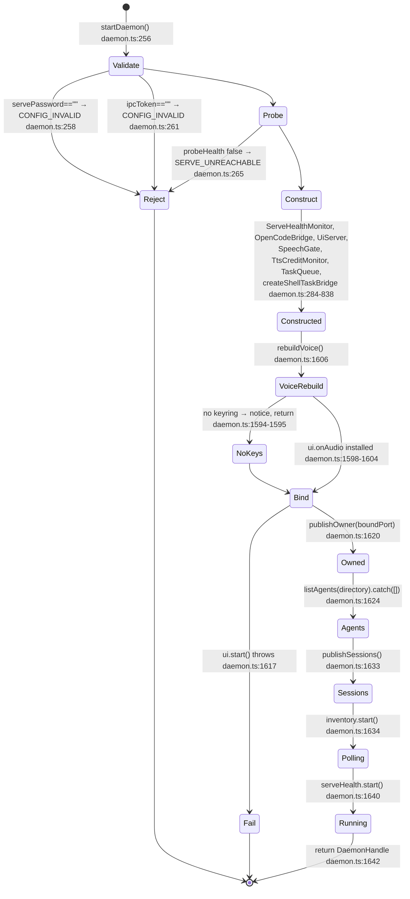
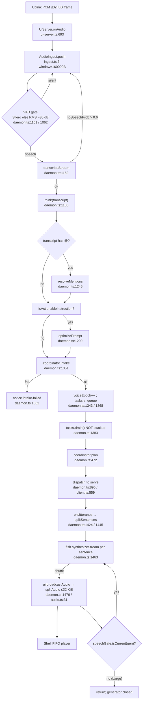

# Section 04 — Process Lifecycle & Execution Timeline

**Audit basis.** Physical file reads and `Select-String` symbol greps only. No file under
`docs/`, no `README.md`, no `README.ar.md`, no `CHANGELOG.md`, no `AGENTS.md`, no
`CONTRIBUTING.md` and no source comment was used as evidence. Where a claim rests on an
in-source comment it is quoted and labelled **as a comment**, never as a fact.

**Repository state at audit time** (measured, not asserted):
`git rev-parse --short HEAD` → `9f41c96`; `git rev-list --count HEAD` → `371`.
`git status --short` before this file existed:

```
?? docs/HEADLESS-BRIDGE-VERIFY.md
?? src/cli/
```

Both were already present and untracked.

**The working tree moved during the audit.** A concurrent agent committed nothing but did
edit tracked source while this file was being written:

```
git status --short          (final, at time of writing)
 M src/cli.ts
?? docs/HEADLESS-BRIDGE-VERIFY.md
?? dossier/sections/
?? src/cli/
```

`src/cli.ts` is **not** my edit. I issued exactly one write, to
`dossier/sections/04-lifecycle.md`. Timestamps prove the ordering:
`(Get-Item src/cli.ts).LastWriteTime` = `9/30/2026 2:46:27 PM`;
`(Get-Item dossier/sections/04-lifecycle.md).LastWriteTime` = `9/30/2026 2:50:11 PM`.
The diff is `git diff --stat src/cli.ts` → `1 file changed, 14 insertions(+)`. It is
uncommitted work by the concurrent headless-CLI agent and is reported as-is, not reverted.
**The sixth argv branch it adds is documented in §04.0 items 3–4 and §04.3.4, because the
file changed after my first read and the file wins over my earlier read.**

**Measured file inventory** (contradicts the briefing; see §04.0):

| Claim | Briefing | Measured | Command |
|---|---|---|---|
| `ml` source files | 1 | **45** (30 top-level + 15 nested) | `Get-ChildItem -Recurse -File ml \| Measure-Object` |
| `scripts` files | 10 | 11 files, of which 10 are executable scripts | `Get-ChildItem -File scripts` |
| `scripts` listing | — | `docs-verify-self-test.mjs`, `docs-verify.mjs`, `generate-whiteboard-assets.mjs`, `key-report.mjs`, `lint-baseline.json`, `lint-baseline.mjs`, `live_console_test.ts`, `packaging-preflight.mjs`, `provision-sidecar.mjs`, `release-verify.mjs`, `test-blindspots.mjs` | `Get-ChildItem -File scripts` |
| Rust entry size | 143,826 B | **143,826 B — confirmed** | `(Get-Item apps/desktop/src-tauri/src/main.rs).Length` |
| No root `Cargo.toml` | — | **confirmed**; the only `Cargo.toml` is `apps/desktop/src-tauri/Cargo.toml` | `Get-ChildItem -Recurse -Include go.mod,pyproject.toml,Cargo.toml` (excluding `node_modules`, `.venv`, `target`, `sidecar`) |
| `daemon.ts` size | ~90 KB | **88,577 B, 1,691 lines** | `(Get-Item src/daemon.ts).Length` |
| Non-test `src` modules | — | 82 `.ts`/`.tsx` | `Get-ChildItem -Recurse -File src -Include *.ts,*.tsx` minus `*.test.*` |
| Non-test `apps/desktop/src` modules | — | 39 `.ts`/`.tsx` | same filter under `apps/desktop/src` |

---

## §04.0 — Corrections to the briefing, stated first

Four briefing claims were checked against the files and **three failed**.

1. **"Plane A registers 4 Tauri commands" — FALSE.** The handler registers **three**.
   `apps/desktop/src-tauri/src/main.rs:3259-3263`:

   ```rust
   .invoke_handler(tauri::generate_handler![
       ipc_token,
       ensure_all_services,
       restrict_vault_file
   ])
   ```

   `shutdown_all_services` does not exist anywhere in the repository:

   ```
   Select-String -Path apps/desktop/src-tauri/src/main.rs -Pattern "shutdown" -CaseSensitive:$false
   → (no output)
   Select-String -Path <all .ts/.tsx/.rs/.mjs under src,apps> -Pattern "shutdown_all_services|shutdownAllServices"
   → (no output)
   ```

   So the related briefing assertion that this is a "registered-but-dead command" is
   **also false**: the command was removed, not left registered. There is no A.1-class
   false affordance in the Tauri surface. Teardown is exit-driven only, but by absence of
   design, not by a dangling registration.

2. **"`startDaemon()` boot includes a knowledge load" — FALSE.** There is no knowledge
   load in `startDaemon`. The only `knowledge/` import in `src/daemon.ts` is a persona
   registry: `src/daemon.ts:35` `import { PERSONA_DIRECTIVES } from './knowledge/personas.js';`.
   Grep for a corpus load across the whole file:

   ```
   Select-String -Path src/daemon.ts -Pattern "assertParity|buildIndex|loadKnowledge|KnowledgeError|PARITY"
   → (no output)
   ```

   `assertParity` and `buildIndex` are called only from `src/cli.ts:272` and `src/cli.ts:278`,
   i.e. the `knowledge` subcommand. The boot step is **ABSENT — verified by the grep above**.

3. **"`cli.ts` has a five-branch argv ladder" — was TRUE on my first read, is now FALSE.**
   At the time of my first read the ladder had five `if`/`else if` arms spanning
   `src/cli.ts:298-312`. It now has **six**. A concurrent agent appended a headless family
   between the `knowledge` arm and the usage fallback:

   ```
   src/cli.ts:314  } else if (isHeadlessCommand(command)) {
   src/cli.ts:320    const { runHeadless } = await import('./cli/headless.js');
   src/cli.ts:321    process.exit(await runHeadless(command, process.argv.slice(2)));
   ```

   `isHeadlessCommand` is a static import from `./cli/commands.js` at `src/cli.ts:25`;
   `runHeadless` is a **dynamic** import at `src/cli.ts:320`. The 11 admitted command names
   are a literal array at `src/cli/commands.ts:15-27`: `reason`, `intents`, `gate`,
   `sessions`, `mcp`, `lsp`, `skills`, `create-session`, `prompt`, `shell`, `spec`. The
   guard itself is `src/cli/commands.ts:31-33`. So the briefing's guess that "a sixth branch
   may exist" was correct in substance and I initially reported it absent against a stale
   read; the corrected verdict is that the branch **exists and is wired**, uncommitted.

4. **"the concurrent `src/cli/` tree is unreferenced" — was TRUE, is now FALSE.**
   My first importer grep over every non-`node_modules` `.ts`/`.tsx`/`.mjs` under `src`,
   `apps`, `scripts`, `ml` found only two hits, both a prose comment inside `src/cli/turn.ts`
   referring to its own file paths. Re-run after the edit, it finds two real tracked-side
   call sites:

   ```
   src/cli.ts:25   import { HEADLESS_USAGE_SUFFIX, isHeadlessCommand } from './cli/commands.js';
   src/cli.ts:320    const { runHeadless } = await import('./cli/headless.js');
   ```

   `src/cli/` is therefore **reachable from the composition root as of the working tree**,
   though **not at HEAD `9f41c96`** — `git diff --stat src/cli.ts` shows the wiring is
   uncommitted. The distinction matters: at HEAD the tree is unreferenced; in the working
   tree it is live for `src/cli/commands.ts` and `src/cli/headless.ts`, while
   `src/cli/serve.ts`, `src/cli/intents.ts`, `src/cli/reason.ts`, `src/cli/report.ts`,
   `src/cli/turn.ts` and `src/cli/bridge.ts` still have **no importer from any tracked
   file** and are reached only through `headless.ts`'s own internal graph, which is itself
   untracked. Detail in §04.3.4 and §05.0.1.

---

## §04.1 — Stage 0: binary execution → Tauri event loop

### 1.1 `main()`

`apps/desktop/src-tauri/src/main.rs:3256-3289`. Three statements of consequence.

| Step | Location | Action | Throws |
|---|---|---|---|
| 0.1 | `main.rs:3257` | `tauri::Builder::default()` | — |
| 0.2 | `main.rs:3258` | `.manage(Supervisor::default())` — the process supervisor is the only Tauri-managed state | — |
| 0.3 | `main.rs:3259-3263` | `.invoke_handler(generate_handler![ipc_token, ensure_all_services, restrict_vault_file])` — **3** commands | compile-time macro expansion |
| 0.4 | `main.rs:3264-3280` | `.setup(\|app\| { ... })` — see §04.1.2 | `ensure_ipc_token()` result is **caught and logged**, not propagated (`main.rs:3269-3271`) |
| 0.5 | `main.rs:3281-3282` | `.build(tauri::generate_context!())` | `panic!` via `.expect("error while building Voxaura")` — the only *hard* process abort on this path |
| 0.6 | `main.rs:3284-3288` | `app.run(\|app_handle, event\| ...)` with the exit handler | see §04.6 |

The setup closure returns `Ok(())` unconditionally at `main.rs:3279`. **No provisioning
failure can abort setup.**

### 1.2 `setup()` — what is provisioned *before* the webview loads

`main.rs:3264-3280`, executed synchronously by Tauri before the frontend mounts.

| Order | Location | Action | On failure |
|---|---|---|---|
| 1 | `main.rs:3269` | `ensure_ipc_token()` — `main.rs:926` — CSPRNG token via `generate_secret()` (`main.rs:601`, `secure_random_bytes::<N>` at `main.rs:594`, `getrandom`-backed) written through `write_protected_secret` (`main.rs:619`) with `restrict_to_owner` (`main.rs:662` Windows / `main.rs:819` non-Windows) | **Logged only** — `log_line("ensure_ipc_token ERROR: {err}")` at `main.rs:3270`. The app continues with no token, so the later `ensure_all_services` re-runs it. |
| 2 | `main.rs:3275` | `let handle = app.handle().clone();` | — |
| 3 | `main.rs:3276-3278` | `std::thread::spawn(move \|\| { let _ = ensure_all_services(handle); })` — bring-up is **moved off the UI thread** so a slow port probe cannot delay first paint | Return value discarded with `let _ =`. Bring-up failure is therefore invisible to `setup()` and surfaces only via the frontend's own `ensure_all_services` invoke and via `supervisor.log`. |

**Provisioning-before-webview invariant:** exactly one artifact is guaranteed written before
the webview loads — `ipc.token`. Everything else (serve process, daemon process, serve
password, machine key, owner key, vault DACL) happens on the spawned thread *after* the
webview has already begun loading. The reasoning is recorded as a comment at
`main.rs:3265-3268` and is consistent with the code: the frontend requests the token via
the `ipc_token` command on mount, so a token written only by the daemon would race it.

`ensure_ipc_token` is *also* re-entered at `main.rs:1602` inside
`ensure_all_services`, and there the `?` **does** propagate (`Result<_, String>` → `Err` →
`BringUpStatus::failed`). So the same provisioning step is fail-soft on the webview path
and fail-hard on the bring-up path.

---

## §04.2 — Stage 1: the supervisor's child spawns

`ensure_all_services` — `main.rs:1595-1634`. Order, guards, and the error contract.

| Order | Location | Action | Throws / returns |
|---|---|---|---|
| 1.1 | `main.rs:1596-1599` | `BRINGUP_INFLIGHT.swap(true, SeqCst)` — single-flight guard. Re-entry returns `BringUpStatus::in_flight()` (an `Ok`, not an `Err`) | never `Err` |
| 1.2 | `main.rs:1602` | `ensure_ipc_token()?` | `Err(String)` propagates to `main.rs:1613` |
| 1.3 | `main.rs:1604` | `ensure_opencode(&app)?` | `Err(String)`, §04.2.1 |
| 1.4 | `main.rs:1606` | `ensure_daemon(&app, &ipc_token)?` | `Err(String)`, §04.2.2 |
| 1.5 | `main.rs:1610` | `BRINGUP_INFLIGHT.store(false)` — executed on both paths because `result` is captured at `main.rs:1600-1609` | — |
| 1.6 | `main.rs:1612` | `Ok(BringUpStatus::ready(steps))` | — |
| 1.7 | `main.rs:1613-1631` | On `Err`: log, then a **second diagnostic** on supervision failure — `sup.unadopted() > 0` (`main.rs:1616`) and `sup.no_job() > 0` (`main.rs:1625`) — then `Ok(BringUpStatus::failed(&err))` | returns `Ok`, **never `Err`**, even when everything failed |

The contract is: `ensure_all_services` is a `#[tauri::command]` (`main.rs:1594`) whose error
arm converts every failure into a successful transport carrying a failed status. A Tauri
`invoke()` on this command cannot reject.

### 2.1 `ensure_opencode` — the `opencode serve` child

`main.rs:1405-1480`.

| Order | Location | Action |
|---|---|---|
| a | `main.rs:1409-1412` | Read `Supervisor::pids()` — the PIDs *we* spawned |
| b | `main.rs:1413` | `opencode_pids()` (`main.rs:257` / `main.rs:273`) — enumerate every `opencode-cli.exe` via `tasklist` CSV at `main.rs:258` |
| c | `main.rs:1414-1417` | `bring_up_action(port_open(OPENCODE_PORT), foreign_serve_present(ours, candidates) == Foreign)` (`main.rs:287`) — a pure decision function |
| d | `main.rs:1419-1421` | `Adopt` → early `Ok("opencode serve already on {OPENCODE_PORT}")`, **no spawn** |
| e | `main.rs:1422-1428` | `SpawnAndWarn` → log the second-supervisor condition, then fall through to spawn |
| f | `main.rs:1431` | `resolve_opencode_bin()` (`main.rs:1216`) |
| g | `main.rs:1432` | `ensure_serve_password()?` — `Result<String,String>`, `Err` propagates |
| h | `main.rs:1434-1435` | argv: `["serve", "--port", "<4096>", "--hostname", "127.0.0.1"]`, `stdin(Stdio::null())` |
| i | `main.rs:1438-1446` | stdout/stderr → `open_child_stdout` / `open_child_stderr` (`main.rs:208`, `main.rs:212`), both **append-only** (`open_append`, `main.rs:201`) |
| j | `main.rs:1447` | env: **exactly one variable** — `OPENCODE_SERVER_PASSWORD` |
| k | `main.rs:1449` | `spawn_and_wait_for_port(&mut cmd, 4096, 20 s)` (`main.rs:313`) |
| l | `main.rs:1450-1465` | `BindOutcome::Bound(child)` → `Supervisor::own(child)`; if `own` returns `false` the child was already killed and this returns `Err` (`main.rs:1457-1463`) |
| m | `main.rs:1466-1477` | `BindOutcome::TimedOut{pid}` → `Err`, message names the pid and the port |
| n | `main.rs:1478` | `BindOutcome::SpawnFailed(msg)` → `Err` |

**Job Object adoption is not optional.** `own` → `own_with_adoption` (`main.rs:435`) →
`adoption_of` (`main.rs:423`) → `adoption_action` (`main.rs:143`): `Adopted` → `Keep`,
`Refused` → `Kill`, `NoJob` → `Kill`. `AssignProcessToJobObject` is imported at
`main.rs:39` and the job is created once per `Supervisor` at `main.rs:63` with
`JOB_OBJECT_LIMIT_KILL_ON_JOB_CLOSE` set at `main.rs:68`.

### 2.2 `ensure_daemon` — the Node child

`main.rs:1490-1586`. Two secrets are provisioned *before* the port probe, deliberately.

| Order | Location | Action | Throws |
|---|---|---|---|
| a | `main.rs:1495` | `ensure_machine_key()?` (`main.rs:856`) — 32 raw bytes, hex for the env handoff, DACL on create *and* adopt | `Err` |
| b | `main.rs:1499` | `ensure_owner_key()?` (`main.rs:1027`) — daemon identity, no logs | `Err` |
| c | `main.rs:1500-1517` | `classify_daemon_holder(4097, &owner_key)` (`main.rs:1159`): `Cold` → spawn; `Ours{pid}` → early `Ok` adopt; `Foreign{reason}` → `Err`, explicitly refusing to double-spawn (`main.rs:1508-1516`) | `Err` on `Foreign` |
| d | `main.rs:1518-1525` | `resolve_daemon_entry(resource_dir)` (`main.rs:1263`); `None` → `Err("daemon entrypoint not found …")` | `Err` |
| e | `main.rs:1526` | `resolve_node_bin(resource_dir)` (`main.rs:1389`) | — |
| f | `main.rs:1528` | `ensure_serve_password()?` | `Err` |
| g | `main.rs:1529-1541` | argv `[<node>, <entry>, "serve"]` + **five** environment variables | — |
| h | `main.rs:1545-1565` | stdout/stderr capture; each failure logged individually, never fatal | — |
| i | `main.rs:1567` | `spawn_and_wait_for_port(..., 4097, 20 s)` | — |
| j | `main.rs:1568-1585` | `Bound` + `own` → `Ok`; `own` false → `Err`; `TimedOut` → `Err`; `SpawnFailed` → `Err` | `Err` |

**Exact environment handed to the daemon** (`main.rs:1533-1541`):

| Variable | Source | Note |
|---|---|---|
| `OPENCODE_SERVER_PASSWORD` | `ensure_serve_password()` | shared with the serve child |
| `VOICE_RUNTIME_IPC_TOKEN` | `ipc_token` from step 1.2 | the WS-4097 bearer |
| `VOXAURA_OWNER_KEY` | `ensure_owner_key()` | daemon identity; never logged |
| `VOXAURA_MACHINE_KEY` | `ensure_machine_key()`, **hex** | 32 raw bytes would be awkward to log safely |
| `VOXAURA_VAULT_DIR` | `resolve_vault_dir(Some(&entry))` (`main.rs:1313`) | vault root resolution |

The `stdin` for the daemon is `Stdio::null()` (`main.rs:1532`). The daemon is invoked as
`node <entry> serve`, i.e. it enters through the `serve` arm of the CLI ladder, not
through a separate entry module.

### 2.3 Spawn order, as a state machine

```
main()  main.rs:3256
  └─ setup()  main.rs:3264
       ├─ ensure_ipc_token()            [SYNC, fail-soft]   main.rs:3269
       └─ thread::spawn ────────────────┐                  main.rs:3276
                                          ▼
                   ensure_all_services()                     main.rs:1595
                     ├─ BRINGUP_INFLIGHT guard               main.rs:1596
                     ├─ ensure_ipc_token()  (re-run, fail-hard) main.rs:1602
                     ├─ ensure_opencode()                     main.rs:1604
                     │    ├─ decide Adopt|SpawnAndWarn|Spawn  main.rs:1414
                     │    ├─ [Adopt] ──▶ return Ok, NO SPAWN  main.rs:1420
                     │    └─ [Spawn ] ──▶ wait 4096 ≤ 20 s    main.rs:1449
                     │                         └─ Supervisor::own (Job Object) main.rs:1451
                     └─ ensure_daemon()                       main.rs:1606
                          ├─ ensure_machine_key()             main.rs:1495
                          ├─ ensure_owner_key()               main.rs:1499
                          ├─ classify_daemon_holder(4097)      main.rs:1500
                          │    ├─ [Cold]   ──▶ spawn
                          │    ├─ [Ours]   ──▶ return Ok      main.rs:1506
                          │    └─ [Foreign]─▶ return Err       main.rs:1515
                          ├─ resolve entry + node              main.rs:1518-1526
                          └─ spawn, wait 4097 ≤ 20 s           main.rs:1567
                               └─ Supervisor::own (Job Object) main.rs:1569
```

The daemon is spawned **strictly after** serve binds. `ensure_opencode` `?`-propagates, so
if serve fails to bind the daemon is never attempted. This is the ordering the daemon
itself requires: its first act is a health probe (§04.4 step 2).

---

## §04.3 — Stage 2: `node dist/cli.js` argv dispatch

`src/cli.ts`, 312 lines.

### 3.1 The pre-dispatch hook

`src/cli.ts:243-260` runs **before** any branch, at module top level.

| Order | Location | Action |
|---|---|---|
| p1 | `src/cli.ts:243` | `const command = process.argv[2];` |
| p2 | `src/cli.ts:250` | `OPERATOR_COMMANDS = new Set(['doctor', 'vault', 'live'])` |
| p3 | `src/cli.ts:251-260` | If `command ∈ OPERATOR_COMMANDS`, run `ensureVault('voxaura', resolveVaultRoot())` inside a `try`/`catch` that swallows everything (`src/cli.ts:257-259`) |

Two consequences, both from the code rather than from a comment:

- The hook runs for `doctor`, `vault` and `live` only. `serve` and `knowledge` do **not**
  scaffold the memory vault. The reason is recorded as a comment at `src/cli.ts:244-249`
  and is consistent with the set literal at `src/cli.ts:250`.
- The hook's failure mode is **silent** — the `catch` block is empty and there is no log
  line, no exit code and no stderr write. A vault that cannot be scaffolded is
  indistinguishable from one that was never attempted.

### 3.2 The ladder and every exit code

Line numbers are from the **working tree** (post-concurrent-edit), not HEAD.

| Arm | Location | Handler | Exit codes |
|---|---|---|---|
| 1 | `src/cli.ts:303-305` | `doctor` → **forks** on `parseDoctorFlags(process.argv.slice(3))` (`src/diag/bundle.ts`, imported `src/cli.ts:20`) | `flags.legacy ? doctor() : doctorBundle(flags)` |
| 2 | `src/cli.ts:306-307` | `vault bootstrap` (`command === 'vault' && process.argv[3] === 'bootstrap'`) | `vaultBootstrap()` (`src/cli.ts:110`) |
| 3 | `src/cli.ts:308-309` | `live` | `liveLoop()` (`src/cli.ts:126`) |
| 4 | `src/cli.ts:310-311` | `serve` | `serveDaemon()` (`src/cli.ts:195`) |
| 5 | `src/cli.ts:312-313` | `knowledge` | `knowledgeReport()` (`src/cli.ts:270`) |
| **6** | `src/cli.ts:314-322` | **headless family** — `isHeadlessCommand(command)` gates a dynamic `import('./cli/headless.js')` | `runHeadless(command, process.argv.slice(2))` |
| — | `src/cli.ts:323-325` | usage line + `HEADLESS_USAGE_SUFFIX` + `process.exit(2)` | **2** |

**Six arms, seven reachable paths.** The `doctor` arm is a two-way fork:

| Sub-path | Location | Exit codes |
|---|---|---|
| `doctor` (legacy, no bundle flags) | `src/cli.ts:24-42` | `0` when `alive && verdict.ok` (`src/cli.ts:41`), else `1` |
| `doctor --bundle` | `src/cli.ts:56-89` | `2` on a flag error (`src/cli.ts:59`), `2` on a write failure (`src/cli.ts:84`), else `result.exitCode` (`src/cli.ts:88`) from `collectBundle` |

### 3.3 Complete exit-code table for `src/cli.ts`

| Code | Location | Trigger |
|---|---|---|
| 0 | `src/cli.ts:305` via `src/cli.ts:41` | `doctor` legacy, serve healthy **and** vault keys ok |
| 0 | `src/cli.ts:305` via `src/cli.ts:88` | `doctor --bundle`, `collectBundle` reported clean |
| 1 | `src/cli.ts:41` | `doctor` legacy: serve unreachable **or** vault keys missing |
| 1 | `src/cli.ts:116` | `vault bootstrap`: not all three pools present |
| 2 | `src/cli.ts:59` | `doctor --bundle`: malformed flag / unknown flag |
| 2 | `src/cli.ts:84` | `doctor --bundle`: `--out` write failed |
| 2 | `src/cli.ts:325` | any unrecognised `argv[2]` |
| 0 | `src/cli.ts:123` | `vault bootstrap` success |
| 0 / 1 | `src/cli.ts:187` / `src/cli.ts:190` | `live` complete / any throw |
| 0 | `src/cli.ts:236` | `serve` clean stop |
| 1 | `src/cli.ts:204` | `serve`: `OPENCODE_SERVER_PASSWORD` empty — **checked before `startDaemon` is even imported** |
| 1 | `src/cli.ts:239` | `serve`: any throw from the `try` at `src/cli.ts:206` |
| 0 / 1 | `src/cli.ts:295` / `src/cli.ts:274` | `knowledge` parity ok / parity violation |
| *n* | `src/cli.ts:321` | headless family — the value is whatever `runHeadless` returns (`src/cli/headless.ts:193`). **NOT AUDITED**: the module is untracked and was written concurrently with this section; its exit-code contract is outside the scope of this file and no claim is made about it. |

`vault bootstrap` returns `1` at `src/cli.ts:116` but a *thrown* `FileVault` constructor
failure is **not** caught — `new FileVault(VAULT_PATH)` at `src/cli.ts:112` sits outside any
`try`, so a corrupt or unwritable vault produces an **unhandled rejection and a non-zero
Node exit (1)** with a stack trace on stderr, not the designed message. Same shape for
`doctor()` at `src/cli.ts:25`.

### 3.4 The concurrent edit — recorded, not judged

`src/cli/` is untracked. Its contents **grew twice while this section was being written**:
`reason.ts` and `bridge.ts` were absent from my first listing and present in a later one,
then `commands.ts`, `headless.ts` and `turn.test.ts` appeared. Final listing:

| File | Bytes |
|---|---|
| `src/cli/bridge.ts` | 14,398 |
| `src/cli/commands.ts` | 1,545 |
| `src/cli/headless.ts` | 12,736 |
| `src/cli/intents.ts` | 13,099 |
| `src/cli/reason.ts` | 19,458 |
| `src/cli/report.ts` | 2,018 |
| `src/cli/serve.ts` | 11,168 |
| `src/cli/turn.test.ts` | 19,461 |
| `src/cli/turn.ts` | 18,087 |

**Reachability, as of the working tree.** Two of the nine files are reachable from the
tracked composition root:

| File | Reached by | Mechanism |
|---|---|---|
| `src/cli/commands.ts` | `src/cli.ts:25` | **static** import of `HEADLESS_USAGE_SUFFIX` and `isHeadlessCommand` |
| `src/cli/headless.ts` | `src/cli.ts:320` | **dynamic** `await import('./cli/headless.js')` inside the new arm |
| the other seven | nothing tracked | no importer in any tracked `.ts`/`.tsx`/`.mjs` under `src`, `apps/desktop/src`, `scripts`, `ml` |

**The static/dynamic split is deliberate and is asserted in the source.** As a comment in
`src/cli/commands.ts:1-13` (labelled: comment, not fact): routing happens for *every*
invocation including `doctor` and `knowledge`, so the type guard must live in a
dependency-free module or the static import graph of the ladder would pull the coordinator,
the serve client, the vault and `daemon.js` into five subcommands that are supposed to be
unchanged. The design consequence stated there is that the guard file must contain no
`import` statement at all, pinned by a test named `headless-commands.test.ts`. I did not run
that test and do not claim it passes.

**What I do and do not claim about the headless family.** The wiring above is verified by
grep against the physical files. The *behaviour* of `runHeadless` — its commands, its exit
codes, its error contract, whether it is correct — is **not audited here**: the module is
untracked, was being written during this pass, and a concurrent agent is still editing it.
Any claim about it would be a claim about a moving target. One structural fact is worth
recording because it touches the lifecycle sections: the new arm is placed **after**
`knowledge` and **before** the usage fallback, and it is gated on a predicate rather than a
string equality, so `argv[2]` names in `HEADLESS_COMMANDS` (`src/cli/commands.ts:15-27`)
short-circuit the usage path and reach `process.exit(await runHeadless(...))`.

**At HEAD `9f41c96`, none of this exists.** `git diff --stat src/cli.ts` →
`1 file changed, 14 insertions(+)`, uncommitted. A reader auditing the committed tree should
take §04.3.2 as five arms, and this subsection as future work in flight.

---

## §04.4 — Stage 3: `startDaemon()` boot sequence

`src/daemon.ts:256-1691`. Every step that can throw, and the code it throws.

### 4.1 Throwing steps, in execution order

| # | Location | Step | Throws | Code / class |
|---|---|---|---|---|
| 1 | `src/daemon.ts:257-259` | empty `servePassword` | yes | `OrchestratorError('CONFIG_INVALID', retryable=false, 'OPENCODE_SERVER_PASSWORD is required')` |
| 2 | `src/daemon.ts:260-262` | empty `ipcToken` | yes | `OrchestratorError('CONFIG_INVALID', retryable=false, 'IPC token is required (fail-closed)')` |
| 3 | `src/daemon.ts:264-270` | `probeHealth(servePort, servePassword)` false | yes | `OrchestratorError('SERVE_UNREACHABLE', retryable=true, …)` |
| 4 | `src/daemon.ts:1617` | `ui.start(ipcPort)` | yes | plain `Error` from `src/ipc/ui-server.ts:161` if the token env is empty; `Error('UiServer already started')` from `src/ipc/ui-server.ts:188`; the port-bind failure propagates from Node's `net.Server.listen` |

`probeHealth` itself **cannot** throw — `src/launcher/launcher.ts:22-38` wraps `fetch` in
`try`/`catch` returning `false`, and clears the `AbortController` timer in a `finally`
(`src/launcher/launcher.ts:35-37`). The route it probes is `GET /api/session`, not
`/health` (`src/launcher/launcher.ts:28`); the reason is a comment at
`src/launcher/launcher.ts:26`. Default timeout 2,000 ms (`src/launcher/launcher.ts:22`).

### 4.2 Non-throwing construction steps

| # | Location | Step | Notes |
|---|---|---|---|
| 5 | `src/daemon.ts:284-315` | `new ServeHealthMonitor({...})` | `onEvent` closure calls `ui.notice(...)` at `:301`, `:310`, `:313`. **Reads `ui` before `ui` is declared at `:337`** — safe only because the callback is not invoked during construction, which is stated as a comment at `src/daemon.ts:272-283`. |
| 6 | `src/daemon.ts:317` | `new ServeClient('http://127.0.0.1:<port>', servePassword)` | no I/O |
| 7 | `src/daemon.ts:319` | `new OpenCodeBridge(client, directory)` | no I/O |
| 8 | `src/daemon.ts:325-334` | `envCache` closure — **lazy**, no I/O at boot. On first call it issues `bridge.getEnvironmentStatus()`; any failure yields `{ agents: [], skills: [] }` (`src/daemon.ts:331`) so every `@name` falls through to the file branch. |
| 9 | `src/daemon.ts:335` | `runtimeDir = options.runtimeDir ?? join(homedir(), '.opencode-voice-runtime')` | — |
| 10 | `src/daemon.ts:336` | `contractVersion = options.contractVersion ?? '3.1.0'` | — |
| 11 | `src/daemon.ts:337-340` | `new UiServer({ token, contractVersion })` | — |
| 12 | `src/daemon.ts:356-357` | `ownerKey` from `VOXAURA_OWNER_KEY`; `ownerPath` | — |
| 13 | `src/daemon.ts:395` | `clearOwner` defined | — |
| 14 | `src/daemon.ts:411` | `activePersona = 'kareem'` | daemon-owned persona state |
| 15 | `src/daemon.ts:415` | `new SpeechGate()` | — |
| 16 | `src/daemon.ts:426` | `new TtsCreditMonitor(options.ttsCreditNow ?? (() => Date.now()))` | constructed at **daemon scope**, not inside the pipeline builder — the placement is called out as deliberate at `src/daemon.ts:421` |
| 17 | `src/daemon.ts:453-…` | `new TaskQueue({ plan })` — the voice planner queue | `coordinatorRef` is a late binding (`src/daemon.ts:451`) so a pipeline rebuild re-points the queue without discarding it |
| 18 | `src/daemon.ts:838` | `createShellTaskBridge({...})` | the shell-command queue |
| 19 | `src/daemon.ts:1050-1060` | `loadVad` closure — **lazy dynamic `import('./runtime/vad.js')`** | the import is deliberately not static; the reason is a comment at `src/daemon.ts:46`. Failure is absorbed to `null` (`src/daemon.ts:1055-1059` region) and the RMS fallback takes over. |
| 20 | `src/daemon.ts:1062` | `makeVadGate(loadVad, isLoudWindow)` (`src/runtime/vad-gate.ts:70`) | — |

### 4.3 The tail — the order the briefing got partly wrong

| # | Location | Step | Failure mode |
|---|---|---|---|
| 21 | `src/daemon.ts:1606` | `rebuildVoice()` (defined `src/daemon.ts:1561`) — builds the audio pipeline and calls it immediately | If keys are absent it records `KEYS_MISSING`/`DEGRADED` (`src/daemon.ts:1587-1593`), emits `voice-disabled-no-keys` (`src/daemon.ts:1594`) and **returns without installing `ui.onAudio`** (`:1595`). The control plane stays up; audio is dead. |
| 22 | `src/daemon.ts:1608-1615` | `new SessionInventory(client, { intervalMs, onEvent })` | — |
| 23 | `src/daemon.ts:1617` | **`await ui.start(options.ipcPort)`** — the WS-4097 bind. Returns `boundPort` | **throws** (see throwing step 4) |
| 24 | `src/daemon.ts:1620` | `publishOwner(boundPort)` — writes the `daemon.owner` marker **in place** with `mode: 0o600` (`src/daemon.ts:373`), never temp+rename | non-fatal; the `try` at `src/daemon.ts:366-374` logs and continues. Silently no-ops when `ownerKey` is empty (`src/daemon.ts:359`) |
| 25 | `src/daemon.ts:1624` | `await client.listAgents(directory).catch(() => [])` → `GET /api/agent?directory=<enc>` (`src/runtime/client.ts:849`) | **swallowed** — an unreachable serve yields an empty agent list and the shell's selector renders empty |
| 26 | `src/daemon.ts:1625` | `ui.publishAgents(...)` | — |
| 27 | `src/daemon.ts:1633` | `await publishSessions()` → `client.listSessions()` (`src/runtime/client.ts:867`) → `ui.publishInventory` | **not** `.catch()`-guarded at the call site — a throw here rejects `startDaemon` after the socket is already bound and the owner marker already written, leaving a bound-but-failed daemon with a stale marker |
| 28 | `src/daemon.ts:1634` | `inventory.start()` — the periodic poller | — |
| 29 | `src/daemon.ts:1640` | `serveHealth.start()` | — |
| 30 | `src/daemon.ts:1642-1690` | return the `DaemonHandle` | — |

**Correction to the briefing:** the stated order was *config validation → probeHealth →
client construction → knowledge load → WS server bind → inventory start*. Steps 1–3 match.
There is **no knowledge load** (§04.0 item 2). The real order inserts **six** construction
steps between client construction and the bind — `ServeHealthMonitor`, `OpenCodeBridge`,
`UiServer`, `SpeechGate`, `TtsCreditMonitor`, `TaskQueue`, `createShellTaskBridge`,
`AudioPipeline` — and the bind is followed by four steps the briefing omits:
`publishOwner`, `listAgents`, `publishSessions`, then the two `start()` calls.

### 4.4 Boot state machine (mermaid)



---

## §04.5 — Stage 4: the voice loop, hop by hop

Every hop below is a call site in `src/daemon.ts` unless stated. Data shapes are read from
the interface declarations, not from prose.

### 5.1 Hop table

| Hop | Function | Location | Data shape crossing | Gate / bound |
|---|---|---|---|---|
| 1 | `UiServer.onAudio` dispatch | `src/ipc/ui-server.ts:693` → `src/daemon.ts:1598` | `Buffer` (raw reassembled binary payload) | `MAX_AUDIO_BYTES` 64 KiB enforced on the **reassembled** payload at `src/ipc/ui-server.ts:470` |
| 2 | `setVoicePhase('listening')` | `src/daemon.ts:1602` | — | set only on change; comment at `:1599-1601` |
| 3 | `AudioPipeline.pushChunk(pcm)` | `src/daemon.ts:1603` → `src/orchestrator/audio-pipeline.ts:147` | `Uint8Array` | fire-and-forget: `void … .catch(() => undefined)` — the turn is not awaited on the socket |
| 4 | `AudioIngest.push(chunk)` | `src/audio-pipeline.ts:149` | `Uint8Array` → `Iterable<Uint8Array>` | `WINDOW_BYTES = 160_000` (5 s @ 16 kHz Int16 mono) at `src/voice/ingest.ts:6`; `MAX_BUFFERED_BYTES = WINDOW_BYTES * 6` at `src/voice/ingest.ts:8`; `PAUSE_BYTES = 256*1024` / `RESUME_BYTES = 32*1024` at `src/voice/ingest.ts:47-48` |
| 5 | VAD gate | `src/daemon.ts:1151` (`speechGate: vadGate`), impl `src/runtime/vad-gate.ts:70` | `Uint8Array` frame | Silero via lazy `import('./runtime/vad.js')` (`src/daemon.ts:1055`), **else** RMS: `isLoudWindow` (`src/voice/ingest.ts`), threshold `SPEECH_GATE_DB = -30` at `src/voice/ingest.ts:71`, silence floor −100 at `src/voice/ingest.ts:87` |
| 6 | `AudioPipeline.transcribe` dep | `src/daemon.ts:1152-1185` → `src/voice/stt.ts` | `Uint8Array` → `string` **or** `{ text: string; noSpeechProb: number }` | branch at `src/daemon.ts:1166-1168`; `NO_SPEECH_DROP = 0.6` at `src/orchestrator/audio-pipeline.ts:27`; `REPEAT_MEMORY = 5` at `src/orchestrator/audio-pipeline.ts:30`; STT timeout path `src/orchestrator/audio-pipeline.ts:213` → `onSttTimeout` |
| 7 | `think(transcript)` | `src/daemon.ts:1186` | `string` → `{ reply: string; receipt?: … }` | — |
| 7a | slash gate | `src/daemon.ts:1194` `parseSlashCommand` (`src/orchestrator/slash.ts:45`); `slashCommandError` (`:61`); `describeSlashCommands` (`:78`) | transcript → `ParsedSlash \| null` | a spoken `/command` **never reaches a model**; the `help` and `compact` arms are `src/daemon.ts:1202-1213` |
| 7b | `@`-mention resolution | `src/daemon.ts:1243-1276`, `resolveMentions` (`src/orchestrator/mentions.ts:60`) | `→ ResolvedMentions` (`src/orchestrator/mentions.ts:34`) | `MENTION_MAX_FILES = 20` (`mentions.ts:23`), `MENTION_MAX_TOKENS = 60` (`mentions.ts:25`); only entered when `transcript.includes('@')`; any throw is swallowed at `src/daemon.ts:1264-1275` and the raw transcript is used |
| 7c | prompt optimizer | `src/daemon.ts:1286-1315`, `optimizePrompt` (`src/orchestrator/prompt-optimizer.ts`) | `string` → `string` | gated on `isActionableInstruction(spoken)`; failure falls back to the **user's own words** (`src/daemon.ts:1305`) |
| 8 | `coordinator.intake(task)` | `src/daemon.ts:1351` | `string` → `IntakeAck` (`{ ok, replyAr, taskEn, receipt, transcript, intakeModel? }`, assembled `src/daemon.ts:461-471`) | 10 s budget, `reasoning: { effort: 'none' }` at `src/daemon.ts:1294` |
| 8′ | `coordinator.run(task)` | `src/daemon.ts:1322` | `string` → mission `{ replyAr, receipt }` | **kill-switch branch** — taken only when `!tasks.enabled` (`src/daemon.ts:1321`); the default is the split path |
| 9 | `tasks.enqueue({ transcript, taskEn, replyAr, epoch, intakeModel? })` | `src/daemon.ts:1368-1376` | `TaskRecord` | `voiceEpoch += 1` at `src/daemon.ts:1343`; `delivery.cancelEpoch(voiceEpoch - 1)` at `:1350` |
| 10 | `tasks.drain()` | `src/daemon.ts:1383` | — | **not awaited**; `void … .catch(() => undefined)` |
| 10′ | `TaskQueue.plan` → `coordinator.plan(ack, { signal, taskId })` | `src/daemon.ts:472` | `IntakeAck` → `TaskResult` | deadline `PLAN_DEADLINE_MS = 30_000` (`src/orchestrator/task-queue.ts:123`); depth `TASK_MAX_DEPTH = 8` (`:126`); records cap `TASK_RECORDS_CAP = 64` (`:133`) |
| 11 | dispatch → serve | `src/daemon.ts:895` (`execSessionShell` via `shellTasks`) and `src/runtime/client.ts:559` (`POST /api/session/{id}/prompt`) | `SessionId`, text, `Provenance` | — |
| 12 | `onUtterance(utterance)` | `src/daemon.ts:1424`; interface `src/orchestrator/audio-pipeline.ts:17`, invoked `src/orchestrator/audio-pipeline.ts:191` | `Utterance = { transcript, reply, receipt }` | — |
| 13 | `stripSpeechText` | `src/daemon.ts:1429` (`src/voice/tts.ts`) | `string` | — |
| 14 | `isSpeakable(text)` | `src/daemon.ts:1430` | `boolean` | falsy → `setVoicePhase('idle')` and return (`:1431-1432`) |
| 15 | persona snapshot → voice id | `src/daemon.ts:1443` | `activePersona` → `VOICE_IDS[…]` | snapshotted **per utterance** so a mid-reply switch cannot split one sentence across two voices (comment `:1441-1442`) |
| 16 | `speechGate.capture()` | `src/daemon.ts:1444` | generation token `gen` | checked before every sentence (`:1449`) **and before every chunk** (`:1475`) |
| 17 | `splitSentences(text)` | `src/daemon.ts:1445` (`src/voice/tts.ts`) | `string` → `string[]` | — |
| 18 | `fish.synthesizeStream(sentence, voiceId, { signal })` | `src/daemon.ts:1463` | `string` + `voiceId` + `AbortSignal` | **streamed, not concatenated**; the signal is `speechGate.signalFor(gen)` (`:1470`) so a barge reaches the provider, not just the broadcast |
| 19 | `ui.broadcastAudio(chunk)` | `src/daemon.ts:1476` → `src/ipc/ui-server.ts:415` | `Uint8Array` (MP3) | re-split by `splitAudio` (`src/ipc/audio.ts:31`) into `AUDIO_DOWNLINK_TYPE = 0x01` (`src/ipc/audio.ts:6`) frames of `MAX_AUDIO_CHUNK = 32 * 1024` (`src/ipc/audio.ts:7`), envelope `seq % 65_536` (`src/ipc/audio.ts:35`) |
| 20 | FR-12 park / delivery | `src/orchestrator/delivery.ts` (type-only import of `TaskRecord`/`TaskResult` at `:1`), `cancelEpoch` at `src/daemon.ts:1350` | — | — |

### 5.2 Loop shape (mermaid)



**One turn's audible shape is two utterances, not one.** `think` returns the *intake
acknowledgement* at `src/daemon.ts:1396` (`{ reply: ack.replyAr, receipt: null }`), which the
pipeline turns into the first `onUtterance` at `src/orchestrator/audio-pipeline.ts:191`. The
plan and dispatch then run in the background behind `tasks.drain()` and produce the second.
`receipt: null` is load-bearing: a null receipt with a `dispatch` dep present would make the
pipeline dispatch the raw transcript, and the daemon's pipeline has no such dep
(`src/daemon.ts:1390-1395`).

---

## §04.6 — Stage 5: shutdown

Three independent teardown mechanisms exist. They are not coordinated with each other.

### 6.1 `cli.js serve` — cooperative

`src/cli.ts:230-236`.

| Order | Location | Action |
|---|---|---|
| 1 | `src/cli.ts:230` | `await new Promise<void>((resolve) => { const stop = (): void => resolve(); … })` — the process parks here |
| 2 | `src/cli.ts:232` | `process.on('SIGINT', stop)` |
| 3 | `src/cli.ts:233` | `process.on('SIGTERM', stop)` |
| 4 | `src/cli.ts:235` | `await daemon.stop()` |
| 5 | `src/cli.ts:236` | `return 0` → `process.exit(0)` at `src/cli.ts:306` |

`stop()` — `src/daemon.ts:1660-1689` — runs in a **fixed order that is itself the
correctness argument**, each line commented with what it protects:

| Order | Location | Action | Class |
|---|---|---|---|
| s1 | `src/daemon.ts:1665` | `serveHealth.stop()` | guaranteed, unconditional |
| s2 | `src/daemon.ts:1671` | `shellTasks.close()` | guaranteed; runs **while the socket is still open** so a task parked in `confirm` gets an `ack` instead of a rejected promise |
| s3 | `src/daemon.ts:1672` | `inventory.dispose()` | guaranteed |
| s4 | `src/daemon.ts:1676` | `await telemetry.close().catch(() => undefined)` | **best-effort** — the `.catch` swallows any flush failure |
| s5 | `src/daemon.ts:1682-1684` | `remaining?.destroy()` on the keyring; `liveRing` nulled first | best-effort, nullable; the comment at `:1680-1681` states explicitly that this is **not** a closed window — a turn in flight can re-acquire a key after this line because the socket is still open |
| s6 | `src/daemon.ts:1687` | `clearOwner()` | guaranteed; drops the `daemon.owner` claim before the socket dies so the next launch sees a cold port |
| s7 | `src/daemon.ts:1688` | `await ui.close()` | last |

**What is NOT cleaned up on this path:** the `AudioPipeline`, the `SessionInventory` records
beyond `dispose()`, the `ttsCredit` monitor's in-memory fault clock, and any
`envCachePromise` already resolved. There is no `unref`'d timer audit and no
`process.on('beforeExit')` handler anywhere in `src/daemon.ts`:

```
Select-String -Path src/daemon.ts,src/cli.ts,src/ipc/ui-server.ts -Pattern "SIGINT|SIGTERM|process\.on\(|beforeExit|exitCode"
→ src/cli.ts:232  process.on('SIGINT', stop);
→ src/cli.ts:233  process.on('SIGTERM', stop);
```

Four hits, all in `src/cli.ts`. **`daemon.ts` installs no signal handler of its own**, and
`ui-server.ts` installs none.

### 6.2 Tauri — exit-driven

`main.rs:3284-3288`:

```rust
app.run(|app_handle, event| {
    if let RunEvent::ExitRequested { .. } | RunEvent::Exit = event {
        app_handle.state::<Supervisor>().reap();
    }
});
```

`reap()` — `main.rs:504-511`:

| Order | Location | Action |
|---|---|---|
| r1 | `main.rs:505` | `let Ok(mut kids) = self.children.lock() else { return };` — **a poisoned mutex returns early and reaps nothing** |
| r2 | `main.rs:506-509` | for each child: `let _ = child.kill(); let _ = child.wait();` — both results discarded |
| r3 | `main.rs:510` | `kids.clear()` |

`reap()` is the **best-effort** path. The **guaranteed** path is the Job Object:
`CreateJobObjectW` at `main.rs:63` with `JOB_OBJECT_LIMIT_KILL_ON_JOB_CLOSE` set at
`main.rs:68`. When the supervising process dies for *any* reason — crash, `TerminateProcess`,
OOM — the kernel closes the last handle to the job and terminates every process in it. This
covers the case `reap()` misses entirely, and it is the only mechanism that survives a hard
crash of the Tauri host.

`AssignProcessToJobObject` result handling is a three-way decision at `main.rs:143`:
`Adopted` → `Keep`, `Refused` → `Kill`, `NoJob` → `Kill`. A child that could not be adopted
is **killed**, and the caller converts that into an `Err` rather than a success
(`main.rs:1457-1463` and `main.rs:1572-1578`).

### 6.3 Process-lifetime summary

| Mechanism | Location | Trigger | Guarantee |
|---|---|---|---|
| SIGINT / SIGTERM handler | `src/cli.ts:232-233` | Ctrl+C, `kill -TERM` | cooperative `daemon.stop()` then `exit 0` |
| `RunEvent::ExitRequested \| Exit` | `main.rs:3285` | window close, app quit | `reap()` — kill + wait per child, errors discarded |
| `KILL_ON_JOB_CLOSE` | `main.rs:68` | **any** supervisor death, including a crash | kernel terminates all job members |
| `daemon.owner` marker removal | `src/daemon.ts:1687` | inside `stop()` only | clean exit leaves no stale claim; a **killed** daemon leaves a stale marker, which the next launch classifies via `classify_daemon_holder` (`main.rs:1159`) |
| Append-only child logs | `main.rs:201` (`open_append`) | every spawn | a restart cannot erase the previous failure |

---

## §04.7 — Stage 6: every exit path

### 7.1 `voxaura.exe` (Tauri host)

| Code | Trigger | Location |
|---|---|---|
| 0 | window closed, `ExitRequested` or `Exit`; `reap()` runs, `app.run` returns | `main.rs:3284-3288` |
| **panic (101 on Windows via `abort`, or 0xC0000409)** | `.build(generate_context!())` fails → `.expect("error while building Voxaura")` | `main.rs:3282` |
| 0 | user quits from the tray/menu — same `RunEvent` path | `main.rs:3285` |

There is **no** `std::process::exit` call in `main.rs`, and no other `.expect`/`.unwrap`
outside `#[cfg(test)]` on the production path.

### 7.2 `opencode serve` (child 1)

| Code | Trigger | Location |
|---|---|---|
| 0 | clean `serve` shutdown initiated by serve itself; killed by the Job Object otherwise | `main.rs:1567` timeout arm is the parent's view |
| — | the parent never observes the child's exit code: `spawn_and_wait_for_port` (`main.rs:313`) reports `Bound` / `TimedOut` / `SpawnFailed` | `main.rs:1449` |

### 7.3 `node dist/cli.js serve` (child 2)

| Code | Trigger | Location |
|---|---|---|
| 0 | SIGINT/SIGTERM → `stop()` → `return 0` | `src/cli.ts:235-236` |
| 1 | `OPENCODE_SERVER_PASSWORD` empty | `src/cli.ts:204` |
| 1 | any throw from `startDaemon` (CONFIG_INVALID, SERVE_UNREACHABLE, `ui.start` throw) | `src/cli.ts:237-239` |
| 143 (SIGTERM) / 130 (SIGINT) | the process is killed by the Job Object; the JS handlers never run | `main.rs:68` |
| 1 | unhandled rejection or uncaught exception outside the five branches (e.g. `new FileVault` at `src/cli.ts:112`, `loadConfig()` at `src/cli.ts:25`) | Node default |

### 7.4 `node dist/cli.js <other>` (one-shot)

| Code | Command | Location |
|---|---|---|
| 0 | `doctor` healthy | `src/cli.ts:41` |
| 1 | `doctor` degraded | `src/cli.ts:41` |
| 2 | `doctor --bundle` usage error | `src/cli.ts:59` |
| 2 | `doctor --bundle` write failure | `src/cli.ts:84` |
| 0 / 1 / 2 | `doctor --bundle` collection outcome | `src/cli.ts:88` |
| 0 / 1 | `vault bootstrap` | `src/cli.ts:123` / `:116` |
| 0 / 1 | `live` | `src/cli.ts:187` / `:190` |
| 0 / 1 | `knowledge` | `src/cli.ts:295` / `:274` |
| *n* | headless family (11 names) — untracked, unaudited | `src/cli.ts:321` → `src/cli/headless.ts:193` |
| 2 | unknown `argv[2]` | `src/cli.ts:325` |

### 7.5 Exit-code collision worth recording

`doctor --bundle` with a malformed flag exits **2** (`src/cli.ts:59`) and an unknown
subcommand exits **2** (`src/cli.ts:325`). The two are indistinguishable by exit code alone.
The disambiguation is carried in the JSON body's `outcome: 'usage-error'` field
(`src/cli.ts:58`) — which exists only on the bundle path, so a caller that ignores stdout
cannot tell them apart. This is stated as intent in a comment at `src/cli.ts:52-54`.

The headless arm introduces a second 2-adjacent surface: `HEADLESS_USAGE_SUFFIX`
(`src/cli/commands.ts:36-37`) is printed **only** on the usage fallback
(`src/cli.ts:324`), not when a headless command runs. A caller that probes for a headless
command by running it and reading stderr will see empty stderr on both a real run and an
unrecognised name.

---

# Section 05 — Multi-Agent Architecture & Workflow Fleet

## §05.0 — Method: how "live" was decided

A symbol is **LIVE** only if a non-test module reachable from a composition root imports it
*and* constructs or calls it. A symbol with only test callers is reported as a finding.
Import lists below are from `Select-String` over every non-`node_modules` `.ts`/`.tsx`/
`.mjs` under `src`, `apps/desktop/src`, `scripts`, `ml`.

## §05.0.1 — The concurrent untracked tree

`src/cli/` is untracked, was being written during this audit, and is wired to the ladder by
an **uncommitted** 14-line change to `src/cli.ts`. Reachability from the composition root
(**working tree**, not HEAD):

| File | Reached by | Verdict |
|---|---|---|
| `src/cli/commands.ts` | `src/cli.ts:25`, static | **LIVE in the working tree**; absent at HEAD `9f41c96` |
| `src/cli/headless.ts` | `src/cli.ts:320`, dynamic | **LIVE in the working tree**; absent at HEAD `9f41c96` |
| `src/cli/serve.ts`, `intents.ts`, `reason.ts`, `report.ts`, `turn.ts`, `bridge.ts`, `turn.test.ts` | no tracked importer | **NOT REACHABLE from any tracked composition root** |

`src/cli/turn.ts:348-349` describes "Two deployments, two depths: `src/cli/turn.ts` under
Vitest and `dist/cli/turn.js` after `npm run build`" — a comment in an untracked file.

This matters for §05 in one specific way: **a second, parallel task-execution surface now
exists beside the two `TaskQueue` classes documented in §05.6**, and it is not part of the
lifecycle audited in §04.5. Whether it duplicates, extends or bypasses the voice planner
queue cannot be answered without auditing untracked code, so no claim is made. Recorded as a
finding, not as a defect.

---

## §05.1 — OpenCode agent registry

**LIVE.**

| Element | Location | Detail |
|---|---|---|
| Route | `src/runtime/client.ts:849` | `GET /api/agent?directory=${encodeURIComponent(directory)}` |
| Fetch method | `src/runtime/client.ts:849-866` | `listAgents(directory: string): Promise<AgentInfo[]>` |
| Directory scoping | `src/runtime/client.ts:846` | the comment states the 2.0.x contract requires it; the query parameter is mandatory in the URL template |
| Enumeration in the daemon | `src/daemon.ts:1624` | `await client.listAgents(directory).catch(() => [])` where `directory = options.directory ?? process.cwd()` (`src/daemon.ts:1623`) |
| Publication to the shell | `src/daemon.ts:1625` | `ui.publishAgents(agents.map(a => ({ id: a.id, name: a.name })))` → `AgentsFrame` builder at `src/ipc/ui-server.ts:260` |
| Bridge wrapper | `src/runtime/opencode-bridge.ts:90-92` | `listAgents()` calls `this.client.listAgents(this.directory)` — the directory is bound at construction, `src/daemon.ts:319` |
| Row shape | `src/runtime/client.ts:262` | `AgentInfo` — "Agent summary surfaced by `/api/agent?directory=…` (2.0.x contract)" |
| Per-session agent selection | `src/runtime/client.ts:656-667` | `POST /api/session/{id}/agent {agent}`, idempotency key per target+agent (`client.ts:645`) |
| Selection, spoken path | `src/runtime/opencode-bridge.ts:177-182` | `setSessionAgent(sessionId, spoken)` → `listAgents()` → fuzzy resolve → `client.setSessionAgent` |
| Selection, WS command | `src/orchestrator/command-router.ts:554-558` | `case 'setSessionAgent'` |
| Selection, shell send | `apps/desktop/src/App.tsx:638` and `:650` | `send({ kind: 'setSessionAgent', sessionId: active, agent: agentId }, …)` |
| Tier classification | `src/orchestrator/command-router.ts:301` | `setSessionAgent: 'read-only'` — deliberately **not** FR-12 gated |

**Two independent fetch paths reach the same route.** The daemon fetches once at boot
(`src/daemon.ts:1624`) and again lazily through `envCache` (`src/daemon.ts:326-334` →
`bridge.getEnvironmentStatus()` → `this.listAgents()` at
`src/runtime/opencode-bridge.ts:218`). The boot fetch is not cached, so a single cold start
issues at least two `GET /api/agent` requests. Neither is `.catch()`-guarded for the boot
call beyond the explicit `.catch(() => [])` at `src/daemon.ts:1624`.

---

## §05.2 — Skills: listing vs attachment

This is a **split verdict**, and the split is the finding.

### 5.2.1 Listing — LIVE

| Element | Location | Detail |
|---|---|---|
| Route | `src/runtime/client.ts:997` | `GET /api/skill` — note: **no `directory` parameter**, unlike agents |
| Return shape | `src/runtime/client.ts:996` | `Promise<Array<{ name: string; description: string \| null; slash: boolean }>>` |
| Reachability | `src/runtime/opencode-bridge.ts:220` | `this.client.listSkills().catch(() => [] as …)` inside `getEnvironmentStatus()` |
| Aggregation | `src/runtime/opencode-bridge.ts:226-227` | `skills: skills.map(s => s.name)` and `slashSkills: skills.filter(s => s.slash).map(s => s.name)` |
| Consumption | `src/daemon.ts:325-334` | `envCache` projects `env.skills` into `{ agents, skills }` |
| Consumption | `src/daemon.ts:1246-1250` | fed to `resolveMentions` as the `skills` option, so `@skill-name` resolves |
| Failure mode | `src/daemon.ts:331` | a failed fetch yields `skills: []`, and the comment at `:323-324` states every `@name` then "fall[s] through to the file branch and then be rejected — degraded, never unsafe" |

The fact that skills *are* exposed over the serve API is asserted in a comment at
`src/runtime/opencode-bridge.ts:213-216`, which also records that an earlier revision
reported them empty. I did not verify that against a live server; I report it as a comment.

### 5.2.2 Attachment — the exact URL requested, and why it cannot work

| Element | Location | Detail |
|---|---|---|
| Method | `src/runtime/client.ts:709-723` | `toggleSessionSkill(sessionId, skill, action: 'attach' \| 'detach'): Promise<{ ok: true }>` |
| **Exact URL requested** | `src/runtime/client.ts:716` | `` `/api/experimental/session/${sessionId}/skill` `` |
| Body | `src/runtime/client.ts:717` | `{ id: skill, resume: action === 'attach' }` |
| Idempotency key | `src/runtime/client.ts:718` | `this.promptKey(sessionId, \`skill:${skill}:${action}\`)` |
| Verb | `src/runtime/client.ts:715` | `POST`, via `control()` |
| Guard flag | `src/runtime/client.ts:720` | sixth argument `true` → the SPA-fallback content-type check is **on** |

**The route does not exist.** The source says so itself, and quotes a measurement:

- `src/runtime/client.ts:689-696`: "MEASURED 2026-09-30: **this path does not exist.** No
  `experimental/session` route appears anywhere in serve's own spec at `/doc`, and the
  request answers the SPA catch-all — `200 OK`, `content-type: text/html`, 2 884 bytes,
  byte-identical to a deliberately absurd path."
- `src/runtime/client.ts:25-32` repeats it and adds: "the same 200-with-HTML lie … NOW
  GUARDED — it goes through the same `spaFallbackContentType` rule as `execSessionShell`
  and throws a typed `CONTRACT_DRIFT`."
- `src/runtime/client.ts:698-700` states the severity: "THIS IS WORSE THAN THE SHELL CASE.
  This verb is state-mutating, it is parked behind FR-12, so a user is asked to say yes out
  loud to change the instructions the agent will run — and the app then tells them it worked."

**Verdict: the attachment path is BROKEN-BY-CONSTRUCTION, not absent.** It is fully wired —
client method, router case, protocol schema, tier classification — and it will throw
`CONTRACT_DRIFT` on every call against a real serve.

Wiring proof it is reachable in production:

| Hop | Location |
|---|---|
| Schema: command name in the union | `src/ipc/protocol.ts:495` |
| Router interface declaration | `src/orchestrator/command-router.ts:93` |
| Router dispatch | `src/orchestrator/command-router.ts:568-572` |
| Tier: `state-mutating` | `src/orchestrator/command-router.ts:335` (rationale at `:333-334`) |
| Daemon dependency binding | `src/daemon.ts:882-883` |
| Shell type union | `apps/desktop/src/bridge/ws.ts:250` |
| Serve-health classification | `apps/desktop/src/serve-health-signal.ts:169` and `:213` |

**A shell-side sender is NOT present.** Grepping `apps/desktop/src` for a `send(` of
`kind: 'toggleSessionSkill'` returns only the type union member at `ws.ts:250` and test
fixtures. Compare `setSessionAgent`, which *is* sent from `App.tsx:638` and `:650`. So in
the shipped UI the skill verb has no button — it is reachable only by a client that
constructs the frame by hand. That is an inert-but-wired surface: a fully routed command
with no producer, whose only reachable behaviour from the product is the type system
accepting the string.

**The concurrent untracked headless family does not add a producer either.** Its `skills`
command is **listing-only**. Grepping `src/cli/bridge.ts`, `src/cli/headless.ts` and
`src/cli/serve.ts` for `toggleSessionSkill` returns **zero** hits; the only skill-related
symbols are `skillsCommand` (`src/cli/bridge.ts:142`), its dispatch (`src/cli/headless.ts:224-225`),
its help line (`src/cli/headless.ts:84`), and `listSkills()` (`src/cli/bridge.ts:153`).
The command additionally probes the route twice via `probeRoute` — `/api/skill` at
`src/cli/bridge.ts:152` and the bare `/skill` variant at `:161` — which is consistent with a
route that was suspected wrong, though the rationale in the surrounding comment
(`src/cli/bridge.ts:159-160`) is a comment, not a measurement I performed.

**So the verdict is unchanged by the concurrent work: the skill attach/detach verb has zero
producers, tracked or untracked.** It is fully routed, guarded to fail, and unreachable.

---

## §05.3 — Subagent / `@`-mention machinery

**LIVE, both modules.**

### 5.3.1 `mentions.ts` — LIVE

| Element | Location | Detail |
|---|---|---|
| Entry point | `src/orchestrator/mentions.ts:60` | `resolveMentions(text, options): ResolvedMentions` |
| Options shape | `src/orchestrator/mentions.ts:27` | `MentionOptions` |
| Result shape | `src/orchestrator/mentions.ts:34` | `ResolvedMentions` — consumed as `.clean`, `.files`, `.agents`, `.skills` at `src/daemon.ts:1251-1258` |
| File cap | `src/orchestrator/mentions.ts:23` | `MENTION_MAX_FILES = 20` |
| Token cap | `src/orchestrator/mentions.ts:25` | `MENTION_MAX_TOKENS = 60` |
| Summary helper | `src/orchestrator/mentions.ts:150` | `mentionSummary(resolved)` |
| Path heuristic | `src/orchestrator/mentions.ts:160` | `looksLikePath(token)` |
| Importer | `src/daemon.ts:39` | `import { mentionSummary, resolveMentions } from './orchestrator/mentions.js';` |
| Call site | `src/daemon.ts:1246-1250` | inside `if (transcript.includes('@'))` at `src/daemon.ts:1243` |
| `root` argument | `src/daemon.ts:1247` | `options.directory ?? process.cwd()` — the same directory the agent registry is scoped to |
| Failure containment | `src/daemon.ts:1264-1275` | a catalog failure records `BRAIN`/`DEGRADED`/`SESSION_NOT_FOUND` and falls through with the raw transcript |

So `@` resolution consults **three** namespaces in one call: files (via `root`),
agents (via `env.agents`, directory-scoped) and skills (via `env.skills`, global).

### 5.3.2 `slash.ts` — LIVE

| Element | Location | Detail |
|---|---|---|
| Registry | `src/orchestrator/slash.ts:20` | `SLASH_COMMANDS: readonly SlashCommand[]` |
| Command shape | `src/orchestrator/slash.ts:12` | `SlashCommand` |
| Parser | `src/orchestrator/slash.ts:45` | `parseSlashCommand(text): ParsedSlash \| null` |
| Parser result | `src/orchestrator/slash.ts:31` | `ParsedSlash` |
| Arg cap | `src/orchestrator/slash.ts:37` | `SLASH_MAX_ARGS = 200` |
| Validator | `src/orchestrator/slash.ts:61` | `slashCommandError(text): string \| null` |
| Describer | `src/orchestrator/slash.ts:78` | `describeSlashCommands(): string[]` |
| Importer | `src/daemon.ts:38` | all three helpers imported |
| Call sites | `src/daemon.ts:1194`, `:1196`, `:1203` | parse, validate, describe |
| Arms implemented | `src/daemon.ts:1202-1213` | `help` and `compact` |
| Non-reachability guarantee | `src/daemon.ts:1189-1193` (comment) | a spoken slash is handled natively and never forwarded to a model |

**This is the seam that makes mentions and slash subagent-like rather than decorative:** they
run *before* any model call, on the raw transcript, inside `think`.

---

## §05.4 — Hook system

**ABSENT — verified by `Select-String -Path <all .ts/.tsx under src, apps/desktop/src> -Pattern "hook" -CaseSensitive:$false`.**

Every hit is ordinary callback plumbing, not a user- or agent-configurable hook:

| Location | What the word "hook" actually names |
|---|---|
| `src/common/logger.ts:18`, `:277`; `src/common/logger.test.ts:88`, `:200` | a removed **pino** redaction hook — a logging middleware, not an agent hook |
| `src/orchestrator/command-router.ts:138` | "Barge-in hook: an `abort` command trips the TTS speech gate" — an `onAbort` callback at `:148` |
| `src/orchestrator/command-router.test.ts:377`, `:404`, `:411` | the same barge-in hook, in tests ("Exactly one hook, and it is the speech hook") |
| `src/orchestrator/delivery.test.ts:181-206` | a "terminal hook" in `DeliveryBuffer` construction |
| `src/voice/tts-credit.ts:120` | "Test and operator hook: forget everything" — a `reset()` method |
| `src/daemon.ts:589`, `:1104`, `:1543`; `src/daemon-barge-in.test.ts:560-563` | an "expiry hook" and the deliberate *absence* of a "speak hook" |

A hook **directory** does exist on disk — `.opencode/hooks/`, containing
`claude-code-hooks.json`, `pre-compact.md`, `pre-compact.sh`, `README.md`,
`save-state-before-context-compaction.md`, `session-end.md`, `session-start.md`,
`session-start.sh`. These are the repository's own Claude Code dev-session hooks. **No
product code reads them.** Proof — every `.opencode` reference in shipped source, and none
of the ~40 hits is a read of `.opencode/hooks`:

```
Select-String -Path <all src, apps/desktop/src, scripts> -Pattern "\.opencode"
→ src/cli/serve.ts:37             const RUNTIME_DIR_NAME = '.opencode-voice-runtime';
→ src/common/config.ts:49         serve: { hostname: '127.0.0.1', port: parsed.OPENCODE_PORT },
→ src/diag/bundle.ts:843          const runtimeDir = env['VOICE_RUNTIME_DIR'] ?? join(home, '.opencode-voice-runtime');
→ src/knowledge/shared/architecture.ts:52 / :54   (corpus prose, not a filesystem read)
→ src/telemetry/writer.ts:5, :119, :155           (comments naming the log path)
→ src/voice/vault.ts:60, :72                      join(homedir(), '.opencode-voice-runtime', …)
→ apps/desktop/src/settings/ipc-token.ts:3       (comment)
→ scripts/release-verify.mjs:55, scripts/live_console_test.ts:29, scripts/generate-whiteboard-assets.mjs:203
```

Every one of those is either the distinct string `.opencode-voice-runtime`, a config key
name, a comment, or a corpus sentence. `.opencode/hooks` is never opened by product code.

---

## §05.5 — Persona system

**LIVE, with daemon-owned state.**

| Element | Location | Detail |
|---|---|---|
| Profiles | `src/knowledge/personas.ts:38` (`KAREEM`), `:56` (`NOUR`), typed `PersonaProfile` | — |
| Directive registry | `src/knowledge/personas.ts:79` | `PERSONA_DIRECTIVES` — `satisfies Record<PersonaId,string>` per the type at that line |
| Directory | `src/knowledge/personas.ts:84` | `PERSONAS: Record<PersonaId, PersonaProfile>` |
| Consistency shield | `src/knowledge/personas.ts:91` | `shieldHolds(profile, reply): boolean` — a first-person reply must contain the persona lexicon |
| Daemon import | `src/daemon.ts:35` | `import { PERSONA_DIRECTIVES } from './knowledge/personas.js';` — the **persona module directly, not the barrel**; the stated reason is a comment at `src/daemon.ts:32` |
| Daemon state | `src/daemon.ts:411` | `let activePersona: 'kareem' \| 'nour' = 'kareem';` |
| Handle accessor | `src/daemon.ts:1659` | `activePersona: () => activePersona` |
| Declared type | `src/daemon.ts:153-154` | `activePersona(): 'kareem' \| 'nour'` — "real server-side state" |

### 5.5.1 Where persona selection enters the chain — three independent seams

| # | Location | Seam | Effect |
|---|---|---|---|
| 1 | `src/daemon.ts:932-946` | `setPersona(persona)` dependency. Early-return guard at `:943` (`if (activePersona === persona) return;`), assignment at `:944`, then `ui.setPersona(persona)` at `:945` and `ui.notice('persona-changed', persona, 'info')` at `:946` | The guard is what makes the broadcast loop unrepresentable — a comment at `:940-942` describes the previous HUD-initiated loop |
| 2 | `src/daemon.ts:812` | **Narration.** `{ id: activePersona, directive: PERSONA_DIRECTIVES[activePersona] }` is passed as the optional `persona` argument — the string, resolved from the registry, not a bare id | The narration branch of the turn, §04.5 hop 12 |
| 3 | `src/daemon.ts:1443` | **TTS voice.** `VOICE_IDS[activePersona === 'nour' ? 'female-toggle' : 'male-default']`, **snapshotted once per utterance** so a mid-reply switch cannot split one sentence across two voices (comment at `:1441-1442`) | The audio output of the turn |

A fourth, separate expression of the same state is the renderer wave colour; that is UI and
outside this section's scope.

**The two seams are not derived from each other.** Seam 3 re-derives the voice from
`activePersona` inline; seam 2 looks the directive up in the registry. A persona added to
`PERSONAS` without adding a `VOICE_IDS` branch would narrate in a new voice and speak in the
male default, with no compile error — `PERSONA_DIRECTIVES` is keyed and `satisfies`-checked
(`src/knowledge/personas.ts:79`), but the ternary at `src/daemon.ts:1443` is total over two
literals and therefore cannot be exhaustiveness-checked by TypeScript.

---

## §05.6 — The two `TaskQueue` classes

**The briefing names one. There are two, with the same class name, both live.**

```
Select-String -Path <all src, apps/desktop/src> -Pattern "task-queue|TaskQueue"
```

### 5.6.1 `src/orchestrator/task-queue.ts` — the voice planner queue — LIVE

| Element | Location | Detail |
|---|---|---|
| Class | `src/orchestrator/task-queue.ts:135` | `export class TaskQueue` |
| Options | `src/orchestrator/task-queue.ts:103-120` | `TaskQueueOptions` |
| Constructor | `src/orchestrator/task-queue.ts:151` | — |
| Importer | `src/daemon.ts:23` | `import { TaskQueue, type TaskResult } from './orchestrator/task-queue.js';` |
| **Construction** | `src/daemon.ts:453` | `const tasks = new TaskQueue({ plan: … })` — production, not a test |

| Property | Value | Location |
|---|---|---|
| Concurrency | **1 — effectively serial.** The options interface has no `maxConcurrency` member (`task-queue.ts:103-120`); the depth bound is a queue, not a pool | verified by reading `TaskQueueOptions` in full |
| Pending depth | `TASK_MAX_DEPTH = 8`, "8 is a companion burst, not a backlog" | `src/orchestrator/task-queue.ts:126` |
| History cap | `TASK_RECORDS_CAP = 64` | `src/orchestrator/task-queue.ts:133` — added because `maxDepth` caps `pending` only, leaving the `records` map unbounded |
| Plan deadline | `PLAN_DEADLINE_MS = 30_000`, "30 s over the 25 s plan ceiling" | `src/orchestrator/task-queue.ts:123` |
| Kill-switch | `enabled?: boolean`, default ON; `enabled = false` routes back to `await coordinator.run(task)` | `src/orchestrator/task-queue.ts:115-117`; branch at `src/daemon.ts:1321` |
| Clock seam | `now?(): number` | `src/orchestrator/task-queue.ts:112` |
| **Persistence** | **NONE.** No `store` option exists on `TaskQueueOptions`; nothing is written to disk | verified by reading `src/orchestrator/task-queue.ts:103-120` in full |
| `dispatch?` | optional; the daemon does not supply it, which is what makes the `receipt: null` fall-through in §04.5 safe | `src/orchestrator/task-queue.ts:110`; the guarantee is asserted at `src/daemon.ts:1390-1395` |

### 5.6.2 `src/tasks/engine.ts` — the shell-command queue — LIVE

| Element | Location | Detail |
|---|---|---|
| Class | `src/tasks/engine.ts:164` | `export class TaskQueue` — **same name, different class, different package** |
| Options | `src/tasks/engine.ts:128` | `TaskQueueOptions` — takes `executor`, not `plan` |
| Constructor | `src/tasks/engine.ts:189` | — |
| Barrel | `src/tasks/index.ts:9` | `export { TaskQueue } from './engine.js';` |
| Importer | `src/daemon/shell-tasks.ts:13` | `} from '../tasks/index.js';` |
| **Construction** | `src/daemon/shell-tasks.ts:191` | `const queue = new TaskQueue({ … executor: async (task, signal) => {…} })` — production |
| Bridge construction | `src/daemon.ts:838` | `const shellTasks = createShellTaskBridge({…})` — the path that reaches `shell-tasks.ts:191` |
| Exposed on the handle | `src/daemon.ts:1655-1657` | `get shellTasks() { return shellTasks; }` |

| Property | Value | Location |
|---|---|---|
| Concurrency | `MAX_CONCURRENCY = 2` | `src/tasks/engine.ts:46` |
| Pending depth | `MAX_PENDING = 8` | `src/tasks/engine.ts:59` — imported by production test `src/daemon-integration.test.ts:11` |
| History cap | `MAX_HISTORY = 64` | `src/tasks/engine.ts:66` |
| Task timeout | `MAX_TASK_TIMEOUT_MS = 4 h` / `MIN_TASK_TIMEOUT_MS = 1_000` / `DEFAULT_TASK_TIMEOUT_MS = 15 min` | `src/tasks/engine.ts:69`, `:72`, `:79` |
| Persistence | a `store` option, `src/tasks/store.ts` | `src/tasks/store.ts:21` names a "RECOVERY CONTRACT (enforced by `TaskQueue`, not here)" |
| **Persistence in production** | **DISABLED.** `src/daemon/shell-tasks.ts:192` passes `store` only `if (options.store !== undefined)`, and the reason is recorded at `shell-tasks.ts:185-187`: "the durable store is unset in production precisely so nothing written by an older build can be replayed here" | So the engine has a persistence layer and production deliberately leaves it unset. Constructor-time load is noted at `src/tasks/engine.ts:103`. |
| Second TaskQueue import | `src/daemon/shell-task-stop-reason.test.ts:12` | imports `MAX_CONCURRENCY` and `taskId as brandTaskId` from `../tasks/index.js` |
| FSM edges | `src/tasks/types.ts:50` | "`queued -> running` is here but only `TaskQueue` may use that edge" |
| Late-settlement accounting | `src/tasks/types.ts:22` | `TaskQueue.stats().lateSettlements` |

### 5.6.3 The naming hazard, stated

`TaskQueue` is exported by two modules with different semantics: one is
**plan-shaped** (`plan` required, `dispatch` optional, no store, depth 8, serial) and the
other is **execute-shaped** (`executor` required, store optional, concurrency 2, timeouts).
Both are reachable from the same daemon. `TaskResult` is likewise imported from
`./orchestrator/task-queue.js` at `src/orchestrator/delivery.ts:1` as a **type-only** import,
so `DeliveryBuffer` is bound to the voice queue's record type and could not accept a
`src/tasks/engine.ts` record without a conversion that does not exist.

---

## §05.7 — Consolidated live / dead / test-only verdicts

| Subsystem | Verdict | Primary proof |
|---|---|---|
| Agent registry (`GET /api/agent?directory=`) | **LIVE** | `src/runtime/client.ts:849`; constructed/fetched `src/daemon.ts:1624`; published `src/daemon.ts:1625` |
| Per-session agent selection | **LIVE** | `src/runtime/client.ts:656`; router `src/orchestrator/command-router.ts:554-558`; **shell actually sends it** `apps/desktop/src/App.tsx:638`, `:650` |
| Skill listing (`GET /api/skill`) | **LIVE** | `src/runtime/client.ts:997`; `src/runtime/opencode-bridge.ts:220`; `src/daemon.ts:326-334`; consumed `src/daemon.ts:1249` |
| Skill attachment/detachment | **LIVE-BUT-BROKEN** | URL `src/runtime/client.ts:716` `/api/experimental/session/{id}/skill`; the source states the route does not exist (`client.ts:689-696`); guarded to throw `CONTRACT_DRIFT`; fully wired `src/orchestrator/command-router.ts:568-572`, `src/daemon.ts:882-883` |
| Shell-side producer for skill attach | **ABSENT — tracked AND untracked** | `apps/desktop/src/bridge/ws.ts:250` is a type member only; no `send({ kind: 'toggleSessionSkill' … })` in `apps/desktop/src`; zero `toggleSessionSkill` hits in `src/cli/bridge.ts`, `src/cli/headless.ts`, `src/cli/serve.ts` — §05.2.2 |
| `@`-mention resolution | **LIVE** | `src/orchestrator/mentions.ts:60`; imported `src/daemon.ts:39`; called `src/daemon.ts:1246` |
| Slash-command gate | **LIVE** | `src/orchestrator/slash.ts:45`, `:61`, `:78`; imported `src/daemon.ts:38`; called `src/daemon.ts:1194-1203` |
| Hook system (agent hooks) | **ABSENT** | no product code reads `.opencode/hooks`; all 14 "hook" hits are callbacks/pino/tests — §05.4 |
| Persona system | **LIVE** | `src/knowledge/personas.ts:38`, `:56`, `:79`, `:84`, `:91`; state `src/daemon.ts:411`; three seams `src/daemon.ts:812`, `:932-946`, `:1443` |
| `TaskQueue` (voice planner, `orchestrator/`) | **LIVE** | constructed `src/daemon.ts:453`; no persistence; serial; depth 8 |
| `TaskQueue` (shell commands, `tasks/`) | **LIVE** | constructed `src/daemon/shell-tasks.ts:191`; reached via `src/daemon.ts:838`; concurrency 2; **store unset in production** (`shell-tasks.ts:192`, `:185-187`) |
| `DeliveryBuffer` | **LIVE** | `cancelEpoch` called `src/daemon.ts:1350`; type-bound to the voice queue `src/orchestrator/delivery.ts:1` |
| `ServeHealthMonitor` | **LIVE** | constructed `src/daemon.ts:284`; started `src/daemon.ts:1640`; stopped `src/daemon.ts:1665` |
| `SessionInventory` | **LIVE** | constructed `src/daemon.ts:1608`; started `:1634`; disposed `:1672` |
| Silero VAD (`runtime/vad.ts`) | **DEAD IN SHIPPED BUILDS** | loaded only by lazy `import('./runtime/vad.js')` at `src/daemon.ts:1055`; every failure path falls back to `isLoudWindow` via `makeVadGate(loadVad, isLoudWindow)` at `src/daemon.ts:1062` |
| Knowledge corpus / BM25 retriever in the daemon | **NOT IN THE BOOT PATH** | `src/daemon.ts:35` imports the persona registry only; no `assertParity` / `buildIndex` in `daemon.ts` — §04.0 item 2 |
| `src/cli/` headless runner | **LIVE IN WORKING TREE, ABSENT AT HEAD** | `src/cli.ts:25` static + `:320` dynamic; uncommitted 14-line diff to `src/cli.ts` — §04.3.4 |
| `shutdown_all_services` Tauri command | **ABSENT** | zero occurrences repo-wide — §04.0 item 1 |

---

## §05.8 — Documentation deliberately not opened

Not read, not cited, not relied upon at any point: every file under `docs/`
(including `docs/HEADLESS-BRIDGE-VERIFY.md`, which was visible in `git status` and left
unread), `README.md`, `README.ar.md`, `CHANGELOG.md`, `AGENTS.md`, `CONTRIBUTING.md`, and
`dossier/PROJECT_MASTER_DOSSIER.md`. No `.md` file was opened anywhere in the repository
except the bare **filenames** returned by the `Get-ChildItem` listing of `.opencode/hooks/`
in §05.4, which were used only to establish that a directory exists and is unread by
product code. No source comment was treated as evidence; where a comment is the only source
for a claim (the measured `CONTRACT_DRIFT` route, the SPA-fallback byte counts), it is quoted
and labelled as a comment.
